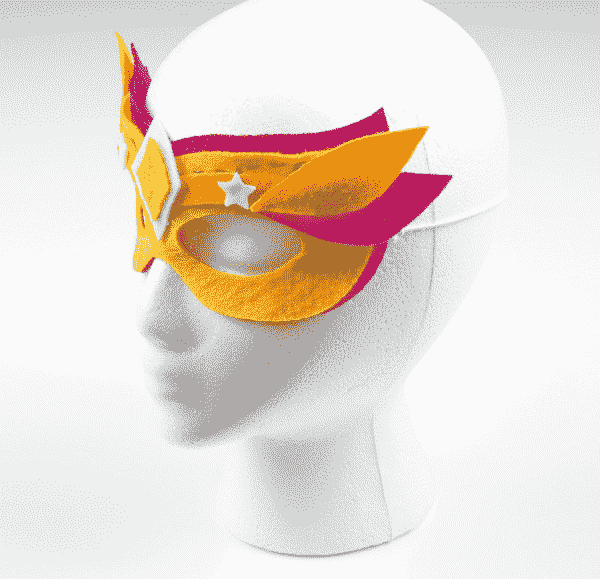
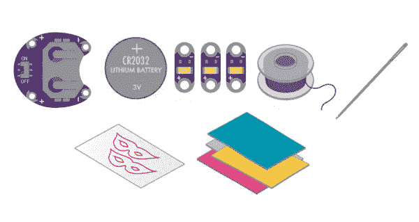

# 照明面罩

> 原文：<https://learn.sparkfun.com/tutorials/illuminated-mask>

## 介绍

电子纺织品是给你的衣服和服装增添魅力的好方法，但是制作一件衣服对你的第一个项目来说可能是一个挑战。制作一个配件是探索小规模缝纫电路的好方法。

在这个项目中，我们将在一个电路中使用多个发光二极管来制作一个发光面具。我们将使用一个并联电路将所有的 LED 连接到电池上，而不是仅仅将一个 LED 缝合到电池座上(就像我们在[发光引脚](https://learn.sparkfun.com/tutorials/glowing-pin)项目中所做的那样)。

设计和建造时间:1 - 2 小时

该项目是 [LilyPad 可缝合电子套件](https://www.sparkfun.com/products/13927)的一部分，看看套件中的其他项目:

*   项目 1: [发光针](https://learn.sparkfun.com/tutorials/glowing-pin)
*   项目三:[点亮毛绒](https://learn.sparkfun.com/tutorials/light-up-plush)
*   项目四:[夜光锦旗](https://learn.sparkfun.com/tutorials/night-light-pennant-with-lilymini-protosnap)

### 推荐阅读

如果这是你的第一个可缝合电子项目，我们建议你阅读我们的 LilyPad 基础教程。

 [### LilyPad 基础:电子缝纫

#### 2016 . 12 . 17](https://learn.sparkfun.com/tutorials/lilypad-basics-e-sewing) Learn how to use conductive thread with LilyPad components.[Favorited Favorite](# "Add to favorites") 16

## 材料和工具

让我们来看一下将你的项目组合在一起所需要的所有东西。

 

将**添加到您的[购物车](https://www.sparkfun.com/cart)中！**

 **### [LilyPad 可缝电子套装](https://www.sparkfun.com/products/13927)

[In stock](https://learn.sparkfun.com/static/bubbles/ "in stock") KIT-13927

LilyPad 可缝制电子套件让您通过以下方式探索电子缝纫和电子纺织品的奇妙世界

$106.959[Favorited Favorite](# "Add to favorites") 39[Wish List](# "Add to wish list")** **### [LilyPad 可缝合电子套件](https://www.sparkfun.com/products/13927)中包含的项目:

*   [LilyPad 硬币电池座](https://www.sparkfun.com/products/13883)
*   [3V 纽扣电池](https://www.sparkfun.com/products/338)
*   [3 个 lily pad led](https://www.sparkfun.com/products/13903)(小心地从五个面板中取出)
*   [导电线](https://www.sparkfun.com/products/10867)
*   [针](https://www.sparkfun.com/products/10405)
*   蒙版模板(2 件)-参见[规划您的项目](https://learn.sparkfun.com/tutorials/illuminated-mask#plannin)获取可打印的下载
*   松紧线
*   毛毡(一张 9 英寸 x12 英寸的工艺毛毡可以制作一个面具；尝试混合色彩，打造更具节日气氛的面具)

Don't have a LilyPad Sewable Electronics Kit? You can follow along with this project using this [wish list](https://www.sparkfun.com/wish_lists/95706) of individual LilyPad pieces. You will need to source your own elastic cord and felt (available at local craft stores) to complete the project.**