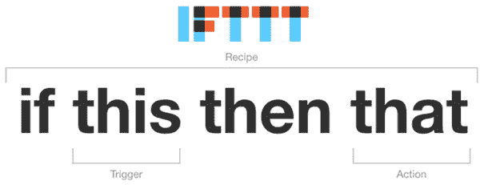
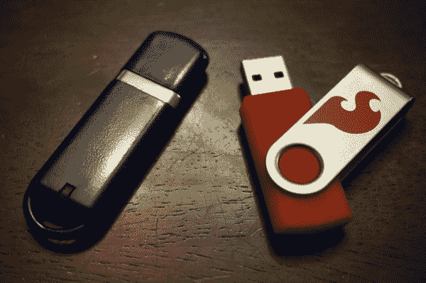

# 使用 Tessel 2 将数据记录到 Google Sheets

> 原文：<https://learn.sparkfun.com/tutorials/logging-data-to-google-sheets-with-the-tessel-2>

## 介绍

我的家庭刚刚成为一架立式钢琴的骄傲的新主人。这架钢琴是我妻子的祖母拥有的，可以说是一件传家宝。它带来了巨大的情感价值，我们想要照顾它是很自然的。把钢琴搬进我们的房子后(这不是一件容易的事)，我的妻子给“钢琴男”打了一个重要的电话，告诉他如何调音、清洁和日常护理。

我坐在附近，无意中听到了“温度波动”和“湿度范围”的说法如果其中一个在某个范围内，钢琴就需要放在房间里的某个位置，而不是另一个位置。听到这个消息，我的脸上掠过一丝微笑，意识到一个新项目的诞生。事实上，我的妻子在电话里告诉那个男人，“温度范围？我丈夫会帮你弄清楚的，我们会让你知道的。”他将得到比他预料的更多的东西！

因此，我开始使用 [Johnny-Five 发明家工具包](https://www.sparkfun.com/products/13847)来记录房间的温度和湿度。

### 记录从来不是为什么的问题，而是如何记录的问题！

以可靠和有用的方式收集数据始终是一项挑战。就嵌入式电子/计算机而言，与其说挑战在于收集大量数据，不如说挑战在于存储容量、格式化数据输出和后处理。

本教程将重点介绍使用 [Johnny-Five Inventor 套件](https://www.sparkfun.com/products/13847)中的 [Tessel 2](https://www.sparkfun.com/products/13841) 和单个[传感器](https://www.sparkfun.com/products/13676)来收集数据，以监控和记录我家钢琴房中的空气温度和湿度。

正如你将在这个项目中看到的，通过使用 [Node.js](https://nodejs.org) 并利用通过其包管理器 [NPM](https://npmjs.com) 支持它的巨大社区，可以简化管理数据收集、格式化数据和处理数据。

我们将研究两种不同的方法来记录这些数据，对其进行格式化，并将其放入 Google Sheets 中，以便能够绘制图表并与他人轻松共享。

### 给猫剥皮的方法不止一种

正如任何电子项目一样，有多种方法可以做到这一点！我们将看看使用 Tessel 2 完成相同任务的两种不同方法。这两种方法的主要区别在于您是否有 WiFi/网络连接。

当谈到这个项目的固件时，这已经被写为一个“选择你自己的冒险”的排序。一种方法是使用文件系统和 USB 驱动器；另一种是使用名为 IFTTT 的物联网服务。每个脚本都有自己的部分，它将为您分解代码，然后我们将整理任何松散的部分。

### 互联网连接方法

如果你通过 WiFi 或以太网连接到互联网，你可以使用节点模块为[If This Then(IFTTT)](https://ifttt.com)构建一个 If TTT 配方，使用 [Maker 通道](https://ifttt.com/maker)将数据发送到 Google Sheet。如果您有网络连接，这是首选方法，因为您将能够实时查看 Google 帐户中的数据，并几乎立即看到变化。

### 本地离线方法

第二种方法做同样的事情，但是需要做更多的工作，就是设置 Tessel 2 将数据记录到 USB 大容量存储设备，然后定期从中提取数据，并手动将其添加到 Google Sheet。这显然需要您做更多的工作，但是在网络连接很差或者没有网络连接的情况下，这是一个很好的选择。

## 硬件概述

### 所需材料

我们设计了这个项目，这样你就可以从 [Johnny-Five Inventors Kit](https://www.sparkfun.com/products/13847) 中构建它，它包括你需要的所有东西，除了 USB 大容量存储设备。几乎每个人都有一个“拇指驱动器”，这是一个完美的用途。如果您手头没有，我们已经在下面的部件列表中添加了一个 microSD 卡和 USB 读卡器。两者都可以！

如果你手头没有 Johnny-Five Inventors 套件，这里有一个零件的愿望清单，这样你就可以单独购买它们。