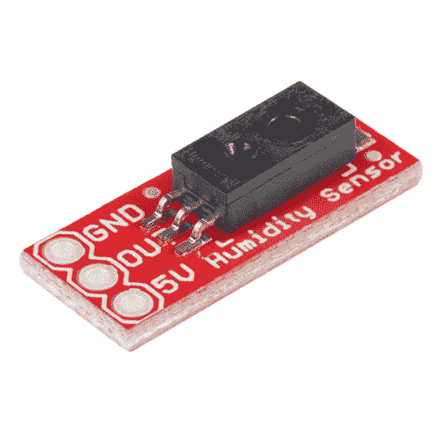

# HIH-4030 湿度传感器连接指南

> 原文：<https://learn.sparkfun.com/tutorials/hih-4030-humidity-sensor-hookup-guide>

## 介绍

[SparkFun HIH-4030 湿度传感器分线点](https://www.sparkfun.com/products/9569)测量霍尼韦尔 HIH-4030 湿度传感器的**相对湿度(%RH)** 。分线点允许您将传感器的模拟输出直接连接到微控制器上的 ADC。

 

将**添加到您的[购物车](https://www.sparkfun.com/cart)中！**

### [斯帕克芬湿度传感器分线点- HIH-4030](https://www.sparkfun.com/products/9569)

[Out of stock](https://learn.sparkfun.com/static/bubbles/ "out of stock") SEN-09569

这是霍尼韦尔的 HIH-4030 湿度传感器的分线板。HIH-4030 测量相对湿度(%RH ),并提供…

$20.507[Favorited Favorite](# "Add to favorites") 25[Wish List](# "Add to wish list")** **施加于电源引脚的电压应在 4-5.8 VDC 范围内，最好为 5V。传感器的典型功耗约为 200μA。

本教程是对 HIH-4030 和 SparkFun 湿度传感器分线点的介绍。它涵盖了分线点的硬件和固件要求，以开始接收相对湿度(%RH)测量值，并记录示例布线、Arduino 代码以及将传感器与温度计配合使用。

当我们浏览连接指南时，您会发现手头有 HIH-4030 数据手册很有用。

[HIH-4030 Datasheet](https://www.sparkfun.com/datasheets/Sensors/Weather/SEN-09569-HIH-4030-datasheet.pdf)

### 所需材料

要启动并运行湿度传感器，您需要以下部件。在本教程中，您将进一步了解如何整合温度传感器，特别是 [SparkFun 的数字温度传感器 Breakout - TMP-102](https://www.sparkfun.com/products/11931) ，以正确确定相对湿度(%RH)。请注意，添加温度传感器是可选的，但本教程将重点介绍其用途。**