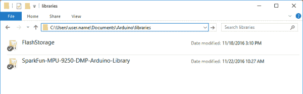

# 9 自由度剃刀 IMU M0 连接指南

> 原文：<https://learn.sparkfun.com/tutorials/9dof-razor-imu-m0-hookup-guide>

## 介绍

[SparkFun 9DoF Razor IMU M0](https://www.sparkfun.com/products/14001) 结合了一个 [SAMD21](https://www.sparkfun.com/products/13664) 微处理器和一个 [MPU-9250](https://www.sparkfun.com/products/13762) 9DoF(九自由度)传感器，以创建一个微小的、可重复编程的多用途惯性测量单元(IMU)。它可以通过编程来监控和记录运动，通过串行端口传输欧拉角，甚至可以用作计步计步器。

[](https://www.sparkfun.com/products/retired/14001) 

### [SparkFun 9DoF 剃刀 IMU M0](https://www.sparkfun.com/products/retired/14001)

[Retired](https://learn.sparkfun.com/static/bubbles/ "Retired") SEN-14001

SparkFun 9DoF Razor IMU M0 将 SAMD21 微处理器与 MPU-9250 9DoF (9 自由度)传感器相结合，以创建…

12 **Retired**[Favorited Favorite](# "Add to favorites") 29[Wish List](# "Add to wish list")

[https://www.youtube.com/embed/SVgCuNJIQ2s/?autohide=1&border=0&wmode=opaque&enablejsapi=1](https://www.youtube.com/embed/SVgCuNJIQ2s/?autohide=1&border=0&wmode=opaque&enablejsapi=1)

9DoF Razor 的 MPU-9250 具有三个三轴传感器，即加速度计、陀螺仪和磁力计，这使它能够检测线性加速度、角速度和磁场矢量。板载微处理器- Atmel 的 [SAMD21G18A](http://www.atmel.com/devices/ATSAMD21G18.aspx) -是一种 Arduino 兼容的 32 位 ARM Cortex-M0+微控制器，也是 [Arduino Zero](https://www.arduino.cc/en/Main/ArduinoBoardZero) 和 [SAMD21 Mini Breakout](https://www.sparkfun.com/products/13664) 板上的特色。

除了一对 IC，9DoF Razor IMU 还包括一个 **SD 卡插座**、 **LiPo 电池充电器**、电源控制开关和一系列用于项目扩展的 I/O 插座。它预编程有示例固件和 Arduino 兼容的引导加载程序，因此您可以定制固件并通过 USB 连接刷新新代码。

### 本教程涵盖的内容

本教程既是主要的文档来源，也是 SparkFun 9DoF 剃刀 IMU M0 的入门指南。前两节记录了电路板的硬件和固件特性，而后半节演示了如何使用 Arduino IDE 和我们的 MPU-9250 Arduino 库对 Razor IMU 进行重新编程，以满足您的特定需求。

### 材料清单

9 自由度剃刀 IMU M0 来填充几乎所有你需要利用 MPU-9250 9 自由度传感器。除了这块板，你可能还需要几样东西，其中大部分可能已经在你的工具箱里了。

A [micro-B USB 线缆](https://www.sparkfun.com/products/10215)可用于给剃须刀供电和重新编程。但是，如果你真的想让板移动，你需要一个[单体锂聚合物(脂)电池](https://www.sparkfun.com/search/results?term=lithium%20polymer&tab=products)，可以通过将 9DoF 剃须刀插入 USB 电源进行充电。另外，如果你想记录数据，9DoF Razor IMU 的 SD 插座支持任何 [SD 卡](https://www.sparkfun.com/products/11609)。

[](https://www.sparkfun.com/products/13854) 

将**添加到您的[购物车](https://www.sparkfun.com/cart)中！**

 **### [锂离子电池- 850mAh](https://www.sparkfun.com/products/13854)

[In stock](https://learn.sparkfun.com/static/bubbles/ "in stock") PRT-13854

这是基于锂离子化学的非常薄、非常轻的电池。每个电池在 850℃时输出 3.7V 的标称电压…

$10.952[Favorited Favorite](# "Add to favorites") 17[Wish List](# "Add to wish list")****[](https://www.sparkfun.com/products/13851) 

将**添加到您的[购物车](https://www.sparkfun.com/cart)中！**

 **### [锂离子电池- 400mAh](https://www.sparkfun.com/products/13851)

[In stock](https://learn.sparkfun.com/static/bubbles/ "in stock") PRT-13851

这是一种基于锂离子化学的非常小、非常轻的电池，具有目前最高的能量密度…

$5.5010[Favorited Favorite](# "Add to favorites") 41[Wish List](# "Add to wish list")****[](https://www.sparkfun.com/products/10215) 

将**添加到您的[购物车](https://www.sparkfun.com/cart)中！**

 **### [USB micro-B 线- 6 脚](https://www.sparkfun.com/products/10215)

[In stock](https://learn.sparkfun.com/static/bubbles/ "in stock") CAB-10215

USB 2.0 型到微型 USB 5 针。这是一种新的、更小的 USB 设备连接器。微型 USB 连接器大约是…

$5.5014[Favorited Favorite](# "Add to favorites") 21[Wish List](# "Add to wish list")****[](https://www.sparkfun.com/products/retired/11609) 

### [带适配器的 MicroSD 卡——8GB](https://www.sparkfun.com/products/retired/11609)

[Retired](https://learn.sparkfun.com/static/bubbles/ "Retired") COM-11609

这是一个 8g 的 microSD 存储卡。它非常适合大规模数据记录，而不会占用太多空间。这些 microSD 卡…

2 **Retired**[Favorited Favorite](# "Add to favorites") 7[Wish List](# "Add to wish list")****** ******最后，如果你想利用 9DoF Razor IMU 的 I/O 和电源插座，你可能需要[焊接工具](https://www.sparkfun.com/categories/49)和[接头](https://www.sparkfun.com/products/115)或[导线](https://www.sparkfun.com/products/11375)。

[](https://www.sparkfun.com/products/11375) 

将**添加到您的[购物车](https://www.sparkfun.com/cart)中！**

 **### [](https://www.sparkfun.com/products/11375)

[In stock](https://learn.sparkfun.com/static/bubbles/ "in stock") PRT-11375

各种颜色的电线:你知道这是一个美丽的东西。六种不同颜色的绞线装在一个纸板盒里…

$22.5019[Favorited Favorite](# "Add to favorites") 46[Wish List](# "Add to wish list")****[](https://www.sparkfun.com/products/115) 

将**添加到您的[购物车](https://www.sparkfun.com/cart)中！**

 **### [女标题](https://www.sparkfun.com/products/115)

[In stock](https://learn.sparkfun.com/static/bubbles/ "in stock") PRT-00115

单排 40 孔，内螺纹接头。可以用一把钢丝钳切割成合适的尺寸。标准 0.1 英寸间距。我们广泛使用它们…

$1.758[Favorited Favorite](# "Add to favorites") 71[Wish List](# "Add to wish list")****[](https://www.sparkfun.com/products/9325) 

将**添加到您的[购物车](https://www.sparkfun.com/cart)中！**

 **### [无铅焊料- 100 克线轴](https://www.sparkfun.com/products/9325)

[In stock](https://learn.sparkfun.com/static/bubbles/ "in stock") TOL-09325

这是带有水溶性树脂芯的无铅焊料的基本线轴。0.031 英寸规格，100 克。这是一个好主意…

$9.957[Favorited Favorite](# "Add to favorites") 33[Wish List](# "Add to wish list")****[](https://www.sparkfun.com/products/9507) 

将**添加到您的[购物车](https://www.sparkfun.com/cart)中！**

 **### [烙铁- 30W(美国，110V)](https://www.sparkfun.com/products/9507)

[33 available](https://learn.sparkfun.com/static/bubbles/ "33 available") TOL-09507

这是一个非常简单的固定温度，快速加热，30W 110/120 VAC 烙铁。我们真的很喜欢使用更贵的 iro…

$10.957[Favorited Favorite](# "Add to favorites") 21[Wish List](# "Add to wish list")******** ********### 推荐阅读

随时跳转到使用和开发 9 自由度剃刀 IMU M0 -我们已经尽力使董事会易于使用，无论你的电子经验水平。如果你想做一些预读，这里有几个教程我们可以推荐:

[](https://learn.sparkfun.com/tutorials/gyroscope) [### 陀螺仪](https://learn.sparkfun.com/tutorials/gyroscope) Gyroscopes measure the speed of rotation around an axis and are an essential part in determines ones orientation in space.[Favorited Favorite](# "Add to favorites") 22[](https://learn.sparkfun.com/tutorials/accelerometer-basics) [### 加速度计基础知识](https://learn.sparkfun.com/tutorials/accelerometer-basics) A quick introduction to accelerometers, how they work, and why they're used.[Favorited Favorite](# "Add to favorites") 29[](https://learn.sparkfun.com/tutorials/samd21-minidev-breakout-hookup-guide) [### SAMD21 迷你/开发分线连接指南](https://learn.sparkfun.com/tutorials/samd21-minidev-breakout-hookup-guide) An introduction to the Atmel ATSAMD21G18 microprocessor and our Mini and Pro R3 breakout boards. Level up your Arduino-skills with the powerful ARM Cortex M0+ processor.[Favorited Favorite](# "Add to favorites") 7[](https://learn.sparkfun.com/tutorials/mpu-9250-hookup-guide) [### MPU-9250 连接指南](https://learn.sparkfun.com/tutorials/mpu-9250-hookup-guide) Get up and running with the MPU-9250 9-axis MEMS sensor.[Favorited Favorite](# "Add to favorites") 8

## 硬件概述

9DoF Razor IMU M0 是一个双面组件，这意味着电路板的两面都有很多东西。这里有一个我们称之为“顶部”的概述。

[](https://cdn.sparkfun.com/assets/learn_tutorials/5/6/7/top-annotated.jpg)

而电路板的底部包括各种连接器、电源控制开关和 led。

[](https://cdn.sparkfun.com/assets/learn_tutorials/5/6/7/bottom-annotated.jpg)

**开源硬件！**9 DOF Razor IMU M0 是一种开源硬件设计。随意下载[原理图](https://cdn.sparkfun.com/assets/learn_tutorials/5/6/7/sparkfun-9dof-razor-imu-v30-schematic.pdf) (PDF)、 [Eagle 文件](https://cdn.sparkfun.com/assets/learn_tutorials/5/6/7/sparkfun-9dof-razor-imu-v30_Eagle.zip) (PCB 设计)，或者在我们的 [GitHub 资源库](https://github.com/sparkfun/9DOF_Razor_IMU)中浏览设计历史。

### 为 9 自由度剃刀式惯性测量组合 M0 供电

Razor IMU 设计为使用 USB 电源或单节锂聚合物(LiPo)电池。黑色的 PH 系列 JST 连接器应该与我们目录中的任何[类似的 LiPo 电池](https://www.sparkfun.com/search/results?term=lithium%20polymer&tab=products)匹配-只要确保它们是单电池(标称电压 3.7-4.2V)。

[](https://cdn.sparkfun.com/assets/learn_tutorials/5/6/7/hardware-usb-lipo-plugged.jpg)*Connect both USB and a LiPo to charge the battery.*

如果 USB 和 LiPo 电池同时插入主板，LiPo 将以高达 450mA 的速率**充电。充电状态由**黄色充电 LED** 指示，当电池充满电后会熄灭。**

**450mA 充电电流**最大充电电流由外部电阻设定，不可(轻易)修改。安全实践表明，不要以超过 1C 的电流为您的 LiPo 电池充电，这意味着容量低于约 450mAh 的 LiPo 电池不建议用于此主板。

来自 USB 或 LiPo 电池电源的电源被下调至 3.3V(T1)，用于为 SAMD21 和 MPU-9250 供电。调节器的容量约为 600 毫安，这意味着如果你想从标有 *3V3* 的引脚为其他设备供电，你应该有足够的电流开销。

*VIN* 、 *VBAT* 和 *GND* 引脚可以用来为 9DoF Razor IMU 的 3.3V 稳压器供电，而不是 USB 或 LiPo JST 输入。**在 *VIN* 引脚上的电压不应超过 6V** ，并且 *VBAT* 引脚只能连接到一个单节 LiPo 电池。

最后，电路板底部的**开/关开关**控制两个输入源和电路板上其余元件之间的电源。当处于“关闭”位置时，LiPo 电池仍能充电，但其他组件不应通电。

### SAMD21 和电源引脚分线

在 9DoF Razor IMU 的小尺寸允许的情况下，我们尽可能多地使用了 SAMD21 的 I/O 引脚。这包括引脚 10-13、模数转换器输入 A0-A4、RX、TX 以及 I ² C 引脚、SDA 和 SCL。

[](https://cdn.sparkfun.com/assets/learn_tutorials/5/6/7/gpio-highlighted.jpg)

SDA 和 SCL 引脚与 MPU-9250 在同一条 I ² C 总线上，但只要任何额外的 I ² C 设备不共享 IMU 的 7 位地址(0x68 和 0x0C)，这应该不是问题。

您可以将接头或电线焊接到这些引脚上，以扩展电路板的功能。例如，您可以将一个 [BME280 分线点](https://www.sparkfun.com/products/13676)直接插入 I ² C 端口，并为您的 IMU 添加高度和温度感测。

[](https://cdn.sparkfun.com/assets/learn_tutorials/5/6/7/hardware-bme280-connected.jpg)*A number of our I²C-based breakouts use the same 4-pin footprint, so you can interface them directly!*

如果您想用 JTAG 调试器对芯片进行编程，SAMD21 的单线调试(SWD)端口也在电路板的顶部断开。该端口的引脚排列与 [10 针 Cortex 调试连接器标准](http://infocenter.arm.com/help/topic/com.arm.doc.faqs/attached/13634/cortex_debug_connectors.pdf)相匹配。白色“凹口”表示该端口的引脚 1。

### MPU-9250 加速度/陀螺仪/磁定向

加速度计、陀螺仪和磁力计的 x、y 和 z 轴方向由 MPU-9250 的位置决定。为了便于参考，我们在电路板的顶部记录了这些向量。

请注意，磁力计的 x 和 y 轴与加速度计和陀螺仪的 x 和 y 轴相反，z 轴也相反。

## 驱动程序(如果需要的话)

**Heads up!** Please be aware that the 9DoF Razor IMU M0 is **NOT currently supported on Windows 8** due to a lack of support drivers for the specific OS's.

### Windows 10

第一次将 9DoF Razor IMU M0 插入电脑时，Windows 会尝试在互联网上搜索驱动程序。它们应该会自动安装 Windows 10，不会出现任何问题。

#### 手动安装

如果您遇到 Windows 10 的问题，您可能需要手动安装驱动程序来启用主板的通信设备类别(CDC) USB 配置文件。如果您的主板没有显示为 COM 端口，请单击下面的按钮下载驱动程序。

[下载 SparkFun SAMD21 Windows 驱动程序进行手动安装(ZIP)](https://cdn.sparkfun.com/assets/learn_tutorials/5/6/7/9dof-razor-imu-m0-drivers.zip)

有关安装驱动程序的帮助，请参考 SAMD21 分线连接指南中的[说明。](https://learn.sparkfun.com/tutorials/samd21-minidev-breakout-hookup-guide/drivers-if-you-need-them)

### Windows 7

对于 Windows 7，您需要使用 [SAMD Windows 7 安装程序](https://github.com/sparkfun/samd_windows7_installer/releases)安装 SAMD 驱动程序。单击下面的链接下载，并按照提示进行安装。

[SAMD Windows 7 Installer](https://github.com/sparkfun/samd_windows7_installer/releases)

有关安装驱动程序的帮助，请参考 SAMD21 分线连接指南中的[说明。](https://learn.sparkfun.com/tutorials/samd21-minidev-breakout-hookup-guide/drivers-if-you-need-them#windows-7)

## 开始使用示例固件

除了 Arduino 引导加载程序之外，我们还在 9DoF Razor IMU M0 上加载了一些示例固件——足以至少证明传感器的运动跟踪是可行的，甚至可以在 SD 卡上做一些记录。要开始使用示例固件，只需**将 Razor IMU 插入计算机**。

[](https://cdn.sparkfun.com/assets/learn_tutorials/5/6/7/imu-plugged-usb-sd.jpg)

插上电路板后，它应该显示为串行端口。在 Windows 上，它看起来类似于 *COMX* ，在 Mac 上，它应该类似于*/dev/tty . USB serial-ABCD 12*。

找到你的板的端口后，打开一个**串行终端**并将波特率设置为 115200 bps。 **Arduino 串行监视器**很适合这个目的，或者你可以下载一个我们[推荐的终端程序](https://learn.sparkfun.com/tutorials/terminal-basics)。

打开端口后，您的 9DoF Razor IMU 应该立即开始输出加速度计、陀螺仪和磁力计读数。

[](https://cdn.sparkfun.com/assets/learn_tutorials/5/6/7/serial-monitor-screenshot.png)

此默认字符串的格式为:

`<timeMS>, <accelX>, <accelY>, <accelZ>, <gyroX>, <gyroY>, <gyroZ>, <magX>, <magY>, <magZ>`

可以通过发送以下任何命令来修改该字符串:

*   `(空格)-暂停/恢复串口打印`
`*   **`t`** -打开或关闭时间读数*   **`a`** -打开或关闭加速计读数*   **`g`** -打开或关闭陀螺仪读数*   **`m`** -打开或关闭磁力计读数*   **`c`** -从原始读数切换到计算值*   **`q`** -打开或关闭四元数读数(在放大读数后打印 qw、qx、qy 和 qz)*   **`e`** -打开或关闭欧拉角计算(俯仰、滚动、偏航)(四元数后打印)*   **`h`** -打开或关闭航向读数*   **`r`** -在 1-100Hz (1，10，20，..., 100)*   **`A`** -调整加速度计满量程范围。在 2、4、8 和 16g 之间循环。*   **`G`** -调整陀螺仪满量程范围。在 250、500、1000、2000 dps 之间循环。*   **`s`** -启用/禁用 SD 卡记录`

 `所有设置都存储在**非易失性存储器**中，所以下次你启动你的 9DoF 剃须刀时，它应该输出你之前配置的相同数据。

除了记录到你的串行端口，固件还被设计成**将数据记录到 SD 卡**，如果它存在的话。加载一个，下次你把 SD 卡插入阅读器时，你应该会得到 IMU 日志文件。

9DoF Razor IMU 的固件可在产品的 [GitHub 存储库](https://github.com/sparkfun/9DOF_Razor_IMU/tree/v30/Firmware/_9DoF_Razor_M0_Firmware)中获得。要上传固件，你需要在你的机器上安装 SparkFun SAMD21 板定义和 [SparkFun MPU-9250 DMP Arduino 库](https://github.com/sparkfun/SparkFun_MPU-9250-DMP_Arduino_Library)。这正是我们接下来要记录的...

## 安装 9DoF 剃刀 Arduino 核心

9DoF Razor IMU M0 是围绕 SAMD21 设计的，samd 21 与 Arduino Zero 上的处理器相同，这意味着只需点击几下鼠标即可为主板添加 Arduino 支持。这一节描述了将 SAMD 核心安装到 Arduino 库中所需的步骤(这听起来比实际更可怕)。

**更新 Arduino！**此设置要求*至少拥有* Arduino 版本 1.6.4 或更高版本。我们已经在 1.6.12 上测试了它，并推荐该版本的 IDE。如果你运行的是旧版本的 Arduino，可以考虑访问 [arduino.cc](https://www.arduino.cc/en/Main/Software) 获取最新最好的版本。

### 安装 Arduino SAMD 板

首先，你需要安装各种工具，包括充满通用代码的[低级 ARM Cortex 库](http://www.arm.com/products/processors/cortex-m/cortex-microcontroller-software-interface-standard.php)、编译你的代码的 [arm-gcc](https://launchpad.net/gcc-arm-embedded) 和通过引导程序上传代码的 [bossa](http://www.shumatech.com/web/products/bossa) 。这些工具与 Arduino Zero 的 SAMD 板定义打包在一起。

要安装 Arduino SAMD 板定义，导航到您的板管理器(**工具** > **板** > **板管理器)...**)，然后找到 **Arduino SAMD 板(32 位 ARM Cortex-M0+)** 的入口。选择它，并安装最新版本(最近更新到 1.6.8)。

[](https://cdn.sparkfun.com/assets/learn_tutorials/5/6/7/arduino-samd-install.png)

下载和安装工具可能需要几分钟——特别是 arm-gcc 将需要最长的时间，它大约有 250MB。

安装后，Arduino-blue“已安装”文本应该出现在 SAMD 主板列表条目的旁边。

### 安装 SparkFun 板定义

现在你的 ARM 工具已经安装好了，还需要最后一点设置来增加对 SparkFun SAMD 板的支持。首先，打开你的 Arduino 首选项(**文件** > **首选项**)。然后找到**附加董事会经理网址**文本框，并粘贴以下链接:

```
https://raw.githubusercontent.com/sparkfun/Arduino_Boards/master/IDE_Board_Manager/package_sparkfun_index.json 
```

[](https://cdn.sparkfun.com/assets/learn_tutorials/5/6/7/arduino-board-add.png)

然后点击“确定”，并返回到**电路板管理器**菜单。你应该能为 **SparkFun SAMD 板**找到一个新条目。

[](https://cdn.sparkfun.com/assets/learn_tutorials/5/6/7/arduino-sparkfun-samd-install.png)

这个安装应该快得多；在前面的部分中，您已经完成了繁重的工作。

### 选择板和串行端口

一旦安装好主板，你应该会在你的**工具** > **主板**列表中看到一些新条目，包括“SparkFun SAMD (32 位 ARM Cortex-M0+)主板”菜单下的 **SparkFun 9DoF 剃刀 IMU M0** 。

[](https://cdn.sparkfun.com/assets/learn_tutorials/5/6/7/arduino-board-select.png)

最后，通过导航回到**工具** > **端口**菜单，选择你的 9DoF 剃刀端口。

[](https://cdn.sparkfun.com/assets/learn_tutorials/5/6/7/arduino-port-select.png)

在下一节中，我们将加载示例固件，以便您在创建自己的运动感测项目时，可以对其进行定制和构建。

#### 解决纷争

如果你的 9 自由度 Razor IMU 无法进入引导程序，或者获取新代码，你可以通过在启动时保持 SCL 引脚低电平**来强制它进入引导程序。关闭 IMU 的开关，用跳线将 SCL 和 GND 连接起来，然后重新打开开关。在引导加载程序中，蓝色针脚 13 指示灯应保持亮起。**

## 库和示例固件

除了 SAMD 板定义，9DoF Razor IMU M0 的示例固件还需要一个额外的库: [SparkFun MPU-9250 数字运动处理(DMP)库](https://github.com/sparkfun/SparkFun_MPU-9250-DMP_Arduino_Library)。你可以从 GitHub 获取 MPU-9250-DMP 库，或者点击下面的链接:

[Download the SparkFun MPU-9250 DMP Library](https://github.com/sparkfun/SparkFun_MPU-9250-DMP_Arduino_Library/archive/master.zip)

你还需要在你的机器上安装 [FlashStorage Arduino 库](https://github.com/cmaglie/FlashStorage)。这个库允许您的 SAMD21 的多余闪存替代 EEPROM -给它非易失性存储器，以便它可以保留您的串行命令。

[Download the FlashStorage Arduino Library](https://cdn.sparkfun.com/assets/learn_tutorials/5/6/7/FlashStorage.zip)

FlashStorage 库是可选的。通过注释掉 *config.h* 中的 [`ENABLE_NVRAM_STORAGE`行](https://github.com/sparkfun/9DOF_Razor_IMU/blob/v30/Firmware/_9DoF_Razor_M0_Firmware/config.h#L17)来禁用它。如果没有这个库，重新启动或断电时，更改的设置将不会继续。

要安装库，解压缩 zip 文件，并将库文件夹放入 Arduino sketchbook。要获得更多安装 Arduino 库的帮助，请查看我们的[安装 Arduino 库教程](https://learn.sparkfun.com/tutorials/installing-an-arduino-library)。

[](https://cdn.sparkfun.com/assets/learn_tutorials/5/6/7/arduino-library-folder.png)

安装完库后，打开 Arduino(或者关闭并重启它，如果它是打开的)。

### 下载并上传示例固件

9DoF Razor IMU M0 的示例固件可以在我们的 [9DoF Razor GitHub 库](https://github.com/sparkfun/9DOF_Razor_IMU/tree/v30/Firmware/_9DoF_Razor_M0_Firmware)中找到。或者你可以点击下面的按钮下载。

[Download the 9DoF Razor IMU M0's Example Firmware](https://cdn.sparkfun.com/assets/learn_tutorials/5/6/7/_9DoF_Razor_M0_Firmware-v1.0.1.zip)

固件包括一对文件——标准的*。ino* 文件和一个 *config.h* 文件，该文件主要由定义组成，您可以修改这些定义来快速定制固件。在尝试编译和上传之前，请确保在 Arduino IDE 中打开了这两个选项卡。

[](https://cdn.sparkfun.com/assets/learn_tutorials/5/6/7/9dof_razor_firmware_ide.png)

如果 Arduino IDE 中没有 *config.h* 文件，您可以创建一个新的选项卡(通过点击 IDE 右上角的向下箭头)并从[这里](https://raw.githubusercontent.com/sparkfun/9DOF_Razor_IMU/v30/Firmware/_9DoF_Razor_M0_Firmware/config.h)复制/粘贴它。

一旦你安装了库，加载了代码，并且选择了 spark fun 9 DOF 剃刀 M0 板，将它上传到你的板上。你可能不会在你的 9DoF Razor IMU 上看到任何新的行为，但这将证明你已经正确安装了所有的东西。

## 使用 MPU-9250 DMP Arduino 库

这里有一些快速提示，帮助您开始使用 SparkFun MPU-9250 DMP Arduino 库为 9DoF Razor IMU M0 编写自己的固件。

### 建立

与任何库一样，要在你的草图中调用它，你需要在顶部包含它。你还需要创建一个类型为`MPU9250_DMP`的对象——我们将创建一个名为`imu`的对象，它将在整个草图中使用。

```
language:c
#include <SparkFunMPU9250-DMP.h> // Include SparkFun MPU-9250-DMP library
//#include <Wire.h> // Depending on your Arduino version, you may need to include Wire.h

MPU9250_DMP imu; // Create an instance of the MPU9250_DMP class 
```

然后，在`setup`函数中，通过调用`imu.begin()`初始化 MPU-9250。您可以检查该函数的返回值，以确保 IMU 连接正确且初始化成功。

```
language:c
if (imu.begin() != INV_SUCCESS)
{
    while (1)
    {
        // Failed to initialize MPU-9250, loop forever
    }
} 
```

注意，`imu.begin()`——实际上，这个库中所有的错误返回函数——在成功时返回一个 **`0`。检查它们是否返回`INV_SUCCESS`进行更详细的错误检查。**

### 配置 MPU-9250

一旦你初始化了 MPU-9250，你就可以根据自己的需要进行配置。您可以使用`setSensors`启用/禁用 IMU 中的特定传感器。例如，禁用陀螺仪和磁力计可以节省大量功耗。

```
language:c
// Use setSensors to turn on or off MPU-9250 sensors.
// Any of the following defines can be combined:
// INV_XYZ_GYRO, INV_XYZ_ACCEL, INV_XYZ_COMPASS,
// INV_X_GYRO, INV_Y_GYRO, or INV_Z_GYRO
imu.setSensors(INV_XYZ_GYRO | INV_XYZ_ACCEL | INV_XYZ_COMPASS); // Enable all sensors 
```

您还可以使用`setAccelFSR`和`setGyroFSR`功能设置加速度计和陀螺仪的**满量程范围**。(磁力计只有一个可能的满量程范围- 4912 T。)

```
language:c
// Use setGyroFSR() and setAccelFSR() to configure the
// gyroscope and accelerometer full scale ranges.
// Gyro options are +/- 250, 500, 1000, or 2000 dps
imu.setGyroFSR(2000); // Set gyro to 2000 dps
// Accel options are +/- 2, 4, 8, or 16 g
imu.setAccelFSR(2); // Set accel to +/-2g 
```

陀螺仪可以设置为 250、500、1000 或 2000 度每秒(dps)的范围，加速度计支持 2、4、8 或 16 *g* 的范围。

最后，您可以配置传感器的**数字低通滤波器** (DLPF)和**采样率**:

```
language:c
// setLPF() can be used to set the digital low-pass filter
// of the accelerometer and gyroscope.
// Can be any of the following: 188, 98, 42, 20, 10, 5
// (values are in Hz).
imu.setLPF(5); // Set LPF corner frequency to 5Hz

// The sample rate of the accel/gyro can be set using
// setSampleRate. Acceptable values range from 4Hz to 1kHz
imu.setSampleRate(10); // Set sample rate to 10Hz

// Likewise, the compass (magnetometer) sample rate can be
// set using the setCompassSampleRate() function.
// This value can range between: 1-100Hz
imu.setCompassSampleRate(10); // Set mag rate to 10Hz 
```

加速度计和陀螺仪的采样率可以达到 1kHz，而磁力计的最大采样率为 100Hz。低通滤波器的转折频率(仅适用于加速度计和陀螺仪)可以设置为 5、10、20、42、98 或 188Hz。

### 从 MPU-9250 读取

一旦您的 IMU 配置满足您的需求，从传感器读取数据就像调用`imu.update()`并检查`ax`、`ay`、`az`、`ax`、`ay`、`az`、`ax`、`ay`和`mz`类变量(例如`imu.ax`、`imu.gy`、`imu.mz`等)一样简单。

```
language:c
// Call update() to update the imu objects sensor data. You can specify 
// which sensors to update by OR'ing UPDATE_ACCEL, UPDATE_GYRO, 
// UPDATE_COMPASS, and/or UPDATE_TEMPERATURE.
// (The update function defaults to accel, gyro, compass, so you don't 
// have to specify these values.)
imu.update(UPDATE_ACCEL | UPDATE_GYRO | UPDATE_COMPASS); 
```

通过将变量传递给`calcGyro`、`calcAccel`和`calcMag`函数，可以将变量从原始的、**带符号的 16 位值**转换为传感器各自的单位:

```
language:c
float accelX = imu.calcAccel(imu.ax); // accelX is x-axis acceleration in g's
float accelY = imu.calcAccel(imu.ay); // accelY is y-axis acceleration in g's
float accelZ = imu.calcAccel(imu.az); // accelZ is z-axis acceleration in g's

float gyroX = imu.calcGyro(imu.gx); // gyroX is x-axis rotation in dps
float gyroY = imu.calcGyro(imu.gy); // gyroY is y-axis rotation in dps
float gyroZ = imu.calcGyro(imu.gz); // gyroZ is z-axis rotation in dps

float magX = imu.calcMag(imu.mx); // magX is x-axis magnetic field in uT
float magY = imu.calcMag(imu.my); // magY is y-axis magnetic field in uT
float magZ = imu.calcMag(imu.mz); // magZ is z-axis magnetic field in uT 
```

### 使用中断或数据就绪

您可以使用 MPU-9250 的中断输出来告诉您新数据何时准备好，而不是不断轮询`update`函数。首先在设置区，你要调用`enableInterrupt`。(不要忘记将 Arduino 的中断引脚也设置为输入！)

```
language:c
#define INTERRUPT_PIN 4 // MPU-9250 INT pin tied to D4
...
void setup()
{
    pinMode(INTERRUPT_PIN, INPUT_PULLUP); // Set interrupt as an input w/ pull-up resistor
    ...
    // Use enableInterrupt() to configure the MPU-9250's 
    // interrupt output as a "data ready" indicator.
    imu.enableInterrupt();

    // The interrupt level can either be active-high or low. Configure as active-low.
    // Options are INT_ACTIVE_LOW or INT_ACTIVE_HIGH
    imu.setIntLevel(INT_ACTIVE_LOW);

    // The interrupt can be set to latch until data is read, or as a 50us pulse.
    // Options are INT_LATCHED or INT_50US_PULSE
    imu.setIntLatched(INT_LATCHED);
} 
```

您可以将中断的活动级别设置为高或低，并将其设置为锁存，直到传感器被读取或发送 50 s 脉冲。

配置完成后，只需读取 Arduino 中断引脚的状态。如果它是活动的，你会知道更新 IMU 的传感器。

```
language:c
if ( digitalRead(INTERRUPT_PIN) == LOW ) // If MPU-9250 interrupt fires (active-low)
{
    imu.update() // Update all sensor's
    // ... do stuff with imu.ax, imu.ay, etc.
} 
```

或者，如果您不想使用中断引脚，您可以检查`dataReady`的返回值，以检查新数据是否可用。如果新数据准备好了，这个函数返回一个布尔值 true。

```
language:c
if ( imu.dataReady() ) // If new IMU data is available
{
    imu.update(); // Update all sensor's
    ...
} 
```

### 使用数字运动处理器

MPU-9250 的数字运动处理器(DMP)允许您将四元数计算、计步和方向确定等任务卸载给 IMU。

#### 配置数字运动处理器(DMP)

要使用这些函数，首先需要通过调用`dmpBegin`函数来初始化 DMP。这在`imu.begin()` 之后应该叫**。**

`dmpBegin`的第一个参数指定您想要启用 DMP 的哪些功能。它可以是以下任一项的“或”组合:

*   `DMP_FEATURE_PEDOMETER` - **计步器**计算步数和完成这些步数的时间。
*   `DMP_FEATURE_TAP` -单和/或双- **点击检测**三个平面中的任何一个。
*   `DMP_FEATURE_ANDROID_ORIENT` -检测纵向、横向、反向纵向和反向横向**方向**。
*   `DMP_FEATURE_6X_LP_QUAT` - 6 轴(加速度计和陀螺仪)**四元数**计算。
*   `DMP_FEATURE_LP_QUAT` -低功耗(仅加速度计)**四元数**计算。
*   `DMP_FEATURE_GYRO_CAL` - **陀螺仪校准**。8 秒钟无运动后，陀螺仪轴重新校准至 0。
*   `DMP_FEATURE_SEND_RAW_ACCEL` -向 DMP 的 FIFO 缓冲器发送原始加速度计数据。
*   `DMP_FEATURE_SEND_RAW_GYRO` -向 DMP 的 FIFO 缓冲器发送原始陀螺仪数据。
*   `DMP_FEATURE_SEND_CAL_GYRO` -发送*校准的*陀螺仪数据到 DMP 的 FIFO 缓冲器。

注意，这一对四元数计算特性是互斥的——一次只能使用其中一个特性。校准和原始陀螺仪数据收集功能也是如此。

`dmpBegin`的第二个可选参数是更新速率，可以在 4 到 200 Hz 之间。下面是一个简单的示例，演示了如何初始化 DMP 以传输加速度计、校准陀螺仪和四元数数据:

```
language:c
void setup
{
    imu.begin(); // Initialize the MPU-9250.

    // Initialize the digital motion processor
    imu.dmpBegin(DMP_FEATURE_SEND_RAW_ACCEL | // Send accelerometer data
                 DMP_FEATURE_GYRO_CAL       | // Calibrate the gyro data
                 DMP_FEATURE_SEND_CAL_GYRO  | // Send calibrated gyro data
                 DMP_FEATURE_6X_LP_QUAT     , // Calculate quat's with accel/gyro
                 10);                         // Set update rate to 10Hz.
} 
```

#### 阅读 DMP

DMP 将其数据传输到 MPU-9250 的 512 字节**先进先出(FIFO)缓冲器**，因此要从 DMP 获取数据，必须更新 FIFO。你可以使用`fifoAvailable`功能，来检查*FIFO 有多满*。然后调用`dmpUpdateFifo`从 FIFO 顶部读取。

```
language:c
if ( imu.fifoAvailable() > 0 ) / Check for new data in the FIFO
{
    // Use dmpUpdateFifo to update the ax, gx, qx, etc. values
    if ( imu.dmpUpdateFifo() == INV_SUCCESS )
    {
        // The following variables will have data from the top of the FIFO:
        // imu.ax, imu.ay, imu.az, -- Accelerometer
        // imu.gx, imu.gy, imu.gz -- calibrated gyroscope
        // and imu.qw, imu.qx, imu.qy, and imu.qz -- quaternions
    }
} 
```

#### 通过硬件 UART 引脚的串行输出

默认测试代码不会自动向硬件 Tx 和 Rx 引脚输出串行数据。它当前输出到`SerialUSB`端口(即 Arduino 串行监视器)。要调整硬件串行 UART 引脚，请调整第 25 行上的 [**config.h** 文件，以打印到`Serial1`端口(即 Rx 的引脚 0 和 Tx 的引脚 1):](https://github.com/sparkfun/9DOF_Razor_IMU/blob/master/Firmware/_9DoF_Razor_M0_Firmware/config.h#L25)

```
language:c
#define LOG_PORT SERIAL_PORT_USBVIRTUAL 
```

到

```
language:c
#define LOG_PORT SERIAL_PORT_HARDWARE 
```

此外，默认固件目前正在等待我们的 QC 测试程序下的“`$`”，因此您需要通过更改以下内容来注释掉 _9DoF_Razor_M0_Firmware.ino 中的[行 131:](https://github.com/sparkfun/9DOF_Razor_IMU/blob/master/Firmware/_9DoF_Razor_M0_Firmware/_9DoF_Razor_M0_Firmware.ino#L131)

```
language:c
Serial1.begin(9600); 
```

到

```
language:c
//Serial1.begin(9600); 
```

另外，你需要注释掉 _9DoF_Razor_M0_Firmware.ino 中的[行 163。我们建议通过添加一个`//`来注释掉这段代码，它表示:](https://github.com/sparkfun/9DOF_Razor_IMU/blob/master/Firmware/_9DoF_Razor_M0_Firmware/_9DoF_Razor_M0_Firmware.ino#L163)

```
language:c
if ( Serial1.available() )
{
if ( Serial1.read() == '$' ) production_testing();
} 
```

在注释掉这些行之后，它应该看起来像下面这样:

```
language:c
//if ( Serial1.available() )
//{
//  if ( Serial1.read() == '$' ) production_testing();
//} 
```

在初始化串行端口以匹配接收串行设备时，一定要更改波特率。[默认为 115200 波特](https://github.com/sparkfun/9DOF_Razor_IMU/blob/master/Firmware/_9DoF_Razor_M0_Firmware/config.h#L26)。通过更改几行并将字符串打印到一个硬件 UART，连接的另一个串行 UART 可以读取串行数据。至少，确保连接 GND-GND、Tx-RX 和 Rx-Tx。这是假设您将 9DoF 剃须刀连接到 3.3V 设备。如果另一个串行设备可以以 3.3V 供电，则可以将其连接到 9DoF Razor 的 3.3V 引脚。

如果你以前没有用过串行 UART，试着看看这篇教程，了解更多关于[串行通信和 UART](https://learn.sparkfun.com/tutorials/serial-communication)的信息。

### 查看示例！

MPU-9250 DMP 库包括一些示例，展示了从 IMU 获取原始传感器数据到使用数字运动处理器跟踪步数或方向的所有内容。继续使用库时，请查看**文件** > **下的那些示例**>**spark fun MPU-9250 DMP Arduino 库**菜单。

## 资源和更进一步

我们针对 SparkFun 9DoF Razor IMU M0 的 [GitHub 仓库](https://github.com/sparkfun/9DOF_Razor_IMU)，包括我们所有的硬件和固件设计文件。你可以查看电路板的[原理图](https://cdn.sparkfun.com/assets/learn_tutorials/6/0/2/sparkfun-9dof-razor-imu-v30-schematic.pdf)、 [Eagle PCB 布局图](https://cdn.sparkfun.com/assets/learn_tutorials/6/0/2/sparkfun-9dof-razor-imu-v30_1.zip)，或者那边的[示例固件](https://github.com/sparkfun/9DOF_Razor_IMU/tree/master/Firmware)。

关于 9DoF Razor IMU 的 MPU-9250 的更多信息，以下是一些值得查看的资源:

*   [数据表](https://cdn.sparkfun.com/assets/learn_tutorials/5/5/0/MPU9250REV1.0.pdf) (PDF)
*   [注册地图](https://cdn.sparkfun.com/assets/learn_tutorials/5/5/0/MPU-9250-Register-Map.pdf) (PDF)
*   [嵌入式 MotionDriver 6.12 固件&库](https://www.invensense.com/developers/software-downloads/#sla_content_45)-Invensense 运动处理库的源和库 blob，支持 MPU-9250。(需要向 Invensense 注册。)
*   [SparkFun MPU-9250 分线点](https://www.sparkfun.com/products/13762)-MPU-9250 的一个小分线点，配有一个出色的[连接导轨](https://learn.sparkfun.com/tutorials/mpu-9250-hookup-guide)！

如果你需要一些项目灵感，还有很多教程。查看一些相关教程:

[](https://learn.sparkfun.com/tutorials/dungeons-and-dragons-dice-gauntlet) [### 龙与地下城骰子战书](https://learn.sparkfun.com/tutorials/dungeons-and-dragons-dice-gauntlet) A playful, geeky tutorial for a leather bracer that uses a LilyPad Arduino, LilyPad accelerometer, and seven segment display to roll virtual 4, 6, 8, 10, 12, 20, and 100 side dice for gaming.[Favorited Favorite](# "Add to favorites") 9[](https://learn.sparkfun.com/tutorials/microview-digital-compass-) [### 显微视野数字罗盘](https://learn.sparkfun.com/tutorials/microview-digital-compass-) Build a portable digital compass using the SparkFun MicroView and the MAG3110 Magnetometer Breakout.[Favorited Favorite](# "Add to favorites") 5[](https://learn.sparkfun.com/tutorials/mpl3115a2-pressure-sensor-hookup-guide) [### MPL3115A2 压力传感器连接指南](https://learn.sparkfun.com/tutorials/mpl3115a2-pressure-sensor-hookup-guide) Getting started with the MPL3115A2 Pressure Sensor.[Favorited Favorite](# "Add to favorites") 5[](https://learn.sparkfun.com/tutorials/are-you-okay-widget) [### 你还好吗？小部件](https://learn.sparkfun.com/tutorials/are-you-okay-widget) Use an Electric Imp and accelerometer to create an "Are You OK" widget. A cozy piece of technology your friend or loved one can nudge to let you know they're OK from half-a-world away.[Favorited Favorite](# "Add to favorites") 6

或者看看这篇博客:

[](https://www.sparkfun.com/news/2814 "November 5, 2018: A little shaky on IMU selection? This might smooth it out for you.") [### 据皮特称:IMU 101

November 5, 2018](https://www.sparkfun.com/news/2814 "November 5, 2018: A little shaky on IMU selection? This might smooth it out for you.")[Favorited Favorite](# "Add to favorites") 1[](https://www.sparkfun.com/news/2882 "February 27, 2019: Some fun project ideas using the SparkFun 9DoF Razor IMU. We'll touch on how to send data over Bluetooth and how you might start to use the board to rig up your own VR headset.") [### 使用 Razor IMU 享受乐趣和 VR 游戏

February 27, 2019](https://www.sparkfun.com/news/2882 "February 27, 2019: Some fun project ideas using the SparkFun 9DoF Razor IMU. We'll touch on how to send data over Bluetooth and how you might start to use the board to rig up your own VR headset.")[Favorited Favorite](# "Add to favorites") 1`**************