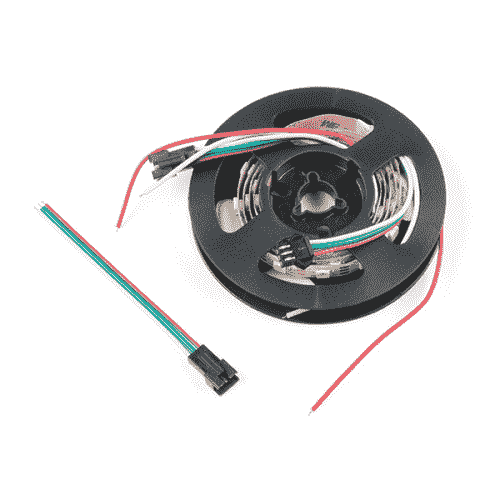

# 可寻址 LED 灯条连接指南

> 原文：<https://learn.sparkfun.com/tutorials/addressable-led-strip-hookup-guide>

## 点亮你的生活

没有什么比一束明亮的彩灯集中在一个狭小的空间里更有节日气氛了。为此，我衷心推荐一款可寻址的 [LED](https://www.sparkfun.com/leds) 灯条。它非常明亮，超级生动，而且很容易连接。本教程涵盖了仅用一根红棒和一节 AA 电池组点亮一串可寻址 led 所需的所有布线和代码。

 

### 

[Retired](https://learn.sparkfun.com/static/bubbles/ "Retired") COM-15206

这些是裸露的可寻址 1 米长的 5V RGB LED 灯条，每米装有 60 个 APA104s。

**Retired**[Favorited Favorite](# "Add to favorites") 4[Wish List](# "Add to wish list")

### 本教程涵盖的内容

### 所需材料

要跟随本教程，您将需要以下部分: