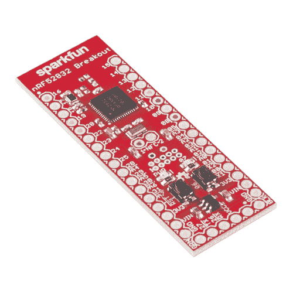

# nRF52832 分线板连接指南

> 原文：<https://learn.sparkfun.com/tutorials/nrf52832-breakout-board-hookup-guide>

## 介绍

nRF52832 是 [Nordic Semiconductor 的](https://www.nordicsemi.com/eng/Products/Bluetooth-low-energy/nRF52832)最新多协议无线电片上系统(SoC)。它是半微控制器，具有一系列功能，包括 32 个可配置的 I/O 引脚、SPI、I ² C、UART、PWM、ADC、512kB 闪存和 64kB RAM。而且，它是半个 2.4GHz 多协议无线电，支持**蓝牙低能耗** (BLE)、 **ANT** ，以及 Nordic 专有的 2.4GHz 超低功耗无线通信——它甚至还支持片上 NFC 标签。

[](https://www.sparkfun.com/products/retired/13990) 

### [SparkFun nRF52832 突围](https://www.sparkfun.com/products/retired/13990)

[Retired](https://learn.sparkfun.com/static/bubbles/ "Retired") WRL-13990

nRF52832 是 Nordic Semiconductor 最新的多协议片上无线电系统(SoC)。它是半微控制器，带有一个…

9 **Retired**[Favorited Favorite](# "Add to favorites") 22[Wish List](# "Add to wish list")

SparkFun 的 [nRF52832 Breakout](https://www.sparkfun.com/products/13990) 提供了对所有芯片功能的轻松访问。它分解了 nRF52 的所有 I/O 引脚，提供了一个 32.768kHz RTC 晶体，一个用户可编程按钮和 LED，以及一个跟踪天线来发送和接收这些 2.4GHz 传输。此外，为了使芯片尽可能容易闪存，突破来预编程有一个**串行引导加载器**。

### 本教程涵盖的内容

本教程是 SparkFun nRF52832 分组讨论的全面入门指南。它记录了评估板的硬件特性，并包括为 nRF52832 软件开发设置计算机的技巧。使用 Arduino IDE 通过串行引导程序对芯片进行编程是本教程后半部分的重点。

### 材料清单

为了完成本教程，并让您的 nRF52832 分线点开始运行，您需要一些额外的组件。

为了对板进行编程，我们建议将分线板与 [SparkFun Beefy 3 - FTDI 基本分线板](https://www.sparkfun.com/products/13746)连接。除了提供 USB 转串行编程接口之外，该板还能够为 nRF52832 分线点完全供电。不太结实的 [3.3V FTDI Basic](https://www.sparkfun.com/products/9873) 也可以用于对电路板编程，但我们建议寻找替代电源为 nRF52832 电路板供电。无论你使用哪一款 USB 转串行转换器，都不要忘记带 [USB 线](https://www.sparkfun.com/products/10215)！

[](https://www.sparkfun.com/products/10215) 

将**添加到您的[购物车](https://www.sparkfun.com/cart)中！**

 **### [USB micro-B 线- 6 脚](https://www.sparkfun.com/products/10215)

[In stock](https://learn.sparkfun.com/static/bubbles/ "in stock") CAB-10215

USB 2.0 型到微型 USB 5 针。这是一种新的、更小的 USB 设备连接器。微型 USB 连接器大约是…

$5.5014[Favorited Favorite](# "Add to favorites") 21[Wish List](# "Add to wish list")****[](https://www.sparkfun.com/products/13746) 

将**添加到您的[购物车](https://www.sparkfun.com/cart)中！**

 **### [SparkFun Beefy 3 - FTDI 基础突围](https://www.sparkfun.com/products/13746)

[In stock](https://learn.sparkfun.com/static/bubbles/ "in stock") DEV-13746

这是为 FTDI FT231X USB 到串行 ic 的 3 FTDI 基本突破。此板的引脚匹配 FTDI …

$17.5012[Favorited Favorite](# "Add to favorites") 22[Wish List](# "Add to wish list")**** ****为了将 nRF52832 分线点与 FTDI 接口，您需要将一个 6 引脚接头条焊接到电路板的串行接口上。我们推荐使用[直角头](https://www.sparkfun.com/products/553)，但是[直头](https://www.sparkfun.com/products/116)或[长头](https://www.sparkfun.com/products/12693)也可以完成这项工作。如果你打算连接任何一个 I/O 引脚，可以多拿一些公接头，甚至母接头。

[](https://www.sparkfun.com/products/116) 

将**添加到您的[购物车](https://www.sparkfun.com/cart)中！**

 **### [破开头球——直击](https://www.sparkfun.com/products/116)

[In stock](https://learn.sparkfun.com/static/bubbles/ "in stock") PRT-00116

一排标题-打破适应。40 个引脚，可切割成任何尺寸。用于定制 PCB 或通用定制接头。

$1.7520[Favorited Favorite](# "Add to favorites") 133[Wish List](# "Add to wish list")****[](https://www.sparkfun.com/products/553) 

将**添加到您的[购物车](https://www.sparkfun.com/cart)中！**

 **### [挣脱男头球-直角](https://www.sparkfun.com/products/553)

[In stock](https://learn.sparkfun.com/static/bubbles/ "in stock") PRT-00553

一排直角公接头-断开以适合。40 个引脚，可切割成任何尺寸。用于定制 PCB 或一般定制…

$2.255[Favorited Favorite](# "Add to favorites") 47[Wish List](# "Add to wish list")****[](https://www.sparkfun.com/products/12693) 

将**添加到您的[购物车](https://www.sparkfun.com/cart)中！**

 **### [【断开接头】- 40 针公(长居中，PTH，0.1”)](https://www.sparkfun.com/products/12693)

[In stock](https://learn.sparkfun.com/static/bubbles/ "in stock") PRT-12693

这是一排 40 个分离接头，间隔 0.1 英寸，两侧有长销。此标题在以下情况下特别有用…

$1.051[Favorited Favorite](# "Add to favorites") 16[Wish List](# "Add to wish list")****** ******最后，要完成蓝牙连接，你需要一部**配备 BLE 的智能手机**。本教程记录了如何将 nRF52832 与 Nordic 的免费开源 [nRF 工具箱](https://www.nordicsemi.com/eng/Products/Nordic-mobile-Apps/nRF-Toolbox-App)和 [nRF Connect](https://www.nordicsemi.com/eng/Products/Nordic-mobile-Apps/nRF-Connect-for-mobile-previously-called-nRF-Master-Control-Panel) 应用一起使用，这些应用可在 iOS 和 Android 设备上使用。

| [](https://www.nordicsemi.com/eng/Products/Nordic-mobile-Apps/nRF-Toolbox-App)[nRF 工具箱](https://www.nordicsemi.com/eng/Products/Nordic-mobile-Apps/nRF-Toolbox-App) |      | [](https://www.nordicsemi.com/eng/Products/Nordic-mobile-Apps/nRF-Connect-for-mobile-previously-called-nRF-Master-Control-Panel)[nRF 连接](https://www.nordicsemi.com/eng/Products/Nordic-mobile-Apps/nRF-Connect-for-mobile-previously-called-nRF-Master-Control-Panel) |

### 推荐阅读

nRF52832 突破是一个中级到高级水平的董事会，但不要让这吓退你！无论你的技能水平如何，本教程都应该能够引导你开始使用电路板。也就是说，我们建议您熟悉这些教程中涵盖的主题:

[](https://learn.sparkfun.com/tutorials/serial-communication) [### 串行通信](https://learn.sparkfun.com/tutorials/serial-communication) Asynchronous serial communication concepts: packets, signal levels, baud rates, UARTs and more 100[](https://learn.sparkfun.com/tutorials/using-the-arduino-pro-mini-33v) [### 使用 Arduino Pro Mini 3.3V](https://learn.sparkfun.com/tutorials/using-the-arduino-pro-mini-33v) This tutorial is your guide to all things Arduino Pro Mini. It explains what it is, what it's not, and how to get started using it.[Favorited Favorite](# "Add to favorites") 16[](https://learn.sparkfun.com/tutorials/bluetooth-basics) [### 蓝牙基础知识](https://learn.sparkfun.com/tutorials/bluetooth-basics) An overview of the Bluetooth wireless technology.[Favorited Favorite](# "Add to favorites") 42[](https://learn.sparkfun.com/tutorials/sparkfun-usb-to-serial-uart-boards-hookup-guide) [### SparkFun USB 转串行 UART 板连接指南](https://learn.sparkfun.com/tutorials/sparkfun-usb-to-serial-uart-boards-hookup-guide) How to use the SparkFun FTDI based boards to program an Arduino and access another serial device over the hardware serial port, without unplugging anything 10

## 硬件概述

Nordic 的 nRF52832 是一款片上系统(SoC ),结合了 ARM Cortex-M4F 微处理器和 2.4GHz 多协议无线电。除了提供对所有芯片 I/O 引脚的访问，分线板还包括一些外部组件。下图总结了分线板的功能:

[](https://cdn.sparkfun.com/assets/learn_tutorials/5/4/9/nrf52832-top-annotated.jpg)

### 为 nRF52832 分线板供电

nRF52832 可以在 1.7 至 3.6V 的电源**下工作。该板还包括一个最大输入为 6V 的 3.3V 调节器，以防您希望使用电池或稳压电源为板供电。**

电源输入引脚位于电路板的底部。每个标题行包括“GND”、“VIN”和“3.3V”电源输入。6 引脚串行接头上的“VCC”和“GND”引脚也可以用来给电路板供电(假设跳线闭合，稍后会详细说明)。

[](https://cdn.sparkfun.com/assets/learn_tutorials/5/4/9/nrf52832-power-inputs.jpg)

**VIN 引脚**馈入板载调节器，后者将电压降至 3.3V，为 nRF52832 供电。该调节器可提供高达 600mA 的电流，远远超过 nRF52832 的需求。如果通过调节器供电，可以使用 3.3V 引脚作为输出，为外部元件供电。

Note that the **maximum input** to the 3.3V regulator (into the VIN pin) is **6V**!

或者，您可以跳过调节器，使用 **3.3V 引脚**直接为 nRF52832 供电。这里提供的电压不一定是 3.3V，可以是 SoC 的 1.7V 和 3.6V 工作范围之间的任何电压，因此您可以使用纽扣电池或一对碱性电池为芯片供电。

**红色电源 LED** 也连接到“3.3V”总线。如果它亮了，你的 nRF52832 应该有电了。

### 32 个多用途 I/O 引脚

nrF52832 的微处理器具有一系列硬件外设，包括三个 [SPI](https://learn.sparkfun.com/tutorials/serial-peripheral-interface-spi) -可配置为主机或从机，两个 [I ² C](https://learn.sparkfun.com/tutorials/i2c) 接口，以及一个 [UART](https://learn.sparkfun.com/tutorials/serial-communication) (带可选流量控制)。在串行接口之上，该芯片还具有 8 个 [ADC](https://learn.sparkfun.com/tutorials/analog-to-digital-conversion) 引脚和三个硬件 [PWM](https://learn.sparkfun.com/tutorials/pulse-width-modulation) 输出。32 个 I/O 引脚中的每一个都可以分配几乎任何功能，因此您可以根据需要在电路板上移动这些接口。

[](https://learn.sparkfun.com/tutorials/serial-communication) [### 串行通信](https://learn.sparkfun.com/tutorials/serial-communication) Asynchronous serial communication concepts: packets, signal levels, baud rates, UARTs and more 100[](https://learn.sparkfun.com/tutorials/serial-peripheral-interface-spi) [### 串行外设接口(SPI)](https://learn.sparkfun.com/tutorials/serial-peripheral-interface-spi) SPI is commonly used to connect microcontrollers to peripherals such as sensors, shift registers, and SD cards.[Favorited Favorite](# "Add to favorites") 91[](https://learn.sparkfun.com/tutorials/analog-to-digital-conversion) [### 模数转换](https://learn.sparkfun.com/tutorials/analog-to-digital-conversion) The world is analog. Use analog to digital conversion to help digital devices interpret the world.[Favorited Favorite](# "Add to favorites") 58[](https://learn.sparkfun.com/tutorials/i2c) [### I2C](https://learn.sparkfun.com/tutorials/i2c) An introduction to I2C, one of the main embedded communications protocols in use today.[Favorited Favorite](# "Add to favorites") 128

只有几个功能分配有静态引脚:

*   为了满足您的实时计数(RTC)需求，一个 32.768kHz 的**晶体**连接到引脚 0 和 1。
*   引脚 6 连接到一个**瞬时按钮**，该按钮在引导加载过程中起重要作用。
*   引脚 7 连接到一个 **LED** 。它是低电平有效，因此将引脚拉至地可以打开 LED。
*   引脚 26 和 27 被选为 RX 和 TX UART 引脚。它们可以在用户应用程序中重新分配，但在引导加载程序运行期间会被固定为串行引脚。
*   引脚 21 也兼作低电平有效**复位**输入。
*   nRF52832 的 **NFC** 功能可以由连接到引脚 9 和 10 的天线支持。

### 设置焊接跳线

nRF52832 分线点的背面布满跳线，帮助您定制电路板的操作。它们标有用途的缩写。

[](https://cdn.sparkfun.com/assets/learn_tutorials/5/4/9/nrf52832-bottom-annotated.jpg)

默认关闭的跳线可以用[业余爱好刀](https://www.sparkfun.com/products/9200)切开，而那些默认打开的跳线可以用少量焊料关闭。

| 跳线标签 | 默认 | 笔记 |
| VCC 东部自由贸易区 | 关闭的 | 将 6 针串行接头 VCC 连接到 3.3V 总线。 |
| 压水堆发光二极管 | 关闭的 | 启用或禁用红色电源指示灯 LED。 |
| 1/2 (NFC) | 打开 | 将 GPIO 9 和 10 连接到 NFC 天线调谐电容。 |
| RTC-EN | 关闭的 | 将 GPIO 0 和 1 连接到 32.768kHz RTC 晶振。 |

#### 通过 6 针串行连接器的 FTDI VCC 供电

该跳线控制通过 6 针串行连接器连接的 FTDI 分线点是否可以向 nRF52832 供电。通过保持此跳线闭合，您将能够使用用于编程 nRF52832 的相同设备为其供电。

如果从外部给电路板供电，您可能需要切断跳线。如果您使用的是 [3.3V FTDI Basic](https://www.sparkfun.com/products/9873) (非“强壮”版本)，也可以考虑打开跳线，这可能无法提供足够的持续电源来为芯片供电。

#### 电源指示灯-关闭电源指示灯

nRF52832 最重要的特性之一是其低功耗能力。如果您的应用需要使用单电池运行数月，并且您正在充分利用 nRF52832 的超低功耗睡眠模式，则 led 消耗的 1-2mA 电流可能会使微控制器的电流消耗相形见绌。

切断此跳线将有效禁用电源指示灯。您不会总是有一个可见的电源指示器，但您将能够节省大量的电力！

#### 1 和 2 - NFC 天线调谐电容

nRF52832 最独特的功能之一是其 NFC 标签支持，它可以将数据传输到附近的 NFC 兼容设备，甚至可以通过编程在 NFC 场的存在下从睡眠中唤醒。

要使用 NFC 功能，必须将 13.56 MHz 天线连接到 GPIO 引脚 9 和 10。大多数 NFC 天线在天线引脚和地之间还需要一对调谐电容。NFC 跳线可以闭合，将每个 NFC 天线引脚连接到一个 180pF 电容。

[](https://cdn.sparkfun.com/assets/learn_tutorials/5/4/9/nrf52832-schematic-tuningcaps.png)*NFC tuning caps and enable jumpers, from the [nRF52832 Breakout schematic](https://cdn.sparkfun.com/assets/learn_tutorials/5/4/9/sparkfun-nrf52832-breakout-schematic-v10.pdf).*

这个上限值可能不是每个天线都完美的，但它应该支持相对较宽的天线电感范围。我们用一台 [Abracon ANFACA-4545-A01](http://www.digikey.com/product-detail/en/abracon-llc/ANFCA-4545-A01/535-12513-ND/4864622) 和一台[脉冲电子设备 W7001](http://www.digikey.com/product-detail/en/pulse-electronics-corporation/W7001/553-2633-ND/4169647) 成功测试了它。

#### 连接/断开 32.768kHz 晶振

nRF52832 分线点为芯片配备了一个 32.768kHz 晶体，连接到 GPIO 引脚 0 和 1。不幸的是，这些引脚占 ADC 可用输入的四分之一。因此，如果您的应用不需要 RTC，而您需要这些引脚用于其他目的，那么就拿一把业余爱好刀，切开焊盘之间的两条走线，断开晶体。

## 硬件装配

为了对芯片进行编程，并使用 nRF52832 的 32 个 I/O，你需要将*某物*焊接到它的头部。至少，我们建议将[直角公接头](https://www.sparkfun.com/products/553)或[直公接头](https://www.sparkfun.com/products/116)焊接到六针串行接头上。这两者中的任何一个都将很容易与 FTDI 的基本和有力的突破相结合。

[](https://cdn.sparkfun.com/assets/learn_tutorials/5/4/9/assembly-serial-header.jpg)*Solder a six-pin right-angle header into the serial port to interface it with an FTDI Beefy 3.*

其余两行过孔与试验板兼容，因此您可以将引脚焊接到两行过孔中，使其横跨试验板。

[](https://cdn.sparkfun.com/assets/learn_tutorials/5/4/9/assembly-breadboard.jpg)*Solder straight male headers into the pair of header rows to make the breakout breadboard-compatible.*

或者你可以将[电线](https://www.sparkfun.com/products/11375)、[母接头](https://www.sparkfun.com/products/115)，或者你的项目需要的任何东西焊接到那些剩余的孔中。

## 添加 Arduino 兼容性

Arduino 不是最强大的 IDE，也不是最通用的，但是如果你刚刚开始使用一个新的平台，它会让事情变得简单。幸运的是，有一个 nRF52 Arduino 板插件可用于此目的！本节详细介绍了如何安装 nRF52 Arduino 库、核心和工具。

### 下载并安装板包

nRF52 Arduino 内核基于 [sandeepmistry](https://github.com/sandeepmistry/arduino-nRF5) 的出色工作。我们在他的电路板文件中添加了 nRF52832 分线板兼容性，并添加了一个额外的工具来支持串行引导加载。

要在 Arduino 中安装对 nRF52 板的支持，首先打开您的 **Arduino 偏好设置**(文件>偏好设置)。然后将下面的 URL 复制并粘贴到“其他 Board Manager URLs”文本框中。

```
https://raw.githubusercontent.com/sparkfun/Arduino_Boards/nrf5/IDE_Board_Manager/package_sparkfun_index.json 
```

[](https://cdn.sparkfun.com/assets/learn_tutorials/5/4/9/arduino-board-add.png)

然后**点击 OK** ，导航到**工具** > **板卡** > **板卡管理器...**工具。搜索“nRF52”应该会出现一个 **SparkFun nRF52 电路板**结果。选择它并单击安装。

[](https://cdn.sparkfun.com/assets/learn_tutorials/5/4/9/arduino-nrf52-board-install.png)

安装可能需要几分钟——这个包包括 arm-gcc 和一些其他工具，总共大约 100 MB。安装完成后，进入**工具** > **电路板**，选择“Nordic Semiconductor nRF5 电路板”部分下的“SparkFun nRF52832 分线点”。

[](https://cdn.sparkfun.com/assets/learn_tutorials/5/4/9/arduino-board-selection.png)

## 通过引导程序编程

nRF52832 分线点配有预编程的串行引导加载程序，因此您不需要专门的 JTAG 程序员来加载代码。但是，您需要一个 FTDI Basic(或类似 FTDI Basic 的设备)来在您的计算机和分支之间建立一个串行接口。

### 将 FTDI 连接到分线点

FTDI 基本接口与 nRF52832 的 6 针串行接口匹配。将“BLK”和“GRN”标签配对，并将板子一起滑动。

[](https://cdn.sparkfun.com/assets/learn_tutorials/5/4/9/programming-ftdi-connected.jpg)

您应该会看到红色电源 LED 亮起。如果它不通电，请确保您没有禁用主板背面的 FTDI-VCC EN 跳线。

### 触发引导加载程序

不幸的是，nRF52832 Breakout 的引导加载程序不像许多 Arduino 那样具有自动重置功能。为了决定是进入引导加载程序还是运行其应用程序代码，nRF52832 在启动时采样 GPIO 6 的状态。如果引脚 6 为低电平，它将进入引导加载程序，否则它将引导至其已编程的应用程序

因此，要将 nRF52832 引导至其引导程序，您必须在按住引脚 6 按钮的同时**重置芯片。在逐步的形式中，重置到引导装载程序的技巧是:**

1.  按下复位和 06 按钮。
2.  释放复位。
3.  验证蓝色(针脚 7)指示灯开始闪烁。
4.  释放标有 06 的用户按钮。

[](https://cdn.sparkfun.com/assets/learn_tutorials/5/4/9/reset-to-bootloader-600w.gif)

在 bootloader 模式下，nRF52832 引脚 7 上的蓝色 LED 应该以我们称之为“定时炸弹”的顺序加速闪烁。

诚然，在每个程序之前执行这个有点棘手，也很烦人，但这是我们不通过昂贵的 JTAG 程序员编程的代价。一旦你进入了引导程序，你就可以通过 Arduino 的“上传”按钮将代码上传到芯片上。

### 上传闪烁

尝试加载一个基本的闪烁示例——将闪烁引脚设置到引脚 7 上的板上 LED 并上传。下面是一些要复制粘贴的代码:

```
language:c
const int ledPin = 7;

void setup()
{
    pinMode(ledPin, OUTPUT);
}

void loop()
{
    digitalWrite(ledPin, HIGH);
    delay(500);
    digitalWrite(ledPin, LOW);
    delay(500);
} 
```

**LED Polarity** – The blue LED, attached to pin 7, is **active-low**. Writing the pin LOW will turn the LED on, and writing it HIGH will turn it off.

### 解决纷争

如果您收到这样的上传错误:

无法升级目标。错误是:串行端口没有接收到数据。无法继续。

可能的原因:

-目标上的引导加载程序、软件设备或应用程序与 DFU 软件包中的要求不匹配。
-波特率或流量控制与目标引导程序中的不同。
-目标不在 DFU 模式。如果使用 SDK 的例子，按下按钮 4 和重置，并释放这两个进入 DFU 模式。

确保你的 nRF52832 分线点的 LED 以定时炸弹模式闪烁——确保它处于**引导装载模式**。如果芯片在引导加载程序中，仍然不接受代码，通过断开和重新连接 FTDI Basic，尝试**循环电源**到分线点。

## BLEPeripheral Arduino 库

nRF5 板定义允许您对 nRF52832 进行编程并切换其 GPIO，但它不包括任何蓝牙支持。为此，我们建议使用 [BLEPeripheral Arduino 库](https://github.com/sandeepmistry/arduino-BLEPeripheral)。

BLEPeripheral 库可以从 Arduino 的库管理器安装。只需进入**草图** > **包含库** > **管理库...**。在搜索框中，键入“BLEPeripheral”，选择它，然后单击“安装”

[](https://cdn.sparkfun.com/assets/learn_tutorials/5/4/9/bleperipheral-install.png)

或者，可以从 [GitHub 库](https://github.com/sandeepmistry/arduino-BLEPeripheral)下载最新版本来安装这个库。跟随我们的[安装 Arduino 库教程](https://learn.sparkfun.com/tutorials/installing-an-arduino-library)通过这种方法帮助安装库。

## BLE 眨眼示例

这里有几个例子，尽可能简单地展示如何将 nRF52832 突破变成 ble 外围设备。第一个例子允许你从你的智能手机控制电路板的引脚 7 LED 使用 [nRF Connect 应用](https://www.nordicsemi.com/eng/Products/Nordic-mobile-Apps/nRF-Connect-for-mobile-previously-called-nRF-Master-Control-Panel)。这是 BLE 世界的眨眼素描！

要测试蓝牙连接，您需要将分线板与另一个蓝牙兼容设备配对。大多数现代智能手机都符合这个要求。

你还需要在手机上安装一个 BLE 应用程序——可以让你连接到设备，摆弄或读取它们的特征。有一些蓝牙调试应用程序可以帮助您开始通过蓝牙进行通信。PunchThrough 的浅蓝色浏览器是我们最喜欢的浏览器之一，但它只适用于 iOS。Nordic 的[nRF Connect](https://www.nordicsemi.com/eng/Products/Nordic-mobile-Apps/nRF-Connect-for-mobile-previously-called-nRF-Master-Control-Panel)——适用于 iOS 和 Android 设备——是另一个不错的选择。这就是我们将在这里记录的内容。

### 代码

将以下代码复制并粘贴到您的 Arduino IDE 中。

```
language:c
// Import libraries (BLEPeripheral depends on SPI)
#include <SPI.h>
#include <BLEPeripheral.h>

//////////////
// Hardware //
//////////////
#define LED_PIN    7 // LED on pin 7
#define LED_ACTIVE LOW // Pin 7 LED is active low
#define LED_DEFAULT LOW

///////////////////////
// BLE Advertisments //
///////////////////////
const char * localName = "nRF52832 LED";
BLEPeripheral blePeriph;
BLEService bleServ("1207");
BLECharCharacteristic ledChar("1207", BLERead | BLEWrite);

void setup() 
{
  Serial.begin(115200); // Set up serial at 115200 baud

  pinMode(LED_PIN, OUTPUT);
  digitalWrite(LED_PIN, !LED_ACTIVE);

  setupBLE();
}

void loop() 
{
  blePeriph.poll();

  if (ledChar.written())
  {
    int ledState = ledChar.value();
    if (ledState)
      digitalWrite(LED_PIN, LED_ACTIVE);
    else
      digitalWrite(LED_PIN, !LED_ACTIVE);
  }
}

void setupBLE()
{
  // Advertise name and service:
  blePeriph.setDeviceName(localName);
  blePeriph.setLocalName(localName);
  blePeriph.setAdvertisedServiceUuid(bleServ.uuid());

  // Add service
  blePeriph.addAttribute(bleServ);

  // Add characteristic
  blePeriph.addAttribute(ledChar);

  // Now that device6, service, characteristic are set up,
  // initialize BLE:
  blePeriph.begin();

  // Set led characteristic to default value:
  ledChar.setValue(!LED_ACTIVE);  
} 
```

然后按照上一节的说明将代码上传到您的分组讨论中。

#### 使用 nRF 连接进行测试

打开 nRF Connect 后，您会看到附近蓝牙设备的列表。如果你在 SparkFun 办公室，或者被有太多蓝牙设备的同事包围，你的列表可能会包含设备名称。查找“nRF52832 LED”，然后单击旁边的“连接”按钮。(注意:在您连接到分线点之前，它可能会公布名称“Arduino”。)

[](https://cdn.sparkfun.com/assets/learn_tutorials/5/4/9/nrfConnect-list.png)You can set the device name -- replacing "nRF52832 LED" -- with the `blePeripheral.setDeviceName([name])` function.

点击 nRF52832 LED 设备上的“连接”,您将进入“服务”视图。在那里，单击“未知服务”——UUID 字符串应该与示例代码中的`bleServ`对象相匹配。

下一个接口需要一些实验才能弄清楚。向下箭头表示读取，向上箭头允许您写入特征，三个向下箭头打开或关闭通知。首先，**点击顶部“未知服务”旁边的向上箭头**。这将允许您控制 LED 的状态。在打开的对话框中，尝试输入`00`或`01`，这将分别关闭或打开 LED。

[](https://cdn.sparkfun.com/assets/learn_tutorials/5/4/9/nRFConnect-write.png)

点击“发送”后，您应该会看到 LED 改变状态。

## BLE 按钮示例

这个例子演示了如何使用 BLE 读取和通知功能。它监控 nRF52832 分线点的第 6 针上的按钮。当按钮状态改变时，发送 BLE 通知。

### 代码

使用 BLEPeripheral 库，将此代码上传到您的分组讨论中:

```
language:c
// Import libraries (BLEPeripheral depends on SPI)
#include <SPI.h>
#include <BLEPeripheral.h>

//////////////
// Hardware //
//////////////
#define BTN_PIN    6 // BTN pin on 6
#define BTN_ACTIVE LOW

///////////////////////
// BLE Advertisments //
///////////////////////
const char * localName = "nRF52832 Button";
BLEPeripheral blePeriph;
BLEService bleServ("1234");
BLECharCharacteristic btnChar("1234", BLERead | BLENotify);

void setup() 
{
  Serial.begin(115200); // Set up serial at 115200 baud

  pinMode(BTN_PIN, INPUT_PULLUP);
  digitalWrite(7, HIGH);

  setupBLE();
}

void loop()
{
  blePeriph.poll();

  // read the current button pin state
  char buttonValue = digitalRead(BTN_PIN);

  // has the value changed since the last read
  bool buttonChanged = (btnChar.value() != buttonValue);

  if (buttonChanged) 
  {
    // button state changed, update characteristics
    btnChar.setValue(buttonValue);
  }
}

void setupBLE()
{
  // Advertise name and service:
  blePeriph.setDeviceName(localName);
  blePeriph.setLocalName(localName);
  blePeriph.setAdvertisedServiceUuid(bleServ.uuid());

  // Add service
  blePeriph.addAttribute(bleServ);

  // Add characteristic
  blePeriph.addAttribute(btnChar);

  // Now that device, service, characteristic are set up,
  // initialize BLE:
  blePeriph.begin(); 
} 
```

#### 使用 nRF 连接进行测试

使用 nRF Connect 连接到您的 nRF52832 分线点-就像上次一样。这一次，设备的名称应该更改为 nRF52832 Button(如果它仍然是“LED ”,请尝试连接——有时本地 ID 不会改变，直到您连接到它)。

再次点击“未知服务”，但是，这一次，尝试**点击单向下箭头**来读取服务的特征。这将读取 nRF52832 分线装置的插脚 6 按钮的状态。当按钮未启动时，属性的值应为 0x01。如果您可以按住按钮，同时点击单向下箭头，则该值应更改为 0x00。

[](https://cdn.sparkfun.com/assets/learn_tutorials/5/4/9/nrfConnect-button-notify.png)*Activate notify by tapping the triple-down-arrow. Then when you press the button, the value should automatically update.*

您也可以尝试通过点击**三向下箭头**，将特性设置为**通知**。在这种模式下，当状态发生变化时，值应该自动得到通知。按下并松开按钮，查看数值从 0x00 到 0x01 的变化。

## 资源和更进一步

随着您继续 nRF52832 开发，有大量资源可供您使用。

### 硬件资源

nRF52832 分线点是开源硬件。请随意浏览我们的 [EAGLE 设计文件](https://cdn.sparkfun.com/assets/learn_tutorials/5/4/9/sparkfun-nrf52832-breakout-EAGLE.zip)，下载[原理图](https://cdn.sparkfun.com/assets/learn_tutorials/5/4/9/sparkfun-nrf52832-breakout-schematic-v10.pdf)，并在我们的 [GitHub 库](https://github.com/sparkfun/nRF52832_Breakout)上跟踪产品生命周期。

要了解更多关于 nRF52832 的信息，您应该首先访问 Nordic 的 nRF52832 产品页面的“文档”和“下载”选项卡。在那里，您可以找到大量的数据表、用户手册和软件工具。

#### 使用 nRF52832 硬件开发套件进行编程

如果你觉得被引导程序束缚住了手脚，并且想用一个更强大的工具开始 JTAG 和调试 nRF52832，可以考虑使用 [nRF52832 硬件开发工具包](https://www.nordicsemi.com/eng/Products/Bluetooth-low-energy/nRF52-DK)。您甚至可以使用它通过 SWD 协议对 nRF52832 进行编程。

**Warning:** Just like any Arduino with an Atmel microcontroller, the factory bootloader will be erased from the nRF52832 when reprogramming it with the hardware development kit. You will need to reflash the .hex files located in the GitHub repository: [nRF52832_Breakout>Firmware>bootloader-custom](https://github.com/sparkfun/nRF52832_Breakout/tree/master/Firmware/bootloader-custom).

找到 nRF52832 硬件开发套件上的 SWD 接头和 nRF52832 分线板的 SWD 引脚。

| nRF52832 硬件开发套件 SWD 引脚 | nRF52832 分线板 SWD 引脚 |
| [](https://cdn.sparkfun.com/assets/learn_tutorials/5/4/9/nRF52832_Breakout_Board_Hookup_Guide-02_SWDpinouts2.png "nRF52832 Hardware Development Kit SWD pins") | [](https://cdn.sparkfun.com/assets/learn_tutorials/5/4/9/13990-02_SWDpins.png "nRF52832 Breakout Board SWD Pins") |

使用 5x [M/F 高级跳线](https://www.sparkfun.com/products/9140)和一个[试验板](https://www.sparkfun.com/products/12002)，进行下表所列的连接。对目标 nRF52832 分线板进行编程时，不需要连接 Vdd nRF、Vdd 和 SWO。您也可以使用 nRF52832 分线板周围的其他 3V3 或 GND 引脚。nRF52832 的单线 debug - SWD 引脚连接到 NFC 天线焊盘附近的测试点，SWDCLK 和 SWDIO 分别标有“C”和“D”。SWD 测试点没有使用标准的通孔尺寸，因此标准的外螺纹分离接头不适合。从[母接头](https://www.sparkfun.com/products/115)上切下一个 2 针接头会合适，但会挡住一些 2x5 接头。

| nRF52832 硬件开发套件 | M/F 跳线颜色 | nRF52832 分线板 |
| VDD nRF |  | 网络计算机 |
| VDD |  | 网络计算机 |
| VTG | 红色 | 3.3V |
| SWDIO | 蓝色 | D |
| SWDCLK | 黄色 | C |
| 浅部白色甲癣 |  | 网络计算机 |
| 重置 | 格林（姓氏）；绿色的 | 英特尔的快速储存技术 |
| GND | 黑色 | GND |

将 SparkFun Beefy 3 FTDI 添加到 RF52832 分线板的 FTDI 接头。将一根 micro-B USB 电缆 nRF52832 硬件开发套件和另一根 micro-B 电缆连接到目标 nRF52832 分线板。在对目标进行编程时，通过轻轻将跨接线针脚推向通孔，确保跨接线针脚与针脚 D 和 C 接触。您也可以焊接跳线引脚，以获得更安全的连接。

[](https://cdn.sparkfun.com/assets/learn_tutorials/5/4/9/nRF52832_Breakout_Board_Hookup_Guide-01.jpg)*For faster programming, the nRF52832 Development Kit can be used to program the nRF52832 Breakout Board.*

### 软件资源

本教程中的两个 Arduino 示例仅仅触及了 nRF52832 和 BLEPeripheral 库的皮毛。关于 BLEPeripheral 库的更多信息，我们建议查看 Arduino 中**文件** > **示例** > **BLEPeripheral** 菜单下包含的示例。当你开始创建自己的 BLEPeripheral 草图时，我们建议你查看一下[库的 API](https://github.com/sandeepmistry/arduino-BLEPeripheral/blob/master/API.md) 。

用于 nRF51 和 nRF52 系列芯片的 Nordic 软件开发套件 nRF5 SDK 是一套令人惊叹的软件和示例应用。设置工具链所需要的就是[arm gcc](https://launchpad.net/gcc-arm-embedded)(SDK 也支持 Keil 和 IAR，如果你已经支付了这些选项的话)。SDK 中充满了展示 nRF52832 所有 BLE 功能、ANT、NFC 和所有芯片硬件外设特性的示例。

要获得更多无线乐趣，请查看其他精彩的 SparkFun 教程:

[](https://learn.sparkfun.com/tutorials/are-you-okay-widget) [### 你还好吗？小部件](https://learn.sparkfun.com/tutorials/are-you-okay-widget) Use an Electric Imp and accelerometer to create an "Are You OK" widget. A cozy piece of technology your friend or loved one can nudge to let you know they're OK from half-a-world away.[Favorited Favorite](# "Add to favorites") 6[](https://learn.sparkfun.com/tutorials/sparkfun-inventors-kit-for-edison-experiment-guide) [### 爱迪生实验指南](https://learn.sparkfun.com/tutorials/sparkfun-inventors-kit-for-edison-experiment-guide) Learn how to harness the power of the Intel® Edison using JavaScript to post data to the cloud, control electronics from smartphones, and host web pages that interact with circuits.[Favorited Favorite](# "Add to favorites") 4[](https://learn.sparkfun.com/tutorials/getting-started-with-the-autonomous-kit-for-the-sphero-rvr) [### Sphero RVR 自主套件入门](https://learn.sparkfun.com/tutorials/getting-started-with-the-autonomous-kit-for-the-sphero-rvr) Want to get started in robotics? Look no further than the SparkFun autonomous kit for the Sphero RVR! Whether you purchased the Basic or Advanced kit, this tutorial will get you rolling...[Favorited Favorite](# "Add to favorites") 3[](https://learn.sparkfun.com/tutorials/dialog-ulp-wifi-da16200-r3-shield-hookup-guide) [### 对话框 ULP WiFi DA16200 R3 屏蔽连接指南](https://learn.sparkfun.com/tutorials/dialog-ulp-wifi-da16200-r3-shield-hookup-guide) Add WiFi to your project with this hookup guide for our Dialog's Ultra Low Power DA16200 R3 shield 1

有关使用 nRF52832 分线板控制 MIDI 的更多信息，请查看链接到本文的 MIDI BLE 教程:

[](https://www.sparkfun.com/news/2615 "February 22, 2018: Tsunami looping firmware is released, and connectable by MIDI. And why not MIDI BLE? It's done with the nRF52832 this week.") [### 今日英语:BLE 迷笛为海啸干杯！

February 22, 2018](https://www.sparkfun.com/news/2615 "February 22, 2018: Tsunami looping firmware is released, and connectable by MIDI. And why not MIDI BLE? It's done with the nRF52832 this week.")[Favorited Favorite](# "Add to favorites") 1**********