# 串行控制电机驱动器连接指南

> 原文：<https://learn.sparkfun.com/tutorials/serial-controlled-motor-driver-hookup-guide>

## 介绍

[串行控制电机驱动器](https://www.sparkfun.com/products/13911)(在本指南的其余部分缩写为 SCMD)是一个 DC 电机驱动器，旨在轻松驱动小型 DC 电机。它可以通过 UART、I2C 或 SPI 通信来控制，并且可以在 11V 时驱动每个电机恒定的 1.2A 负载(峰值 1.5A)。需要两台以上电机？将多个 SCMDs 链接在一起，并通过同一串行接口命令它们。需要更多电流？每个板的输出可以桥接，以允许双电流。

[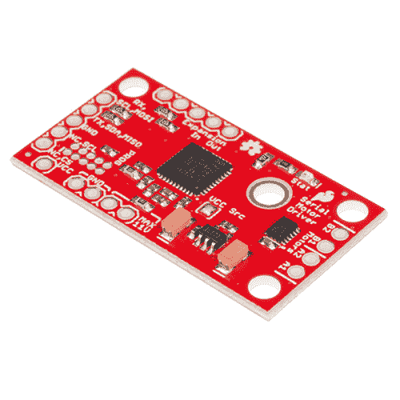](https://www.sparkfun.com/products/retired/13911) 

### [SparkFun 串行控制电机驱动器](https://www.sparkfun.com/products/retired/13911)

[Retired](https://learn.sparkfun.com/static/bubbles/ "Retired") ROB-13911

SparkFun 系列控制电机驱动器(SCMD)是一个 DC 电机驱动器，旨在驱动小型 DC 电机与…

1 **Retired**[Favorited Favorite](# "Add to favorites") 13[Wish List](# "Add to wish list")

[https://www.youtube.com/embed/Q21V0vhh-ZM/?autohide=1&border=0&wmode=opaque&enablejsapi=1](https://www.youtube.com/embed/Q21V0vhh-ZM/?autohide=1&border=0&wmode=opaque&enablejsapi=1)

该驱动板设计经济、紧凑，比以前版本的串行控制电机驱动器拥有更多的功能。它的主要优势是驱动水平的可变性，使精细控制调整成为可能。

**特性:**

*   每个通道 1.5 A 峰值驱动，1.2 A 稳态
*   工作电压为 3 至 11 伏，最大绝对电压为 12 伏
*   3.3v 默认 VCC 和逻辑
*   最大 VCC 输入电压为 5.5v
*   127 级 DC 驱动力。
*   由 I2C、SPI 或 TTL UART 信号控制
*   基于每个电机的方向反转
*   全局驱动启用
*   利用 I2C 的扩展端口，允许 16 个额外的驱动器
*   暴露于-220 散热器形状
*   几个 I2C 地址，默认 UART 包可用
*   可桥接输出
*   可选的故障安全和诊断可用。
*   可配置的扩展总线比特率为 50、100 或 400 kHz。
*   可配置的扩展总线更新速率从 1 毫秒到 255 毫秒，或仅通过命令

### 本教程涵盖的内容

本教程涵盖了电机驱动器的基本用法。它展示了如何将其连接到 3.3V 电平的 I2C、SPI 或 UART，以及如何将更多驱动器连接到控制器并独立控制它们。它还展示了一些可以在没有散热器的情况下使用的常见电机。

### 所需材料

本教程解释了如何将串行控制的电机驱动器分线板与 Arduino 或 direct serial 配合使用。要跟进，您需要以下材料:

*   [Redboard 328p 板](https://www.sparkfun.com/products/12757)或 [3.3V FTDI 基本](https://www.sparkfun.com/products/9873) -与 SCMD 通信。
*   一些 DC 汽车，如:
    *   [Redbot 型齿轮马达](https://www.sparkfun.com/products/13302)
    *   [微型齿轮马达-460 转/分](https://www.sparkfun.com/products/12429)
    *   [标准齿轮马达- 303RPM](https://www.sparkfun.com/products/12147)

[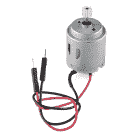](https://www.sparkfun.com/products/11696) 

将**添加到您的[购物车](https://www.sparkfun.com/cart)中！**

### [](https://www.sparkfun.com/products/11696)

[In stock](https://learn.sparkfun.com/static/bubbles/ "in stock") ROB-11696

这是我们新的业余爱好马达，现在有一个 6 毫米，10 齿的齿轮，让你的基本项目更容易管理。它适用于…

$2.104[Favorited Favorite](# "Add to favorites") 48[Wish List](# "Add to wish list")****[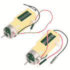](https://www.sparkfun.com/products/13302) 

将**添加到您的[购物车](https://www.sparkfun.com/cart)中！**

### [【爱好减速电机- 140 转/分](https://www.sparkfun.com/products/13302)

[In stock](https://learn.sparkfun.com/static/bubbles/ "in stock") ROB-13302

这是一对来自大谷的业余爱好齿轮马达。这些齿轮电机与推荐用于影子底盘的电机相同…

$5.505[Favorited Favorite](# "Add to favorites") 36[Wish List](# "Add to wish list")****[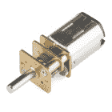](https://www.sparkfun.com/products/12429) 

将**添加到您的[购物车](https://www.sparkfun.com/cart)中！**

### [](https://www.sparkfun.com/products/12429)【460 转/分(6-12V)】

[In stock](https://learn.sparkfun.com/static/bubbles/ "in stock") ROB-12429

这些微型齿轮马达难以置信的坚韧，并具有全金属齿轮。它们的传动比为 50:1，运行速度高达 12…

$13.95[Favorited Favorite](# "Add to favorites") 4[Wish List](# "Add to wish list")****[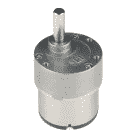](https://www.sparkfun.com/products/retired/12147) 

### [](https://www.sparkfun.com/products/retired/12147)

[Retired](https://learn.sparkfun.com/static/bubbles/ "Retired") ROB-12147

这些标准的齿轮马达是难以置信的强硬，并具有全金属齿轮，以帮助您驱动车轮，齿轮，或几乎任何东西…

1 **Retired**[Favorited Favorite](# "Add to favorites") 5[Wish List](# "Add to wish list")****** ******查看我们 DC 汽车公司的全部产品:

[DC Gearmotor Catalog](https://www.sparkfun.com/categories/247)**Warning!** The SCMD is a 3.3V logic device! If you need to interface to 5V you'll need to use a logic level converter, or modify the SCMDs from stock to operate at 5V, and supply your own regulated 5V.
[](https://www.sparkfun.com/products/12009) 

将**添加到您的[购物车](https://www.sparkfun.com/cart)中！**

### [SparkFun 逻辑电平转换器-双向](https://www.sparkfun.com/products/12009)

[In stock](https://learn.sparkfun.com/static/bubbles/ "in stock") BOB-12009

SparkFun 双向逻辑电平转换器是一个小型设备，可以安全地将 5V 信号降压至 3.3V，并升压 3。…

$3.50116[Favorited Favorite](# "Add to favorites") 146[Wish List](# "Add to wish list")** **### 推荐阅读

如果您不熟悉以下概念，我们建议您在继续之前通读这些教程。

[](https://learn.sparkfun.com/tutorials/serial-communication) [### 串行通信](https://learn.sparkfun.com/tutorials/serial-communication) Asynchronous serial communication concepts: packets, signal levels, baud rates, UARTs and more 100[](https://learn.sparkfun.com/tutorials/serial-peripheral-interface-spi) [### 串行外设接口(SPI)](https://learn.sparkfun.com/tutorials/serial-peripheral-interface-spi) SPI is commonly used to connect microcontrollers to peripherals such as sensors, shift registers, and SD cards.[Favorited Favorite](# "Add to favorites") 91[](https://learn.sparkfun.com/tutorials/i2c) [### I2C](https://learn.sparkfun.com/tutorials/i2c) An introduction to I2C, one of the main embedded communications protocols in use today.[Favorited Favorite](# "Add to favorites") 128[](https://learn.sparkfun.com/tutorials/motors-and-selecting-the-right-one) [### 电机并选择正确的电机](https://learn.sparkfun.com/tutorials/motors-and-selecting-the-right-one) Learn all about different kinds of motors and how they operate.[Favorited Favorite](# "Add to favorites") 45[](https://learn.sparkfun.com/tutorials/binary) [### 二进制的](https://learn.sparkfun.com/tutorials/binary) Binary is the numeral system of electronics and programming...so it must be important to learn. But, what is binary? How does it translate to other numeral systems like decimal?[Favorited Favorite](# "Add to favorites") 51[](https://learn.sparkfun.com/tutorials/logic-levels) [### 逻辑电平](https://learn.sparkfun.com/tutorials/logic-levels) Learn the difference between 3.3V and 5V devices and logic levels.[Favorited Favorite](# "Add to favorites") 82[](https://learn.sparkfun.com/tutorials/bi-directional-logic-level-converter-hookup-guide) [### 双向逻辑电平转换器连接指南](https://learn.sparkfun.com/tutorials/bi-directional-logic-level-converter-hookup-guide) An overview of the Bi-Directional Logic Level Converter, and some example circuits to show how it works.[Favorited Favorite](# "Add to favorites") 23[](https://learn.sparkfun.com/tutorials/hexadecimal) [### 十六进制的](https://learn.sparkfun.com/tutorials/hexadecimal) How to interpret hex numbers, and how to convert them to/from decimal and binary.[Favorited Favorite](# "Add to favorites") 32

## 术语

本指南和相关文档使用了一些具有特定含义的术语。使用*用户*和*扩展*时，指的是连接的物理引脚。当使用*控制器*和*外设*时，匹配*扩展端口*上的 I2C 行为，引用 SCMDs 的连接链。

**Note:** SparkFun has joined with other members of OSHWA in a resolution to move away from using "Master" and "Slave" to describe signals between the controller and the peripheral. Check out [this page](https://www.sparkfun.com/spi_signal_names) for more on our reasoning behind this change. You can also see OSHWA's resolution [here](https://www.oshwa.org/a-resolution-to-redefine-spi-signal-names).

*   **用户端口** -将用户的项目连接到*控制器* SCMD，在*外设*上未使用。
*   **扩展端口** -连接单个*控制器*和多达 16 个*外设*，永远不要连接到用户的项目。
*   **控制器** -连接到用户项目的 SCMD。还有就是*扩展端口*上的 I2C 控制器
*   **外设** -仅通过*扩展端口*连接到*控制器* SCMD 的 SCMD。

*注意:扩展端口的配置输入和输出引脚有时可能会连接到用户的项目，用于错误检查和缓解目的。*

**电机极性** -驱动程序和本文件经常省略电机极性。这是因为旋转方向的极性没有标准化，并且假设用户将它们向后连接 50%的时间。每个电机通道都可以通过命令独立配置为“正向”旋转。假设用户将首先连接电机，然后决定哪些通道需要反转，并且**在启动时发布反转设置。**

**扩展总线 I2C 上拉电阻** -所有控制器 SCMDs 都应该至少为其扩展总线启用一组上拉电阻，即使没有外设！电路板的默认状态是禁用，因为上拉电阻应根据设计仔细考虑，但这意味着没有外设的单个控制器会不直观地要求跳线闭合。

**电机编号**-SCMD 的丝网印刷显示了电机‘A’和电机‘B’的连接，以防止编程环境中的混淆，在编程环境中，数字用于表示电机或驱动器。

[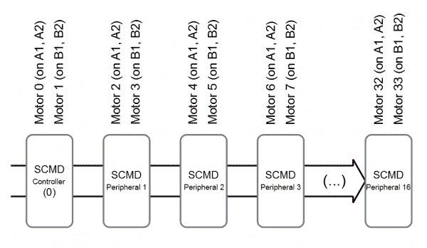](https://cdn.sparkfun.com/assets/learn_tutorials/5/7/4/motornumbering2_updated.jpg)*Motor numbering scheme*

当某物指的是一个“汽车号码”时，使用下面的方案。在“A”位置连接到控制器的电机将始终是电机 0，在“B”位置是电机 1。所连接的第一个外围设备将具有分别位于位置“A”和“B”的电机 2 和 3。外围设备 2 将具有电机 4 和 5，依此类推。

当 SCMD 被指定为桥接模式时，它将失去连接到“B”位置的任何电机，任何发送来控制“A”位置的信息将同步控制两个输出，例如反转或驱动强度。

这不要与“驱动程序号”混淆，后者表示链中的哪个 SCMD 被引用。

## 硬件概述

本节描述硬件的基本部分。

[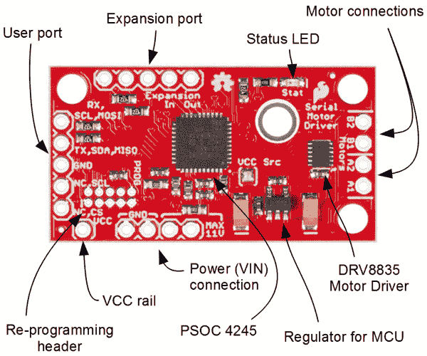](https://cdn.sparkfun.com/assets/learn_tutorials/5/7/4/FrontAnnotated01.png)*All of the components are populated on the top side of the board.*

电源通过 **VIN 连接**提供，并被调节至 3.3V，用于 PSoC 和逻辑电路。提供了一个 **VCC 轨道**销，以方便操作。

**状态 LED** 同时显示几个项目:

*   当它从控制器接收数据时发出一个信号。
*   大约每 2.5 秒闪烁一次，表示正常情况
*   每 2.5 秒闪烁 8 次，表示故障安全条件已经出现。

**用户端口**用于连接到用户项目(它将告诉电机做什么)，并且可以通过跳线设置配置为 UART、SPI 或 I2C。

根据跳线设置，**扩展端口**被配置为 I2C 控制器或外设，并在只有其他电机驱动器的第二条 I2C 总线上运行。

微控制器产生的 PWM 信号直接进入 **DRV8835** 电机驱动器，该驱动器由 2 个内置过热和电流保护的 mosfet H 桥驱动电路组成。

[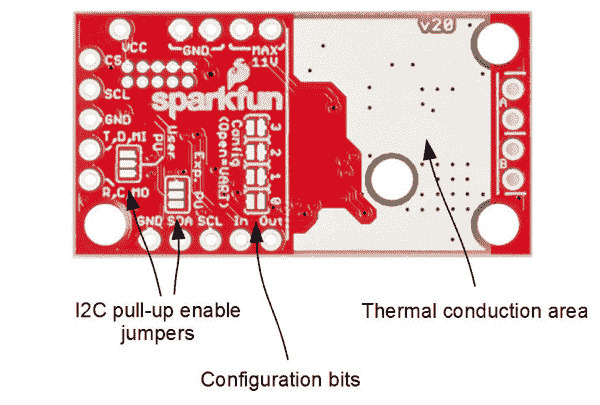](https://cdn.sparkfun.com/assets/learn_tutorials/5/7/4/RearAnnotated02.jpg)*The bottom of the board contains user configuration jumpers and a large area to wick the heat.*

### 为 SCMD 供电

向“最大 11V”和“GND”提供 **3.3V 至 11V** 。每个都有两个通用的通孔。它们可以用来降低连接电阻或搭载其他设备，或者可以接受大电容的引线。该引脚直接连接到 DRV8835 的电源输入端，并针对 PSoC 电源和逻辑电平下调至 3.3V。驱动器可以消耗高达 3A 的电流，所以请确保这些电线是短的或更重的规格，或两者兼而有之。

当外围设备连接到扩展端口时，它们也需要另一个电源。如[扩展端口使用](https://learn.sparkfun.com/tutorials/serial-controlled-motor-driver-hookup-guide#example-3-two-slaves-5-motors-1-bridged-spi-control)所示，将“最大 11V”和“3.3V”引脚与控制器并联。

VCC 引脚是一项高级功能，可用于在不同电压下操作 SCMD，但不用于基本应用。更多信息参见 [SCMD 数据表](https://github.com/sparkfun/Serial_Controlled_Motor_Driver/blob/controller/Documentation/SCMD_Datasheet.pdf?raw=true)。

### 跳线使用表

该板上有 4 组跳线需要配置。用户(**用户 PU** )和扩展总线( **Exp)都有上拉使能。PU** ，默认未上拉)，一个 VCC 断开跳线( **VCC Src** )，用于从板上调节器移除所有逻辑，以及 4 个**配置**位，用于选择操作模式。

| 名字 | 描述 | 使用 |
| VCC Src | 将 VCC 轨道(引脚)连接到板载调节器 | 打开以从 VCC 轨道上拆卸调节器。用户必须向 VCC 引脚提供 1.8V 至 5.5V 电压 |
| 用户 PU | 用户端口的 I2C 上拉使能 | 关闭所有三个焊盘，将 4.7k 电阻连接到用户端口的 SDA 和 SCL |
| Exp。聚氨酯 | 扩展端口的 I2C 上拉使能 | 关闭所有三个焊盘，将 4.7k 电阻连接到扩展端口的 SDA 和 SCL。扩展总线应该正好有一块板上启用了上拉电阻的板。没有外设的单个控制器在技术上是一个完整的扩展总线，因此单个控制器需要桥接这些跳线焊盘。 |
| 配置 | 串行和功能选择 | 配置位是构成配置字节的 4 位。闭合跳线为“1”，断开跳线为“0”。更多信息参见配置表。 |

### 配置位表

通过将一个数字编码到电路板底部的 4 个配置位来设置配置。闭合跳线表示 1，断开表示 0。使用此表查看每个配置中的用户端口、地址和扩展端口。

| 模式 | 方式 | 用户端口 | 用户地址 | 扩展端口 |
| 0000 | UART 在 9600 | 通用非同步收发传输器(Universal Asynchronous Receiver/Transmitter) | 不适用的 | 控制器 |
| 0001 | 精力 | 精力 | 不适用的 | 控制器 |
| 0010 | 外围的 | 不适用的 | 不适用的 | 外围的 |
| 0011 | I2C | I2C | 0x58 | 控制器 |
| 0100 | I2C | I2C | 0x59 | 控制器 |
| 0101 | I2C | I2C | 0x5A | 控制器 |
| 0110 | I2C | I2C | 0x5B | 控制器 |
| 0111 | I2C | I2C | 0x5C | 控制器 |
| One thousand | I2C | I2C | 0x5D | 控制器 |
| One thousand and one | I2C | I2C | 0x5E | 控制器 |
| One thousand and ten | I2C | I2C | 0x5F | 控制器 |
| One thousand and eleven | I2C | I2C | 0x60 | 控制器 |
| One thousand one hundred | I2C | I2C | 0x61 | 控制器 |
| One thousand one hundred and one | UART at 57600 | 通用非同步收发传输器(Universal Asynchronous Receiver/Transmitter) | 不适用的 | 控制器 |
| One thousand one hundred and ten | UART at 115200 | 通用非同步收发传输器(Universal Asynchronous Receiver/Transmitter) | 不适用的 | 控制器 |
| One thousand one hundred and eleven | 不适用的 | 内向的; 寡言少语的; 矜持的 | 不适用的 | 不适用的 |

### 引脚连接

该表中明确指出了 0.1 "孔的功能，并按 PCB 上的物理位置进行了组织。

|  |  |  |  | 功能/连接 |
| 组 | 名字 | 方向 | 描述 | 通用非同步收发传输器(Universal Asynchronous Receiver/Transmitter) | I2C | 精力 |
| 用户端口 | RX,SCL,COPI | 我 | 多功能串行 | 数据输入(接收) | SCL | 科皮 |
| TX，SDA，CIPO | 超正析象管(Image Orthicon) | 多功能串行 | 数据输出(TX) | 国家药品监督管理局 | 奇波 |
| GND | - | 地面 | 地面 | 地面 | 地面 |
| SCL 北卡罗来纳州 | 我 | SPI 时钟 | 网络计算机 | 网络计算机 | SCL |
| 数控、计算机科学 | 我 | SPI 芯片选择 | 网络计算机 | 网络计算机 | 特许测量员 |
| 扩展端口 | GND | - | 地面 | 外围总线接地 |
| 国家药品监督管理局 | 超正析象管(Image Orthicon) | I2C 数据线 | 外围总线 SCL |
| SCL | 我 | I2C 时钟线 | 外围总线 SDA |
| 在…里 | 我 | 配置在。外设获取地址/使能 | 连接到上游外设* |
| 在外 | O | 配置输出。启用下一个外设 | 连接到下游外设* |
| 电机端口 | 一流的 | O | 第一可寻址位置的绕组 | 电机 A 绕组 |
| 主动脉第二声 | O | 第一可寻址位置的绕组 | 电机 A 绕组 |
| B1 | O | 第二可寻址位置的绕组 | 电机 B 绕组 |
| B2 | O | 第二可寻址位置的绕组 | 电机 B 绕组 |
| 力量 | GND | 我 | 主系统接地(两个焊盘) | 电源接地 |
| 最大 11V | 我 | 电机驱动器原始电压，调节器输入(两个焊盘) | 电源 |
| VCC | 超正析象管(Image Orthicon) | 调节器输出或用户提供的 VCC | 网络计算机 |

### 典型应用电机和散热

SCMD 设计用于运行小型机器人驱动电机，无需散热器，高达约 500 毫安的连续电流。以下是一些普通电机在使用时的表现。

*   [Hobby Gearmotor - 200 RPM(双)](https://www.sparkfun.com/products/13302) - RedBot 型电机。这些具有低失速电流，可以在没有散热器的情况下使用。
*   [微型齿轮马达- 460RPM](https://www.sparkfun.com/products/12429) -这些可以在没有散热器的情况下使用。
*   [标准齿轮马达- 303RPM](https://www.sparkfun.com/products/12147) -这种较大尺寸的马达也可以在没有散热器的情况下使用。
*   CPU 风扇-可以多种多样。包括正向二极管以防止反向电压施加。有的可以拉大电流！如果驱动器变得太热，则需要散热片(或强制通风)。
*   [真空泵- 12V](https://www.sparkfun.com/products/10398) -这些泵可以汲取电流。驱动器需要散热。

### 确定是否需要散热器

温升与电机驱动器上的电流负载有关。为了确定你的负载是什么，将电机直接连接到电源，并施加扭矩，就像最终应用所做的那样。然后使用下面的图表来确定您是否需要散热器。也可以让电机完全失速，测量失速电流(或者用万用表检查线圈电阻，然后算算)。

[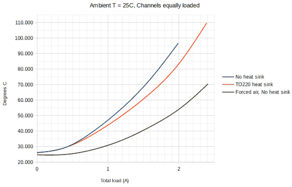](https://cdn.sparkfun.com/assets/learn_tutorials/5/7/4/temp_chart.png)*Temperature rise as a function of total driver load*

该图显示了 SCMD 从两个通道获得的总电流。如果使用桥接模式，在 X 轴上找到目标电流负载，然后在 Y 轴上查看这些配置的预期结果。如果不使用桥接模式，将单个电机的电流加倍，找出两个电机在最大电流下的最坏情况，然后使用该模式。

[TO-220 散热器](https://www.sparkfun.com/products/121)和 [Theragrip 热敏带](https://www.sparkfun.com/products/9771)用于制作上述图表，并在典型应用中很好地为自己提供了额外的安培容量。

## 示例 1:带外设的交互式 UART 控制

这个例子演示了基本的命令，加上一些只有 UART 可用的直接寄存器访问。这种类型的程序可以很容易地从没有 I2C 或 SPI 的更经典的 PC 的脚本中运行。

### 用户端口为 UART

**要求**

*   计算机串行终端设置为 9600 波特。
*   终端设置为发送 CR 和 LF(回车和换行)。
*   配置跳线设置为“0000”，或全部打开。
*   Exp。PU 跨接管完全关闭
*   5V 壁式电源

使用“硬件连接”中的图表将 FTDI 连接到 SCMD，并从墙壁电源为 SCMD 供电。将两个电机连接到驱动器，一个在 A1 和 A2 之间，另一个在 B1 和 B2 之间。

[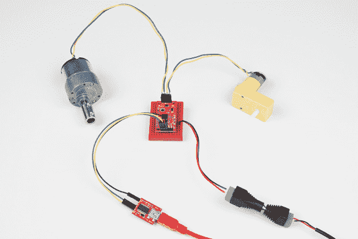](https://cdn.sparkfun.com/assets/learn_tutorials/5/7/4/Motor_Driver_Tutorial-01.jpg)A SCMD ready to drive motors from UART command.[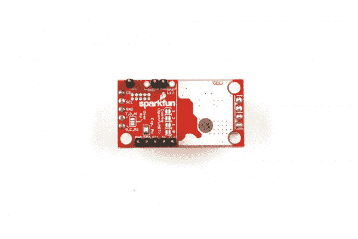](https://cdn.sparkfun.com/assets/learn_tutorials/5/7/4/jumpers5.jpg)*The controller is configured as UART ("0000"), and has pull up resistors enabled for the expansion bus.*

**连接**

按如下方式将 FTDI basic 连接到电机驱动器。请注意，两端都有指示数据输入的 RX，因此 RX-TX 串行线必须交叉。

[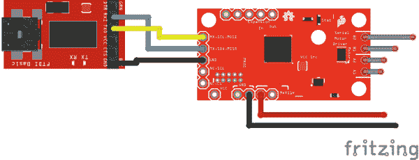](https://cdn.sparkfun.com/assets/learn_tutorials/5/7/4/UART_Connection2.jpg)

现在，输入应该会回显到您的终端，按 return 应该会生成一个新行(或错误消息)，并且可以输入命令。向前跳到 [UART 命令](https://learn.sparkfun.com/tutorials/serial-controlled-motor-driver-hookup-guide#uart-commands)，或者输入以下命令作为指导。如果输入的数据不好，您可能会注意到一些类似“inv”和“ovf”的响应。

**示例命令**

准备好后，发送以下命令:

" R01 "

这将读取 ID 寄存器并返回 0xA9

" M01F50 "

这将告诉电机 0 以半速向前驱动-但是什么也不会发生！

" E "

这将启用所有驱动程序。电机 0 应开始以半速旋转。

" M01R100 "

这将告诉马达 1 全速向后驱动。现在两者都应该朝着相反的方向旋转。

“M01S”

这将导致马达 1 反转“前进”方向。两者现在应该都在朝同一个方向旋转。

" E "

e 将再次禁用两个电机，这将停止旋转。

完整的命令列表参见“UART 命令”部分。

## UART 命令

### 常规:

命令解析器可接受 ascii 数据的短字符串，压缩后可减少数据传输量，同时易于标准 UART 硬件处理。一般的形式是一个字母，表示要执行的操作，后跟一系列数字和字母，最后是回车和换行。作为字符串，一个示例命令是“M0F50\r\n”。

### 返回代码:

溢出(" **ovf** "):输入缓冲区被填满(没有命令应该那么长)。发送分隔符以清除缓冲区

无效语法(" **inv** "):命令中的第一个字符不是定义的前缀之一。

格式错误(" **fmt** "):命令通常有问题，比如它有错误的字符数或检测到超出范围的值。

无电机(" **nom** "):电机编号超过检测到的最下游外设。

### 命令:

**帮助:**

`"H"`或`"?"`

打印串行命令参考。

示例:
`"H\r\n"`–以 34%的速度向前驱动控制器电机 B。

**驱动电机:**

`"Mndl"`
n =电机编号，一位数或两位数
d =方向，R 或 F
l =级别，0 到 100

示例:
`"M1F34\r\n"`–以 34%的速度向前驱动控制器电机 B。
`"M2R80\r\n"`–以 80%的速度驱动外围电机 A 反转。

**反转电机极性:**

`"MnI"`
n =电机编号，一位数或两位数

例:
`"M1I\r\n"`–反转电机 1 的极性。

**清除电机反转:**

`"MnC"`
n =电机编号，一位数或两位数

示例:
`"M1C\r\n"`–将电机 1 的极性设置为默认。

**启用和禁用驱动** `"E"`和`"D"`

驱动器在禁用状态下启动，以便在开始驱动电机之前可以配置其他设置。使用这些命令来启用和禁用它们。

例如:
`"E\r\n"`–启用所有输出
`"D\r\n"`–禁用所有输出

**桥接和非桥接输出**

`"Brr"`和`"Nrr"`
rr =电机驱动器号，0 是控制器，1-16 是外设

这导致电机驱动器在“A”和“B”端口上启动或停止同步 PWM。请注意，输入是通过电路板编号，而不是电机编号。

例如:
`"B0\r\n"`–桥接控制器的输出`"B2\r\n"`–桥接第二物理外设的输出(电机 4&5)`"N0\r\n"`–解桥接控制器的输出`"N2\r\n"`–解桥接第二物理外设的输出(电机 4 & 5)

**改变波特率**

`"Un"`
n =波特率选择

该命令改变 UART 的比特率。在此命令之后，串行终端需要重新配置。在更改为新的波特率之前，该命令会以旧的波特率报告新的波特率。

支持的费率:
1–2400
2–4800
3–9600
4–14400
5–19200
6–38400
7–57600
8–115200

示例:
`"U3\r\n"`–设置波特率为 9600
`"U8\r\n"`–设置波特率为 115200

**写寄存器**

`"Wrrhh"`
rr =两位数十六进制地址
hh =两位数十六进制数据

示例:
`"W20FF\r\n"`–将 0xFF 写入寄存器 0x20 (MA_DRIVE)。

**读取寄存器**

`"Rrr"`
rr =两位数十六进制地址

例如:
`"R01\r\n"`–读取地址 0x01 (ID)，总线将显示“A9”，ID 字为 0xA9

**Arbitrary register access** Some of the more intricate features like bus settings and debug information can be accessed by reading from a user-facing memory space, called registers. Use the [SCMD datasheet](https://github.com/sparkfun/Serial_Controlled_Motor_Driver/blob/master/Documentation/SCMD_Datasheet.pdf) for mapping and function.

## Arduino 库参考

示例 2 和示例 3 使用 Arduino IDE 和 RedBoard 与 SCMD 通信。本节概述了如何获得它以及函数本身如何操作。

### 获取 Arduino 库

要获取 Arduino 库，请从 Github 下载，或者使用 Arduino 库管理器。

**下载 Github 库**

访问 [GitHub 库](https://github.com/sparkfun/SparkFun_Serial_Controlled_Motor_Driver_Arduino_Library)下载最新版本的库，或者点击下面的链接:

[Download the Arduino Library](https://github.com/sparkfun/SparkFun_Serial_Controlled_Motor_Driver_Arduino_Library/archive/master.zip)

**使用库管理器或安装在 Arduino IDE 中**

要获得安装库的帮助，请查看我们的[如何安装 Arduino 库教程](https://learn.sparkfun.com/tutorials/installing-an-arduino-library)。

如果你不使用管理器，你需要将*spark fun _ Serial _ Controlled _ Motor _ Driver _ Arduino _ Library*文件夹移动到 Arduino sketchbook 中的 *libraries* 文件夹。

### 运营图书馆

该库是这样创建的，即新的电机驱动器对象是不带参数构建的，用户填充公共设置结构，然后调用`.begin()`启动接线库并应用通信设置。

示例:

```
language:c
SCMD myMotorDriver; //This creates an instance of SCMD which will be bound to a single controller.

void setup()
{
    myMotorDriver.settings.commInterface = I2C_MODE; //or SPI_MODE
    myMotorDriver.settings.I2CAddress = 0x5A;
    myMotorDriver.settings.chipSelectPin = 10;
    myMotorDriver.begin();
} 
```

#### 设置

主 SCMD 类有一个名为 settings 的公共成员。要配置设置，使用格式`myMotorDriver.settings.I2CAddress = (...);`，然后调用`.begin()`进行应用。

设置包含以下成员:

*   uint8_t commInterface -设置为等于 I2C 模式或 SPI 模式
*   uint8_t I2CAddress -设置在使用 I2C 的情况下控制器配置的地址
*   uint8_t chipSelectPin -设置为 SPI 情况下 Arduino 上使用的芯片选择引脚

### 类别和结构

图书馆里有几门课。主类叫做`SCMD`，是和电机驱动对话的对象。还有几个结构在使用中- `SCMDSettings`和`SCMDDiagnostics`。名为 settings 的`SCMDSettings`对象存在于配置的 SCMD 类中。

#### SCMD

SCMD 用于声明设置中指定端口和模式的单链电机驱动器。包含的函数将在后面的章节中描述。

```
language:c
class SCMD
{
public:
    //settings
    SCMDSettings settings;
    SCMD( void );

    uint8_t begin( void );
    ... (Other functions...)

    uint16_t i2cFaults; //Location to hold i2c faults for alternate
    driver
}; 
```

#### SCMD 设置

SCMDSettings 是 SCMD 的设置成员的类型。它被声明为公共的，由用户进行配置。

```
language:c
struct SCMDSettings
{
public:
    //Main Interface and mode settings
    uint8_t commInterface;
    uint8_t I2CAddress;
    uint8_t chipSelectPin;
}; 
```

#### SCMD 诊断公司

SCMDDiagnostics 包含一组 8 位数据值，用于 getDiagnostics 和 getRemoteDiagnostics。声明的对象作为诊断函数的引用传递，并由收集的数据写入。

```
language:c
struct SCMDDiagnostics
{
public:
    //Attainable metrics from SCMD
    uint8_t numberOfSlaves = 0;
    uint8_t U_I2C_RD_ERR = 0;
    uint8_t U_I2C_WR_ERR = 0;
    uint8_t U_BUF_DUMPED = 0;
    uint8_t E_I2C_RD_ERR = 0;
    uint8_t E_I2C_WR_ERR = 0;
    uint8_t LOOP_TIME = 0;
    uint8_t SLV_POLL_CNT = 0;
    uint8_t MST_E_ERR = 0;
    uint8_t MST_E_STATUS = 0;
    uint8_t FSAFE_FAULTS = 0;
    uint8_t REG_OOR_CNT = 0;
    uint8_t REG_RO_WRITE_CNT = 0;
}; 
```

### 功能

#### uint 8 _ t begin(void)；

提供设置后调用启动线库，应用设置，获取 ID 字(返回值应为 0xA9)。除非这个返回 0xA9，否则不要前进！

#### bool ready( void );

该函数检查 SCMD 是否完成引导并准备好接收命令。之后用这个。begin()，在返回 true 之前不要进入主程序。

#### bool busy( void );

该函数检查 SCMD 是否忙于某项操作。发送每个配置命令之前，等待 busy 清零(电机驱动级别不需要)。

#### void enable(无效)；

之后打电话。begin()；以允许 PWM 信号进入 H 桥。如果任何输出连接为桥接，请在调用之前配置要桥接的驱动器。enable()；。这可以防止网桥在配置前相互短路。

#### void disable(作废)；

要求从 H 桥上移除驱动器。所有输出都将变低。

#### void reset(作废)；

这将使用备用库重置 Teensy 3 设备的 I2C 硬件，除此之外没有任何其他作用。

#### void setDrive( uint8_t 通道，uint8_t 方向，uint8_t 级别)；

这将设置一个以某一水平和方向驱动的输出。

*   通道:电机编号，从 0 到 33。
*   方向:1 或 0 表示向前或向后。
*   级别:0 到 255 的驱动强度。

#### void inversion mode(uint 8 _ t motor num，uint 8 _ t polarity)；

这将改变特定电机的感知方向。

*   电机编号:电机编号，从 0 到 33。
*   极性:0 表示正向，1 表示反向。

#### void bridging mode(uint 8 _ t driver num，uint 8 _ t bridged)；

这将任何电路板的输出连接在一起，从“A”位置控制两者。

*   driverNum:连接的 SCMD 数量，0(控制器)到 16。
*   桥接:0 表示正常，1 表示桥接。

#### void get diagnostics(scmd diagnostics & diagObjectReference)；

这将从控制器返回诊断报告。

*   &diagObjectReference:传递将被写入的本地 SCMDDiagnostics 对象。

#### void getremoteddiagnostics(uint 8 _ t address，scmd diagnostics & diagObjectReference)；

这将从外围设备返回诊断报告。

*   地址:目标外设的地址。对于第一个外设，这从 0x50 开始，然后向上。
*   &diagObjectReference:传递将被写入的本地 SCMDDiagnostics 对象。

#### void resetDiagnosticCounts(void)；

清除控制器的诊断计数。

#### void resetRemoteDiagnosticCounts(uint 8 _ t 地址)；

清除外设的诊断计数。

*   地址:目标外设的地址。对于第一个外设，这从 0x50 开始，然后向上。

#### uint8_t 读寄存器(uint8_t 偏移量)；

返回控制器内存位置的内容。

*   offset:要读取的内存地址。

#### void write register(uint 8 _ t offset，uint 8 _ t dataToWrite)；

将数据写入控制器的存储位置。

*   offset:要写入的内存地址。
*   dataToWrite:要写入该地址的数据。

#### uint8_t read remote register(uint 8 _ t 地址，uint 8 _ t 偏移量)；

返回外设存储单元的内容。

*   地址:目标外设的地址。对于第一个外设，这从 0x50 开始，然后向上。
*   offset:要读取的内存地址。

#### void writeremoterector(uint8_t 地址，uint8_t 偏移量，uint 8 _ t 数据写入)；

将数据写入外设的存储位置。

*   地址:目标外设的地址。对于第一个外设，这从 0x50 开始，然后向上。
*   offset:要写入的内存地址。
*   dataToWrite:要写入该地址的数据。

## 示例 2: RedBot 改造(I2C 控制)

这个例子驱动一个机器人在左和右弧，在一个整体摆动的过程中驱动。它展示了可变控制能力。当与 RedBot 底盘一起使用时，每个驱动器每次转动约 90 度。

**要求**

*   [SparkFun RedBoard](https://www.sparkfun.com/products/12757) 或兼容 Arduino 的 328p 设备
*   Arduino 库
*   配置跳线设置为地址 0x5A 或“0101”，或位置 0 和 2 闭合，1 和 3 断开。其他地址可以通过使用 0x3 至 0xE 的位模式来选择，并将适当的地址编程到 328p 代码中。
*   用户 PU 跳线完全关闭
*   Exp。PU 跨接管完全关闭

328p 现已准备好与 SCMD 通信。关于 API 用法，请直接跳到 [Arduino 库](https://learn.sparkfun.com/tutorials/serial-controlled-motor-driver-hookup-guide#arduino-library-reference)部分，或者使用其中一个示例草图。

[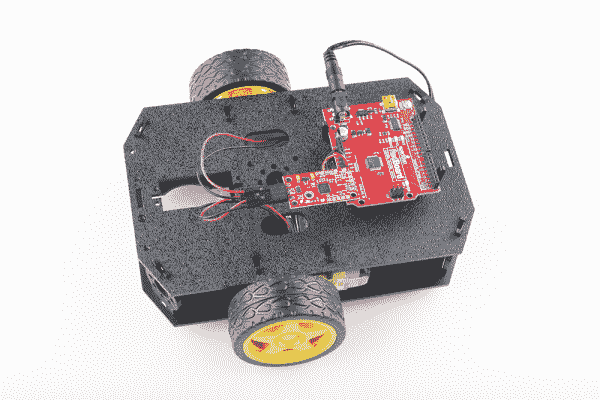](https://cdn.sparkfun.com/assets/learn_tutorials/5/7/4/Marshall_hookup_guide-01.jpg)This [Shadow Chassis](https://www.sparkfun.com/products/13301) has been Red-trofitted with a RedBoard and SCMD[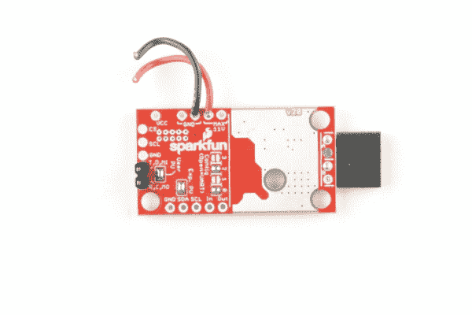](https://cdn.sparkfun.com/assets/learn_tutorials/5/7/4/jumpers1.jpg)The connections made are shown here.

**连接**

将 Arduino basic 连接到电机驱动器，如下所示。SDA 和 SCL 引脚仅由 SCMD 上拉，应该在 3.3V 空闲

[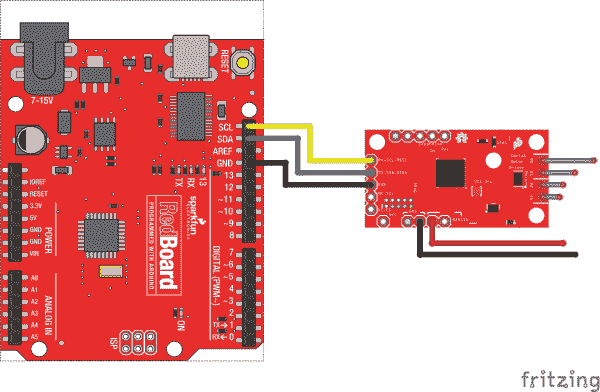](https://cdn.sparkfun.com/assets/learn_tutorials/5/7/4/I2C_Connection2.jpg)

**示例代码**

这个例子也可以从 Arduino 的下拉菜单中获得(它被称为 TwoMotorRobot)，如下所示:

```
language:c
//This example drives a robot in left and right arcs, driving in an overall wiggly course.
//  It demonstrates the variable control abilities. When used with a RedBot chassis,
//  each turn is about 90 degrees per drive.
//
//  Pin 8 can be grounded to disable motor movement, for debugging.

#include <Arduino.h>
#include <stdint.h>
#include "SCMD.h"
#include "SCMD_config.h" //Contains #defines for common SCMD register names and values
#include "Wire.h"

SCMD myMotorDriver; //This creates the main object of one motor driver and connected peripherals.

void setup()
{
  pinMode(8, INPUT_PULLUP); //Use to halt motor movement (ground)

  Serial.begin(9600);
  Serial.println("Starting sketch.");

  //***** Configure the Motor Driver's Settings *****//
  //  .commInter face can be I2C_MODE or SPI_MODE
  myMotorDriver.settings.commInterface = I2C_MODE;
  //myMotorDriver.settings.commInterface = SPI_MODE;

  //  set address if I2C configuration selected with the config jumpers
  myMotorDriver.settings.I2CAddress = 0x5A; //config pattern "0101" on board for address 0x5A

  //  set chip select if SPI selected with the config jumpers
  myMotorDriver.settings.chipSelectPin = 10;

  //*****initialize the driver get wait for idle*****//
  while ( myMotorDriver.begin() != 0xA9 ) //Wait until a valid ID word is returned
  {
    Serial.println( "ID mismatch, trying again" );
    delay(500);
  }
  Serial.println( "ID matches 0xA9" );

  //  Check to make sure the driver is done looking for peripherals before beginning
  Serial.print("Waiting for enumeration...");
  while ( myMotorDriver.ready() == false );
  Serial.println("Done.");
  Serial.println();

  //*****Set application settings and enable driver*****//

  //Uncomment code for motor 0 inversion
  //while( myMotorDriver.busy() );
  //myMotorDriver.inversionMode(0, 1); //invert motor 0

  //Uncomment code for motor 1 inversion
  while ( myMotorDriver.busy() ); //Waits until the SCMD is available.
  myMotorDriver.inversionMode(1, 1); //invert motor 1

  while ( myMotorDriver.busy() );
  myMotorDriver.enable(); //Enables the output driver hardware

}

#define LEFT_MOTOR 0
#define RIGHT_MOTOR 1
void loop()
{
  //pass setDrive() a motor number, direction as 0(call 0 forward) or 1, and level from 0 to 255
  myMotorDriver.setDrive( LEFT_MOTOR, 0, 0); //Stop motor
  myMotorDriver.setDrive( RIGHT_MOTOR, 0, 0); //Stop motor
  while (digitalRead(8) == 0); //Hold if jumper is placed between pin 8 and ground

  //***** Operate the Motor Driver *****//
  //  This walks through all 34 motor positions driving them forward and back.
  //  It uses .setDrive( motorNum, direction, level ) to drive the motors.

  //Smoothly move one motor up to speed and back (drive level 0 to 255)
  for (int i = 0; i < 256; i++)
  {
    myMotorDriver.setDrive( LEFT_MOTOR, 0, i);
    myMotorDriver.setDrive( RIGHT_MOTOR, 0, 20 + (i / 2));
    delay(5);
  }
  for (int i = 255; i >= 0; i--)
  {
    myMotorDriver.setDrive( LEFT_MOTOR, 0, i);
    myMotorDriver.setDrive( RIGHT_MOTOR, 0, 20 + (i / 2));
    delay(5);
  }
  //Smoothly move the other motor up to speed and back
  for (int i = 0; i < 256; i++)
  {
    myMotorDriver.setDrive( LEFT_MOTOR, 0, 20 + (i / 2));
    myMotorDriver.setDrive( RIGHT_MOTOR, 0, i);
    delay(5);
  }
  for (int i = 255; i >= 0; i--)
  {
    myMotorDriver.setDrive( LEFT_MOTOR, 0, 20 + (i / 2));
    myMotorDriver.setDrive( RIGHT_MOTOR, 0, i);
    delay(5);
  }
} 
```

该示例的工作原理是配置电机驱动器，然后使用`for`环路来提升和降低电机驱动电平。

需要注意的事项:

*   begin 会定期运行，直到返回的 ID 字有效。
*   安装程序等待 isReady()变为 true，然后继续执行驱动器部分
*   一个电机在设置时通过命令反转。在这里做吧，这样你就不用以后再弄乱它了。
*   调用 enable()将驱动器连接到 PWM 发生器。
*   定义左 _ 马达和右 _ 马达是为了便于使用 setDrive(...)功能。

## 示例 3:两个外设，5 个电机，1 个桥接(SPI 控制)

这演示了串行驱动程序的更高级用法。这里，我们连接了几个外设，其中一个配置为桥接模式。这是电机编号方案如何工作的一个很好的例子。

**要求**

*   [SparkFun RedBoard](https://www.sparkfun.com/products/12757) 或兼容 Arduino 的 328p 设备
*   Arduino 库
*   一个逻辑电平转换器
*   控制器配置跳线设置为“0001”，或仅位置“0”关闭。
*   外围配置跳线设置为“0010”，或仅位置“1”关闭。
*   Exp。PU 跨接管完全关闭

[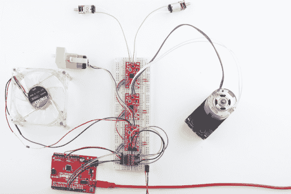](https://cdn.sparkfun.com/assets/learn_tutorials/5/7/4/Marshall_hookup_guide-04.jpg)*The motor drivers are connected on a breadboard for test.*[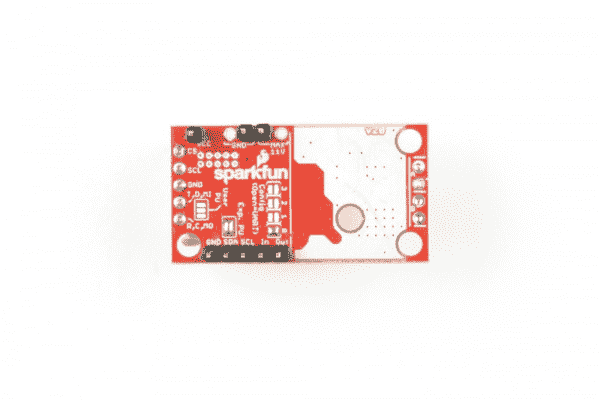](https://cdn.sparkfun.com/assets/learn_tutorials/5/7/4/jumpers2.jpg)*The controller is configured as SPI ("0001"), and has pull up resistors enabled for the expansion bus.*[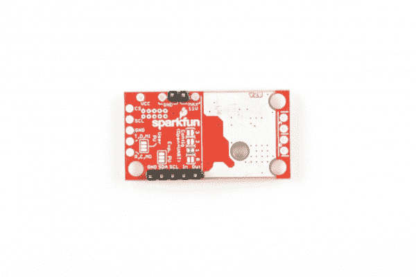](https://cdn.sparkfun.com/assets/learn_tutorials/5/7/4/jumpers3.jpg)*Peripherals boards should be set to "0010" with no pull up resistors enabled, as the controller is doing it.*

**连接**

将 Arduino 和电平转换器连接到电机驱动器，如下所示。这连接到标准的 SCL、COPI 和 CIPO 位置，并将引脚 10 用作片选。

[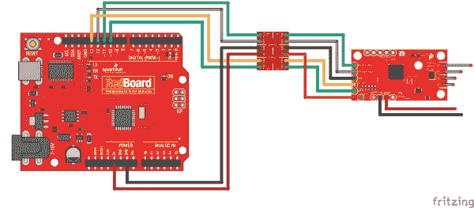](https://cdn.sparkfun.com/assets/learn_tutorials/5/7/4/SPI_LLC_gimp.jpg)*The user port connections for this example*

虽然此示例仅使用一个控制器，但要获得完整的体验，请在扩展端口上添加外围设备。

扩展端口允许从同一 I2C 地址、SPI 选择线或 UART 实例运行多个 SCMDs。该端口可支持多达 16 个 SCMDs，通过通用 I2C 接口和菊花链配置输入至配置输出布线设置为外设

[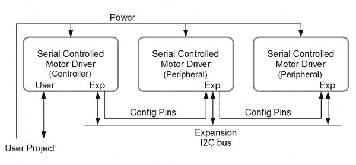](https://cdn.sparkfun.com/assets/learn_tutorials/5/7/4/peripheralTopology_updated.jpg)*A diagram showing the expansion bus usage*

请注意，扩展 I2C 线连接到公共总线，而配置线从一个板的“输出”连接到下一个板的“输入”。更多的外设可以添加到链的末端。

[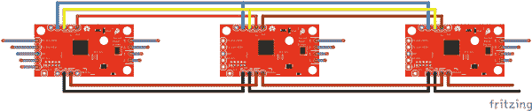](https://cdn.sparkfun.com/assets/learn_tutorials/5/7/4/ExpI2CBasic_Connection.png)*The expansion bus connections*

通电后，控制器将为外设分配地址。这可能需要几秒钟。完成后，外围设备都应该有一个微弱发光、闪烁的状态 LED 来指示通信。

**示例代码**

该示例也可从 Arduino 的下拉菜单中获得(它被称为 DriverChainWithBridging)，如下所示:

```
language:c
//This example demonstrates some of the more advanced usage of the motor driver.
//It uses 3 motor drivers, with the controller attached as SPI.  One peripheral is bridged,
//and the sketch test drives each motor. (There will be a break when the overtaken motor
//channel is activated.)
//
//This also shows how to count the number of connected peripherals and report, as well as
//arbitrary register access.

#include <Arduino.h>
#include <stdint.h>
#include "SCMD.h"
#include "SCMD_config.h" //Contains #defines for common SCMD register names and values
#include "Wire.h"

//#defines

//Variables
//***** Create the Motor Driver object*****//
SCMD myMotorDriver;

void setup()
{
  Serial.begin(9600);

  Serial.println("Starting sketch.");

  //***** Configure the Motor Driver's Settings *****//

  //  .commInter face can be I2C_MODE or SPI_MODE
  myMotorDriver.settings.commInterface = I2C_MODE;
  //myMotorDriver.settings.commInterface = SPI_MODE;

  //  set address if I2C configuration selected with the config jumpers
  myMotorDriver.settings.I2CAddress = 0x5A; //config pattern "0101" on board for address 0x5A
  //  set chip select if SPI selected with the config jumpers
  myMotorDriver.settings.chipSelectPin = 10;

  delay(2500); //Give the serial driver time to check for peripherals

  //  initialize the driver and enable the motor outputs
  uint8_t tempReturnValue = myMotorDriver.begin();
  while ( tempReturnValue != 0xA9 )
  {
    Serial.print( "ID mismatch, read as 0x" );
    Serial.println( tempReturnValue, HEX );
    delay(500);
    tempReturnValue = myMotorDriver.begin();
  }
  Serial.println( "ID matches 0xA9" );

  Serial.print("Waiting for enumeration...");
  while ( myMotorDriver.ready() == false );
  Serial.println("Done.");

  //  Report number of peripherals found
  uint8_t tempAddr = myMotorDriver.readRegister(SCMD_SLV_TOP_ADDR);
  if ( tempAddr >= START_SLAVE_ADDR )
  {
    Serial.print("Detected ");
    Serial.print(tempAddr - START_SLAVE_ADDR + 1); //Top address minus bottom address + 1 = number of peripherals
    Serial.println(" peripherals.");
  }
  else
  {
    Serial.println("No peripherals detected");
  }

  //Configure bridging modes
  myMotorDriver.bridgingMode( 1, 1 ); //( DriverNum 1, bridged state = 1 )  This will bridge the first peripheral

  //Uncomment to set inversion

  //myMotorDriver.inversionMode(0, 1); //invert controller, channel A
  //myMotorDriver.inversionMode(1, 1); //invert controller, channel B
  //myMotorDriver.inversionMode(2, 1); //invert peripheral 1, channel A
  //    no need to configure motor 3, this position does nothing because the peripheral is bridged.
  //myMotorDriver.inversionMode(4, 1); //invert peripheral 2, channel A
  //myMotorDriver.inversionMode(5, 1); //invert peripheral 2, channel B

  //Enable the motors.
  myMotorDriver.enable();

  pinMode(8, INPUT_PULLUP);

}

void loop()
{
  //***** Operate the Motor Driver *****//
  //  This walks through all 34 motor positions driving them forward and back.
  //  It uses .setDrive( motorNum, direction, level ) to drive the motors.
  //
  //  Notice that when i == 3, no motor spins.  This position is made inactive by bridging the first peripheral.
  Serial.println("Now stepping through the motors.");
  for (int i = 0; i < 6; i++)
  {
    Serial.print("Driving motor ");
    Serial.println(i);

    myMotorDriver.setDrive( i, 1, 255); //Drive motor i forward at full speed
    delay(1000);
    myMotorDriver.setDrive( i, 0, 255); //Drive motor i backward at full speed
    delay(1000);
    myMotorDriver.setDrive( i, 1, 0);
  }
} 
```

该示例通过计算 6 个电机位置并命令它们前进，然后后退来工作。

需要注意的事项:

*   仅使用一个 SCMD 对象，所有外设都通过控制器访问。
*   begin 会定期运行，直到返回的 ID 字有效。
*   安装程序等待 isReady()变为 true，然后继续执行驱动器部分
*   外设通过直接访问寄存器来计数。所有的大写值都在 SCMD 配置文件中定义
*   桥接模式(...)被调用到桥，由电机驱动器编号(控制器是驱动器 0)。
*   电机 3 被排除在外，因为该通道通过 brdiging 与电机 2 相连。虽然它仍然可以被命令，但它将不起作用。
*   调用 enable()来激活电机。这发生在桥接配置被设置为保护驱动程序之后。

## 资源和更进一步

**高级功能**

高级功能，如配置故障安全、数据速率、诊断功能和桥接可在以下文件中找到。使用支持书签的 PDF 查看器进行最简单的导航。

*   [SCMD 数据表](https://github.com/sparkfun/Serial_Controlled_Motor_Driver/blob/master/Documentation/SCMD_Datasheet.pdf?raw=true)

本指南中未涉及的内容:

*   VCC 易碎，允许高达 5.5v 的水平。
*   PSoC 编程端口。
*   总线诊断报告
*   可配置的故障保护时间和操作
*   可配置的扩展总线比特率为 50、100 或 400 kHz。
*   可配置的扩展总线更新速率从 1 毫秒到 255 毫秒，或仅通过命令。

**附加示例**

还有一些额外的例子和这个库打包在一起，这里没有描述。看看它们和 arduino 库源文件，更好地理解高级用法。

本指南中未涉及的 Arduino 示例:

*   用于将来自 Arduino 窗口的 ascii 通信转换成直接的寄存器访问。
*   演示了如何读取诊断寄存器，以及如何使用内置的诊断结构来存储数据。

github repo[xbeetensyxcvr](https://github.com/marshalltaylorSFE/XbeeTeensyXCVR)提供的机器人示例:

*   HamburgerBot -使用模拟驾驶行为的数字输入的双轮机器人。
*   DualDriveBot——双轮机器人，使用模拟驾驶杆提供平稳的单杆驾驶。

**Heads up!** Originally, these examples were written to configure an XBee Series 1 to communicate in transparency mode. However, this can apply to the XBee Series 3 module as long as you configure the firmware to the legacy 802.15.4 protocol. For more information, check out the [Exploring XBees and XCTU](https://learn.sparkfun.com/tutorials/exploring-xbees-and-xctu) tutorial.

| [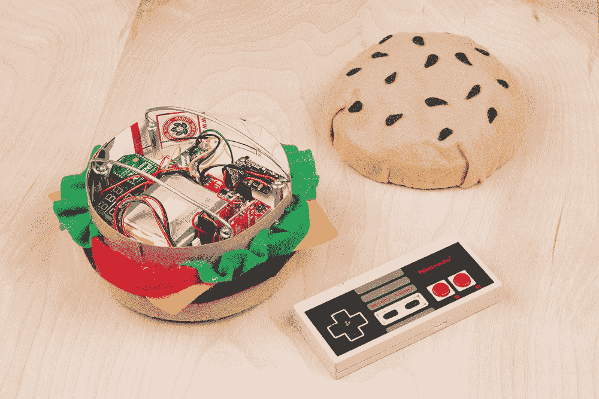](https://raw.githubusercontent.com/marshalltaylorSFE/XbeeTeensyXCVR/master/HamburgerBot/HamburgerBotPicture.jpg) | [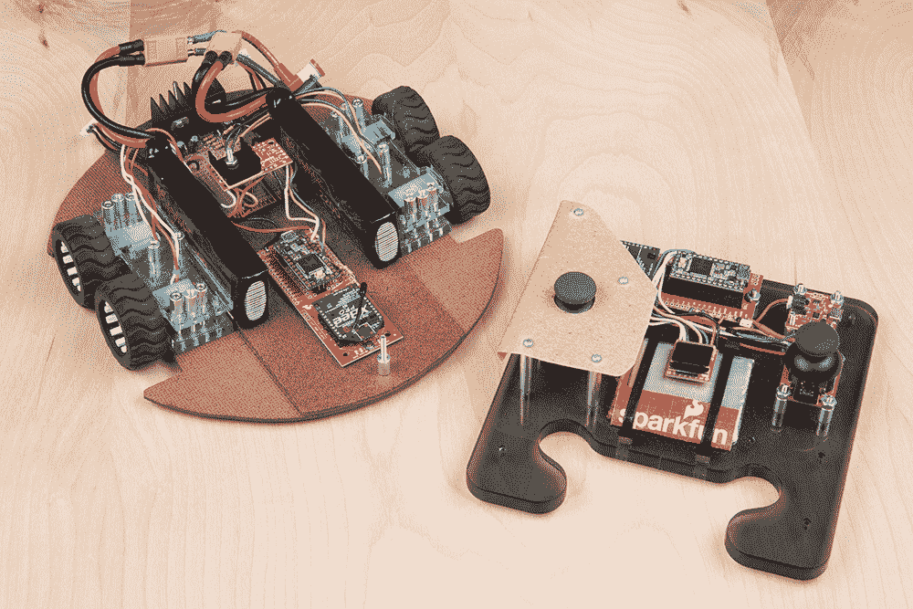](https://raw.githubusercontent.com/marshalltaylorSFE/XbeeTeensyXCVR/master/DualDriveBot/DualDrivePicture.jpg) |

*These robots are built using the serial controlled motor driver, with an XBee link.*

查看 SCMD 演示视频中的更多机器人动作:

[https://www.youtube.com/embed/Q21V0vhh-ZM/?autohide=1&border=0&wmode=opaque&enablejsapi=1](https://www.youtube.com/embed/Q21V0vhh-ZM/?autohide=1&border=0&wmode=opaque&enablejsapi=1)

* * *

要了解更多的汽车驾驶动作，请查看其他精彩的 SparkFun 教程:

[](https://learn.sparkfun.com/tutorials/actobotics-basic-differential-platform) [### 机器人基础差分平台](https://learn.sparkfun.com/tutorials/actobotics-basic-differential-platform) Get started with Actobotics with this simple vehicle. Then expand and customize it for your own evil robot empire.[Favorited Favorite](# "Add to favorites") 7[](https://learn.sparkfun.com/tutorials/shapeoko-coaster-project) [### Shapeoko Coaster 项目](https://learn.sparkfun.com/tutorials/shapeoko-coaster-project) A step-by-step guide to cutting and engraving a coaster with the Shapeoko.[Favorited Favorite](# "Add to favorites") 3[](https://learn.sparkfun.com/tutorials/ardumoto-kit-hookup-guide) [### Ardumoto 套件连接指南](https://learn.sparkfun.com/tutorials/ardumoto-kit-hookup-guide) Learn how to assemble and drive DC motors using the v2.0 Ardumoto Shield.[Favorited Favorite](# "Add to favorites") 4[](https://learn.sparkfun.com/tutorials/light-seeking-robot) [### 寻光机器人](https://learn.sparkfun.com/tutorials/light-seeking-robot) We use parts from the SparkFun Inventor's Kit v4.0 to create a light-seeking robot that mimics the behavior of single-celled organisms.[Favorited Favorite](# "Add to favorites") 8********