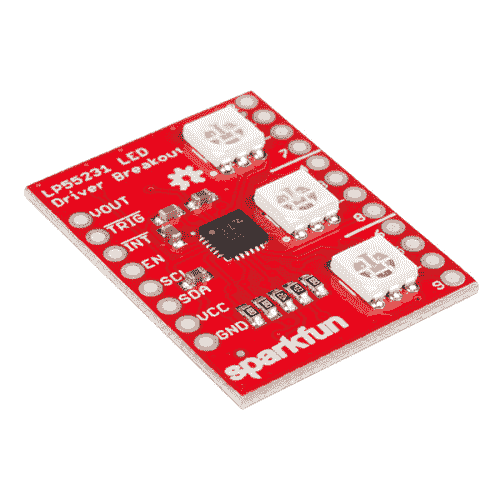
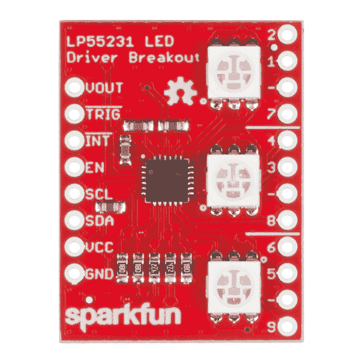
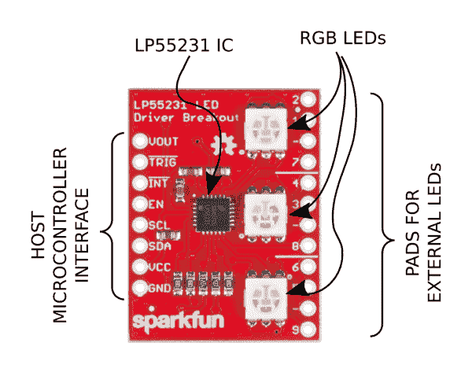
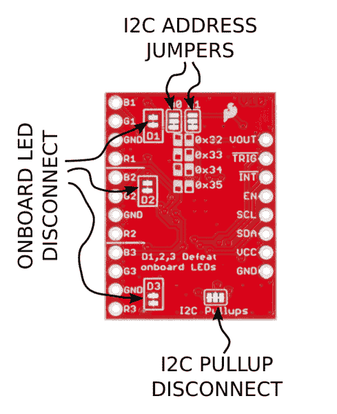
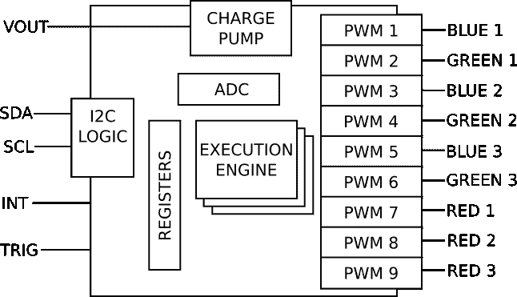

# LP55231 分线板连接指南

> 原文：<https://learn.sparkfun.com/tutorials/lp55231-breakout-board-hookup-guide>

## 介绍

[SparkFun LP55231 分线板](https://www.sparkfun.com/products/13884)采用德州仪器的 [LP55231](https://cdn.sparkfun.com/datasheets/BreakoutBoards/lp55231.pdf) ，这是一个九通道 I2C LED 控制器。它使用脉宽调制驱动 led，因此非常适合可变强度和混色应用。

 

将**添加到您的[购物车](https://www.sparkfun.com/cart)中！**

 **### [SparkFun LED Driver Breakout-LP 55231](https://www.sparkfun.com/products/13884)

[In stock](https://learn.sparkfun.com/static/bubbles/ "in stock") BOB-13884

SparkFun LP55231 LED 驱动器分线点是一个独立的解决方案，用于开发和部署九通道 I2C LED 电路

$10.50[Favorited Favorite](# "Add to favorites") 9[Wish List](# "Add to wish list")** **它旨在用于移动设备和汽车应用，从主机控制器卸载 LED 控制操作。这并不意味着[耀眼](https://www.sparkfun.com/products/13104)，但它有一些有用的技巧。

*   首先，有一个板载电荷泵电源，允许它以高于电源电压的正向电压驱动 led。(回想一下，[白色 LED](https://www.sparkfun.com/products/531) 的正向电压正好在 3.3V 左右，蓝色甚至更高)。
*   其次，它有一个 LED 卸载引擎。这是一款 LED 专用微控制器，无需主机微控制器的协助即可完成 LED 操作。它可以独立执行 LED 操作，如追逐、闪烁和渐变。

分线板包括芯片，并添加了三个 RGB LEDs，以及连接焊盘和配置跳线。

在本连接指南中，我们将展示常规模式和卸载模式之间的区别。我们将从一个简单的应用开始，说明如何在主机微控制器的控制下使用 LED 驱动器，然后继续展示卸载引擎的功能。第二个例子技术性更强，将考验你的编程能力。

### 推荐阅读

在开始阅读本指南之前，您可能需要熟悉以下任何主题。

 [### 脉宽灯](https://learn.sparkfun.com/tutorials/pulse-width-modulation) An introduction to the concept of Pulse Width Modulation.[Favorited Favorite](# "Add to favorites") 46 [### 发光二极管](https://learn.sparkfun.com/tutorials/light-emitting-diodes-leds) Learn the basics about LEDs as well as some more advanced topics to help you calculate requirements for projects containing many LEDs.[Favorited Favorite](# "Add to favorites") 67 [### I2C](https://learn.sparkfun.com/tutorials/i2c) An introduction to I2C, one of the main embedded communications protocols in use today.[Favorited Favorite](# "Add to favorites") 128 [### 十六进制的](https://learn.sparkfun.com/tutorials/hexadecimal) How to interpret hex numbers, and how to convert them to/from decimal and binary.[Favorited Favorite](# "Add to favorites") 32

## 突破基础

[LP55231 分线点](https://www.sparkfun.com/products/13884)是用于开发和部署 LP55231 的独立解决方案。它包括 LP55231 LED 控制器 IC 和三个 RGB LEDs。它还配备了焊盘和跳线，可以用外部 led 替换板载 led，并配置 I2C 总线，允许您以菊花链形式连接多达四个 LP55231

*Lp55231 Breakout.*

### 主要功能

*Major features.*

#### 主机微控制器接口

沿着电路板的左边缘是与主机微控制器接口的逻辑信号。这是电源输入(GND 和 VCC 焊盘)，I2C 总线(SDA 和 SCL)，以及与执行引擎交互的逻辑信号(TRIG 和 INT)。最后，VOUT 焊盘上提供电荷泵电压。

#### LP55231 集成电路

靠近电路板中心的是 LP55231 芯片，带有支持元件。该芯片基本上是独立的，虽然它需要一些电阻和电容。

#### 板载 led

板上有三个[ws 2801 RGB led](https://www.sparkfun.com/products/10866)。

#### 外部 led 焊盘

与 RGB LEDs 相邻的是四个一组的焊盘，用于连接外部 led。焊盘与[共阴极 PTH LED](https://www.sparkfun.com/products/9264) 的顺序相同，但是，通过一些创造性，您可以应用其他 LED。

因为输出是电流源，所以连接外部 led 时不需要串联电阻。无需计算偏置电流的电阻值，而是通过写入 LP55231 中的寄存器来配置电流。

### 突破配置

虽然分线无需进一步配置即可正常工作，但可以利用电路板背面的焊接跳线针对特定应用进行定制。

*Configuration jumpers.*

#### 跳线 D1、D2 和 D3

如上所述，分线点包括 RGB LEDs，带有用于添加外部 led 的焊盘。如果你添加外部 led，你可以通过切断跳线 D1，D2 和 D3 来击败板载 RGB。

#### 跳线 A0，A1 和 I2C 拉起失败

如果您想要菊花链连接多个 LP55231 分线点，您需要为每个板分配一个唯一的 I2C 地址。除了一块电路板(通常是电路板链中的最后一块)之外，您还需要击败所有电路板上的 I2C 上拉电阻。

*Daisy-chain of four LP55231s.*

## 芯片内部

LP55231 显然是一个很小的芯片，只是用来点亮 led，但它的内部有很多东西。在我们进入示例项目之前，让我们先看一下引擎盖下面。

*LP55231 Internals.*

### 主机微控制器接口

该芯片在 I2C 总线上有 118 个寄存器，分为几个部分。

*   第一组寄存器用于芯片的基本控制。这包括上电和复位功能，以及电荷泵控制和板载诊断等功能，可以检测开路或短路的 LED 输出。
*   该芯片在基础上增加了复杂性，可以直接控制发光二极管。它们可以打开和关闭，输出驱动电流可以设置，led 组可以使用主推子一起控制。
*   最后，还有执行引擎。它们的寄存器接口包括保存程序的随机存取存储器，以及控制程序何时以及如何运行的寄存器。我们将在[中更详细地介绍这些内容](https://learn.sparkfun.com/tutorials/lp55231-breakout-board-hookup-guide/execution-engines)。

### 充电泵

[电荷泵](https://www.sparkfun.com/news/1868)是将输入电压提升到更高水平的电源。

绿色、蓝色和白色 led 的正向电压都在 3.4VDC 范围内。在由 3.3V 电源供电的系统中，它们不会点亮，因此 LP55231 使用电荷泵来产生更高的电压，以使这些 led 点亮。

电荷泵仅用于前六个输出，其他三个都使用系统电压。通道 7、8 和 9 用于驱动红色 led，其正向电压约为 2 伏，因此采用 3.3 伏电源供电没有问题。这也意味着驱动 RGB LEDs 时，红色、绿色和蓝色通道不相邻。

当 IC 检测到系统电压在 3.3V 范围内时，它会自动启用电荷泵。使用 5V 电源时，电荷泵被旁路，5V 电源用于所有 led。

### 输出驱动器

LED 输出驱动器是[脉宽调制](https://learn.sparkfun.com/tutorials/pulse-width-modulation)输出。它们是高度可配置的，有许多选项决定它们如何驱动输出。

首先，它们是电流源输出，可配置为匹配连接的 led，每个输出最大 25.5 mA。输出电流通过写入相应的电流控制寄存器按通道设置。

每个输出也可以配置成对数亮度响应曲线。我们的眼睛在[对数标度](http://spectrum.ieee.org/podcast/biomedical/bionics/does-the-brain-work-logarithmically)上接收光线，因此对数模式允许芯片以更明显的方式淡入淡出。代价是对数模式不能实现最亮的整体响应。

可以使用主推子通道将输出分组在一起。通过将输出分配给主推子，主机微控制器可以通过一次写操作控制许多 led。主推子对于淡化混合颜色也很有用。可以控制混合颜色的强度，而不会导致颜色在褪色时发生变化。

### 执行引擎

LP55231 最突出的特性是三个执行引擎。这些是简单的计算机，执行特定于 LED 的操作。它们可以将输出设置为特定值，执行定时操作，如闪烁和渐变序列，并响应逻辑信号。

引擎使用简单的[机器语言](https://en.wikipedia.org/wiki/Machine_code)编程，通过 I2C 载入内存。

执行引擎很强大，但也很神秘。我们将在[执行引擎示例](https://learn.sparkfun.com/tutorials/lp55231-breakout-board-hookup-guide/engine-example)中演示一个程序，在 [GitHub 库](https://github.com/sparkfun/SparkFun_LP55231_Arduino_Library)中有更多高级特性的演示。

### 少了一样东西

值得注意的是 LP55231 缺乏非易失性存储——它没有 ROM 或闪存，这将允许它记住它在一个电源周期中做了什么。因此，它最适合作为微控制器的外设，而不是独立的器件。

## 演示电路

在讨论使用 LP55231 分线点的一些软件示例之前，我们需要将其连接到一个微控制器。这些示例是使用 3.3V Pro 微处理器编写的，但是任何具有 I2C 接口的 Arduino 兼容微处理器稍加转换就可以工作。

### 材料**