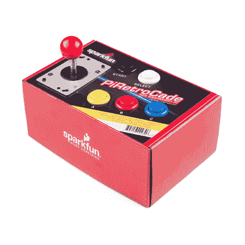
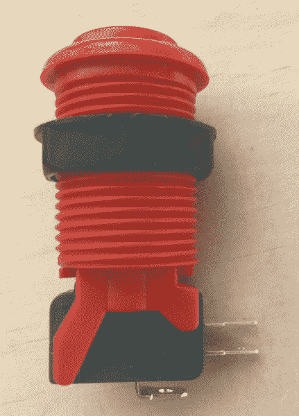
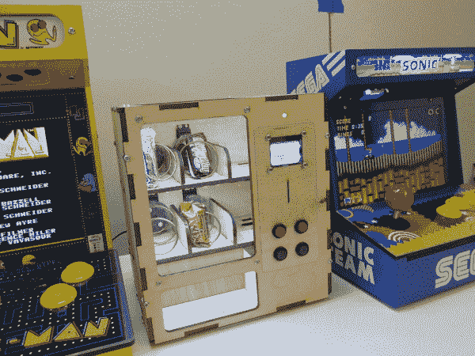

# PiRetrocade 装配指南

> 原文：<https://learn.sparkfun.com/tutorials/piretrocade-assembly-guide->

## 皮雷特罗卡

皮尤皮尤。抓住你了。Raspberry Pi 3 是 Raspberry Pi 单板计算机系列中最新、最棒的产品。你的下一个覆盆子 Pi 项目需要一些灵感吗？一套[复古街机游戏套装](https://www.sparkfun.com/products/14007)怎么样？

 

### 

[Retired](https://learn.sparkfun.com/static/bubbles/ "Retired") KIT-14007

你有覆盆子 Pi2 或 Pi3 吗？你一直想用它来建立你自己的游戏站吗？火花电筒…

7 **Retired**[Favorited Favorite](# "Add to favorites") 30[Wish List](# "Add to wish list")

#### 套件包括:

*   5x 街机按钮
*   1x 操纵杆
*   1 张带 Porta Pi 的 SD 卡
*   20x 母快速接头
*   20x 6 英寸 M-F 跳线
*   1 把美工刀
*   4 个螺钉和 4 个螺母

## 本教程涵盖的内容

本指南旨在让您立即开始使用 PiRetrocade。由于随附的 micro-SD 卡安装了仿真映像，安装非常快速，无需编程！本指南结合下面的视频将引导您完成 PiRetrocade 的组装，这样您就可以玩游戏了。

## 所需材料

以下是您需要的 PiRetrocade 套件中未包含的其他用品。

*   树莓 Pi 2 或 Pi 3(本教程使用[树莓 Pi 3 型号 B](https://www.sparkfun.com/products/retired/13825)
*   [电源](https://www.sparkfun.com/products/13831)
*   [剥线器](https://www.sparkfun.com/products/12630)
*   [压接工具](https://www.sparkfun.com/products/13193)
*   [HDMI 线缆](https://www.sparkfun.com/products/11572)
*   [监视器](https://www.sparkfun.com/products/11612)
*   *可选*有源扬声器或耳机

### 推荐阅读

在构建您的 PiRetrocade 之前，如果您不熟悉 Raspberry Pi，您可能希望阅读下面的一些教程。构建和使用这个工具包不需要以前有过任何使用 Raspberry Pi 的经验。

 [### SD 卡和书写图像](https://learn.sparkfun.com/tutorials/sd-cards-and-writing-images) How to upload images to an SD card for Raspberry Pi, PCDuino, or your favorite SBC.[Favorited Favorite](# "Add to favorites") 19 [### 树莓 gPIo](https://learn.sparkfun.com/tutorials/raspberry-gpio) How to use either Python or C++ to drive the I/O lines on a Raspberry Pi.[Favorited Favorite](# "Add to favorites") 17 [### 预先组装的 40 引脚 Pi 楔形连接指南](https://learn.sparkfun.com/tutorials/preassembled-40-pin-pi-wedge-hookup-guide) Using the Preassembled Pi Wedge to prototype with the Raspberry Pi B+.[Favorited Favorite](# "Add to favorites") 7 [### 树莓 Pi 3 入门套件连接指南](https://learn.sparkfun.com/tutorials/raspberry-pi-3-starter-kit-hookup-guide) Guide for getting going with the Raspberry Pi 3 Model B and Raspberry Pi 3 Model B+ starter kit.[Favorited Favorite](# "Add to favorites") 13

## 成套组件

有关如何组装 PiRetrocade 的分步说明，请观看下面的视频。然后继续阅读更详细的说明。

[https://www.youtube.com/embed/6kE50P9uQMs/?autohide=1&border=0&wmode=opaque&enablejsapi=1](https://www.youtube.com/embed/6kE50P9uQMs/?autohide=1&border=0&wmode=opaque&enablejsapi=1)

### 五金器具

这个项目实际上可以归结为五个按钮和一个连接到 Raspberry Pi 3 上 GPIO 引脚的操纵杆以及一个装满街机软件的 SD 卡。让我们开始构建这个控制器。将 SD 卡插入树莓派。在包装盒的顶部，您可以找到控制器布局的蓝图。使用提供的业余爱好刀切割标有“切割”的孔。

**Note:** Cut the white areas only. The lip of the buttons should rest where the dotted lines are surrounding the "cut" areas..

### 小跟班

移除街机按钮上的开关。拧松螺母，将按钮穿过每个孔，并用螺母将按钮固定在盒子上。一旦它们全部就位，更换开关。

*The bottom pin labeled "COM" for common or ground on the switch is ground. The single wiring harness will attach to the bottom pin on the short right side of the switch. It is labeled "NO" for normally open.*

### 操纵杆

先搞清楚上、下、左、右对应哪个开关。要轻松做到这一点，您可以像这样拧开底部金属板:

开关将暴露出来，您可以测试每个方向。在所示的方向上，将操纵杆保持在左侧会产生以下结果:

我将右上的开关标为“左”，对应于 GPIO 引脚 7。对每个方向继续相同的过程，并用外边缘的四个螺钉装回底盖。

一旦你有了方向，从操纵杆手柄的顶部拧下红色的球，并移除黑色的垫圈。拧开顶部金属板，并从盒盖下给操纵杆馈电。拧紧盒子顶部的金属板来固定操纵杆。您需要标记这些孔的位置，并为每个螺钉预切一个孔。更换黑色垫圈，并更换红色球。

### 接线

你可能已经注意到一些 6“股电线和 20 母快速断开。你需要一对压接钳，或者你的剥线钳上已经有一个压接钳了。您将制作两条接地线束。一个线束将五个快速断开装置菊花链在一起用于按钮，另一个线束将四个快速断开装置菊花链在一起用于操纵手柄中的每个接地针脚。然后是操纵杆上每个按钮和方向的九个单独的线束。按钮开关上的接地是开关长边上的单独凸耳。操纵杆也是如此。

*Single wiring harness with female end. You need nine of these.**Ground wiring harness for the joystick with female end. You need one and it can connect to any ground pin on the Raspberry Pi (Pins 6, 9, 14, 20, 25, 30, 34, or 39).**Ground wiring harness for the buttons with female end. You need one and it can connect to any ground pin on the Raspberry Pi (Pins 6, 9, 14, 20, 25, 30, 34, or 39).*

在视频中，每个按钮和方向都标有相应的 GPIO，放在带有标记的盒子上。下面是映射的图片。单个线束连接在标有“NO”(常开)的标签上。它在交换机上也被标记为引脚 3。“Enter”用作“start ”,并映射到引脚 21。“ESC”用于退出游戏，并在盒子上标记为“Select”(试图保持传统的控制器振动)，它映射到引脚 26。

请参见下图，了解正确的方向。

对于电源，音频和显示器电缆，在盒子的背面剪三个孔，并通过它们馈送这些电缆。我用一套有源扬声器来播放音频。合上盒子，准备玩吧。

## 仿真软件

在上面的视频中，您看到了在您的游戏机上启动和运行是多么容易。让我们来看看里面发生了什么。

除了在添加 rom 后给 Pi 加电和重启 Pi 之外，你不需要做任何事情就可以开始玩游戏。SD 卡上的图像被称为 Porta Pi Aracde，是 Ryan Bates 在复古游戏公司编译的几个程序的拼贴画。图像包含[反推](https://retropie.org.uk/)、[仿真站](http://www.emulationstation.org/)、[反推](https://github.com/libretro/RetroArch)和[反推](https://github.com/adafruit/Adafruit-Retrogame)。

给 Pi 加电，通过 HDMI 线连接显示器。一旦它启动，你应该会看到 RetroPie 主屏幕，然后是仿真站主屏幕，然后是一个菜单，显示可用的系统仿真器和每个仿真器中有多少游戏。现在是你想要熟悉菜单导航和添加 rom 的时候了。你可以用新组装的游戏手柄完全浏览菜单，也可以使用键盘。

### SD 卡图像上的一点背景

[Download Porta Pi Arcade](http://www.retrobuiltgames.com/porta-pi-arcade-help/porta-pi-software-os-download/)

如果你需要 Porta Pi arcade 的新版本，点击上面的按钮导航到[复古游戏](http://www.retrobuiltgames.com/)下载页面。

[RetroPie](https://retropie.org.uk/) 是您复古游戏机的支柱。它可以安装在像 Rasbian 这样的操作系统上。我们没有添加操作系统，因此您可以决定要添加哪一个，或者是否需要添加。

如果您决定添加一个操作系统，您可以退出模拟器，并通过按 F4 进入 Linux GUI。这将把您带到一个终端窗口，键入命令`sudo startx`启动 GUI。

要返回模拟器，请退出 Linux GUI，并在终端窗口中键入命令`emulationstation`。

如果没有 Rasbian，你需要的唯一命令是 F4 键进入终端窗口和`emulationstation`返回模拟器。

[仿真站](http://www.emulationstation.org/)是一个图形化的前端，让你不用键盘就能轻松进入你最喜欢的复古游戏。一旦你建立了你的控制器，你将拥有所有必要的按钮来浏览仿真站和播放你合法获得的 rom。

[RetroArch](https://github.com/libretro/RetroArch) 公开游戏或模拟器的功能。它是[图书馆](http://www.libretro.com/)的前端，可以做原始视频录制和网络播放之类的事情。它还允许对通用控件进行编程——目前在本教程中就是这样。这意味着控件设置为 ESC、Enter、Jump、Shoot 等。在所有模拟器中的所有游戏中都可以看到——你不必在每次进入新的模拟器时都设置游戏手柄。

Retrogame 是一个很棒的工具，它允许 Phil Burgess 为 Adafruit 编写的模拟器使用 Raspberry PI GPIO-to-USB 工具。这就是按钮 mashing 被注册为键盘按压的方式。要改变按钮映射的位置或添加更多按钮，请前往[复古游戏](http://www.retrobuiltgames.com/porta-pi-arcade-help/advanced-assembly/arcade-gpio-mapping/)。

### 添加 rom

添加 rom 最简单的方法是使用 USB 拇指驱动器或带适配器的 SD 卡。格式化 USB 驱动器以获得新的驱动器。添加一个名为“retropie”的文件夹，并将其插入您的 Raspberry Pi 3。等待几分钟，或者等待 USB 上的闪光灯停止闪烁。

拔出 USB 驱动器，并将其插回电脑。“retropie”文件夹现在将有三个子文件夹:“BIOS”、“Configs”和“roms”。将您的 rom 保存到“roms”文件夹内的适当文件夹中。

将 USB 驱动器放回 Pi 中，并再次等待文件传输完成。rom 会自动保存到正确的仿真器文件夹中。你现在需要重启你的树莓派。

插上键盘，点击 F4 退出模拟站。在终端窗口中，输入命令`sudo reboot`重启工作站。现在，您应该会看到基于您保存的 rom 展开的菜单。因此，如果你添加了 NES 光盘，现在菜单中会有一个 NES 选项。关于获取 rom 的说明超出了本教程的范围。你应该只添加合法来源的 rom 到你的 Raspberry Pi 游戏站。

### 试验

一旦你放置好你的按钮，完成连线，安装好你的 rom，是时候测试你的游戏手柄了。启动您的 Raspberry Pi，并等待仿真站菜单屏幕。使用操纵杆浏览不同的模拟器。按钮 A 将作为菜单中的选择或输入，按钮 B 将作为后退按钮。当你想改变游戏并从游戏中回到主菜单时，选择按钮是退出。在游戏中，A、B、& C 将作为普通战斗和特殊按钮。

如果你想改变键盘映射，添加一个玩家 2，或者在[复古游戏](www.retrobuiltgames.com)中添加一个硬币接收器头，并查看 [Porta Pi 提示](http://www.retrobuiltgames.com/porta-pi-arcade-help/)以获得额外的帮助或灵感。

* * *

有关如何开始使用 RetroPie 的更深入的指导，请查看 GitHub 上的广泛指南。

[RetroPie First Time Installation Guide](https://github.com/retropie/retropie-setup/wiki/First-Installation)

## 音频设置

为你的街机获取音频的最简单的方法是将有源扬声器插入音频插孔。您也可以在 RetroPie 中更改设置。要使用耳机，导航到 RetroPie 仿真器并按 A。再次按 A 在菜单中选择音频。选择选项 2 使用耳机。选择选项 3 使用 HDMI。要获得便携式解决方案-如果您正在制作橱柜，请选择选项 4 并查看 SparkFun 的音频放大器套件。务必将放大器套件的地线连接到接地引脚。

## 资源和更进一步

超越盒子，定制您自己的街机柜。[复古建造游戏](http://www.retrobuiltgames.com/)是一个伟大的资源，用于建造街机柜，通过复古，仿真站，复古和复古游戏导航，扩展根以增加 SD 空间，添加 rom 等等。如果你有任何问题，这个网站上的论坛非常好。也有添加玩家 2 的说明，添加硬币接收器，迷你卡的免费计划，然后像自动售货机和折叠狗坡道这样的随机酷东西。给这个游戏制造商一些爱。

*Photo Courtesy of Ryan Bates at Retro Built Games**Photo Courtesy of Ryan Bates at Retro Built Games*

桌面自动售货机似乎是一项值得投资的投资。

或者看看这些博客帖子来寻找灵感。

 [### 树莓派拱廊橱柜第一部分

June 8, 2015](https://www.sparkfun.com/news/1846 "June 8, 2015: Details about the MAME cabinet project I am working on.")[Favorited Favorite](# "Add to favorites") 3 [### 将您的个人记录提升到一个新的高度

November 10, 2016](https://www.sparkfun.com/news/2220 "November 10, 2016: I started with a PiRetrocade kit and kept adding until I had a major appliance on my hands: my very own full-size arcade cabinet!")[Favorited Favorite](# "Add to favorites") 2