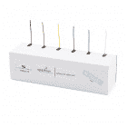
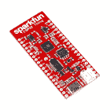
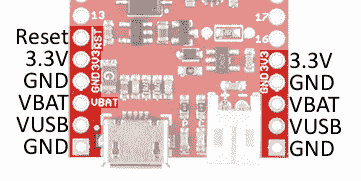
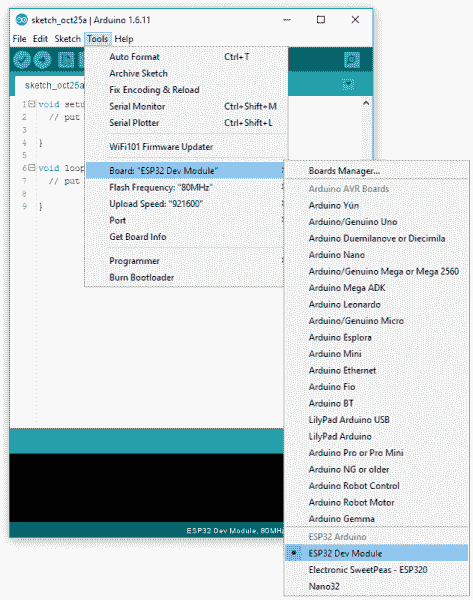
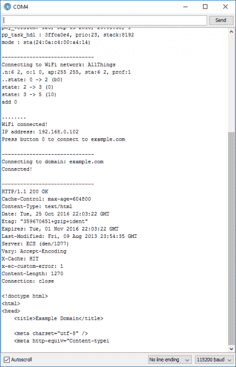

# ESP32 事物连接指南

> 原文：<https://learn.sparkfun.com/tutorials/esp32-thing-hookup-guide>

## 介绍

SparkFun ESP32 Thing 是 [Espressif 的 ESP32](https://espressif.com/en/products/hardware/esp32/overview) 的综合开发平台，这是他们广受欢迎的 [ESP8266](https://www.sparkfun.com/products/13711) 的超级充电版本。像 8266 一样，ESP32 是一个 WiFi 兼容的微控制器，但增加了近 30 个 I/O 引脚。ESP32 的强大功能和多功能性将使其成为未来多年物联网和互联项目的基础。

[](https://www.sparkfun.com/products/13907) 

将**添加到您的[购物车](https://www.sparkfun.com/cart)中！**

### [SparkFun ESP32 东西](https://www.sparkfun.com/products/13907)

[In stock](https://learn.sparkfun.com/static/bubbles/ "in stock") DEV-13907

SparkFun ESP32 Thing 是 Espressif 的 ESP32 的综合开发平台，ESP32 是他们的超级充电版本…

$23.5069[Favorited Favorite](# "Add to favorites") 83[Wish List](# "Add to wish list")** **SparkFun ESP32 为 ESP32 配备了在 wonderchip 上编程、运行和开发所需的一切。除了 WiFi SoC，这款设备还包括一个 [FTDI FT231x](https://www.sparkfun.com/products/13263) ，它可以将 USB 转换为串行，并允许您的计算机编程并与微控制器通信。它还配有一个**锂聚合物(LiPo)电池充电器**，因此您的 ESP32 项目可以真正无线化。此外，该板包括一些 led 和按钮，以帮助您的发展。

### 本教程涵盖的内容

这种连接指南作为一个入门的所有事情 ESP32 的事情。它记录了主板的硬件特性，包括一些组装技巧。然后它将深入固件开发——包括演示如何将 ESP32 支持添加到流行的 Arduino IDE 中。

本教程分为几个部分，您可以使用右边的菜单浏览。这些部分包括:

*   [硬件概述](https://learn.sparkfun.com/tutorials/esp32-thing-hookup-guide#hardware-overview) -检查 ESP32 的硬件布局和特性，包括介绍 ESP32 的 I/O 功能。
*   [组装技巧](https://learn.sparkfun.com/tutorials/esp32-thing-hookup-guide#assembly-tips) -快速焊接技巧和窍门。
*   [通过 Arduino IDE 板管理器安装](https://learn.sparkfun.com/tutorials/esp32-thing-hookup-guide#installing-via-arduino-ide-boards-manager) -如何使用 Arduino 板管理器添加 ESP32 支持。
*   [安装 ESP32 Arduino 内核](https://learn.sparkfun.com/tutorials/esp32-thing-hookup-guide#installing-the-esp32-arduino-core) -如何将 ESP32 支持添加到您计算机的 Arduino 开发环境中。
*   Arduino 示例:Blink -验证您的 ESP32 东西和 Arduino 板定义是否与经典 Blink 草图一起工作。
*   [Arduino 示例:WiFi](https://learn.sparkfun.com/tutorials/esp32-thing-hookup-guide#arduino-example-wifi) -将您的 ESP32 连接到本地 WiFi 网络，并开始联网。
*   [使用 Arduino 插件](https://learn.sparkfun.com/tutorials/esp32-thing-hookup-guide#using-the-arduino-addon) -帮助您开始创建自己的 Arduino 草图的提示。

**Not Yet Implemented**
The Arduino board definitions for the ESP32 are still a work in progress. There are a handful of peripherals and features that have yet to be implemented, including:

* Analog Input (`analogRead([pin])`)
* Analog Ouptut (`analogWrite([pin], [value])`)
* WiFi Server and WiFI UDP
* Real-Time Clock
* Touch-controller interface

These peripherals are available (if, also, still in their infancy) in the [IoT Development Framework](https://github.com/espressif/esp-idf) for the ESP32\. If your application requires analog input, RTC, or any of the features above, consider giving the [ESP-IDF](https://github.com/espressif/esp-idf) a try!

### 材料清单

ESP32 的东西包括*几乎*你需要开始使用和编程 WiFi/BT SoC 的一切。事实上，唯一需要的额外东西是一根 [Micro-B USB 线](https://www.sparkfun.com/products/10215)。ESP32 的 USB 接口可以用来给芯片供电和编程。一旦你完成了对芯片的编程，一个 [5V 微型 B USB 墙壁适配器](https://www.sparkfun.com/products/15311)可以用来给电路板供电。

[](https://www.sparkfun.com/products/10215) 

将**添加到您的[购物车](https://www.sparkfun.com/cart)中！**

### [USB micro-B 线- 6 脚](https://www.sparkfun.com/products/10215)

[In stock](https://learn.sparkfun.com/static/bubbles/ "in stock") CAB-10215

USB 2.0 型到微型 USB 5 针。这是一种新的、更小的 USB 设备连接器。微型 USB 连接器大约是…

$5.5014[Favorited Favorite](# "Add to favorites") 21[Wish List](# "Add to wish list")****[](https://www.sparkfun.com/products/15311) 

将**添加到您的[购物车](https://www.sparkfun.com/cart)中！**

### [【墙上适配器电源- 5VDC，2A (USB Micro-B)](https://www.sparkfun.com/products/15311)

[In stock](https://learn.sparkfun.com/static/bubbles/ "in stock") TOL-15311

这是一个高品质的开关“壁式电源”AC 到 DC 5V 2000mA USB 微型 B 壁式电源，专为 S…

$6.50[Favorited Favorite](# "Add to favorites") 2[Wish List](# "Add to wish list")****[](https://www.sparkfun.com/products/13244) 

将**添加到您的[购物车](https://www.sparkfun.com/cart)中！**

### [【USB Micro-B 线缆-6】](https://www.sparkfun.com/products/13244)

[In stock](https://learn.sparkfun.com/static/bubbles/ "in stock") CAB-13244

这是一根 USB 2.0 型转 Micro-B 型 5 针黑色电缆。你知道，通常配在手机上的迷你 B 连接器，可以…

$2.103[Favorited Favorite](# "Add to favorites") 7[Wish List](# "Add to wish list")****[](https://www.sparkfun.com/products/retired/12016) 

### [SparkFun Cerberus USB 线- 6ft](https://www.sparkfun.com/products/retired/12016)

[Retired](https://learn.sparkfun.com/static/bubbles/ "Retired") CAB-12016

你拿错了 USB 线。你有哪一个不重要，都是错的。但是如果你有正确的…

16 **Retired**[Favorited Favorite](# "Add to favorites") 37[Wish List](# "Add to wish list")****** ******作为一种替代电源，ESP32 的东西包括对[单体锂聚合物(LiPo)](https://www.sparkfun.com/search/results?term=lithium%20polymer&tab=products) 电池的支持，这些电池可以插入电路板的白色 2 针 JST 连接器。LiPo 非常适合忙碌的项目，或者那些只需要一点额外能量的项目。该板包括一个**脂肪充电器** -可充电电池可以通过插入 5V USB 电源充电。

[](https://www.sparkfun.com/products/13813) 

将**添加到您的[购物车](https://www.sparkfun.com/cart)中！**

### [锂离子电池-1Ah](https://www.sparkfun.com/products/13813)

[In stock](https://learn.sparkfun.com/static/bubbles/ "in stock") PRT-13813

基于锂离子化学的超薄超轻电池。每个电池在 1000 毫安时输出 3.7V 的标称电压！

$10.958[Favorited Favorite](# "Add to favorites") 75[Wish List](# "Add to wish list")****[](https://www.sparkfun.com/products/13854) 

将**添加到您的[购物车](https://www.sparkfun.com/cart)中！**

### [锂离子电池- 850mAh](https://www.sparkfun.com/products/13854)

[In stock](https://learn.sparkfun.com/static/bubbles/ "in stock") PRT-13854

这是基于锂离子化学的非常薄、非常轻的电池。每个电池在 850℃时输出 3.7V 的标称电压…

$10.952[Favorited Favorite](# "Add to favorites") 17[Wish List](# "Add to wish list")****[](https://www.sparkfun.com/products/13851) 

将**添加到您的[购物车](https://www.sparkfun.com/cart)中！**

### [锂离子电池- 400mAh](https://www.sparkfun.com/products/13851)

[In stock](https://learn.sparkfun.com/static/bubbles/ "in stock") PRT-13851

这是一种基于锂离子化学的非常小、非常轻的电池，具有目前最高的能量密度…

$5.5010[Favorited Favorite](# "Add to favorites") 41[Wish List](# "Add to wish list")****[](https://www.sparkfun.com/products/13855) 

将**添加到您的[购物车](https://www.sparkfun.com/cart)中！**

### [锂离子电池- 2Ah](https://www.sparkfun.com/products/13855)

[In stock](https://learn.sparkfun.com/static/bubbles/ "in stock") PRT-13855

这是基于锂离子化学的非常薄、非常轻的电池。每个电池在 200 伏时输出一个标称的 3.7 伏电压…

$13.959[Favorited Favorite](# "Add to favorites") 43[Wish List](# "Add to wish list")******** ********最后，要将 ESP32 的 28 个 I/O 引脚连接到外部组件，您需要进行一些焊接。焊接工具，包括[烙铁](https://www.sparkfun.com/products/9507)和[焊料](https://www.sparkfun.com/products/9325)，是任何电子工作台的必备工具。并且无论是[头](https://www.sparkfun.com/products/116)还是[线](https://www.sparkfun.com/products/11375)都是我们推荐的用于焊接到这个东西的引脚上的配对物。

[](https://www.sparkfun.com/products/116) 

将**添加到您的[购物车](https://www.sparkfun.com/cart)中！**

### [破开头球——直击](https://www.sparkfun.com/products/116)

[In stock](https://learn.sparkfun.com/static/bubbles/ "in stock") PRT-00116

一排标题-打破适应。40 个引脚，可切割成任何尺寸。用于定制 PCB 或通用定制接头。

$1.7520[Favorited Favorite](# "Add to favorites") 133[Wish List](# "Add to wish list")****[](https://www.sparkfun.com/products/11375) 

将**添加到您的[购物车](https://www.sparkfun.com/cart)中！**

### [](https://www.sparkfun.com/products/11375)

[In stock](https://learn.sparkfun.com/static/bubbles/ "in stock") PRT-11375

各种颜色的电线:你知道这是一个美丽的东西。六种不同颜色的绞线装在一个纸板盒里…

$22.5019[Favorited Favorite](# "Add to favorites") 46[Wish List](# "Add to wish list")****[](https://www.sparkfun.com/products/9325) 

将**添加到您的[购物车](https://www.sparkfun.com/cart)中！**

### [无铅焊料- 100 克线轴](https://www.sparkfun.com/products/9325)

[In stock](https://learn.sparkfun.com/static/bubbles/ "in stock") TOL-09325

这是带有水溶性树脂芯的无铅焊料的基本线轴。0.031 英寸规格，100 克。这是一个好主意…

$9.957[Favorited Favorite](# "Add to favorites") 33[Wish List](# "Add to wish list")****[](https://www.sparkfun.com/products/9507) 

将**添加到您的[购物车](https://www.sparkfun.com/cart)中！**

### [烙铁- 30W(美国，110V)](https://www.sparkfun.com/products/9507)

[33 available](https://learn.sparkfun.com/static/bubbles/ "33 available") TOL-09507

这是一个非常简单的固定温度，快速加热，30W 110/120 VAC 烙铁。我们真的很喜欢使用更贵的 iro…

$10.957[Favorited Favorite](# "Add to favorites") 21[Wish List](# "Add to wish list")******** ********### 推荐阅读

它可能看起来令人生畏，但 ESP32 的东西——特别是当你利用它的 Arduino 兼容性时——对于所有经验水平的电子产品用户来说，都是一个完美的物联网基础。但是，在深入学习本教程之前，您应该熟悉一些概念。如果下面的任何概念对你来说听起来很陌生，请考虑先通读该教程:

[](https://learn.sparkfun.com/tutorials/how-to-solder-through-hole-soldering) [### 如何焊接:通孔焊接](https://learn.sparkfun.com/tutorials/how-to-solder-through-hole-soldering) This tutorial covers everything you need to know about through-hole soldering.[Favorited Favorite](# "Add to favorites") 70[](https://learn.sparkfun.com/tutorials/serial-communication) [### 串行通信](https://learn.sparkfun.com/tutorials/serial-communication) Asynchronous serial communication concepts: packets, signal levels, baud rates, UARTs and more 100[](https://learn.sparkfun.com/tutorials/how-to-power-a-project) [### 如何为项目提供动力](https://learn.sparkfun.com/tutorials/how-to-power-a-project) A tutorial to help figure out the power requirements of your project.[Favorited Favorite](# "Add to favorites") 67[](https://learn.sparkfun.com/tutorials/what-is-an-arduino) [### 什么是 Arduino？](https://learn.sparkfun.com/tutorials/what-is-an-arduino) What is this 'Arduino' thing anyway? This tutorials dives into what an Arduino is and along with Arduino projects and widgets.[Favorited Favorite](# "Add to favorites") 50

## 想亲自体验 ESP32 吗？

我们掩护你！

[](https://www.sparkfun.com/products/13907) 

将**添加到您的[购物车](https://www.sparkfun.com/cart)中！**

### [SparkFun ESP32 东西](https://www.sparkfun.com/products/13907)

[In stock](https://learn.sparkfun.com/static/bubbles/ "in stock") DEV-13907

SparkFun ESP32 Thing 是 Espressif 的 ESP32 的综合开发平台，ESP32 是他们的超级充电版本…

$23.5069[Favorited Favorite](# "Add to favorites") 83[Wish List](# "Add to wish list")****[](https://www.sparkfun.com/products/14311) 

将**添加到您的[购物车](https://www.sparkfun.com/cart)中！**

### [【ESP32】东西可堆叠头组](https://www.sparkfun.com/products/14311)

[In stock](https://learn.sparkfun.com/static/bubbles/ "in stock") PRT-14311

这些接头是为了与 SparkFun ESP32 的东西连接到 ESP32 屏蔽板。

$1.75[Favorited Favorite](# "Add to favorites") 11[Wish List](# "Add to wish list")****[](https://www.sparkfun.com/products/14430) 

将**添加到您的[购物车](https://www.sparkfun.com/cart)中！**

### [SparkFun ESP32 东西运动盾](https://www.sparkfun.com/products/14430)

[In stock](https://learn.sparkfun.com/static/bubbles/ "in stock") DEV-14430

SparkFun ESP32 Thing Motion Shield 是对我们的 ESP32 Thing 的多功能运动感应补充。

$22.50 $12.381[Favorited Favorite](# "Add to favorites") 7[Wish List](# "Add to wish list")****[](https://www.sparkfun.com/products/retired/14155) 

### [SparkFun ESP32 东西力量控制盾](https://www.sparkfun.com/products/retired/14155)

[Retired](https://learn.sparkfun.com/static/bubbles/ "Retired") DEV-14155

SparkFun ESP32 东西电源控制屏蔽使 ESP32 东西开关高达 5A 的 DC 负载，提供广泛的变化…

**Retired**[Favorited Favorite](# "Add to favorites") 8[Wish List](# "Add to wish list")************[See all Espressif products](https://www.sparkfun.com/categories/279)****** ******## 硬件概述

Espressif 的 ESP32 是市场上最独特的微控制器之一。它的一系列功能包括:

*   双核 Tensilica LX6 微处理器
*   高达 240MHz 时钟频率
*   520kB 内部 SRAM
*   集成 802.11 BGN WiFi 收发器
*   2.2 至 3.6V 工作范围
*   休眠状态下的睡眠电流为 2.5 A
*   32 GPIO
*   10 电极电容式触摸支持
*   硬件加速加密(AES、SHA2、ECC、RSA-4096)

ESP32 的设计目的是为 ESP32 配备运行和编程微控制器所需的一切，加上一些额外的好东西，以利用芯片的独特功能。

[](https://cdn.sparkfun.com/assets/learn_tutorials/5/0/7/top-annotated.jpg)

### 外围设备和输入/输出

ESP32 具有您的标准硬件外围设备，包括:

*   18 个[模数转换器](https://learn.sparkfun.com/tutorials/analog-to-digital-conversion) (ADC)通道
*   3 个 [SPI](https://learn.sparkfun.com/tutorials/serial-peripheral-interface-spi) 接口
*   3 个 [UART](https://learn.sparkfun.com/tutorials/serial-communication) 接口
*   两个 [I ² C](https://learn.sparkfun.com/tutorials/i2c) 接口
*   16 个 [PWM](https://learn.sparkfun.com/tutorials/pulse-width-modulation) 输出
*   2 个数模转换器(DAC)
*   两个 I2S 接口

而且，由于芯片的**引脚多路复用**功能，这些外设可以连接到 28 个断开的 I/O 引脚中的任何一个。这意味着*你*决定哪些引脚是 RX、TX、MISO、MOSI、SCLK、SDA、SCL 等。

不过，有几个硬件特性(即 ADC 和 DAC)被分配了静态引脚。下面的图形参考有助于演示在哪里可以找到这些外设(单击以嵌入！).

[](https://cdn.sparkfun.com/assets/learn_tutorials/5/0/7/ESP32ThingV1a.pdf)*Click the image for a closer look.*

一个 I ² C、两个 UART 接口和一个 SPI 接口可以分配给项目所需的任何引脚。

#### 仅输入引脚:34-39

引脚 34、35、36、37、38 和 39 *不能*配置为输出，但它们可以用作数字输入、模拟输入或用于其他独特用途。还要注意，它们**不像其他 I/O 引脚那样有内部上拉或下拉电阻**。

GPIO 引脚 36-39 是 ADC 超低噪声前置放大器不可或缺的一部分，它们连接至 270pF 电容，有助于配置前置放大器的采样时间和噪声。

[](https://cdn.sparkfun.com/assets/learn_tutorials/5/0/7/schematic-crop-34-39.png)

*从 [ESP32 东西示意图](https://cdn.sparkfun.com/assets/learn_tutorials/5/0/7/esp32-thing-schematic.pdf)来看:GPIO 36-39 是用帽子绑在一起的。这些和引脚 34 和 35 仅用于输入！*

### 为 ESP32 供电

ESP32 的两个主要电源输入是 **USB** 和**单节锂聚合物(LiPo)** 电池。如果 USB 和 LiPo 都插入主板，板载充电控制器将以高达 500 毫安的速率为 LiPo 电池充电。

ESP32 的工作电压范围是 2.2 到 3.6V。在正常操作下，ESP32 将在 3.3V 为芯片供电。I/O 引脚**不能承受 5V 电压**！如果你用 5V(或更高)的元件连接电路板，你需要做一些[电平转换。](https://learn.sparkfun.com/tutorials/bi-directional-logic-level-converter-hookup-guide)

ESP32 东西上的 **3.3V 稳压器**可以**可靠地供应高达 600mA** ，对于大多数项目来说应该绰绰有余。ESP32 在射频传输过程中可以产生高达 250 毫安的电流，但我们通常测量它的功耗约为 150 毫安，即使是在通过 WiFi 进行主动传输的情况下。调节器的输出也分散到电路板的两侧，即标有“3V3”的引脚。这些引脚可以用来为外部元件供电。

[](https://cdn.sparkfun.com/assets/learn_tutorials/5/0/7/esp32-power-signals.jpg)

除了 USB 和电池连接器， **VBAT** 和 **VUSB** 引脚都在电路板的两侧断开。这些引脚可以用作该器件的备用电源输入。VUSB 的最大允许电压输入为 6V，VBAT 不应连接到除 LiPo 电池之外的任何设备。或者，如果您有一个介于 2.2V 和 3.6V 之间的稳压电源，则可以使用“3V3”线路直接为 ESP32 及其外设供电。

### 电路板尺寸

该板为 2.32 英寸 x1.00 英寸。

[](https://cdn.sparkfun.com/assets/f/f/7/2/d/SparkFun_ESP32_Thing_-_Board_Dimensions.png)

## 组装技巧

ESP32 的东西船舶没有任何焊接到标题引脚-确保您可以塑造董事会最适合您的项目。要使用芯片的引脚，你需要将*某种东西*焊接到电路板两侧的 I/O 和电源轨通孔上。

New to soldering? Check out our [Through-Hole Soldering Tutorial](https://learn.sparkfun.com/tutorials/how-to-solder---through-hole-soldering) for a quick introduction!

*你把什么*焊接到 ESP32 的 I/O 引脚上完全取决于你。接头排与试验板兼容，因此您可能需要焊接[公接头](https://www.sparkfun.com/products/116)。(稍微满意:ESP32 的 20 针接头意味着您可以充分利用我们的 40 针接头带。)

[](https://cdn.sparkfun.com/assets/learn_tutorials/5/0/7/esp32-thing_2.jpg)

然后将其插入试验板，将 USB 和 LiPo 连接器挂在末端，开始布线！

[](https://cdn.sparkfun.com/assets/learn_tutorials/5/0/7/esp32-thing-project.jpg)*All those wires and components, and there are still plenty of GPIO left to use!*

或者，[母接头](https://www.sparkfun.com/products/115)(你可能需要两个单独的条来焊接所有 40 个引脚)，[直角接头](https://www.sparkfun.com/products/553)，或者[绞合线](https://www.sparkfun.com/products/11375)都是不错的选择，这取决于你的项目需求。

## 通过 Arduino IDE 板管理器安装

好消息！Espressif 增加了对 Arduino Boards Manager 的支持，通过这种方式安装，您可以从大量优秀的内置示例中获益。通过板管理器安装的说明可以在 [espressif 的 Arduino-ESP32 阅读文档](https://docs.espressif.com/projects/arduino-esp32/en/latest/installing.html)中找到。

[Read the Docs: Installation Instructions using Arduino IDE Boards Manager](https://docs.espressif.com/projects/arduino-esp32/en/latest/installing.html)

有关通过 Arduino 板管理器安装板的更多信息，请查看 Arduino IDE 教程中的[安装板定义。](https://learn.sparkfun.com/tutorials/installing-board-definitions-in-the-arduino-ide)

[](https://learn.sparkfun.com/tutorials/installing-board-definitions-in-the-arduino-ide) [### 在 Arduino IDE 中安装电路板定义

#### 2020 年 9 月 9 日](https://learn.sparkfun.com/tutorials/installing-board-definitions-in-the-arduino-ide) How do I install a custom Arduino board/core? It's easy! This tutorial will go over how to install an Arduino board definition using the Arduino Board Manager. We will also go over manually installing third-party cores, such as the board definitions required for many of the SparkFun development boards.[Favorited Favorite](# "Add to favorites") 3

如果您熟悉通过 Arduino IDE 板管理器安装板，可以添加以下 url:

```
language:bash
https://raw.githubusercontent.com/espressif/arduino-esp32/gh-pages/package_esp32_index.json 
```

**Note:** The old json file was linked to `https://dl.espressif.com/dl/package_esp32_index.json`. Make sure to update the link in your Board Manager to the latest json file from GitHub as linked above.**Warning:** If you have previously installed the ESP32 Arduino Core via the instructions in Install Option 2, we strongly recommend removing the associated folders before installing via the boards manager.

To remove previous arduino core installs for the esp32, start by finding your ***.../Arduino/hardware*** folder. This can be located by looking at your Sketchbook location under **File** > **Preferences**.

[](https://cdn.sparkfun.com/r/600-600/assets/learn_tutorials/5/0/7/Preferences-hardwareFolderLocation.png)

Go to this location in your finder and delete the **esp32** folder.

[](https://cdn.sparkfun.com/assets/learn_tutorials/5/0/7/esp32_folder.png)
Once you have deleted the **esp32** folder, you can then install using the **Arduino Boards Manager**.

如果您已经成功地将 ESP32 内核安装到您的 Arduino IDE 上，那么在选择了 **ESP32 开发模块**的情况下，您应该会在**工具**下看到以下内容:

[](https://cdn.sparkfun.com/assets/learn_tutorials/5/0/7/ESP32BoardsManagerInstall.png)

## 安装 ESP32 Arduino 核心

对于更高级或更冒险的路线，您可以跳过 Arduino IDE 板管理器，安装 ESP32 Arduino 核心。ESP32 中的这对 Tensilica 内核基于 Xtensa，而不是您的标准 ARM 或 AVR。幸运的是，仍然有一个 GNU 编译器可用于 ESP32，这打开了一个可能的开发环境(IDE)设置的世界！本节的其余部分将介绍如何设置支持 ESP32 的 Arduino IDE。

在抽象出大量复杂的开销时，用于 ESP32 的 Arduino IDE 还消除了对 SoC 的一些更高级功能的访问。如果你想尝试为 ESP32 建立一个更先进的工具链，我们建议你去看看 T2 Espressif 的 esp-idf GitHub 库。esp-IDF——物联网开发框架的缩写——是 Espressif 针对 ESP32 的软件开发套件(SDK)。

### 安装 ESP32 核心

Espressif 的官方 ESP32 Arduino 核心托管在 GitHub 的[这里。他们有一套相当](https://github.com/espressif/arduino-esp32)[简单的安装说明](https://github.com/espressif/arduino-esp32/blob/master/README.md#installation-instructions)来帮助。

#### 克隆或下载核心

要安装 ESP32 板定义，您需要下载 esp32-arduino 存储库的内容，并将它们放在您的 [Arduino sketchbook 目录](https://www.arduino.cc/en/Guide/Environment#toc7)中的“hardware/espressif/esp32”目录下。你可以使用 [git 命令行工具](https://git-scm.com/book/en/v2/Getting-Started-Installing-Git)下载这些文件，或者从 GitHub 下载。

Alternatively, these files can be installed in your Arduino’s base directory. On Windows, that may be `C:/Program Files (x86)/Arduino/hardware` and on Mac that may be `/Applications/Arduino.app/Contents/Java/hardware`.

**如果你有 git** ，打开终端，导航到你的 Arduino sketchbook，输入:

```
mkdir hardware
cd hardware
mkdir espressif
cd espressif
git clone https://github.com/espressif/arduino-esp32.git esp32 
```

这些命令将创建“hardware”和“espressif”目录，然后将 arduino-esp32 GitHub 存储库下载到“esp32”文件夹中。

[](https://cdn.sparkfun.com/assets/learn_tutorials/5/0/7/esp32-arduino-command-line.png)

如果你**没有 git** ，[点击这里下载核心](https://github.com/espressif/arduino-esp32/archive/master.zip)(或者在 GitHub 页面点击【下载】>【下载 ZIP】，解压到你 Arduino sketchbook 中的一个 espressif/esp32 目录下。

[](https://cdn.sparkfun.com/assets/learn_tutorials/5/0/7/esp32-folder-windows.png)

“boards.txt”、“platform.txt”，以及核心、doc、工具等。文件夹应该都在 esp32 目录中。

#### 安装 Xtensa 和 ESP32 工具

要为 ESP32 编译代码，您需要在计算机上安装 Xtensa GNU 编译器集合(GCC)。 **Windows 用户**可以运行【get.exe】的**，在“esp32/tools”文件夹中找到。**

**[](https://cdn.sparkfun.com/assets/learn_tutorials/5/0/7/esp32-get-folder-windows.png)*Windows users can run "get.exe" to download the ESP32 software tools.*

Mac 和 Linux 用户应该运行 [tools/get.py](https://github.com/espressif/arduino-esp32/blob/master/tools/get.py) python 脚本来下载工具。使用终端，导航到 **esp32/tools** 文件夹。然后键入:

```
python get.py 
```

“get . py”python 脚本将下载 Xtensa GNU 工具和 ESP32 软件开发工具包(SDK)，并将它们解压缩到适当的位置。完成后，您应该会在“tools”目录中看到一些新文件夹，包括“sdk”和“xtensa-esp32-elf”。

## Arduino 示例:眨眼

安装了 ESP32 Arduino 核心之后，您就可以开始编程了。如果你还没有的话，**用 micro-B USB 线把 ESP32 插在你的电脑上**。

[](https://cdn.sparkfun.com/assets/learn_tutorials/5/0/7/esp32-thing-breadboard.jpg)

#### FTDI 驱动程序

如果您以前从未将 FTDI 设备连接到电脑，您可能需要安装 USB 转串行转换器的驱动程序。查看我们的[如何安装 FTDI 驱动教程](https://learn.sparkfun.com/tutorials/how-to-install-ftdi-drivers)以获得安装帮助。

一旦插上主板(并安装了驱动程序)，就应该给它分配一个唯一的端口标识符。在 Windows 计算机上，这将类似于“COM#”，在 MAC 或 Linux 计算机上，它将以“/dev/tty.usbserial-XXXXXX”的形式出现。

### 选择板和端口

一旦安装了 ESP32 Arduino 核心，您应该会在“工具”>“板”菜单下看到一个“ESP32 开发模块”选项。选择那个。

[](https://cdn.sparkfun.com/assets/learn_tutorials/5/0/7/arduino-board-select.png)

然后在“工具”>“端口”菜单下选择您的 ESP32 东西的串行端口。

[](https://cdn.sparkfun.com/assets/learn_tutorials/5/0/7/arduino-port-select.png)

您也可以选择“上传速度”。921600 波特-最快的可选速率-将使代码加载到您的 ESP32 最快，但有时可能无法上传。(为了速度的提升还是很值得的！)

### 加载闪烁

为了确保您的工具链和电路板设置正确，我们将上传最简单的草图-眨眼！连接到 GPIO 5 的 LED 非常适合这个测试。此外，随着 ESP32 连接到您的计算机，这是一个很好的时间来测试串行。将下面的示例草图复制并粘贴到新的 Arduino 草图中:

```
language:c
int ledPin = 5;

void setup()
{
    pinMode(ledPin, OUTPUT);
    Serial.begin(115200);
}

void loop()
{
    Serial.println("Hello, world!");
    digitalWrite(ledPin, HIGH);
    delay(500);
    digitalWrite(ledPin, LOW);
    delay(500);
} 
```

一切设置正确后，上传代码！一旦代码传输完毕，**打开[串行监视器](https://learn.sparkfun.com/tutorials/terminal-basics)** 并将波特率设置为 **115200** 。你应该看到“你好，世界”开始飞逝。

If the blue LED remains dimly lit, it's probably still sitting in the bootloader. After uploading a sketch, you may need to **tap the RST button** to get your ESP32 Thing to begin running the sketch.[](https://cdn.sparkfun.com/assets/learn_tutorials/5/0/7/serial-port-example.png)

您可能还注意到，当 ESP32 启动时，它会打印出一长串调试消息。每次芯片复位时都会发出这些信号——总是在 115200 波特。

## Arduino 示例:WiFi

ESP32 Arduino 核心包括一些 WiFi 示例，这些示例演示了从[扫描附近的网络](https://github.com/espressif/arduino-esp32/blob/master/libraries/WiFi/examples/WiFiScan/WiFiScan.ino)到向客户端服务器发送数据的所有内容。你可以在**文件下** > **例子** > **WiFi** 菜单下找到例子。

这是另一个使用 WiFi 库的例子，它演示了如何连接到附近的 WiFi 网络并作为客户端轮询远程域(http://example.com/ ):

```
language:c
#include <WiFi.h>

// WiFi network name and password:
const char * networkName = "YOUR_NETWORK_HERE";
const char * networkPswd = "YOUR_PASSWORD_HERE";

// Internet domain to request from:
const char * hostDomain = "example.com";
const int hostPort = 80;

const int BUTTON_PIN = 0;
const int LED_PIN = 5;

void setup()
{
  // Initilize hardware:
  Serial.begin(115200);
  pinMode(BUTTON_PIN, INPUT_PULLUP);
  pinMode(LED_PIN, OUTPUT);

  // Connect to the WiFi network (see function below loop)
  connectToWiFi(networkName, networkPswd);

  digitalWrite(LED_PIN, LOW); // LED off
  Serial.print("Press button 0 to connect to ");
  Serial.println(hostDomain);
}

void loop()
{
  if (digitalRead(BUTTON_PIN) == LOW)
  { // Check if button has been pressed
    while (digitalRead(BUTTON_PIN) == LOW)
      ; // Wait for button to be released

    digitalWrite(LED_PIN, HIGH); // Turn on LED
    requestURL(hostDomain, hostPort); // Connect to server
    digitalWrite(LED_PIN, LOW); // Turn off LED
  }
}

void connectToWiFi(const char * ssid, const char * pwd)
{
  int ledState = 0;

  printLine();
  Serial.println("Connecting to WiFi network: " + String(ssid));

  WiFi.begin(ssid, pwd);

  while (WiFi.status() != WL_CONNECTED) 
  {
    // Blink LED while we're connecting:
    digitalWrite(LED_PIN, ledState);
    ledState = (ledState + 1) % 2; // Flip ledState
    delay(500);
    Serial.print(".");
  }

  Serial.println();
  Serial.println("WiFi connected!");
  Serial.print("IP address: ");
  Serial.println(WiFi.localIP());
}

void requestURL(const char * host, uint8_t port)
{
  printLine();
  Serial.println("Connecting to domain: " + String(host));

  // Use WiFiClient class to create TCP connections
  WiFiClient client;
  if (!client.connect(host, port))
  {
    Serial.println("connection failed");
    return;
  }
  Serial.println("Connected!");
  printLine();

  // This will send the request to the server
  client.print((String)"GET / HTTP/1.1\r\n" +
               "Host: " + String(host) + "\r\n" +
               "Connection: close\r\n\r\n");
  unsigned long timeout = millis();
  while (client.available() == 0) 
  {
    if (millis() - timeout > 5000) 
    {
      Serial.println(">>> Client Timeout !");
      client.stop();
      return;
    }
  }

  // Read all the lines of the reply from server and print them to Serial
  while (client.available()) 
  {
    String line = client.readStringUntil('\r');
    Serial.print(line);
  }

  Serial.println();
  Serial.println("closing connection");
  client.stop();
}

void printLine()
{
  Serial.println();
  for (int i=0; i<30; i++)
    Serial.print("-");
  Serial.println();
} 
```

确保在`networkName`和`networkPswd`变量中填入您的 WiFi 网络的名称(SSID)和密码！一旦你完成并上传了代码，打开你的**串行监视器**。

[](https://cdn.sparkfun.com/assets/learn_tutorials/5/0/7/wifi-example-serial.png)

在您的 ESP32 连接到 WiFi 网络后，它会等待您按下“0”按钮。点击它将使 ESP32 向[example.com](http://example.com)发出 HTTP 请求。您应该会看到一串 HTTP 头和 HTML，类似于上面的截图。

## 使用 Arduino 插件

在我们离开您之前，这里有一些在您使用 ESP32 Arduino 核心时需要注意的提示、技巧和问题。

### 引脚映射

您用于`digitalWrite([pin], [value])`或`digitalRead([pin])`的 pin 码应该与印刷在电路板上的相匹配。你也可以参考[的图形数据表](https://cdn.sparkfun.com/assets/learn_tutorials/5/0/7/ESP32ThingV1a.pdf)，如果那些微小的数字让你觉得很累的话。

两个 I ² C 接口都由**线库**支持。默认情况下，SDA 和 SCL 引脚分配给引脚 21 和 22。

| I ² C 信号 | ESP32 引脚 |
| 国家药品监督管理局 | Twenty-one |
| SCL | Twenty-two |

并且 **SPI 库**应该支持所有三种可能的 SPI 接口。默认情况下，这些接口的引脚映射如下:

| SPI 信号 | ESP32 引脚 |
| MOSI | Twenty-three |
| 军事情报部门组织(Military Intelligence Service Organization) | Nineteen |
| SCLK | Eighteen |
| 圣人 | five |

除了 SPI 和 I ² C，Arduino 内核还支持任何具有`attachInterrupt()`功能的引脚上的中断。

### 尚未实施

ESP32 的 Arduino 板定义仍在进行中。还有一些外围设备和功能尚未实现，包括:

*   模拟输入(`analogRead([pin])`)
*   模拟输出(`analogWrite([pin], [value])`)
*   WiFi 服务器和 WiFI UDP
*   实时时钟
*   触摸控制器接口

这些外设可在用于 ESP32 的[物联网开发框架](https://github.com/espressif/esp-idf)中获得(如果还处于起步阶段的话)。如果您的应用需要模拟输入、RTC 或上述任何功能，请考虑试试 ESP-IDF！

## 资源和更进一步

ESP32 东西的设计是**开源**！您可以下载、查看和修改 [Eagle 文件](https://cdn.sparkfun.com/assets/learn_tutorials/5/0/7/esp32-thing-v10.zip) (PCB 设计)，检查[原理图](https://cdn.sparkfun.com/assets/learn_tutorials/5/0/7/esp32-thing-schematic.pdf)，或者在 [ESP32 Thing GitHub 库](https://github.com/sparkfun/ESP32_Thing)上提出修改建议。

*   [示意图(PDF)](https://cdn.sparkfun.com/assets/learn_tutorials/5/0/7/esp32-thing-schematic.pdf)
*   [老鹰文件(ZIP)](https://cdn.sparkfun.com/assets/learn_tutorials/5/0/7/esp32-thing-v10.zip)
*   [板尺寸(PNG)](https://cdn.sparkfun.com/assets/f/f/7/2/d/SparkFun_ESP32_Thing_-_Board_Dimensions.png)
*   [图形数据表(PDF)](https://cdn.sparkfun.com/assets/learn_tutorials/5/0/7/ESP32ThingV1a.pdf)
*   [GitHub 硬件回购](https://github.com/sparkfun/ESP32_Thing)

ESP32 仍处于起步阶段，但该芯片的资源正在各地涌现。查看其中的一些链接，了解更多信息、文档和示例。

*   ESP32.com-很棒的论坛，在这里你可以讨论 ESP32 新闻，获得帮助，或者展示你的项目。
*   [Espressif ESP32 资源页面](http://espressif.com/en/products/hardware/esp32/resources) -最新数据表、参考手册和软件工具的绝佳来源。
*   Espressif GitHub Repositories-Espressif 正在尽可能地开源。除此之外，你会发现 [Arduino ESP32 支持](https://github.com/espressif/arduino-esp32)、 [SDK 的](https://github.com/espressif/esp-idf)，甚至还有一个[概念验证 NES 模拟器](https://github.com/espressif/esp32-nesemu)托管在他们的 GitHub 页面上。

您还可以查看这些链接，了解更多信息。

*   [ESP-IDF - IoT 开发框架](https://github.com/espressif/esp-idf)——如果你想把你的开发环境从 Arduino 上一个台阶，这应该是你进入 ESP32 软件开发的第一步。关于 IDF 的一些注意事项:
    *   以色列国防军是有据可查的。查看[设置指南](https://github.com/espressif/esp-idf#setting-up-esp-idf)(适用于 Windows、Mac 或 Linux)以帮助您设置环境。有关 API 和数据结构的帮助，请查看 [esp32.info](http://esp-idf.readthedocs.io/en/latest/) 。
    *   [示例应用](https://github.com/espressif/esp-idf/tree/master/examples)屈指可数。
    *   一旦您准备好开始创建自己的应用，请使用 [ESP-IDF 项目模板](https://github.com/espressif/esp-idf-template)。
*   Blynk - Blynk 允许您通过一个易于配置的 iOS/Android 应用程序来控制物联网开发板。而且已经支持 ESP32 了！
    *   下载 [Blynk Arduino 库](https://github.com/blynkkk/blynk-library)并将 [ESP32 示例](https://github.com/blynkkk/blynk-library/blob/master/examples/Boards_WiFi/ESP32/ESP32.ino)加载到您的 ESP32 上。然后下载 app 开始眨眼！

寻找 ESP32 的附加功能？使用 ESP32 WROOOM 模块检查 [ESP32 Thing Plus](https://learn.sparkfun.com/tutorials/esp32-thing-plus-hookup-guide) 。

[](https://learn.sparkfun.com/tutorials/esp32-thing-plus-hookup-guide) [### ESP32 Thing Plus 连接指南

#### 2019 年 3 月 7 日](https://learn.sparkfun.com/tutorials/esp32-thing-plus-hookup-guide) Hookup guide for the ESP32 Thing Plus (Micro-B) using the ESP32 WROOM's WiFi/Bluetooth system-on-chip in Arduino.[Favorited Favorite](# "Add to favorites") 8

有关更多相关教程，请查看以下带有 ESP32 标签的教程。

[](https://learn.sparkfun.com/tutorials/esp32-environment-sensor-shield-hookup-guide) [### ESP32 环境传感器屏蔽连接指南](https://learn.sparkfun.com/tutorials/esp32-environment-sensor-shield-hookup-guide) SparkFun's ESP32 Environment Sensor Shield provides sensors and hookups for monitoring environmental conditions. This tutorial will show you how to connect your sensor suite to the Internet and post weather data online.[Favorited Favorite](# "Add to favorites") 1[](https://learn.sparkfun.com/tutorials/esp32-thing-power-control-shield-hookup-guide) [### ESP32 东西电源控制屏蔽连接指南](https://learn.sparkfun.com/tutorials/esp32-thing-power-control-shield-hookup-guide) This tutorial shows you how to get started with the ESP32 Thing Power Control Shield.[Favorited Favorite](# "Add to favorites") 3[](https://learn.sparkfun.com/tutorials/qwiic-tof-imager---vl53l5cx-hookup-guide) [### Qwiic ToF 成像仪- VL53L5CX 连接指南](https://learn.sparkfun.com/tutorials/qwiic-tof-imager---vl53l5cx-hookup-guide) Hookup Guide for the Qwiic ToF Imager - VL53L5CX[Favorited Favorite](# "Add to favorites") 1[](https://learn.sparkfun.com/tutorials/gnss-correction-data-receiver-neo-d9s-hookup-guide) [### GNSS 校正数据接收器(NEO-D9S)连接指南](https://learn.sparkfun.com/tutorials/gnss-correction-data-receiver-neo-d9s-hookup-guide) Add GNSS correction data to your high precision GNSS (HPG) receiver with the u-blox NEO-D9S! This tutorial will get you started with the ZED-F9P, NEO-D9S, and the ESP32 IoT RedBoard.[Favorited Favorite](# "Add to favorites") 1

如果您需要一些项目灵感，请查看这些以物联网为重点的项目并开始制作！

[](https://learn.sparkfun.com/tutorials/getting-started-with-load-cells) [### 称重传感器入门](https://learn.sparkfun.com/tutorials/getting-started-with-load-cells) A tutorial defining what a load cell is and how to use one.[Favorited Favorite](# "Add to favorites") 27[](https://learn.sparkfun.com/tutorials/led-cloud-connected-cloud) [### LED 云-连接云](https://learn.sparkfun.com/tutorials/led-cloud-connected-cloud) Make an RGB colored cloud light! You can also control it from your phone, or hook up to the weather 31[](https://learn.sparkfun.com/tutorials/photon-remote-temperature-sensor) [### 光子远程温度传感器](https://learn.sparkfun.com/tutorials/photon-remote-temperature-sensor) Learn how to build your own Internet-connect, solar-powered temperature collection station using the Photon from Particle.[Favorited Favorite](# "Add to favorites") 11[](https://learn.sparkfun.com/tutorials/esp8266-powered-propane-poofer) [### ESP8266 动力丙烷储罐](https://learn.sparkfun.com/tutorials/esp8266-powered-propane-poofer) Learn how Nick Poole built a WiFi controlled fire-cannon using the ESP8266 Thing Dev Board 4[](https://learn.sparkfun.com/tutorials/iot-industrial-scale) [### 物联网产业规模](https://learn.sparkfun.com/tutorials/iot-industrial-scale) What does a baby elephant weigh? How much impact force does a jump have? Answer these questions and more by building your very own IoT industrial scale using the SparkFun OpenScale.[Favorited Favorite](# "Add to favorites") 9

或者看看这些相关的博文。

[](https://www.sparkfun.com/news/2297 "February 9, 2017: Setting up a sensor to text you if your basement is in danger of flooding") [### Enginursday:用 ESP32 创造一个智能水传感器

February 9, 2017](https://www.sparkfun.com/news/2297 "February 9, 2017: Setting up a sensor to text you if your basement is in danger of flooding")[Favorited Favorite](# "Add to favorites") 6[](https://www.sparkfun.com/news/2484 "September 21, 2017: This week Alex designs an OLED clock using the ESP32 Thing.") [### 英语日:有机发光二极管钟

September 21, 2017](https://www.sparkfun.com/news/2484 "September 21, 2017: This week Alex designs an OLED clock using the ESP32 Thing.")[Favorited Favorite](# "Add to favorites") 9[](https://www.sparkfun.com/news/2642 "March 22, 2018: Using a ESP32 Thing and a WiFi camera to create a robot that you control from your browser.") [### Enginursday:用 ESP32 创造一个网络控制的机器人

March 22, 2018](https://www.sparkfun.com/news/2642 "March 22, 2018: Using a ESP32 Thing and a WiFi camera to create a robot that you control from your browser.")[Favorited Favorite](# "Add to favorites") 3[](https://www.sparkfun.com/news/2687 "May 10, 2018: This week I'm getting back to my OLED clock, and discussing the changes I've made.") [### 英语日:有机发光二极管钟第二部分

May 10, 2018](https://www.sparkfun.com/news/2687 "May 10, 2018: This week I'm getting back to my OLED clock, and discussing the changes I've made.")[Favorited Favorite](# "Add to favorites") 0[](https://www.sparkfun.com/news/2872 "February 14, 2019: In this week's Enginursday, we'll explore how to use both cores of the ESP32, and why you might want to.") [### Enginursday:使用两个 ESP32 内核

February 14, 2019](https://www.sparkfun.com/news/2872 "February 14, 2019: In this week's Enginursday, we'll explore how to use both cores of the ESP32, and why you might want to.")[Favorited Favorite](# "Add to favorites") 5********************************