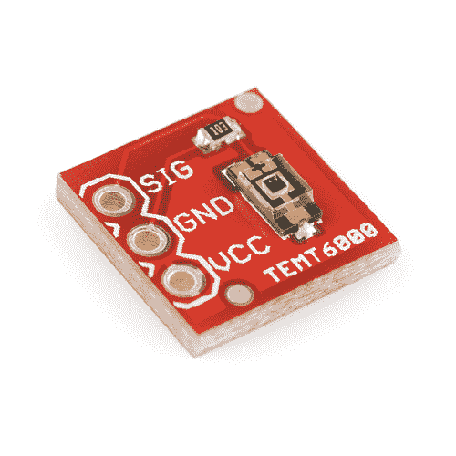

# TEMT6000 环境光传感器连接指南

> 原文：<https://learn.sparkfun.com/tutorials/temt6000-ambient-light-sensor-hookup-guide>

## 介绍

光传感器在现代有各种各样的实际用途，最显著的是在屏幕自动亮度调节设备和数码相机中调节曝光。有了[环境光线传感器分线点](http://sfe.io/p8688)，与 [TEMT6000 光线传感器](http://sfe.io/p8348)连接将变得轻而易举，因此您可以将检测光线水平的能力带到任何项目中。

 

将**添加到您的[购物车](https://www.sparkfun.com/cart)中！**

 **### [SparkFun 环境光传感器分线点- TEMT6000](https://www.sparkfun.com/products/8688)

[In stock](https://learn.sparkfun.com/static/bubbles/ "in stock") BOB-08688

TEMT6000 环境光传感器的基本分线板。只有你需要的，没有你不需要的。传感器就像一个晶体管…

$4.958[Favorited Favorite](# "Add to favorites") 23[Wish List](# "Add to wish list")** **顾名思义，TEMT6000 光传感器会检测周围的亮度。虽然光的许多属性可以帮助我们对其亮度进行分类，但 TEMT6000 测量的是[照度](https://en.wikipedia.org/wiki/Illuminance)(以[勒克斯(lx)](https://en.wikipedia.org/wiki/Lux) 为单位，通常表示为 E [v] )。如果你对照明不熟悉，也不用担心，TEMT6000 使用起来非常直观:更亮=电流更大，更暗=电流更小。

在本指南中，我们将向您展示如何快速启动并运行环境光传感器，然后讨论其工作原理的一些更具技术性的细节。之后，我们会告诉你如何使用它来制作一个实用的 DIY 小夜灯！

### 所需材料

以下是您需要遵循本指南的内容:**