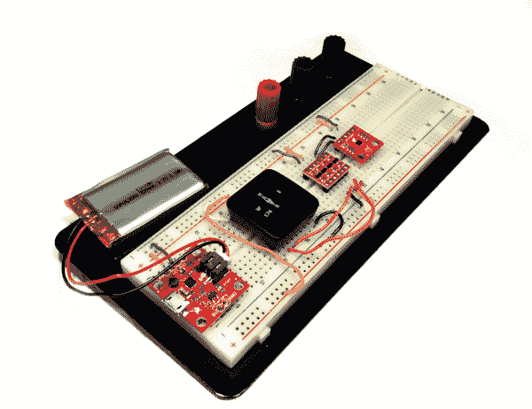

# 显微视野数字罗盘

> 原文：<https://learn.sparkfun.com/tutorials/microview-digital-compass->

## 介绍

在本教程中，你将学习如何使用一个 [MAG3110 三轴磁力计](https://www.sparkfun.com/products/12670)来制作一个便携式数字指南针！该项目还将使用 [SparkFun 微视图](https://www.sparkfun.com/products/12923)来显示标题。

如果你还没有检查过，去看看新的 [MAG3110 连接指南](https://learn.sparkfun.com/tutorials/mag3110-magnetometer-hookup-guide-)了解这个设备是如何工作的！

### 所需材料

该项目使用 MAG3110 磁力计来感应磁北极，并使用 SparkFun 显微视图来显示和控制整个节目。如果你没有，你还需要一个[微视图程序员](https://www.sparkfun.com/products/12924)来上传代码到微视图。

由于 MicroView 是 5V 逻辑器件，而 MAG3110 是低压器件，您还需要一个[双向逻辑转换器](https://www.sparkfun.com/products/12009)来促进它们之间的通信。小心，如果将它们直接连接在一起，可能会损坏 MAG3110 传感器！

我选择用电池供电，所以我可以带着它到处走。我使用了 [SparkFun 的 Power Cell - LiPo 充电器/升压器](https://www.sparkfun.com/products/11231)和一个 [850mAh LiPo 面糊](https://www.sparkfun.com/products/341)。然而，如果你不想得到额外的部件，请随时通过 USB 将它连接到你的计算机上。

你可以在试验板上构建整个系统，或者使用 SparkFun 的漂亮的[snap able proto board](https://www.sparkfun.com/products/13268)进行更持久的项目。

对于这些器件中的大多数，您可能必须焊接公接头，以便与试验板一起使用。关于如何做到这一点，请看下面的建议读物！

下面的愿望清单包含了你需要遵循的大部分内容。