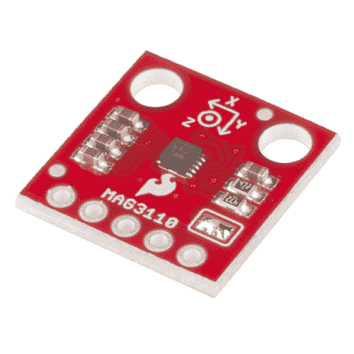

# MAG3110 磁力计连接指南

> 原文：<https://learn.sparkfun.com/tutorials/mag3110-magnetometer-hookup-guide->

## 介绍

[SparkFun MAG3110 三轴磁力计](https://www.sparkfun.com/products/12670)是恩智浦/飞思卡尔三轴磁力计的分线板。这是一款通过 I2C 进行通信的低功耗(1.95V 至 3.6V)器件。它输出二进制补码数据，数值范围为-30，000 至+30，000，满量程范围为 1000 T。

这个传感器可以让你快速检测周围的磁场。这些数据可以用来创建一个数字指南针，甚至可以感应变压器产生的强磁场！

 

### [SparkFun 三轴磁力仪突破- MAG3110](https://www.sparkfun.com/products/retired/12670)

[Retired](https://learn.sparkfun.com/static/bubbles/ "Retired") SEN-12670

飞思卡尔的 MAG3110 是一款小型、低功耗、数字三轴磁力计。该设备可与 3 轴……

2 **Retired**[Favorited Favorite](# "Add to favorites") 8[Wish List](# "Add to wish list")

我们将探索 MAG3110 传感器的功能，并使用 SparkFun MAG3110 Arduino 库和示例代码启动和运行。

### 所需材料

所需材料因传感器的使用方式而异。您会注意到该传感器的电源只能达到 3.6V。如果您试图使用 5V Arduino 或类似平台与该传感器通信，您可能会永久损坏芯片！要使用 5V 逻辑器件，必须使用双向逻辑电平转换器。

幸运的是，SparkFun 提供了一些便宜的选择。[这部分](https://www.sparkfun.com/products/12009)推荐。

请注意，如果您的 Arduino 没有板载稳压器，您还需要一个低压电源来为该传感器供电。你可能想用这样的东西 [3.3V 低压差稳压器(LDO)](https://www.sparkfun.com/products/526)

至于你需要的其他物品，请看下面的愿望清单。