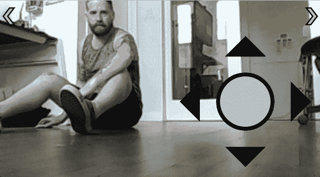
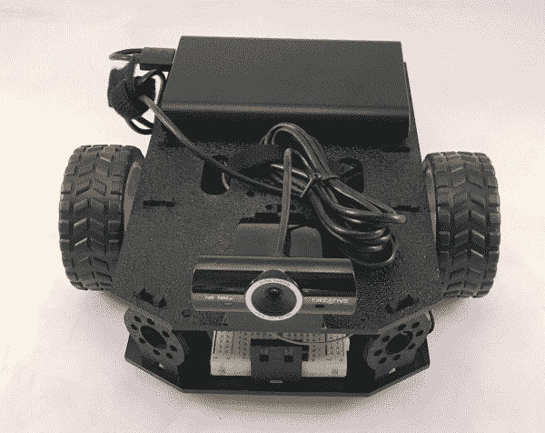

# 用 Tessel 2 重组机器人

> 原文：<https://learn.sparkfun.com/tutorials/reconbot-with-the-tessel-2>

## 让我们造一个机器人吧！

你将要制造一个可以通过手机或笔记本电脑上的浏览器控制的机器人。你可以通过机器人的“眼睛”(*第一人称视角*，或 FPV)来引导机器人，因为它会为你播放直播视频，所以你可以看到它面前有什么。你可以驾驶你的机器人绕过角落，进入角落和缝隙，追逐你的猫，招待客人，或者只是一遍又一遍地把它撞到椅子腿上——这都取决于你！

基于浏览器的控制模仿拇指垫操纵杆，回想起无线电控制(RC)汽车的触觉控制。我们机器人的虚拟操纵杆控制方向和速度。当它没有被主动拖动和保持时，它会迅速回到中心(机器人将停止移动)。

你的机器人将独立于电线和外部连接:你可以通过你的本地 WiFi 网络控制它，我们将使用 USB 电源给它供电。

## 飞行前检查

如果这是你第一次试验 [Tessel 2](https://learn.sparkfun.com/tutorials/experiment-guide-for-the-johnny-five-inventors-kit/about-the-tessel-2) ，有几件事你必须先做！我们建议在开始这个项目之前通读我们的 Tessel 2 入门。我们保证，不会花那么长时间。

 [### 开始使用 Tessel 2

#### 2016 年 10 月 12 日](https://learn.sparkfun.com/tutorials/getting-started-with-the-tessel-2) Get your Tessel 2 up and running by blinking and LED, the Hello World of embedded electronics.[Favorited Favorite](# "Add to favorites") 1

### 深入探究 Tessel 2

如果你是从 Tessel 2 开始的话，整个 [Johnny-Five Inventor's Kit 实验指南](https://learn.sparkfun.com/tutorials/experiment-guide-for-the-johnny-five-inventors-kit)是很棒的东西。

 [### Johnny-Five 发明人工具包实验指南

#### 2016 年 6 月 28 日](https://learn.sparkfun.com/tutorials/experiment-guide-for-the-johnny-five-inventors-kit) Use the Tessel 2 and the Johnny Five Inventors kit to explore the world of JavaScript enabled hardware through 14 awesome experiments 8

## 材料

要制造我们的机器人，你需要以下零件: