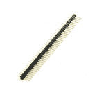
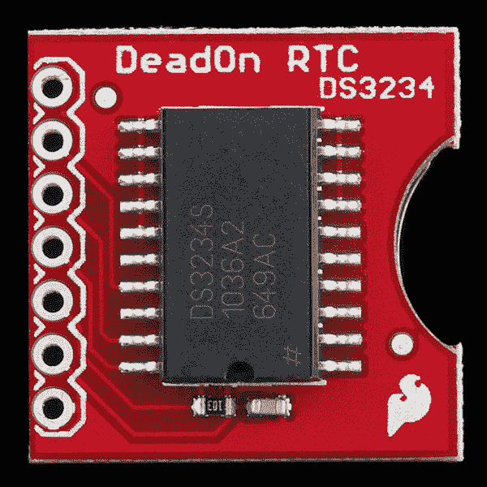
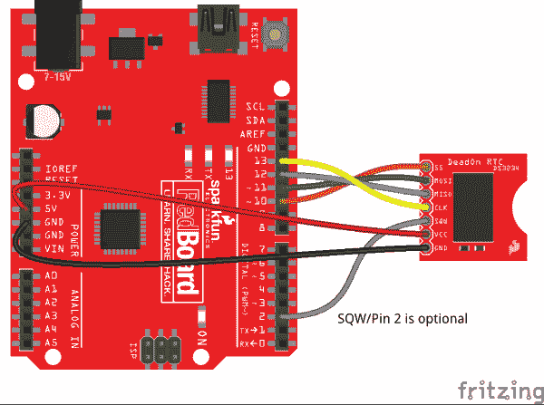

# DeadOn RTC 分线连接指南

> 原文：<https://learn.sparkfun.com/tutorials/deadon-rtc-breakout-hookup-guide>

## 介绍

[SparkFun DeadOn RTC 分线板](https://www.sparkfun.com/products/10160)是 DS3234 实时时钟(RTC) IC 的简单分线板。DS3234 可以精确记录秒、分、小时、日、月和年，因此您的微控制器不必如此。它甚至有一对可配置的闹钟。DeadOn RTC 非常适合时钟、日历或任何其他计时项目。

[](https://www.sparkfun.com/products/10160) 

将**添加到您的[购物车](https://www.sparkfun.com/cart)中！**

 **### [SparkFun DeadOn RTC 分线点- DS3234](https://www.sparkfun.com/products/10160)

[Out of stock](https://learn.sparkfun.com/static/bubbles/ "out of stock") BOB-10160

这是一个基于 DS3234 实时时钟 IC 的实时时钟。DS3234 是一款低成本、极其精确的实时 SPI 总线

$24.5019[Favorited Favorite](# "Add to favorites") 16[Wish List](# "Add to wish list")** **微控制器与 DS3234 之间的通信通过一个四线 SPI 接口实现。当它不是通过主电源供电时，芯片可以设置为依靠备用电池运行-在未来许多年内保持其编程时间。

本教程是对 DS3234 和 SparkFun DeadOn RTC 分线点的一般介绍。它涵盖了分会场的硬件和固件需求，记录了芯片的布线示例和 Arduino 代码。

### 建议的材料

你需要一些额外的部件来启动和运行 DeadOn RTC。下面是本教程中使用的组件，如果您想继续学习的话。

支持 [SPI](https://learn.sparkfun.com/tutorials/serial-peripheral-interface-spi) 的**微控制器**需要与 DS3234 通信，并将 RTC 的数据转发给用户。 [SparkFun RedBoard](https://www.sparkfun.com/products/12757) 或 [Arduino Uno](https://www.sparkfun.com/products/11021) 是这个角色的热门选择，但几乎任何微控制器开发板都应该工作。(本教程中的示例代码使用了一个 Arduino 库，如果这是使用 Arduino 的额外动力的话。)

[](https://www.sparkfun.com/products/11113) 

将**添加到您的[购物车](https://www.sparkfun.com/cart)中！**

 **### [Arduino Pro Mini 328-5V/16 MHz](https://www.sparkfun.com/products/11113)

[In stock](https://learn.sparkfun.com/static/bubbles/ "in stock") DEV-11113

SparkFun 对 Arduino 的极简设计方法。这是一个 5V Arduino 运行 16MHz 引导加载程序。

$10.95137[Favorited Favorite](# "Add to favorites") 166[Wish List](# "Add to wish list")****[](https://www.sparkfun.com/products/12640) 

将**添加到您的[购物车](https://www.sparkfun.com/cart)中！**

 **### [Pro 微 5V/16MHz](https://www.sparkfun.com/products/12640)

[Out of stock](https://learn.sparkfun.com/static/bubbles/ "out of stock") DEV-12640

在 SparkFun，我们拒绝放弃“足够好”。这就是我们增加 Arduino 兼容微控制器产品线的原因…

$19.5080[Favorited Favorite](# "Add to favorites") 87[Wish List](# "Add to wish list")****[](https://www.sparkfun.com/products/11021) 

将**添加到您的[购物车](https://www.sparkfun.com/cart)中！**

 **### [Arduino Uno - R3](https://www.sparkfun.com/products/11021)

[In stock](https://learn.sparkfun.com/static/bubbles/ "in stock") DEV-11021

这是新的 Arduino Uno R3。除了以前主板的所有功能外，Uno 现在使用 ATmega16U2 代替…

$27.95138[Favorited Favorite](# "Add to favorites") 162[Wish List](# "Add to wish list")****[](https://www.sparkfun.com/products/retired/12757) 

### [spark fun red board——用 Arduino 编程 T3](https://www.sparkfun.com/products/retired/12757)

[Retired](https://learn.sparkfun.com/static/bubbles/ "Retired") DEV-12757

在 SparkFun，我们使用许多 Arduinos，我们一直在寻找最简单、最稳定的一款。每块板都有点不同…

127 **Retired**[Favorited Favorite](# "Add to favorites") 78[Wish List](# "Add to wish list")****** ******六七根[跳线](https://www.sparkfun.com/products/13870)和一个[试验板](https://www.sparkfun.com/products/12002)帮助将 RTC 连接到你的 Arduino。为了将分接头插入试验板，你需要将[接头](https://www.sparkfun.com/products/116)焊接到引脚上。(别忘了[一个烙铁](https://www.sparkfun.com/products/9507)和[焊锡](https://www.sparkfun.com/products/9163)！)

[](https://www.sparkfun.com/products/12002) 

将**添加到您的[购物车](https://www.sparkfun.com/cart)中！**

 **### [【试验板-不干胶(白色)](https://www.sparkfun.com/products/12002)

[In stock](https://learn.sparkfun.com/static/bubbles/ "in stock") PRT-12002

这是你的尝试和真正的白色无焊试验板。它有 2 条电源总线，10 列，30 行，总共 400 个连接…

$5.5048[Favorited Favorite](# "Add to favorites") 93[Wish List](# "Add to wish list")****[](https://www.sparkfun.com/products/116) 

将**添加到您的[购物车](https://www.sparkfun.com/cart)中！**

 **### [破开头球——直击](https://www.sparkfun.com/products/116)

[In stock](https://learn.sparkfun.com/static/bubbles/ "in stock") PRT-00116

一排标题-打破适应。40 个引脚，可切割成任何尺寸。用于定制 PCB 或通用定制接头。

$1.7520[Favorited Favorite](# "Add to favorites") 133[Wish List](# "Add to wish list")****[](https://www.sparkfun.com/products/9507) 

将**添加到您的[购物车](https://www.sparkfun.com/cart)中！**

 **### [烙铁- 30W(美国，110V)](https://www.sparkfun.com/products/9507)

[33 available](https://learn.sparkfun.com/static/bubbles/ "33 available") TOL-09507

这是一个非常简单的固定温度，快速加热，30W 110/120 VAC 烙铁。我们真的很喜欢使用更贵的 iro…

$10.957[Favorited Favorite](# "Add to favorites") 21[Wish List](# "Add to wish list")****[](https://www.sparkfun.com/products/retired/13870) 

### [跳线高级 4" M/M - 20 AWG (30 个装)](https://www.sparkfun.com/products/retired/13870)

[Retired](https://learn.sparkfun.com/static/bubbles/ "Retired") PRT-13870

这些是 101 毫米长的 20AWG 跳线，两端都有公接头。使用这些从任何板上的任何母接头跳接…

**Retired**[Favorited Favorite](# "Add to favorites") 5[Wish List](# "Add to wish list")****** ******最后，DeadOn RTC 分线点*不包含[12 毫米纽扣电池](https://www.sparkfun.com/products/337)。插上一个硬币电池就能让你的 RTC 多年保持良好的计时状态。*

[](https://www.sparkfun.com/products/337) 

将**添加到您的[购物车](https://www.sparkfun.com/cart)中！**

 **### [纽扣电池- 12mm (CR1225)](https://www.sparkfun.com/products/337)

[In stock](https://learn.sparkfun.com/static/bubbles/ "in stock") PRT-00337

CR1225 锂金属 3V 12mm 47mAh 纽扣电池。微型传感器节点应用的完美小型电池。Thes…

$2.102[Favorited Favorite](# "Add to favorites") 14[Wish List](# "Add to wish list")** **### 推荐阅读

SparkFun DeadOn RTC Breakout 是一个非常适合初学者的分线板。然而，仍然有一些你应该熟悉的概念。如果下面的任何教程标题对你来说听起来很陌生，可以考虑浏览一下:

[](https://learn.sparkfun.com/tutorials/how-to-solder-through-hole-soldering) [### 如何焊接:通孔焊接](https://learn.sparkfun.com/tutorials/how-to-solder-through-hole-soldering) This tutorial covers everything you need to know about through-hole soldering.[Favorited Favorite](# "Add to favorites") 70[](https://learn.sparkfun.com/tutorials/installing-an-arduino-library) [### 安装 Arduino 库](https://learn.sparkfun.com/tutorials/installing-an-arduino-library) How do I install a custom Arduino library? It's easy! This tutorial will go over how to install an Arduino library using the Arduino Library Manager. For libraries not linked with the Arduino IDE, we will also go over manually installing an Arduino library.[Favorited Favorite](# "Add to favorites") 22[](https://learn.sparkfun.com/tutorials/serial-peripheral-interface-spi) [### 串行外设接口(SPI)](https://learn.sparkfun.com/tutorials/serial-peripheral-interface-spi) SPI is commonly used to connect microcontrollers to peripherals such as sensors, shift registers, and SD cards.[Favorited Favorite](# "Add to favorites") 91[](https://learn.sparkfun.com/tutorials/what-is-an-arduino) [### 什么是 Arduino？](https://learn.sparkfun.com/tutorials/what-is-an-arduino) What is this 'Arduino' thing anyway? This tutorials dives into what an Arduino is and along with Arduino projects and widgets.[Favorited Favorite](# "Add to favorites") 50

## 硬件概述

DeadOn RTC 分线点围绕 DS3234，提供计时、通信和维持电源所需的所有组件。通信和电源引脚全部连接到一个 7 引脚接头。电路板的顶部装有 IC 本身和几个支持它的无源器件:

[](https://cdn.sparkfun.com/assets/learn_tutorials/5/7/3/top.jpg)

分线点的底部贴上引脚标签，并安装 12 毫米纽扣电池座:

[](https://cdn.sparkfun.com/assets/learn_tutorials/5/7/3/bottom.jpg)

### 插脚引线图

板上的 7 个引脚分线点提供 DS3234 的通信接口、电源和方波/中断输出:

| Pin Label | 输入/输出 | 描述 |
| GND | 供应输入 | 接地(0V)电源 |
| VCC | 供应输入 | DS3234 V [CC] 电源输入 |
| SQW | 输出 | 可配置方波输出
报警 1 和/或报警 2 中断输出 |
| CLK | 投入 | SPI 时钟输入 |
| 军事情报部门组织(Military Intelligence Service Organization) | 输出 | SPI 主机输入，从机输出 |
| MOSI | 投入 | SPI 主机输出，从机输入 |
| 圣人 | 投入 | SPI 低电平有效芯片选择 |

CLK、MISO、MOSI 和 SS 构成 DS3234 的 SPI 接口。所有四个都需要连接到微控制器的 I/O 引脚，以允许芯片之间的通信。使用多才多艺的 SQW 引脚是可选的，但如果你使用闹钟或需要额外的计时输出，它会非常方便。更多信息和下面的电源引脚。

### 为 DS3234 供电

Deadon RTC 分线板不包括任何电压调节，因此提供给“VCC”引脚的电源应保持在 DS3234 的(宽)推荐工作范围内: **2.0 至 5.5V** 。幸运的是，突破应该与 3.3V 或 5V 开发板工作！

芯片被设计成尽可能低功耗。虽然它以 5V 供电，但在通信突发期间，芯片可能会消耗 400-700 A 以上的电流，但它通常会在接近 **120 A 的电流下运行。**当主电源被移除并且芯片正在使用其备用电池时，它将消耗大约 **2 A** 。

假设它的容量为 47mAh，一个充满电的 [12mm 纽扣电池](https://www.sparkfun.com/products/337)可以让 DS3234 运行长达 **2.68 年**，如果芯片平均消耗 2 A！

(47mAh / 2 A = 23500 小时= 979.17 天= 2.68 年)

### 报警和 SQW(方波)/报警中断输出引脚

DS3234 最独特的功能之一是它的一对可配置报警:恰当地命名为“报警 1”和“报警 2”更高分辨率的警报 1 可以设置为触发任何秒、分、小时和/或日/日期组合，而警报 2 可以监控从分钟到日/日期的任何内容。随着时间的流逝，DS3234 会将时间与可能设置的任何警报进行比较。如果一切都匹配，芯片会设置一个标志，指示其中一个或两个警报已经触发。

除了 SPI 引脚，DS3234 还具有一个非常通用的引脚，标签为“SQW”该引脚可配置为**方波输出**(输出频率范围为 1Hz 至 8.192kHz)，或配置为**低电平有效中断输出**，表示已触发警报。

为了将 SQW 引脚用作输出或中断，它必须连接到一个[上拉电阻](https://learn.sparkfun.com/tutorials/pull-up-resistors)。一个[10kω电阻](https://www.sparkfun.com/products/11508)，连接在 SQW 和 VCC 之间，或者你的微控制器的内部上拉电阻应该可以完成这项工作。

## 硬件连接

在将 DeadOn RTC 分线点插入试验板或将其连接到微控制器之前，您需要将*某物*焊接到 7 针接头上。如果你打算用芯片做试验板，我们推荐[直阳接头](https://www.sparkfun.com/products/116)。[母接头](https://www.sparkfun.com/products/115)甚至几条[钢丝](https://www.sparkfun.com/products/11375)也是不错的选择。

如果您焊接接头，您可能希望将引脚插入电路板的“顶”侧，以保持接触电池和良好的标签视图。

[](https://cdn.sparkfun.com/assets/learn_tutorials/5/7/3/rtc-header-soldered.jpg)

方便的是，接头的护罩大约与 DS3234 一样高，因此它不会干扰试验板的插接。

### 插入电池

DeadOn RTC 分线点没有配备[12 毫米硬币电池](https://www.sparkfun.com/products/337)，但是推荐使用电池——如果没有电池，RTC 将在断电时失去时间记录。插入电池时，确保“+”符号朝上，它应该接触到电池座的顶部。

[](https://cdn.sparkfun.com/assets/learn_tutorials/5/7/3/rtc-battery-insert.jpg)

希望你在很多年内都不需要移除和更换电池！

### 示例电路

DS3234 的 SPI 接口意味着，为了与芯片接口，在微控制器和分线板之间至少需要六根导线:电源、接地、主输入/从输出(MOSI)、主输出/从输入(MISO)、串行时钟(SCLK)和从选择(SS)。

这是一个连接图示例，演示了如何将电路板连接到 Arduino Uno。该图还将 SQW 连接到 Arduino，使用该引脚作为中断输出。这条线是可选的，但是如果没有连接，您必须(非常轻微地)修改示例代码。

[](https://cdn.sparkfun.com/assets/learn_tutorials/5/7/3/deadonrtc-example-circuit_bb.png)

## 使用 SparkFun DS3234 Arduino 库

我们为 DS3234 编写了一个 Arduino 库，它负责所有 SPI 通信、移位、寄存器写入和时钟管理；它甚至可以自动设置你的 RTC 的时间！从我们的[spark fun _ ds 3234 _ RTC _ Arduino _ Library GitHub 库](https://github.com/sparkfun/SparkFun_DS3234_RTC_Arduino_Library)获取最新版本的库，或者点击下面的链接:

[Download the SparkFun DS3234 Arduino Library](https://github.com/sparkfun/SparkFun_DS3234_RTC_Arduino_Library/archive/master.zip)

然后跟随我们的[如何安装 Arduino 库教程](https://learn.sparkfun.com/tutorials/installing-an-arduino-library)来帮助安装库。如果下载库的 ZIP 文件，可以使用 Arduino 的“添加 ZIP 库...”只需几次点击就可以安装源文件和示例文件。

[](https://cdn.sparkfun.com/assets/learn_tutorials/5/7/3/add-zip-library.png)

### 使用 DS3234_RTC_Demo 示例

下载完库后，导航到**文件** > **示例** > **SparkFun DS3234 实时时钟(RTC)**>**ds 3234 _ RTC _ Demo**打开 DS3234_Demo:

[](https://cdn.sparkfun.com/assets/learn_tutorials/5/7/3/example-open-location.png)

如果你没有连接 SQW 管脚——在这个例子中用作报警中断——注释掉草图顶部的`#define INTERRUPT_PIN 2`行。该循环将改为轮询 DS3234 的报警状态。

确保您的板和端口设置正确并上传！然后点击**串行监视器**。确保波特率设置为 9600 bps，您应该开始看到时间飞逝:

[](https://cdn.sparkfun.com/assets/learn_tutorials/5/7/3/serial-monitor-example.png)

警报被配置为每 30 秒响一次-警报 2 在该分钟的顶部触发，警报 1 在该分钟的 30 秒触发。

### 使用 SparkFun DS3234 Arduino 库

该示例演示了 DS3234 的几乎所有功能。下面是如何将库合并到项目中的快速入门:

#### 初始化

首先，确保包含了`SparkFunDS3234RTC.h`库。除此之外，您还需要包括`SPI.h`Arduino SPI 库:

```
language:c
#include <SPI.h>
#include <SparkFunDS3234RTC.h> 
```

DS3234 库定义了一个名为`rtc`的对象来访问 RTC 模块的所有功能和数据。要初始化 RTC，首先调用您的`setup()`区域中的`rtc.begin(<cs_pin>)`函数:

```
language:c
#define DS13074_CS_PIN 10

void setup()
{
    ...
    rtc.begin(DS13074_CS_PIN);
    ...
} 
```

`begin()`函数有一个参数 SPI 从机选择引脚“SS”在我们的示例电路中，我们将 SS 连接到 Arduino 引脚 10，尽管它可以连接到任何其他引脚。

#### 设定时间

RTC 初始化后，您可以设置 RTC 的时间。这里有几个选择。我们建议使用`rtc.autoTime()`函数，它设置 RTC 的时钟，即您计算机的日期和时间(基于编译时间)，或者使用`rtc.setTime(<second>, <minute>, <hour>, <day>, <date>, <month>, <year>)`，它允许您精确地设置时钟。

演示示例默认使用`rtc.autoTime()`，它将 RTC 的时间和日期设置为您计算机的时间和日期。当代码上传时，随着时间的流逝，可能会有几秒钟的时间。

##### 一劳永逸！

一旦使用`autoTime`或`setTime`功能设置了 RTC 的时间和日期寄存器，您可能再也不用设置时钟了！

一旦你完美地配置了时钟，考虑完全注释掉`autoTime`或`setTime`。

如果您想手动设置时间，请使用`setTime()`功能。例如:

```
language:c
// Set to 13:37:42 (1:37:42 PM)
int hour = 13;
int minute = 37;
int second = 42;
// Set to Monday October 31, 2016:
int day = 2; // Sunday=1, Monday=2, ..., Saturday=7.
int date = 31; 
int month = 10;
int year = 16;

rtc.setTime(second, minute, hour, day, date, month, year); 
```

##### 12 小时模式

RTC 默认为 24 小时模式，但支持带 AM/PM 位的 12 小时模式。如果您想使用 12 小时模式，只需调用`rtc.set12Hour()`(或`rtc.set24Hour()`切换回 24 小时模式)。

要在 12 小时模式下设置时间，应在“小时”变量后添加一个额外的参数–`AM`或`PM`。例如:

```
setTime(14, 42, 7, PM, 1, 28, 12, 16); // Set time to 7:42:14 PM, Sunday December, 28 
```

setTime(14, 42, 7, PM, 1, 28, 12, 16); // Set time to 7:42:14 PM, Sunday December, 28

#### 阅读时间

一旦时钟设置好，它将自动开始一秒一秒、一分一秒、一年一年地递增。要读取时间和日期值，首先调用`rtc.update()`。这将命令 DS3234 一次性读取其所有数据寄存器。

RTC 数据更新后，您可以通过调用`rtc.hour()`、`rtc.minute()`、`rtc.second()`等来读取那些更新的值。例如:

```
language:c
rtc.update(); / Update RTC data

// Read the time:
int s = rtc.second();
int m = rtc.minute();
int h = rtc.hour();

// Read the day/date:
int dy = rtc.day();
int da = rtc.date();
int mo = rtc.month();
int yr = rtc.year(); 
```

“日”是“一周中的某一天”，例如星期日、星期一、星期二...`rtc.day()`返回一个介于 1 和 7 之间的整数，其中 1 是星期天，7 是星期六(抱歉，星期-星期一开始真的)。或者，您可以调用`rtc.dayChar()`或`rtc.dayStr()`，它们返回一个字符或完整字符串表示的一周中的某一天。

#### 设置/读取警报

DS3234 的报警对可以用`setAlarm1(<second>, <minute>, <hour>, <date>, <day/date>)`和`setAlarm2(<minute>, <hour>, <date>, <day/date>)`功能设置。报警 1 的分辨率可以低至几秒，而报警 2 的分辨率仅限于几分钟。

`setAlarm`功能中的所有变量都是可选的。如果没有明确设置，变量将默认为`255`，并在报警检查中被屏蔽。只要任何非屏蔽变量与当前时间和/或日期完全匹配，就会触发报警。

以下是几个警报设置示例，展示如何使用这些功能:

```
language:c
// With no values passed, the alarms will trigger every second/minute:
setAlarm1(); // Alarm 1 triggers every second
SetAlarm2(); // Alarm 2 triggers every minute
// With one value passed, the alarms will trigger on second/minute matches:
setAlarm1(25); // Alarm 1: whenever SECONDS are 25 (e.g. 2:01:25, 2:02:25, etc...)
setAlarm2(45); // Alarm 2: whenever MINUTES are 45 (e.g. 13:45, 14:45, etc...)
// With two values passed, alarms will trigger on second/minute or minute/hour matches:
setAlarm1(19, 15); // Alarm 1: whenever SECONDS are 19 and MINUTES 15 (e.g. XX:15:19)
setAlarm2(0, 30); // Alarm 2: midnight:30
// Three values passed: Alarm 1 triggers at specific time, Alarm 2 triggers at time/day-of-month
setAlarm1(17, 33, 19); // Alarm 1: 19:33:17 (7:33:17 PM)
setAlarm2(0, 1, 2); // Alarm 2: 1:00 on the 2nd day of the month
// Four values passed:  Alarm 1 triggers at specific time/day-of-month, Alarm 2 triggers at time/day-of-week
setAlarm1(11, 11, 11, 19); // Alarm 1: 11:11:11 on the 19th day of the month
setAlarm2(17, 7, 1, true); // Alarm 2: 7:17:00 on a Monday (1)
// If last parameter in alarm 1 or alarm 2 is true, it will alarm on a weekday match
setAlarm1(4, 5, 6, 7, true); // Alarm 1: 6:05:04 on Saturday (7) 
```

##### 12 小时模式报警

如果您在 12 小时模式下使用 DS3234，您需要在“小时”变量后添加一个`AM`或`PM`。例如:

```
setAlarm1(45, 30, 2, PM); // Set alarm 1 for 2:30:45 PM
setAlarm2(0, 6, AM; // Set alarm 2 for 6:00 AM 
```

setAlarm1(45, 30, 2, PM); // Set alarm 1 for 2:30:45 PM setAlarm2(0, 6, AM); // Set alarm 2 for 6:00 AM

要监控任一报警的状态，调用`rtc.alarm1()`和`rtc.alarm2()`功能。它们将检查 DS3234 中的状态标志，如果警报已触发，则返回 true。

```
language:c
if (rtc.alarm1())
    Serial.println("ALARM 1 is triggered!");
if (rtc.alarm2())
    Serial.println("ALARM 2 is triggered!"); 
```

最后，要使用 SQW 引脚作为中断，调用`rtc.enableAlarmInterrupt();`函数。中断为低电平有效，这意味着您需要通过一个电阻(或内部上拉电阻)将引脚拉高。当引脚读取低电平时，中断已经发生，这意味着是时候读取一个/两个`alarm()`功能了。

* * *

有关使用 SparkFun DS3234 Arduino 库的更多信息，请考虑通读[头文件](https://github.com/sparkfun/SparkFun_DS3234_RTC_Arduino_Library/blob/master/src/SparkFunDS3234RTC.h)，该文件记录了 Arduino 草图可用的所有功能。

## 资源和更进一步

有关 DeadOn RTC 分线点和 Maxim DS3234 的更多信息，请查看以下链接:

*   [DeadOn RTC 分线点 GitHub 仓库](https://github.com/sparkfun/DeadOn_RTC) -最新 DeadOn RTC 硬件设计文件和固件的大本营。
*   [DeadOn RTC 分线示意图](http://www.sparkfun.com/datasheets/BreakoutBoards/DeadOn%20RTC%20-%20DS3234%20Breakout-v11.pdf) (PDF)
*   [DeadOn RTC Breakout Eagle 文件](http://www.sparkfun.com/datasheets/BreakoutBoards/DeadOn%20RTC%20-%20DS3234%20Breakout-v11.zip) (ZIP)
*   [DS3234 数据表](http://www.sparkfun.com/datasheets/BreakoutBoards/DS3234.pdf) (PDF)
*   [SparkFun DS3234 RTC Arduino 库 GitHub 库](https://github.com/sparkfun/SparkFun_DS3234_RTC_Arduino_Library) -本教程中使用的 Arduino 库的源文件和示例文件。

现在你的 Arduino 已经开始计时了，你打算用 DeadOn RTC 创建什么项目呢？需要一些灵感，查看一些相关教程:

[](https://learn.sparkfun.com/tutorials/reaction-timer) [### 反应速度测量器](https://learn.sparkfun.com/tutorials/reaction-timer) Demonstrate mental chronometry with this simple reaction timer 11[](https://learn.sparkfun.com/tutorials/alphanumeric-gps-wall-clock) [### 字母数字 GPS 挂钟](https://learn.sparkfun.com/tutorials/alphanumeric-gps-wall-clock) This is a GPS controlled clock - a clock you truly never have to set! Using GPS and some formulas, we figure out what day of the week and if we are in or out of daylight savings time.[Favorited Favorite](# "Add to favorites") 13[](https://learn.sparkfun.com/tutorials/adding-a-timed-button-to-a-project) [### 将定时按钮添加到项目](https://learn.sparkfun.com/tutorials/adding-a-timed-button-to-a-project) This tutorial will walk you through making a timed power controller for interactive projects. You will learn how to add an on button that will provide power to your project for an amount of time and then turn off again.[Favorited Favorite](# "Add to favorites") 6[](https://learn.sparkfun.com/tutorials/real-time-clock-module-hookup-guide) [### 实时时钟模块连接指南](https://learn.sparkfun.com/tutorials/real-time-clock-module-hookup-guide) A quick introduction to the DS1307 RTC module and a hookup guide for the SparkFun Breakout.[Favorited Favorite](# "Add to favorites") 6

或者看看下面的一些博客帖子来寻找灵感:

[](https://www.sparkfun.com/news/2205 "October 6, 2016: New tutorials and Arduino libraries for the DeadOn RTC and Real Time Clock module breakout boards – plus, a fun little analog clock project.") [### 今日英语:RTC 之战

October 6, 2016](https://www.sparkfun.com/news/2205 "October 6, 2016: New tutorials and Arduino libraries for the DeadOn RTC and Real Time Clock module breakout boards – plus, a fun little analog clock project.")[Favorited Favorite](# "Add to favorites") 0[](https://www.sparkfun.com/news/2364 "April 19, 2017: Make an easy project for energy conservation! ") [### 硬件驼峰日:地球日黑客

April 19, 2017](https://www.sparkfun.com/news/2364 "April 19, 2017: Make an easy project for energy conservation! ")[Favorited Favorite](# "Add to favorites") 0[](https://www.sparkfun.com/news/2646 "March 26, 2018: Waking up is the worst. Let's try and make it a little easier on ourselves.") [### DIY 日出闹钟

March 26, 2018](https://www.sparkfun.com/news/2646 "March 26, 2018: Waking up is the worst. Let's try and make it a little easier on ourselves.")[Favorited Favorite](# "Add to favorites") 4[](https://www.sparkfun.com/news/2683 "May 8, 2018: I built an alternative clock using a 3D printer and laser cutter.") [### 谢妮 LED 钟

May 8, 2018](https://www.sparkfun.com/news/2683 "May 8, 2018: I built an alternative clock using a 3D printer and laser cutter.")[Favorited Favorite](# "Add to favorites") 5****************