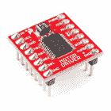

# TB6612FNG 连接指南

> 原文：<https://learn.sparkfun.com/tutorials/tb6612fng-hookup-guide>

## 介绍

[TB6612FNG](http://www.sparkfun.com/datasheets/Robotics/TB6612FNG.pdf) 是一种简单且经济实惠的电机控制方式。TB6612FNG 能够以高达 1.2A 的恒定电流驱动两个电机。在 IC 内部，你会发现在一个芯片上有两个标准的 H 桥，你不仅可以控制电机的方向和速度，还可以停止和刹车。本指南将详细介绍如何使用 TB6612FNG 分线板。本指南的库也适用于 RedBot 主板，因为它使用相同的电机驱动芯片。

 

将**添加到您的[购物车](https://www.sparkfun.com/cart)中！**

### [【spark fun 电机驱动器-双 TB6612FNG(带接头)](https://www.sparkfun.com/products/14450)

[In stock](https://learn.sparkfun.com/static/bubbles/ "in stock") ROB-14450

停止延期交货-主集成电路的供应将推迟到 2022 年 7 月。

$9.9514[Favorited Favorite](# "Add to favorites") 33[Wish List](# "Add to wish list")**** 

将**添加到您的[购物车](https://www.sparkfun.com/cart)中！**

### [【spark fun 电机驱动器-双 TB6612FNG (1A)](https://www.sparkfun.com/products/14451)

[In stock](https://learn.sparkfun.com/static/bubbles/ "in stock") ROB-14451

以 1.2A 的恒定电流控制多达两个 DC 电机输出。利用多达两个输入信号和四种功能模式:CW…

$9.505[Favorited Favorite](# "Add to favorites") 18[Wish List](# "Add to wish list")**** 

将**添加到您的[购物车](https://www.sparkfun.com/cart)中！**

### [SparkFun RedBot 主板](https://www.sparkfun.com/products/12097)

[Only 10 left!](https://learn.sparkfun.com/static/bubbles/ "only 10 left!") ROB-12097

SparkFun RedBot 主板是一个机器人开发平台，可与 Arduino IDE 配合使用。红色机器人是一个马达驱动器…

$36.955[Favorited Favorite](# "Add to favorites") 12[Wish List](# "Add to wish list")****** ******### 所需材料

要了解本教程中的电机驱动器示例，您需要以下基本组件:******