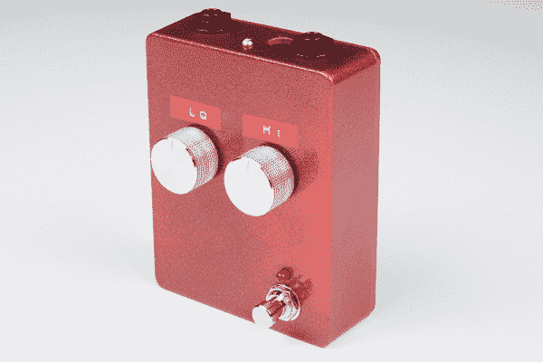

# 原型踏板示例:模拟均衡器项目

> 原文：<https://learn.sparkfun.com/tutorials/proto-pedal-example-analog-equalizer-project>

## 介绍

在[原型踏板组装指南](https://learn.sparkfun.com/tutorials/proto-pedal-assembly-and-theory-guide)中组装好原型踏板后，我们将继续在板上实际构建一个效果电路。我们将基于电路是弗雷德福塞尔的摆动输入均衡器。

*Two-band equalizer pedal.*

### 所需材料

为了构建均衡器电路，我们需要以下元件: