# 原型踏板底盘连接指南

> 原文：<https://learn.sparkfun.com/tutorials/proto-pedal-chassis-hookup-guide>

## 介绍

原型踏板底盘带有连接 PCB 所需的孔，但由于不同的踏板设计使用不同类型的控制，我们将控制钻孔留给了制造商。本指南将带您完成布局和钻孔，然后油漆底盘。

[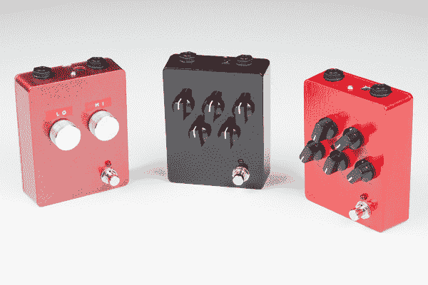](https://cdn.sparkfun.com/assets/learn_tutorials/5/6/5/Proto_Pedal_Tutorial_Images-77.jpg)

我们将钻一个底盘来匹配[数字原型踏板示例](https://learn.sparkfun.com/tutorials/proto-pedal-example-programmable-digital-pedal)，它显示了一个使用 [Teensy 3.2](https://www.sparkfun.com/products/13736) 和[音频适配器](https://www.sparkfun.com/products/12767)以及[原型踏板](https://www.sparkfun.com/products/13124)和[原型踏板底盘](https://www.sparkfun.com/products/13967)的应用。

### 材料

#### 必需的:

*   [原踏板](https://www.sparkfun.com/products/13124)和[底盘](https://www.sparkfun.com/products/13967)
*   与所需井眼直径相匹配的麻花钻钻头(不是铲子)
*   大约 1/8 英寸的导向钻。一定要锋利清新！
*   几个钻头之间逐步增加到所需的大小。
*   尺子
*   中心冲头(一个大的金属螺丝和锤子也可以)
*   变速手钻，有线或无线
*   夹钳、老虎钳、支架
*   一些废木块
*   一支铅笔

#### 还建议:

*   薄圆形锉(针或链磨锉)
*   速度广场
*   组合方形/划线
*   弹簧加载中心冲头
*   异丙醇/丙酮
*   颜料

### 推荐阅读

*   如果从以太网得到这里，检查出[原型踏板组件和理论指南](https://learn.sparkfun.com/tutorials/proto-pedal-assembly-and-theory-guide)，它显示了如何组装电路板去的情况。确保先组装好这个。

## 布置孔洞

在钻孔之前，我们需要确定钻孔的位置。

这是一个立体思维的练习。我们需要考虑控制面板的位置，以及上下的间隙。在踏板表面上方，你可能想要在控制装置周围留出一些空间，这样你就可以抓住它们。在机箱内部，您需要考虑控件内部的位置，尤其是相对于 PCB 上较高的组件。

### 粗略布局

在本例中，我们希望在机箱上放置五个电位计。我们只是简单地移动底盘上的旋钮，直到我们达成一个合理的安排。请注意，我们将为 TRS 千斤顶留出间隙。

[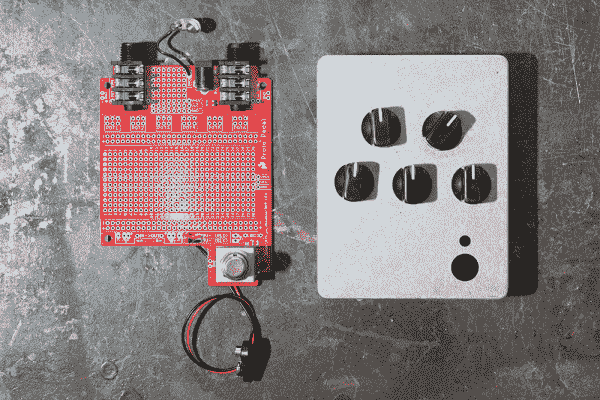](https://cdn.sparkfun.com/assets/learn_tutorials/5/6/5/Proto_Pedal_Tutorial_Images-12.jpg)*Laying out the knobs*

我们将电路板放在附近作为参考，以帮助查看内部对象的位置。我们附近还有组装好的 Teensy 3.2 和音频适配器，我们在工作时测试了几次。这让我们认识到筹码堆并没有高出棋盘太多，留下了垂直空间来放置一个罐子。

[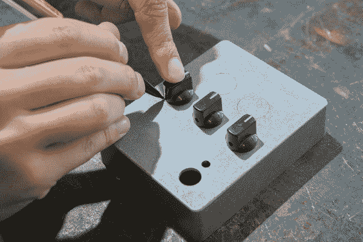](https://cdn.sparkfun.com/assets/learn_tutorials/5/6/5/Proto_Pedal_Tutorial_Images-13.jpg)*Tracing the knob outlines*

旋钮大致接近它们的最终目的地，我们用铅笔在盒子上画了圈。

### 更精确的布局

移除旋钮后，我们从盒子的顶部边缘测量它们的中心位置。我们计算了测量值的平均值，这样这些洞就能合理地对齐了。

在这里，我们在距离顶部边缘 2 1/2 英寸的地方做了一个标记，使用一个组合方块来确保一致的距离。如果没有正方形，可以仔细测量两点，在两点之间画一条线。

[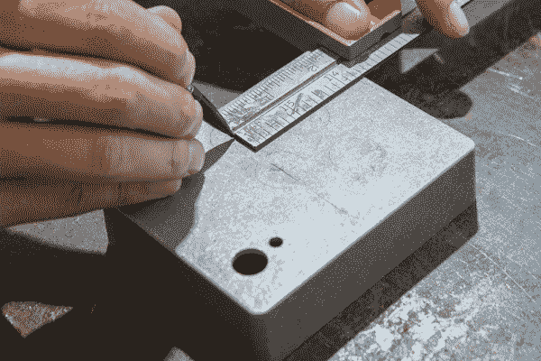](https://cdn.sparkfun.com/assets/learn_tutorials/5/6/5/Proto_Pedal_Tutorial_Images-14.jpg)*Setting the vertical alignment*

最上面一排离边缘近一英寸，是 1 1/2 英寸。

[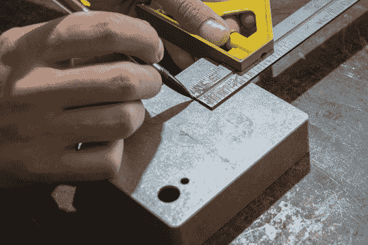](https://cdn.sparkfun.com/assets/learn_tutorials/5/6/5/Proto_Pedal_Tutorial_Images-15.jpg)*Do this for each row.*

画出行的线后，我们将继续移动到行中每个花盆的水平位置。

[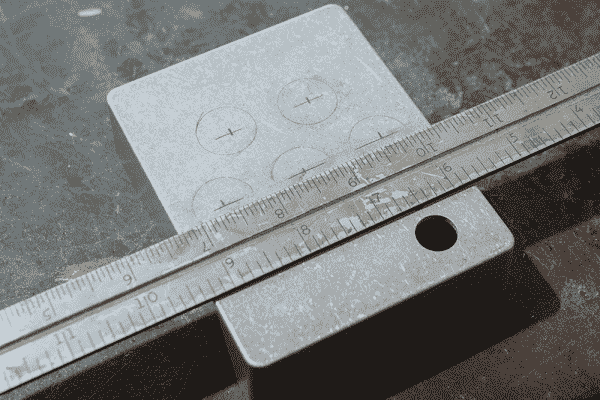](https://cdn.sparkfun.com/assets/learn_tutorials/5/6/5/Proto_Pedal_Tutorial_Images-16.jpg)*Center your rule to a common overlap to identify center*

我们决定将这些旋钮居中，所以我们在盒子上设置了标尺，这样边缘在 9 1/4 和 5 3/4 处对齐了超过最后一整英寸的相同数量的细分，或者稍多于 1/4 英寸。现在，8 1/2 英寸的标记水平居中，我们可以从那里开始计数细分，以确保孔的间距相等。

在底排标记之间的 1/2 处标记顶排孔，形成一个规则的“M”形。

请注意，粗略的旋钮轮廓不再精确到中心标记。轮廓只是为了美观，而测量的标记确保了准确性。

#### 拳打

在每个孔的中心打孔。这将有助于引导钻头。

如果你以前从未见过弹簧中心冲床，他们真的很酷。只要按下去，直到内部弹簧弹出，它会留下一个标记。你可以在大多数五金店买到这些。

[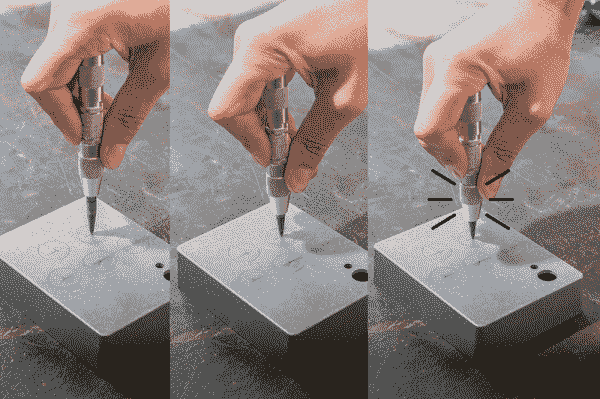](https://cdn.sparkfun.com/assets/learn_tutorials/5/6/5/3click.png)*Using a spring loaded punch*

或者如果你没有中心冲头，使用大螺丝和锤子。大盘头效果很好，但是木甲板螺钉或干墙螺钉太尖了。

[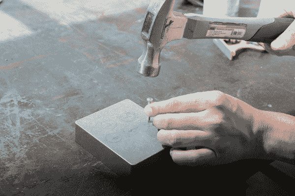](https://cdn.sparkfun.com/assets/learn_tutorials/5/6/5/Proto_Pedal_Tutorial_Images-20.jpg)*Using a screw for a punch*

现在让我们开始真正的行动吧！

## 演练

当你对自己的中心打孔标记感到满意时，就该开始钻孔了。

### 钻孔金属

在金属上钻孔时，重要的是从一个小的导向孔开始，然后逐渐增大到所需的尺寸。对于这些孔，它们对于 [10k 线性电位计](https://www.sparkfun.com/products/9939)来说是 5/16 英寸。每个连续的洞应该比前一个洞大 25%到 50%。

[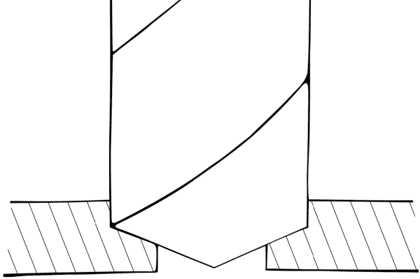](https://cdn.sparkfun.com/assets/learn_tutorials/5/6/5/drillhit.png)*This diagram shows the maximum overlap desired.*

在金属上钻孔时，使用适度缓慢的速度和合理的压力。钻得太快会导致钻头过热，如果失去控制会更加危险。

### 准备

钻孔前，用老虎钳或夹钳牢牢固定工件。

[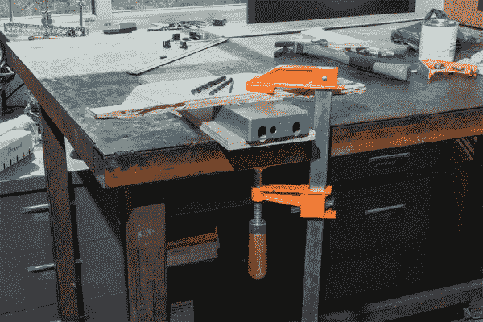](https://cdn.sparkfun.com/assets/learn_tutorials/5/6/5/Proto_Pedal_Tutorial_Images-21b.jpg)*Preparing to drill*

这里，已经选择了三个位，并且工件被夹紧。你可能认为你可以用手按住工件，但更多的时候，它会卡在钻头上并旋转，重击你的手并造成伤害(也许还会损坏工件)。此外，使用碎木头来保护碎片免受损坏，并提供一些柔软的东西让钻头在穿透时撞击。

### 演练

从一个小的导向孔开始。这是最重要的钻孔，因为它将引导其他孔。

*Carefully align the pilot holes*

使用手钻的一个挑战是保持垂直于工作面。作为参考，在该片上设置一个正方形，并将其用作视觉向导。在你开始钻孔之前，把钻头放在你认为它应该在的地方，像猫头鹰一样转动你的头，看看你从各个角度都对准了。

当你准备好了，用中等速度和适当的压力钻孔。钻头应该产生持续的废料流。如果它看起来只是在旋转，仔细检查你没有在倒退，试着增加更多的压力，或者降低钻孔速度。

**Double check alignment!** After drilling the pilot holes, check that they are aligned as they should be. If not, you can use a thin file to make the hole oblong and bring the geometric center back in line, and the next bit should correct the offset. With sharp bits and good perpendicular alignment, this shouldn'tbe required.

导向孔完成后，移动到下一个更大的钻头，并使用它来扩大每个孔。当你移动到越来越大的比特时，应该需要更低的速度。

[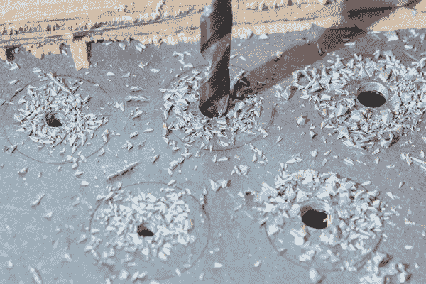](https://cdn.sparkfun.com/assets/learn_tutorials/5/6/5/Proto_Pedal_Tutorial_Images-23.jpg)*Progressing through the selected drill bits, enlarging the holes*

在中间孔之后，我们可以钻最后一个孔，5/16 英寸。

[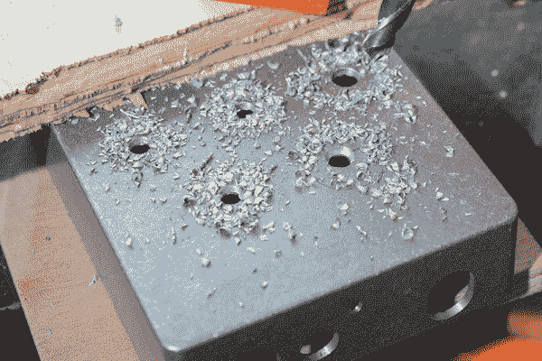](https://cdn.sparkfun.com/assets/learn_tutorials/5/6/5/Proto_Pedal_Tutorial_Images-24.jpg)*The final size is being drilled here.
The drill has been stopped partway through to show the overlap detail (lower right).*

钻孔边缘经常有尖锐的毛刺。如果你愿意，你可以用倒角工具将边缘削成斜角，或者用锉刀将它们清理干净。这不是必需的，但会去掉锋利的边缘。

[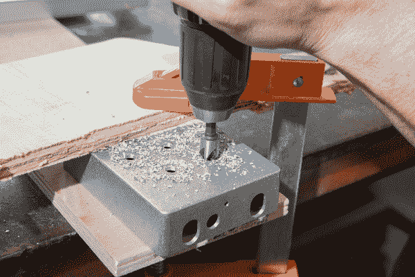](https://cdn.sparkfun.com/assets/learn_tutorials/5/6/5/Proto_Pedal_Tutorial_Images-26.jpg)*Cleaning up the edges*

## 电位计注意事项

电位计有一个对准/保持凸台。你可以钻一个额外的孔来保留它，或者用一把侧铣刀把它剪掉。

*Removing the bosses.*

## 青少年的额外球洞

对于基于 Teensy 的数字踏板，我们将添加几个额外的孔。第一个是在机箱侧面的 USB 连接器，加上 pdeal 顶部的第二个更小的孔，所以我们可以接触到手动加载按钮。

与我们的初始布局一样，我们将根据经验来做，使用最终零件来测量孔需要在哪里。我们从 USB 端口开始，在机箱的左侧进行测量。

### 编程端口

首先，根据你希望青少年在踏板上的位置来选择编程孔的位置。使用电路板作为导向，将 1/4 英寸的插孔肩与内平面对齐。

[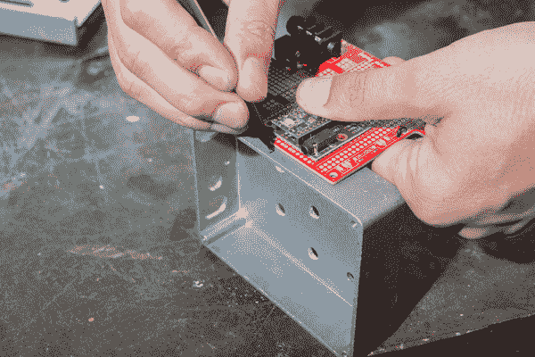](https://cdn.sparkfun.com/assets/learn_tutorials/5/6/5/Proto_Pedal_Tutorial_Images-31.jpg)*Using the board as a guide for hole placement*

通过将电路板固定在组装时的位置来估算孔的高度，并穿过之前的标记。

[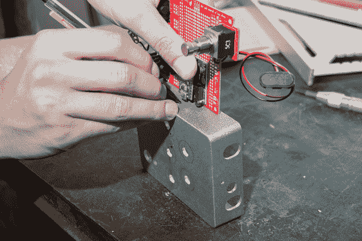](https://cdn.sparkfun.com/assets/learn_tutorials/5/6/5/Proto_Pedal_Tutorial_Images-32.jpg)*Aligning the height of the hole*

然后，打一个中心点，然后继续钻孔。

我们一路走到我们最大的钻，以适应 USB 插头成型，总共 4 个钻。这一次，我们用老虎钳夹住工件，再用木块保护它。

[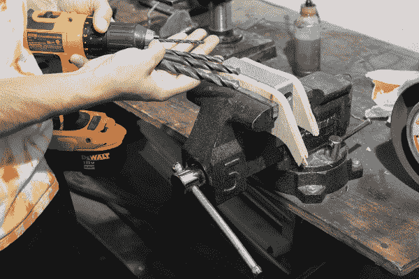](https://cdn.sparkfun.com/assets/learn_tutorials/5/6/5/Proto_Pedal_Tutorial_Images-33.jpg)*Preparing to drill*

和以前一样，我们正在逐步进行更大的训练。

[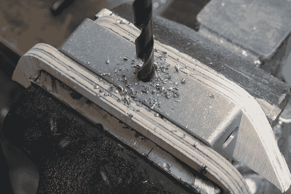](https://cdn.sparkfun.com/assets/learn_tutorials/5/6/5/Proto_Pedal_Tutorial_Images-34.jpg)*Here the pilot hole is being enlarged. I like to allow more overlap on the smaller drills.*

由于这个孔较大，所以会有两个中间钻。

[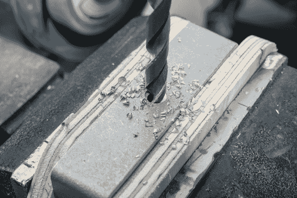](https://cdn.sparkfun.com/assets/learn_tutorials/5/6/5/Proto_Pedal_Tutorial_Images-35.jpg)*The second oversize closer to the first size.*

注意废料的质量。当废料形成卷曲而不是小碎片时，这是一个好迹象，表明速度和压力是正确的。此外，这里可以看到，对于这个大比特，重叠相当小。否则，钻头在接近穿过时很容易被卡住。

[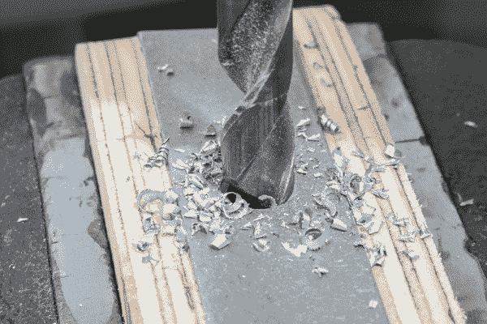](https://cdn.sparkfun.com/assets/learn_tutorials/5/6/5/Proto_Pedal_Tutorial_Images-36.jpg)*Drilling the final USB hole.*

钻孔完成后，我们要对孔的边缘进行倒角。倒角对这个孔更重要，因为锐边不会被控制覆盖。这一次，这个孔和之前倒角的钻头一样大，所以我们必须用锉刀手工进行。

[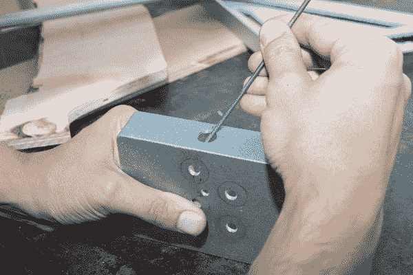](https://cdn.sparkfun.com/assets/learn_tutorials/5/6/5/Proto_Pedal_Tutorial_Images-37.jpg)*Deburring with a file*

### 复位开关

我们对按钮的孔使用了类似的三角测量过程。这里，在它应该在的地方有一个标记，但那是在一个旋钮下面。该孔被移到旋钮轮廓之外，并且必须以微小的角度使用。

[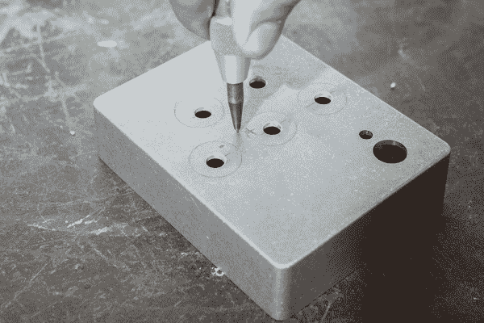](https://cdn.sparkfun.com/assets/learn_tutorials/5/6/5/Proto_Pedal_Tutorial_Images-30.jpg)*Center punching the button hole*

因为这个洞比较小，我们不需要钻那么多的洞。

## 绘画

最后，你可以给你的踏板上漆。我们选择了几种防锈油为基础的瓷漆，根据颜色的不同，它们有着非常不同的特性，我们还选择了一种使用红色 Krylon 微光喷漆的喷涂工作，带有一层透明的涂层。

*Cleaning the workpiece*

首先用丙酮或异丙醇清洁外壳。这可以去除油渍和铅笔痕迹。

[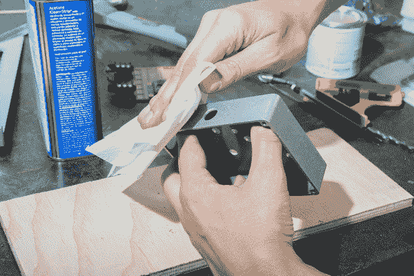](https://cdn.sparkfun.com/assets/learn_tutorials/5/6/5/Proto_Pedal_Tutorial_Images-39.jpg)*Make sure to not touch clean areas!*

使用泡沫施加器楔形物施加液体涂料。

[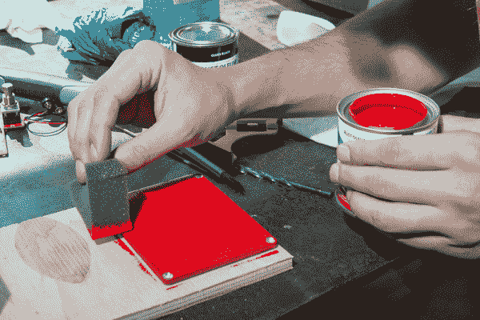](https://cdn.sparkfun.com/assets/learn_tutorials/5/6/5/Proto_Pedal_Tutorial_Images-40.jpg)*Use scrap wood to catch extra paint*

绘画可能是一个杂乱的过程，你很可能会在工作台面上沾上一些。你可以用抹布或其他废料，如木头或纸板来防止油漆溢出。

[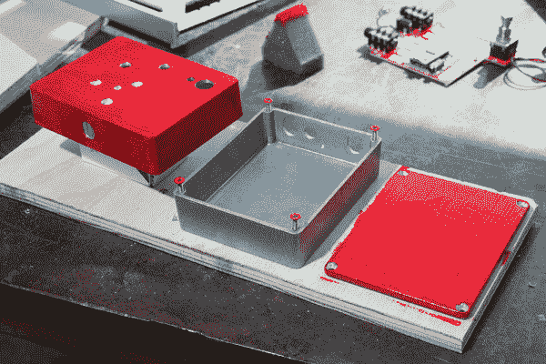](https://cdn.sparkfun.com/assets/learn_tutorials/5/6/5/Proto_Pedal_Tutorial_Images-42.jpg)*Allowing to dry*

如果你愿意的话，你也可以在螺丝的表面涂上颜色，但是尽量不要让任何东西进入螺纹孔，否则它们可能很难拧动。

### 绘画结果

你可以看到，红色油漆往往堆积起来，留有条纹，需要再次打磨和涂层。这种油漆应该用喷雾器或稀释后使用。黑色流平性很好，可以用砂纸打磨至合适的光洁度，但红色拒绝流平，如上图所示。闪光漆非常棒。

## 资源和更进一步

不知道在你的箱子里放什么？试试这些！

*   如果你对模拟电路感兴趣，请查看[模拟均衡器踏板示例](https://learn.sparkfun.com/tutorials/proto-pedal-example-analog-equalizer-project)项目。
*   如果你更熟悉编写软件，想通过编写程序来设计效果，可以看看[可编程数字踏板](https://learn.sparkfun.com/tutorials/proto-pedal-example-programmable-digital-pedal)的例子。

享受装饰和标记新踏板的乐趣，尽情摇滚吧！