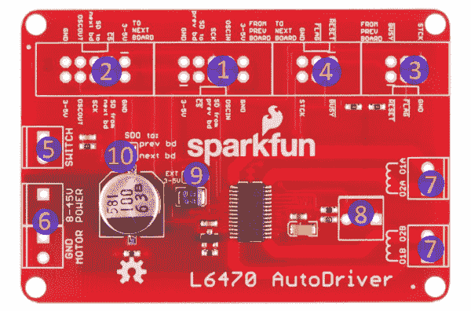
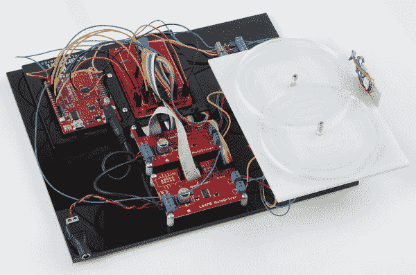

# AutoDriver - v13 入门

> 原文：<https://learn.sparkfun.com/tutorials/getting-started-with-the-autodriver---v13>

## 介绍

[自动驱动板](https://www.sparkfun.com/products/13752)基于[意法半导体 L6470 dSPIN 步进电机驱动器](http://www.st.com/web/catalog/sense_power/FM142/CL851/SC1794/SS1498/LN1723/PF248592)。这款功能强大的芯片允许您通过 SPI 连接控制电压在 3A [rms] 时为 8-45V 的步进电机。

 

将**添加到您的[购物车](https://www.sparkfun.com/cart)中！**

### [【SparkFun auto Driver-步进电机驱动器(v13)](https://www.sparkfun.com/products/13752)

[In stock](https://learn.sparkfun.com/static/bubbles/ "in stock") BOB-13752

SparkFun AutoDriver 板基于 STMicro L6470 dSPIN 步进电机驱动器。这款功能强大的芯片可以让您控制…

$41.959[Favorited Favorite](# "Add to favorites") 6[Wish List](# "Add to wish list")** **与传统的步进/方向电机控制器相比，它具有许多优势:

*   L6470 跟踪电机的当前位置，因此应用级不必如此。
*   “发射和遗忘”运动控制，允许应用程序继续工作，同时电机自动完成所需的运动。
*   加速和减速曲线，无需复杂的软件算法。
*   微步，特别平滑的运动。
*   加速、减速、运行和保持电流可配置，用户可以更好地控制功耗。
*   SPI 接口，允许单个处理器驱动更多电机。

L6470 的主要缺点是它需要更多的配置，并增加了系统的软件复杂性。这种连接指南将试图减轻一些困难。

#### 硬件版本 13 的差异

硬件版本 13 与之前的版本略有不同。它已经过修改，可以更容易地用简单的 [10 导体带状电缆](https://www.sparkfun.com/products/8535)和 [6 导体带状电缆](https://www.sparkfun.com/products/10646)将多个电路板菊花链在一起，用于数据和控制。

库也发生了变化，尽管可以使用旧版本的新库。该库的主要新增功能是传递给类构造函数的索引参数，允许用户指定每个 Autodriver 板在链中的位置。引脚和 SPI 配置也从库中移出，允许在具有多个 SPI 端口的器件上使用除主端口以外的 SPI 端口。

#### 推荐阅读

在开始之前，您可能想看看这些其他教程，以帮助您朝着正确的方向前进:

*   [SPI](https://learn.sparkfun.com/tutorials/serial-peripheral-interface-spi) -串行外设接口是 L6470 芯片和 AutoDriver 板与系统主 CPU 通信的方式。
*   [电机](https://learn.sparkfun.com/tutorials/motors-and-selecting-the-right-one) -了解步进电机对驱动它们很重要。
*   [安装 Arduino 库](https://learn.sparkfun.com/tutorials/installing-an-arduino-library)-auto driver 有一个 Arduino 库；如果你还不知道如何安装一个新的库，看看这篇教程，让你找到正确的方向。

## 五金器具

AutoDriver 板旨在轻松集成到项目中，即使有多个板也是如此。这里简单介绍一下硬件以及如何连接它。

#### 董事会

正如你在上面看到的，板上有几个连接器。让我们一次解决一个问题:

1.  **通信输入**-SPI、时钟和逻辑电平电源进入电路板的地方。这可以来自系统 CPU 或先前的自动驱动程序板。默认情况下，AutoDriver 期望这里有电源输入，但该电源是*而不是*电机的电源，并且不应超过 5V。设计用于 [2x5 .1”屏蔽连接器](https://www.sparkfun.com/products/8506)，并通过 [2x5 带状电缆](https://www.sparkfun.com/products/8535)连接。
2.  **通信输出** - SPI、时钟和逻辑电源输出至下一个自动驱动器。设计用于 [2x5 .1”屏蔽连接器](https://www.sparkfun.com/products/8506)，并通过 [2x5 带状电缆](https://www.sparkfun.com/products/8535)连接。
3.  中的**控制信号-自动驱动器输入和输出的元信号。片选、可选步进时钟和复位输入进入此处，开漏繁忙和错误标志信号返回前一板。设计用于 [2x3 .1”带罩顶盖](https://www.sparkfun.com/products/10877)，并通过 2x3 带状电缆连接。**
4.  **控制信号输出** -将公共控制信号传递给下一个自动驱动器。该接头上的所有引脚都是控制信号输入接头上的相同引脚所共有的。设计用于 [2x3 .1”带罩顶盖](https://www.sparkfun.com/products/10877)，并通过 2x3 带状电缆连接。
5.  **开关输入**-l 6470 可以接受来自开关的输入，以提供硬停止限位开关或可配置的用户中断。我们稍后会谈到这一点。尺寸适合一个[3.5 毫米螺丝端子](https://www.sparkfun.com/products/8084)。
6.  **电源输入** -两个连接器，每个连接器有两个电源和接地端子，使多个电路板连接到一个电源变得容易。这是电机功率输入，尺寸适合一个[3.5 毫米螺丝端子](https://www.sparkfun.com/products/8084)。**必须连接电机电源，以便板卡响应命令！**
7.  **A 和 B 绕组输出**-l 6470 设计用于双极步进电机或配置为双极的单极或通用步进电机。这些端子中的每一个都应连接一个绕组，尽管哪个绕组连接到哪个端子并不重要(除了确定哪个方向被认为是“正向”)。
8.  **ADC 输入/电位计尺寸** -该尺寸可安装一个 200k 电位计，以提供电机电源电压校正，确保在不同电源电压下驱动电流恒定。高度可选，但我们把足迹放在那里，以防万一。
9.  **数据电压电源信号** -该跳线在通信接头上的外部电源和内部产生的 3V 电源之间进行选择。通常假设用户将通过通信头传递电源电压。
10.  **数据路由跳线** -该跳线允许用户决定来自该板的数据将被发送到哪里:向前发送到系列中的下一个板，或者向后发送到系列中的上一个板。当多个 Autodriver 板串联连接时，最后一个板(离控制 CPU 最远)应保留默认设置(即“上一个 bd”设置)，所有其他板应选择“下一个 bd”设置。如果只使用一块板，应选择“prev bd”。

#### 连接到红纸板的示例

在本教程的后面，我们将向您展示如何将两个 AutoDriver 板连接到一个 RedBoard。例如，您将需要两个[自动驱动板](https://www.sparkfun.com/products/11611)以及以下内容:**