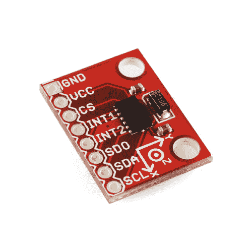

# ADXL345 连接指南

> 原文：<https://learn.sparkfun.com/tutorials/adxl345-hookup-guide>

## 介绍

[ADXL345](https://www.sparkfun.com/products/9836) 是一款小、薄、低功耗、三轴 MEMS 加速度计，具有最高+/-16 g 的高分辨率(13 位)测量。数字输出数据格式化为 16 位二进制补码，可通过 SPI (3 线或 4 线)或 I ² C 数字接口访问。

 

将**添加到您的[购物车](https://www.sparkfun.com/cart)中！**

 **### [SparkFun 三轴加速度计分线点- ADXL345](https://www.sparkfun.com/products/9836)

[In stock](https://learn.sparkfun.com/static/bubbles/ "in stock") SEN-09836

这个新版本增加了两个支座孔以及一个额外的去耦电容。ADXL345 是一款小型、薄型、低功耗、3 通道器件。

$20.5010[Favorited Favorite](# "Add to favorites") 24[Wish List](# "Add to wish list")** **本连接指南将利用 SparkFun ADXL345 Arduino 库和示例代码探讨 ADXL345 的各种功能。首先，让我们了解一下这款小巧但功能强大的加速度计的背景。

当我们浏览连接指南时，您会发现手头有 ADXL345 数据手册很有用。

[ADXL345 Datasheet](https://www.sparkfun.com/datasheets/Sensors/Accelerometer/ADXL345.pdf)

### 所需材料

下面的愿望清单包括了本教程中用到的所有材料:**