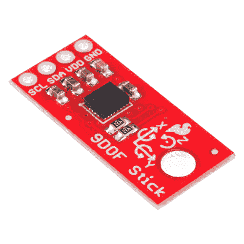

# 9 自由度传感器杆连接指南

> 原文：<https://learn.sparkfun.com/tutorials/9dof-sensor-stick-hookup-guide>

## 介绍

[9DoF 传感棒](https://www.sparkfun.com/products/13944)是一款易于使用的 9 自由度 IMU。使用的传感器是 LSM9DS1，与 [SparkFun 9 自由度 IMU 突破](https://www.sparkfun.com/products/13284)中使用的传感器相同，但尺寸缩小到只有 0.9“x 0.4”。

 

### [SparkFun 9DoF 感应棒](https://www.sparkfun.com/products/retired/13944)

[Retired](https://learn.sparkfun.com/static/bubbles/ "Retired") SEN-13944

SparkFun 9DoF 传感器棒是一款易于使用的 9 自由度 IMU。感应棒巧妙地利用了 LSM9DS1 的运动特性。

8 **Retired**[Favorited Favorite](# "Add to favorites") 25[Wish List](# "Add to wish list")

[https://www.youtube.com/embed/Q0v3TTL_r3I/?autohide=1&border=0&wmode=opaque&enablejsapi=1](https://www.youtube.com/embed/Q0v3TTL_r3I/?autohide=1&border=0&wmode=opaque&enablejsapi=1)

### 所需材料

要遵循本连接指南，您需要以下内容: