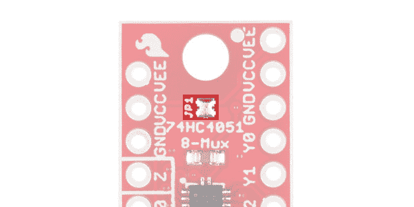
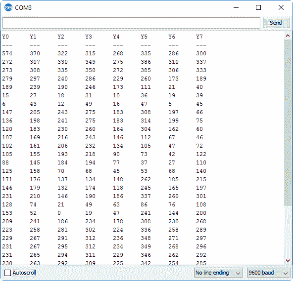

# 多路复用器分线连接指南

> 原文：<https://learn.sparkfun.com/tutorials/multiplexer-breakout-hookup-guide>

## 介绍

[SparkFun 多路复用器分线点](https://www.sparkfun.com/products/13906)提供对 74hc 4051(8 通道模拟多路复用器/多路分解器)所有引脚和功能的访问。74HC4051 允许您将四个 I/O 引脚转换为八个多功能、可单独选择的信号，这些信号可用于从驱动八个 led 到监控八个电位计的任何事情。

[](https://www.sparkfun.com/products/13906) 

将**添加到您的[购物车](https://www.sparkfun.com/cart)中！**

### [【spark fun 多路复用器分线点- 8 通道(74HC4051)](https://www.sparkfun.com/products/13906)

[In stock](https://learn.sparkfun.com/static/bubbles/ "in stock") BOB-13906

SparkFun 多路复用器分线点提供对 74hc 4051(8 通道模拟多路复用器/数模转换器)所有引脚和功能的访问

$2.953[Favorited Favorite](# "Add to favorites") 24[Wish List](# "Add to wish list")** **复用器，通常缩写为**“mux”**，是一种电子驱动的开关，可以将一个信号转换成多个信号。它将一个公共输入信号路由到任意数量的独立输出。类似地， *de* 多路复用器将任意数量的可选输入路由至单个公共输出。

74HC4051 可以用作多路复用器或多路分解器，它具有可选输入/输出的**八个通道**。通过数字控制三条**选择线**来设置公共信号到独立 I/O 的路由，这三条选择线可以设置为八种[二进制](https://learn.sparkfun.com/tutorials/binary)组合之一的高或低。

### 本教程涵盖的内容

本教程涵盖了组装多路复用器分线点所需的一切，然后将其连接并集成到您的项目中。本教程包括两个 Arduino 示例，演示如何使用多路复用器进行数字输出和模拟输入。本教程分为以下几个部分，您可以使用右侧的栏浏览这些部分。

*   [74HC4051 分线板概述](https://learn.sparkfun.com/tutorials/multiplexer-breakout-hookup-guide#74hc4051-breakout-overview) -快速介绍 74HC4051 的工作原理和分线板的额外功能。
*   [电路板组装](https://learn.sparkfun.com/tutorials/multiplexer-breakout-hookup-guide#board-assembly) -将接头或电线焊接到分线点并安装到项目中的技巧和窍门。
*   Arduino 示例:输出 -一个 Arduino 电路和示例代码，演示了如何使用多路复用器来驱动 8 个 led。
*   [Arduino 示例:输入](https://learn.sparkfun.com/tutorials/multiplexer-breakout-hookup-guide#arduino-example-input) -电路和 Arduino 示意图，说明如何使用电路板读取八个产生模拟电压的光电池。

### 推荐阅读

Muxes 对于所有经验水平的电子用户都是一个很好的工具——任何需要增加项目管脚数的人。不过，在深入研究多路复用之前，您应该熟悉一些主题。如果下面的主题对你来说听起来很陌生，在继续之前考虑浏览一下那个教程。

[](https://learn.sparkfun.com/tutorials/binary) [### 二进制的](https://learn.sparkfun.com/tutorials/binary) Binary is the numeral system of electronics and programming...so it must be important to learn. But, what is binary? How does it translate to other numeral systems like decimal?[Favorited Favorite](# "Add to favorites") 51[](https://learn.sparkfun.com/tutorials/how-to-use-a-breadboard) [### 如何使用试验板](https://learn.sparkfun.com/tutorials/how-to-use-a-breadboard) Welcome to the wonderful world of breadboards. Here we will learn what a breadboard is and how to use one to build your very first circuit.[Favorited Favorite](# "Add to favorites") 79[](https://learn.sparkfun.com/tutorials/analog-vs-digital) [### 模拟与数字](https://learn.sparkfun.com/tutorials/analog-vs-digital) This tutorial covers the concept of analog and digital signals, as they relate to electronics.[Favorited Favorite](# "Add to favorites") 66[](https://learn.sparkfun.com/tutorials/digital-logic) [### 数字逻辑](https://learn.sparkfun.com/tutorials/digital-logic) A primer on digital logic concepts in hardware and software.[Favorited Favorite](# "Add to favorites") 33

## 74HC4051 分接头概述

多路复用器分线点的[原理图](https://cdn.sparkfun.com/assets/learn_tutorials/5/5/3/SparkFun-Mux-Breakout-74HC4051.pdf)非常简单:有芯片、去耦电容、上拉电阻，所有引脚都分线(有些分线两次):

[](https://cdn.sparkfun.com/assets/learn_tutorials/5/5/3/breakout-top-rotated.jpg)

电路板的一半分出控制信号( E ，S0-S2)和公共输入/输出(Z)。另一侧提供对所有八个独立 I/O(Y0-Y7)的访问。两侧包括电源和接地连接(V [CC] ，V [EE] ，GND)。下表总结了每个引脚及其功能。

| Pin Label | 功能 | 输入/输出
(至电路板) | 笔记 |
| E | 使能够 | 投入 | 低电平有效使能 |
| S2，S1，S0 | 选择控件 | 投入 | 选择输入，S2 是 msb，S0 是 lsb |
| Z | 通用输入输出 | 输入/输出 | 公共输出或输入 |
| GND | 地面 | 供应 | 接地电源电压(0V) |
| VCC | 正电源 | 供应 | 正电源电压(2-10V) |
| v 字形物 | 负电源 | 供应 | 负电源电压(默认跳至地) |
| Y7，Y6，Y5，Y4，
Y3，Y2，Y1，Y0 | 独立输入输出 | 输入/输出 | 可选 I/O 路由至公共引脚 |

### 74HC4051 逻辑表

除了使能引脚( E )之外，选择引脚(S2-S0)控制八个独立 I/O 引脚(Y0-Y7)中的哪些(如果有的话)连接到公共引脚(Z)。下面的功能表显示了这些引脚如何共同选择 I/O。

| E | S2 | S1 | S0 | 连接到 Z 的 I/O |
| L | L | L | L | Y0 |
| L | L | L | H | Y1 |
| L | L | H | L | Y2 |
| L | L | H | H | Y3 |
| L | H | L | L | Y4 |
| L | H | L | H | Y5 |
| L | H | H | L | Y6 |
| L | H | H | H | Y7 |
| H | X | X | X | 没有人 |

假设多路复用器以 5V 供电，“L”代表“低”，是 0 到大约 2V 之间的任何电压，“H”-“高”，是大约 3 到 5V 之间的任何电压。“X”表示引脚的逻辑电平无关紧要(因为它将被使能引脚超越)。

The **enable (E)** pin is pulled low on the breakout board via a 10kΩ resistor. If your project doesn't require enabling/disabling the mux, you can leave that pin unused.

### 电源限制

74HC4051 支持宽电源范围，但可选负电压电源- V [EE] -的存在有可能使事情变得有点复杂。以下是管理 74HC4051 电源的基本规则:

*   V [CC] 必须至少为 2.0V(高于 GND)。
*   V [CC] 不得超过 10V(高于 GND)。
*   V [EE] 必须小于 V[CC]——比 V [CC] 低 2.0V 到 10V 之间的任何地方。

下面的操作区域图——[数据表](http://www.nxp.com/documents/data_sheet/74HC_HCT4051.pdf)中的图 7——直观地表示了这些范围:

[](https://cdn.sparkfun.com/assets/learn_tutorials/5/5/3/operating-area.png)

例如，74HC4051 支持标准 3.3V、5V 和 9V 电源，以及 5V(但不是 9V)等双极性电源。

### JP1 -将 V [EE] 连接到 GND

我们预计大多数配备多路复用器的项目可能不需要 74HC4051 的双极性电源支持。因此，为了使电路板更容易快速启动和运行，我们在顶部添加了一条跳线，它将 V [EE] 短接到 GND 。

[](https://cdn.sparkfun.com/assets/learn_tutorials/5/5/3/jp1-highlighted.jpg)

通过将 V [EE] 连接到 GND，您可以通过将 V [CC] 保持在 2.0 和 10.0V 之间来满足 V [CC] -GND 和 V [CC] -V [EE] 限制。除非您需要双极性电源，否则您可以让此跳线闭合，完全忽略 V [EE] 。

#### 使用双极电源

74HC4051 支持双极电源，V [CC] 上有正电源，V [EE] 上有负电源。V [CC] 和 V [EE] 之间的差异可以高达 10V(例如 5V)，但是 V [CC] 必须在 2V 和 10V 之间。

要使用双极电源，必须首先**打开 JP1** ，从 GND 断开 V [EE] 。

[](https://cdn.sparkfun.com/assets/learn_tutorials/5/5/3/overview-jumper.jpg)

烙铁在一些焊芯上快速敲击应该会把焊料提起来。

一旦跳线打开，就可以连接电源。选择和使能引脚的逻辑电平仍然会受到 V [CC] 的限制，但是你的公共引脚和八个 I/O 引脚将能够在 V [EE] 和 V [CC] 之间变化。

## 电路板组件

没有一种正确的方法来组装分线点，但你确实需要将*一些东西*焊接到电源、选择、公共和 I/O 引脚上。我们推荐[公](https://www.sparkfun.com/products/116)或者[母头](https://www.sparkfun.com/products/115)，但是[丝](https://www.sparkfun.com/products/11375)可能更适合一些项目。

[](https://www.sparkfun.com/products/11367) 

将**添加到您的[购物车](https://www.sparkfun.com/cart)中！**

### [](https://www.sparkfun.com/products/11367)

[In stock](https://learn.sparkfun.com/static/bubbles/ "in stock") PRT-11367

各种颜色的电线:你知道这是一个美丽的东西。六种不同颜色的硬纸板实芯焊丝…

$21.5037[Favorited Favorite](# "Add to favorites") 86[Wish List](# "Add to wish list")****[](https://www.sparkfun.com/products/116) 

将**添加到您的[购物车](https://www.sparkfun.com/cart)中！**

### [破开头球——直击](https://www.sparkfun.com/products/116)

[In stock](https://learn.sparkfun.com/static/bubbles/ "in stock") PRT-00116

一排标题-打破适应。40 个引脚，可切割成任何尺寸。用于定制 PCB 或通用定制接头。

$1.7520[Favorited Favorite](# "Add to favorites") 133[Wish List](# "Add to wish list")****[](https://www.sparkfun.com/products/11375) 

将**添加到您的[购物车](https://www.sparkfun.com/cart)中！**

### [](https://www.sparkfun.com/products/11375)

[In stock](https://learn.sparkfun.com/static/bubbles/ "in stock") PRT-11375

各种颜色的电线:你知道这是一个美丽的东西。六种不同颜色的绞线装在一个纸板盒里…

$22.5019[Favorited Favorite](# "Add to favorites") 46[Wish List](# "Add to wish list")****[](https://www.sparkfun.com/products/115) 

将**添加到您的[购物车](https://www.sparkfun.com/cart)中！**

### [女标题](https://www.sparkfun.com/products/115)

[In stock](https://learn.sparkfun.com/static/bubbles/ "in stock") PRT-00115

单排 40 孔，内螺纹接头。可以用一把钢丝钳切割成合适的尺寸。标准 0.1 英寸间距。我们广泛使用它们…

$1.758[Favorited Favorite](# "Add to favorites") 71[Wish List](# "Add to wish list")****************If you've never soldered before, this is a great place to start! Check out our [How to Solder - Through-hole Soldering](https://learn.sparkfun.com/tutorials/how-to-solder---through-hole-soldering) tutorial for help guiding that soldering iron!

多路复用器分线点与试验板兼容，因为两个接头排可以跨越试验板的内部槽。如果你把男性的头扔到棋盘上...

[](https://cdn.sparkfun.com/assets/learn_tutorials/5/5/3/assembly-headers.jpg)

...你可以插上电源，用[跳线](https://www.sparkfun.com/products/9194)将 mux 连接到 Arduino。

[](https://cdn.sparkfun.com/assets/learn_tutorials/5/5/3/assembly-circuit.jpg)

## Arduino 示例:输出

现在，您已经掌握了如何使用多路复用器和组装电路板，下面是一些快速的 Arduino 草图示例，有助于演示芯片的输出和输入功能。

### 该电路

为了充分利用这个例子，您需要将某种输出设备连接到每个独立的 I/O 引脚(Y0-Y7)。例如，拿一包发光二极管和一些[330ω电阻](https://www.sparkfun.com/products/11507)来快速验证硬件电路。

[](https://cdn.sparkfun.com/assets/learn_tutorials/5/5/3/digital-output-example-circuit_bb.png)

在本例中，S0、S1 和 S2 分别连接到 Arduino 引脚 2、3 和 4。“Z”连接到引脚 5，该示例使用它来产生 PWM“模拟输出”信号。

VCC 连接到 Arduino 的 5V 管脚，GND 连接到 GND。分线板的 JP1 保持不变，对 GND 做空 V [EE] 。

最后，Y0-Y7 引脚都连接到 LED/电阻对，LED 的正极端连接到 Y 引脚，电阻将 LED 的阴极接地。这样，当选择输出且“Z”变高时，该输出上的 LED 将打开。

### 素描

下面是上述电路的代码。上传它，享受骑自行车，呼吸发光二极管！

**注意:**此示例假设您在桌面上使用的是最新版本的 Arduino IDE。如果这是你第一次使用 Arduino，请回顾我们关于[安装 Arduino IDE 的教程。](https://learn.sparkfun.com/tutorials/installing-arduino-ide)

If you have not previously installed an Arduino library, please check out our [installation guide.](https://learn.sparkfun.com/tutorials/installing-an-arduino-library)

```
language:c
/******************************************************************************
Mux_Analog_Output
SparkFun Multiplexer Output Example
Jim Lindblom @ SparkFun Electronics
August 15, 2016
https://github.com/sparkfun/74HC4051_8-Channel_Mux_Breakout

This sketch demonstrates how to use the SparkFun Multiplexer
Breakout - 8 Channel (74HC4051) to drive eight outputs using
four digital pins.

Hardware Hookup:
Mux Breakout ----------- Arduino
     S0 ------------------- 2
     S1 ------------------- 3
     S2 ------------------- 4
     Z -------------------- 5
    VCC ------------------- 5V
    GND ------------------- GND
    (VEE should be connected to GND)

Development environment specifics:
Arduino 1.6.9
SparkFun Multiplexer Breakout - 8-Channel(74HC4051) v10
(https://www.sparkfun.com/products/13906)
******************************************************************************/
/////////////////////
// Pin Definitions //
/////////////////////
const int selectPins[3] = {2, 3, 4}; // S0~2, S1~3, S2~4
const int zOutput = 5; // Connect common (Z) to 5 (PWM-capable)

const int LED_ON_TIME = 500; // Each LED is on 0.5s
const int DELAY_TIME = ((float)LED_ON_TIME/512.0)*1000;
void setup() 
{
  // Set up the select pins, as outputs
  for (int i=0; i<3; i++)
  {
    pinMode(selectPins[i], OUTPUT);
    digitalWrite(selectPins[i], LOW);
  }
  pinMode(zOutput, OUTPUT); // Set up Z as an output
}

void loop() 
{
  // Cycle from pins Y0 to Y7 first
  for (int pin=0; pin<=7; pin++)
  {
    // Set the S0, S1, and S2 pins to select our active
    // output (Y0-Y7):
    selectMuxPin(pin);
    // While the output is selected ramp the LED intensity up
    for (int intensity=0; intensity<=255; intensity++)
    {
      analogWrite(zOutput, intensity);
      delayMicroseconds(DELAY_TIME);
    }
    // Then bring the analog output value down:
    for (int intensity=255; intensity>=0; intensity--)
    {
      analogWrite(zOutput, intensity);
      delayMicroseconds(DELAY_TIME);
    }
  }
  // Now cycle from pins Y6 to Y1
  for (int pin=6; pin>=1; pin--)
  {
    selectMuxPin(pin); // Select the pin
    // Cycle the intensity up:
    for (int intensity=0; intensity<=255; intensity++)
    {
      analogWrite(zOutput, intensity);
      delayMicroseconds(DELAY_TIME);
    }
    // Then ramp the output down:
    for (int intensity=255; intensity>=0; intensity--)
    {
      analogWrite(zOutput, intensity);
      delayMicroseconds(DELAY_TIME);
    }
  }
}

// The selectMuxPin function sets the S0, S1, and S2 pins
// accordingly, given a pin from 0-7.
void selectMuxPin(byte pin)
{
  if (pin > 7) return; // Exit if pin is out of scope
  for (int i=0; i<3; i++)
  {
    if (pin & (1<<i))
      digitalWrite(selectPins[i], HIGH);
    else
      digitalWrite(selectPins[i], LOW);
  }
} 
```

这段代码的神奇之处在于底部的`selectMuxPin(byte pin)`函数。

```
language:c
const int selectPins[3] = {2, 3, 4}; // S-pins to Arduino pins: S0~2, S1~3, S2~4
...
// The selectMuxPin function sets the S0, S1, and S2 pins to select the give pin
void selectMuxPin(byte pin)
{
  if (pin > 7) return; // Exit if pin is out of scope
  for (int i=0; i<3; i++)
  {
    if (pin & (1<<i))
      digitalWrite(selectPins[i], HIGH);
    else
      digitalWrite(selectPins[i], LOW);
  }
} 
```

给定一个介于 0 和 7 之间的引脚编号，`selectMuxPin`配置 S0-S2 引脚，将 Y 引脚连接到 z 引脚。如果您没有从该示例中获得任何其他信息，该功能可能会在您未来的多路复用工作中证明是最方便的。

## Arduino 示例:输入

在本例中，我们将改变思路，测试 74HC4051 的模拟信号支持。通过将“Z”连接到 Arduino 上的模拟输入，我们可以将一个 ADC 引脚变成八个！

### 该电路

您可以将选择引脚(S0-S2)连接到 Arduino 引脚 2、3 和 4，但将 Z 跳线重新路由到 **A0** 。至于 Y 管脚，你可以连接[电位计](https://www.sparkfun.com/products/9806)、[光电管](https://www.sparkfun.com/products/9088)，或者在所有八个输入上创建[分压器](https://learn.sparkfun.com/tutorials/voltage-dividers)。

[](https://cdn.sparkfun.com/assets/learn_tutorials/5/5/3/analog-input-example-circuit_bb.png)*Connect the Multiplexer Breakout up to eight photocells to create a single-octave, touchless keyboard!*

代替八个模拟输入设备的集合，你可以只使用跳线短接输入引脚到 VCC 或 GND。这样你至少可以向自己证明这是可行的。

### 素描

以下是上述电路的草图:

```
language:c
/******************************************************************************
Mux_Analog_Input
SparkFun Multiplexer Analog Input Example
Jim Lindblom @ SparkFun Electronics
August 15, 2016
https://github.com/sparkfun/74HC4051_8-Channel_Mux_Breakout

This sketch demonstrates how to use the SparkFun Multiplexer
Breakout - 8 Channel (74HC4051) to read eight, separate
analog inputs, using just a single ADC channel.

Hardware Hookup:
Mux Breakout ----------- Arduino
     S0 ------------------- 2
     S1 ------------------- 3
     S2 ------------------- 4
     Z -------------------- A0
    VCC ------------------- 5V
    GND ------------------- GND
    (VEE should be connected to GND)

The multiplexers independent I/O (Y0-Y7) can each be wired
up to a potentiometer or any other analog signal-producing
component.

Development environment specifics:
Arduino 1.6.9
SparkFun Multiplexer Breakout - 8-Channel(74HC4051) v10
(https://www.sparkfun.com/products/13906)
******************************************************************************/
/////////////////////
// Pin Definitions //
/////////////////////
const int selectPins[3] = {2, 3, 4}; // S0~2, S1~3, S2~4
const int zOutput = 5; 
const int zInput = A0; // Connect common (Z) to A0 (analog input)

void setup() 
{
  Serial.begin(9600); // Initialize the serial port
  // Set up the select pins as outputs:
  for (int i=0; i<3; i++)
  {
    pinMode(selectPins[i], OUTPUT);
    digitalWrite(selectPins[i], HIGH);
  }
  pinMode(zInput, INPUT); // Set up Z as an input

  // Print the header:
  Serial.println("Y0\tY1\tY2\tY3\tY4\tY5\tY6\tY7");
  Serial.println("---\t---\t---\t---\t---\t---\t---\t---");
}

void loop() 
{
  // Loop through all eight pins.
  for (byte pin=0; pin<=7; pin++)
  {
    selectMuxPin(pin); // Select one at a time
    int inputValue = analogRead(zInput); // and read Z
    Serial.print(String(inputValue) + "\t");
  }
  Serial.println();
  delay(1000);
}

// The selectMuxPin function sets the S0, S1, and S2 pins
// accordingly, given a pin from 0-7.
void selectMuxPin(byte pin)
{
  for (int i=0; i<3; i++)
  {
    if (pin & (1<<i))
      digitalWrite(selectPins[i], HIGH);
    else
      digitalWrite(selectPins[i], LOW);
  }
} 
```

上传草图后，打开**串行监视器**并将波特率设置为 9600。在这里，您将看到来自所有 8 个独立 I/O (Y0-Y7)的模拟值每秒被读取和打印一次。

[](https://cdn.sparkfun.com/assets/learn_tutorials/5/5/3/example-2-serial.png)

切换您的输入，或切换一些跳线，以查看值的变化。

本例使用相同的`selectMuxPin`函数来设置 S0、S1 和 S2 引脚。但我们不是写入 Z 引脚，而是从中读取。

## 资源和更进一步

需要更多关于多路复用器分线点的信息吗？那是从很多地方来的！74HC4051 的数据表非常全面，分线设计是开源的:

*   [74HC4051 数据表](https://cdn.sparkfun.com/assets/learn_tutorials/5/5/3/74HC_HCT4051.pdf)
*   [SparkFun 多路复用器分线示意图](https://cdn.sparkfun.com/assets/learn_tutorials/5/5/3/SparkFun-Mux-Breakout-74HC4051.pdf)
*   [SparkFun 多路复用器分支 GitHub 存储库](https://github.com/sparkfun/74HC4051_8-Channel_Mux_Breakout)

或者，如果您在选择下一个项目时需要一些灵感，请查看以下相关教程:

[](https://learn.sparkfun.com/tutorials/shift-registers) [### 移位寄存器](https://learn.sparkfun.com/tutorials/shift-registers) An introduction to shift registers and potential uses.[Favorited Favorite](# "Add to favorites") 45[](https://learn.sparkfun.com/tutorials/recreating-classic-electronics-kits) [### 再造经典电子套件](https://learn.sparkfun.com/tutorials/recreating-classic-electronics-kits) 100-in-1? 500-in-1? It's up to you when you build your own Science Fair style experiment board 9[](https://learn.sparkfun.com/tutorials/digital-logic) [### 数字逻辑](https://learn.sparkfun.com/tutorials/digital-logic) A primer on digital logic concepts in hardware and software.[Favorited Favorite](# "Add to favorites") 33[](https://learn.sparkfun.com/tutorials/logicblocks-experiment-guide) [### 逻辑块实验指南](https://learn.sparkfun.com/tutorials/logicblocks-experiment-guide) Experiments guide for the LogicBlocks kit. Build oscillators, latches, multiplexers and more with the LogicBlocks.[Favorited Favorite](# "Add to favorites") 2**********