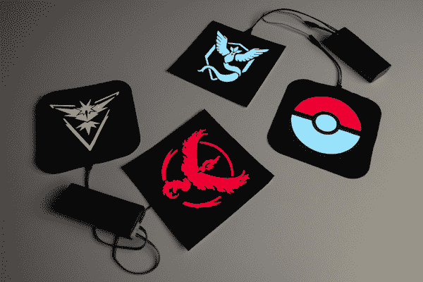

# 带 EL 面板的神奇宝贝 Go 补丁

> 原文：<https://learn.sparkfun.com/tutorials/pokmon-go-patches-with-el-panels>

## 介绍

这里有一个有趣的方式来展示你的团队在夜间狩猎神奇宝贝时的自豪感。在这个项目中，我们将在 EL 面板上添加布料模板，以创建发光的团队徽标和设计。请继续阅读，了解定制 EL 面板并将其贴在衣服、背包等物品上的更多技巧和诀窍。

[https://www.youtube.com/embed/KzEu5JSaAR0/?autohide=1&border=0&wmode=opaque&enablejsapi=1](https://www.youtube.com/embed/KzEu5JSaAR0/?autohide=1&border=0&wmode=opaque&enablejsapi=1)

### 推荐阅读

对于这个项目，我们将使用 EL 线，并将做一些焊接。下面是一些教程，请在开始之前查看:

*   [El 快速入门指南](https://www.sparkfun.com/tutorials/404)
*   [交流电与直流电(DC)](https://learn.sparkfun.com/tutorials/alternating-current-ac-vs-direct-current-dc?_ga=1.86293018.305709336.1443132280)
*   [使用焊线](https://learn.sparkfun.com/tutorials/working-with-wire?_ga=1.86293018.305709336.1443132280)
*   [如何焊接](https://learn.sparkfun.com/tutorials/how-to-solder---through-hole-soldering?_ga=1.61446574.305709336.1443132280)

## 材料

这里有一些完成这个项目的建议材料。列表显示了一个白色的 EL 面板，但是你可以随意选择颜色。SparkFun 搭载[红色](https://www.sparkfun.com/products/10801)和[蓝色](https://www.sparkfun.com/products/10798)面板；我们还将介绍使用照明凝胶或织物层创建自定义颜色(对于那些想要制作一些团队本能赃物或神奇宝贝球)。