# MPU-9250 连接指南

> 原文：<https://learn.sparkfun.com/tutorials/mpu-9250-hookup-guide>

## 介绍

[MPU-9250](https://www.sparkfun.com/products/13762) 是 InvenSense 最新的 9 轴 MEMS 传感器。这取代了流行的停产 [MPU-9150](https://www.sparkfun.com/products/retired/11486) 。与 MPU-9150 相比，InvenSense 降低了功耗，尺寸缩小了 44%。“陀螺仪噪声性能比竞争产品高 3 倍，罗盘满量程范围比竞争产品高 4 倍以上。”MPU-9250 使用 16 位模数转换器(ADC)对所有 9 个轴进行数字化处理。

[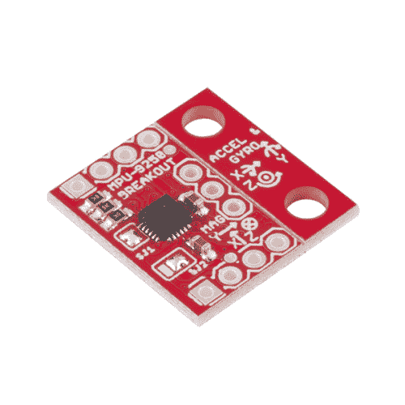](https://www.sparkfun.com/products/retired/13762) 

### [spark fun IMU Breakout-MPU-9250](https://www.sparkfun.com/products/retired/13762)

[Retired](https://learn.sparkfun.com/static/bubbles/ "Retired") SEN-13762

SparkFun MPU-9250 IMU 突破采用 InvenSense 最新的 9 轴 MEMS 传感器。

15 **Retired**[Favorited Favorite](# "Add to favorites") 36[Wish List](# "Add to wish list")

S**S**系统 **i** n **P** 封装( SiP )结合了两个芯片:MPU-6500，它包含一个三轴陀螺仪、一个三轴加速度计和一个三轴磁力计 AK8963。

### 推荐阅读

在开始之前，您可能会发现以下链接很有用:

*   [I ² C 协议](https://learn.sparkfun.com/tutorials/i2c)
*   [逻辑电平](https://learn.sparkfun.com/tutorials/logic-levels)
*   [安装 Arduino 库](https://learn.sparkfun.com/tutorials/installing-an-arduino-library)
*   [什么是上拉电阻？](https://learn.sparkfun.com/tutorials/pull-up-resistors)
*   [如何使用面包夹](https://learn.sparkfun.com/tutorials/how-to-use-a-breadboard)

## 主板概述

[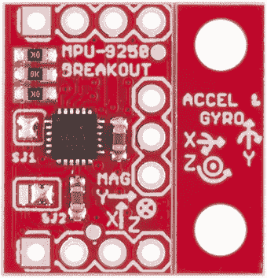PCB" />](https://cdn.sparkfun.com/assets/learn_tutorials/5/5/0/13762-01a.jpg)*The MPU-9250 Breakout as you will receive it*

该板设计得比我们的其他产品更小，以适应更小的项目。为了实现这一点， PTH 缠绕在 PCB 的边缘，三排三个或四个。最上面一行( [J1](https://cdn.sparkfun.com/datasheets/Sensors/IMU/SparkFun_MPU-9250_Breakout.pdf) )是获得 IMU 大部分功能所需的全部。其中包括 I ² C 和电源接口。如果空间真的很紧，人们可以用锯子小心地把其他所有的 PTH 锯掉。

第二个最有可能被使用的 PTH 组沿着底部被发现()。这包括地址引脚、中断引脚和 IO 电源，以便与更现代的 1.8V 处理器轻松接口。

第三排，不兼容试验板的那一排( [J2](https://cdn.sparkfun.com/datasheets/Sensors/IMU/SparkFun_MPU-9250_Breakout.pdf) )用于运行其他 I ² C 设备作为这个设备的从设备。对于这些连接的原型，将您的连接放在顶部，就像您使用 [Arduino Pro Mini](https://www.sparkfun.com/products/11114) 或类似产品一样。

### PTH 连接

下表总结了分线板上的所有电镀通孔( PTH )连接，按从左上角开始顺时针缠绕的顺序排列:

| Pin Label | 引脚功能 | 笔记 |
| --- | --- | --- |
| **SCL** | I ² C 串行时钟
SPI 串口时钟 | 100 或 400 kHz I ² C
最高 1 MHz SPI(某些情况下为 20 MHz) |
| **SDA** | I ² C 串行数据 | 也可用于 SPI 串行数据输入(SDI) |
| **VDD** | 电源 | +2.4V 至+3.6V |
| **GND** | 接地参考 | +0V |
| **AUXDA** | 接地参考 | I ² C 主串行数据，用于连接外部传感器 |
| **FSYNC** | 接地参考 | 帧同步数字输入。如果未使用，请连接到 GND。 |
| 至 | 接地参考 | I ² C 主串行时钟，用于连接外部传感器 |
| **INT** | 中断信号 | 中断数字输出(图腾柱或开漏) |
| **CS** | 芯片选择 | 片选(仅限 SPI 模式) |
| **AD0/
SDO** | 地址选择 | I ² C 从机地址 LSB (AD0):
低电平:0b1101000 ➫ 0x68
高电平:0b1101001 ➫ 0x69
SPI 串行数据输出(SDO) |
| **VDDIO** | I/O 引脚的电源 | +1.71V 至 VDD |

### 针织套衫

MPU-9250 分线器有两个焊接跳线， [SJ1](https://cdn.sparkfun.com/datasheets/Sensors/IMU/SparkFun_MPU-9250_Breakout.pdf) 和 [SJ2](https://cdn.sparkfun.com/datasheets/Sensors/IMU/SparkFun_MPU-9250_Breakout.pdf) 。

SJ1 预先焊接到短 V [DD] 和 V [DDIO] 上。这将电源数量减少到一个，无需外部跳线。如果需要为内核和 IO 提供不同的电压，请移除 SJ1 上的焊料。

SJ2 是一款双向跳线，经过预焊接，可将 AD0 接地。这会将 I ² C 地址设置为 0x68。这也使 AD0 的 PTH 断开并悬空。如果移动焊料以连接中间焊盘和左侧焊盘，那么 AD0 PTH 需要连接高电平或低电平以选择 I ² C 地址。

### 缩小尺寸

如前所述，这种突破的设计目标之一是使电路板变小。一些项目将需要安装孔，所以我们把它们扔在这块板上的一些 v-score 的右侧。由于电路板只有⅔宽，安装孔的左边没有足够的质量，所以没有太大的弯矩。

如果你打算使用试验板，或者用环氧树脂之类的东西将 IMU 安全地固定到一个项目上，安装孔可以被折断。如下图所示。我手头的钳子让这项工作变得非常简单。桌子的边缘也应该很好。

[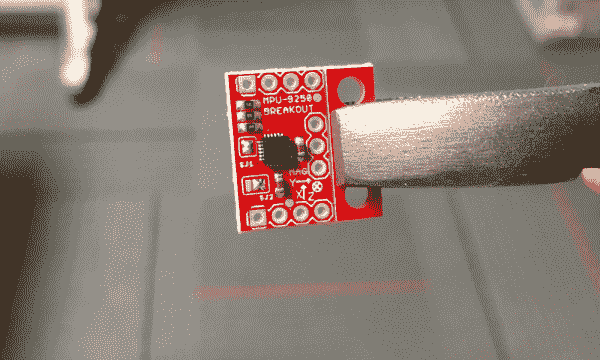](https://cdn.sparkfun.com/assets/learn_tutorials/5/5/0/breakingPCB.jpg)*Board was held with pliers and easily broken by pressing the other side*[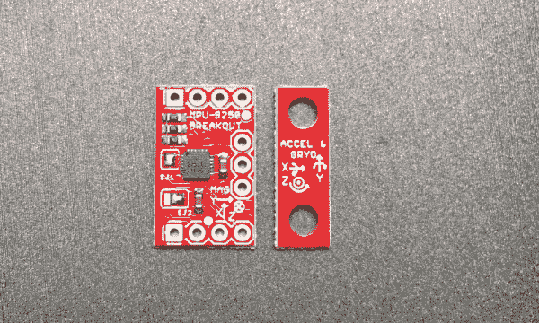](https://cdn.sparkfun.com/assets/learn_tutorials/5/5/0/splitPCB.jpg)*PCB snapped in two parts*

## 硬件连接

MPU-9250 分线板在 3.3 VDC 上运行，因此一个 3.3V USB 转 UART 桥，如 [SparkFun FTDI 基本分线点- 3.3V](https://www.sparkfun.com/products/9873) 或 [SparkFun Beefy 3 - FTDI 基本分线点](https://www.sparkfun.com/products/13746)可用于供电和桥接与微控制器的通信。在这种情况下，选择了[Arduino Pro Mini 328-3.3V/8 MHz](https://www.sparkfun.com/products/11114)，因此不需要逻辑电平转换。

[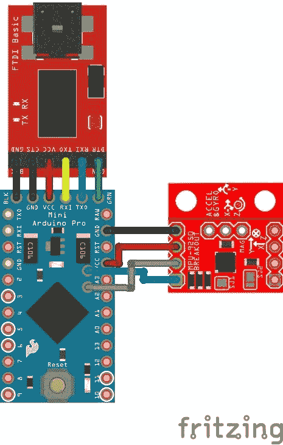](https://cdn.sparkfun.com/assets/learn_tutorials/5/5/0/MPU-9250_Hookup_Arduino_Fritzing.jpg)*Fritzing diagram of setup*

I ² C 通信只需要 4 个连接。

[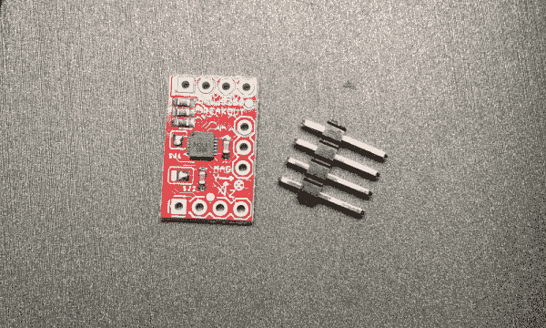](https://cdn.sparkfun.com/assets/learn_tutorials/5/5/0/PCBPreSolder.jpg)*Minimum parts for a breadboard compatible setup*

为了保证试验板的稳定性，还焊接了另外四个引脚:V [DDIO] 、AD0/SDO、 CS 和 INT。

[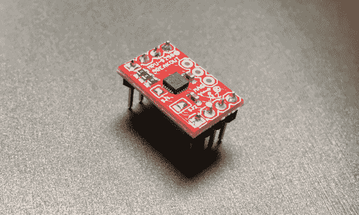](https://cdn.sparkfun.com/assets/learn_tutorials/5/5/0/solderedPCB.jpg)*PCB with breadboard compatible male headers soldered on*

这是用于测试的最终设置。

[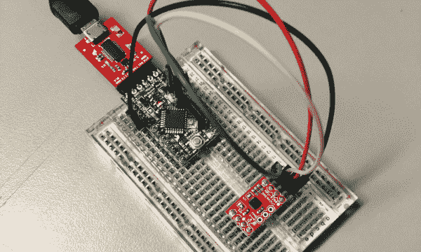](https://cdn.sparkfun.com/assets/learn_tutorials/5/5/0/inBreadboard.jpg)*Setup used for testing*

## 库和示例代码

**Note:** The example sketch and library are **HEAVILY** based on the work of Kris Winer. His original work can be found in his [GitHub repository](https://github.com/kriswiner/MPU-9250).

[kriswiner's MPU-9250 GitHub Repo](https://github.com/kriswiner/MPU-9250)
For more information on the algorithms Kris used for the **A**ttitude and **H**eading **R**eference **S**ystem (AHRS), check out the [open source IMU and AHRS algorithms](http://www.x-io.co.uk/open-source-imu-and-ahrs-algorithms/)

[Open Source IMU and AHRS Algorithms](http://www.x-io.co.uk/open-source-imu-and-ahrs-algorithms)

我们的版本主要是一个转换，使其遵循 Arduino 库格式。您可以通过搜索“ **SparkFun MPU-9250** ”来使用 Arduino IDE 的库管理器，详见[本教程](https://learn.sparkfun.com/tutorials/installing-an-arduino-library)。或者你可以通过下载 ***从 [GitHub 库](https://github.com/sparkfun/MPU-9250_Breakout_Arduino_Library)手动安装这个库。zip** 链接如下:

[SparkFun MPU-9250 Arduino Library (ZIP)](https://github.com/sparkfun/SparkFun_MPU-9250_Breakout_Arduino_Library/archive/master.zip)**Heads up!** The code provided in this tutorial compiles for Arduino v1.8.8\. However, if you are using an older version like v1.6.5, you will need to include the following at the top of the example code:

```
#include <Wire.h>
#include <SPI.h>
```

```
language:c
/* MPU9250 Basic Example Code
 by: Kris Winer
 date: April 1, 2014
 license: Beerware - Use this code however you'd like. If you
 find it useful you can buy me a beer some time.
 Modified by Brent Wilkins July 19, 2016

 Demonstrate basic MPU-9250 functionality including parameterizing the register
 addresses, initializing the sensor, getting properly scaled accelerometer,
 gyroscope, and magnetometer data out. Added display functions to allow display
 to on breadboard monitor. Addition of 9 DoF sensor fusion using open source
 Madgwick and Mahony filter algorithms. Sketch runs on the 3.3 V 8 MHz Pro Mini
 and the Teensy 3.1.

 SDA and SCL should have external pull-up resistors (to 3.3V).
 10k resistors are on the EMSENSR-9250 breakout board.

 Hardware setup:
 MPU9250 Breakout --------- Arduino
 VDD ---------------------- 3.3V
 VDDI --------------------- 3.3V
 SDA ----------------------- A4
 SCL ----------------------- A5
 GND ---------------------- GND
 */

#include "quaternionFilters.h"
#include "MPU9250.h"

#ifdef LCD
#include <Adafruit_GFX.h>
#include <Adafruit_PCD8544.h>

// Using NOKIA 5110 monochrome 84 x 48 pixel display
// pin 9 - Serial clock out (SCLK)
// pin 8 - Serial data out (DIN)
// pin 7 - Data/Command select (D/C)
// pin 5 - LCD chip select (CS)
// pin 6 - LCD reset (RST)
Adafruit_PCD8544 display = Adafruit_PCD8544(9, 8, 7, 5, 6);
#endif // LCD

#define AHRS false         // Set to false for basic data read
#define SerialDebug true  // Set to true to get Serial output for debugging

// Pin definitions
int intPin = 12;  // These can be changed, 2 and 3 are the Arduinos ext int pins
int myLed  = 13;  // Set up pin 13 led for toggling

#define I2Cclock 400000
#define I2Cport Wire
#define MPU9250_ADDRESS MPU9250_ADDRESS_AD0   // Use either this line or the next to select which I2C address your device is using
//#define MPU9250_ADDRESS MPU9250_ADDRESS_AD1

MPU9250 myIMU(MPU9250_ADDRESS, I2Cport, I2Cclock);

void setup()
{
  Wire.begin();
  // TWBR = 12;  // 400 kbit/sec I2C speed
  Serial.begin(38400);

  while(!Serial){};

  // Set up the interrupt pin, its set as active high, push-pull
  pinMode(intPin, INPUT);
  digitalWrite(intPin, LOW);
  pinMode(myLed, OUTPUT);
  digitalWrite(myLed, HIGH);

#ifdef LCD
  display.begin(); // Ini8ialize the display
  display.setContrast(58); // Set the contrast

  // Start device display with ID of sensor
  display.clearDisplay();
  display.setTextSize(2);
  display.setCursor(0,0); display.print("MPU9250");
  display.setTextSize(1);
  display.setCursor(0, 20); display.print("9-DOF 16-bit");
  display.setCursor(0, 30); display.print("motion sensor");
  display.setCursor(20,40); display.print("60 ug LSB");
  display.display();
  delay(1000);

  // Set up for data display
  display.setTextSize(1); // Set text size to normal, 2 is twice normal etc.
  display.setTextColor(BLACK); // Set pixel color; 1 on the monochrome screen
  display.clearDisplay();   // clears the screen and buffer
#endif // LCD

  // Read the WHO_AM_I register, this is a good test of communication
  byte c = myIMU.readByte(MPU9250_ADDRESS, WHO_AM_I_MPU9250);
  Serial.print(F("MPU9250 I AM 0x"));
  Serial.print(c, HEX);
  Serial.print(F(" I should be 0x"));
  Serial.println(0x71, HEX);

#ifdef LCD
  display.setCursor(20,0); display.print("MPU9250");
  display.setCursor(0,10); display.print("I AM");
  display.setCursor(0,20); display.print(c, HEX);
  display.setCursor(0,30); display.print("I Should Be");
  display.setCursor(0,40); display.print(0x71, HEX);
  display.display();
  delay(1000);
#endif // LCD

  if (c == 0x71) // WHO_AM_I should always be 0x71
  {
    Serial.println(F("MPU9250 is online..."));

    // Start by performing self test and reporting values
    myIMU.MPU9250SelfTest(myIMU.selfTest);
    Serial.print(F("x-axis self test: acceleration trim within : "));
    Serial.print(myIMU.selfTest[0],1); Serial.println("% of factory value");
    Serial.print(F("y-axis self test: acceleration trim within : "));
    Serial.print(myIMU.selfTest[1],1); Serial.println("% of factory value");
    Serial.print(F("z-axis self test: acceleration trim within : "));
    Serial.print(myIMU.selfTest[2],1); Serial.println("% of factory value");
    Serial.print(F("x-axis self test: gyration trim within : "));
    Serial.print(myIMU.selfTest[3],1); Serial.println("% of factory value");
    Serial.print(F("y-axis self test: gyration trim within : "));
    Serial.print(myIMU.selfTest[4],1); Serial.println("% of factory value");
    Serial.print(F("z-axis self test: gyration trim within : "));
    Serial.print(myIMU.selfTest[5],1); Serial.println("% of factory value");

    // Calibrate gyro and accelerometers, load biases in bias registers
    myIMU.calibrateMPU9250(myIMU.gyroBias, myIMU.accelBias);

#ifdef LCD
    display.clearDisplay();

    display.setCursor(0, 0); display.print("MPU9250 bias");
    display.setCursor(0, 8); display.print(" x   y   z  ");

    display.setCursor(0,  16); display.print((int)(1000*myIMU.accelBias[0]));
    display.setCursor(24, 16); display.print((int)(1000*myIMU.accelBias[1]));
    display.setCursor(48, 16); display.print((int)(1000*myIMU.accelBias[2]));
    display.setCursor(72, 16); display.print("mg");

    display.setCursor(0,  24); display.print(myIMU.gyroBias[0], 1);
    display.setCursor(24, 24); display.print(myIMU.gyroBias[1], 1);
    display.setCursor(48, 24); display.print(myIMU.gyroBias[2], 1);
    display.setCursor(66, 24); display.print("o/s");

    display.display();
    delay(1000);
#endif // LCD

    myIMU.initMPU9250();
    // Initialize device for active mode read of acclerometer, gyroscope, and
    // temperature
    Serial.println("MPU9250 initialized for active data mode....");

    // Read the WHO_AM_I register of the magnetometer, this is a good test of
    // communication
    byte d = myIMU.readByte(AK8963_ADDRESS, WHO_AM_I_AK8963);
    Serial.print("AK8963 ");
    Serial.print("I AM 0x");
    Serial.print(d, HEX);
    Serial.print(" I should be 0x");
    Serial.println(0x48, HEX);

#ifdef LCD
    display.clearDisplay();
    display.setCursor(20,0); display.print("AK8963");
    display.setCursor(0,10); display.print("I AM");
    display.setCursor(0,20); display.print(d, HEX);
    display.setCursor(0,30); display.print("I Should Be");
    display.setCursor(0,40); display.print(0x48, HEX);
    display.display();
    delay(1000);
#endif // LCD

    if (d != 0x48)
    {
      // Communication failed, stop here
      Serial.println(F("Communication failed, abort!"));
      Serial.flush();
      abort();
    }

    // Get magnetometer calibration from AK8963 ROM
    myIMU.initAK8963(myIMU.factoryMagCalibration);
    // Initialize device for active mode read of magnetometer
    Serial.println("AK8963 initialized for active data mode....");

    if (SerialDebug)
    {
      //  Serial.println("Calibration values: ");
      Serial.print("X-Axis factory sensitivity adjustment value ");
      Serial.println(myIMU.factoryMagCalibration[0], 2);
      Serial.print("Y-Axis factory sensitivity adjustment value ");
      Serial.println(myIMU.factoryMagCalibration[1], 2);
      Serial.print("Z-Axis factory sensitivity adjustment value ");
      Serial.println(myIMU.factoryMagCalibration[2], 2);
    }

#ifdef LCD
    display.clearDisplay();
    display.setCursor(20,0);  display.print("AK8963");
    display.setCursor(0,10);  display.print("ASAX ");
    display.setCursor(50,10); display.print(myIMU.factoryMagCalibration[0], 2);
    display.setCursor(0,20);  display.print("ASAY ");
    display.setCursor(50,20); display.print(myIMU.factoryMagCalibration[1], 2);
    display.setCursor(0,30);  display.print("ASAZ ");
    display.setCursor(50,30); display.print(myIMU.factoryMagCalibration[2], 2);
    display.display();
    delay(1000);
#endif // LCD

    // Get sensor resolutions, only need to do this once
    myIMU.getAres();
    myIMU.getGres();
    myIMU.getMres();

    // The next call delays for 4 seconds, and then records about 15 seconds of
    // data to calculate bias and scale.
//    myIMU.magCalMPU9250(myIMU.magBias, myIMU.magScale);
    Serial.println("AK8963 mag biases (mG)");
    Serial.println(myIMU.magBias[0]);
    Serial.println(myIMU.magBias[1]);
    Serial.println(myIMU.magBias[2]);

    Serial.println("AK8963 mag scale (mG)");
    Serial.println(myIMU.magScale[0]);
    Serial.println(myIMU.magScale[1]);
    Serial.println(myIMU.magScale[2]);
//    delay(2000); // Add delay to see results before serial spew of data

    if(SerialDebug)
    {
      Serial.println("Magnetometer:");
      Serial.print("X-Axis sensitivity adjustment value ");
      Serial.println(myIMU.factoryMagCalibration[0], 2);
      Serial.print("Y-Axis sensitivity adjustment value ");
      Serial.println(myIMU.factoryMagCalibration[1], 2);
      Serial.print("Z-Axis sensitivity adjustment value ");
      Serial.println(myIMU.factoryMagCalibration[2], 2);
    }

#ifdef LCD
    display.clearDisplay();
    display.setCursor(20,0); display.print("AK8963");
    display.setCursor(0,10); display.print("ASAX "); display.setCursor(50,10);
    display.print(myIMU.factoryMagCalibration[0], 2);
    display.setCursor(0,20); display.print("ASAY "); display.setCursor(50,20);
    display.print(myIMU.factoryMagCalibration[1], 2);
    display.setCursor(0,30); display.print("ASAZ "); display.setCursor(50,30);
    display.print(myIMU.factoryMagCalibration[2], 2);
    display.display();
    delay(1000);
#endif // LCD
  } // if (c == 0x71)
  else
  {
    Serial.print("Could not connect to MPU9250: 0x");
    Serial.println(c, HEX);

    // Communication failed, stop here
    Serial.println(F("Communication failed, abort!"));
    Serial.flush();
    abort();
  }
}

void loop()
{
  // If intPin goes high, all data registers have new data
  // On interrupt, check if data ready interrupt
  if (myIMU.readByte(MPU9250_ADDRESS, INT_STATUS) & 0x01)
  {
    myIMU.readAccelData(myIMU.accelCount);  // Read the x/y/z adc values

    // Now we'll calculate the accleration value into actual g's
    // This depends on scale being set
    myIMU.ax = (float)myIMU.accelCount[0] * myIMU.aRes; // - myIMU.accelBias[0];
    myIMU.ay = (float)myIMU.accelCount[1] * myIMU.aRes; // - myIMU.accelBias[1];
    myIMU.az = (float)myIMU.accelCount[2] * myIMU.aRes; // - myIMU.accelBias[2];

    myIMU.readGyroData(myIMU.gyroCount);  // Read the x/y/z adc values

    // Calculate the gyro value into actual degrees per second
    // This depends on scale being set
    myIMU.gx = (float)myIMU.gyroCount[0] * myIMU.gRes;
    myIMU.gy = (float)myIMU.gyroCount[1] * myIMU.gRes;
    myIMU.gz = (float)myIMU.gyroCount[2] * myIMU.gRes;

    myIMU.readMagData(myIMU.magCount);  // Read the x/y/z adc values

    // Calculate the magnetometer values in milliGauss
    // Include factory calibration per data sheet and user environmental
    // corrections
    // Get actual magnetometer value, this depends on scale being set
    myIMU.mx = (float)myIMU.magCount[0] * myIMU.mRes
               * myIMU.factoryMagCalibration[0] - myIMU.magBias[0];
    myIMU.my = (float)myIMU.magCount[1] * myIMU.mRes
               * myIMU.factoryMagCalibration[1] - myIMU.magBias[1];
    myIMU.mz = (float)myIMU.magCount[2] * myIMU.mRes
               * myIMU.factoryMagCalibration[2] - myIMU.magBias[2];
  } // if (readByte(MPU9250_ADDRESS, INT_STATUS) & 0x01)

  // Must be called before updating quaternions!
  myIMU.updateTime();

  // Sensors x (y)-axis of the accelerometer is aligned with the y (x)-axis of
  // the magnetometer; the magnetometer z-axis (+ down) is opposite to z-axis
  // (+ up) of accelerometer and gyro! We have to make some allowance for this
  // orientationmismatch in feeding the output to the quaternion filter. For the
  // MPU-9250, we have chosen a magnetic rotation that keeps the sensor forward
  // along the x-axis just like in the LSM9DS0 sensor. This rotation can be
  // modified to allow any convenient orientation convention. This is ok by
  // aircraft orientation standards! Pass gyro rate as rad/s
  MahonyQuaternionUpdate(myIMU.ax, myIMU.ay, myIMU.az, myIMU.gx * DEG_TO_RAD,
                         myIMU.gy * DEG_TO_RAD, myIMU.gz * DEG_TO_RAD, myIMU.my,
                         myIMU.mx, myIMU.mz, myIMU.deltat);

  if (!AHRS)
  {
    myIMU.delt_t = millis() - myIMU.count;
    if (myIMU.delt_t > 500)
    {
      if(SerialDebug)
      {
        // Print acceleration values in milligs!
        Serial.print("X-acceleration: "); Serial.print(1000 * myIMU.ax);
        Serial.print(" mg ");
        Serial.print("Y-acceleration: "); Serial.print(1000 * myIMU.ay);
        Serial.print(" mg ");
        Serial.print("Z-acceleration: "); Serial.print(1000 * myIMU.az);
        Serial.println(" mg ");

        // Print gyro values in degree/sec
        Serial.print("X-gyro rate: "); Serial.print(myIMU.gx, 3);
        Serial.print(" degrees/sec ");
        Serial.print("Y-gyro rate: "); Serial.print(myIMU.gy, 3);
        Serial.print(" degrees/sec ");
        Serial.print("Z-gyro rate: "); Serial.print(myIMU.gz, 3);
        Serial.println(" degrees/sec");

        // Print mag values in degree/sec
        Serial.print("X-mag field: "); Serial.print(myIMU.mx);
        Serial.print(" mG ");
        Serial.print("Y-mag field: "); Serial.print(myIMU.my);
        Serial.print(" mG ");
        Serial.print("Z-mag field: "); Serial.print(myIMU.mz);
        Serial.println(" mG");

        myIMU.tempCount = myIMU.readTempData();  // Read the adc values
        // Temperature in degrees Centigrade
        myIMU.temperature = ((float) myIMU.tempCount) / 333.87 + 21.0;
        // Print temperature in degrees Centigrade
        Serial.print("Temperature is ");  Serial.print(myIMU.temperature, 1);
        Serial.println(" degrees C");
      }

#ifdef LCD
      display.clearDisplay();
      display.setCursor(0, 0); display.print("MPU9250/AK8963");
      display.setCursor(0, 8); display.print(" x   y   z  ");

      display.setCursor(0,  16); display.print((int)(1000 * myIMU.ax));
      display.setCursor(24, 16); display.print((int)(1000 * myIMU.ay));
      display.setCursor(48, 16); display.print((int)(1000 * myIMU.az));
      display.setCursor(72, 16); display.print("mg");

      display.setCursor(0,  24); display.print((int)(myIMU.gx));
      display.setCursor(24, 24); display.print((int)(myIMU.gy));
      display.setCursor(48, 24); display.print((int)(myIMU.gz));
      display.setCursor(66, 24); display.print("o/s");

      display.setCursor(0,  32); display.print((int)(myIMU.mx));
      display.setCursor(24, 32); display.print((int)(myIMU.my));
      display.setCursor(48, 32); display.print((int)(myIMU.mz));
      display.setCursor(72, 32); display.print("mG");

      display.setCursor(0,  40); display.print("Gyro T ");
      display.setCursor(50,  40); display.print(myIMU.temperature, 1);
      display.print(" C");
      display.display();
#endif // LCD

      myIMU.count = millis();
      digitalWrite(myLed, !digitalRead(myLed));  // toggle led
    } // if (myIMU.delt_t > 500)
  } // if (!AHRS)
  else
  {
    // Serial print and/or display at 0.5 s rate independent of data rates
    myIMU.delt_t = millis() - myIMU.count;

    // update LCD once per half-second independent of read rate
    if (myIMU.delt_t > 500)
    {
      if(SerialDebug)
      {
        Serial.print("ax = ");  Serial.print((int)1000 * myIMU.ax);
        Serial.print(" ay = "); Serial.print((int)1000 * myIMU.ay);
        Serial.print(" az = "); Serial.print((int)1000 * myIMU.az);
        Serial.println(" mg");

        Serial.print("gx = ");  Serial.print(myIMU.gx, 2);
        Serial.print(" gy = "); Serial.print(myIMU.gy, 2);
        Serial.print(" gz = "); Serial.print(myIMU.gz, 2);
        Serial.println(" deg/s");

        Serial.print("mx = ");  Serial.print((int)myIMU.mx);
        Serial.print(" my = "); Serial.print((int)myIMU.my);
        Serial.print(" mz = "); Serial.print((int)myIMU.mz);
        Serial.println(" mG");

        Serial.print("q0 = ");  Serial.print(*getQ());
        Serial.print(" qx = "); Serial.print(*(getQ() + 1));
        Serial.print(" qy = "); Serial.print(*(getQ() + 2));
        Serial.print(" qz = "); Serial.println(*(getQ() + 3));
      }

// Define output variables from updated quaternion---these are Tait-Bryan
// angles, commonly used in aircraft orientation. In this coordinate system,
// the positive z-axis is down toward Earth. Yaw is the angle between Sensor
// x-axis and Earth magnetic North (or true North if corrected for local
// declination, looking down on the sensor positive yaw is counterclockwise.
// Pitch is angle between sensor x-axis and Earth ground plane, toward the
// Earth is positive, up toward the sky is negative. Roll is angle between
// sensor y-axis and Earth ground plane, y-axis up is positive roll. These
// arise from the definition of the homogeneous rotation matrix constructed
// from quaternions. Tait-Bryan angles as well as Euler angles are
// non-commutative; that is, the get the correct orientation the rotations
// must be applied in the correct order which for this configuration is yaw,
// pitch, and then roll.
// For more see
// http://en.wikipedia.org/wiki/Conversion_between_quaternions_and_Euler_angles
// which has additional links.
      myIMU.yaw   = atan2(2.0f * (*(getQ()+1) * *(getQ()+2) + *getQ()
                    * *(getQ()+3)), *getQ() * *getQ() + *(getQ()+1)
                    * *(getQ()+1) - *(getQ()+2) * *(getQ()+2) - *(getQ()+3)
                    * *(getQ()+3));
      myIMU.pitch = -asin(2.0f * (*(getQ()+1) * *(getQ()+3) - *getQ()
                    * *(getQ()+2)));
      myIMU.roll  = atan2(2.0f * (*getQ() * *(getQ()+1) + *(getQ()+2)
                    * *(getQ()+3)), *getQ() * *getQ() - *(getQ()+1)
                    * *(getQ()+1) - *(getQ()+2) * *(getQ()+2) + *(getQ()+3)
                    * *(getQ()+3));
      myIMU.pitch *= RAD_TO_DEG;
      myIMU.yaw   *= RAD_TO_DEG;

      // Declination of SparkFun Electronics (40°05'26.6"N 105°11'05.9"W) is
      //    8° 30' E  ± 0° 21' (or 8.5°) on 2016-07-19
      // - http://www.ngdc.noaa.gov/geomag-web/#declination
      myIMU.yaw  -= 8.5;
      myIMU.roll *= RAD_TO_DEG;

      if(SerialDebug)
      {
        Serial.print("Yaw, Pitch, Roll: ");
        Serial.print(myIMU.yaw, 2);
        Serial.print(", ");
        Serial.print(myIMU.pitch, 2);
        Serial.print(", ");
        Serial.println(myIMU.roll, 2);

        Serial.print("rate = ");
        Serial.print((float)myIMU.sumCount / myIMU.sum, 2);
        Serial.println(" Hz");
      }

#ifdef LCD
      display.clearDisplay();

      display.setCursor(0, 0); display.print(" x   y   z  ");

      display.setCursor(0,  8); display.print((int)(1000 * myIMU.ax));
      display.setCursor(24, 8); display.print((int)(1000 * myIMU.ay));
      display.setCursor(48, 8); display.print((int)(1000 * myIMU.az));
      display.setCursor(72, 8); display.print("mg");

      display.setCursor(0,  16); display.print((int)(myIMU.gx));
      display.setCursor(24, 16); display.print((int)(myIMU.gy));
      display.setCursor(48, 16); display.print((int)(myIMU.gz));
      display.setCursor(66, 16); display.print("o/s");

      display.setCursor(0,  24); display.print((int)(myIMU.mx));
      display.setCursor(24, 24); display.print((int)(myIMU.my));
      display.setCursor(48, 24); display.print((int)(myIMU.mz));
      display.setCursor(72, 24); display.print("mG");

      display.setCursor(0,  32); display.print((int)(myIMU.yaw));
      display.setCursor(24, 32); display.print((int)(myIMU.pitch));
      display.setCursor(48, 32); display.print((int)(myIMU.roll));
      display.setCursor(66, 32); display.print("ypr");

    // With these settings the filter is updating at a ~145 Hz rate using the
    // Madgwick scheme and >200 Hz using the Mahony scheme even though the
    // display refreshes at only 2 Hz. The filter update rate is determined
    // mostly by the mathematical steps in the respective algorithms, the
    // processor speed (8 MHz for the 3.3V Pro Mini), and the magnetometer ODR:
    // an ODR of 10 Hz for the magnetometer produce the above rates, maximum
    // magnetometer ODR of 100 Hz produces filter update rates of 36 - 145 and
    // ~38 Hz for the Madgwick and Mahony schemes, respectively. This is
    // presumably because the magnetometer read takes longer than the gyro or
    // accelerometer reads. This filter update rate should be fast enough to
    // maintain accurate platform orientation for stabilization control of a
    // fast-moving robot or quadcopter. Compare to the update rate of 200 Hz
    // produced by the on-board Digital Motion Processor of Invensense's MPU6050
    // 6 DoF and MPU9150 9DoF sensors. The 3.3 V 8 MHz Pro Mini is doing pretty
    // well!
      display.setCursor(0, 40); display.print("rt: ");
      display.print((float) myIMU.sumCount / myIMU.sum, 2);
      display.print(" Hz");
      display.display();
#endif // LCD

      myIMU.count = millis();
      myIMU.sumCount = 0;
      myIMU.sum = 0;
    } // if (myIMU.delt_t > 500)
  } // if (AHRS)
} 
```

*Full demo sketch*

在草图的开头可以找到一些配置。您可以在这里打开或关闭 AHRS 计算和串行调试:

```
language:c
#define AHRS true         // Set to false for basic data read
#define SerialDebug true  // Set to true to get Serial output for debugging 
```

*Some of the settings used by library exposed in the sketch*

### 磁偏角

AHRS 需要知道你的位置，以将磁北转换为真北。我使用了两种服务的组合来发现我们的办公室当前的衰落；谷歌和 NOAA 。这在你的国家可能是也可能不是理想的。

我首先需要的是办公室的经纬度。在谷歌地图[中搜索 spark fun](https://www.google.com/maps/place/Spark+Fun+Electronics/)会在我们的建筑上显示一个红色大头针。在前门附近单击，而不是在现有的 pin 上单击，会掉落一个新的 pin，这也会使卡片出现在底部中心。这张卡片的底部包含一个链接，链接到由新 pin 标记的纬度和经度的搜索。

[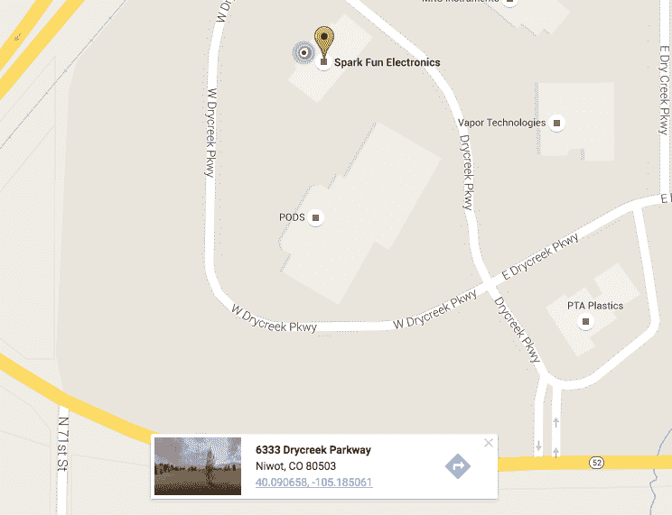](https://cdn.sparkfun.com/assets/learn_tutorials/5/5/0/droppedPin.png)*Google Maps showing the latitude and longitude of SparkFun Electronics*

点击卡片上的链接，会弹出一个页面，显示经度和纬度，分别在**d**e ecimal**d**e grees(DD)和 **d** egrees **m** 分钟**秒钟( DMS )表格中。我发现使用谷歌提供的 DMS 表格更容易避免符号错误，因为我不太熟悉 WGS 84 协调参考系统(CRS)。包含的基本方向很方便，是下一个工具所需要的。**

[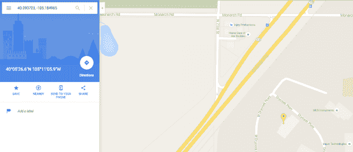](https://cdn.sparkfun.com/assets/learn_tutorials/5/5/0/Geolocation.png)*Search for SparkFun Electronics' coordinates*

第二个工具是 NOAA 网站上默认的[磁场计算器](http://www.ngdc.noaa.gov/geomag-web/#declination)。将上一步中找到的坐标输入到纬度和经度输入中。*计算*按钮将触发一个显示结果的对话框。如果结果出现在你期望的谷歌地图上，那么你用无线电输入选择了正确的方向！

[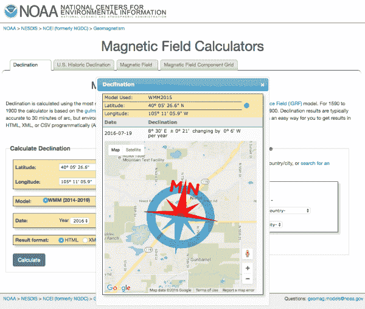](https://cdn.sparkfun.com/assets/learn_tutorials/5/5/0/Geomagnetism.png)*Magnetic declination of SparkFun Electronics' Colorado office*

请注意，这里的赤纬目前是东经 8 度 30 分。同时请注意，地图上的图像显示磁北位于真北以东。提供的 DM 格式需要转换为代码的 DD 格式。每度有 60 分钟，其中 30 分钟是一度的^(30)60，即 0.5。因此, DD 格式中的偏角为 8.5˚ E。用所需位置的偏角更新示例草图中第 391 行周围的代码。

```
language:c
myIMU.yaw   -= 8.5; 
```

### 你应该看到什么

该库在示例草图中保留了大量的数学知识，部分是为了使这类东西更容易访问。以下是演示草图输出的一个示例:

```
language:bash
MPU9250 I AM 71 I should be 71
MPU9250 is online...
x-axis self test: acceleration trim within : 2.4% of factory value
y-axis self test: acceleration trim within : 0.5% of factory value
z-axis self test: acceleration trim within : -0.0% of factory value
x-axis self test: gyration trim within : -0.3% of factory value
y-axis self test: gyration trim within : -1.0% of factory value
z-axis self test: gyration trim within : 0.5% of factory value
MPU9250 initialized for active data mode....
AK8963 I AM 48 I should be 48
AK8963 initialized for active data mode....
X-Axis sensitivity adjustment value 1.21
Y-Axis sensitivity adjustment value 1.22
Z-Axis sensitivity adjustment value 1.17
ax = -70.19 ay = -70.56 az = 931.03 mg
gx = 0.02 gy = 0.00 gz = 0.02 deg/s
mx = -189 my = 355 mz = 127 mG
q0 = 0.97 qx = -0.04 qy = 0.03 qz = 0.22
Yaw, Pitch, Roll: 16.45, 4.22, -4.14
rate = 140.15 Hz 
```

## 资源和更进一步

有关 MPU-9250 分线点的更多信息，请查看以下链接。

*   [MPU-9250 数据表](https://cdn.sparkfun.com/assets/learn_tutorials/5/5/0/MPU9250REV1.0.pdf)
*   [MPU-9250 寄存器图](https://cdn.sparkfun.com/assets/learn_tutorials/5/5/0/MPU-9250-Register-Map.pdf)
*   [MPU-9250 分线示意图](https://cdn.sparkfun.com/datasheets/Sensors/IMU/SparkFun_MPU-9250_Breakout.pdf)

MPU-9250 的许多高级功能只能通过同意一页许可条款并以开发者身份登录获得[嵌入式 MotionDriver 6.12](http://www.digikey.com/en/pdf/i/invensense/motion-driver-6-1-user-guide) 才能使用。这种方法对 Arduino 并不友好。通电时，需要将 3062 字节的未记录十六进制数加载到 MPU-9250 中。

```
#define DMP_CODE_SIZE           (3062)

static const unsigned char dmp_memory[DMP_CODE_SIZE] = {
    /* bank # 0 */
    0x00, 0x00, 0x70, 0x00, 0x00, 0x00, 0x00, 0x24, 0x00, 0x00, 0x00, 0x02, 0x00, 0x03, 0x00,
    0x00, 0x00, 0x65, 0x00, 0x54, 0xff, 0xef, 0x00, 0x00, 0xfa, 0x80, 0x00, 0x0b, 0x12, 0x82,... 
```

*Code snippet of MPU-9250 Embedded MotionDriver firmware*

这种二进制代码与驱动程序和任何处理传感器数据的代码结合在一起，很快就使更小的微控制器达到极限。如果您想进一步使用该产品，请随时注册并试用。

我们的一位客户分享了他关于[经济实惠的 9 自由度传感器融合](https://github.com/kriswiner/MPU-6050/wiki/Affordable-9-DoF-Sensor-Fusion)的精彩教程。查看更多关于传感器融合的信息。

更多 SparkFun 传感器的乐趣，查看这些其他伟大的教程。(这很有趣，对吗？？)

[](https://learn.sparkfun.com/tutorials/microview-digital-compass-) [### 显微视野数字罗盘](https://learn.sparkfun.com/tutorials/microview-digital-compass-) Build a portable digital compass using the SparkFun MicroView and the MAG3110 Magnetometer Breakout.[Favorited Favorite](# "Add to favorites") 5[](https://learn.sparkfun.com/tutorials/das-blinken-top-hat) [### 闪烁的顶部](https://learn.sparkfun.com/tutorials/das-blinken-top-hat) A top hat decked out with LED strips makes for a heck of a wedding gift.[Favorited Favorite](# "Add to favorites") 1[](https://learn.sparkfun.com/tutorials/mma8452q-accelerometer-breakout-hookup-guide) [### MMA8452Q 加速度计分线连接指南](https://learn.sparkfun.com/tutorials/mma8452q-accelerometer-breakout-hookup-guide) How to get started using the MMA8452Q 3-axis accelerometer -- a solid, digital, easy-to-use acceleration sensor.[Favorited Favorite](# "Add to favorites") 5[](https://learn.sparkfun.com/tutorials/sparkfun-inventors-kit-for-edison-experiment-guide) [### 爱迪生实验指南](https://learn.sparkfun.com/tutorials/sparkfun-inventors-kit-for-edison-experiment-guide) Learn how to harness the power of the Intel® Edison using JavaScript to post data to the cloud, control electronics from smartphones, and host web pages that interact with circuits.[Favorited Favorite](# "Add to favorites") 4

或者看看这篇博客:

[](https://www.sparkfun.com/news/2814 "November 5, 2018: A little shaky on IMU selection? This might smooth it out for you.") [### 据皮特称:IMU 101

November 5, 2018](https://www.sparkfun.com/news/2814 "November 5, 2018: A little shaky on IMU selection? This might smooth it out for you.")[Favorited Favorite](# "Add to favorites") 1