# 物联网的连通性

> 原文：<https://learn.sparkfun.com/tutorials/connectivity-of-the-internet-of-things>

## 物联网通信协议

[](https://cdn.sparkfun.com/assets/learn_tutorials/5/3/4/network-cables-494648_640.jpg)[Source](https://pixabay.com/)

连接，这是开发任何物联网(IoT)项目时要记住的主要事情之一。

当我着手任何新的物联网项目时，我脑海中浮现的最初几个问题是:

*   我希望它如何连接？
*   我有功率或范围限制吗？
*   我的数据速率是多少？
*   目前有哪些可用的网络基础设施？

我相信你们中的很多人在开始任何物联网项目时都会有同样的问题。有时，您知道要使用什么样的通信协议，但做些研究并确保它最适合您的应用并无大碍。

幸运的是，有许多网络基础设施和通信协议可用。不幸的是，它们太多了，可能会让你感到困惑。

在本教程中，我们将讨论所有(嗯，大部分)流行的**通信协议**，以及如何为您的项目选择最合适的协议。我们还将详细讨论每种方法的优缺点:

1.  [WiFi](#WiFi)
2.  [线程](#Thread)
3.  [ZigBee](#Zigbee)
4.  [蓝牙](#Bluetooth)
5.  [RFID 和 NFC](#NFC)

这不是连接类型的完整列表，但这些将帮助您开始大多数物联网项目。

## 网络拓扑结构

理解我们将要提到的各种网络协议非常重要。

网络拓扑是各种元素在任何网络中的排列方式。它从物理上或逻辑上定义了网络的结构。我喜欢把它看作是网络元素以及数据如何在其中移动的图形表示。

[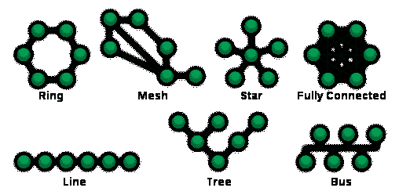](https://cdn.sparkfun.com/assets/learn_tutorials/5/3/4/508px-NetworkTopologies.svg.png)*Source:* [www.wikipedia.com](https://en.wikipedia.org/wiki/Network_topology)

同样，可能的网络拓扑有很多，但我们将把范围限制在处理基于物联网的通信协议时最常见的拓扑上:

*   点对点(P2P)
*   星星
*   网状物
*   混合物

#### 点对点


P2P 是最简单的拓扑，在两个端点之间有一个永久的链接。P2P 最简单的例子是纸杯线绳电话中的连接，你小时候可能会玩得很开心，其中两个节点(或端点)有一个专用的通信通道。使用交换技术，可以动态地建立 P2P。交换式 P2P 拓扑是早期电话的基础。

#### 星星

*Source:* [www.wikipedia.com](https://en.wikipedia.org/wiki/Network_topology)

在星型网络配置中，每个节点(端点)都连接到一台中央设备。节点不能直接相互通信；他们通过中央设备交流。中央设备充当服务器，而节点充当客户端。这是最常见的配置之一，也是最容易设置的配置之一。在不中断网络的情况下，添加和删除设备非常简单。这种网络的最大挑战是它具有单点故障(即中央计算机)；如果中央计算机出现故障，网络也会出现故障。

#### 网状物

->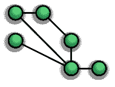<—

*Source:* [www.wikipedia.com](https://en.wikipedia.org/wiki/Network_topology)

网状网络是这样一种网络，其中每个节点都与其他节点相连。就网络链路而言，网状网络提供了大量冗余。即使一条链路出现故障，节点也可以使用另一条链路进行通信。这不是最常用的网络拓扑，原因很明显，建立冗余链路的成本会增加，网络的性质也很复杂。

#### 混合物

混合网络，顾名思义，是两个或多个基本网络拓扑的组合。它可以是星形网状网络或星形环形网络。事实证明，混合网络更加灵活可靠，因为它们集两者之长。但与此同时，它们的复杂性也增加了，这使得它们的设置成本高昂且难以管理。然而，当我们需要一个具有多种网络拓扑功能的网络时，混合网络有其优势。

## 基础设施和特设网络

既然我们今天要讨论无线网络，我们需要讨论无线网络运行的两种基本模式(也称为拓扑)。

-> **基础设施和自组织网络**<—

[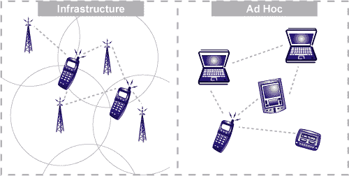](https://cdn.sparkfun.com/assets/learn_tutorials/5/3/4/network-infrastructure-vs-a.png)[Source](http://www.e-cartouche.ch/content_reg/cartouche/LBStech/en/html/LBStechU2_wlantopo.html)

**基础设施模式**是指无线网络需要物理结构来支持。这实质上意味着应该有一个媒介来处理网络功能，创建一个网络赖以生存的基础设施。

它执行这些典型的**功能**:

*   提供对其他网络的访问
*   促进
*   媒体访问控制

在基于基础设施的无线网络中，通信发生在无线节点(即网络中的端点，如您的计算机、电话等)之间。)和接入点(即路由器)。

同一网络上可以有多个接入点处理不同的无线节点。

基础设施网络的典型例子是蜂窝电话网络。他们必须有一套基础设施(即网络塔)才能运行。

何时使用**基础设施网络**:

*   如果您可以轻松添加更多接入点来扩大覆盖范围
*   如果您想建立一个更持久的网络
*   如果您需要连接到其他类型的网络(例如，如果需要，您可以连接到有线网络)

The one major downfall with infrastructure networks is that they are costly and time consuming to set up once. So, if you need your device to operate in remote areas where the infrastructure is weak or nonexistent, you cannot rely on infrastructure networks.

另一方面，Ad-hoc 无线网络不需要一套基础设施就能工作。在 ad-hoc 网络中，每个节点都可以与其他节点通信，因此不需要提供访问控制的接入点。

基础设施网络中的路由由接入点负责，而在自组织网络中，网络中的节点负责**路由**。

路由就是在源节点和目的节点之间寻找可能的最佳路径来传输数据。

ad-hoc 网络中的所有单个节点都维护一个路由表，其中包含关于其他节点的信息。由于自组织网络的本质是动态的，这导致了不断变化的路由表。需要注意的一点是，ad-hoc 网络本质上是非对称的，这意味着网络中两个节点之间的数据上传和下载路径可能不同。

ad-hoc 网络的一个典型示例是将两台或多台笔记本电脑(或其他支持的设备)直接连接在一起，而无需任何中央接入点，无论是无线连接还是电缆连接。

何时使用**自组织网络**:

*   如果您想要在两台设备之间快速建立点对点(P2P)网络
*   创建快速临时网络时
*   如果在该区域中没有建立网络基础设施(ad-hoc 是在这样的区域中可以使用的唯一网络模式)

As the routing is handled by each node in the network, this uses more resources; as the number of devices connected in an ad-hoc network increases, the network interference increases, which may lead to slower networks.

## 无线局域网（wireless fidelity 的缩写）

[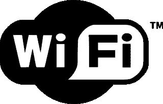](https://cdn.sparkfun.com/assets/learn_tutorials/5/3/4/WifI-logo.png)*Source:* [commons.wikimedia.org](https://commons.wikimedia.org/wiki/Main_Page)

WiFi 是最常见的通信协议之一。你可能无法想象没有它的生活。从我们舒适的家中到教室、咖啡馆和机场，我们随处可见 WiFi。WiFi 对我们生活的影响如此之大，以至于现在它成了一个好的 SSID 双关语的来源。 *( **有时**，多半是他们不好。)*

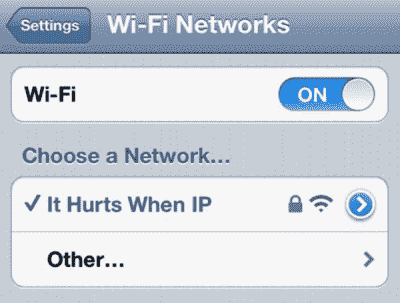

WiFi 本质上使用基础设施网络，它还支持基础设施模式下的点对点网络。

**无线通信的基础架构模式**提供了通往其他网络的桥梁，媒体访问控制和转发。网络处理功能放在接入点(路由器)中，客户端可以保持简单(在网络环境中)。

还有，WiFi 是星型网络。通信从无线节点(设备)到无线接入点(路由器或网络控制器)。

目前使用的标准是 2013 年发布的 802.11ac，尽管 2009 年发布的 802.11n 版本仍然流行。802.11ac 提供高达 800 兆位/秒的速度，而 802.11n 提供高达 150 兆位/秒的速度

您可能还见过使用更老的 802.11a/b/g 标准的设备，这些设备现在被称为传统设备。然而，由于 WiFi 具有向下兼容性，旧设备继续与具有新标准的设备一起工作。

您设备的 WiFi 范围取决于几个因素:

*   设备运行的 WiFi 标准。最新的标准显然比旧版本提供了更多的范围。
*   墙壁等物理障碍物在确定范围时也起着重要作用。因此，在开放空间，WiFi 网络的覆盖范围会比在有墙壁和其他干扰物体的封闭空间更大。

To address the weakness of WiFi over other low-powered technologies, an activity was started to standardize low-power WiFi (IEEE 802.11ah). The development of this protocol is being worked on, but its worldwide adaptation is doubtful. One of the main reasons is this is not backward compatible to the existing 802.11bgn networks.

#### WiFi 的优势:

*   WiFi 覆盖范围不错，可以穿透墙壁和其他障碍物。
*   在 WiFi 网络中添加和移除设备是小菜一碟。

#### WiFi 的缺点:

*   显然，缺少线路是以降低带宽为代价的。网络的无线电波可能会干扰其他设备。
*   最重要的是，无线网络的安全性比有线网络弱

现在想想你的项目，当我们想要在我们的设备(应该是 WiFi 兼容的)和互联网之间建立快速连接时，WiFi 是理想的。WiFi 的设计目标是保持其功耗有限，因此您也可以使用专用电池来运行您的项目。当您不太关心您的设备应该如何以及何时与您的服务器连接和通信，并且您正在寻找的只是无障碍的互联网连接时，应该使用 WiFi。

SparkFun 有很多基于 WiFi 的开发板可供你探索。

**这里有几个项目教程，指导您使用 WiFi 作为通信协议开发物联网项目:* *

[](https://learn.sparkfun.com/tutorials/sparkfun-inventors-kit-for-photon-experiment-guide) [### 光子实验指南](https://learn.sparkfun.com/tutorials/sparkfun-inventors-kit-for-photon-experiment-guide) Dive into the world of the Internet of Things with the SparkFun Inventor's Kit for Photon.[Favorited Favorite](# "Add to favorites") 14[](https://learn.sparkfun.com/tutorials/esp8266-wifi-shield-hookup-guide) [### ESP8266 WiFi 屏蔽连接指南](https://learn.sparkfun.com/tutorials/esp8266-wifi-shield-hookup-guide) Interface your Arduino with an ESP8266 to give it inexpensive access to your WiFi network and the Internet 9[](https://learn.sparkfun.com/tutorials/getting-started-with-the-sparkfun-blynk-board) [### SparkFun Blynk 板入门](https://learn.sparkfun.com/tutorials/getting-started-with-the-sparkfun-blynk-board) How to provision a Blynk Board - get it connected to Wi-Fi and Blynk, so you can start Blynking 10

## 线

Thread 是一种开放标准，用于可靠、经济、低功耗的无线 D2D(设备到设备)通信。它是专为互联家庭应用而设计的。

它产生于 2014 年，也就是线程组成立的时候。它现在有像谷歌、三星、高通和 ARM 这样的大组织来设计和开发线程协议。

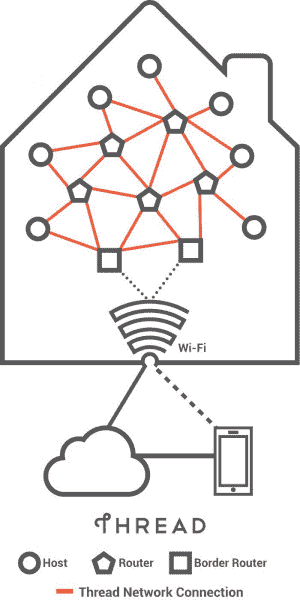*Source: thread.org*

[Nest](https://nest.com) 为其恒温器和 Nest Cam 产品使用螺纹网络。Thread 在设计时考虑到了家庭自动化领域——设备设置和连接简单、功耗低、电池续航时间长、安全可靠！

它基于标准 802.15.4 (6loWPAN)架构。Nest 最棒的地方在于，它是一个内置了互联网协议版本 6 (IPv6)的开放协议。

### 线程中的设备

线程协议定义了网络中三种主要类型的设备:

*   边界路由器
*   路由器和符合路由器条件的终端设备
*   休眠终端设备

[](https://cdn.sparkfun.com/assets/learn_tutorials/5/4/2/Screen_Shot_2016-06-21_at_12.47.52_pm.png)*[Source: Thread Stack Fundamentals 2015](https://www.silabs.com/SiteDocs/white-papers/Thread-Stack-Fundamentals.pdf)*

#### 边界路由器

Thread 有一个系统，该系统具有一种称为边界路由器的特殊类型的路由器，它提供从 802.15.4 网络到不同物理层上的相邻网络的连接(例如，WiFi、以太网)。如果一个边界路由器发生故障，网络中的另一个路由器可以承担边界路由器的角色，确保线程协议的健壮性。

#### 路由器

顾名思义，路由器为网络设备提供路由服务。它们用于向网络交付新设备。一般来说，路由器总是活跃的，但是它们可以降级成为 REEDs(路由器合格的终端设备)。这些设备不用于线程网络中的路由或数据传输，而是作为冗余端点，在需要时可以调用这些设备来承担路由器的角色。

#### 休眠终端设备

这些是线程网络的端点，也称为主机设备。主机设备是独立的 IP 寻址功能设备，如恒温器、安全摄像机、加热器等。这些设备也可以被称为睡眠子设备或睡眠节点。直接与休眠设备配对的路由器称为父路由器。休眠设备(端点)大部分时间处于休眠模式，仅在唤醒时传输数据。它们仅通过父设备进行通信(例如，Nest 恒温器是一个休眠的终端设备)。

##### 设备的典型发送周期可能是:

*   从睡眠模式中唤醒。
*   执行任何必要的启动和无线电初始化。
*   进入接收模式，检查是否可以传输。
*   进入传输模式。
*   传输数据。
*   获得适用的确认。
*   睡觉。

与使用基础设施模式的 WiFi 不同，Thread 使用网络的 ad-hoc 模式。

#### 优势:

*   基于 IP，因此更容易连接到其他基于 IP 的网络。由于它基于 802.15.4，ZigBee 和 6loWPAN 等现有设备可以很容易地迁移到线程。
*   体系结构没有单点故障，因为它能够根据网络条件进行调整。它支持全网状网络拓扑。
*   低功耗运行，因为它提供了睡眠设备
*   安全的

注意:尽管在线程网络中没有体系结构的单点故障，但是由于糟糕的网络设计，可能存在单点故障。

#### 缺点:

*   因为它的复杂性，不是一个非常适合自己动手做的协议。瞄准高容量的家庭自动化市场。
*   仍然是一个非常新的网络协议，需要时间来建立自己

由于[硅实验室](http://www.silabs.com/products/wireless/mesh-networking/thread/Pages/thread.aspx)和[恩智浦](http://www.nxp.com/pages/thread-networking-protocol:THREAD-NETWORKING-PROTOCOL)是线程联盟的一部分，他们正在推动支持线程协议的开发板。

## ZigBee

[](https://cdn.sparkfun.com/assets/learn_tutorials/5/3/4/Zigbeelogo.png)*Source: [Zigbee.org](http://www.zigbee.org/)*

Zigbee 和 thread 一样，是 200 多家公司的联盟，他们合作开发了一个强大而简单的家庭和工业自动化网络。

### Zigbee 设计目标

Zigbee 的唯一目的是服务于家庭和工业自动化，因此设计目标也是根据这一目的而设定的:

*   低功率
*   安全性
*   与使用 ISM 频段的其他无线电网络共存。
*   标准化
*   低成本

与 Thread 类似，ZigBee 建立在 IEEE 802.15.4 标准之上。

ZigbEE 规范填补了 802.15.4 留下的空白，创建了真正的网状网络，但也支持其他拓扑结构，如星形和树形。

[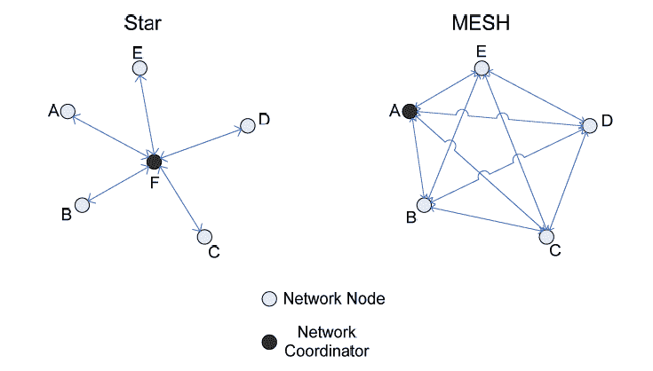](https://cdn.sparkfun.com/assets/learn_tutorials/5/3/4/Zigbee-topologies.png)*Source - AMX - Zigbee White Paper*

### Zigbee 网络中的设备

Zigbee 协议定义了三种类型的设备:

*   Zigbee 协调器
*   Zigbee 路由器
*   Zigbee 终端设备(节点)

#### Zigbee 协调器

协调器是 Zigbee 网络的大脑，它将设备委托给网络，存储安全密钥，并桥接其他网络。任何网络中只有一个 Zigbee 协调器。

#### Zigbee 路由器

Zigbee 网络可能有几个路由器作为中间路由器或在网络内传输数据。

#### Zigbee 终端设备

终端设备只能与父节点(路由器或协调器)对话。它不能直接与其它终端设备通信。与 Thread 类似，这些设备在设计时考虑到它们大部分时间都处于睡眠模式，只有在唤醒时才会向父设备传输数据。

ZigBee 假定大多数无线电使用的 2.4GHz 无线电频带中的 11-26 个信道。如果两个网络的信道分配适当，ZigBee 信道已经被特别隔开，以便与 Wi-Fi 信道共存而没有干扰。

[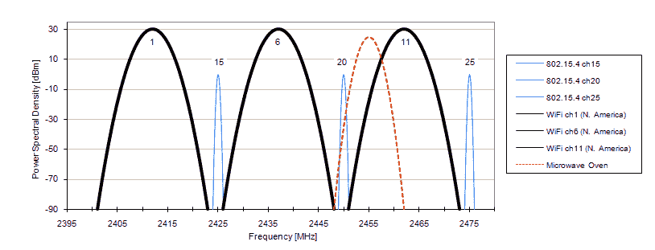](https://cdn.sparkfun.com/assets/learn_tutorials/5/3/4/ZigbeeWifi_Coexistence.gif)*Source - eetimes.com*

注:通过将 Wi-Fi 信道设置为 1、6、11，将 Zigbee 信道设置为 15、20、25，可以实现两者的最佳频谱使用。

#### Zigbee vs 线程

当 Thread 在 2014 年问世时，ZigBee 标准面临着巨大的挑战。ZigBee 联盟随后推出了他们最新的协议，名为“ZigBee 3.0 T1”。他们试图解决 thread 和其他网络在家庭自动化领域更好的替代方案的问题。

[](https://cdn.sparkfun.com/assets/learn_tutorials/5/3/4/ZigBee-3.01.png)

ZigBee 3.0 提供了额外的功能，如 ZigBee RF4CE 和 ZigBee Green Power。

开发 ZigBee RF4CE -是为了用无线电遥控取代红外遥控。这是为了制作一个通用的遥控器，可以用来控制你的遥控器，以及灯，灯等。这也消除了红外瞄准射击的局限性。

**ZigBee 绿色电力** -作为超低电力标准开发，以支持能量收集设备。它通过管理网络来确保非常低的功耗，这样这些设备可以在大部分时间关闭。

将 ZigBee 置于线程之后的一个主要特性是 IP 兼容性。另一方面，ZigBee 3.0 完全兼容 IP。因此，您现在可以通过路由器将 ZigBee 设备连接到互联网。

优点:与 thread 非常相似

缺点:距离短，数据速度低

Digi International 的 Xbee 是支持 Zigbee 协议的无线电通信模块。它们也可以加载固件来支持 Zigbee Pro 和 DigiMesh。

要快速体验 Xbee，您可以查看以下教程。

[](https://learn.sparkfun.com/tutorials/xbee-shield-hookup-guide) [### XBee 屏蔽连接指南](https://learn.sparkfun.com/tutorials/xbee-shield-hookup-guide) How to get started with an XBee Shield and Explorer. Create a remote-control Arduino 13[](https://learn.sparkfun.com/tutorials/exploring-xbees-and-xctu) [### 探索 XBees 和 XCTU](https://learn.sparkfun.com/tutorials/exploring-xbees-and-xctu) How to set up an XBee using your computer, the X-CTU software, and an XBee Explorer interface board.[Favorited Favorite](# "Add to favorites") 18[](https://learn.sparkfun.com/tutorials/teensy-xbee-adapter-hookup-guide) [### Teensy XBee 适配器连接指南](https://learn.sparkfun.com/tutorials/teensy-xbee-adapter-hookup-guide) Getting started with the Teensy 3.1 / Teensy 3.2 and XBee. Establishing a serial link.[Favorited Favorite](# "Add to favorites") 3

## 蓝牙

[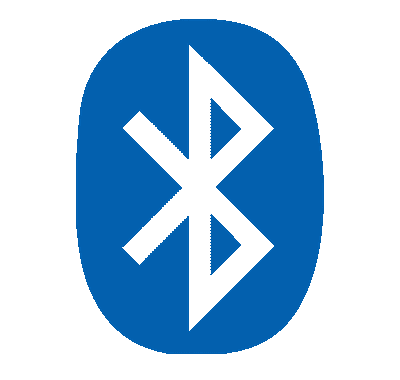](https://cdn.sparkfun.com/assets/learn_tutorials/5/3/4/Bluetooth-logo.png)*Source: [wikimedia.org](https://www.wikimedia.org/)*

在这里，我们将讨论 evergreen 蓝牙经典无线电，以及新的和即将推出的蓝牙低能耗(BLE)，它是专门围绕物联网中使用的低功耗设备设计的。

我们的讨论将更集中在 BLE 部分。对于蓝牙经典的一般概述，请查看这个涵盖该技术基础的精彩教程:

[](https://learn.sparkfun.com/tutorials/bluetooth-basics) [### 蓝牙基础知识](https://learn.sparkfun.com/tutorials/bluetooth-basics) An overview of the Bluetooth wireless technology.[Favorited Favorite](# "Add to favorites") 42Like other radio technologies. Bluetooth uses the 2.4GHz spectrum in the ISM band. It has a range from 10m up to 100m (at higher transmit powers, and that means higher power consumption!). Bluetooth is again an ad-hoc type of network and provides point to point (P2P) connections.

Bluetooth Classic 在一个微微网中最多支持一个主机和七个从机。它还遵循星型网络拓扑，这意味着其他外设无法相互通信。

需要注意的几个关键问题是:一个微微网中的主节点不能是另一个微微网中的主节点，但是一个微微网中的主节点可以是另一个微微网中的从节点。蓝牙 Classic 可用于传输音频、数据，但不能传输视频。

我们现在将集中讨论 BLE 协议以及蓝牙是如何因为这项技术而发展的。

#### 蓝牙的三种风格

蓝牙低能耗与蓝牙经典无线电完全不同。它采用了新的协议栈和新的 profile 架构，能够在低功耗电源(如纽扣电池)上运行。

我们需要明白，这种无线电技术并没有接管或取代现有的蓝牙经典无线电。这导致了一种不同风格的蓝牙，它们相互关联。

[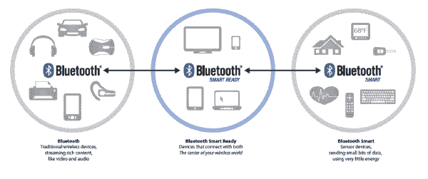](https://cdn.sparkfun.com/assets/learn_tutorials/5/3/4/bluetooth-flavors.png)*[Source: Bluetooth SIG](https://www.bluetooth.com/)*

蓝牙技术可以分为三种类型的设备:

*   **蓝牙经典** -传统蓝牙具有更高的吞吐量，主要用于无线音频和文件传输。“经典”收音机支持蓝牙智能。
*   **蓝牙智能** -蓝牙低能耗被称为蓝牙智能，仅传输状态信息。它是专门为低占空比应用设计的(即，无线电有效地开启一小段时间)。蓝牙智能设备无法与蓝牙经典设备通信。
*   **蓝牙智能就绪** -这些设备本质上是“中枢”设备，如电脑、智能手机等。它们支持“经典”和“智能”设备，就像我们的智能手机可以连接到蓝牙扬声器来传输音频，也可以与健身追踪器通信。

#### 经典与低能耗

BLE 使用与其它无线协议相同的 2.4GHz ISM 频段。与 Bluetooth Classic 的 79，1MHz 宽通道相比，Bluetooth Low Energy 只有 40 个通道，宽度为 2MHz。

[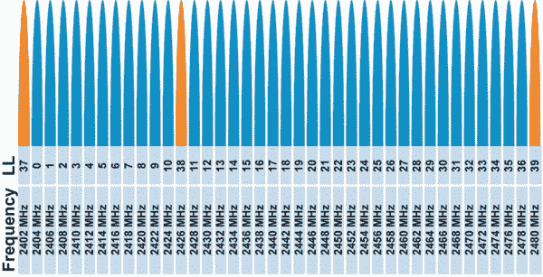](https://cdn.sparkfun.com/assets/learn_tutorials/5/3/4/channel-ble.jpg)*[Source](http://www.connectblue.com/press/articles/shaping-the-wireless-future-with-low-energy-applications-and-systems/)*

BLE 还使用 1Mbps GFSK 调制，这使其比蓝牙经典更高的范围。

BLE 使用自适应跳频算法在可用信道之间跳跃，其中仅使用可用频率的子集，并且它可以快速从由于坏信道导致的分组丢失中恢复。这种技术确保了无线电中较低的能量消耗。蓝牙 Classic 使用伪随机 hope 序列，每秒改变传输频率 1600 次。

需要注意的一点是，BLE 允许多达 128 个设备连接到一个主设备，而经典只有 7 个。

**BLE compared with other wireless protocols in respect to wireless application**[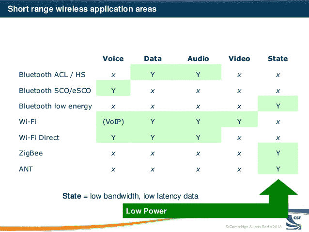](https://cdn.sparkfun.com/assets/learn_tutorials/5/3/4/bluetooth-reinvented-smart-connectivity-in-consumer-devices-bluetooth-low-energy-standard-and-its-applications-3-638.jpg)*Source: [Cambridge Silicon Radio](http://www.csr.com/)*

#### BLE Stack

BLE 堆栈是专为低功耗应用而设计的。

[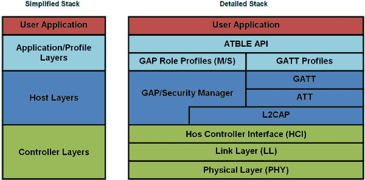](https://cdn.sparkfun.com/assets/learn_tutorials/5/3/4/nBlue_Protocol_Stack_clear.gif)*Source: [blueradios.com](http://blueradios.com/)*

BLE 的核心在于 GAP 和 GATT 简介。我们今天的讨论将仅限于这些。

可以将通用访问配置文件(GAP)和通用属性配置文件(GATT)看作是我们与周围人交流和联网的基本方式。当你遇见某人时，你可能会自我介绍并提供关于你自己的基本信息。如果你想和那个人联系，你可以交换其他个人信息，比如电话号码或电子邮件地址，以便能够交流。当你再次见到那个人时，你不再需要表明身份或宣布自己，并且可以开始分享其他信息。GAP 是最初的见面阶段，你介绍自己，GATT 是你与对方建立联系并开始交流的阶段。

#### 通用访问配置文件(GAP)

该间隙定义了 BLE 设备可以用来与外界通信的机制。

**广告**

在这个阶段，设备可以处于两个阶段中的任何一个:

*   **广播阶段**:设备广播设备名称、信号强度、制造细节等公共广告数据包。
*   **观察阶段**:设备监听广告数据包。设备之间仍然没有连接。可以有一个以上的设备观察同一个广告客户。

在建立连接的过程中，设备还承担角色，即:

*   **外设**:广播设备承担外设的角色，形成与设备的伪连接，响应中央设备的连接请求，在连接前向其提供更多信息。

*   **中央**:当发起到广告设备的连接时，观察者承担中央设备的角色。它也可以被视为主机，可以同时连接到多个外设。

一旦在外围设备和中央设备之间建立了连接，就不再发送广告数据包。现在必须利用关贸总协定的概况进行双向交流。

#### 通用属性(GATT)配置文件

GATT 配置文件定义了两台 BLE 设备使用属性(如服务和特征)相互通信的方式，这些属性在属性协议中定义。

与 GAP 类似，通信设备承担某些已定义的角色:

*   **客户端**:通常情况下，中心设备承担客户端的角色。它通常向 GATT 服务器发送一个请求。它可以读取和/或写入服务器中的属性。
*   **服务器**:通常情况下，外设承担服务器的角色。它被称为服务器，因为它存储这些属性。服务器响应客户端请求，并向其发送所需的属性。

外围设备或中央设备都可以充当服务器或客户端，这取决于数据流。

当建立连接时，中央设备和外围设备决定“连接间隔”，即不同连接事件之间的时间。

更多信息可在以下列出的蓝牙 SIG 页面上找到:

*   [蓝牙低能耗内核规格](https://www.bluetooth.com/specifications/adopted-specifications)
*   [蓝牙低能耗开发者资源](https://developer.bluetooth.org/TechnologyOverview/Pages/BLE.aspx)

您可以浏览以下关于蓝牙和 BLE 的教程和博客帖子，以便更好地了解如何将它们直接用于您基于蓝牙的物联网项目。

[](https://www.sparkfun.com/news/2017 "January 21, 2016: An overview of Espressif's sequel to the ESP8266 - a new WiFi/Bluetooth-enabled system-on-chip, with a massive GPIO count.") [### enginursday:ESP32 的第一印象

January 21, 2016](https://www.sparkfun.com/news/2017 "January 21, 2016: An overview of Espressif's sequel to the ESP8266 - a new WiFi/Bluetooth-enabled system-on-chip, with a massive GPIO count.")[Favorited Favorite](# "Add to favorites") 3[](https://www.sparkfun.com/news/2062 "March 29, 2016: Using the Simblee LilyPad to make a fitness bracer that hooks up to your phone!") [### 万物之灵:第 6 集-蓝牙健身护腕

March 29, 2016](https://www.sparkfun.com/news/2062 "March 29, 2016: Using the Simblee LilyPad to make a fitness bracer that hooks up to your phone!")[Favorited Favorite](# "Add to favorites") 1[](https://learn.sparkfun.com/tutorials/rn-52-bluetooth-hookup-guide) [### RN-52 蓝牙连接指南](https://learn.sparkfun.com/tutorials/rn-52-bluetooth-hookup-guide) A hookup guide to get you started with the RN-52 Audio Bluetooth Module Breakout Board.[Favorited Favorite](# "Add to favorites") 16[](https://learn.sparkfun.com/tutorials/understanding-the-bc127-bluetooth-module) [### 了解 BC127 蓝牙模块](https://learn.sparkfun.com/tutorials/understanding-the-bc127-bluetooth-module) SparkFun has two boards using the BC127; here's what you need to know to use them.[Favorited Favorite](# "Add to favorites") 7

## RFID 和 NFC

## 射频识别（Radio Frequency Identification）

[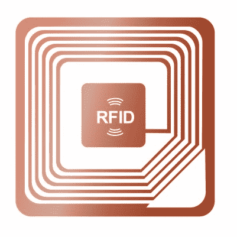](https://cdn.sparkfun.com/assets/learn_tutorials/5/3/4/14757828_s.jpg)

射频识别(RFID)是一种用于无线跟踪和识别物体的通信方法。

尽管看起来很复杂，但它是最简单的交流方式之一，这也是它无处不在却又不为人知的原因。它不仅用于跟踪全球范围内的消费品，还用于跟踪收费车辆。医院用它来追踪病人，农民用它来追踪他们的牛。RFID 技术已经成为我们生活的一部分，我们可能甚至没有意识到它对我们的影响。

简单地说，我们可以认为 RFID 标签是通用产品代码或条形码的近似替代品。但是他们更有效率。

RFID 标签具有超过传统条形码的读写能力。它们可以更新、更改和锁定。

RFID 技术包括标签和阅读器。

### 标签

标签是 RFID 系统中的端点。它们存储身份信息以及标签用途所需的其他信息。有两种类型的标签:

*   **有源标签:**这些标签有某种板载电源，通常是电池，这意味着它们可以传输更强的信号，因此有更大的范围。这种类型的标签可以周期性地发送信号，而与阅读器无关。

*   **无源标签:**这些标签没有任何内部电源，在阅读器附近被激活。你的地铁或公共汽车通行证通常是一个无源标签，当你把它接触到阅读器时就会被激活。这些标签收集阅读器发射的无线电能量。

** Inside of an active RFID tag -- note the on-board battery**[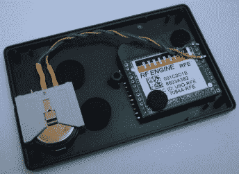](https://cdn.sparkfun.com/assets/learn_tutorials/5/3/4/tag_nocover_344x251.jpg)*[Source](http://www.ns-tech.co.uk/blog/2010/02/active-rfid-tracking-system/)***A passive tag -- note the small size of the tag in comparison**[](https://cdn.sparkfun.com/assets/learn_tutorials/5/3/4/RFID-Passive-Tag.jpg)*Source: http://www.harlandsimon.co.uk*

无源 RFID 标签主要工作在三个频率范围:

```
* Low Frequency (LF) 125 to 134 kHz
* High Frequency (HF) 13.56 MHz
* Ultra High Frequency (UHF) 856 MHz to 960 MHz 
```

### 读者

读取器具有与 RFID 标签相似的结构。它们有一个天线来接收和发送信号到/从标签。它们可以是电池供电的或者插在墙上的插座上，因为当标签靠近读取器时，读取器需要强 RF 信号来激活标签(用于无源)。读取器连接到读取器控制器，读取器控制器管理由读取器读取的信息。读取器也可以根据应用来写入或更新标签。例如，地铁站中的阅读器处于入口点。当乘客将卡(标签)放在读卡器上时，读卡器读取卡中的可用金额，并允许用户进入。在乘客出站时，它会计算票价并更新卡上的金额。

RFID 标签可以有三个主要组件:

*   集成电路(IC ),用于存储身份信息、处理身份信息以及调制/解调 RF 信号
*   接收和发送无线电信号的天线
*   有源标签的电源(电池)

阅读器和标签一起构成了一个 RFID 系统。

**Basic RFID System**[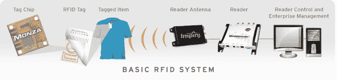](https://cdn.sparkfun.com/assets/learn_tutorials/5/3/4/basic-rfid-system.png)*Source: [www.impinj.com](http://www.impinj.com/)*

上图显示了一个非常基本的 RFID 系统。标签芯片是 RFID 标签中的集成电路。该 IC 向标签提供计算、存储和扩展功能。标签芯片具有天线以接收或发送被标记物品的信息。接收器的天线接收 RF 信号，并且还可能向无源 RFID 标签提供激励。读取信息被馈送到读取器控制和管理软件。

## 国家足球联盟

[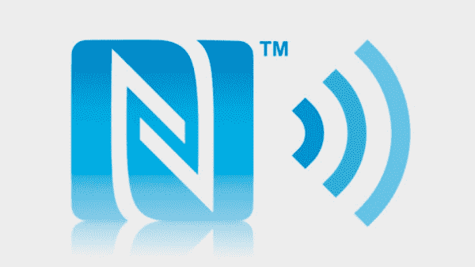](https://cdn.sparkfun.com/assets/learn_tutorials/5/3/4/nfc-970-80.jpg)*Source: [techradar.com](http://www.techradar.com/us)*

近场通信(NFC)是一种基于射频的通信协议。它是 RFID 协议的一个子集，这就是它与 RFID 相似但又有显著差异的原因。NFC 也已成为一项非常受欢迎的技术，如今 10 部智能手机中有 9 部配备了 NFC 功能。这使得 Apple Pay 和谷歌钱包等非接触式支付成为可能。

NFC 智能手机通过轻按两个设备来将信息从一个智能手机传递到另一个智能手机，这将共享联系信息或照片等数据变成了一项简单的任务。像 Android Beam 这样的应用程序促进了这一点，而在苹果手机中，NFC 目前只能用于 Apple Pay。

与宝马等汽车制造商合作，NFC 被用于在支持 NFC 的汽车钥匙中打开车门。您可能还遇到过广告和营销内容，要求您点击或挥动支持 NFC 的智能手机来下载应用程序或获取有关产品的更多信息。

NFC 是为非常短距离的通信(几厘米)而设计的。它是最节能的通信协议之一。NFC 还工作在 13.56 MHz 频段，高频 RFID 也使用该频段。因此，NFC 也可以读取 HF RFID 标签。

NFC 有两种类型的设备(需要注意的一点是，在 NFC 中，设备可以充当标签或读取器):

*   **发起方:**发起通信的设备被标记为发起方。它会主动产生射频场，为被动目标提供能量。
*   **目标:**这是从发起方接收信息的设备。对于点对点通信，目标可以是被动的(在简单 NFC 标签的情况下)，也可以是主动的，例如在智能手机中。

### RFID 与 NFC

由于这两种通信协议之间固有的相似性，我们经常会问自己技术上的差异。

[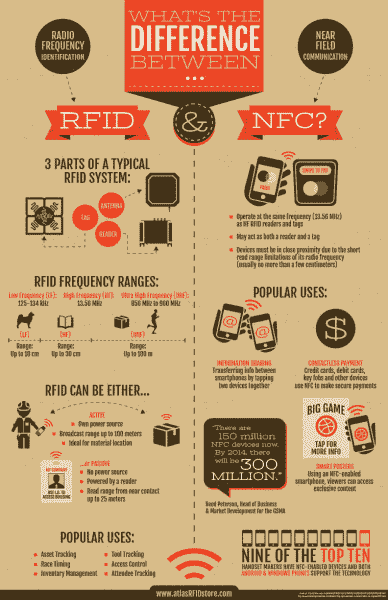](https://cdn.sparkfun.com/assets/learn_tutorials/5/3/4/RFID_vs_NFC.jpg)*Source: [RFIDinsider](http://blog.atlasrfidstore.com/rfid-vs-nfc)*

由于 NFC 和 RFID 都是无处不在的技术，用于我们周围的大量对象和设备，因此它们都是物联网的有用协议。这些协议为我们周围的各种对象提供了一座桥梁，不仅在标签和阅读器之间进行通信，而且将它们全部连接到互联网。

以下是一些教程和博客文章的链接，您可能想查看这些链接以了解更多信息:

[](https://www.sparkfun.com/news/227 "February 5, 2009: We try to stuff our RFID tag into a Car fob. It didn't work out so good. And we've got new button pad controllers, 10Hz GPS, Arduino XBee shield, new dual-axis gyros, a Nordic RF serial interface board, and a much more!") [### 电路弯曲 RFID

February 5, 2009](https://www.sparkfun.com/news/227 "February 5, 2009: We try to stuff our RFID tag into a Car fob. It didn't work out so good. And we've got new button pad controllers, 10Hz GPS, Arduino XBee shield, new dual-axis gyros, a Nordic RF serial interface board, and a much more!")[Favorited Favorite](# "Add to favorites") 0[](https://www.sparkfun.com/news/1114 "April 10, 2013: Check out Joel's latest creation in this week's episode of "Engineering Roundtable."") [### 工程圆桌会议- RFID 车库门“芝麻开门！”

April 10, 2013](https://www.sparkfun.com/news/1114 "April 10, 2013: Check out Joel's latest creation in this week's episode of "Engineering Roundtable."")[Favorited Favorite](# "Add to favorites") 0[](https://www.sparkfun.com/news/1284 "October 10, 2013: Radio-Frequency IDentification is a technology that allows machines to identify an object without touching it, or even without a clear line of sight. How does it work?") [### Enginursday - RFID 技术

October 10, 2013](https://www.sparkfun.com/news/1284 "October 10, 2013: Radio-Frequency IDentification is a technology that allows machines to identify an object without touching it, or even without a clear line of sight. How does it work?")[Favorited Favorite](# "Add to favorites") 0[](https://www.sparkfun.com/news/1998 "December 23, 2015: RFID is getting under Nick's skin... ") [### 我们是博格人

December 23, 2015](https://www.sparkfun.com/news/1998 "December 23, 2015: RFID is getting under Nick's skin... ")[Favorited Favorite](# "Add to favorites") 3[](https://learn.sparkfun.com/tutorials/sparkfun-rfid-starter-kit-hookup-guide) [### SparkFun RFID 入门套件连接指南](https://learn.sparkfun.com/tutorials/sparkfun-rfid-starter-kit-hookup-guide) Learn the basics of how to get started with the SparkFun RFID Starter Kit.[Favorited Favorite](# "Add to favorites") 12

## 资源和更进一步

我们见证了互联网如何彻底改变了我们沟通和协作的方式。互联网的新时代不仅仅是人的时代。这是关于我们周围的世界。它是关于智能互联设备的。

我们刚刚讨论的协议并非都是在考虑物联网的情况下设计的，但它们仍然被证明非常适合物联网应用。

随着物联网的发展，更新和定制的协议不可避免地会专门用于物联网网络。这些互联智能设备的需求不同于当今以人为中心的互联网。

这些协议中有三种不同类型的连接:

*   **设备到设备**(D2D)——设备之间必须相互通信
*   **设备到服务器**(D2S)——收集设备数据并发送到服务器
*   **服务器到服务器**(S2S)——服务器数据在其他服务器之间共享，用于分析或发送回设备。

[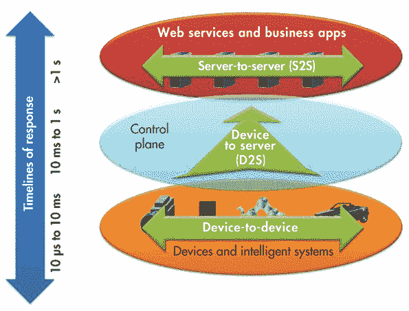](https://cdn.sparkfun.com/assets/learn_tutorials/5/3/4/1013_WebEE_rti_F2.gif)*Source: [electronicdesign.com](http://electronicdesign.com/)*

我们将讨论四种这样的协议，涉及上述所有不同类型的连接:

*   MQTT (消息队列遥测传输)——收集设备数据并传输到服务器的协议
*   XMPP (可扩展消息和在线协议)——一种将设备连接到与服务器相连的人的协议
*   DDS (数据分发服务)——智能设备间快速通信的协议
*   **AMQP** (高级消息队列协议)——一种为不同服务器之间有效通信而设计的协议

### MQTT

[](https://cdn.sparkfun.com/assets/learn_tutorials/5/3/4/mqttorg-glow.png)

MQTT.org 给出了 MQTT 的定义:一种机器对机器(M2M)物联网连接协议。它被设计成一种极其轻量级的发布/订阅消息传输。它对于需要少量代码和/或网络带宽非常宝贵的远程位置的连接非常有用。例如，它已被用于通过卫星链路与代理通信的传感器、偶尔与医疗保健提供商的拨号连接，以及一系列家庭自动化和小型设备场景。它也是移动应用的理想选择，因为它体积小，功耗低，数据包最少，并能有效地将信息分发给一个或多个接收器。

MQTT 的目标是从许多设备收集数据，并将数据传输到 IT 基础设施。在必须将来自数千个传感器的传感器数据传输到一个位置进行分析的情况下，这可能是最佳解决方案之一。

关于 MQTT 协议的更多信息可以在这里找到。

### XMPP

[](https://cdn.sparkfun.com/assets/learn_tutorials/5/3/4/brand.gif)

[XMPP.org](http://xmpp.org/)将其描述为:可扩展的消息和存在协议，一组用于即时消息、存在、多方聊天、语音和视频呼叫、协作、轻量级中间件、内容聚合和 XML 数据的通用路由的开放技术。

可以把 XMPP 看作是连接设备发现彼此并开始聊天的一种方式——也就是说，像我们一样开始交换信息！

更多关于 XMPP-IoT 的信息可以在[这里](http://wiki.xmpp.org/web/InternetOfThings)找到。

### 数字显示示波器(digital display scope)

[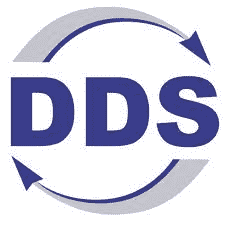](https://cdn.sparkfun.com/assets/learn_tutorials/5/3/4/OMG-DDS-Data-Distribution-Service-180714.jpg)

与 MQTT 和 XMPP(设备到服务器协议)不同，DDS 使用直接利用设备数据的设备。这是一种将一台设备的数据分发到另一台设备的协议。DDS 可以有效地将每秒数百万条消息同时传送给多个接收器。

DDS 是点对点通信。服务器和消息代理的消除简化了通信，最小化了延迟并降低了复杂性。对于需要可靠和高性能架构的物联网应用来说，它是可靠的。

欲了解更多关于 DDS 的信息，请点击[这里](https://info.rti.com/hubfs/whitepapers/Right_Middleware_for_IIoT.pdf)。

### AMQP

[](https://cdn.sparkfun.com/assets/learn_tutorials/5/3/4/amqp-logo_1.jpg)

AMQP 是一种服务器到服务器类型的协议。它在服务器之间发送事务性消息。AMQP 的主要特点是可靠性，它能够发送数千个排队的事务而不丢失任何数据。

AMQP.org 将该协议定义为:在应用程序或组织之间传递商业信息的开放标准。它连接系统，为业务流程提供所需的信息，并可靠地向前传输实现其目标的指令。

它最初是为银行业开发的，作为跟踪和传递非常重要的消息的中间件。在物联网范式中，AQMP 最适合基于服务器的分析功能，其中来自不同服务器的数据需要进行通信以进行有效分析。

总之，物联网没有固定的最佳协议，仍处于无法标准化的阶段，而且可能永远无法标准化。其应用的多样性和数百万不同类型的连接设备使其独一无二。

因此，最佳协议应该是特定于应用的。您可能希望阅读这篇博文，更详细地探讨物联网的 MQTT 和 CoAP 协议。

[](https://www.sparkfun.com/news/1705 "January 5, 2015: I've been learning a lot about IoT protocols lately. Come learn the wonders of MQTT and CoAP!") [### 物联网协议探索

January 5, 2015](https://www.sparkfun.com/news/1705 "January 5, 2015: I've been learning a lot about IoT protocols lately. Come learn the wonders of MQTT and CoAP!")[Favorited Favorite](# "Add to favorites") 3