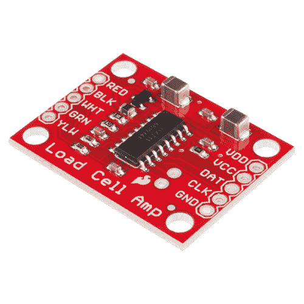
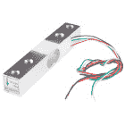
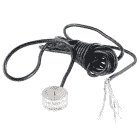
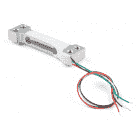
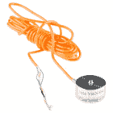
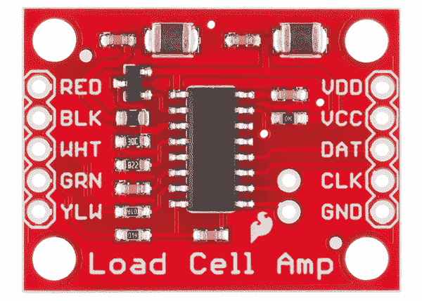
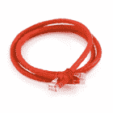
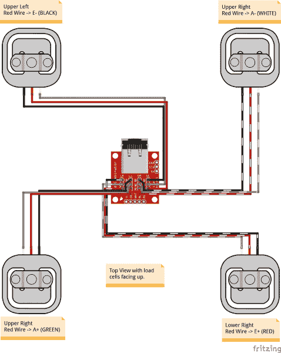
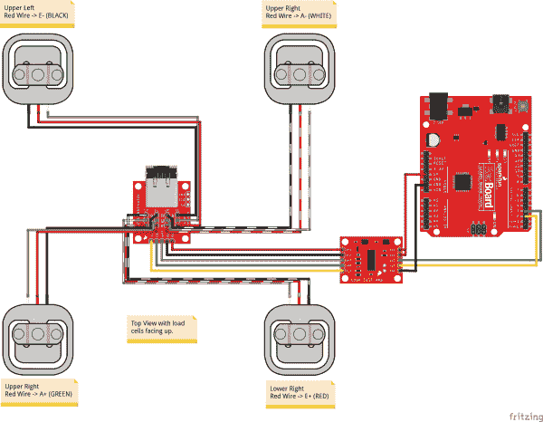

# 称重传感器放大器 HX711 分线点连接指南

> 原文：<https://learn.sparkfun.com/tutorials/load-cell-amplifier-hx711-breakout-hookup-guide>

## 介绍

[HX711 称重传感器放大器](https://www.sparkfun.com/products/13879)用于从称重传感器和应变仪中获取可测量的数据。该连接指南将向您展示如何使用我们在 SparkFun 提供的各种称重传感器开始使用这款放大器。

[](https://www.sparkfun.com/products/13879) 

将**添加到您的[购物车](https://www.sparkfun.com/cart)中！**

 **### [SparkFun 称重传感器放大器- HX711](https://www.sparkfun.com/products/13879)

[In stock](https://learn.sparkfun.com/static/bubbles/ "in stock") SEN-13879

SparkFun 称重传感器放大器是 HX711 IC 的小型分线板，可让您轻松读取称重传感器以进行测量

$10.9541[Favorited Favorite](# "Add to favorites") 48[Wish List](# "Add to wish list")** **[https://www.youtube.com/embed/GM6A2btAvz4/?autohide=1&border=0&wmode=opaque&enablejsapi=1](https://www.youtube.com/embed/GM6A2btAvz4/?autohide=1&border=0&wmode=opaque&enablejsapi=1)

[https://www.youtube.com/embed/GjTRKpADsTk/?autohide=1&border=0&wmode=opaque&enablejsapi=1](https://www.youtube.com/embed/GjTRKpADsTk/?autohide=1&border=0&wmode=opaque&enablejsapi=1)

### 所需材料

在这个简单的连接指南中，我们将把一个称重传感器与 HX711 放大器连接起来，并展示如何用一个 combinator 板和 HX711 放大器连接四个称重传感器。要跟进，您需要:

*   [SparkFun 称重传感器放大器- HX711](https://www.sparkfun.com/products/13879)
*   任何基于应变仪的测压元件:

[](https://www.sparkfun.com/products/13329) 

将**添加到您的[购物车](https://www.sparkfun.com/cart)中！**

 **### [称重传感器- 10kg，直杆(TAL220)](https://www.sparkfun.com/products/13329)

[In stock](https://learn.sparkfun.com/static/bubbles/ "in stock") SEN-13329

这种直杆测压元件(有时称为应变仪)可以将高达 10kg 的压力(力)转化为电…

$9.503[Favorited Favorite](# "Add to favorites") 20[Wish List](# "Add to wish list")****[](https://www.sparkfun.com/products/13332) 

将**添加到您的[购物车](https://www.sparkfun.com/cart)中！**

 **### [称重传感器- 200kg，圆盘(TAS606)](https://www.sparkfun.com/products/13332)

[Out of stock](https://learn.sparkfun.com/static/bubbles/ "out of stock") SEN-13332

这种盘式测压元件(有时称为应变仪)可以将高达 200 公斤的压力(力)转化为电…

$64.504[Favorited Favorite](# "Add to favorites") 19[Wish List](# "Add to wish list")****[](https://www.sparkfun.com/products/14728) 

将**添加到您的[购物车](https://www.sparkfun.com/cart)中！**

 **### [【迷你称重传感器- 500g，直杆(TAL221)](https://www.sparkfun.com/products/14728)

[In stock](https://learn.sparkfun.com/static/bubbles/ "in stock") SEN-14728

这种直杆测压元件(有时称为应变仪)可以将高达 500 克的压力(力)转化为电…

$10.95[Favorited Favorite](# "Add to favorites") 6[Wish List](# "Add to wish list")****[](https://www.sparkfun.com/products/14282) 

将**添加到您的[购物车](https://www.sparkfun.com/cart)中！**

 **### [称重传感器- 200kg，S 型(TAS501)](https://www.sparkfun.com/products/14282)

[Out of stock](https://learn.sparkfun.com/static/bubbles/ "out of stock") SEN-14282

这种 S 型测压元件(有时称为应变仪)可以将高达 200 千克的压力(力)转化为电信号…

$64.503[Favorited Favorite](# "Add to favorites") 8[Wish List](# "Add to wish list")****[](https://www.sparkfun.com/products/14727) 

将**添加到您的[购物车](https://www.sparkfun.com/cart)中！**

 **### [【迷你称重传感器- 100g，直杆(TAL221)](https://www.sparkfun.com/products/14727)

[In stock](https://learn.sparkfun.com/static/bubbles/ "in stock") SEN-14727

这种直杆测压元件(有时称为应变仪)可以将高达 100 克的压力(力)转化为电…

$9.951[Favorited Favorite](# "Add to favorites") 5[Wish List](# "Add to wish list")****[](https://www.sparkfun.com/products/13331) 

将**添加到您的[购物车](https://www.sparkfun.com/cart)中！**

 **### [称重传感器- 50kg，圆盘(TAS606)](https://www.sparkfun.com/products/13331)

[In stock](https://learn.sparkfun.com/static/bubbles/ "in stock") SEN-13331

这种单盘测压元件(有时称为应变仪)可以将高达 50 公斤的压力(力)转化为电…

$64.502[Favorited Favorite](# "Add to favorites") 5[Wish List](# "Add to wish list")****[](https://www.sparkfun.com/products/14729) 

将**添加到您的[购物车](https://www.sparkfun.com/cart)中！**

 **### [称重传感器- 5kg，直杆(TAL220B)](https://www.sparkfun.com/products/14729)

[In stock](https://learn.sparkfun.com/static/bubbles/ "in stock") SEN-14729

这种直杆测压元件(有时称为应变仪)可以将高达 5 公斤的压力(力)转化为电…

$11.951[Favorited Favorite](# "Add to favorites") 7[Wish List](# "Add to wish list")************** ************如果您计划使用[负载传感器](https://www.sparkfun.com/products/10245) ^([1](#fn1)) ，您将需要获得或购买四台。我们推荐使用我们的[组合板](https://www.sparkfun.com/products/13878)，以便轻松将四个应变计转变为惠斯通电桥型称重传感器。(单个应变式称重传感器只有三根导线，而不是四根。)

### 推荐阅读

如果您不熟悉以下概念，我们建议您在开始使用 HX711 称重传感器放大器板之前先复习一下。

[](https://learn.sparkfun.com/tutorials/how-to-solder-through-hole-soldering) [### 如何焊接:通孔焊接](https://learn.sparkfun.com/tutorials/how-to-solder-through-hole-soldering) This tutorial covers everything you need to know about through-hole soldering.[Favorited Favorite](# "Add to favorites") 70[](https://learn.sparkfun.com/tutorials/battery-technologies) [### 电池技术](https://learn.sparkfun.com/tutorials/battery-technologies) The basics behind the batteries used in portable electronic devices: LiPo, NiMH, coin cells, and alkaline.[Favorited Favorite](# "Add to favorites") 50[](https://learn.sparkfun.com/tutorials/how-to-power-a-project) [### 如何为项目提供动力](https://learn.sparkfun.com/tutorials/how-to-power-a-project) A tutorial to help figure out the power requirements of your project.[Favorited Favorite](# "Add to favorites") 67[](https://learn.sparkfun.com/tutorials/getting-started-with-load-cells) [### 称重传感器入门](https://learn.sparkfun.com/tutorials/getting-started-with-load-cells) A tutorial defining what a load cell is and how to use one.[Favorited Favorite](# "Add to favorites") 27

^(1。【[应变仪](http://www.omega.com/pptst/KFH.html)是两个有线的有组织的金属箔或金属线，其设置方式是当其被压缩或拉伸时电阻会发生变化。当一个应变仪被放置在某物(通常是金属性质的)上时，它的电阻会根据该物所受的应力而变化。当一个应变仪连接到一个金属单元时，我们称之为[负载传感器](https://www.sparkfun.com/products/10245)，它有三根输出线。[测压元件](https://www.sparkfun.com/products/13330)通常有四个应变仪，以惠斯通电桥形式连接，有四条输出线。有关称重传感器、应变仪和惠斯通电桥的更多信息，请参见我们的[教程](https://learn.sparkfun.com/tutorials/getting-started-with-load-cells)。】[↩](#ref1 "Jump back to footnote 1 in the text.")t11】)

## 称重传感器设置

根据您使用的称重传感器的类型，如何将其连接到板或表面的配置将会改变。我们将在下面列出几种不同类型的设置。

[](https://cdn.sparkfun.com/assets/learn_tutorials/3/8/3/HX711_and_Combinator_board_hook_up_guide-05.jpg)*A selection of different load cells*

### 杆式称重传感器

通常，对于较大的非按钮式称重传感器，您需要将称重传感器以“Z”形连接在两块板之间。

[](https://cdn.sparkfun.com/assets/learn_tutorials/3/8/3/HX711_and_Combinator_board_hook_up_guide-06.jpg)*Bar strain gauge based load cells*

如下图所示，杆式称重传感器安装有装配螺钉和垫片，以便能够正确测量应变。请注意，当杆式称重传感器放置在两块板之间时，只有称重传感器的一侧拧入每块板中。这在应变仪上提供了一个力矩或扭矩，而不仅仅是压缩力，这更容易测量，也更准确。

[](https://cdn.sparkfun.com/assets/learn_tutorials/3/8/3/HX711_and_Combinator_board_hook_up_guide-02.jpg)*Bar load cell between a two plate configuration*

### s 型称重传感器

s 型称重传感器由于其设计可以测量压力和/或张力。

[](https://cdn.sparkfun.com/assets/parts/1/2/2/3/8/14282-01.jpg)

除了将称重传感器置于板之间，s 型还可用于测量悬挂的料罐或料斗。你可以把这个想象成一个附着在起重机上的负载。下面是一个 s 型称重传感器，带有两个螺纹杆端轴承。

[](https://cdn.sparkfun.com/assets/learn_tutorials/3/8/3/S_cell2.JPG)*S-type load cell configuration*

### 单个应变式称重传感器(即负荷传感器)

对于单个应变式称重传感器，它们可以放置在平台下方，彼此之间的距离相等。

[](https://cdn.sparkfun.com//assets/parts/4/5/9/5/10245-01a.jpg)

下图显示了以惠斯通电桥配置排列的四个单应变计(即负载传感器)。这种配置也适用于四个按钮式称重传感器。

[](https://cdn.sparkfun.com/assets/learn_tutorials/5/4/6/Load_cell_combinator_tutorial_updates-01.jpg)*SparkFun's strain gauge load cell combinator board hooked up to a home scale, possible four disc load cell configuration in something like a bathroom scale***Note:** If you are hooking together four of the [SparkFun Load Sensors](https://www.sparkfun.com/products/10245) using the [Combinator board](https://www.sparkfun.com/products/13878), you should position the four load sensors **equidistant** from each other, just like the bathroom scales shown in this tutorial.

### 纽扣/圆盘式称重传感器

对于较小的按钮式或盘式称重传感器，您需要确保将圆盘拧到底板(或测量力的表面)上，并将梁、板或任何您希望测量力的物体置于顶部“按钮”的中心。

[](https://cdn.sparkfun.com/assets/learn_tutorials/3/8/3/HX711_and_Combinator_board_hook_up_guide-07.jpg)

通常使用另一个带孔的板来确保每次测量的东西都击中称重传感器上的同一点，但这不是必须的。下面是四个按钮式称重传感器的图像，它们在平台下彼此等距放置。请务必阅读您正在使用的称重传感器的数据表，并安装正确的螺钉。

| [](https://learn.sparkfun.com/tutorials/iot-industrial-scale#build-the-base-and-case) | [](https://learn.sparkfun.com/tutorials/iot-industrial-scale#build-the-base-and-case) |
| *按钮称重传感器来自[物联网工业规模教程](https://learn.sparkfun.com/tutorials/iot-industrial-scale#build-the-base-and-case)* | *定制秤内的按钮称重传感器* |

### 测量中的差异

由于一系列因素，包括温度、蠕变、振动、漂移以及其他电气和机械干扰，称重传感器的测量值可能会有+/- 5%的偏差。在安装您的秤之前，请花点时间设计您的系统，以便于校准或能够调整代码参数来应对这些变化。

## 硬件连接

HX711 称重传感器放大器接受来自称重传感器的五根电线。这些针标有颜色；**红色、BLK、WHT、GRN 和 YLW** 。

[](https://cdn.sparkfun.com/assets/learn_tutorials/5/4/6/13879-04_HX711_Breaout_Board.jpg)

这些颜色对应于称重传感器的传统颜色编码，其中红色、黑色、绿色和白色电线来自称重传感器上的应变仪，黄色是可选的接地线，不与应变仪相连，但用于将任何微小的外部 EMI(电磁干扰)接地。有时，代替黄线的是更大的黑线、箔或松散的线来屏蔽信号线以减少电磁干扰。

[](https://cdn.sparkfun.com/assets/learn_tutorials/3/8/3/HX711_and_Combinator_board_hook_up_guide-10.jpg)*Here we have a large black wire, some loose wires, and foil and loose wires respectively as EMI buffers*

一般来说，每个称重传感器有四个应变仪，它们以如下所示的**惠斯通电桥**形式连接。

[](https://cdn.sparkfun.com/assets/learn_tutorials/3/8/3/Wheatstone-Bridge-02.jpg)*Four strain gauges (SG1 through 4) hooked up in a wheatstone bridge formation*

从称重传感器上的惠斯通电桥引出的四根导线“通常”:

| 惠斯通电桥节点 | “典型”电线颜色 |
| 激发+ (E+)或 VCC | 红色 |
| 激发- (E-)或 GND | 黑色还是黄色 |
| 输出- (O-)、信号- (S-)或放大器- (A-) | 白色 |
| O+、S+或 A+ | 绿色或蓝色 |

如果只有四根导线(意味着没有导线用作 EMI 缓冲器)，某些称重传感器的颜色编码可能会略有不同，例如蓝色而不是绿色，或者黄色而不是黑色或白色。您可能需要从您所拥有的颜色中推断出一些颜色，或者查看称重传感器的数据表，但一般来说，您通常会看到这些颜色。

If the readings from the HX711 are opposite of what you are expect (for example the values decrease as you increase weight) simply reverse the O+/O- wires.[](https://cdn.sparkfun.com/assets/learn_tutorials/5/4/6/Load_cell_combinator_tutorial_updates-04.jpg)*Load cell wires hooked up to the [HX711 Amplifier board](https://www.sparkfun.com/products/13230)*

一旦称重传感器连接到放大器，您就可以将 VDD、VCC、达特、CLK 和 GND 连接到微控制器，如 [RedBoard](https://www.sparkfun.com/products/12757) 或 [Arduino](https://www.sparkfun.com/products/11113) 板。

**注:** VCC 是给称重传感器供电的模拟电压。VDD 是用于设置逻辑电平的数字电源电压。

**PRO TIP:** In many cases, you can just short VCC and VDD together. If your microcontroller uses 3.3V logic however, you'll want to connect VCC to 5V and VDD to 3.3V.

示例代码的 **DAT 和 CLK** 分别连接到**的引脚 3 和 2** ，但这在代码中很容易更改。任何 GPIO 引脚都可以。然后 VCC 和 VDD 只需要连接到你的微控制器上的 **2.7-5V** 和 GND 地。

[](https://cdn.sparkfun.com/assets/learn_tutorials/5/4/6/HX711_Fritzing.JPG)*Fritzing diagram of HX711 amplifier connected to a RedBoard*

### [带称重传感器组合板的应变仪](#combinator)

现在，如果您想用我们的[组合器板](https://www.sparkfun.com/products/13878)和放大器设置四个单负载传感器，将组合器上标有红色、BLK、WHT、GRN、YLW 的五个引脚连接到放大器上的匹配引脚。接下来，将四个负载传感器分别连接到以下引脚:

| 单，应变仪(即负荷传感器)
“典型”电线颜色 | 负载组合板 |
| 红色 | C |
| 白色 | + |
| 黑色 | - |

[](https://cdn.sparkfun.com/assets/parts/1/1/5/0/9/13878-04.jpg)**Note:** The combinator board also has room for an [8 pin RJ45 socket](https://www.sparkfun.com/products/643), which can be used to connect your project via [Ethernet cables](https://www.sparkfun.com/products/8915) for long distance applications.

[](https://www.sparkfun.com/products/643) 

将**添加到您的[购物车](https://www.sparkfun.com/cart)中！**

 **### [RJ45 8 针连接器](https://www.sparkfun.com/products/643)

[Out of stock](https://learn.sparkfun.com/static/bubbles/ "out of stock") PRT-00643

这些是简单的带 PCB 安装柱的通孔 RJ45 插座。这些 8 针连接器通常与…

$1.601[Favorited Favorite](# "Add to favorites") 17[Wish List](# "Add to wish list")****[](https://www.sparkfun.com/products/8915) 

将**添加到您的[购物车](https://www.sparkfun.com/cart)中！**

 **### [6 类电缆-3 英尺](https://www.sparkfun.com/products/8915)

[In stock](https://learn.sparkfun.com/static/bubbles/ "in stock") CAB-08915

这款 3 英尺 6 类(CAT 6)以太网电缆是满足您互联网工作需求的解决方案。随着高达 500 兆赫的速度，你可以…

$2.10[Favorited Favorite](# "Add to favorites") 4[Wish List](# "Add to wish list")**** ****关于我们的 combinator 板的另一个好处是，大多数家用秤使用四个单应变仪负载传感器，所以这是一个方便的板，可以在家里黑掉自己的秤！

[](https://cdn.sparkfun.com/assets/learn_tutorials/5/4/6/Load_cell_combinator_tutorial_updates-02.jpg)*Hacked home scale's four load sensors hooked up to our combinator board*

对于负荷传感器，没有固定的颜色编码标准。黑客家用秤可以有不同的电线颜色。将上图中的秤与负载传感器原理图进行比较，虽然黑线匹配，但红线和白线互换了。此外，四个传感器中只有两个使用白线作为负载传感器的“中间抽头”,其他两个使用绿线。我把黑色的线连接到“ **-** ”，红色的线连接到“ **+ 【T3”，白色和绿色的线连接到“ **C** ”。**

[](https://cdn.sparkfun.com/assets/learn_tutorials/3/8/3/20100816-3wirestraingauge.png)*Example of a single strain gauge, or load sensor. Here RED is the center tap*

为了确定如何将单个应变式称重传感器连接到组合器，[用万用表](https://learn.sparkfun.com/tutorials/how-to-use-a-multimeter#measuring-resistance)测量三条线之间的电阻。你应该在一对之间找到一个更大的电阻(接近两倍)。在我们的例子中，红色和黑色之间的电阻是 1.6kω(即 1600 &欧姆；)，并且白色/绿色和红色之间的电阻为 800ω。因此，应变计的中间抽头是白/绿线。应变仪的中心抽头或中心销连接到组合机上的“C”销。较大的电阻丝(本例中为红色和黑色)连接到组合器上的“+”和“-”引脚。

组合板连接四个负载传感器，惠斯通电桥配置中的两个电阻是恒定值，另外两个是可变值，如下所示:

[](https://cdn.sparkfun.com/assets/learn_tutorials/5/4/6/Wheatstone_Bridge_Load_Sensor_bb_Fritzing.jpg)

一旦 combinator 板成功焊接到 12 根导线上，现在就可以通过 4 根标准称重传感器导线将其连接到 HX711 放大器板。连接黄色引脚是可选的。您可以使用短跳线，或者如果您的电子设备远离您的秤，可以考虑使用 RJ45 连接器和以太网电缆将组合器连接到 HX711 放大器。

[](https://cdn.sparkfun.com/assets/learn_tutorials/5/4/6/SparkFun_Wheatstone_Bridge_Load_Sensor_HX711_bb_Fritzing.jpg)

完成后，您的设置应该类似于下图。在将电线放入外壳之前，请确保将其固定。

[](https://cdn.sparkfun.com/assets/learn_tutorials/5/4/6/Load_cell_combinator_tutorial_updates-01.jpg)*To hook up the combinator board to the HX711 match the RED, BLK, WHT, and GRN pins*

## 安装 HX711 Arduino 库和示例

**注意:**此示例假设您在桌面上使用的是最新版本的 Arduino IDE。如果这是你第一次使用 Arduino，请回顾我们关于[安装 Arduino IDE 的教程。](https://learn.sparkfun.com/tutorials/installing-arduino-ide)如果您之前没有安装 Arduino 库，请查看我们的[安装指南。](https://learn.sparkfun.com/tutorials/installing-an-arduino-library)

### Arduino 图书馆

现在，您已经连接了称重传感器、放大器和微控制器，您可以添加代码并开始校准您的设置。你需要从用户 **bogde** 那里下载优秀的 HX711 库。在撰写本教程时，[库已经在 ATmega328P、ESP8266、ESP32 和 STM32 上测试过](https://github.com/bogde/HX711#hardware-support)。打开 Arduino IDE 的库管理器，搜索“ **HX711 Arduino 库**”。单击要安装的库。也可以下载 ***。从 [GitHub repo](https://github.com/bogde/HX711) 中压缩**文件以手动安装库。

[HX711 Arduino Library (ZIP)](https://github.com/bogde/HX711/archive/master.zip)

### 例子

您还需要从 [GitHub 库](https://github.com/sparkfun/HX711-Load-Cell-Amplifier/tree/master/firmware)下载最新的示例代码来跟进。

[SparkFun HX711 Load Cell Amplifier Examples (ZIP)](https://github.com/sparkfun/HX711-Load-Cell-Amplifier/archive/master.zip)

## Arduino 示例

你首先要处理的是 SparkFun 示例中的校准代码“*spark fun _ hx 711 _ calibration . ino*”。

```
language:c
/*
 Example using the SparkFun HX711 breakout board with a scale
 By: Nathan Seidle
 SparkFun Electronics
 Date: November 19th, 2014
 License: This code is public domain but you buy me a beer if you use this and we meet someday (Beerware license).

 This is the calibration sketch. Use it to determine the calibration_factor that the main example uses. It also
 outputs the zero_factor useful for projects that have a permanent mass on the scale in between power cycles.

 Setup your scale and start the sketch WITHOUT a weight on the scale
 Once readings are displayed place the weight on the scale
 Press +/- or a/z to adjust the calibration_factor until the output readings match the known weight
 Use this calibration_factor on the example sketch

 This example assumes pounds (lbs). If you prefer kilograms, change the Serial.print(" lbs"); line to kg. The
 calibration factor will be significantly different but it will be linearly related to lbs (1 lbs = 0.453592 kg).

 Your calibration factor may be very positive or very negative. It all depends on the setup of your scale system
 and the direction the sensors deflect from zero state
 This example code uses bogde's excellent library: https://github.com/bogde/HX711
 bogde's library is released under a GNU GENERAL PUBLIC LICENSE
 Arduino pin 2 -> HX711 CLK
 3 -> DOUT
 5V -> VCC
 GND -> GND

 Most any pin on the Arduino Uno will be compatible with DOUT/CLK.

 The HX711 board can be powered from 2.7V to 5V so the Arduino 5V power should be fine.

*/

#include "HX711.h"

#define DOUT  3
#define CLK  2

HX711 scale;

float calibration_factor = -7050; //-7050 worked for my 440lb max scale setup

void setup() {
  Serial.begin(9600);
  Serial.println("HX711 calibration sketch");
  Serial.println("Remove all weight from scale");
  Serial.println("After readings begin, place known weight on scale");
  Serial.println("Press + or a to increase calibration factor");
  Serial.println("Press - or z to decrease calibration factor");

  scale.begin(DOUT, CLK);
  scale.set_scale();
  scale.tare(); //Reset the scale to 0

  long zero_factor = scale.read_average(); //Get a baseline reading
  Serial.print("Zero factor: "); //This can be used to remove the need to tare the scale. Useful in permanent scale projects.
  Serial.println(zero_factor);
}

void loop() {

  scale.set_scale(calibration_factor); //Adjust to this calibration factor

  Serial.print("Reading: ");
  Serial.print(scale.get_units(), 1);
  Serial.print(" lbs"); //Change this to kg and re-adjust the calibration factor if you follow SI units like a sane person
  Serial.print(" calibration_factor: ");
  Serial.print(calibration_factor);
  Serial.println();

  if(Serial.available())
  {
    char temp = Serial.read();
    if(temp == '+' || temp == 'a')
      calibration_factor += 10;
    else if(temp == '-' || temp == 'z')
      calibration_factor -= 10;
  }
} 
```

计算完称重传感器设置的校准系数后，您可以继续使用其他代码，例如简单的秤输出示例代码“*spark fun _ hx 711 _ example . ino*”:

```
language:c
/*
 Example using the SparkFun HX711 breakout board with a scale
 By: Nathan Seidle
 SparkFun Electronics
 Date: November 19th, 2014
 License: This code is public domain but you buy me a beer if you use this and we meet someday (Beerware license).

 This example demonstrates basic scale output. See the calibration sketch to get the calibration_factor for your
 specific load cell setup.

 This example code uses bogde's excellent library: https://github.com/bogde/HX711
 bogde's library is released under a GNU GENERAL PUBLIC LICENSE

 The HX711 does one thing well: read load cells. The breakout board is compatible with any wheat-stone bridge
 based load cell which should allow a user to measure everything from a few grams to tens of tons.
 Arduino pin 2 -> HX711 CLK
 3 -> DAT
 5V -> VCC
 GND -> GND

 The HX711 board can be powered from 2.7V to 5V so the Arduino 5V power should be fine.

*/

#include "HX711.h"

#define calibration_factor -7050.0 //This value is obtained using the SparkFun_HX711_Calibration sketch

#define DOUT  3
#define CLK  2

HX711 scale;

void setup() {
  Serial.begin(9600);
  Serial.println("HX711 scale demo");

  scale.begin(DOUT, CLK);
  scale.set_scale(calibration_factor); //This value is obtained by using the SparkFun_HX711_Calibration sketch
  scale.tare(); //Assuming there is no weight on the scale at start up, reset the scale to 0

  Serial.println("Readings:");
}

void loop() {
  Serial.print("Reading: ");
  Serial.print(scale.get_units(), 1); //scale.get_units() returns a float
  Serial.print(" lbs"); //You can change this to kg but you'll need to refactor the calibration_factor
  Serial.println();
} 
```

查看 GitHub repo 中提供的其他示例代码，用于[关闭 HX711](https://github.com/sparkfun/HX711-Load-Cell-Amplifier/blob/master/firmware/SparkFun_HX711_PowerTest/SparkFun_HX711_PowerTest.ino) 和[已知零启动](https://github.com/sparkfun/HX711-Load-Cell-Amplifier/blob/master/firmware/SparkFun_HX711_KnownZeroStartup/SparkFun_HX711_KnownZeroStartup.ino)。

## 资源和更进一步

现在您已经成功启动并运行了 HX711，是时候将它整合到您自己的项目中了！

有关更多信息，请查看以下资源:

*   [示意图(PDF)](https://cdn.sparkfun.com/assets/learn_tutorials/5/4/6/SparkFun_HX711_Load_Cell.pdf)
*   [老鹰文件(ZIP)](https://cdn.sparkfun.com/assets/learn_tutorials/5/4/6/SparkFun_HX711_Load_Cell_v11.zip)
*   [HX711 数据手册(PDF)](https://cdn.sparkfun.com/assets/learn_tutorials/5/4/6/hx711F_EN.pdf)
*   开源代码库
    *   [Arduino 库](https://github.com/bogde/HX711)
    *   [设计文件&示例代码](https://github.com/sparkfun/HX711-Load-Cell-Amplifier/tree/master)
*   [SFE 产品展示区:狗狗零食分配器](https://www.youtube.com/watch?v=GM6A2btAvz4)
*   [SparkFun 团契之物#2 -重量奖励](https://www.youtube.com/watch?v=GjTRKpADsTk)
    *   [粒子光子示例代码](https://github.com/sparkfun/IoT_Weight_for_Treats)

你的下一个项目需要一些灵感吗？查看一些相关教程:

[](https://learn.sparkfun.com/tutorials/openscale-applications-and-hookup-guide) [### OpenScale 应用和连接指南](https://learn.sparkfun.com/tutorials/openscale-applications-and-hookup-guide) OpenScale allows you to have a permanent scale for industrial and biological applications. Learn how to use the OpenScale board to read and configure load cells.[Favorited Favorite](# "Add to favorites") 7[](https://learn.sparkfun.com/tutorials/iot-industrial-scale) [### 物联网产业规模](https://learn.sparkfun.com/tutorials/iot-industrial-scale) What does a baby elephant weigh? How much impact force does a jump have? Answer these questions and more by building your very own IoT industrial scale using the SparkFun OpenScale.[Favorited Favorite](# "Add to favorites") 9[](https://learn.sparkfun.com/tutorials/iot-weight-logging-scale) [### 物联网重量记录秤](https://learn.sparkfun.com/tutorials/iot-weight-logging-scale) This tutorial will show you how to make a scale that logs your weight to a custom website on the Internet. The principles can be extrapolated to any type of data.[Favorited Favorite](# "Add to favorites") 8[](https://learn.sparkfun.com/tutorials/qwiic-scale-hookup-guide) [### Qwiic 秤连接指南](https://learn.sparkfun.com/tutorials/qwiic-scale-hookup-guide) Create your own digital scale quickly and easily using the Qwiic Scale 4

需要更多吗？请查看以下附加链接:

*   SparkFun 物联网蜂巢
    *   [蜜蜂网络:增加传感器监控蜂巢健康状况](http://makezine.com/projects/bees-sensors-monitor-hive-health)
    *   [GitHub 回购:公开规模](https://github.com/sparkfun/OpenScale)
*   [Phidgets:称重传感器初级读本](http://www.phidgets.com/docs/Load_Cell_Primer) -关于惠斯通电桥和称重传感器类型的文章******************