# OpenScale 应用和连接指南

> 原文：<https://learn.sparkfun.com/tutorials/openscale-applications-and-hookup-guide>

## 概观

SparkFun [OpenScale](https://www.sparkfun.com/products/13261) 使读取称重传感器变得容易。连接任意容量的四线或五线称重传感器，将 OpenScale 插入 USB 端口，以 9600bps 的速度打开终端窗口，您将立即看到大量读数。要了解更多关于称重传感器的信息，请参阅我们的[称重传感器入门教程](https://learn.sparkfun.com/tutorials/getting-started-with-load-cells?_ga=1.101466817.1788647015.1453914745)。该板还内置了[称重传感器组合器](https://www.sparkfun.com/products/13281)，因此您也可以将四个称重传感器读取为一个称重传感器。

 

将**添加到您的[购物车](https://www.sparkfun.com/cart)中！**

### [spark fun open scale](https://www.sparkfun.com/products/13261)

[In stock](https://learn.sparkfun.com/static/bubbles/ "in stock") SEN-13261

SparkFun OpenScale 是一款简单易用的开源重量和温度测量解决方案。它有能力研究…

$34.5021[Favorited Favorite](# "Add to favorites") 28[Wish List](# "Add to wish list")** **[https://www.youtube.com/embed/HZtXN-KcssA/?autohide=1&border=0&wmode=opaque&enablejsapi=1](https://www.youtube.com/embed/HZtXN-KcssA/?autohide=1&border=0&wmode=opaque&enablejsapi=1)

OpenScale 将 [HX711 分线板](https://www.sparkfun.com/products/13230)与运行 Arduino 的 Atmega328P 和大量预装配置固件相结合，为称重传感器读数创建了现成的解决方案。

OpenScale 设计用于负载为静态的项目和应用(例如蜂箱)或需要持续读数而无需用户干预的项目和应用(例如传送带系统)。带有 OpenScale 的称重传感器无需用户干预即可保持数月。

OpenScale 通过简单易用的配置菜单，使您的秤易于调零和校准。串行输出和控制可通过 mini-B USB 端口或 FTDI 兼容连接实现。这使得 OpenScale 可以与数据记录器( [OpenLog](https://www.sparkfun.com/products/9530) )或无线蓝牙发射器(如 [SparkFun 蓝牙伴侣 Silver](https://www.sparkfun.com/products/12576) )无缝连接。在 bee scale 应用程序中，OpenScale 连接到 [Blynk 板](https://www.sparkfun.com/products/13794)，收集的数据被推送到[数据流服务](https://www.sparkfun.com/news/2413)。

OpenScale 包含一个精密数字温度传感器，用于报告当地温度。还可为兼容 [DS18B20](https://www.sparkfun.com/products/11050) 的温度传感器提供外部连接，以读取称重传感器的温度读数。请注意，OpenScale 报告本地和远程温度读数，但不会因温度波动而改变刻度读数。用户需要正确校准和后处理这些温度读数，以获得最大的秤精度。

OpenScale 是完全开源的硬件和软件。OpenScale 自带 Arduino Uno 兼容的 bootloader (STK500，115200bps，16MHz)。修改固件就像在 Arduino 上加载新代码一样简单。你可以在 GitHub 上的 [OpenScale 资源库](https://github.com/sparkfun/OpenScale)中找到所有源代码。

### 所需材料

我们将把称重传感器与 OpenScale 的 HX711 放大器连接起来，并展示如何连接四个载荷传感器。要跟进，您需要:

*   [SparkFun OpenScale](https://www.sparkfun.com/products/13261)
*   任何基于应变仪的测压元件:

 

将**添加到您的[购物车](https://www.sparkfun.com/cart)中！**

### [称重传感器- 10kg，直杆(TAL220)](https://www.sparkfun.com/products/13329)

[In stock](https://learn.sparkfun.com/static/bubbles/ "in stock") SEN-13329

这种直杆测压元件(有时称为应变仪)可以将高达 10kg 的压力(力)转化为电…

$9.503[Favorited Favorite](# "Add to favorites") 20[Wish List](# "Add to wish list")**** 

将**添加到您的[购物车](https://www.sparkfun.com/cart)中！**

### [称重传感器- 200kg，圆盘(TAS606)](https://www.sparkfun.com/products/13332)

[Out of stock](https://learn.sparkfun.com/static/bubbles/ "out of stock") SEN-13332

这种盘式测压元件(有时称为应变仪)可以将高达 200 公斤的压力(力)转化为电…

$64.504[Favorited Favorite](# "Add to favorites") 19[Wish List](# "Add to wish list")**** 

将**添加到您的[购物车](https://www.sparkfun.com/cart)中！**

### [【迷你称重传感器- 500g，直杆(TAL221)](https://www.sparkfun.com/products/14728)

[In stock](https://learn.sparkfun.com/static/bubbles/ "in stock") SEN-14728

这种直杆测压元件(有时称为应变仪)可以将高达 500 克的压力(力)转化为电…

$10.95[Favorited Favorite](# "Add to favorites") 6[Wish List](# "Add to wish list")****[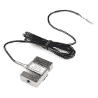](https://www.sparkfun.com/products/14282) 

将**添加到您的[购物车](https://www.sparkfun.com/cart)中！**

### [称重传感器- 200kg，S 型(TAS501)](https://www.sparkfun.com/products/14282)

[Out of stock](https://learn.sparkfun.com/static/bubbles/ "out of stock") SEN-14282

这种 S 型测压元件(有时称为应变仪)可以将高达 200 千克的压力(力)转化为电信号…

$64.503[Favorited Favorite](# "Add to favorites") 8[Wish List](# "Add to wish list")**** 

将**添加到您的[购物车](https://www.sparkfun.com/cart)中！**

### [【迷你称重传感器- 100g，直杆(TAL221)](https://www.sparkfun.com/products/14727)

[In stock](https://learn.sparkfun.com/static/bubbles/ "in stock") SEN-14727

这种直杆测压元件(有时称为应变仪)可以将高达 100 克的压力(力)转化为电…

$9.951[Favorited Favorite](# "Add to favorites") 5[Wish List](# "Add to wish list")**** 

将**添加到您的[购物车](https://www.sparkfun.com/cart)中！**

### [称重传感器- 50kg，圆盘(TAS606)](https://www.sparkfun.com/products/13331)

[In stock](https://learn.sparkfun.com/static/bubbles/ "in stock") SEN-13331

这种单盘测压元件(有时称为应变仪)可以将高达 50 公斤的压力(力)转化为电…

$64.502[Favorited Favorite](# "Add to favorites") 5[Wish List](# "Add to wish list")****[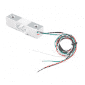](https://www.sparkfun.com/products/14729) 

将**添加到您的[购物车](https://www.sparkfun.com/cart)中！**

### [称重传感器- 5kg，直杆(TAL220B)](https://www.sparkfun.com/products/14729)

[In stock](https://learn.sparkfun.com/static/bubbles/ "in stock") SEN-14729

这种直杆测压元件(有时称为应变仪)可以将高达 5 公斤的压力(力)转化为电…

$11.951[Favorited Favorite](# "Add to favorites") 7[Wish List](# "Add to wish list")************** ************如果您计划使用[负载传感器](https://www.sparkfun.com/products/10245)，您将需要获得或购买四个单元来将单个应变仪连接到惠斯通电桥型称重传感器。(单个应变式称重传感器只有三根导线，而不是四根。)

### 推荐阅读

如果您不熟悉以下概念，我们建议您在学习本教程末尾的项目示例之前先回顾一下这些概念。

 [### 阳光伙伴太阳能充电器 V13 连接指南](https://learn.sparkfun.com/tutorials/sunny-buddy-solar-charger-v13-hookup-guide-) How to hookup the Sunny Buddy: a solar-powered, MPPT (peak-power tracking), LiPo battery charger.[Favorited Favorite](# "Add to favorites") 14 [### 称重传感器入门](https://learn.sparkfun.com/tutorials/getting-started-with-load-cells) A tutorial defining what a load cell is and how to use one.[Favorited Favorite](# "Add to favorites") 27 [### OpenLog 连接指南](https://learn.sparkfun.com/tutorials/openlog-hookup-guide) An introduction to working with the OpenLog data logger.[Favorited Favorite](# "Add to favorites") 4 [### 称重传感器放大器 HX711 分线点连接指南](https://learn.sparkfun.com/tutorials/load-cell-amplifier-hx711-breakout-hookup-guide) A hookup guide for the HX711 load cell amplifier breakout board[Favorited Favorite](# "Add to favorites") 7

## 硬件功能

[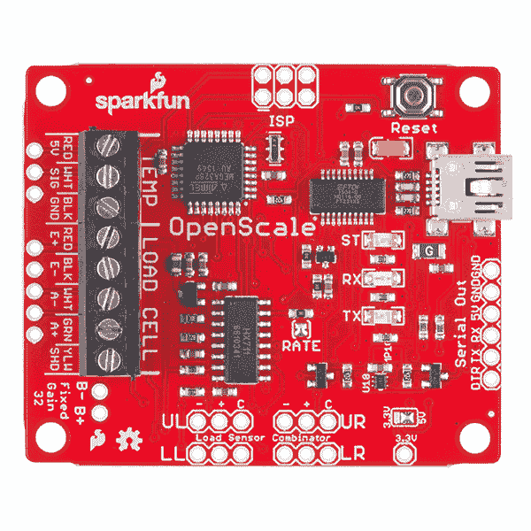](https://cdn.sparkfun.com/assets/parts/1/0/4/6/5/13261-04.jpg)

### 动力循环

当报告速率超过 500 毫秒时，OpenScale 会在读数之间自动关闭称重传感器的电源。这节省了能量并限制了应变仪的局部热量。HX711 上电后需要大约 500ms 才能稳定。如果报告速率设置为低于 500 毫秒，OpenScale 将始终保持 HX711 开启。这不会损坏称重传感器，但可能会影响几个小时连续读数的准确度。

### 费率跳线

速率跳线在两种速率之间选择:每秒 10 个样本(SPS)或每秒 80 个样本。默认情况下，电路板上的两个焊盘之间存在短路，将 HX711 RATE 引脚接地，并将速率设置为 10SPS。这将样本输入噪声降至 50nV(降低读数噪声),但将启动时间(从省电模式开始)增加至 400ms。

[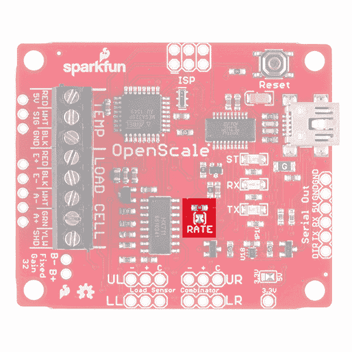](https://cdn.sparkfun.com/assets/learn_tutorials/3/7/4/OpenScale_rateJumper.jpg)

打开跳线会将采样速率设置为 80SPS，噪声增加到 90nV，启动时间减少到 100ms。用[业余爱好刀](https://www.sparkfun.com/products/9200)切割跳线打开跳线。如有必要，可以用焊料再次封闭跳线。

### 本地温度传感器

OpenScale 内置 TMP102 数字温度传感器。通过配置菜单启用时，OpenScale 将以摄氏度为单位打印温度，并带有用户选择的小数位数。TMP102 传感器非常精确，但需要校准才能达到最高精度。

[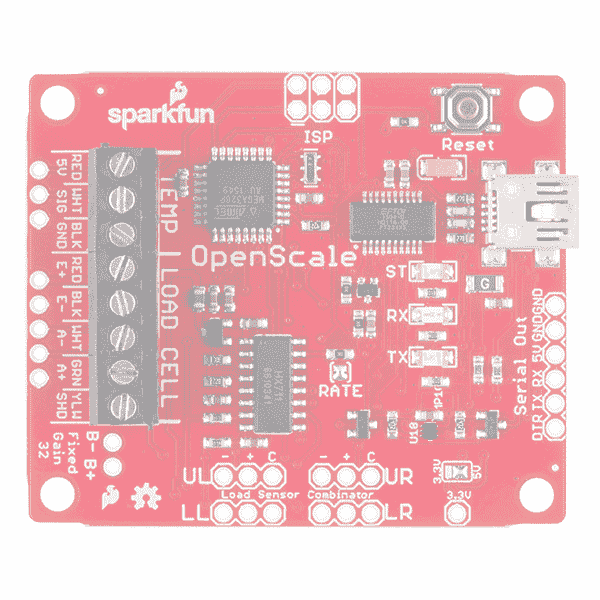](https://cdn.sparkfun.com/assets/learn_tutorials/3/7/4/OpenScale_Temptiny.jpg)

### 外部温度传感器

有一个间距为 0.1 英寸的 3 引脚封装，用于连接 DS18B20 兼容型传感器。一个 4.7k 欧姆的电阻器连接在 VCC 和信号引脚之间，以允许单线通信。[防水 DS18B20 传感器](https://www.sparkfun.com/products/11050)是检测远程称重传感器温度的绝佳方式。

[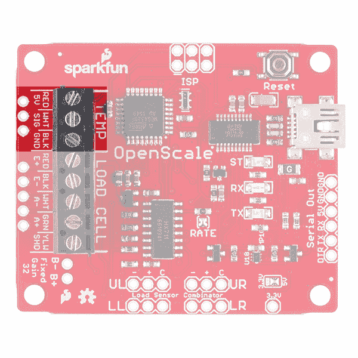](https://cdn.sparkfun.com/assets/learn_tutorials/3/7/4/OpenScale_TEMP.jpg)Please note that the scale readings do not take the local or remote temperature readings into account. It is up to the user to post process these temperature readings to get the maximum scale accuracy.

### 固定和可调增益

HX711 具有一个有源低噪声可编程增益放大器，增益为 32、64 和 128。对 A+和 A-使用通道 B 输入，您将获得 32 的自动增益。规格和图表请参考[数据表](https://cdn.sparkfun.com/assets/learn_tutorials/3/7/4/hx711F_EN.pdf)。

## 物理性质

### 规模

OpenScale 大约为 1.8 x 2.25 英寸。

[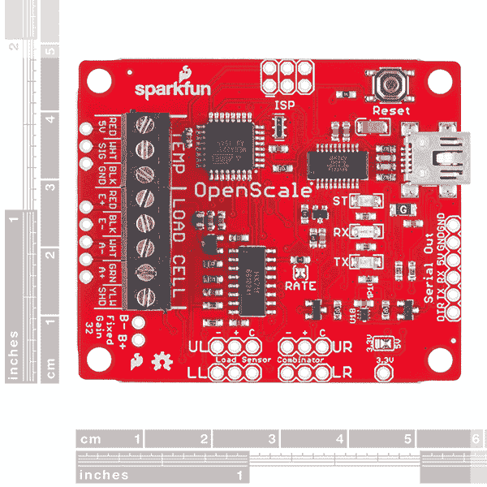](https://cdn.sparkfun.com/assets/parts/1/0/4/6/5/13261-02.jpg)

### 电压

OpenScale 设计为通过 USB 供电，但也可以通过稳压的 **5V** 电源从外部供电。

### 电流消耗

不同类型的称重传感器在其惠斯通电桥中使用不同尺寸的电阻。电阻越小，5V 时的电流越大。此外，OpenScale 将尝试对称重传感器进行循环供电，以减少局部应变计发热和整体功耗。状态 LED 和 USB 转串行 IC 也会影响当前的使用情况。考虑到这些因素，对于常规设置，在 5V 电压下，用户预期电流约为 80 至 100mA。

在以下条件下，基极电流消耗约为 **18mA** :

*   将 5V 调节至 FTDI 连接器上的 5V 引脚(无 USB 连接)
*   无负载连接
*   状态 LED 已禁用

对于低功耗应用，建议使用 OpenScale 的串行触发模式。该模式将允许 OpenScale 关断仪表放大器，并进入尽可能低的功耗状态。

## 接口规格

### 内置 USB 转串行转换器

默认情况下，OpenScale 以 TTL 级别 **9600bps 8-N-1** 进行通信。波特率可在 1200bps 至 1，000，000bps 范围内配置。大多数用户将使用 USB mini-B 连接来连接计算机。详见[如何安装 FTDI 驱动](https://learn.sparkfun.com/tutorials/how-to-install-ftdi-drivers/introduction)教程。

[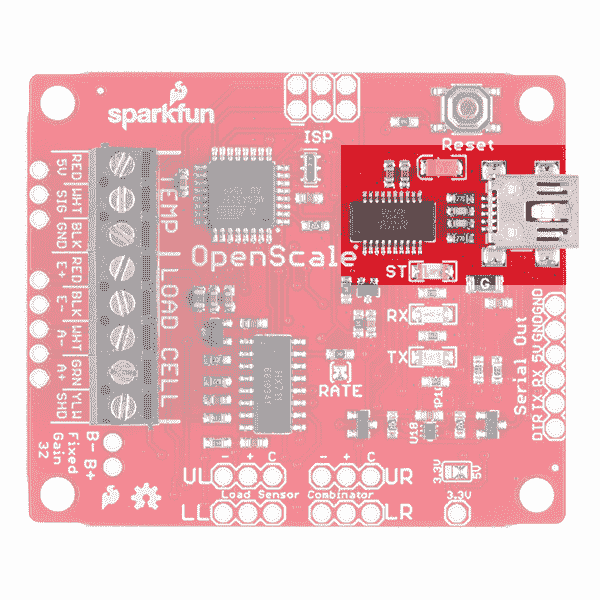](https://cdn.sparkfun.com/assets/learn_tutorials/3/7/4/OpenScale_USB_FTDI.jpg)

### 串行 UART 引脚

用户也可以通过 6 引脚串行接口进行通信。这是常见的 FTDI 型引脚排列。如果您需要将 OpenScale 连接到不支持 USB 主机的嵌入式系统，此接口非常有用。假设您正在关闭 OpenScale，OpenScale ->另一个 UART 设备之间的最小连接是三条线:5V->5V，GND->GND 和 TX->RX。

[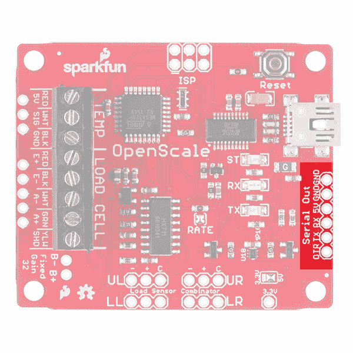](https://cdn.sparkfun.com/assets/learn_tutorials/3/7/4/OpenScale_SerialOut.jpg)*6-pin connector on the edge of OpenScale*

#### 串行输出

OpenScale 通过可见的 ASCII 字符和文本菜单系统进行配置。通过 USB 连接 OpenScale，用你[喜欢的终端软件](https://learn.sparkfun.com/tutorials/terminal-basics/all)打开 OpenScale 连接的 COM 口。默认情况下，OpenScale 以 9600bps 8-N-1 的速率进行通信。您应该会看到每隔几百毫秒就会显示以下内容。

[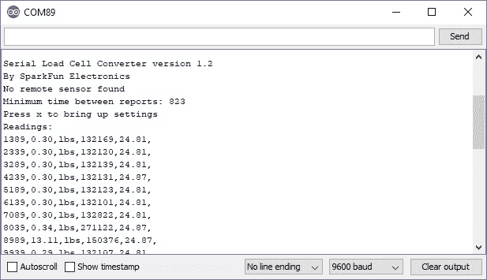](https://cdn.sparkfun.com/assets/learn_tutorials/3/7/4/OpenScale_v1_2_Load_Cell_ExampleOutput.jpg)

在任何时候按下`x`(或者用`Enter`键通过 Arduino 串行监视器发送字符)将调出配置菜单，如教程中稍后解释的[。](https://learn.sparkfun.com/tutorials/openscale-applications-and-hookup-guide#configuration)

## 连接称重传感器和温度传感器

OpenScale 使用[3.5 毫米螺丝端子](https://www.sparkfun.com/products/8235)连接称重传感器电线和外部温度传感器。[袖珍螺丝刀套件](https://www.sparkfun.com/products/12891)以及任何精密螺丝刀都可以很好地安装螺丝。

| [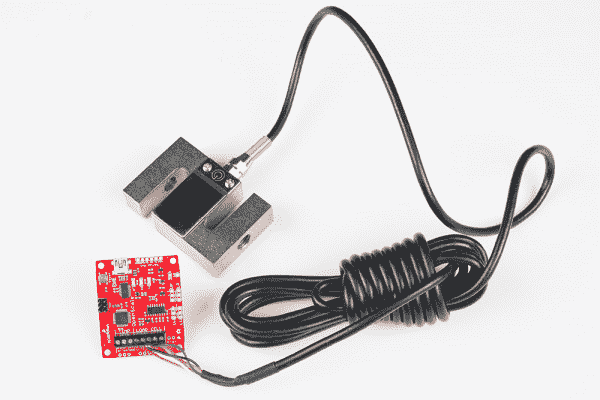](https://cdn.sparkfun.com/assets/learn_tutorials/3/7/4/Load_Cell_Combinator_Tutorial-01.jpg) | [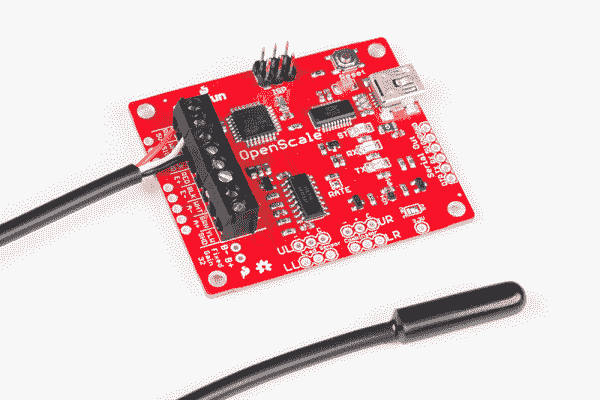](https://cdn.sparkfun.com/assets/learn_tutorials/3/7/4/Load_Cell_Combinator_Tutorial-09.jpg) |
| *200 千克称重传感器* | *DS18B20 外部温度传感器* |

大多数称重传感器都有红色/黑色/白色/绿色电线配置。将这些电线插入螺丝端子，并用手指拧紧端子。一些称重传感器使用蓝色电线代替绿色电线-不要担心，它仍然会工作！大容量或长连接电缆的称重传感器可能有一根额外的黄线，用于屏蔽四根信号线。如果你有这根线，也把它系上。

[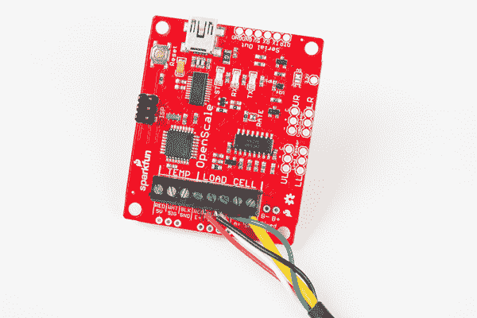](https://cdn.sparkfun.com/assets/learn_tutorials/3/7/4/Load_Cell_Combinator_Tutorial-02.jpg)*SparkFun Load Cells follow the general color convention described*

### 单一应变仪

如果您使用分立应变仪(例如我们的[50 千克负载传感器](https://www.sparkfun.com/products/10245))，您将需要使用内置[称重传感器组合器](https://www.sparkfun.com/products/13281)将四个应变仪组合成一个惠斯通电桥配置。更多信息请参见[称重传感器组合器连接指南](https://learn.sparkfun.com/tutorials/load-cell-amplifier-hx711-breakout-hookup-guide#combinator)。

[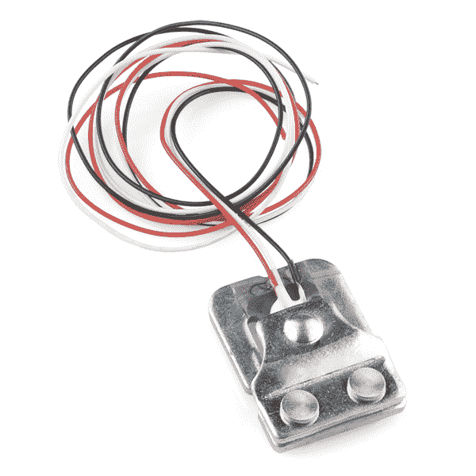](https://cdn.sparkfun.com/assets/learn_tutorials/3/7/4/SparkFun_Load_Sensor_10245-01.jpg)*This load sensor has only three wires*

OpenScale 还内置了称重传感器组合器。标记 **UL** 、 **UR** 、 **LL** 和 **LR** 分别代表左上、右上、左下和右下。就像你在浴室磅秤上看到的一样。C 标记是“中心抽头”,在应变仪教程中有解释。

[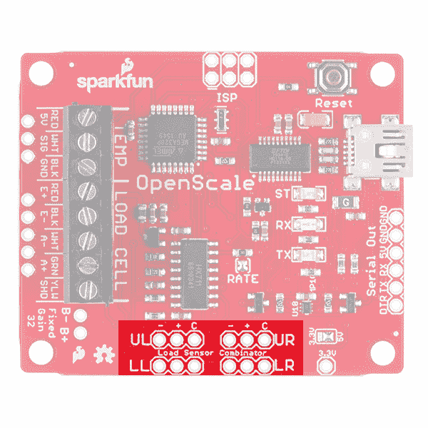](https://cdn.sparkfun.com/assets/learn_tutorials/3/7/4/OpenScale_combinator.jpg)*Load Cell Combinator*

## 配置

All settings are stored in non-volatile EEPROM and loaded during power up.

一旦 OpenScale 连接并报告到您的终端窗口，按下'`x`'(或使用`Enter`键通过 Arduino 串行监视器发送字符)调出配置菜单。

[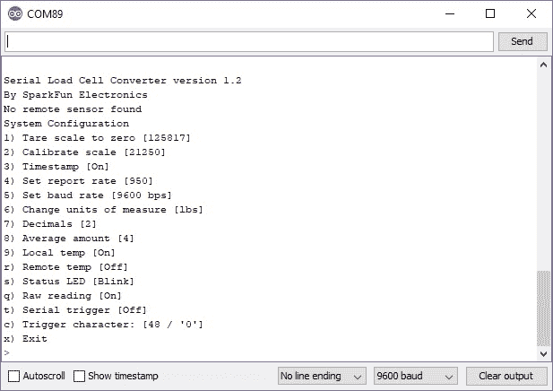](https://cdn.sparkfun.com/assets/learn_tutorials/3/7/4/OpenScale_Menu.jpg)

按相应的字母或数字来控制该设置。

**Note:** If you get OpenScale into an unknown configuration you can reset the board to safe defaults. Power down OpenScale, attach a jumper from RX to GND on the serial connector, then power up OpenScale. You should see the status LED blink rapidly for two seconds then at 1Hz. This indicates OpenScale has been reset to 9600bps. This will also reset all system settings to safe defaults.

### 皮重秤归零

用这个告诉 OpenScale 基本读数是多少。通过在配置菜单中发送一个值`1`,从秤台上移除所有不会永久存在的东西，并将秤台皮重归零。OpenScale 将读取一系列读数，对其进行平均，并将该值存储在非易失性 EEPROM 中。每次通电时，OpenScale 将使用该值作为“零”。

[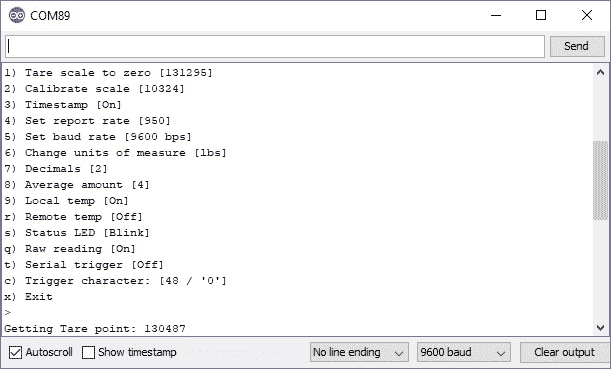](https://cdn.sparkfun.com/assets/learn_tutorials/3/7/4/OpenScale_Tare.jpg)

### [校准刻度](#calibrate)

用这个将您的秤校准到一个已知值。首先，从秤台上移除所有不会永久存在的物品，并将秤皮重归零(参见“**将秤皮重归零**”)。

接下来，将一个精确的已知质量放在您的天平上。然后通过发送配置菜单中的`2`选择**校准标尺**。

**Note:** If you are looking for sub +/-5% accuracy of your scale we recommend you leave this mass in place for around 30 minutes to allow for load cell creep (see '[Calibration Suggestions](https://learn.sparkfun.com/tutorials/openscale-applications-and-hookup-guide#calibration-suggestions)' for more information).

如果您使用的是**系列称重传感器转换器版本 1.2** ，提示会告诉您将已知重量放在秤上。将已知重量放在秤上后，发送另一个字符以进入校准过程的下一步。系统将提示您输入磅秤上的已知重量。在这种情况下，用另一种秤测量智能手机，记录为 0.3821 磅。输入 **0.3821** 后，需要输入额外的尾随 **0** 来填充数组。

[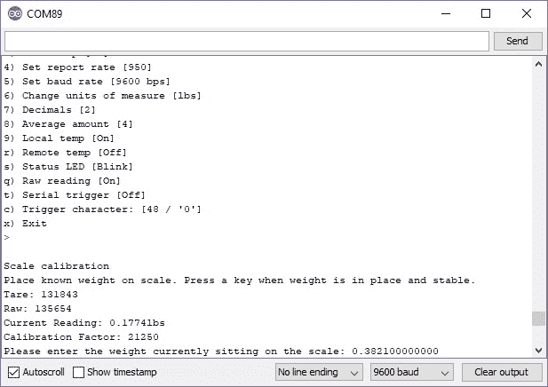](https://cdn.sparkfun.com/assets/learn_tutorials/3/7/4/OpenScale_Calibration.jpg)

一旦阵列被填充了 **0.382100000000** ，您将被带回到配置菜单。

[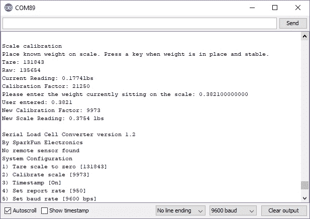](https://cdn.sparkfun.com/assets/learn_tutorials/3/7/4/OpenScale_Calibrated.jpg)**Firmware Version 1.0:** If you are using the older firmware (**Serial Load Cell Converter version 1.0**), the steps to calibrated the OpenScale are different:

Next use the ‘`a`’ and ‘`z`’ keys to increase or decrease the reading to match your mass. Holding ‘`a`’ or ‘`z`’ will change the calibration factor at a faster rate. Press ‘`x`’ once the reading closely matches the known weight.

[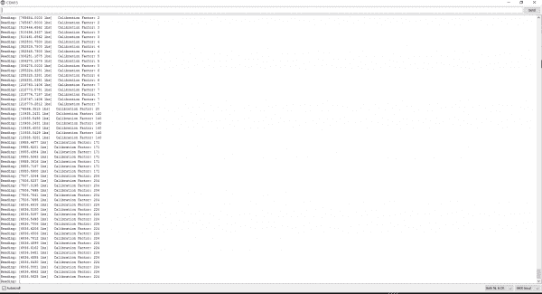](https://cdn.sparkfun.com/assets/learn_tutorials/3/7/4/Calibration.PNG)
*Calibrating to a 45 pound known mass with version 1.0 firmware.
Click the image for a closer look*

### 时间戳

这将启用或禁用每次读数开始时显示的毫秒时间戳。默认显示时间戳。

### 设置报告率

这控制 OpenScale 报告读数的频率。如果您需要非常精确的读数间隔时间或希望限制数据点的数量，这将非常方便。从配置菜单中选择后，使用“a”和“z”键增加或减少读数之间的时间间隔。报告间隔的默认值为 5Hz 或 200 毫秒。

当用户从配置菜单中选择“设置报告速率”时，系统会在通电时计算报告速率。最快的可能报告速率大约是 10.98 赫兹或报告之间的 91 毫秒。这一比率受许多因素的影响:

*   更快的波特率(115200bps)允许更快的文本打印
*   关闭时间戳和温度读数需要打印更少的字符
*   降低“平均量”设置将减少读取称重传感器所需的时间。
*   如果连接了远程温度传感器，大约需要 19 毫秒读取
*   减少小数位数会减少要打印的字符数

### 设置波特率

这控制 OpenScale 通信的波特率。默认情况下，OpenScale 以 9600bps 的速度运行。键入您想要的波特率，然后按回车键。OpenScale 将立即转到这个波特率。这可在 1200 至 1，000，000bps 范围内配置，但建议使用标准波特率(1200 的倍数:9600、57600、115200 等)。OpenScale 将尝试使用用户输入的波特率，但外来波特率的计时误差可能会变得很大，导致无法通信。

**Note:** If you get OpenScale into an unknown configuration you can reset the board to safe defaults. Power down OpenScale, attach a jumper from RX to GND on the serial connector, then power up OpenScale. You should see the status LED blink rapidly for two seconds then at 1Hz. This indicates OpenScale has been reset to 9600bps. This will also reset all system settings to safe defaults.

### 更改测量单位

这将在磅(lbs)和千克(kg)之间切换测量。将单位从 lbs 设置为 kgs 将改变校准系数以正确转换单位。这也将改变每个报告显示的文本。默认值为磅。

The units are arbitrary and are displayed to make the output easier to visually parse. If you have a very large or very small load cell you may need to calibrate your scale with a different unit (grams for example). To do this follow the standard method for calibration ignoring the displayed units.

### 小数

这控制显示的小数位数。默认为两个。

### 平均金额

这控制了平均多少读数。默认值为四。降低平均数量将允许更快的报告速率，但会增加报告中的噪音。

### 本地温度

这控制车载温度传感器的读数。默认显示当地温度。如果您需要用当地温度读数来校准您的秤读数，这是很有帮助的。板载传感器是 [TMP102 数字温度传感器](https://www.sparkfun.com/products/11931)。它非常精确，但需要最终用户校准。

Please note that the scale readings do not take the local or remote temperature readings into account. It is up to the user to post process these temperature readings to get the maximum scale accuracy.

### 远程温度

这控制非车载温度传感器的读数。如果通电时检测到传感器，默认显示远程温度。如果需要更高的精度，可以将一个 [DS18B20 单线温度传感器](https://www.sparkfun.com/products/11050)连接到电路板，以读取称重传感器的温度。它非常精确，但需要最终用户校准。

Please note that the scale readings do not take the local or remote temperature readings into account. It is up to the user to post process these temperature readings to get the maximum scale accuracy.

### 启用状态 LED

默认情况下，板载状态 LED 每隔一个读数闪烁一次。这可以关闭，以节省电力和用户的视力。

### 串行触发器

通电后，OpenScale 将在每个报告周期结束后报告重量读数(参见*设置报告速率*)。一旦启用串行触发选项，OpenScale 将停止报告并等待由输入的串行字符触发。任何传入的字符都将导致 OpenScale 醒来，进行读取、报告并返回低功耗睡眠。该设置对于节能很重要的远程应用很有价值。为了最大限度地节能，建议同时禁用状态 LED。默认情况下，不会被传入的串行字符触发。

## 校准建议

**蠕变**是在恒定负载下，所有环境条件和其他变量也保持不变的情况下，称重传感器信号随时间发生的变化。称重传感器往往会蠕动，这意味着当重量长时间(30 分钟以上)留在秤上时，它们的输出会随着时间的推移而略有变化。要校准将永久留在秤上的东西，如蜂箱:

*   将所有东西放在零状态的秤上(蜂箱加上任何静态压舱物)
*   将秤放置 30 多分钟
*   用这些砝码称量秤的皮重
*   将两个校准砝码放在秤上
*   将秤放置 30 多分钟
*   将秤校准到该组合重量
*   移除其中一个校准砝码，并验证秤的输出

有关称重传感器和蠕变的更多信息可在[这里](http://www.scalemanufacturers.org/pdf/loadcellapplicationtestguidelineapril2010.pdf)找到。蠕变也是称重传感器特有的。您可以在特定称重传感器的数据手册中找到关于蠕变的部分。随着温度和湿度的变化，每个季节都需要重复这种校准方法。

## 升级固件

**Note:** This code/library has been written and tested on Arduino IDE version 1.6.3\. Otherwise, make sure you are using the latest stable version of the Arduino IDE on your desktop.

If this is your first time using Arduino, please review our tutorial on [installing the Arduino IDE.](https://learn.sparkfun.com/tutorials/installing-arduino-ide) If you have not previously installed an Arduino library, please check out our [installation guide.](https://learn.sparkfun.com/tutorials/installing-an-arduino-library) If you've never connected an FTDI device to your computer before, you may need to install drivers for the USB-to-serial converter. Check out our [How to Install FTDI Drivers](https://learn.sparkfun.com/tutorials/how-to-install-ftdi-drivers) tutorial for help with the installation.

OpenScale 会不时推出新功能。使用 Arduino IDE，将新固件或您自己的定制固件加载到 OpenScale 非常容易。

OpenScale 附带 Optiboot 串行引导加载程序(115200bps，16MHz)。这允许在 Arduino IDE 下通过选择电路板子菜单上的' **Arduino/Genuino Uno** '对电路板进行重新编程。

要在 OpenScale 上编译并加载最新版本的固件:

*   通过 USB 将 OpenScale 连接到您的计算机。
*   直接从 [GitHub repo](https://github.com/sparkfun/OpenScale/archive/master.zip) 下载 OpenScale 固件，或者通过[检查存储库](https://learn.sparkfun.com/tutorials/using-github)下载(更高级，对大多数人来说没有必要)。
*   下载安装[博格德的 HX711 库](https://github.com/bogde/HX711)。
*   下载并安装 PJRC 的 OneWire 库。
*   打开位于 **/firmware/OpenScale/** 目录下的 *OpenScale.ino* 草图，点击验证。
*   在**工具**->-**板卡**子菜单下选择 **Arduino Uno** 。
*   在**工具**->-**端口**子菜单下选择右边的 COM 端口。
*   上传代码。
*   与你最近的邻居击掌。

**OpenScale Firmware:** The OpenScale firmware is open source and is available on [SparkFun's GitHub repo](https://github.com/sparkfun/OpenScale). Please consider contributing or recommending future features by using the GitHub [issue tracker](https://github.com/sparkfun/OpenScale/issues).

## 项目:兔子研究

本节将介绍一个你可以用 OpenScale 做的小项目。

### 背景

大约七个月前，我从内华达州的拉斯维加斯搬到了科罗拉多州。我从来没有吃过草。我有石头和人行道。我在 Loveland 的家有 1/3 英亩的草地，我们很喜欢它(驼鹿，我的狗也是)。起初，我觉得这四只兔子很可爱。但是，它们开始繁殖，现在已经超过十只了。由于它们对后院绿色植物贪得无厌，我的草变得参差不齐。我甚至不会把我打扫的所有小便便都拿出来，但我已经这么做了。我决心结束他们对草的渴望。

输入 OpenScale。我的计划是用一个旧狗屋创建一个诱人而友好的陷阱，在里面装满兔子食物，在喂食器和日志下面放一个秤，使用重量测量和时间戳来跟踪这些小家伙何时喂食。在收集了足够多的数据后，我会移走狗屋，并在喂食时间关闭洒水装置，以阻止这些可爱的草坪破坏者。如果他们的喂食时间没有规律，我会放弃，增加一个额外的狗屋，提供美食，并希望他们远离草地。

[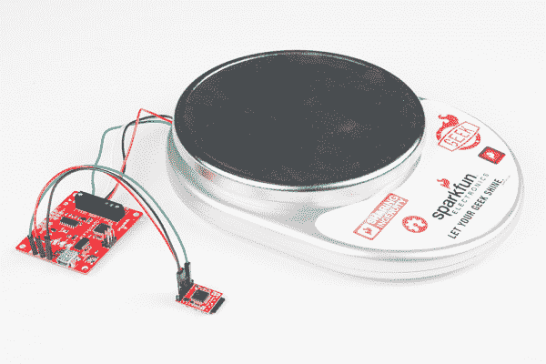](https://cdn.sparkfun.com/assets/learn_tutorials/3/7/4/Load_Cell_Combinator_Tutorial-06.jpg)

对于这个项目，您将需要以下零件:

[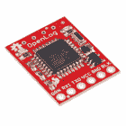](https://www.sparkfun.com/products/13712) 

将**添加到您的[购物车](https://www.sparkfun.com/cart)中！**

**[In stock](https://learn.sparkfun.com/static/bubbles/ "in stock") DEV-13712

SparkFun OpenLog 可以存储或“记录”大量的串行数据，并充当某种黑匣子。

$16.9522[Favorited Favorite](# "Add to favorites") 87[Wish List](# "Add to wish list")**** 

将**添加到您的[购物车](https://www.sparkfun.com/cart)中！**

### [称重传感器- 10kg，直杆(TAL220)](https://www.sparkfun.com/products/13329)

[In stock](https://learn.sparkfun.com/static/bubbles/ "in stock") SEN-13329

这种直杆测压元件(有时称为应变仪)可以将高达 10kg 的压力(力)转化为电…

$9.503[Favorited Favorite](# "Add to favorites") 20[Wish List](# "Add to wish list")****[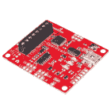](https://www.sparkfun.com/products/13261) 

将**添加到您的[购物车](https://www.sparkfun.com/cart)中！**

### [spark fun open scale](https://www.sparkfun.com/products/13261)

[In stock](https://learn.sparkfun.com/static/bubbles/ "in stock") SEN-13261

SparkFun OpenScale 是一款简单易用的开源重量和温度测量解决方案。它有能力研究…

$34.5021[Favorited Favorite](# "Add to favorites") 28[Wish List](# "Add to wish list")**** 

将**添加到您的[购物车](https://www.sparkfun.com/cart)中！**

### [【带适配器的 microSD 卡-32GB(10 类)](https://www.sparkfun.com/products/14832)

[In stock](https://learn.sparkfun.com/static/bubbles/ "in stock") COM-14832

这是一个 10 级 32GB microSD 存储卡，非常适合容纳单板计算机和多种…

$26.951[Favorited Favorite](# "Add to favorites") 1[Wish List](# "Add to wish list")******** ********这是一个厨房秤，拆开后用 OpenScale 重新组装起来。你可以在上面的图片中看到，里面只是一个简单的 10kg 称重传感器，就像 SparkFun 出售的[称重传感器](https://www.sparkfun.com/products/13329)。我不想改变称重传感器的安装，因为这是最棘手的部分，所以我添加了一些彩色电线，以便轻松地连接到 OpenScale 的螺丝端子。

[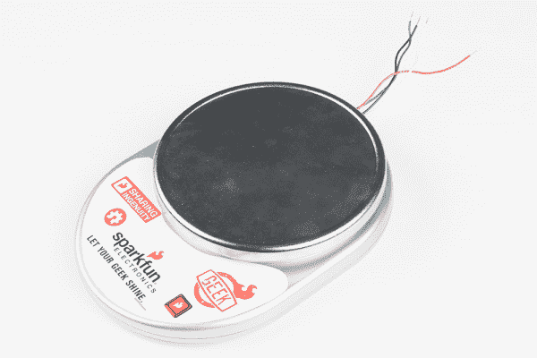](https://cdn.sparkfun.com/assets/learn_tutorials/3/7/4/Load_Cell_Combinator_Tutorial-04.jpg)An $8.00 kitchen scale found on Amazon.comOpened it up to show that it is simply a 10kg load cell mounted really well

### 五金器具

这些联系很简单。称重传感器通过将彩色电线与 OpenScale 上相应的螺丝端子匹配来连接。OpenLog 通过“串行输出”端口连接，尽管记录数据只需要 TX 到 RX、5V 到 VCC 和 GND 到 GND (OpenScale 到 OpenLog 顺序)。通过 USB 供电，以 9600 的波特率打开一个串口。将底部的设置改为“无行尾”也有助于防止配置菜单弹出几次。在这里，您可以去皮、校准和称重。

[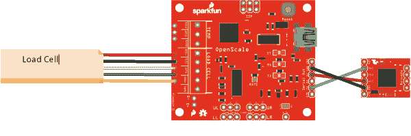](https://cdn.sparkfun.com/assets/learn_tutorials/3/7/4/rabbitScale.png)

为了使您的应用程序可移动，添加一个带有可充电电池组的外部电源、太阳能电池以及 [Sunny Buddy](https://learn.sparkfun.com/tutorials/sunny-buddy-solar-charger-v13-hookup-guide-?_ga=1.38693219.1788647015.1453914745) ，您的场外电子秤将能够自给自足。

### 软件

不需要额外的软件！但是，需要完成配置菜单中的一些步骤。当您的项目完成后，通过 USB 为 OpenScale 供电，并打开一个串行终端窗口。我只使用 Arduino 中的终端。为了防止配置菜单在监视器中多次弹出，将右下角的设置更改为“**无行尾**”。发送命令“`1`”至秤重。发送命令“`2`，按照[过程校准](https://learn.sparkfun.com/tutorials/openscale-applications-and-hookup-guide#calibrate)，你就可以开始了。

### 把所有的放在一起

一旦校准了 OpenScale，并且 OpenLog 准备好接收数据，就可以设置陷阱并等待一些数据了！你可以在下面的视频中了解更多关于兔子秤的信息。

[https://www.youtube.com/embed/HZtXN-KcssA/?autohide=1&border=0&wmode=opaque&enablejsapi=1](https://www.youtube.com/embed/HZtXN-KcssA/?autohide=1&border=0&wmode=opaque&enablejsapi=1)

## 资源和更进一步

既然您已经成功地启动并运行了 OpenScale，那么是时候将它整合到您自己的项目中了！有关更多信息，请查看以下资源:

*   [示意图(PDF)](https://cdn.sparkfun.com/assets/learn_tutorials/3/7/4/SparkFun_openScale_schematic.pdf)
*   [老鹰文件(ZIP)](https://cdn.sparkfun.com/assets/learn_tutorials/3/7/4/OpenScale_EagleFiles.zip)
*   [Arduino 代码(邮编)](https://cdn.sparkfun.com/datasheets/Sensors/ForceFlex/SparkFun_OpenScale_Arduino.zip)
*   [粒子草图(ZIP)](https://cdn.sparkfun.com/datasheets/Sensors/ForceFlex/SparkFun_OpenScale_Particle.zip)
*   开源代码库
    *   [HX711 Arduino 库](https://github.com/bogde/HX711)
    *   [产品回购](https://github.com/sparkfun/OpenScale)
*   [SFE 产品展示区](https://youtu.be/HZtXN-KcssA)

谷歌是你的朋友。查看秤制造商的[称重传感器应用指南](http://www.scalemanufacturers.org/pdf/loadcellapplicationtestguidelineapril2010.pdf)。也可以搜索“蜂巢称重传感器”，看看用户是如何监控蜂巢的生长和健康的。需要一些灵感吗？查看 SparkFun Beehive 项目，该项目使用 OpenScale 来监控位于 SparkFun 总部的蜂巢，请使用下面的链接。

[SparkFun Internet-Connected Beehive](http://makezine.com/projects/bees-sensors-monitor-hive-health)

或者查看一些相关教程:

 [### 物联网产业规模](https://learn.sparkfun.com/tutorials/iot-industrial-scale) What does a baby elephant weigh? How much impact force does a jump have? Answer these questions and more by building your very own IoT industrial scale using the SparkFun OpenScale.[Favorited Favorite](# "Add to favorites") 9 [### 物联网重量记录秤](https://learn.sparkfun.com/tutorials/iot-weight-logging-scale) This tutorial will show you how to make a scale that logs your weight to a custom website on the Internet. The principles can be extrapolated to any type of data.[Favorited Favorite](# "Add to favorites") 8 [### Qwiic 秤连接指南](https://learn.sparkfun.com/tutorials/qwiic-scale-hookup-guide) Create your own digital scale quickly and easily using the Qwiic Scale 4

* * *

请通过评论教程向我们报告错别字，不准确，尤其是不清楚的解释。欢迎并高度重视改进建议。对于固件请求或错误，请[在](https://github.com/sparkfun/OpenScale/issues) [OpenScale repo](https://github.com/sparkfun/OpenScale) 的 GitHub 问题页面上发布问题。**********************