# 驻极体话筒分线板连接指南

> 原文：<https://learn.sparkfun.com/tutorials/electret-mic-breakout-board-hookup-guide>

## 介绍

准备好为您的下一个项目添加音频了吗？ [SparkFun 驻极体麦克风突破](https://www.sparkfun.com/products/12758)将驻极体麦克风(100Hz - 10kHz)与 60 倍麦克风前置放大器相结合，以放大声音、掌声、敲门声或任何足以被微控制器的模数转换器拾取的声音。

[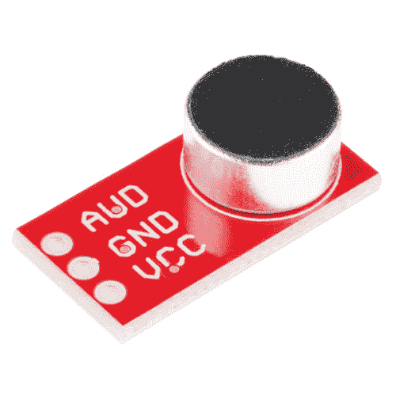](https://www.sparkfun.com/products/12758) 

将**添加到您的[购物车](https://www.sparkfun.com/cart)中！**

### [SparkFun 驻极体话筒突破](https://www.sparkfun.com/products/12758)

[In stock](https://learn.sparkfun.com/static/bubbles/ "in stock") BOB-12758

这款小型分线板将一个驻极体麦克风(100Hz - 10kHz)与一个 60 倍麦克风前置放大器耦合在一起，以放大…

$7.507[Favorited Favorite](# "Add to favorites") 35[Wish List](# "Add to wish list")*****All in one tiny package!*

驻极体麦克风突破通过捕捉麦克风中两个导电板(一个是振动膜，另一个是固定的)之间的声波，并将它们转换为电波，从而转换振幅(而不是音量)。这些电信号随后被放大，并被微控制器的 ADC 拾取。在本教程中，我们将介绍两个不同的项目，帮助您快速启动并运行下一个声音反馈项目。

### 所需材料

对于本教程，您只需要一些工具和组件。

[](https://www.sparkfun.com/products/13975) 

将**添加到您的[购物车](https://www.sparkfun.com/cart)中！**

### [spark fun red board——用 Arduino 编程 T3](https://www.sparkfun.com/products/13975)

[In stock](https://learn.sparkfun.com/static/bubbles/ "in stock") DEV-13975

SparkFun RedBoard 结合了 UNO 的 Optiboot 引导程序的简单性、FTDI 的稳定性和 shield com…

$21.5049[Favorited Favorite](# "Add to favorites") 89[Wish List](# "Add to wish list")****[](https://www.sparkfun.com/products/12002) 

将**添加到您的[购物车](https://www.sparkfun.com/cart)中！**

### [【试验板-不干胶(白色)](https://www.sparkfun.com/products/12002)

[In stock](https://learn.sparkfun.com/static/bubbles/ "in stock") PRT-12002

这是你的尝试和真正的白色无焊试验板。它有 2 条电源总线，10 列，30 行，总共 400 个连接…

$5.5048[Favorited Favorite](# "Add to favorites") 93[Wish List](# "Add to wish list")****[](https://www.sparkfun.com/products/116) 

将**添加到您的[购物车](https://www.sparkfun.com/cart)中！**

### [破开头球——直击](https://www.sparkfun.com/products/116)

[In stock](https://learn.sparkfun.com/static/bubbles/ "in stock") PRT-00116

一排标题-打破适应。40 个引脚，可切割成任何尺寸。用于定制 PCB 或通用定制接头。

$1.7520[Favorited Favorite](# "Add to favorites") 133[Wish List](# "Add to wish list")****[](https://www.sparkfun.com/products/8431) 

将**添加到您的[购物车](https://www.sparkfun.com/cart)中！**

### [跳线高级 6 "米/米装 10 根](https://www.sparkfun.com/products/8431)

[In stock](https://learn.sparkfun.com/static/bubbles/ "in stock") PRT-08431

这是一个 SparkFun 独家！这些是 155 毫米长、26 AWG 跳线，两端都有公接头。用这些来跳离…

$4.502[Favorited Favorite](# "Add to favorites") 11[Wish List](# "Add to wish list")******** ********### 推荐阅读

如果您不熟悉或不习惯以下概念，我们建议您先通读这些概念，然后再继续阅读驻极体话筒 BOB 连接指南。

[](https://learn.sparkfun.com/tutorials/how-to-use-a-breadboard) [### 如何使用试验板](https://learn.sparkfun.com/tutorials/how-to-use-a-breadboard) Welcome to the wonderful world of breadboards. Here we will learn what a breadboard is and how to use one to build your very first circuit.[Favorited Favorite](# "Add to favorites") 79[](https://learn.sparkfun.com/tutorials/what-is-an-arduino) [### 什么是 Arduino？](https://learn.sparkfun.com/tutorials/what-is-an-arduino) What is this 'Arduino' thing anyway? This tutorials dives into what an Arduino is and along with Arduino projects and widgets.[Favorited Favorite](# "Add to favorites") 50[](https://learn.sparkfun.com/tutorials/analog-vs-digital) [### 模拟与数字](https://learn.sparkfun.com/tutorials/analog-vs-digital) This tutorial covers the concept of analog and digital signals, as they relate to electronics.[Favorited Favorite](# "Add to favorites") 66

## 硬件概述

### 五金器具

驻极体话筒分线板只有三个引脚: **VCC、GND 和奥德**。您可以从 **3.3V 到 5V** 为该设备供电，因此它是对大多数微控制器单元的极大补充。对于放大，我们使用德州仪器 OPA344 轨到轨精密放大器，为您提供最大输出摆幅。

[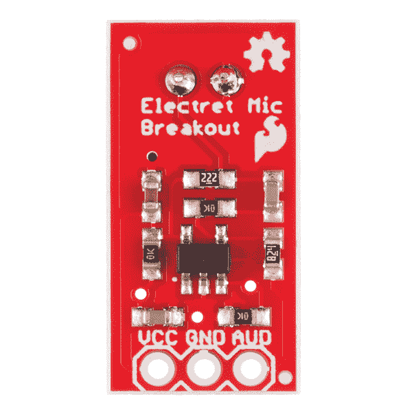](https://cdn.sparkfun.com/assets/learn_tutorials/4/8/5/12758-04.jpg)

### 图解的

放大器的增益由 R5/R4 设置，约为 82V/V。仿真和测试将增益设置为接近 60V/V

[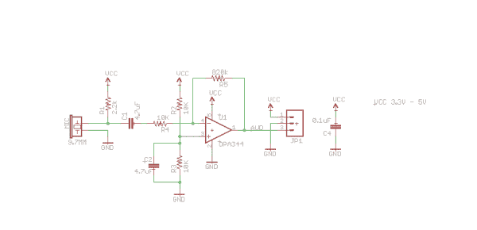](https://cdn.sparkfun.com/datasheets/BreakoutBoards/Electret_Microphone_Breakout_v20.pdf)*Click the image for a closer look.*

### 录放幅频响应

[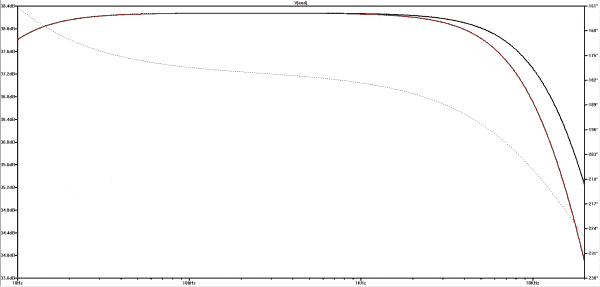](https://cdn.sparkfun.com/assets/learn_tutorials/4/8/5/Frequency_Response_Big.PNG)*Click the image for a closer look.*

这告诉你，你会在整个频谱上看到相同的增益，由话筒拾取(100Hz-10KHz)。放大器的输入偏置在 1/2 VCC。麦克风输出的极小交流电压依赖于 DC 偏移，并通过 OPA344 放大。“AUD”引脚的输出也是电源电压的 1/2，因此它可以直接连接到微控制器的 ADC。在安静条件下，理想情况下，ADC 读取 10 位转换器的 1/2 满量程或 512。

## 示例电路和代码

我们将进行一个非常简单的项目，让您根据微控制器采集的 ADC 值开始点亮 RedBoard 上的 LED。

这是门环。检测到爆震时，LED 将亮起。

[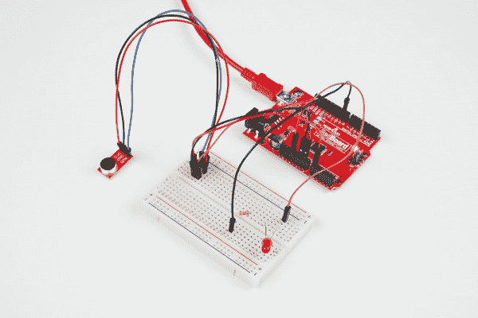](https://cdn.sparkfun.com/assets/learn_tutorials/4/8/5/Electret_Mic_BreakOut_Board_Hookup_Guide-01.jpg)[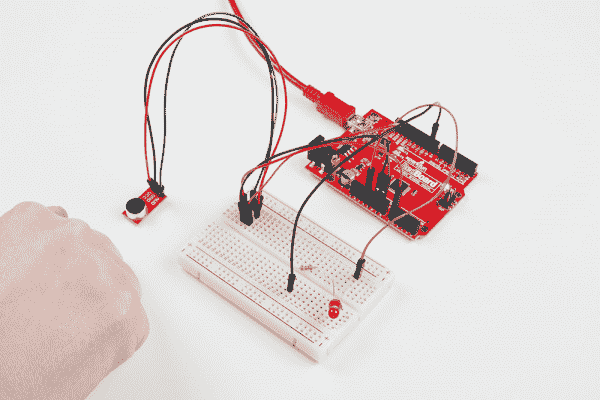](https://cdn.sparkfun.com/assets/learn_tutorials/4/8/5/Electret_Mic_BreakOut_Board_Hookup_Guide-02.jpg)

### 进行以下连接

驻极体麦克风 BOB → RedBoard

*   VCC → 3.3V
*   GND → GND
*   AUD → A0(或任何模拟引脚)
*   LED+ →数字引脚 9
*   LED- → GND

[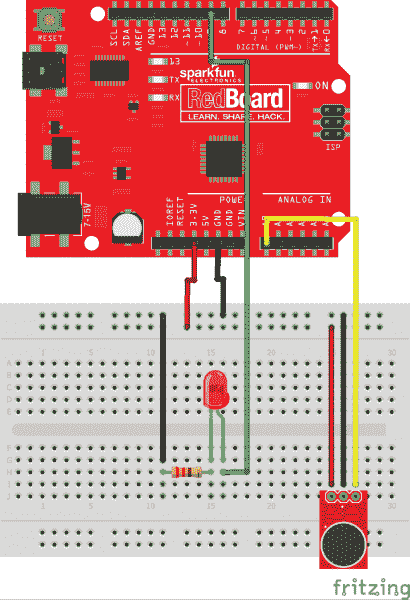](https://cdn.sparkfun.com/assets/learn_tutorials/4/8/5/Knocker_1.png)

**注意:**此示例假设您在桌面上使用的是最新版本的 Arduino IDE。如果这是你第一次使用 Arduino，请回顾我们关于[安装 Arduino IDE 的教程。](https://learn.sparkfun.com/tutorials/installing-arduino-ide)

If you have not previously installed an Arduino library, please check out our [installation guide.](https://learn.sparkfun.com/tutorials/installing-an-arduino-library)

打开 Arduino IDE 并创建一个新项目。

```
language:c
 /*
 * The Circuit: 
 * Connect AUD to analog input 0
 * Connect GND to GND
 * Connect VCC to 3.3V (3.3V yields the best results)
 *  
 *  To adjust when the LED turns on based on audio input:
 *  Open up the serial com port (Top right hand corner of the Arduino IDE)
 *  It looks like a magnifying glass. Perform several experiments 
 *  clapping, snapping, blowing, door slamming, knocking etc and see where the
 *  resting noise level is and where the loud noises are. Adjust the if statement
 *  according to your findings.
 *  
 *  You can also adjust how long you take samples for by updating the "SampleWindow"
 * 
 * This code has been adapted from the
 * Example Sound Level Sketch for the
 * Adafruit Microphone Amplifier
 * 
 */

const int sampleWindow = 250; // Sample window width in mS (250 mS = 4Hz)
unsigned int knock;
int ledPin = 9;

void setup() 
{
   Serial.begin(9600);
  pinMode(ledPin, OUTPUT);
}

void loop() 
{
 unsigned long start= millis();  // Start of sample window
 unsigned int peakToPeak = 0;   // peak-to-peak level

 unsigned int signalMax = 0;
 unsigned int signalMin = 1024;

 // collect data for 250 miliseconds
 while (millis() - start < sampleWindow)
 {
   knock = analogRead(0);
      if (knock < 1024)  //This is the max of the 10-bit ADC so this loop will include all readings
      {
         if (knock > signalMax)
         {
           signalMax = knock;  // save just the max levels
         }
      else if (knock < signalMin)
        {
         signalMin = knock;  // save just the min levels
         }
     }
 }
 peakToPeak = signalMax - signalMin;  // max - min = peak-peak amplitude
 double volts = (peakToPeak * 3.3) / 1024;  // convert to volts

Serial.println(volts);
 if (volts >=1.0)
 {
  //turn on LED
  digitalWrite(ledPin, HIGH);
   delay(500);
  Serial.println("Knock Knock");
 }
 else
 {
 //turn LED off
 digitalWrite(ledPin, LOW);
 }             
} 
```

一旦你加载并运行了程序，你的硬件连接上了，当你敲门的时候，你应该会看到连接在红板上的第 9 个管脚上的 LED 灯亮了。查看使用相同代码的**风言风语提醒**,只增加了几行代码，以获得额外的实践和项目灵感。

## 空谈警报

你有一个话太多的同事吗？你想用最不起眼的桌面装饰品来提醒你生活中那些喋喋不休的人他们的过错吗？你喜欢糟糕表达的直译吗？那就给自己做个嗦警报吧。这个粗鲁的小硬件将会用你偷来的寂静的空气给一个袋子充气(我的一个狗狗嘟嘟袋)。

[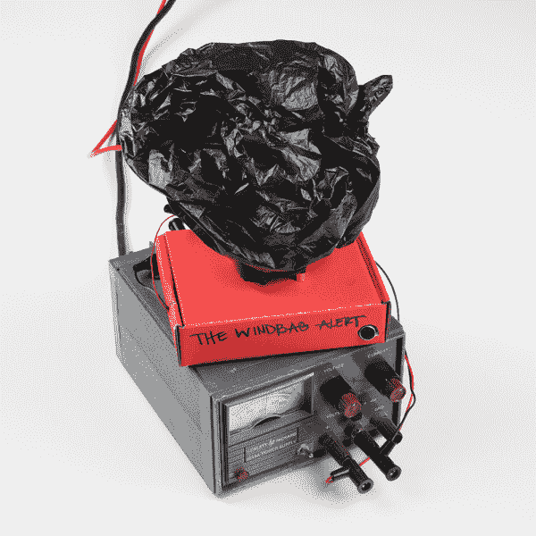](https://cdn.sparkfun.com/assets/learn_tutorials/4/8/5/Electret_Mic_BreakOut_Board_Hookup_Guide-03.jpg)

这里袋子瘪了，但驻极体话筒在监听。如果 ADC 值长时间高于某个阈值，气囊将开始膨胀。

[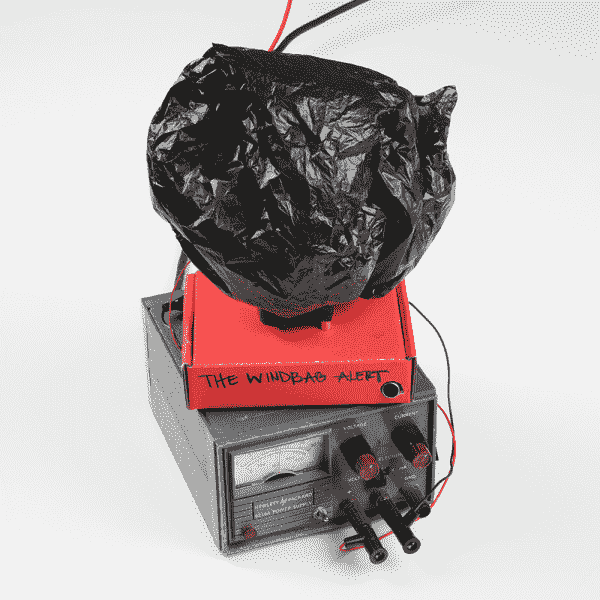](https://cdn.sparkfun.com/assets/learn_tutorials/4/8/5/Electret_Mic_BreakOut_Board_Hookup_Guide-04.jpg)

这里，有人讲了大概 30 秒。在气囊完全充气之前，他们只有几秒钟的时间。风扇的启动通常会让他们立刻停下来。

[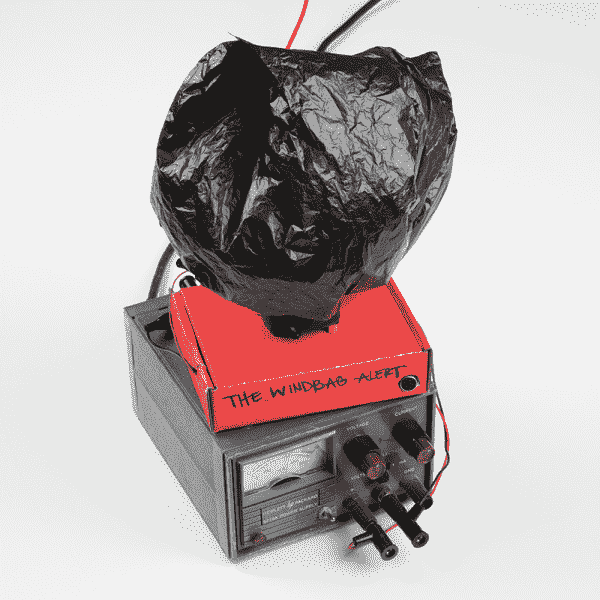](https://cdn.sparkfun.com/assets/learn_tutorials/4/8/5/Electret_Mic_BreakOut_Board_Hookup_Guide-05.jpg)

但是，有些人，那些人，不在乎。并且气囊完全膨胀。提醒*那个*人他们确实是办公室嗦。

让我们把这东西拆开。这个项目只是上一节 LED 闪烁项目的延续。

### 五金器具

我用了一个 12V 的电脑风扇，因为那是我放在周围的。你可以使用任何风扇，甚至可以拆卸一元店的手持冷却风扇。

[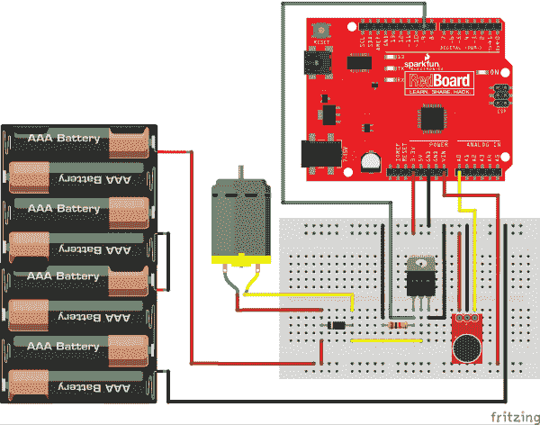](https://cdn.sparkfun.com/assets/learn_tutorials/4/8/5/WindBagAlert2_bb.png)*Fritzing diagram of the Windbag Alert with the AAA batteries representing a 12V power supply. Click the image for a closer look.*

我使用一个旧的 SparkFun 盒子作为我的项目外壳，它位于我工作台上的电源上。我用绝缘胶带在电脑风扇周围包了一个塑料袋。在盒子顶部和风扇之间有大约 1/2 英寸的空间。我在那里用了支架。确保有足够的空气流动。

### 软件

```
language:c
const int sampleWindow = 250; // Sample window width in mS (250 mS = 4Hz)
unsigned int sample;
int Wind = 9;

void setup() 
{
  Serial.begin(9600);
  pinMode(Wind, OUTPUT);
}

void loop()     
{
unsigned long startMillis= millis();  // Start of sample window
unsigned int peakToPeak = 0;   // peak-to-peak level

unsigned int signalMax = 0;
unsigned int signalMin = 1024;

// collect data for 1 second
while (millis() - startMillis < sampleWindow)
{
      sample = analogRead(0);
    if (sample < 1024)  //This is the max of the 10-bit ADC so this loop will include all readings
    {
         if (sample > signalMax)
        {
            signalMax = sample;  // save just the max levels
         }
         else if (sample < signalMin)
         {
            signalMin = sample;  // save just the min levels
         }
      }
   }
  peakToPeak = signalMax - signalMin;  // max - min = peak-peak amplitude
 double volts = (peakToPeak * 3.3) / 1024;  // convert to volts

Serial.println(volts);
if (volts >=0.5)
{
    //turn on FAN
    digitalWrite(Wind, HIGH);
delay(1000);
  digitalWrite(Wind, LOW);
delay(75);
  digitalWrite(Wind, HIGH);
delay(75);
  digitalWrite(Wind, LOW);
delay(75);
  digitalWrite(Wind, HIGH);
delay(75);
  digitalWrite(Wind, LOW);
delay(75);
  digitalWrite(Wind, HIGH);
delay(75);
   }
  else
  {
  //turn FAN off
 digitalWrite(Wind, LOW);
 }             
} 
```

我建议玩玩延迟，这样你就可以微调你的机器来满足你的需求。

## 寻找驻极体飞艇

在研究软机器人时，我在 [Instructables](http://www.instructables.com/id/Ollie-a-DIY-autonomous-robotic-blimp/?ALLSTEPS) 上看到了这个项目，并爱上了它的简单性以及它对那些与之相关的人的影响。Pritika Nilaratna 开发了这个社交尴尬的自主飞艇，以互动和争夺你的注意力。我做了一个，并将分享如何创建自己可爱的电子飞船。我用她的平台做了这个项目，但基于 SparkFun Inventor 的工具包中使用的伺服代码创建了代码，所以，如果你有了 [SIK](https://www.sparkfun.com/products/12060) ，你就差不多可以做你自己的声音反应浮动东西了。请使用 Attribution-share like 3.0 Unported 许可证共享您的项目。

### 软式飞艇所需的零件:

[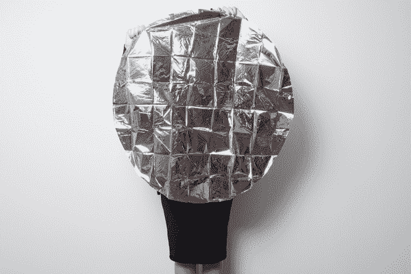](https://cdn.sparkfun.com/assets/learn_tutorials/4/8/5/Electric_Mic_Tutorial-01.jpg)*36" envelope Mylar Balloon. The Balloon needs to be big.*[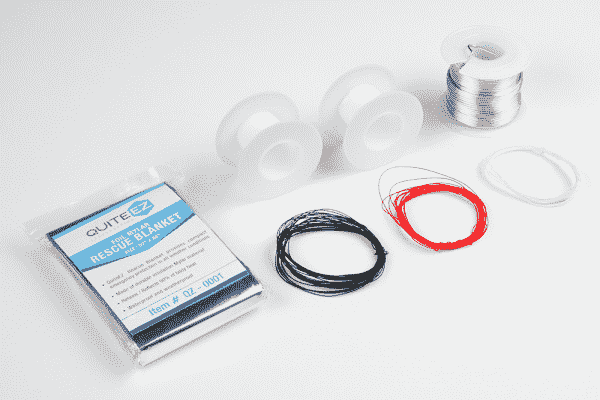](https://cdn.sparkfun.com/assets/learn_tutorials/4/8/5/Electric_Mic_Tutorial-03.jpg)*Two small empty wire spools (or plastic cups), 16 AWG jewelry wire, emergency blanket, 30 AWG wire wrapping wire.*

你还需要热胶水、透明包装胶带、氦气(在一家派对用品店找到一个罐子)和一个烙铁来把它们组装在一起。

### 五金器具

硬件非常简单。连接电池和开关、开关和 Pro Mini 以及驻极体话筒和 Pro Mini 的电线应尽可能短。从伺服系统到 Pro Mini 的电线需要大约一英尺长。使用绕线使在一个点获得多个连接更容易，而且更轻。我将电池贴在 Pro Mini 的背面，将驻极体麦克风贴在正面。最终，我会做一顶小礼帽来装所有的电子产品，然后带着芬的新帽子去喝茶。

[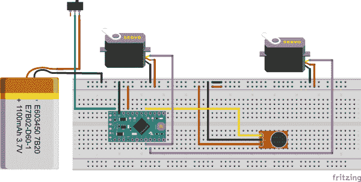](https://cdn.sparkfun.com/assets/learn_tutorials/4/8/5/FinBlimp_1.png)

我建议先在一块面包板上制作原型，弄清楚哪个马达是左马达，哪个是右马达。先试装所有东西也有助于你使用适量的电线，这样你就不会短路。

### 软件

使用以下代码对 Fin 进行编程。

```
language:c
//Fin the Electret Blimp is the original creation of
//Pritika Nilaratna 
//Ollie is Licensed under the Attribution-ShareAlike 3.0 Unported License
//Please share your projects under the same license! 
//Code Developed from Sparkfun SIK
//Hardware and Design adopted from Ollie

#include <Servo.h> // Servo Library 
Servo servoL; //Left Servo Control Object 
Servo servoR; //Right Servo control Object 

//Sound variables
const int sampleWindow = 250; // Sample window width in mS (250 mS = 4Hz)
unsigned int sound;

void setup()
{ 
  servoL.attach(5);  // attaches the left servo on pin 5
  servoR.attach(6);  // attached the right servo on pin 6
  Serial.begin(9600); // open the serial port at 9600 bps:
 }

void loop()
{
  int position=0;
  servoL.write(0); //Set the position of Left fin
  servoR.write(0); //set the position of Right fin

  //set up sound detection 
  unsigned long start= millis();  // Start of sample window
  unsigned int peakToPeak = 0;    // peak-to-peak level
  unsigned int signalMax = 0;    
  unsigned int signalMin = 1024;

  // collect data for 250 miliseconds
  while (millis() - start < sampleWindow)
   {
     sound = analogRead(0);
       if (sound < 1024)  //This is the max of the 10-bit ADC so this loop will include all readings
         {
           if (sound > signalMax)
            {
              signalMax = sound;  // save just the max levels
            }
           else if (sound < signalMin)
            {
               signalMin = sound;  // save just the min levels
            }
         }  
   }
  peakToPeak = signalMax - signalMin;  // max - min = peak-peak amplitude
  double volts = (peakToPeak * 3.3) / 1024;  // convert to volts
  Serial.print("Volts:");
  Serial.print("\t");
  Serial.println(volts);
  if (volts >=1.0)
   {    

    //To make your Blimp seem more excited copy and paste 
    // the "Up Motion" and "Down Motions" as many 
    //Time as you'd like. Right now his fins will flap
    //4 times. 

     Serial.println("HEY!! HELLO!!"); //Should have named it NAVI
     for (position =0; position <= 75; position +=5)//Up Motion
        {
        servoL.write(position); //move Left Fin to next position
        servoR.write(position); //move Right Fin to next position 
        delay(20);
        }
      for (position = 75; position>=0; position -=5)//Down Motion
        {
         servoL.write(position); //move Left Fin to Next position
         servoR.write(position); // move Right Fin to Next position
         delay(20);
        }
      for (position =0; position <= 75; position +=5)//Up motion
        {
        servoL.write(position); //move Left Fin to next position
        servoR.write(position); //move Right Fin to next position 
        delay(20);
        }
      for (position = 75; position>=0; position -=5) // Down Motion
        {
         servoL.write(position); //move Left Fin to Next position
         servoR.write(position); // move Right Fin to Next position
         delay(20);
        }  
        delay(800); // This delay helps the elecret mic recover from hearing
        //the sound of the Servo motors.      
    }   
}

//end. Change it up and show us if you've made one and how you modified it! 
```

### 建筑

#### 做翅膀

[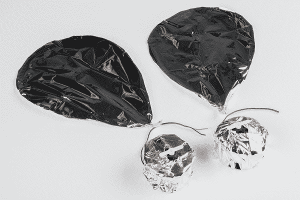](https://cdn.sparkfun.com/assets/learn_tutorials/4/8/5/Electric_Mic_Tutorial-05.jpg)

使用 16 号珠宝线制作翅膀的形状。它可以是你喜欢的任何形状，只要你用同样多的金属丝做两个。记住，气球两边的重量需要平衡，这样它才不会倒向一边(除非那是你要去的地方)。把你新做的金属丝形状放在 maylar 应急毯上，用胶水粘住。一定要把铁丝网的顶部和底部盖住，这样看起来会很漂亮。为此，我使用了 Weldwood Contact 水泥，但我相信任何胶水都可以。修剪边缘，并留下一个小电线挂在底部的翅膀尖，所以你有一些重视 tso 的伺服。

#### 制作伺服外壳

[连接线](https://www.sparkfun.com/products/8022)的火花线轴，当清空时，为微型伺服系统提供了极好的轻质外壳。伺服的嘴唇只是勉强赶上线轴中心的边缘，这就是我热粘在适当的位置。在线轴上也有孔，这是一个完美的位置，可以让伺服电机的电线穿过。用 maylar 急救毯把这个包起来，用尽可能少的胶带来固定。你可以用小纸杯或塑料杯重复同样的过程。为了将翅膀连接到伺服系统上，我使用了伺服系统附带的喇叭，并将多余的电线热粘在伺服附件上。当你开始测试时，手边放一个记号笔，这样你就可以标记哪个是左，哪个是右。

#### 附上翅膀

[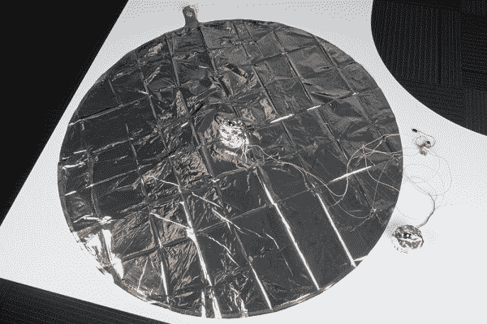](https://cdn.sparkfun.com/assets/learn_tutorials/4/8/5/Electric_Mic_Tutorial-06.jpg)

气球放气后平放在一个表面上，找到中间的位置，用一点透明的包装带固定伺服外壳。确保它是平的，你不想在充气的时候撕破气球。这里是你要确保你切断自己足够的电线。我预算了 18 英寸的电线，结果太长了。当两个机翼都连接在一起时，电子设备在底部的悬挂不应超过 2 英寸。我想 12 英寸的电线应该可以了。

[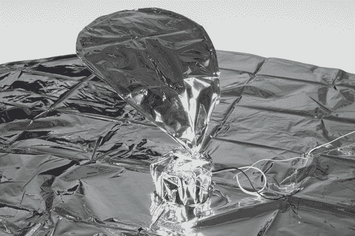](https://cdn.sparkfun.com/assets/learn_tutorials/4/8/5/Electric_Mic_Tutorial-07.jpg)

用胶带把另一边的翅膀粘住，放在同一个地方。做一次试运行(找人帮忙——这是两个人的工作),以确保左右鳍正常工作。

### 充气！

一旦翅膀固定好，给气球充入氦气，滑动开关，用电池给 Pro Mini 供电。

[](https://cdn.sparkfun.com/assets/learn_tutorials/4/8/5/Electric_Mic_Tutorial-08.jpg)

### 玩吧！

[https://www.youtube.com/embed/9xt77ZloAQY/?autohide=1&border=0&wmode=opaque&enablejsapi=1](https://www.youtube.com/embed/9xt77ZloAQY/?autohide=1&border=0&wmode=opaque&enablejsapi=1)

我用了同样的方法，在接机指南和废话警报中寻找“伏特”。我使用了来自**spark fun Inventor ' s Kit:Experiment 8:Driving a Servo Motor**的代码，并为这个项目进行了修改。Pritika 的电机功能的伺服代码是令人难以置信的，有一点多的技巧。她的代码还为伺服电机函数使用了不同的库。如果你使用她的代码，你只需要做一些修改。首先下载并打开[software servo . h library](http://playground.arduino.cc/ComponentLib/Servo)文件。将“# include<WP program . h>”替换为“#include < Arduino.h >”，然后确保该库位于您的 Arduino 文件路径中。如果你想看更多普里蒂卡的作品，你可以找到原版的[奥利](http://ollie.nilaratna.com/)和[其他作品](http://www.nilaratna.com/)。Ollie 是在知识共享署名-共享 3.0 未授权许可下注册的，因此在相同的许可下共享您的项目。

## 资源和更进一步

在谷歌上快速搜索“驻极体话筒突破”，你就能找到你想要创作的任何类型的项目。以下是我从 [Instructables](http://www.instructables.com/id/Electret-microphone/) 中喜欢的几个。

如果你需要为你的下一个项目添加声音，但需要一些更敏感、更强大或更有用的东西，我推荐 SparkFun [声音检测器](https://www.sparkfun.com/products/12642)。

### 文档

*   [OPA344 数据手册](http://www.ti.com/product/OPA344)
*   [驻极体电容麦克风数据手册](http://cdn.sparkfun.com/datasheets/Sensors/Sound/CEM-C9745JAD462P2.54R.pdf)
*   [驻极体话筒转接 GitHub 报告](https://github.com/sparkfun/Electret_Microphone_Breakout/tree/Revision)

要获得更多音频乐趣，请查看其他精彩的 SparkFun 教程:

[](https://learn.sparkfun.com/tutorials/sparkpunk-sequencer-theory-and-applications-guide) [### 火花朋克音序器理论和应用指南](https://learn.sparkfun.com/tutorials/sparkpunk-sequencer-theory-and-applications-guide) Examine the inner workings of the SparkPunk Sequencer, then explore some modifications and alternate applications.[Favorited Favorite](# "Add to favorites") 3[](https://learn.sparkfun.com/tutorials/hackers-in-residence-the-sound-visualizer) [### 黑客住宅:声音可视化](https://learn.sparkfun.com/tutorials/hackers-in-residence-the-sound-visualizer) A fun project that uses a Raspberry Pi and a custom Java app to create your own sound visualizer using a RGB LED matrix.[Favorited Favorite](# "Add to favorites") 2[](https://learn.sparkfun.com/tutorials/interactive-led-music-visualizer) [### 交互式 LED 音乐可视化器](https://learn.sparkfun.com/tutorials/interactive-led-music-visualizer) Use an Arduino and the SparkFun Sound Detector to create visualizations on Addressable RGB LED strips.[Favorited Favorite](# "Add to favorites") 27[](https://learn.sparkfun.com/tutorials/vox-imperium-stormtrooper-voice-changer) [### 帝国之声:冲锋队变声器](https://learn.sparkfun.com/tutorials/vox-imperium-stormtrooper-voice-changer) Add some flair to your Imperial uniform by changing your voice using a Teensy 3.2 and Prop Shield.[Favorited Favorite](# "Add to favorites") 8

或者看看这篇博客来寻找灵感:

[](https://www.sparkfun.com/news/2269 "January 5, 2017: Using slow shutter-speed photography to capture sound waveforms") [### 英语日报:声波印刷

January 5, 2017](https://www.sparkfun.com/news/2269 "January 5, 2017: Using slow shutter-speed photography to capture sound waveforms")[Favorited Favorite](# "Add to favorites") 1**********