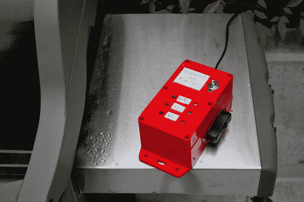

# 有害气体监测器

> 原文：<https://learn.sparkfun.com/tutorials/hazardous-gas-monitor>

## 介绍

### Phant 不再运行了

Unfortunately Phant, our data-streaming service, is no longer in service. The system has reached capacity and, like a less-adventurous Cassini, has plunged conclusively into a fiery and permanent retirement. There are several other maker-friendly, data-streaming services and/or IoT platforms available as alternatives. The three we recommend are Blynk, ThingSpeak, and Cayenne. You can read our [blog post on the topic](https://www.sparkfun.com/news/2413) for an overview and helpful links for each platform. The code in this tutorial will need to be adjusted to work with the other data streams.

As an example, try looking at the [Photon Remote Water Level Sensor Tutorial](https://learn.sparkfun.com/tutorials/photon-remote-water-level-sensor) which uses ThingSpeak.

制作一个便携式气体监测器，检查你家、社区或旅途中有害气体的危险水平，防止你的朋友在汽油大战中点燃香烟。*

* *请注意，这仅是电影参考，在现实生活中应该避免汽油打架。*

[](https://cdn.sparkfun.com/assets/learn_tutorials/5/3/1/FinalMonitor_Outside1.jpg)

本教程向您展示如何为三种危险气体构建一个联网的“金丝雀”监视器:[液态丙烷气体(“LPG”)](https://www.sparkfun.com/products/9405)、[甲烷(又名天然气)](https://www.sparkfun.com/products/9404)和[一氧化碳(“CO”)](https://www.sparkfun.com/products/9403)。使用[粒子光子微控制器](https://www.sparkfun.com/products/13774)，传感器读数被转换成百万分率(“PPM”)并上传到[data.sparkfun.com 网络服务](http://data.sparkfun.com)。

观看下面的视频，了解危险气体监测器的工作情况:

[https://www.youtube.com/embed/ZYmHkNEIEmo/?autohide=1&border=0&wmode=opaque&enablejsapi=1](https://www.youtube.com/embed/ZYmHkNEIEmo/?autohide=1&border=0&wmode=opaque&enablejsapi=1)

### 有用的背景信息

1.  [如何设置粒子光子。](https://docs.particle.io/guide/getting-started/intro/core/)
2.  [将数据推送到 data.sparkfun.com 网络服务器。](https://learn.sparkfun.com/tutorials/pushing-data-to-datasparkfuncom/all)
3.  继电器新手？看看这份方便的参考资料。
4.  [这里有一个关于 N 沟道 MOSFET 的有用概述。](http://bildr.org/2012/03/rfp30n06le-arduino/)
5.  为了给光子供电，这里有一个关于光子电池屏蔽的完整指南。
6.  强烈建议仔细阅读三种气体传感器的数据手册。
    1.  [LPG 传感器数据表](https://cdn.sparkfun.com/datasheets/Sensors/Biometric/MQ-6%20Ver1.3%20-%20Manual.pdf)
    2.  [甲烷传感器数据表](https://cdn.sparkfun.com/datasheets/Sensors/Biometric/MQ-4%20Ver1.3%20-%20Manual.pdf)
    3.  [一氧化碳传感器数据表](https://cdn.sparkfun.com/datasheets/Sensors/Biometric/MQ-7%20Ver1.3%20-%20Manual.pdf)

#### 选择电池

本项目中使用的气体传感器需要相当大的电流，5V 时每个传感器约 0.17 mA。为了使系统便于携带，我们需要一个大容量电池。一个简单又实惠的选择是串联使用四节(可充电)AA 电池。这些电池将持续约 4 小时。

另一种选择是使用锂离子电池(“LIB”)。LIBs 的容量比 AAs 高，但通常在较低的电压下运行。如果您选择此选项，当您计算传感器值或使用晶体管或其他组件提升电池电压时，您可能需要包括一个校正系数。

下表显示了几种不同电池选项的大致寿命。

[](https://cdn.sparkfun.com/assets/learn_tutorials/5/3/1/Table2_BatteryCap3Sensors.jpg)

如果这一切听起来令人困惑，这里有一个更全面的教程。

### 材料

要跟随本教程，您需要以下内容:

[](https://cdn.sparkfun.com/assets/learn_tutorials/5/3/1/SensorMaterials_1.jpg)

#### 微控制器和附件

*   [粒子光子微控制器](https://www.sparkfun.com/products/13774)
*   [SparkFun 光子电池护罩](https://www.sparkfun.com/products/13626)
*   一块 2000 毫安时[聚合物锂离子电池](https://www.sparkfun.com/products/8483)
*   [表面贴装 DC 筒式千斤顶](https://www.sparkfun.com/products/12748)
*   [桶形插孔到 USB 电源线](https://www.sparkfun.com/products/8639)
*   [一(1)个灯开关](https://www.sparkfun.com/products/11477)
*   可选:公母 JST 连接器电缆

#### 气体传感器电路

*   [一(1)个项目案例](https://www.sparkfun.com/products/11366)
*   一(1) [4 节 AA 电池盒](https://www.sparkfun.com/products/552)
*   四(4)节 AA 充电电池
*   [一(1)个拨动开关(SPST 开关)](https://www.sparkfun.com/products/9276)
*   [压电蜂鸣器](https://www.sparkfun.com/products/7950)
*   [三(3)个红色发光二极管](https://www.sparkfun.com/products/10632)
*   三(3)个 10kω电阻器
*   [一(1)块印刷电路板](https://www.sparkfun.com/products/12070)
*   [22 号绞线](https://www.sparkfun.com/products/11375)
*   可选:电气连接器(3-5 个)

##### 液化石油气(MQ6)气体传感器

*   [MQ6 液化石油气传感器](https://www.sparkfun.com/products/9405)
*   [气体传感器接线板](https://www.sparkfun.com/products/8891)
*   一(1)个 4.7kω电阻器
*   一(1)个 [5V 电压调节器](https://www.sparkfun.com/products/107)

##### 甲烷(MQ4)气体传感器

*   [MQ4 甲烷气体传感器](https://www.sparkfun.com/products/9404)
*   [气体传感器接线板](https://www.sparkfun.com/products/8891)
*   一(1)个 4.7kω电阻器
*   一(1)个 [5V 电压调节器](https://www.sparkfun.com/products/107)

##### 一氧化碳(MQ7)气体传感器

*   [MQ7 一氧化碳气体传感器](https://www.sparkfun.com/products/9403)
*   [气体传感器接线板](https://www.sparkfun.com/products/8891)
*   一(1)个 4.7kω电阻器
*   一(1)个 [5V 电压调节器](https://www.sparkfun.com/products/107)
*   一(1)个 [5V SPDT 继电器](https://www.sparkfun.com/products/100)
*   一(1)个 [1N4148 二极管](https://www.sparkfun.com/products/8588)
*   一(1) [N 沟道 MOSFET](https://www.sparkfun.com/products/10213)
*   一(1)个[10kω电位计](https://www.sparkfun.com/products/9806)
*   一(1)个 10kω电阻器

### 工具

*   烙铁
*   钢丝钳/剥离器
*   钻头
*   螺丝刀
*   环氧树脂(或热熔胶)

## 建造它

下面是危险气体监控电路的烧结图。由于我们使用光子电池屏蔽突破，请确保将电线连接到屏蔽的引脚，而不是直接连接到图像中所示的粒子光子的头部引脚。此外，LiPo 电池将连接到粒子光子下面的光子电池屏蔽的 JST 连接器**。**

[](https://cdn.sparkfun.com/assets/learn_tutorials/5/3/1/HazardousGasMonitor_Corrected.png)*Click the image for a closer look.***Note:** The LiPo Battery in the Fritzing diagram is connected to the Particle Photon's VBAT pin for illustration. It should be connected to the Photon Battery Shield's JST connector. After making the connections on the Particle Photon's header pins and inserting the LiPo battery into the JST connector, you will stack the Particle Photon on the shield.

1.  将气体传感器分线板焊接到气体传感器上。方向并不重要，只要确保丝网印刷(也就是标签)面朝下，这样你就可以阅读它们(必须通过艰苦的方式学习)..).将电线焊接到气体传感器分线板。

    [](https://cdn.sparkfun.com/assets/learn_tutorials/5/3/1/SensorBreadkoutCLoseUp.jpg)
2.  将三个稳压器焊接到 PCB 板上。对于每个调节器，将蓄电池正极输出连接到调节器输入，并将中间电压调节器引脚接地。

    [](https://cdn.sparkfun.com/assets/learn_tutorials/5/3/1/PCBVoltReg1and2.jpg)
3.  连接 LPG (MQ6)和甲烷(MQ4)传感器。

    [](https://cdn.sparkfun.com/assets/learn_tutorials/5/3/1/PCB_MQ6_MQ4.jpg)

    对于每个传感器:

    1.  将 H1 和 A1 连接到其中一个电压调节器的输出端(建议使用电连接器)。
    2.  将 GND 接地。
    3.  将 B1 连接到光子模拟引脚(LPG 连接到 A0，甲烷连接到 A1)
    4.  在 B1 和地之间连接一个 4.7kω电阻。[](https://cdn.sparkfun.com/assets/learn_tutorials/5/3/1/PCBFull_MQ6_MQ4.jpg)
4.  连接 CO (MQ7)气体传感器。

    [](https://cdn.sparkfun.com/assets/learn_tutorials/5/3/1/MQ7_Materials1.jpg)

    另外:MQ7 传感器要求加热器电压(H1)在 1.5V(持续 90 秒)和 5V(持续 60 秒)之间循环。一种方法是使用由光子触发的继电器(借助 MOSFET 和电位计)，当继电器不通电时，H1 两端的电压为 5V，当继电器通电时，H1 两端的电压约为 1.5v。

    1.  将 GND 接地。
    2.  将 B1 连接到光子模拟引脚(A2)。将 4.7kω电阻从 B1 连接到地。
    3.  将 A1 连接到第三稳压器输出(5V 电源)。
    4.  将 Photon 3.3V 引脚连接到正继电器输入。
    5.  将光子数字引脚 D7 连接到左 MOSFET 引脚，并将一个 10kω电阻接地。
    6.  将中间 MOSFET 引脚连接到继电器接地引脚。将右 MOSFET 引脚接地。
    7.  将继电器常开(“NO”)引脚连接到 A1，将常闭(“NC”)引脚连接到中间电位计引脚。
    8.  将右电位计引脚连接到地，左引脚连接到 A1。
    9.  将继电器公共(“COM”)引脚连接到 H1。
    10.  当继电器通电时，调整电位计电阻，直到它将继电器输出改变到约 1.5V。
5.  将一个 LED 和 10kω电阻连接到每个光子数字引脚 D0、d 1 和 D2。将蜂鸣器连接到光子数字引脚 D4。

    [](https://cdn.sparkfun.com/assets/learn_tutorials/5/3/1/PCB_LEDs1.jpg)
6.  连接电池组和 PCB 板电源之间的拨动开关。*建议为电池组配备一个电连接器，以便于更换电池。*

    [](https://cdn.sparkfun.com/assets/learn_tutorials/5/3/1/SwitchWires1_1.jpg)
7.  将电线焊接到光子电池屏蔽分接头上。

    [](https://cdn.sparkfun.com/assets/learn_tutorials/5/3/1/PhotonBatteryShield_Wires.jpg)
8.  将灯开关连接在 LIB 和光子电池屏蔽罩之间-建议为此使用额外的 JST 电缆，以保持 LIB 电池电缆完好无损(并使安装灯开关更容易)。

9.  为电子产品制作一个外壳！

    [](https://cdn.sparkfun.com/assets/learn_tutorials/5/3/1/Case_Marked1.jpg)
    1.  在箱盖上为拨动开关钻孔。
    2.  在箱盖上钻 3 个孔，让 LED 灯通过，钻 3 个孔让气体传感器与空气接触。将部件粘在盖子内侧。

        [](https://cdn.sparkfun.com/assets/learn_tutorials/5/3/1/Case_LEDTest4.jpg)
    3.  在外壳侧面钻一个孔，让桶形插孔 USB 线连接到光子电池屏蔽。

        [](https://cdn.sparkfun.com/assets/learn_tutorials/5/3/1/Case_BarrelJackCable.jpg)
    4.  在外壳侧面钻两个小孔，用于安装灯开关电缆。将灯开关粘在外壳侧面。

    5.  在外壳外部贴上 led 及其相应气体传感器的标签。[](https://cdn.sparkfun.com/assets/learn_tutorials/5/3/1/FinalSystem_SensorCloseUp.jpg)
10.  检查电气连接，如果一切正常，在电气连接上涂上环氧树脂或热熔胶。

    [](https://cdn.sparkfun.com/assets/learn_tutorials/5/3/1/FinalSystem2.jpg)

## 计算气体传感器 PPM

每个气体传感器输出一个从 0 到 4095 的模拟值。要将该值转换为电压，请使用以下公式:

```
Sensor Voltage = AnalogReading * 3.3V / 4095 
```

一旦获得传感器电压，就可以利用气体传感器数据手册第 5 页的灵敏度校准曲线将其转换为百万分之一(PPM)读数。为此，通过从图表中选取数据点或使用像 [Engauge 数字化仪](http://digitizer.sourceforge.net/)这样的图形分析软件重新创建灵敏度曲线。

y 轴为 PPM，x 轴为 V_RL，其中 V_RL 为传感器电压。这种方法有很大的误差空间，但它会给我们足够的精度来识别危险气体的危险水平。LPG 和甲烷传感器的估计误差大约为 20 PPM，CO 传感器的误差大约为 5 PPM。

[](https://cdn.sparkfun.com/assets/learn_tutorials/5/3/1/MQ7_SensitivityPlot_CurvePoints.jpg)

接下来，找出 PPM 与 V_RL 曲线的近似公式。我使用指数拟合(例如，y = e^x)并得到以下等式:

```
LPG sensor: PPM = 26.572*e^(1.2894*V_RL)

Methane sensor: PPM = 10.938*e(1.7742*V_RL)

CO sensor: PPM = 3.027*e^(1.0698*V_RL) 
```

## 编程吧

首先，在[data.sparkfun.com 服务](http://data.sparkfun.com)上建立一个数据流。接下来，编写一个程序，读入每个气体传感器的模拟值，将其转换为 PPM，并对照已知的安全阈值进行检查。根据 OSHA 安全标准，这三种气体的阈值如下:

*   液化石油气:1,000 PPM
*   甲烷:1,000 PPM
*   一氧化碳:50 PPM

如果您想快速上手并运行，或者是编程新手，请随意从下面获取代码，或者您可以从 GitHub 存储库中获取最新的文件。按原样使用它，或者根据您的特殊需要进行修改。

[Hazardous Gas Monitor GitHub Repository](https://github.com/jenfoxbot/HazardousGasMonitor)

```
language:c
// This #include statement was automatically added by the Particle IDE.
//This library is used to push data to the data.sparkfun.com server.
#include "SparkFunPhant/SparkFunPhant.h"
#include "math.h" 

//This code was written by Jennifer Fox <jenfoxbot@gmail.com>
/*
 * ----------------------------------------------------------------------------
 * "THE Coffee-WARE LICENSE" (Revision 42):
 * <jenfoxbot@gmail.com>  wrote this file.  As long as you retain this notice you
 * can do whatever you want with this stuff. If we meet some day, and you think
 * this stuff is worth it, you can buy me a coffee in return.
 * ----------------------------------------------------------------------------
 */

//Variables to push data to data.sparkfun.com host -- Change publicKey[] and privateKey[]
const char server[] = "data.sparkfun.com"; // Phant destination server
const char publicKey[] = "INSERT_PUBLIC_KEY_HERE"; // Phant public key
const char privateKey[] = "INSERT_PRIVATE_KEY_HERE"; // Phant private key

Phant phant(server, publicKey, privateKey); // Create a Phant object

const unsigned long postingRate = 20000; //Post rate to data.sparkfun.com (time in milliseconds)
unsigned long lastPost = millis(); //Keeps track of posting rate

//Define analog pins on Photon to use for sensors
const int LPG = A0;
const int NG = A1;
const int CO = A2;

//Define digital pins on Photon to use for LEDs,  buzzer, and MQ7 (CO sensor) heater
const int LPGled = D0;
const int NGled = D1;
const int COled = D2;
const int buzzer = D3;
const int CORelayPin = D6;
const int COVoltPin = D7;

//Set up raw signal and PPM variables for each gas sensor
int LPGRaw;
int NGRaw;
int CORaw;

int LPGppm;
int NGppm;
int COppm;

//Set safety threshold levels for each  hazardous gas
const int  LPGthresh = 1000;
const int NGthresh = 1000;
const int COthresh = 50;

//Set variables for CO sensor (MQ7) voltage cycle
unsigned long startMillis;        
unsigned long switchTimeMillis;
const int CO_5V_Interval = 60000; //60s for 5V interval
const int CO_1_5V_Interval = 90000; //90s for 1.5V interval
bool heaterInHighPhase;

void setup() {
    Serial.begin(9600);

    //Initialize LED and buzzer output pins
    pinMode(LPGled, OUTPUT);
    pinMode(NGled, OUTPUT);
    pinMode(COled, OUTPUT);
    pinMode(buzzer, OUTPUT);

    //Initialize CO sensor heater pins
    pinMode(CORelayPin, OUTPUT);
    pinMode(COVoltPin, OUTPUT);

    //Set start time (for CO sensor heater voltage)
    startMillis = millis();
    turnHeaterHigh();
}

void loop() {
    //Cycle CO sensor (MQ7) heater voltage

    if(heaterInHighPhase){
    // 5V phase - check to switch
        if(millis() > switchTimeMillis) {
        turnHeaterLow();
        }
    }
    else {
    // 1.4V phase - check to switch
        if(millis() > switchTimeMillis) {
        turnHeaterHigh();
        }
    }

    //Read in analog value from each gas sensor -- use function defined below to measure CO sensor at end of voltage cycle
    LPGRaw = analogRead(LPG); 
    NGRaw = analogRead(NG);
    CORaw = measureCOSensor();

    //Caclulate the PPM of each gas sensor using the funtions defined below            
    LPGppm = LPG_ppm(LPGRaw); 
    NGppm = NG_ppm(NGRaw); 
    COppm = CO_ppm(CORaw);

    //Serial monitor print for debugging and checking data 
    Serial.println(NGRaw);
    Serial.println(NGppm);
    delay(1000);

    //Check gas sensor measurements against safety thresholds
    checkThreshold(LPGppm, NGppm, COppm);

    //Wait to post until ~ 20s has lapsed
    if (lastPost + postingRate < millis()) {  
        Serial.println("Reading!");

        postToPhant(LPGppm, NGppm, COppm); //Post gas sensor readings and unit (PPM) to your data stream at data.sparkfun.com

        lastPost = millis();
    }

}

//Functions to calculate PPM from Photon analog reading
//Each equation is determined by visually picking points, plotting PPM v. V_RL, then fitting a trendline to the curve (exponential)
//Calculate LPG PPM
int LPG_ppm(double rawValue){

    double ppm = 26.572*exp(1.2894*(rawValue*3.3/4095)); //Multiply raw analog value by 3.3/4095 to convert to a voltage
    return ppm;
}

//Calculate NG PPM
int NG_ppm(double rawValue){

    double ppm = 10.938*exp(1.7742*(rawValue*3.3/4095)); 
    return ppm;
}

//Calculate CO PPM
int CO_ppm(double rawValue){

    double ppm = 3.027*exp(1.0698*(rawValue*3.3/4095));
    return ppm;
}

//Function to check PPM reading with maximum safe PPM threshold
//Include a margin of error (currently 10%)
void checkThreshold(int lpgppm, int ngppm, int coppm){
    int led1;
    int led2;
    int led3;

    if (lpgppm >= LPGthresh*0.9){
        digitalWrite(LPGled, HIGH);
        led1 = TRUE;
    } 
    else{
        digitalWrite(LPGled, LOW);
        led1 = FALSE;
    }

    if (ngppm >= NGthresh*0.9){
        digitalWrite(D1, HIGH);
        led2 = TRUE;
    } 
    else{
        digitalWrite(NGled, LOW);
        led2 = FALSE;
    }

    if (coppm >= COthresh*0.9){
        digitalWrite(D2, HIGH);
        led3 = TRUE;
    } 
      else{
        digitalWrite(COled, LOW);
        led3 = FALSE;
    }

    if(led1 | led2 | led3){
        digitalWrite(buzzer, HIGH);
    }

    else{digitalWrite(buzzer, LOW);}

}

//Functions to switch heater voltage on MQ7 (CO) sensor
void turnHeaterHigh(){
  // 5v phase
  digitalWrite(COVoltPin, LOW);
  digitalWrite(CORelayPin, HIGH);

  heaterInHighPhase = true;
  switchTimeMillis = millis() + CO_5V_Interval;
}

void turnHeaterLow(){
  // 1.4v phase
  digitalWrite(COVoltPin, HIGH);
  digitalWrite(CORelayPin, LOW);

  heaterInHighPhase = false;
  switchTimeMillis = millis() + CO_1_5V_Interval;
}

//Function to read CO sensor voltage (just before switching to 1.5V)
int measureCOSensor(){
  unsigned int gasLevel = analogRead(CO);
  unsigned int time = (millis() - startMillis) / 1000;
  delay(time);

  return gasLevel;
}

//Function to post data to data.sparkfun.com host
//Many thanks to Jim Lindblom <jim@sparkfun.com> for the sample code and Phant library.
int postToPhant(int lpg, int ng, int co){

    phant.add("lpg", lpg); //Data stream field name "sensorvalue1"
    phant.add("ng", ng); //Data stream field name "sensorvalue2"
    phant.add("co", co); //Data stream field name "sensorvalue3"

    TCPClient client;
    char response[512];
    int i = 0;
    int retVal = 0;

    if (client.connect(server, 80)) // Connect to the server
    {
        // Post message to indicate connect success
        Serial.println("Posting!"); 

        // phant.post() will return a string formatted as an HTTP POST.
        // It'll include all of the field/data values we added before.
        // Use client.print() to send that string to the server.
        client.print(phant.post());
        delay(1000);
        // Now we'll do some simple checking to see what (if any) response
        // the server gives us.
        while (client.available())
        {
            char c = client.read();
            Serial.print(c);    // Print the response for debugging help.
            if (i < 512)
                response[i++] = c; // Add character to response string
        }
        // Search the response string for "200 OK", if that's found the post
        // succeeded.
        if (strstr(response, "200 OK"))
        {
            Serial.println("Post success!");
            retVal = 1;
        }
        else if (strstr(response, "400 Bad Request"))
        {   // "400 Bad Request" means the Phant POST was formatted incorrectly.
            // This most commonly ocurrs because a field is either missing,
            // duplicated, or misspelled.
            Serial.println("Bad request");
            retVal = -1;
        }
        else
        {
            // Otherwise we got a response we weren't looking for.
            retVal = -2;
        }
    }
    else
    {   // If the connection failed, print a message:
        Serial.println("connection failed");
        retVal = -3;
    }
    client.stop();  // Close the connection to server.
    return retVal;  // Return error (or success) code.
} 
```

### 更改代码中的以下内容:

1.  将您的数据流公钥复制并粘贴到名为`publicKey[]`的数组中。

    `const char publicKey[] = "INSERT_PUBLIC_KEY_HERE";`

2.将您的数据流私钥复制并粘贴到名为`privateKey[]`的数组中。

```
`const char privateKey[] = "INSERT_PRIVATE_KEY_HERE";` 
```

要监控光子输出，使用下载的粒子驱动程序，如[“连接你的设备”光子教程](https://docs.particle.io/guide/getting-started/connect/photon/)所述。安装完成后，在命令提示符下键入`particle serial monitor`。这对于调试和检查 Photon 是否正在向 web 发布数据非常有帮助。

## 做一名公民科学家

[](https://cdn.sparkfun.com/assets/learn_tutorials/5/3/1/FinalMonitor_Outside4.jpg)

现在我们开始测试和使用我们的气体监测器！使用拨动开关打开气体传感器的电池，等待大约 3 - 5 分钟，然后使用灯开关打开光子(气体传感器加热器线圈需要一些时间来加热)。检查 Photon 是否连接到 WiFi(板载 LED 将缓慢发出浅蓝色脉冲)并正在向服务器上传数据。还应检查气体传感器读数是否在接近危险气体时增加——一种简单、安全的方法是将打火机和/或火柴靠近传感器。

一旦启动并运行，使用传感器监测你家、学校、工作场所、邻居等周围的危险气体泄漏。您可以将传感器永久安装在一个位置，或使用它来检查不同位置的气体水平(例如 SoCal..).

### 教育家拓！

这个项目是一个动手化学课的完美借口！使用显示器了解各种气体的基本原理-我们的环境中有哪些气体，不同气体是如何产生的，以及是什么使其中一些气体有害或危险。

研究当地环境，用数学方法记录和绘制特定位置的液化石油气、甲烷和一氧化碳随时间的变化情况，看看它们的水平是如何变化的。使用数据来帮助确定气体水平变化的原因以及气体浓度最高的位置/时间。

## 资源和更进一步

监测您所在社区或城市周围的有害气体浓度，并使用结果来确定问题区域和改善公共安全。

使用蓝牙，或您的智能手机 WiFi，连接到光子和上传数据到网络，无论你在哪里！

包括其他传感器，[气态](https://www.sparkfun.com/categories/146)或[否则](https://www.sparkfun.com/categories/23)，以创建一个更全面的环境监测系统。

要了解更多物联网 SparkFun 教程乐趣，请查看以下链接:

[](https://learn.sparkfun.com/tutorials/photon-remote-water-level-sensor) [### 光子远程水位传感器](https://learn.sparkfun.com/tutorials/photon-remote-water-level-sensor) Learn how to build a remote water level sensor for a water storage tank and how to automate a pump based off the readings 15[](https://learn.sparkfun.com/tutorials/photon-remote-temperature-sensor) [### 光子远程温度传感器](https://learn.sparkfun.com/tutorials/photon-remote-temperature-sensor) Learn how to build your own Internet-connect, solar-powered temperature collection station using the Photon from Particle.[Favorited Favorite](# "Add to favorites") 11[](https://learn.sparkfun.com/tutorials/iot-industrial-scale) [### 物联网产业规模](https://learn.sparkfun.com/tutorials/iot-industrial-scale) What does a baby elephant weigh? How much impact force does a jump have? Answer these questions and more by building your very own IoT industrial scale using the SparkFun OpenScale.[Favorited Favorite](# "Add to favorites") 9