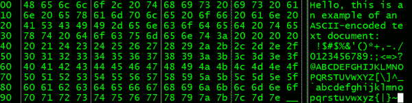

# 美国信息交换标准代码

> 原文：<https://learn.sparkfun.com/tutorials/ascii>

## 介绍

如果计算机以二进制运行，那么我们如何存储字母和单词呢？为此，我们给字符分配数字。这就是所谓的[字符编码](https://en.wikipedia.org/wiki/Character_encoding)。

[](https://cdn.sparkfun.com/assets/learn_tutorials/5/3/9/ASCII_Text_Doc.png)*Looking at the internals of a simple text document*

为了理解字符编码是如何工作的，让我们创建一个简单的例子。首先，将数字 1-26 分配给英语字母表:

```
1  2  3  4  5  6  7  8  9  10 11 12 13 14 15 16 17 18 19 20 21 22 23 24 25 26
a  b  c  d  e  f  g  h  i  j  k  l  m  n  o  p  q  r  s  t  u  v  w  x  y  z 
```

为了编写简单的编码信息，我们用数字代替字母。比如`8 5 12 12 15`。通过使用数字，我们构建了单词`h e l l o`。

但是要完全捕获英语字母表——包括大写和小写字母、数字和标点符号——我们需要超过 26 个字符。结果，**美国信息交换标准码(ASCII)** 被创建为计算机的第一个字符编码标准之一。

### 你将学到什么

本教程将涵盖以下主题:

*   ASCII 简史
*   如何将十进制、二进制和十六进制数字翻译成 ASCII

### 推荐阅读

在开始阅读本指南之前，您可能需要熟悉一些概念:

*   二进制——知道计算机如何存储数字有助于将这些数字转换成字符。
*   [十六进制](https://learn.sparkfun.com/tutorials/hexadecimal)——十六进制常用来表示 4 位一组的二进制数。
*   [安装 Arduino IDE](https://learn.sparkfun.com/tutorials/installing-arduino-ide) - Arduino 是尝试打印 ASCII 字符的好方法。

## 历史

美国标准协会(ASA)，即现在的美国国家标准协会(ANSI)，于 1960 年 10 月 6 日开始了 ASCII 的工作。编码方案起源于由米勒·博多发明的 5 位电报代码。委员会最终决定了 ASCII 的 7 位代码。

7 位允许 128 个字符。虽然只有美国英语字符和符号被选择用于该编码集，但是 7 位意味着与传输该数据相关的成本最小化(与 8 位相反)。

ASCII 的前 32 个字符是保留的控制字符。这些字符被用来向打印机等其他设备传递特殊指令。例如，用户可以前进一行，删除一个字符，并在一些设备上响铃(例如在[电传打字机 33](https://en.wikipedia.org/wiki/Teletype_Model_33) ASR 上)。

ASA 于 1963 年发布了第一版 ASCII，并于 1967 年对其进行了修订。该标准的最后一次重大更新发生在 1986 年。ASCII 首先在美国电话电报公司(美国电话电报公司)的电传打字机交换(TWX)网络中看到了商业用途。

[](https://cdn.sparkfun.com/assets/learn_tutorials/5/3/9/ASR-33.jpg)*Teleprinters, like this Teletype Model 33 ASR, were used to send typed messages to one or more other teleprinters across various communication channels (Image courtesy of [Arnold Reinhold of Wikimedia Commons](https://commons.wikimedia.org/wiki/File:ASR-33_at_CHM.agr.jpg))*

1968 年 3 月 11 日，林登·约翰逊总统下令所有美国联邦政府的计算机必须支持 ASCII，从而巩固了 ASCII 在美国计算机史上的地位。

当时还存在其他编码方案，比如[国际电报字母表第 2 号](https://en.wikipedia.org/wiki/Baudot_code#ITA2) (ITA2)，但 ASCII 很快成为美国英语编码的标准。ASCII 是互联网上最常见的编码，直到 2007 年被 UTF-8 超越。

## ASCII 表

为了识别字符的 ASCII 值，通常在 ASCII 表上查找它。ASCII 表将每个字符与 0 到 127 之间的指定值配对。

### 控制字符

控制字符构成了 ASCII 表的前 32 个字符。这些字符不是用来打印的，而是用来向另一个设备(如打印机)发送命令指令。请注意，我们已经包含了 ASCII 字符的八进制表示形式[，以防您可能正在使用一个特别旧的系统(例如 12 位](https://en.wikipedia.org/wiki/Octal) [PDP-8](https://en.wikipedia.org/wiki/PDP-8) )。

| 十二月 | 箱子 | 十月 | 十六进制 | 茶 | 描述 |
| Zero | 0000 0000 | 000 | 00 | 空 | 空 |
| one | 0000 0001 | 001 | 01 | 段开销 | 航向起点 |
| Two | 0000 0010 | 002 | 02 | 世腾船务 | 正文开始 |
| three | 0000 0011 | 003 | 03 | 电文终了记号(End-of-Text) | 正文结束 |
| four | 0000 0100 | 004 | 04 | 磁带结束符 | 传输结束符 |
| five | 0000 0101 | 005 | 05 | ENQ | 询问 |
| six | 0000 0110 | 006 | 06 | 命令正确应答 | 承认 |
| seven | 0000 0111 | 007 | 07 | 贝尔 | 钟 |
| eight | 0000 1000 | 010 | 08 | 理学士 | 退格键 |
| nine | 0000 1001 | 011 | 09 | 标签 | 横表 |
| Ten | 0000 1010 | 012 | 得一个例子 | 低频 | 换行，新行 |
| Eleven | 0000 1011 | 013 | 0B | 佛蒙特州 | 垂直标签 |
| Twelve | 0000 1100 | 014 | 0C | 消防 | 表单摘要，新页面 |
| Thirteen | 0000 1101 | 015 | 0D | 中国国家铁路（China Railway） | 回车 |
| Fourteen | 0000 1110 | 016 | 得意思是 | 因此 | 移出 |
| Fifteen | 0000 1111 | 017 | 0F | 国际度量单位制 | 移入 |
| Sixteen | 0001 0000 | 020 | Ten | DLE | 数据链路转义 |
| Seventeen | 0001 0001 | 021 | Eleven | DC1 | 设备控制 1 |
| Eighteen | 0001 0010 | 022 | Twelve | DC2 | 设备控制 2 |
| Nineteen | 0001 0011 | 023 | Thirteen | DC3 | 设备控制 3 |
| Twenty | 0001 0100 | 024 | Fourteen | DC4 | 设备控制 4 |
| Twenty-one | 0001 0101 | 025 | Fifteen | (电传等的)否定应答(negative acknowledge) | 否定应答 |
| Twenty-two | 0001 0110 | 026 | Sixteen | synchronizing 同步 | 同步空闲 |
| Twenty-three | 0001 0111 | 027 | Seventeen | 信息组传送结束(End of Transmission Block) | 字组传送结束字符 |
| Twenty-four | 0001 1000 | 030 | Eighteen | 能 | 取消 |
| Twenty-five | 0001 1001 | 031 | Nineteen | 东地中海(Eastern Mediterranean) | 媒体结束 |
| Twenty-six | 0001 1010 | 032 | 1A | 潜水艇 | 代替者 |
| Twenty-seven | 0001 1011 | 033 | 1B | 经济社会委员会 | 逃跑 |
| Twenty-eight | 0001 1100 | 034 | 1C | 空军上士 | 文件分隔符 |
| Twenty-nine | 0001 1101 | 035 | 1D | (美国联邦政府职员)总表(General Schedule) | 组分隔符 |
| Thirty | 0001 1110 | 036 | 1E | 标准英语 | 记录分离器 |
| Thirty-one | 0001 1111 | 037 | 1F | 美国 | 单元分隔符 |
| One hundred and twenty-seven | 0111 1111 | One hundred and seventy-seven | 7F | 是吗 | 删除 |

### 可打印字符

ASCII 编码方案中有 95 个可打印字符。请注意，“空格”字符表示可打印的空格(" ")。

| 十二月 | 箱子 | 十月 | 十六进制 | 茶 |
| Thirty-two | 0010 0000 | 040 | Twenty | 空间 |
| Thirty-three | 0010 0001 | 041 | Twenty-one | ！ |
| Thirty-four | 0010 0010 | 042 | Twenty-two | " |
| Thirty-five | 0010 0011 | 043 | Twenty-three | # |
| Thirty-six | 0010 0100 | 044 | Twenty-four | $ |
| Thirty-seven | 0010 0101 | 045 | Twenty-five | % |
| Thirty-eight | 0010 0110 | 046 | Twenty-six | & |
| Thirty-nine | 0010 0111 | 047 | Twenty-seven | ' |
| Forty | 0010 1000 | 050 | Twenty-eight | （ |
| Forty-one | 0010 1001 | 051 | Twenty-nine | ) |
| forty-two | 0010 1010 | 052 | 2A | * |
| Forty-three | 0010 1011 | 053 | 2B | + |
| forty-four | 0010 1100 | 054 | 2C | , |
| Forty-five | 0010 1101 | 055 | 2D | - |
| Forty-six | 0010 1110 | 056 | 2E | 。 |
| Forty-seven | 0010 1111 | 057 | 2F | / |
| Forty-eight | 0011 0000 | 060 | Thirty | Zero |
| forty-nine | 0011 0001 | 061 | Thirty-one | one |
| Fifty | 0011 0010 | 062 | Thirty-two | Two |
| Fifty-one | 0011 0011 | 063 | Thirty-three | three |
| fifty-two | 0011 0100 | 064 | Thirty-four | four |
| Fifty-three | 0011 0101 | 065 | Thirty-five | five |
| Fifty-four | 0011 0110 | 066 | Thirty-six | six |
| Fifty-five | 0011 0111 | 067 | Thirty-seven | seven |
| fifty-six | 0011 1000 | 070 | Thirty-eight | eight |
| Fifty-seven | 0011 1001 | 071 | Thirty-nine | nine |
| Fifty-eight | 0011 1010 | 072 | 3A | ： |
| Fifty-nine | 0011 1011 | 073 | 3B | ； |
| Sixty | 0011 1100 | 074 | 3C | < |
| Sixty-one | 0011 1101 | 075 | 三维（three dimension 的缩写） | = |
| Sixty-two | 0011 1110 | 076 | 3E | > |
| Sixty-three | 0011 1111 | 077 | 3F | ？ |

| 十二月 | 箱子 | 十月 | 十六进制 | 茶 |
| Sixty-four | 0100 0000 | One hundred | Forty | @ |
| Sixty-five | 0100 0001 | One hundred and one | Forty-one | A |
| Sixty-six | 0100 0010 | One hundred and two | forty-two | B |
| Sixty-seven | 0100 0011 | One hundred and three | Forty-three | C |
| sixty-eight | 0100 0100 | One hundred and four | forty-four | D |
| sixty-nine | 0100 0101 | One hundred and five | Forty-five | E |
| Seventy | 0100 0110 | One hundred and six | Forty-six | F |
| Seventy-one | 0100 0111 | One hundred and seven | Forty-seven | G |
| seventy-two | 0100 1000 | One hundred and ten | Forty-eight | H |
| Seventy-three | 0100 1001 | One hundred and eleven | forty-nine | 我 |
| Seventy-four | 0100 1010 | One hundred and twelve | 4A | J |
| Seventy-five | 0100 1011 | One hundred and thirteen | 4B | K |
| Seventy-six | 0100 1100 | One hundred and fourteen | 4C | L |
| Seventy-seven | 0100 1101 | One hundred and fifteen | 4D | M |
| seventy-eight | 0100 1110 | One hundred and sixteen | 4E | 普通 |
| Seventy-nine | 0100 1111 | One hundred and seventeen | 4F | O |
| Eighty | 0101 0000 | One hundred and twenty | Fifty | P |
| Eighty-one | 0101 0001 | One hundred and twenty-one | Fifty-one | Q |
| Eighty-two | 0101 0010 | One hundred and twenty-two | fifty-two | 稀有 |
| Eighty-three | 0101 0011 | One hundred and twenty-three | Fifty-three | S |
| Eighty-four | 0101 0100 | One hundred and twenty-four | Fifty-four | T |
| eighty-five | 0101 0101 | One hundred and twenty-five | Fifty-five | U |
| Eighty-six | 0101 0110 | One hundred and twenty-six | fifty-six | V |
| Eighty-seven | 0101 0111 | One hundred and twenty-seven | Fifty-seven | W |
| Eighty-eight | 0101 1000 | One hundred and thirty | Fifty-eight | X |
| eighty-nine | 0101 1001 | One hundred and thirty-one | Fifty-nine | Y |
| Ninety | 0101 1010 | One hundred and thirty-two | 5A | Z |
| Ninety-one | 0101 1011 | One hundred and thirty-three | 5B | [ |
| Ninety-two | 0101 1100 | One hundred and thirty-four | 5C | \ |
| Ninety-three | 0101 1101 | One hundred and thirty-five | 5D | ] |
| Ninety-four | 0101 1110 | One hundred and thirty-six | 5E | ^ |
| Ninety-five | 0101 1111 | One hundred and thirty-seven | 5F | _ |

| 十二月 | 箱子 | 十月 | 十六进制 | 茶 |
| Ninety-six | 0110 0000 | One hundred and forty | Sixty | ` |
| Ninety-seven | 0110 0001 | One hundred and forty-one | Sixty-one | a |
| Ninety-eight | 0110 0010 | One hundred and forty-two | Sixty-two | b |
| Ninety-nine | 0110 0011 | One hundred and forty-three | Sixty-three | c |
| One hundred | 0110 0100 | One hundred and forty-four | Sixty-four | d |
| One hundred and one | 0110 0101 | One hundred and forty-five | Sixty-five | e |
| One hundred and two | 0110 0110 | One hundred and forty-six | Sixty-six | f |
| One hundred and three | 0110 0111 | One hundred and forty-seven | Sixty-seven | g |
| One hundred and four | 0110 1000 | One hundred and fifty | sixty-eight | h |
| One hundred and five | 0110 1001 | One hundred and fifty-one | sixty-nine | 我 |
| One hundred and six | 0110 1010 | One hundred and fifty-two | 6A | j |
| One hundred and seven | 0110 1011 | One hundred and fifty-three | 6B | k |
| One hundred and eight | 0110 1100 | One hundred and fifty-four | 6C | l |
| One hundred and nine | 0110 1101 | One hundred and fifty-five | 6D | m |
| One hundred and ten | 0110 1110 | One hundred and fifty-six | 6E | n |
| One hundred and eleven | 0110 1111 | One hundred and fifty-seven | 6F | o |
| One hundred and twelve | 0111 0000 | One hundred and sixty | Seventy | p |
| One hundred and thirteen | 0111 0001 | One hundred and sixty-one | Seventy-one | q |
| One hundred and fourteen | 0111 0010 | One hundred and sixty-two | seventy-two | r |
| One hundred and fifteen | 0111 0011 | One hundred and sixty-three | Seventy-three | s |
| One hundred and sixteen | 0111 0100 | One hundred and sixty-four | Seventy-four | t |
| One hundred and seventeen | 0111 0101 | One hundred and sixty-five | Seventy-five | u |
| One hundred and eighteen | 0111 0110 | One hundred and sixty-six | Seventy-six | v |
| One hundred and nineteen | 0111 0111 | One hundred and sixty-seven | Seventy-seven | w |
| One hundred and twenty | 0111 1000 | One hundred and seventy | seventy-eight | x |
| One hundred and twenty-one | 0111 1001 | One hundred and seventy-one | Seventy-nine | y |
| One hundred and twenty-two | 0111 1010 | One hundred and seventy-two | 7A | z |
| One hundred and twenty-three | 0111 1011 | One hundred and seventy-three | 7B | { |
| One hundred and twenty-four | 0111 1100 | One hundred and seventy-four | 7C | &#124; |
| One hundred and twenty-five | 0111 1101 | One hundred and seventy-five | 7D | } |
| One hundred and twenty-six | 0111 1110 | One hundred and seventy-six | 7E | ~ |

## 尝试

如果你想尝试用 ASCII 编码打印一些东西，你可以用 Arduino 试试。Arduino 入门见[本教程](https://learn.sparkfun.com/tutorials/installing-arduino-ide)。

打开 Arduino IDE 并粘贴以下代码:

```
language:c
void setup() 
{
  Serial.begin(9600);
}

void loop() 
{
  Serial.write(0x48); // H
  Serial.write(0x65); // e
  Serial.write(0x6C); // l
  Serial.write(0x6C); // l
  Serial.write(0x6F); // o
  Serial.write(0x21); // !
  Serial.write(0x0A); // \n

  delay(1000);
} 
```

在 Arduino 上运行它，并打开一个串行控制台。你应该看到“你好！”反复出现:

[](https://cdn.sparkfun.com/assets/learn_tutorials/5/3/9/Arduino_Hello.png)

注意，我们必须使用`Serial.write()`而不是`Serial.print()`。`write()`命令通过串行线发送一个原始字节。另一方面，`print()`将尝试解释该数字，并发送该数字的 ASCII 编码版本。例如，`Serial.print(0x48)`会在控制台中打印`72`。

另外，注意我们使用了 ASCII 字符`0x0A`，它是“换行”控制字符。这将导致打印机(或本例中的控制台)前进到下一行。这类似于按下“输入”键。

## 资源和更进一步

有许多可用的字符编码集。万维网最流行的编码是 UTF-8。截至 2016 年 6 月，87%的网页使用 UTF-8。

UTF-8 向后兼容 ASCII，这意味着前 128 个字符与 ASCII 相同。UTF-8 可以使用 2、3 和 4 个字节来编码大多数现代书面语言中的字符，包括拉丁语、希腊语、西里尔语、阿拉伯语、中文、韩语和日语字符。

在串行终端中工作时，基本的 ASCII 编码知识会很有用。参见[串行终端基础知识](https://learn.sparkfun.com/tutorials/terminal-basics)了解如何使用一些可用的串行终端程序。

如果您有兴趣下载图像格式的 ASCII 表，请单击下面的按钮。有了图像，你可以把它打印出来挂在墙上，放在咖啡杯上，或者把它[打印在鼠标垫](http://www.zazzle.com/ascii_table_mouse_pad-144571200378563632)上。

[ASCII Table Images](https://cdn.sparkfun.com/assets/learn_tutorials/5/3/9/ascii_table.zip)