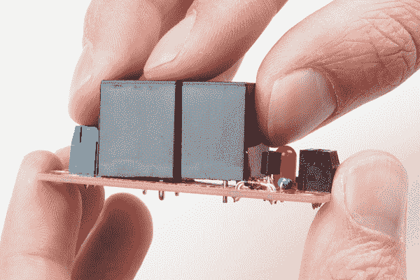

# 牛肉继电器控制连接指南

> 原文：<https://learn.sparkfun.com/tutorials/beefcake-relay-control-hookup-guide>

## 介绍

[beefeake 继电器控制套件](https://www.sparkfun.com/products/13815)是一种切换负载的方法，这些负载通常不能由微控制器驱动，如交流电、电机、电池、螺线管、泵等！

 

将**添加到您的[购物车](https://www.sparkfun.com/cart)中！**

 **### [spark fun beef beast 继电器控制套件(版本。2.0)](https://www.sparkfun.com/products/13815)

[Out of stock](https://learn.sparkfun.com/static/bubbles/ "out of stock") KIT-13815

你的 5V 系统可以通过这个大而结实的继电器板发挥巨大的能量。NC 触点上的 10A 和 NO cont 上的 20A 是如何…

$9.9521[Favorited Favorite](# "Add to favorites") 36[Wish List](# "Add to wish list")** **[https://www.youtube.com/embed/Vq6qXqVTFVU/?autohide=1&border=0&wmode=opaque&enablejsapi=1](https://www.youtube.com/embed/Vq6qXqVTFVU/?autohide=1&border=0&wmode=opaque&enablejsapi=1)

本连接指南讨论安全问题，带您了解 Beefcake 继电器控制套件的组装过程，并展示如何使用最基本的 Arduino 草图对其进行测试。

### 推荐阅读

*   [通孔焊接](https://learn.sparkfun.com/tutorials/how-to-solder---through-hole-soldering) -如果你不熟悉焊接，从这里开始。
*   [Redboard 连接指南](https://learn.sparkfun.com/tutorials/redboard-hookup-guide) -微控制器新手？拿起一块红纸板，从这里开始。
*   [中继教程](https://www.sparkfun.com/tutorials/119) -控制大型、小型设备。
*   [beef beast 继电器控制套件 GitHub Repo](https://github.com/sparkfun/Beefcake_Relay_Control_Kit) -包含原始资料。

## 安全和绝缘

该产品可能用于电源布线，因此请阅读本节，讨论需要多大空间来防止电弧放电。

有很多标准，像 IEC 标准 T1、T2 UL 标准 T3 和 T4 IEEE 标准 T5。这些涵盖了从测试技术，通信接口，当然还有安全。每个国家对于商业发布的产品都需要一套不同的标准，这是一个经验丰富的全职职位，只是为了搞清楚。

Beefcake 继电器控制是一种原型或组件类型的东西，不遵守任何标准，但它的设计考虑到了安全性。因为它不是一个完整的产品，所以不能保证您，也就是客户，会安全地使用它，所以请小心。

制定标准有利于业务和兼容性，但这本身也是一项业务，因此标准不可能免费获得。然而，创造性的谷歌搜索可以揭示明显来自标准的相关表格。来自标准的信息已被归结为 PCB 的爬电距离和电气间隙计算器，如 www.creepage.com。这些可以用来得出安全距离。

摆弄 creepage.com 计算器，看看距离是如何变化的。本节旨在提供信息，而非恐吓。术语有点奇怪，所以我用几个术语来解释计算器的设置。

**功能绝缘**

功能绝缘旨在满足给定电压的最低隔离水平。250VAC 约 1mm。

**基本绝缘**

这提供了高于标称值的电平，以允许电涌和其他常见线路干扰不会导致击穿。对于 250 伏交流电压，要求 2mm。

**双重绝缘**

为了使人们接触到的东西安全，大多数标准都需要第二层，这样一层就可以被损坏，隔离特性也得以保持。当然，这将是基本的两倍，或 250 伏交流电压的 4 毫米。

**加强绝缘**

强化绝缘与双层绝缘具有相同的绝缘特性，但它被评定为足够坚固，不会出现裂缝和针孔，因此它可以用来代替适当的接地。

**爬电距离和电气间隙**

*爬电距离*定义为 PCB 表面导电表面之间的最短距离。沿着物体表面传导比在自由空间中更容易，所以这个度量是电子从一个导电物体到另一个导电物体，沿着两者之间的表面爬行的距离。这将比净空要求更远。

*间隙*定义为导电物(如焊盘)之间的最短距离。或者说，如果这两件事之间有一条弧线，最有可能的路径会是什么？

### 这对强壮的继电器控制意味着什么

看一看有强光透过的 PCB。电路板上的天然玻璃纤维能让光线通过，但铜却不能。这样很容易看出痕迹和间距。

高压侧和低压侧之间有很大的距离。有足够的，你应该可以安全地触摸低压侧的任何东西，但**请不要**。避免使用任何接通电源的电路是一个好习惯。

窥视继电器内部，我们可以看到低压绕组和高压触点之间的良好距离。该继电器的线圈和触点之间的额定隔离电压为 2500VAC，但制造过程中有统计故障率，用户应时刻警惕危险。

For good practice, always disconnect mains from the relay before wiring up the circuit. While the circuit is operating, refrain from touching or pointing to any part of the circuit. People who work around live connections often hold one hand behind their back to prevent a conduction path between two points, and will never point at things but will instead describe them.

## 装配

牛肉继电器控制套件组装起来相对简单。本节概述了需要哪些工具，并展示了组装过程。

### 材料

该套件包含以下部件:

*   机电继电器
*   2x 端子板，轻型用于信号，重型用于输出
*   线圈激活 LED
*   双极结型晶体管(BJT)
*   2x 限流电阻
*   反激式避雷器二极管
*   放电用齐纳二极管

### 工具

建议使用以下工具。

*   一个功率为 50 瓦的烙铁。
*   一些焊料，要么[含铅](https://www.sparkfun.com/products/9161)要么[无铅](https://www.sparkfun.com/products/9325)。
*   放大镜或[放大镜](https://www.sparkfun.com/products/9316)。
*   工作时用老虎钳夹住印刷电路板。

### 构建健壮的继电器控制

这位帅哥使用标准的通孔技术。元件将穿过孔，焊接，并修整引线。最好是从最短的组件开始，一直到较高的组件。这是为了当电路板倒置在工作台面上时，它们保持被压在适当的位置。

从电阻开始。弯曲引线，使其尽可能靠近电阻器本体形成 90 度角。

把它们喂到标有 1k 的地方。他们将坐在丝印盒上。

接下来，弯曲二极管引线。二极管体更短，所以没有必要把弯曲处弄得很近。弯曲后，它们应该与电阻器的宽度相同。

插入二极管。胖二极管是 9.1V 齐纳二极管，应标记为 4739。将它放在标有“齐纳”的丝印盒上，黑带朝向白色丝印条纹。较小的二极管应标记为 4148，是一个标准的高速二极管。将它放在标有 N4148 的盒子上，黑色条纹朝向丝绸条纹。

现在，翻转电路板，焊接这些元件，在引线周围形成漂亮闪亮的圆锥体。可以用一个重物(如焊料台)来固定电路板，也可以放在老虎钳中。

将元件引线夹在焊料锥的正上方。

接下来，准备 BJT。让外面的两条腿伸直。将内腿弯曲成“S”形曲线，使其与等边三角形中的其他两条腿均匀隔开。

将 BJT 和 LED 安装到电路板上，注意 LED 的平面与丝网印刷圆的平面部分相匹配。

将它们焊接到位，并修整引线。

连接螺丝端子。调整它们的方向，使开口朝外。这些将保持得很好，所以翻转它，焊接到位。

最后一个部件是继电器。继电器有粗导线的电流容量，所以他们可能需要一点工作得到插入。一旦它们都定位好，它应该与 PCB 齐平。

*Inserting the relay*

承载电流的额外铜意味着需要额外的热量来使焊料流动，但这非常重要。冷焊点会导致额外的电阻。随着推荐的 Hakko 铁设置为 700 度，应该没有问题，但铁将不得不举行更长的时间比正常。加入额外的焊料如果接头看起来很脏，焊剂会出来，你可以在之后用熨斗把多余的焊料铲走。

*Notice that the iron touches both the post and the plated through hole heating them up together.*

恭喜你！你现在有一个完整的牛肉继电器控制电路。这是最终产品的样子。

## 示例:Arduino 控件

现在，是时候让接力唱它的人民的歌了。将 5V 端子连接到能够提供 150mA 电流的 5V 电源、地线和从数字输出到控制引脚(CTRL)的信号线。

一个基本的例子是 blink.ino 草图。将信号引脚连接到与 LED 相同的数字输出 13。如下所示，将接地连接到 GND 端子，将 5 伏电压连接到 5V 端子。

现在，随着微控制器板上的 LED 闪烁，继电器将会通电，而“大块头”的 LED 将会亮起。你应该每秒都能听到一声悦耳的咔嗒声。

啊，太令人满意了。但是，实际上这应该用来切换负载。在这里，我将 12 号固体室内布线连接到端子上，这是一个非常紧密的配合。端子仅指定为 14 号线。

如果你想要一个更永久的安装，继续进行，焊接到电路板边缘的大接线片。这将需要更大的固体铜线热量，所以要有耐心。

If using solid conductors, form them before soldering! Bending large wires can potentially break the solder lugs from the PCB.*Here the solder is kinda sticking but really, it's just blobing up. More heat is needed.*

获得额外热量的一个技巧是加热第二个烙铁，先把一堆焊料滴起来，用两个烙铁加热。

## 资源和更进一步

你现在应该有一个能够从微控制器切换负载的继电器。但是换什么呢？马达？落地灯？*其他继电器？*看你的了！欲了解更多关于牛肉继电器控制板的信息，请查看下面！

*   [示意图](http://cdn.sparkfun.com/datasheets/Components/General/SparkFun_Beefcake_Relay_Control_Kit_v20a.pdf)
*   [老鹰档案](http://cdn.sparkfun.com/datasheets/Components/General/SparkFun_Beefcake_Relay_Control_Kit_v20a.zip)
*   [数据表](http://cdn.sparkfun.com/datasheets/Components/General/Relay.JQX-15F.pdf) (JQX-15F/005-1Z1)
*   [接力教程](http://www.sparkfun.com/tutorials/119)
*   [GitHub](https://github.com/sparkfun/Beefcake_Relay_Control_Kit)

这里有几个教程可以启发你。他们用牛肉来交换一些有趣的东西，包括火。

 [### 光子远程水位传感器](https://learn.sparkfun.com/tutorials/photon-remote-water-level-sensor) Learn how to build a remote water level sensor for a water storage tank and how to automate a pump based off the readings 15 [### Blynk 板项目指南](https://learn.sparkfun.com/tutorials/blynk-board-project-guide) A series of Blynk projects you can set up on the Blynk Board without ever re-programming it.[Favorited Favorite](# "Add to favorites") 18 [### ESP8266 动力丙烷储罐](https://learn.sparkfun.com/tutorials/esp8266-powered-propane-poofer) Learn how Nick Poole built a WiFi controlled fire-cannon using the ESP8266 Thing Dev Board 4 [### Blynk Board Bridge 小部件演示](https://learn.sparkfun.com/tutorials/blynk-board-bridge-widget-demo) A Blynk project that demonstrates how to use the Bridge widget to get two (or more) Blynk Boards to communicate.[Favorited Favorite](# "Add to favorites") 2 [### 如何建立一个远程断路开关](https://learn.sparkfun.com/tutorials/how-to-build-a-remote-kill-switch) Learn how to build a wireless controller to kill power when things go... sentient.[Favorited Favorite](# "Add to favorites") 18 [### 物联网电源继电器](https://learn.sparkfun.com/tutorials/iot-power-relay) Using the ESP32 to make a web-configured timed relay.[Favorited Favorite](# "Add to favorites") 4 [### Qwiic 单继电器连接指南](https://learn.sparkfun.com/tutorials/qwiic-single-relay-hookup-guide) Get started switching those higher power loads around with the Qwiic Single Relay.[Favorited Favorite](# "Add to favorites") 3 [### Qwiic 四路继电器连接指南](https://learn.sparkfun.com/tutorials/qwiic-quad-relay-hookup-guide) SparkFun’s Qwiic Quad Relay is a product designed for switching not one but four high powered devices from your Arduino or other low powered microcontroller using I2C.[Favorited Favorite](# "Add to favorites") 2**