# 伺服触发器编程指南

> 原文：<https://learn.sparkfun.com/tutorials/servo-trigger-programming-guide>

## 介绍

SparkFun 伺服触发器是一个有用的小板，控制业余爱好伺服电机。它有[标准](https://www.sparkfun.com/products/13118)和[连续旋转](https://www.sparkfun.com/products/13872)两种款式。

[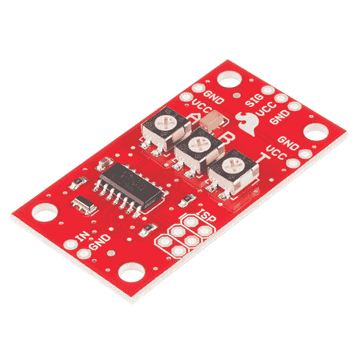](https://cdn.sparkfun.com/assets/learn_tutorials/5/2/9/iso-top.jpg)

伺服触发器旨在使使用伺服电机变得容易，但它可能不适合每一个应用。您可能需要不同的时序或不同的逻辑来解释如何将输入转换为电机驱动信号。你甚至可能有一些想法，根本不涉及伺服电机！

由于伺服触发器的核心是微控制器，固件可以重新编程。而且，因为该设计是作为开源硬件发布的，所以源代码是在设备的 [GitHub 库](https://github.com/sparkfun/Servo_Trigger)中发布的。欢迎下载修改！

本指南适用于两种版本的伺服触发器。它们使用相同的硬件，但加载了不同的固件。

本指南将介绍用于编程伺服触发器的工具，并指导您完成软件设计。最终，您将能够将一个常规的伺服触发器转变为一个连续旋转的触发器(反之亦然)，甚至从头开始开发新的行为。

### 推荐阅读

*   [伺服教程](https://learn.sparkfun.com/tutorials/hobby-servo-tutorial)
*   [伺服触发连接导轨](https://learn.sparkfun.com/tutorials/servo-trigger-hookup-guide)
*   [连续旋转伺服触发连接导轨](https://learn.sparkfun.com/tutorials/continuous-rotation-servo-trigger-hookup-guide)

## 程序设计工具

This guide will walk you through recreating the development environment used in Servo Trigger developemt. Atmel Studio makes a nice graphical front end and has a full-featured debugger, it is not required to recompile the firmware or reprogram the IC.

However, it only runs under Windows.

If you're running Linux or OSX, you can still use the the command-line AVR-GCC tools. Here is [a guide to setting them up.](http://maxembedded.com/2015/06/setting-up-avr-gcc-toolchain-on-linux-and-mac-os-x/) However, you'll be in uncharted territory, as the author isn't using those environments.

## IDE

伺服触发器固件是使用 [Atmel Studio 6.2](http://www.atmel.com/tools/studioarchive.aspx) 开发的。Atmel Studio 将微软的 Visual Studio IDE 与针对 Atmel 微控制器的编译器和调试工具合并在一起。AVR 工具使用 [AVR-GCC](http://www.nongnu.org/avr-libc/) ，与 Arduino IDE 使用的编译器相同。

IDE 使用编程加密狗与微控制器通信。伺服触发器是用 [JTAGICE3](http://www.atmel.com/tools/JTAGICE3.aspx) 和 [AtmelICE PCBA](http://www.atmel.com/tools/atatmel-ice.aspx) 调试模块开发的。这些单元可以对芯片进行配置和编程，还可以提供全功能的交互式调试器。您可以暂停执行并检查芯片内部，这大大简化了应用程序的故障排除——尤其是因为 Tiny84 缺少可以打印调试信息的串行端口。如果你来自不提供交互调试的平台，那么交互调试是一项[非常强大的技术](https://www.sparkfun.com/news/1894)。

[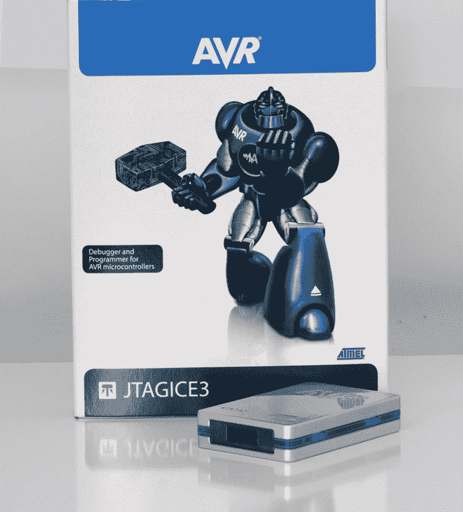](https://cdn.sparkfun.com/assets/learn_tutorials/5/2/9/jtagice3_with_box.png)

如果您使用 Atmel Studio，repo 中的`/firmware/`目录包含解决方案(*。atsln)文件。

## 入门指南

Atmel 调试工具非常方便，但是它们需要详细的配置才能工作。本页将带你创建一个全新的项目，并让调试器与伺服触发器对话。

### 硬件配置

伺服触发器具有标准的 6 针系统内编程( **ISP** )连接器。

[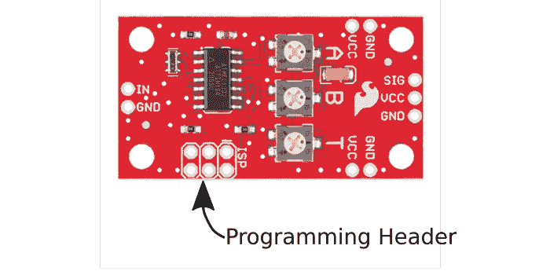](https://cdn.sparkfun.com/assets/learn_tutorials/5/2/9/header-callout.png)

为了连接到此接头，您可以将接头焊接到 PCB 或使用 pogo 引脚适配器。

[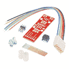](https://www.sparkfun.com/products/11591) 

将**添加到您的[购物车](https://www.sparkfun.com/cart)中！**

### [SparkFun ISP Pogo 适配器](https://www.sparkfun.com/products/11591)

[In stock](https://learn.sparkfun.com/static/bubbles/ "in stock") KIT-11591

Pogo 引脚使生活变得更加容易，当你试图编程，而不必焊接一个东西，当你连接到…

$13.954[Favorited Favorite](# "Add to favorites") 12[Wish List](# "Add to wish list")****[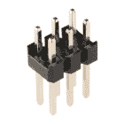](https://www.sparkfun.com/products/12807) 

将**添加到您的[购物车](https://www.sparkfun.com/cart)中！**

### [表头- 2x3(公，0.1”)](https://www.sparkfun.com/products/12807)

[Only 2 left!](https://learn.sparkfun.com/static/bubbles/ "only 2 left!") PRT-12807

这是一个简单的 2x3 外螺纹接头。此接头是 ISP 连接器的常见配置。每个引脚都有一个间距…

$0.75[Favorited Favorite](# "Add to favorites") 4[Wish List](# "Add to wish list")********If you're going to use the debugger, soldering in a header is highly recommended. Otherwise, you'll have to hold the pogo pins in place for the duration of your debug session.

最后，调试接口盒不是为电路板设计的电源。你需要给伺服触发器的`VCC`和`GND`引脚施加 5 伏电压。

### 创建新项目

为了使用调试器，您需要一个项目文件。让我们从头开始创建一个。

要创建一个项目，首先打开 Atmel Studio，并选择“新建项目”。

[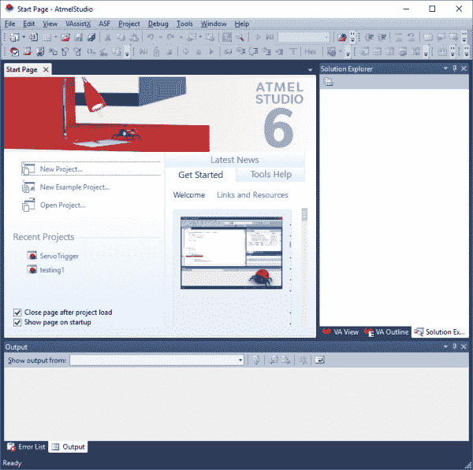](https://cdn.sparkfun.com/assets/learn_tutorials/5/2/9/step1_3.png)

选择 GCC C 或 C++可执行项目选项。

初始化项目需要一些时间，然后显示目标微控制器列表。从列表中选择 ATtiny84。

[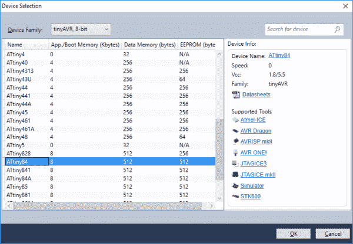](https://cdn.sparkfun.com/assets/learn_tutorials/5/2/9/step3.png)

它又花了一会儿时间，然后提出了一个空项目。`main()`是您应用程序的入口点。

[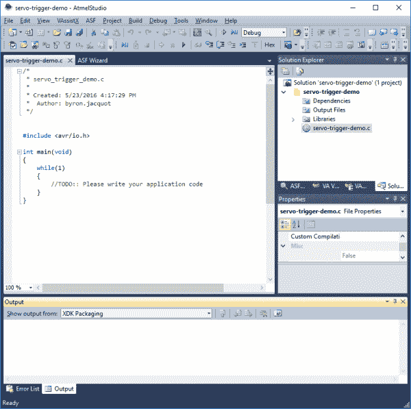](https://cdn.sparkfun.com/assets/learn_tutorials/5/2/9/step4.png)

### 编程接口模式

在我们深入探讨之前，让我们稍作休息，探索一下调试器用来与芯片通信的两种模式。虽然它们看起来相似，但并不完全等同。它们也在 IDE 中的两个位置进行配置，设置需要匹配才能正常工作。

*   第一种模式是 **ISP** ，使用类似 SPI 的时钟和数据信号。这是两种模式中较老的一种，用于对处理器上的闪存进行编程，并与一些低级非易失性配置进行交互，如芯片 ID 寄存器和熔丝位。作为底层，它不允许交互式调试。
*   另一种模式是 **debugWIRE** 。它是最近开发的，被改装到芯片中，通过复位引脚进行通信。debugWIRE 可以对 flash 进行编程，并允许交互式调试，但它不能访问 ID 寄存器或熔丝位。

[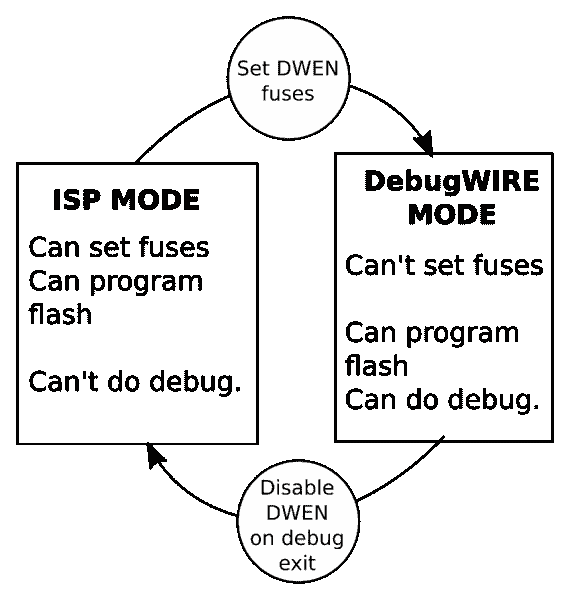](https://cdn.sparkfun.com/assets/learn_tutorials/5/2/9/modes.png)

由于这两种模式都没有所有的功能，我们必须根据我们正在做的事情在它们之间切换。如果您在使用一种模式的功能时遇到问题，最有可能的问题是芯片和 IDE 在当前模式上不一致。

### 第一次让界面说话

在 IDE 中打开一个新项目后，将调试器模块连接到 USB 端口。

点击“项目-> <project name="">属性...”，然后选择左边的*工具*选项卡来配置调试工具。</project>

[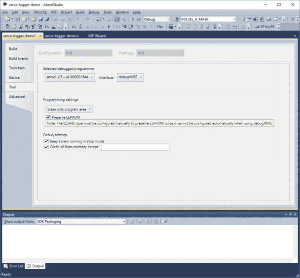](https://cdn.sparkfun.com/assets/learn_tutorials/5/2/9/step5.png)

选择连接的调试器，将接口设置为 **ISP** 。

选择接口后，点击“工具->器件编程”打开芯片配置对话框。它将打开，并选择工具、目标设备和界面。点击*应用*，初始化界面。更多信息将出现在窗口的下部。

[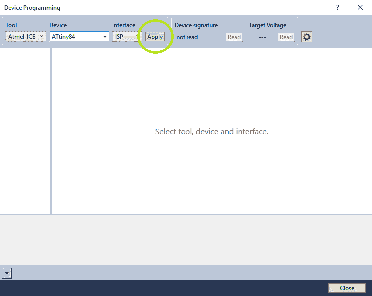](https://cdn.sparkfun.com/assets/learn_tutorials/5/2/9/step6.png)

将调试器单元连接到伺服触发器，并加电。点击右上角附近的“目标电压读取”按钮。

[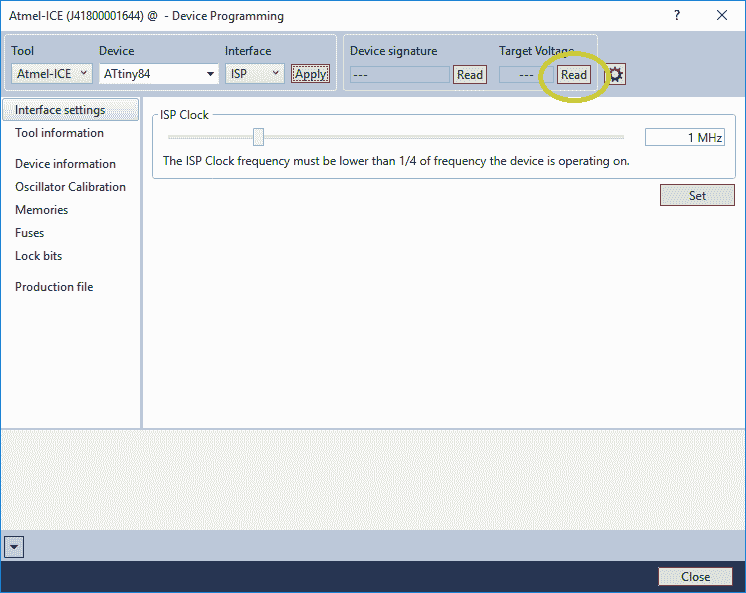](https://cdn.sparkfun.com/assets/learn_tutorials/5/2/9/step7.png)

相邻的方框应指示大约 5.0V。这表明芯片有电，应该能够通信。

然后，单击“读取设备签名”按钮。

[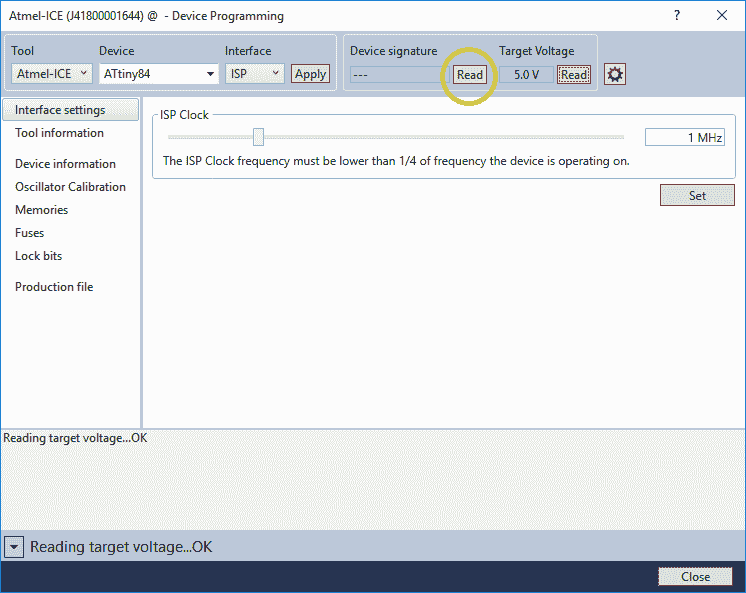](https://cdn.sparkfun.com/assets/learn_tutorials/5/2/9/step8.png)

它应该在相邻的框中报告一个 ID`0x1E930C`，表示一个 ATTiny84。

至此，我们确信 ISP 接口正在工作，我们可以打开调试模式了。

### 启用调试线

在器件编程对话框中，点击对话框左侧的“保险丝”选项卡。然后标记“DWEN”(调试线启用)保险丝旁边的方框。名称旁边的圆圈将变为黄色，表示该位未被编程。

[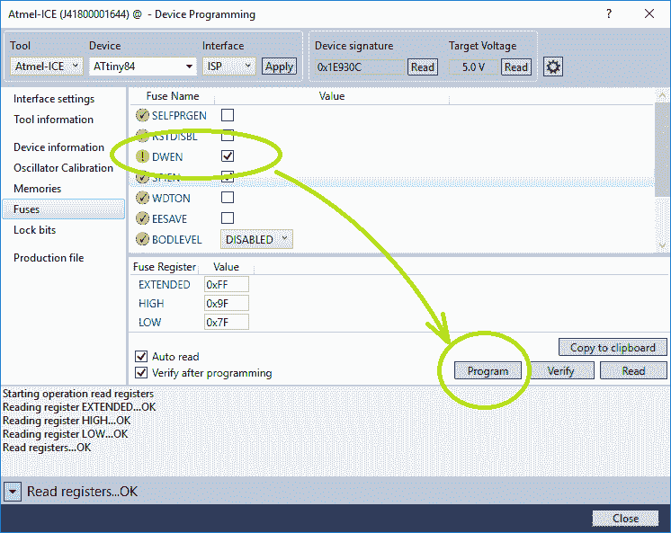](https://cdn.sparkfun.com/assets/learn_tutorials/5/2/9/step9.png)

确保选中“编程后验证”框，然后按“编程”进度将在对话框的下半部分报告。如果 IDE 请求重启目标系统，请执行此操作。最后，它应该显示“验证寄存器”...OK”，DWEN 旁边的圆圈应该会变成绿色。

此时，关闭器件编程对话框。您应该回到项目属性选项卡。现在，将界面切换到 debugWIRE。

[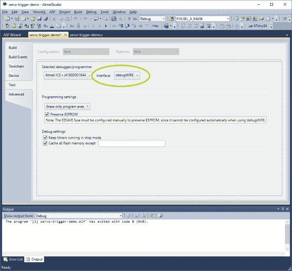](https://cdn.sparkfun.com/assets/learn_tutorials/5/2/9/step10.png)

*已经通过设置芯片上的保险丝启用了 DebugWIRE，并且已经指示 IDE 使用它来代替 ISP。*

### 使用调试线

完成上述步骤后，选择`Debug->Start Debugging and Break`。

[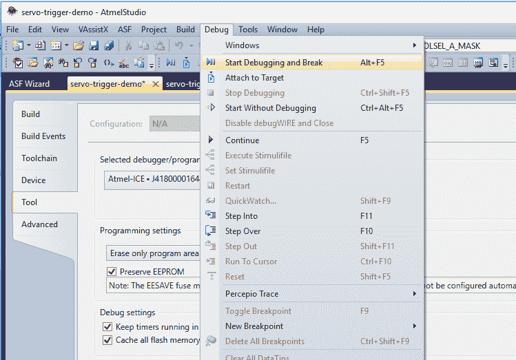](https://cdn.sparkfun.com/assets/learn_tutorials/5/2/9/step11.png)

编译器将运行，IDE 将多次重新排列其窗口。最终，它将打开一些内存检查窗口和源代码文件。

[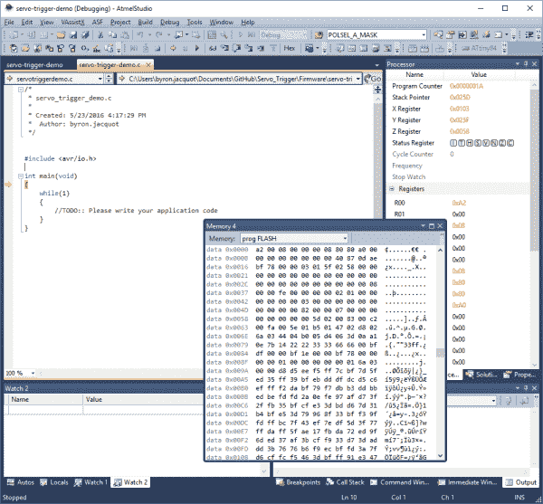](https://cdn.sparkfun.com/assets/learn_tutorials/5/2/9/step12.png)

左边的黄色箭头表示调试器正在运行，并在进入`main()`时暂停。

在这一点上，Atmel Studio 的表现和大多数调试器一样。您可以在特定代码行上设置断点，观察调用堆栈，检查变量，并通过访问存储器映射中的 I/O 寄存器与外设进行交互。

完成后，选择“调试->停止调试”选项。

[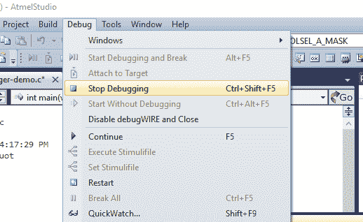](https://cdn.sparkfun.com/assets/learn_tutorials/5/2/9/step13.png)

我们在默认的空项目中得到的程序非常简单——main 包含一个空的无限循环。如果我们正在开发一个更有意义的应用程序，我们将向源文件添加更多的代码，根据需要进行构建和调试。

如果您在编辑器和调试器之间来回切换，停止调试是切换模式的合理方式。

但是，如果您需要返回到设备编程对话框(例如，更改时钟设置或调整其他熔丝位)，您需要在结束调试会话时禁用 debugWIRE。

[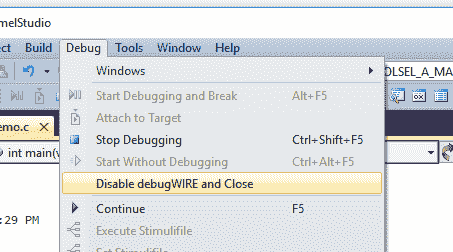](https://cdn.sparkfun.com/assets/learn_tutorials/5/2/9/step14.png)

这将清除 DWEN 保险丝。然后，您可以返回到上面的[第一次](https://learn.sparkfun.com/tutorials/servo-trigger-programming-guide/getting-started#firsttime)指令。不要忘记，项目配置和设备编程都需要设置为 ISP。要返回调试模式，您需要再次设置 DWEN 保险丝。

### 当你陷入困境时

事情是这样的:昨天你在调试，今天你开始并决定在器件编程对话框中检查芯片配置。

没有任何效果，错误详细信息包含“得到 0xc0，预期 0x00。”

[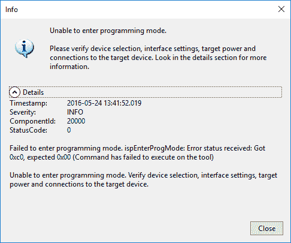](https://cdn.sparkfun.com/assets/learn_tutorials/5/2/9/step15.png)

解开它的诀窍是:

*   将项目设置为 debugWIRE。
*   启动调试会话(调试->启动调试并中断)。
*   调试器初始化后，选择“Debug-> Disable debugWIRE and Close”退出。
*   将项目设置回 ISP，现在设备编程对话框应该可以工作了。

### 最后一次警告

Be careful playing with the fuse bits. It's possible to select invalid clock configurations, or lock the programming interface, which leave the processor in hard to recover states.

了解了启动和停止调试器的基础，让我们更仔细地看看伺服触发器固件设计。

## 固件修改

让我们来看看伺服触发代码的一些细节。

项目中有一个单独的源文件`ServoTrigger.c`，Atmel Studio 项目中还有一些附加的配置。

### 时机

`T`电位计访问的渡越时间范围由软件值表定义——该表使用指数曲线解释电位计位置，这允许在低端对非常短的时间进行精细控制，但在高端仍允许有用的更长范围。但也许这些时间并不特别适合您的应用——也许您在低端需要额外的分辨率，或者在高端需要更长的时间。你可以改变时间表来做到这一点。

在 GitHub 存储库中，有一个计算时间表的工作表， [translation.ods](https://github.com/sparkfun/Servo_Trigger/blob/master/Firmware/translation.ods) 。只需在绿色单元格中输入以秒为单位的所需时间。工作表会重新计算计时值，并更新黄色单元格。将黄色单元格剪切并粘贴到`timelut`数组中。

[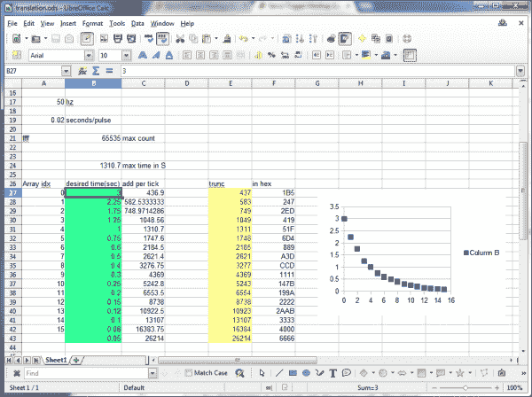](https://cdn.sparkfun.com/assets/learn_tutorials/5/2/9/spreadsheet.png)

该表只有 17 个条目，看起来相当短，但请记住，我们使用的微控制器只有 8KB 的闪存和 512 字节的 RAM，我们不希望时序表填满整个存储器。为了提高表格条目之间的分辨率，固件执行[线性插值](http://en.wikipedia.org/wiki/Linear_interpolation)以在条目之间创建更精细的点。

### 模式

伺服触发器带有几个响应模式，对于大多数伺服控制需求应该是有用的，但是，如果它们不是很合适，可以修改。

产品的两个版本(标准版和连续轮换版)通过每个版本的不同构建配置进行管理。您可以在项目设置的工具链选项卡中选择构建配置。如果你要做的只是将一个常规的伺服触发器转变成一个连续旋转的触发器(反之亦然)，只需选择所需的配置。

[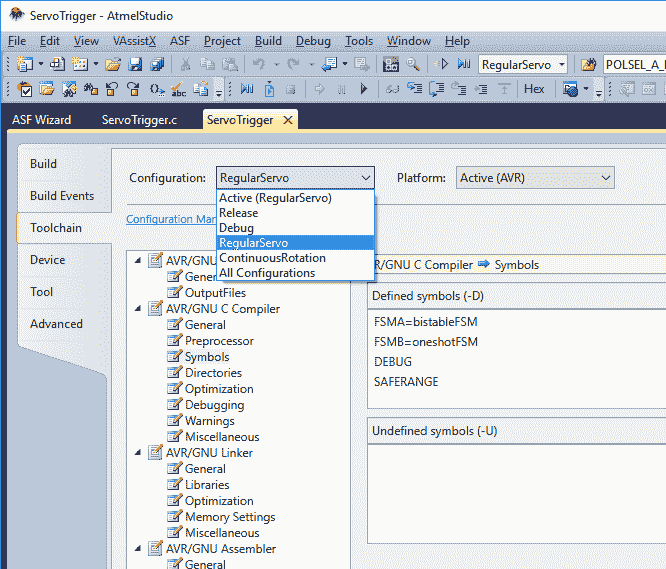](https://cdn.sparkfun.com/assets/learn_tutorials/5/2/9/build-configs.png)

这些模式通过定义传递给编译器的符号来配置。所有的模态变化都出现在相同的源代码中，使用宏来实现。您可以通过更改项目中的编译时符号来选择加载哪些模式。在 Atmel Studio 中，选择“伺服触发器”选项卡，然后导航到“工具链-> AVR/GNU C 编译器->符号”项。

[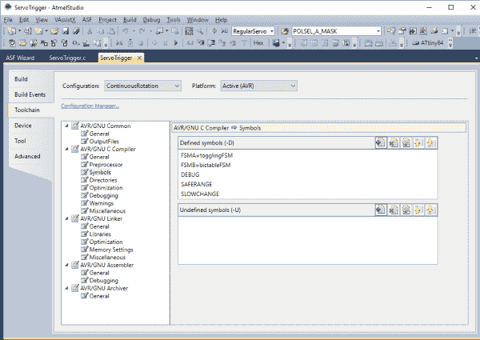](https://cdn.sparkfun.com/assets/learn_tutorials/5/2/9/CR-macros.png)If you're using the command-line tools, the symbol definitions are found in the compiler invocation in the Makefile.

`FSMA`和`FSMB`符号决定伺服触发器上编程的模式。FSMA 定义了无跳跃(默认)模式，FSMB 定义了跳跃模式。源文件中目前定义了五种模式。

1.  `bistableFSM` -默认模式-当输入有效时，它从位置 A 移动到 b。当输入保持时，它将停留在 b。当释放时，它移动回 A。
2.  `oneshotFSM` -每次输入有效时执行一个完整的循环-从 A 到 B，然后回到 A。
3.  `ctpFSM` -为互动艺术家 Christopher T Palmer 定制 oneshotFSM，允许 B-to-A 返回周期被新的输入动作中断。
4.  `togglingFSM` -每次输入有效时，它从 A 变为 B，或从 B 变为 A。该模式对驱动连续旋转伺服系统特别有用。
5.  `astableFSM` -当输入有效时，它在 A 和 b 之间来回循环。当输入无效时，它停留在原来的位置。

您可以在任一插槽中放置任何模式，甚至可以在两个插槽中放置相同的模式。

* * *

## 实施细节

正如您可能已经从名称中猜到的那样，这些模式是使用有限状态机实现的。[有限状态机](https://www.sparkfun.com/news/1801)是一种设计概念，它定义了一组状态和一组确定如何在状态之间转换的相应规则。

在伺服触发器中，每种模式都使用相同的基本状态集，这些状态反过来描述了它如何驱动伺服。这些状态是:

1.  坐在位置 a。
2.  从 A 地移动到 b 地。
3.  坐在 b 位置。
4.  从 B 地转移到 a 地。

定义状态何时可以改变的规则可以显著地改变行为。伺服触发器的不同模式都使用相同的状态来实现，但是具有不同的转换规则。

FSM 通常使用“气泡图”来说明，气泡图将状态画为圆圈，将规则画为圆圈之间的箭头。这是双稳态 FSM 的气泡图。

[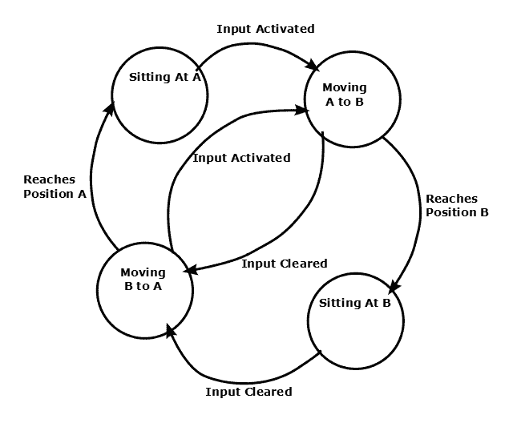](https://cdn.sparkfun.com/assets/learn_tutorials/5/2/9/bubble-diag2.png)

#### 构建新的状态机

在伺服触发器中，状态机被实现为单个函数，它包含一个`switch`语句，其中每个状态是一个`case`。在每个 PWM 周期开始时，调用状态机功能来确定脉冲宽度，并可能转移到新的状态。

如果你想实现一个新的状态机，从画气泡图开始会很有用。

如果您的新 FSM 是对现有 FSM 的轻微修改，那么查看现有 FSM 的下一个最佳位置——可能就像将状态转换规则从一个函数移植到另一个函数一样简单。如果您的 FSM 更有野心，阅读和理解 FSM 如何与固件的其余部分交互仍然是有用的。

您的应用可能需要现有 FSM 的细微变化或完全的重新制定。因为源代码是可用的，所以欢迎您修改它来满足您的需要！

### 从零开始

伺服触发器也可以用作 ATTiny84 开发板，上面有三个 trimpots，可用于任何你能想到的应用。按照[入门](https://learn.sparkfun.com/tutorials/servo-trigger-programming-guide/getting-started)一节所述，从一个空项目开始，在`main()`开始编程！

## 资源和更进一步

### 资源

*   固件在 [Atmel Studio 6.2](http://www.atmel.com/tools/studioarchive.aspx) 中开发，控制器用一个 [JTAGICE3](http://www.atmel.com/tools/JTAGICE3.aspx) 编程。
*   如果你正在为伺服触发器编写新特性，你可能需要参考 [Tiny84 数据表](http://www.atmel.com/images/doc8006.pdf)。
*   伺服触发器的源代码可以在这个 [Github Repo](https://github.com/sparkfun/Servo_Trigger) 中找到。
*   Atmel Studio 包含了 [AVR-GCC](http://www.nongnu.org/avr-libc/) 编译器。

### 更进一步

*   伺服触发器可以控制我们任何一个[爱好伺服](https://www.sparkfun.com/categories/245)。
*   你可以使用我们的许多[按钮和开关](https://www.sparkfun.com/categories/145)触发它。
*   维基百科有一篇关于[有限状态机](http://en.wikipedia.org/wiki/Finite-state_machine)的非常详细的文章。

要获得更多伺服乐趣，请查看其他 SparkFun 教程:

 [### 魔术师马里奥的神奇翻领花](https://learn.sparkfun.com/tutorials/mario-the-magicians-magical-lapel-flower) A guest tutorial from the astonishingly talented Mario the Magician showing how to put together your own servo-controlled lapel flower.[Favorited Favorite](# "Add to favorites") 2 [### 英特尔 Edison - PWM 火花模块](https://learn.sparkfun.com/tutorials/sparkfun-blocks-for-intel-edison---pwm) A quick overview of the features of the PWM Block.[Favorited Favorite](# "Add to favorites") 2 [### 伺服触发器连接导轨](https://learn.sparkfun.com/tutorials/servo-trigger-hookup-guide) How to use the SparkFun Servo Trigger to control a vast array of Servo Motors, without any programming 5 [### 连续旋转伺服触发器连接导轨](https://learn.sparkfun.com/tutorials/continuous-rotation-servo-trigger-hookup-guide) How to use the SparkFun Continuous Rotation Servo Trigger with continuous rotation servos, without any programming 11****