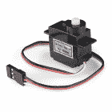

# 爱好伺服教程

> 原文：<https://learn.sparkfun.com/tutorials/hobby-servo-tutorial>

## 介绍

[伺服电机](https://www.sparkfun.com/servos)是给你的电子项目添加运动的简单方法。最初用于遥控汽车和飞机，现在出现在各种其他应用中。它们很有用，因为你可以精确控制这些马达的位置。告诉他们指向哪里，他们会为你做的。

[](https://cdn.sparkfun.com/assets/learn_tutorials/5/2/6/servo_6.jpg)*A typical hobby servo*

一台普通的 DC 发动机有两根连接线，通电后就能连续转动。如果你想让它朝相反的方向旋转，你需要逆转动力。如果你想知道它转了多远，你需要设计一种方法来测量。

[](https://cdn.sparkfun.com/assets/learn_tutorials/5/2/6/servo-and-dc.jpg)*DC motor (left) and hobby servo*

相比之下，你使用精心定时的脉冲来指示*伺服电机*转向何处。伺服系统有三条线:电源，接地，加上第三条线携带命令脉冲。

### 推荐阅读

*   一个[电机介绍](https://learn.sparkfun.com/tutorials/motors-and-selecting-the-right-one)。
*   关于[脉宽调制](https://learn.sparkfun.com/tutorials/pulse-width-modulation)的一些背景知识。

## 伺服电机背景

从最一般的意义上来说，伺服机构是一种利用反馈来达到预期效果的装置。反馈控制用于许多不同的领域，包括速度、位置和温度。

在我们这里讨论的背景下，我们谈论的是业余爱好或无线电控制伺服电机。这些小型马达主要用于操控无线电遥控车辆。因为位置容易控制，它们对机器人和电子动画也很有用。然而，它们不应该与其他类型的伺服电机混淆，例如工业机械中使用的大型电机。

[](https://cdn.sparkfun.com/assets/learn_tutorials/5/2/6/servo-samples.jpg)*An Assortment of Hobby Servos*

钢筋混凝土伺服系统是相当标准化的——它们都是相似的形状，在每一端都有安装法兰，有不同的尺寸，从“[超纳米](https://www.sparkfun.com/products/11882)”到“[巨型](https://www.sparkfun.com/products/11881)”。伺服系统通常带有多个附件，如轮子或杠杆，称为“喇叭”，可以连接到轴上，以适应他们正在操作的设备。

[](https://cdn.sparkfun.com/assets/learn_tutorials/5/2/6/servo-horns.jpg)*Example Servo Horns*

### 电气连接

大多数业余爱好伺服使用标准类型的 3 针插头，具有相同的控制信号，这使得钢筋混凝土伺服合理互换。

该连接器是一个母头、3 针、0.1 英寸间距接头。容易混淆的一点是电线颜色代码并不总是一致——有几种颜色代码在起作用。好消息是这些针通常都是同样的顺序，只是颜色不同。

[](https://cdn.sparkfun.com/assets/learn_tutorials/5/2/6/servo-color-code.jpg)*Servo Cables*

下表总结了常见的配色方案。一个有用的助记法是，最单调的颜色(黑色或棕色)通常是地，红色通常是电源。

| **Pin 码** | **信号名称** | **配色方案 1
(双叶)** | **配色方案 2
(JR)** | **配色方案 3
(Hitec)** |
| one | 地面 | 黑色 | 褐色的 | 黑色 |
| Two | 电源 | 红色 | 红色 | 红色还是棕色 |
| three | 控制信号 | 怀特（姓氏） | 柑橘 | 黄色还是白色 |

*Servo connection Color Coding***Heads up!** If you're in doubt about your color scheme, check the documentation -- don't plug it in backwards!

### 控制信号

伺服连接器的第三个引脚携带控制信号，用于告诉电机去哪里。该控制信号是一种特定类型的脉冲序列。脉冲以 20 毫秒(50 赫兹)的间隔出现，宽度在 1 到 2 毫秒之间变化。微控制器上可用的[脉宽调制](https://learn.sparkfun.com/tutorials/pulse-width-modulation)硬件是产生伺服控制信号的一种很好的方式。

当脉冲在 1 到 2 毫秒之间变化时，普通的伺服系统在 90°的范围内旋转-当脉冲为 1.5 毫秒时，它们应该在它们的机械范围的中心。

[](https://cdn.sparkfun.com/assets/learn_tutorials/5/2/6/pulse-illus.png)*pulse to position*

### 驱动伺服系统

在 RC 车辆中，标称电池电压为 4.8V，充电后会稍高，随着电池放电，电压会下降。随着电压下降，可用扭矩也下降-如果你驾驶过遥控车辆，你无疑熟悉电池变弱时发生的失控。它在死亡前开始感觉迟钝。

如果你不用电池，从普通电源获得的 5v 直流电压是一个不错的选择。如果你使用 Arduino 或其他微控制器(如 SparkFun [伺服触发器](https://www.sparkfun.com/products/13118))来控制你的电机，那么应该施加的**绝对最大**电源电压是 **5.5 VDC** 。

不管你如何给它们供电，值得注意的是，电机消耗的电流随着机械负载的增加而增加。一个轴上没有任何附件的小型伺服系统可能消耗 10 毫安，而一个转动沉重杠杆的大型伺服系统可能消耗 1 安培甚至更多！如果您的电源无法完成任务，紧张或停滞的伺服系统可能会导致电源电压下降，这可能会产生其他不可预测的影响，例如导致微控制器复位。

此外，如果您有多个伺服系统，或者在电机移动重要负载的应用中，最好使用粗规格导线，让每个伺服系统直接连接到电源，而不是以菊花链形式连接电源。这种配置通常被称为“明星力量”如果一个伺服导致电源轨下垂，当每个都有直接连接时，它不太可能影响其他的。

[](https://cdn.sparkfun.com/assets/learn_tutorials/5/2/6/servo-star2.png)*Star power.*

当有疑问时，拿一个万用表，测量消耗的电流，并检查 VCC 是否在伺服系统转动时下降。

### 给我看看勇气

在内部，伺服电机的机制使用一个附在旋转轴上的电位计来感测位置。它测量输入脉冲的宽度，并向电机施加电流以转动轴，直到电位计指示位置对应于输入脉冲宽度。这是*反馈控制*的一种形式。电机已从脉冲宽度接收到所需位置，实际轴位置通过电位计反馈到电路。它将期望值与实际值进行比较，并以使实际值与期望值相匹配的方向驱动电机。

这是一个被解剖的伺服机构的内部。你可以看到齿轮，DC 电机，位置电位计，和一个小的印刷电路板。PCB 的一侧有一个芯片，可能是一个小型微控制器或专门的伺服 IC。

[](https://cdn.sparkfun.com/assets/learn_tutorials/5/2/6/servo-guts_1.jpg)*Inside an RC servo*

PCB 的另一侧有一些分立晶体管，可能采用 H 桥配置，使控制器能够控制电流以顺时针和逆时针两个方向流过电机。

[](https://cdn.sparkfun.com/assets/learn_tutorials/5/2/6/servo-guts2.jpg)*Back of the PCB*

## 一些区别

当你为你的项目购买伺服系统时，有几个参数你需要记住。

### 范围约束

1 到 2 毫秒的脉冲范围更多的是一种*惯例*，而不是一种硬性的*标准*。一些伺服电机响应甚至更短或更长的脉冲，具有更大的运动范围。

请注意，这是有风险的——这种扩大的运动范围并不普遍。一些伺服系统机械限制为 90°旋转。试图让它们超出极限会导致损坏，例如齿轮磨损。我们在这里看到拆除的伺服系统也遭受了同样的命运。

[](https://cdn.sparkfun.com/assets/learn_tutorials/5/2/6/range-constraint.jpg)*The nub on the gear is used to constrain the range of rotation.*

### 位置与连续旋转

从 90°范围进一步移动，还有**全旋转**、**连续旋转**，或简单的**360°**伺服。顾名思义，轴连续转动，使它们可以用作驱动电机。从视觉上看，它们看起来就像普通的伺服系统。

[](https://cdn.sparkfun.com/assets/learn_tutorials/5/2/6/cr-servo.jpg)*Look carefully, and you'll notice the "360°" mark on the packaging.*

连续旋转伺服系统不是控制位置，而是将 20 毫秒的脉冲序列信号转换成轴的旋转速度和方向。否则，他们非常类似于定期钢筋混凝土伺服-他们使用相同的电源，控制信号，3 针连接器，并可在相同的大小作为钢筋混凝土伺服。

整体速度相对较低——大约 60 转/分是常见的最大速度——如果你需要更高的转速，伺服系统不是最好的选择—[DC 减速电机](https://www.sparkfun.com/categories/247)或无刷 DC 电机更有可能是候选产品，但它们不直接与伺服控制信号兼容。

[](https://cdn.sparkfun.com/assets/learn_tutorials/5/2/6/cr-servo-trimmer.jpg)*Nulling Trimpot*

仔细观察，连续旋转伺服系统与常规伺服系统有一个小小的不同:它们通常有一个“调零”微调，用于调整它们对控制信号的响应。它通常设置为 1.5 毫秒脉冲停止电机。较短的脉冲会使它逆时针转动，较长的脉冲会使它顺时针转动。

### 模拟与数字

我们在这里讨论的脉冲控制伺服系统是模拟的。还有使用高速脉冲序列的 [*数控*](http://hitecrcd.com/faqs/servos/digital-servos) 伺服系统，并具有允许更详细配置的[串行通信](http://hitecrcd.com/products/servos/digital-servo-programmers-2/hfp-25-digital-servo-programmer-tester-2/product)接口，通常具有为 RC 车辆定制的参数。

### 塑料齿轮与金属齿轮

考虑伺服系统时，最后要看的是它包含的齿轮类型。

廉价的伺服系统(如这里拆除的)通常包含模制塑料齿轮，而更昂贵的伺服系统有金属齿轮。如果电机卡住或过载，塑料齿轮更容易脱落。古老的格言听起来很正确:你得到你所付出的。

[](https://cdn.sparkfun.com/assets/learn_tutorials/5/2/6/gear-2.jpg)*Note the missing tooth at about 3:00 o'clock on the inner gear!*

## 部署伺服系统

### 传统 RC 应用

正如我们在介绍中所述，hobby 伺服电机通常用于驾驶无线电遥控车辆。

[](https://cdn.sparkfun.com/assets/learn_tutorials/5/2/6/rc-rig.jpg)*RC transmitter (top left), with receiver and steering servo.*

遥控车辆是由一个发射器控制的，这个发射器就是装有操纵杆和天线的盒子。发射器将控制信息发送到接收器模块(上面显示的橙色方框)，接收器模块连接到伺服电机。当发射器上的棒被移动时，接收器产生相应的脉冲，指示马达移动。

配置旧的遥控飞机需要相当大的耐心，因为调整伺服意味着仔细的机械调整伺服喇叭，机械连接和发射机上的微调控制。现代的发射器和接收器都是基于微控制器的，通过发射器上的 LCD，甚至是计算机接口来调整。

## 用 Arduino 控制伺服系统

因为它们根据命令移动，所以伺服电机是向任何项目添加运动的简单方法。如果您正在使用 Arduino 兼容平台，Arduino [伺服库](https://www.arduino.cc/en/Reference/Servo)提供了现成的伺服脉冲生成解决方案。

### 材料

要构建这个示例，您需要以下材料。

[](https://www.sparkfun.com/products/13975) 

将**添加到您的[购物车](https://www.sparkfun.com/cart)中！**

 **### [spark fun red board——用 Arduino 编程 T3](https://www.sparkfun.com/products/13975)

[In stock](https://learn.sparkfun.com/static/bubbles/ "in stock") DEV-13975

SparkFun RedBoard 结合了 UNO 的 Optiboot 引导程序的简单性、FTDI 的稳定性和 shield com…

$21.5049[Favorited Favorite](# "Add to favorites") 89[Wish List](# "Add to wish list")****[](https://www.sparkfun.com/products/9065) 

将**添加到您的[购物车](https://www.sparkfun.com/cart)中！**

 **### [【伺服-通用(亚微米尺寸)](https://www.sparkfun.com/products/9065)

[In stock](https://learn.sparkfun.com/static/bubbles/ "in stock") ROB-09065

这是一款简单、低成本、高质量的伺服系统，可以满足您所有的机电需求。这个伺服是非常相似的大小和规格…

$9.9512[Favorited Favorite](# "Add to favorites") 41[Wish List](# "Add to wish list")****[](https://www.sparkfun.com/products/9385) 

将**添加到您的[购物车](https://www.sparkfun.com/cart)中！**

 **### [跳线高级 12" M/F 装 10 根](https://www.sparkfun.com/products/9385)

[In stock](https://learn.sparkfun.com/static/bubbles/ "in stock") PRT-09385

这是一个 SparkFun 独家！这些是 12 英寸长、26 AWG 跳线，端接为公母连接。用这些从…上跳下来

$4.951[Favorited Favorite](# "Add to favorites") 11[Wish List](# "Add to wish list")****[](https://www.sparkfun.com/products/retired/12889) 

### [壁式适配器电源- 5V DC 2A(桶形插孔)](https://www.sparkfun.com/products/retired/12889)

[Retired](https://learn.sparkfun.com/static/bubbles/ "Retired") TOL-12889

这是一个高品质的开关“壁式电源”交流到 DC 5V 2000 毫安桶形插座壁式电源，专为…

16 **Retired**[Favorited Favorite](# "Add to favorites") 19[Wish List](# "Add to wish list")****** ******### 连接

将伺服系统挂在红纸板上非常简单。它只需要 3 个连接。

[](https://cdn.sparkfun.com/assets/learn_tutorials/5/2/6/servoExample_bb.png)*Connecting a Servo to a RedBoard*

特别要注意的是，伺服电机的电源是由`VIN`引脚提供的，它绕过了板载调节器。板载调节器不足以驱动任何东西，但最小的伺服。你还会注意到，该项目是由一个 5V 的墙上适配器供电。在作者的工作台上，当板由 USB 端口供电时，性能是微不足道的。

### 固件

电路接通后，加载以下草图。

**注意:**此示例假设您在桌面上使用的是最新版本的 Arduino IDE。如果这是你第一次使用 Arduino，请回顾我们关于[安装 Arduino IDE 的教程。](https://learn.sparkfun.com/tutorials/installing-arduino-ide)

If you have not previously installed an Arduino library, please check out our [installation guide.](https://learn.sparkfun.com/tutorials/installing-an-arduino-library)

```
language:c
/******************************************************************************
servo-skatch.ino
Example sketch for connecting a hobby servo to a sparkfun redboard
  (https://www.sparkfun.com/products/9065)
  (https://www.sparkfun.com/products/12757)
Byron Jacquot@ SparkFun Electronics
May 17, 2016

**SparkFun code, firmware, and software is released under the MIT License(http://opensource.org/licenses/MIT).**

Development environment specifics:
Arduino 1.6.5
******************************************************************************/

#include <Servo.h>

Servo testservo;

uint32_t next;

void setup()
{
  // the 1000 & 2000 set the pulse width 
  // mix & max limits, in microseconds.
  // Be careful with shorter or longer pulses.
  testservo.attach(9, 1000, 2000);

  next = millis() + 500;
}

void loop()
{
  static bool rising = true;

  if(millis() > next)
  {
    if(rising)
    {
      testservo.write(180);
      rising = false;
    }
    else
    {
      testservo.write(0);
      rising = true;
    }

    // repeat again in 3 seconds.
    next += 3000;
  }

} 
```

这个草图来回驱动伺服系统。

特别注意第 26 行的`attach()`调用。它使用可选的`min`和`max`参数，将脉冲限制在 1000 到 2000 微秒(1 到 2 毫秒)的范围内。如上文[范围限制](https://learn.sparkfun.com/tutorials/hobby-servo-tutorial/a-handful-of-distinctions#constraints)部分所述，在该范围之外驱动伺服系统可能会损坏伺服系统。

The Servo object can be a little bit confusing about the ranges and positions, particularly if the minimum and maximum pulses are defined in the `attach()` call. With the minimum and maximum defined, the parameters to the `write()` method (ideally expressed in degrees) get retranslated to the constrained range. In the example, `write(0)` will result in a 1 millisecond pulse, and `write(180)` yields a 2 millisecond pulse. On an average servo, this translates to approximately 90° of motion, not the 180° that the call parameters would indicate.

伺服库也有一些其他的限制。最值得注意的是，它覆盖了引脚 9 和 10 上的`analogWrite()`。有关该库的更多信息，请查看 [Arduino 参考页面](https://www.arduino.cc/en/Reference/Servo)。

如果事情似乎不太对劲，请查看[故障排除](https://learn.sparkfun.com/tutorials/hobby-servo-tutorial/troubleshooting)部分。

## 用伺服触发器

在上一节中从头开始编写了一个伺服示例后，还有另一种不需要任何编程就可以部署伺服的方法。

[](https://cdn.sparkfun.com/assets/learn_tutorials/5/2/6/prod-iso.jpg)*The Servo Trigger*

SparkFun 伺服触发器是一个专门用于驱动业余爱好伺服的小电路板。它有微调按钮，允许您设置伺服位置，并通过启动开关在位置之间跳转。有[标准](https://www.sparkfun.com/products/13118)和[连续旋转](https://www.sparkfun.com/products/13872)两种版本。有关伺服触发器的更多详细信息，请查阅各自的连接指南。

## 解决纷争

不管你如何驾驶它，伺服有时需要一点额外的关注才能工作。以下是一些故障排除技巧。

*   甚至空载的伺服系统也能消耗相当多的能量。为了达到最大强度，您应该确保您的电源能够为每个伺服系统提供至少一安培的电流。
    *   当电源无法完成任务时，伺服系统表现不佳。它们会比动力正常的伺服系统移动得更慢。
    *   动力不足的伺服系统容易出现*振荡*，它们不会干净利落地移动到想要的位置，而是在那个位置附近来回移动。他们也可能听到嗡嗡声，或反复复位。
    *   在某些情况下，当伺服系统和处理器使用同一个电源时，伺服系统会消耗太多的电流(或在线路上产生太多的噪声),这可能会导致您的处理器复位或行为失常。解决这个问题的最简单的方法是用独立的电源运行处理器和伺服系统(但是要确保它们之间有一个共同点)。更复杂的解决方案涉及电源噪声滤波技术；谷歌寻求建议。
    *   通过 USB 为您的项目供电仅适用于最小的伺服电机。一个中等伺服很容易超过 100 毫安可从一个 USB 端口。
    *   如果你的电源指示灯闪烁时，你试图启动伺服，你在危险的领土！
*   伺服系统有最高速度。如果你的伺服动作不稳定，你可能试图让它从一个位置切换到另一个太快。命令之间的停顿给了伺服系统反应的时间。
*   如[范围限制](https://learn.sparkfun.com/tutorials/hobby-servo-tutorial/a-handful-of-distinctions#constraints)部分所述，一些伺服系统有不同的运动范围。
    *   当伺服系统被驱动经过它们的终点挡板时，它们可能会发出嗡嗡声，或者摩擦它们的齿轮。如果你的伺服系统开始发出咔嗒声，那就要小心了，这是齿轮卡住的信号。
    *   如果这将影响您的项目，寻找一个指定提供 180 度旋转的伺服。另外，请注意，伺服库的 attach()命令允许您微调每个伺服的最小和最大位置，以帮助避免驱动它超出限制。

快乐伺服！

## 资源&更进一步

### 资源

*   [伺服电机](https://www.sparkfun.com/categories/245)类别包含各种各样的伺服电机。笔者发现[通用金属齿轮微型伺服](https://www.sparkfun.com/products/10333)表现特别好。
*   SparkFun 伺服触发器有[标准](https://www.sparkfun.com/products/13118)和[连续旋转](https://www.sparkfun.com/products/13872)两种。
*   [Micro Maestro](https://www.sparkfun.com/products/9664) 是一个六通道 USB 到伺服接口。

### 更进一步

*   维基百科上关于无线电控制伺服系统的文章包含了更多更详细的信息和伺服系统的历史。
*   [uArm](https://www.sparkfun.com/products/13663) 是由伺服电机驱动的机械臂。
*   你可以[黑掉](http://www.instructables.com/id/How-to-hack-a-servo-for-continuous-rotation-Towe/?ALLSTEPS)一个普通的伺服系统，把它变成一个连续旋转的伺服系统。
*   你也可以[移除控制板](http://www.instructables.com/id/HiTec-Servo-Hack/?ALLSTEPS)，把一个伺服系统变成一个小的 DC 齿轮马达。

要获得更多伺服乐趣，请查看其他 SparkFun 教程:

[](https://learn.sparkfun.com/tutorials/mario-the-magicians-magical-lapel-flower) [### 魔术师马里奥的神奇翻领花](https://learn.sparkfun.com/tutorials/mario-the-magicians-magical-lapel-flower) A guest tutorial from the astonishingly talented Mario the Magician showing how to put together your own servo-controlled lapel flower.[Favorited Favorite](# "Add to favorites") 2[](https://learn.sparkfun.com/tutorials/sparkfun-blocks-for-intel-edison---pwm) [### 英特尔 Edison - PWM 火花模块](https://learn.sparkfun.com/tutorials/sparkfun-blocks-for-intel-edison---pwm) A quick overview of the features of the PWM Block.[Favorited Favorite](# "Add to favorites") 2[](https://learn.sparkfun.com/tutorials/servo-trigger-hookup-guide) [### 伺服触发器连接导轨](https://learn.sparkfun.com/tutorials/servo-trigger-hookup-guide) How to use the SparkFun Servo Trigger to control a vast array of Servo Motors, without any programming 5[](https://learn.sparkfun.com/tutorials/continuous-rotation-servo-trigger-hookup-guide) [### 连续旋转伺服触发器连接导轨](https://learn.sparkfun.com/tutorials/continuous-rotation-servo-trigger-hookup-guide) How to use the SparkFun Continuous Rotation Servo Trigger with continuous rotation servos, without any programming 11******