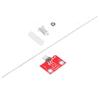
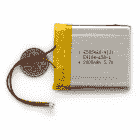
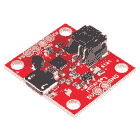
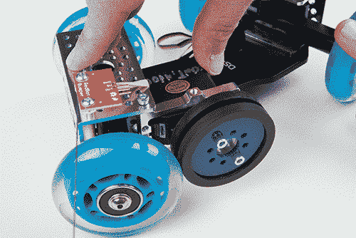

# 连续旋转伺服触发器连接导轨

> 原文：<https://learn.sparkfun.com/tutorials/continuous-rotation-servo-trigger-hookup-guide>

## 介绍

当我们介绍常规的[伺服触发器](https://www.sparkfun.com/products/13118)时，我们提到它可以被重新编程，使其对连续旋转伺服电机更加有用。然而，重新编程固件有些繁琐，用户要求用连续旋转逻辑预编程伺服触发器。你问了，我们听了！介绍[连续旋转伺服触发器](https://www.sparkfun.com/products/13872)！这个名字很拗口，但如果你正在寻找一种简单的方法来部署连续旋转伺服系统，它应该正是你在寻找的。

 

将**添加到您的[购物车](https://www.sparkfun.com/cart)中！**

 **### [SparkFun 伺服触发器-连续旋转](https://www.sparkfun.com/products/13872)

[In stock](https://learn.sparkfun.com/static/bubbles/ "in stock") WIG-13872

SparkFun 连续旋转(CR)伺服触发器是一个小型机器人板，它简化了对 hobby RC 伺服电机的控制

$14.95[Favorited Favorite](# "Add to favorites") 7[Wish List](# "Add to wish list")** **像它的兄弟姐妹一样，连续旋转伺服触发器允许你在没有任何编程的情况下控制一个业余爱好伺服电机。伺服速度和方向使用 trimpots 进行调整，方向可以通过连接一个开关来改变。

在本指南中，我们将向您展示如何快速让您的 CR 伺服触发器工作，然后讨论一些使用和配置它的细节。最后，我们将展示它是如何被用来建立一个简单的自动相机小车。

### 推荐阅读

*   在这个连接指南中，我们不会深入到业余爱好伺服的基础。如果你想要更详细的信息，可以查看我们的[爱好伺服教程](https://learn.sparkfun.com/tutorials/hobby-servo-tutorial)。
*   更多关于[马达](https://learn.sparkfun.com/tutorials/motors-and-selecting-the-right-one)的背景知识。
*   如果你来这里寻找关于常规[伺服触发器](https://www.sparkfun.com/products/13118)的信息，你可以在这里找到它的[连接指南](https://learn.sparkfun.com/tutorials/servo-trigger-hookup-guide)。

## 连续旋转伺服电机

连续旋转伺服(有时称为**全旋转**或 **360** 伺服)看起来像一个常规的业余爱好伺服。常规的伺服电机只能在很窄的范围内转动，并对位置进行精确控制，而连续旋转伺服电机的轴可以连续旋转，并可以控制其速度和方向。

使用每 20 毫秒(50 赫兹)发送一次的脉冲序列信号来执行控制，该脉冲序列信号通常具有从 1 到 2 毫秒变化的脉冲。一毫秒脉冲对应于一个方向上的全速，而两毫秒脉冲是另一个方向上的全速。在一个普通的微控制器上使用[脉宽调制](https://learn.sparkfun.com/tutorials/pulse-width-modulation)硬件很容易产生这些脉冲。

*Two millisecond pulses, sent every 20 milliseconds.*

在这两个极端之间，一个 1.5 毫秒的脉冲应该会使马达停止。大多数 CR 伺服系统都有一个调整螺钉或微调按钮，允许您微调停止点，这种校准程序通常被称为**调零**。

*Nulling trimpot*

使用 CR 伺服触发器，可以在板上调整停止点，但如果它的行为出乎意料，请仔细检查伺服本身的微调是否是问题的根源。

## 快速入门

让我们跳进去，构建一个电路来展示伺服触发器是如何工作的！

### 材料和工具

您需要以下材料来构建本教程中的示例电路。

 

将**添加到您的[购物车](https://www.sparkfun.com/cart)中！**

 **### [【伺服-通用高转矩连续旋转(标准尺寸)](https://www.sparkfun.com/products/9347)

[In stock](https://learn.sparkfun.com/static/bubbles/ "in stock") ROB-09347

这里，你所有的机电需求，是一个简单的，高品质的连续旋转伺服电机。这个伺服系统可以带 i…

$14.956[Favorited Favorite](# "Add to favorites") 32[Wish List](# "Add to wish list")**** 

将**添加到您的[购物车](https://www.sparkfun.com/cart)中！**

 **### [瞬时按钮开关- 12mm 方形](https://www.sparkfun.com/products/9190)

[In stock](https://learn.sparkfun.com/static/bubbles/ "in stock") COM-09190

这是一个标准的 12 毫米方形瞬时按钮。我们真正喜欢的是大按钮头和良好的触感(它点击…

$0.554[Favorited Favorite](# "Add to favorites") 52[Wish List](# "Add to wish list")**** 

将**添加到您的[购物车](https://www.sparkfun.com/cart)中！**

 **### [挣脱男头球-直角](https://www.sparkfun.com/products/553)

[In stock](https://learn.sparkfun.com/static/bubbles/ "in stock") PRT-00553

一排直角公接头-断开以适合。40 个引脚，可切割成任何尺寸。用于定制 PCB 或一般定制…

$2.255[Favorited Favorite](# "Add to favorites") 47[Wish List](# "Add to wish list")**** 

将**添加到您的[购物车](https://www.sparkfun.com/cart)中！**

 **### [DC 筒式千斤顶适配器——母](https://www.sparkfun.com/products/10288)

[In stock](https://learn.sparkfun.com/static/bubbles/ "in stock") PRT-10288

此适配器允许您将筒式插孔连接器连接到裸线。一端有螺丝端子，另一端有一个 5.5…

$3.501[Favorited Favorite](# "Add to favorites") 24[Wish List](# "Add to wish list")**** 

将**添加到您的[购物车](https://www.sparkfun.com/cart)中！**

 **### [SparkFun 伺服触发器-连续旋转](https://www.sparkfun.com/products/13872)

[In stock](https://learn.sparkfun.com/static/bubbles/ "in stock") WIG-13872

SparkFun 连续旋转(CR)伺服触发器是一个小型机器人板，它简化了对 hobby RC 伺服电机的控制

$14.95[Favorited Favorite](# "Add to favorites") 7[Wish List](# "Add to wish list")**** 

### [壁式适配器电源- 5V DC 2A(桶形插孔)](https://www.sparkfun.com/products/retired/12889)

[Retired](https://learn.sparkfun.com/static/bubbles/ "Retired") TOL-12889

这是一个高品质的开关“壁式电源”交流到 DC 5V 2000 毫安桶形插座壁式电源，专为…

16 **Retired**[Favorited Favorite](# "Add to favorites") 19[Wish List](# "Add to wish list")********** **********你还需要一些[连接线](https://www.sparkfun.com/products/11375)和[小螺丝刀](https://www.sparkfun.com/products/9146)。

### 仔细检查扳机

在我们开始建造之前，再次检查你是否有一个[连续旋转伺服触发器](https://www.sparkfun.com/products/13872)。PCB 背面有勾选框，要标注“连续旋转”框。

### 准备

首先，[将](https://learn.sparkfun.com/tutorials/how-to-solder---through-hole-soldering)一些电线焊接到触觉开关上。如果你把腿焊接在相对的角上(例如，右上角和左下角)，你可以确信当你按下按钮时你会得到一个触点闭合。

*Switch Assembly*

接下来，准备电源插头引线。拿一对电线，剥去两端。然后将它们拧到电源插孔适配器上——如果你仔细观察适配器，你会注意到塑料上有一个小的`+`和`-`浮雕。我们在`+`终端上用红色电线连接 VCC，在`-`终端上用黑色电线连接地线。

*Power Jack Closeup*

取你的直角公头，把三个公头的一部分拍下来。将 3 针接头焊接到电路板末端的三个焊盘上，并将伺服系统插入接头。小心让插头正确定向——你可以查看伺服教程中的[色码表](https://learn.sparkfun.com/tutorials/hobby-servo-tutorial/servo-motor-background#colortable)，或者查阅伺服制造商的数据表。

将开关线焊接到伺服触发器上的`IN`和`GND`焊盘，将电源引线焊接到电路板边缘的`VCC`和`GND`焊盘。这些都反映在电路板的相对边缘-他们是平行的，所以你可以使用任何一组垫。红线应连接到`VCC`焊盘，黑线应连接到`GND`。

在我们开机之前，花一点时间对照下面的照片仔细检查你的工作(点击图片查看大图)。特别是，确保电源和伺服连接方向正确。

*Adjusting the trimpots.*

调整电路板背面的微调按钮。逆时针将`A`完全设定，顺时针将`B`完全设定，并将`T`设定到中间。

最后，施加力量。伺服系统应该开始转动。如果没有，关闭电源，并重新检查您的工作。

当它运行时，点击开关。伺服将需要几秒钟的时间来减速，停止，然后逆转。再按一下开关，它就会回到原来的方向。

现在，您可以调整微调按钮来配置伺服系统。

*   `A`设定开关启动前电机的速度和方向。
*   `B`设定开关启动后电机的速度和方向。
*   `T`设置从 A 到 B 往返所需的时间。

当 A 和 B 接近它们旋转的中间时，伺服将停止。从那里顺时针转动它们指示伺服转向一个方向；逆时针转动它们会导致相反的方向。离中心越远，伺服转动越快。过渡时间在 50 毫秒和 10 秒之间可调。过渡时间是恒定的-当设置为 2 秒时，伺服将花费 2 秒在 A 和 B 之间移动，不管 A 和 B 设置有多接近。

在下一节中，我们将探索连续旋转伺服触发器的一些更好的细节。

## 操作理论

伺服触发器包括两个主要的工程交付成果，硬件设计和固件。常规和连续旋转板的硬件实际上是相同的，但它们加载了不同的固件，为每种类型的伺服电机定制了板的行为。两套可交付物都在[伺服触发器 Github 库](https://github.com/sparkfun/Servo_Trigger)中。

### 董事会

让我们看看板上的元件，看看它们是做什么的。

伺服触发器的核心是 Atmel ATTiny84 微控制器，运行一个小程序来实现我们在这里讨论的伺服控制功能。仅仅因为伺服触发器让你不需要写代码并不意味着没有编程！

伺服控制信号由 16 位硬件定时器产生。它采用 1 MHz 时钟，计数到 20000 以产生 20 毫秒(50 Hz)的周期，并配置为产生 1000 至 2000 秒(1 至 2 毫秒)的脉冲。

三个电位计作为分压器连接在 VCC 和地之间。它们通过模拟输入 ADC0、ADC3 和 ADC7 读取。

使用 PortA 的输入引脚 1 读取开关输入。它在软件中去抖，并且可以配置为观察开关闭合或逻辑电平脉冲。

该板还包括通用的 6 针系统内编程接头，我们将在[伺服触发器编程指南](https://learn.sparkfun.com/tutorials/servo-trigger-programming-guide)中讨论。但是我们有点超前了——有一些不需要编程就可以使用的配置选项。

### 配置

伺服触发器有几个配置选项。如果你看 PCB 的背面，你会注意到两个焊接跳线，可以用来改变伺服触发器的响应。

*Configuration Jumpers, SJ1 and SJ2.*

当它第一次上电时，伺服触发器读取这些跳线并相应地配置自己。

#### 模式

伺服触发器有两种不同的伺服控制模式，通过跳线 1 (SJ1)选择。它们可用于针对不同应用定制电路板的响应。

默认模式实现**切换**控制。触发器按照微调器`A`的指示初始化驱动伺服系统。当开关关闭时，它转换到由`B`指示的速度。当开关再次闭合时，它返回到`A`。使用微调器`T`选择`A`和`B`之间的时间，范围从几乎瞬间到 10 秒，允许电机逐渐减速、停止和反转。

*Mode Jumper Cleared - Toggling Control*

这种行为可以通过在模式跳线的焊盘之间流动焊料来改变。

*Closing SJ1 to select bistable mode.*

随着焊接跳线闭合，模式变为**双稳态**控制——当开关打开时，伺服将以速度 A 驱动，当开关闭合时，以速度 B 驱动。当开关输入处于一种状态时，伺服以相应的速度驱动——在*两种*不同状态下*稳定*。

*Mode Jumper Cleared - Bistable Control*

#### 输入极性

也可以使用跳线 2 (SJ2)改变伺服触发器输入灵敏度。

默认配置不使用焊料，将伺服触发器配置为与常开开关一起使用，微控制器上的内部上拉电阻使能。这种配置也适用于低电平有效逻辑输入。

SJ2 闭合时，内部上拉电阻禁用，输入设为高电平有效逻辑输入。

If SJ2 is closed, be careful about powering up the Servo Trigger when the input is not connected to anything. When the input is floating, it can randomly jump between active and inactive and may cause the motor to behave unpredictably.

*关于命名的说明*:由于输入极性可以交换，这可能很难讲——电压可能很高，但当意义颠倒时，它表明输入没有被激活。为了帮助导航，极性中性术语**有效**或**有效**用于描述输入何时被使用，而**无效**或**无效**用于描述默认状态。

### 更多组件

伺服触发器可以与比以上示例中使用的更多种类的外部元件一起使用。我们使用了一个标准尺寸的连续旋转伺服系统，虽然我们也提供了一个 T2 微型伺服系统。

你也可以使用不同的开关，如[微动开关](https://www.sparkfun.com/products/9506)或[脚踏板](https://www.sparkfun.com/products/11192)。

### 电力说明

与伺服电机相比，伺服触发板消耗的电流非常小，大约为 5 mA。

电机消耗的电流要大得多——一个使用小型伺服系统的快速试验台测试显示，电机闲置时消耗 10 毫安，移动时消耗约 70 毫安。抓住喇叭并扭转会导致控制器向电机施加电流，抵消扭转。在这次测试中，它消耗了 700 毫安的电流——一个更大的伺服系统可以消耗更多的电流！

当你给系统增加更多的电机时，这些电流会变得惊人的高——你需要选择一个有足够容量的电源。每台电机一安培是一个合理的准则。关于给伺服系统供电的更多信息，请参见我们的伺服教程的[给伺服系统供电](https://learn.sparkfun.com/tutorials/hobby-servo-tutorial/servo-motor-background#powering)部分。

如果有疑问，拿一个万用表，测量消耗的电流，并检查当伺服系统转动时，电路板输入端的 VCC 是否低于预期电压。

### 解决纷争

如果启动输入时没有变化，首先检查 A 和 B 是否设置在相同的位置，否则没有速度变化！

如果从外部器件向输入端输入逻辑信号，请确保驱动信号的时间超过 50 毫秒。PWM 信号每 50 毫秒更新一次，短于该时间的事件可能会被错过。

如果伺服机构只在一个方向上转动，请再次检查伺服机构上的微调点是否在其范围的中心附近。如果它靠近一端或另一端，伺服将从全速到停止，但不是反向。

有关其他伺服故障排除的想法，请查阅[伺服图雷](https://learn.sparkfun.com/tutorials/hobby-servo-tutorial/troubleshooting)。

## 示例项目

为了演示连续旋转伺服触发器的有用性，我们将连续旋转伺服放在一个小的摄像机小车上。这个小车的两端都有一个触须开关，允许它自动移动桌面摄像机。

缺少一个老式的滚轴滑板来拆卸底盘，我们开始用一个商业[相机滑板小车](http://www.bhphotovideo.com/c/product/999686-REG/revo_scaled_skter_dly_w.html)。

 

将**添加到您的[购物车](https://www.sparkfun.com/cart)中！**

 **### [跳线- 0.1”，2 针，4”](https://www.sparkfun.com/products/10362)

[In stock](https://learn.sparkfun.com/static/bubbles/ "in stock") PRT-10362

这是一根简单的双线电缆。非常适合从一个板跳到另一个板或者做其他事情。有一个 2 针 JST 环…

$1.05[Favorited Favorite](# "Add to favorites") 3[Wish List](# "Add to wish list")**** 

将**添加到您的[购物车](https://www.sparkfun.com/cart)中！**

 **### [【伺服-通用高转矩连续旋转(标准尺寸)](https://www.sparkfun.com/products/9347)

[In stock](https://learn.sparkfun.com/static/bubbles/ "in stock") ROB-09347

这里，你所有的机电需求，是一个简单的，高品质的连续旋转伺服电机。这个伺服系统可以带 i…

$14.956[Favorited Favorite](# "Add to favorites") 32[Wish List](# "Add to wish list")**** 

将**添加到您的[购物车](https://www.sparkfun.com/cart)中！**

 **### [跳线- 0.1”，2 针，6”](https://www.sparkfun.com/products/10367)

[In stock](https://learn.sparkfun.com/static/bubbles/ "in stock") PRT-10367

这是一根简单的双线电缆。非常适合从一个板跳到另一个板或者做其他事情。有一个 2 针 JST 环…

$1.60[Favorited Favorite](# "Add to favorites") 2[Wish List](# "Add to wish list")**** 

将**添加到您的[购物车](https://www.sparkfun.com/cart)中！**

 **### [SparkFun 伺服触发器-连续旋转](https://www.sparkfun.com/products/13872)

[In stock](https://learn.sparkfun.com/static/bubbles/ "in stock") WIG-13872

SparkFun 连续旋转(CR)伺服触发器是一个小型机器人板，它简化了对 hobby RC 伺服电机的控制

$14.95[Favorited Favorite](# "Add to favorites") 7[Wish List](# "Add to wish list")**** 

将**添加到您的[购物车](https://www.sparkfun.com/cart)中！**

 **### [SparkFun RedBot 传感器-机械保险杠](https://www.sparkfun.com/products/11999)

[23 available](https://learn.sparkfun.com/static/bubbles/ "23 available") SEN-11999

这些简单的开关是 SparkFun RedBot 的机械保险杠传感器，让您能够检测碰撞…

$6.502[Favorited Favorite](# "Add to favorites") 9[Wish List](# "Add to wish list")**** 

### [锂离子电池——2000 mah](https://www.sparkfun.com/products/retired/8483)

[Retired](https://learn.sparkfun.com/static/bubbles/ "Retired") PRT-08483

这些电池非常纤薄，重量极轻，基于新的聚合物锂离子化学。这是最高的烯…

26 **Retired**[Favorited Favorite](# "Add to favorites") 45[Wish List](# "Add to wish list") 

### [SparkFun 动力电池-脂肪充电器/升压器](https://www.sparkfun.com/products/retired/11231)

[Retired](https://learn.sparkfun.com/static/bubbles/ "Retired") PRT-11231

PowerCell 板是一个单电池 LiPo boost 转换器(至 3.3V 和 5V)和微型 USB 充电器。该板配有…

14 **Retired**[Favorited Favorite](# "Add to favorites") 33[Wish List](# "Add to wish list")********** **********我们在工作间周围还有一些废弃的机器人部件，我们用它们来组装所有的东西。我们用手边的材料即兴创作，建议你也这样做！

### 建造电路

首先，我们在工作台上组装电路。

我们使用公母接头将电池堆叠在伺服触发板上。

*Headers used to stack Power Cell on Servo Trigger.*

触须开关按照本[连接指南](https://learn.sparkfun.com/tutorials/redbot-assembly-guide-rev-02/redbot-sensor---mechanical-bumpers)中的描述进行组装，一个安装在右手方向，另一个安装在左手方向。

触须开关也需要一个快速的电子修改，使它们与伺服触发器兼容。我们将电阻从 PCB 上拆下，用一滴焊料取而代之，因此晶须充当简单的开关闭合。

我们将 2 针跳线插入开关上的`GND`和`5V`引脚，并将一些[长引脚头](https://www.sparkfun.com/products/10158)穿过触发 PCB 上的开关触点，这样开关可以并行插入，一个从上面，另一个从下面。

我们在工作台上对它进行了快速测试。每当惠克开关闭合时，马达就向另一个方向驱动。`A`、`B`和`T`的调整都达到了预期的效果。

### 机械集成

随着电子设备的工作，我们把它们放在底盘上。

底盘本身由一个平台和几个突出的 M6 机器螺丝组成。轮轴用蝶形螺母安装在螺钉上。

手推车的驱动机构是一个简单的滑动离合器。我们用 [Actobotics 2”轮子](https://www.sparkfun.com/products/12425)和一对[伺服轮毂](https://www.sparkfun.com/products/12443)在伺服系统上制作了一个双倍宽度的橡胶轮。电机安装在一个 [B 型伺服支架](https://www.sparkfun.com/products/12444)上，该支架连接到一个 [4.5”通道](https://www.sparkfun.com/products/12122)的末端。支架可以在通道的末端自由转动。

支架通道简单地放置在手推车底盘上的轴螺栓上。一根橡皮筋缠绕在组件上，对伺服系统施加张力，这样驱动轮就轻轻地接触到了一个滑轮。

在推车的另一端，一个 [1.5 英寸的通道](https://www.sparkfun.com/products/12383)放置在另一个枢轴上。这使得手推车上的两个轴均匀地间隔开，确保所有四个滑轮都接触到桌面。它还给了我们一些孔来安装前面的触须开关，以及一个固定电池和其他电子设备的地方。

### 测试结果

第一次出去有点令人失望-手推车会一直开到第一个开关关闭，然后熄火。原来电池快没电了！通过 USB 端口充电几个小时后，它的表现符合预期。

我们调整了微调器，让它在两个方向上缓慢行驶，中间有一个过渡时间，这样它在转弯时就不会打滑或颠簸。

[https://www.youtube.com/embed/RVIRs2foS04/?autohide=1&border=0&wmode=opaque&enablejsapi=1](https://www.youtube.com/embed/RVIRs2foS04/?autohide=1&border=0&wmode=opaque&enablejsapi=1)

## 资源和更进一步

### 资源

*   关于伺服电机的更多背景信息，请查看[业余爱好伺服教程](https://learn.sparkfun.com/tutorials/hobby-servo-tutorial)。
*   我们有连续旋转伺服系统，有微型和 T2 标准尺寸。
*   伺服触发器 PCB 和固件的设计文件可以在[伺服触发器 Github 库](https://github.com/sparkfun/Servo_Trigger)中找到

### 更进一步

*   如果你雄心勃勃，你可以用你自己的定制固件来编程伺服触发器。详情请参考[伺服触发器编程指南](https://learn.sparkfun.com/tutorials/servo-trigger-programming-guide)。
*   如果你想控制标准的业余伺服，我们也提供[标准伺服触发器](https://www.sparkfun.com/products/13118)，和[各种各样的](https://www.sparkfun.com/categories/245)标准伺服电机。

[https://www.youtube.com/embed/lcSA3hWZ2zg/?autohide=1&border=0&wmode=opaque&enablejsapi=1](https://www.youtube.com/embed/lcSA3hWZ2zg/?autohide=1&border=0&wmode=opaque&enablejsapi=1)**********************