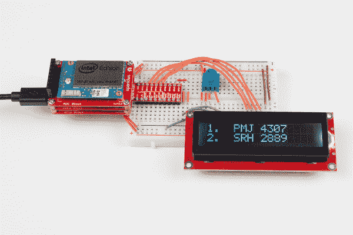

# Sparcade: Edison 作为浏览器游戏的网络服务器

> 原文：<https://learn.sparkfun.com/tutorials/sparcade-edison-as-a-web-server-for-browser-games>

## 介绍

英特尔爱迪生本质上是一台带有无线网络的微型电脑。因此，我们可以将 Edison 配置为同时充当接入点(AP)和 web 服务器，以服务简单的基于浏览器的游戏。

在创客博览会这样的大型活动中，互联网通常不存在或者很难找到。向与会者提供网页的一种方法是创建他们连接的 WiFi 接入点。这种脱离网格的“暗节点”就是像 [LibraryBox](http://librarybox.us/) 这样的项目的工作方式。

### 所需材料

这个项目的零件可以在[爱迪生 SIK](https://www.sparkfun.com/products/13742) 中找到。具体来说，您需要: