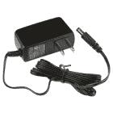

# PIR 运动传感器连接指南

> 原文：<https://learn.sparkfun.com/tutorials/pir-motion-sensor-hookup-guide>

## 介绍

被动红外(PIR)传感器是世界各地安全系统中使用的运动检测设备-即使你可能看不到它们，它们也可能看到你！

[](https://www.sparkfun.com/products/13285) 

将**添加到您的[购物车](https://www.sparkfun.com/cart)中！**

 **### [](https://www.sparkfun.com/products/13285)

[In stock](https://learn.sparkfun.com/static/bubbles/ "in stock") SEN-13285

这是一个简单易用的运动传感器。接通电源，等待 1-2 秒钟，让传感器获取静止房间的快照。我…

$10.9522[Favorited Favorite](# "Add to favorites") 56[Wish List](# "Add to wish list")** **[https://www.youtube.com/embed/ce23e96JlRk/?autohide=1&border=0&wmode=opaque&enablejsapi=1](https://www.youtube.com/embed/ce23e96JlRk/?autohide=1&border=0&wmode=opaque&enablejsapi=1)

PIR 传感器的使用很简单:上电，将一个上拉电阻连接到集电极开路信号引脚，观察它是否变低。PIR 可以感应到 10 英尺(约 3 米)外景物的突然变化。一旦你的微控制器感应到运动，它就会触发[蜂鸣器](https://www.sparkfun.com/products/7950)、[短信](https://www.sparkfun.com/products/13120)、[鸣叫](https://www.sparkfun.com/products/13678)，或者[喇叭](https://en.wikipedia.org/wiki/Vehicle_horn#Klaxon)。

### 建议的材料

本教程作为 PIR 运动传感器的快速入门，并演示如何连接和使用它们。除了传感器本身，还推荐使用以下材料:

**[Arduino Uno](https://www.sparkfun.com/products/11021)** -我们将使用 Arduino 上的数字引脚来读取 PIR 传感器信号输出的状态。任何兼容 Arduino 的开发平台——无论是 [RedBoard](https://www.sparkfun.com/products/12757) 、 [Pro](https://www.sparkfun.com/products/10914) 还是[Pro Mini](https://www.sparkfun.com/products/11113)——都可以替代。

**[跳线](https://www.sparkfun.com/products/11026)**-PIR 传感器端接一根 3 针 JST 电缆，将它连接到 Arduino 的一种简单方法是将几根跳线插入连接器，然后直接连接到 Arduino。

[](https://www.sparkfun.com/products/15123) 

将**添加到您的[购物车](https://www.sparkfun.com/cart)中！**

 **### [spark fun RedBoard Qwiic](https://www.sparkfun.com/products/15123)

[In stock](https://learn.sparkfun.com/static/bubbles/ "in stock") DEV-15123

SparkFun RedBoard Qwiic 是一款 Arduino 兼容开发板，内置 Qwiic 连接器，无需…

$21.5014[Favorited Favorite](# "Add to favorites") 49[Wish List](# "Add to wish list")****[](https://www.sparkfun.com/products/7950) 

将**添加到您的[购物车](https://www.sparkfun.com/cart)中！**

 **### [](https://www.sparkfun.com/products/7950)12mm 微型扬声器- PC 支架

[In stock](https://learn.sparkfun.com/static/bubbles/ "in stock") COM-07950

我们直接从 5V PIC 驱动它，为我们的 Simon 演示游戏生成音调。

$2.105[Favorited Favorite](# "Add to favorites") 38[Wish List](# "Add to wish list")****[](https://www.sparkfun.com/products/11026) 

将**添加到您的[购物车](https://www.sparkfun.com/cart)中！**

 **### [跳线标准 7" M/M - 30 AWG (30 个装)](https://www.sparkfun.com/products/11026)

[In stock](https://learn.sparkfun.com/static/bubbles/ "in stock") PRT-11026

如果你需要快速完成一个原型，没有什么比一堆跳线更能加快速度的了，让我们来看看

$2.4520[Favorited Favorite](# "Add to favorites") 43[Wish List](# "Add to wish list")****[](https://www.sparkfun.com/products/13326) 

将**添加到您的[购物车](https://www.sparkfun.com/cart)中！**

 **### [LED 混包- 10mm](https://www.sparkfun.com/products/13326)

[21 available](https://learn.sparkfun.com/static/bubbles/ "21 available") COM-13326

有时候当你有太多选择的时候，很难做出一个好的决定。事实上，有时候你只是想要一个平衡…

$10.953[Favorited Favorite](# "Add to favorites") 10[Wish List](# "Add to wish list")******** ********除了这两个项目，你可能要添加一个蜂鸣器或大 LED，使 PIR 传感器的范围测试更方便。

### 推荐阅读

对于初学者来说，PIR 传感器是一个很好的入门级元件，但仍有一些基本的电子学概念你应该熟悉。如果这些教程的标题对你来说听起来很陌生，考虑先浏览一下这些内容。

[](https://learn.sparkfun.com/tutorials/pull-up-resistors) [### 上拉电阻](https://learn.sparkfun.com/tutorials/pull-up-resistors) A quick introduction to pull-up resistors - whey they're important, and how/when to use them.[Favorited Favorite](# "Add to favorites") 65[](https://learn.sparkfun.com/tutorials/light) [### 光](https://learn.sparkfun.com/tutorials/light) Light is a useful tool for the electrical engineer. Understanding how light relates to electronics is a fundamental skill for many projects.[Favorited Favorite](# "Add to favorites") 24[](https://learn.sparkfun.com/tutorials/what-is-an-arduino) [### 什么是 Arduino？](https://learn.sparkfun.com/tutorials/what-is-an-arduino) What is this 'Arduino' thing anyway? This tutorials dives into what an Arduino is and along with Arduino projects and widgets.[Favorited Favorite](# "Add to favorites") 50[](https://learn.sparkfun.com/tutorials/resistors) [### 电阻](https://learn.sparkfun.com/tutorials/resistors) A tutorial on all things resistors. What is a resistor, how do they behave in parallel/series, decoding the resistor color codes, and resistor applications.[Favorited Favorite](# "Add to favorites") 57

## PIR 运动传感器概述

在最基本的层面上，PIR 传感器是对红外线敏感的光探测器。通过监测红外光谱中的光，PIR 传感器可以感知它们所观察区域的细微温度变化。当人或其他物体进入 PIR 的视野时，辐射模式会发生变化，PIR 将这种变化解释为运动。

主导 PIR 组件顶部大部分的白色帽是一个透镜，它有助于聚焦 PIR 传感器的视野。*实际* PIR 传感器隐藏在镜头下:

[](https://cdn.sparkfun.com/assets/learn_tutorials/5/1/8/uncovered-iso.jpg)

组件的背面装有放大器、电压调节器和其他支持电路，以帮助驱动 PIR。我们只需要连接三个引脚:电源、地和输出信号。

### 电源和信号引脚

PIR 组件的顶部包括两个标签:“+”和“AL”。“铝”引脚是报警引脚-不要让黑线愚弄你，这不是地面！“+”是 PIR 传感器的电源输入，留下未标记的中间引脚(带白线)作为地。

| 电线颜色 | 别针 | 笔记 |
| 红色 | 力量 | 5V[^(【1】)](https://learn.sparkfun.com/tutorials/pir-motion-sensor-hookup-guide#min_voltage)到 12V |
| 怀特（姓氏） | 地面 |  |
| 黑色 | 警报 | 集电极开路输出–低电平有效 |

PIR 传感器的供电电压至少应为 5V，但它可以在高达 12V 的电压下工作。幸运的是，即使 PIR 的供电高于 5V，alarm 引脚仍然可以直接连接到输入引脚，因为它被设计为[集电极开路](http://en.wikipedia.org/wiki/Open_collector)。

当 PIR 检测到其观察区域有活动时，它会将 alarm 引脚拉低。但是当传感器不活动时，引脚基本上是浮动的。为避免任何误报，报警输出应**拉高**至 5V。大多数微控制器的 I/O 引脚上有内部上拉电阻，可以轻松完成这项任务。如果使用 3.3V 系统(如 3.3V Arduino 或 Raspberry Pi)，也可以将其拉高至 3.3V。

[[1]](https://learn.sparkfun.com/tutorials/pir-motion-sensor-hookup-guide#min_voltage) **Note:** The PIR motion sensor can work with at least 5V. However, the voltage may not be enough for the L78L05 voltage regulator to work reliably depending on your power supply. The datasheet indicates that the dropout voltage is about *~1.7V* to *~2.0V*. Therefore, the PIR motion sensor's minimum voltage of about *~6.7V* to *~7.0V* is needed.

**Bypass Jumper** - If you only have 5V available (e.g. you are pulling 5V from the Arduino's USB, Particle Photon's USB, or Raspberry Pi), you could [bypass the voltage regulator by adding a jumper](https://learn.sparkfun.com/tutorials/how-to-work-with-jumper-pads-and-pcb-traces#rerouting-and-green-wire-repair) between the L78L05's VIN and VOUT pins. Just make sure that the voltage is regulated and clean. The images below highlightt the pins to bypass the voltage regulator. The pins of the SMD voltage regulator are small so you could also solder wire directly to the "+" pin as well.

| [](https://cdn.sparkfun.com/assets/learn_tutorials/5/1/8/13285-PIR_Motion_Sensor_Jumper_1.jpg) | [](https://cdn.sparkfun.com/assets/learn_tutorials/5/1/8/13285-PIR_Motion_Sensor_Jumper_2.jpg) |
| *VIN 和 VOUT 引脚高亮显示* | *“+”和 VOUT 引脚高亮显示* |

**9V Power Supply** - Otherwise, we recommend using a 9V power supply to power the PIR motion sensor. Assuming that you are using this with an Arduino Uno form factor, you could just insert the 9V into the Arduino Uno's barrel jack connector. Then add a jumper between the PIR motion sensor's "+" pin and the Arduino's "VIN" pin.

[](https://www.sparkfun.com/products/15314) 

将**添加到您的[购物车](https://www.sparkfun.com/cart)中！**

 **### [墙壁适配器电源- 9VDC，650mA(筒式插孔)](https://www.sparkfun.com/products/15314)

[In stock](https://learn.sparkfun.com/static/bubbles/ "in stock") TOL-15314

这是一个高品质的开关“壁式”交流到 DC 9V 650 毫安壁式电源，专为 SparkFun Elect 制造…

$6.501[Favorited Favorite](# "Add to favorites") 12[Wish List](# "Add to wish list")** **## 示例电路

本例的电路非常简单。抓住三根跳线，将它们插入 JST 连接器。有点紧，但是他们应该都能放进去。

将电源线(红色)和地线(白色)分别连接到 5V[^(【1】)](https://learn.sparkfun.com/tutorials/pir-motion-sensor-hookup-guide#min_voltage)和 GND。然后将**黑色报警线**连接到 Arduino 针脚 2。

[](https://cdn.sparkfun.com/assets/learn_tutorials/5/1/8/pir_sensor_bb.png)

我们将使用 D2 上的内部上拉电阻来完成电路。每当传感器处于非活动状态时，该引脚应读取高电平。当检测到运动时，传感器会将 D2 拉低。

## 示例代码

**Note:** This example assumes you are using the latest version of the Arduino IDE on your desktop. If this is your first time using Arduino, please review our tutorial on [installing the Arduino IDE.](https://learn.sparkfun.com/tutorials/installing-arduino-ide)

这是一个基于上述电路的简单 Arduino 示例。复制并粘贴到你的 Arduino IDE，然后上传！

```
language:c
/******************************************************************************
PIR_Motion_Detector_Example.ino
Example sketch for SparkFun's PIR Motion Detector
  (https://www.sparkfun.com/products/13285)
Jim Lindblom @ SparkFun Electronics
May 2, 2016

The PIR motion sensor has a three-pin JST connector terminating it. Connect
the wire colors like this:
- Black: D2 - signal output (pulled up internally)
- White: GND
- Red: 5V

Connect an LED to pin 13 (if your Arduino doesn't already have an LED there).

Whenever the PIR sensor detects movement, it'll write the alarm pin LOW.

Development environment specifics:
Arduino 1.6.7
******************************************************************************/
const int MOTION_PIN = 2; // Pin connected to motion detector
const int LED_PIN = 13; // LED pin - active-high

void setup() 
{
  Serial.begin(9600);
  // The PIR sensor's output signal is an open-collector, 
  // so a pull-up resistor is required:
  pinMode(MOTION_PIN, INPUT_PULLUP);
  pinMode(LED_PIN, OUTPUT);
}

void loop() 
{
  int proximity = digitalRead(MOTION_PIN);
  if (proximity == LOW) // If the sensor's output goes low, motion is detected
  {
    digitalWrite(LED_PIN, HIGH);
    Serial.println("Motion detected!");
  }
  else
  {
    digitalWrite(LED_PIN, LOW);
  }
} 
```

上传后，看看你的 Arduino 的 pin 13 LED。您也可以**打开您的[串行监视器](https://learn.sparkfun.com/tutorials/terminal-basics/arduino-serial-monitor-windows-mac-linux)T3，并将波特率设置为 9600 bps。**

PIR 传感器需要大约 15 秒的**无运动活动**，同时获得其观察区域的“快照”。尽量不要动，直到 pin 13 LED 熄灭，然后挥舞双手，在空中跳跃，疯狂！

## 资源和更进一步

有关 PIR 传感器的更多信息， [PIR 运动传感器数据表](http://www.sparkfun.com/datasheets/Sensors/Proximity/SE-10.pdf)可能会提供一些见解。

*   [数据表](http://www.sparkfun.com/datasheets/Sensors/Proximity/SE-10.pdf)
*   [SFE 简单素描演示](https://youtu.be/ce23e96JlRk)

现在，您已经将 Arduino 连接到 PIR 传感器，您打算创建什么样的运动检测项目？需要一些灵感吗？查看一些使用 PIR 运动传感器的相关教程:

[](https://learn.sparkfun.com/tutorials/photon-remote-water-level-sensor) [### 光子远程水位传感器](https://learn.sparkfun.com/tutorials/photon-remote-water-level-sensor) Learn how to build a remote water level sensor for a water storage tank and how to automate a pump based off the readings 15[](https://learn.sparkfun.com/tutorials/sparkfun-inventors-kit-for-photon-experiment-guide) [### 光子实验指南](https://learn.sparkfun.com/tutorials/sparkfun-inventors-kit-for-photon-experiment-guide) Dive into the world of the Internet of Things with the SparkFun Inventor's Kit for Photon.[Favorited Favorite](# "Add to favorites") 14[](https://learn.sparkfun.com/tutorials/redboard-santa-trap) [### 红纸板圣诞老人陷阱](https://learn.sparkfun.com/tutorials/redboard-santa-trap) A fun holiday project to try for anyone looking to catch Santa on Christmas 2

或者查看这些使用传感器检测运动或移动的教程。

[](https://learn.sparkfun.com/tutorials/vernier-photogate) [### 游标光电门](https://learn.sparkfun.com/tutorials/vernier-photogate) Vernier Photogate Timer -- using the Serial Enabled LCD Kit.[Favorited Favorite](# "Add to favorites") 2[](https://learn.sparkfun.com/tutorials/are-you-okay-widget) [### 你还好吗？小部件](https://learn.sparkfun.com/tutorials/are-you-okay-widget) Use an Electric Imp and accelerometer to create an "Are You OK" widget. A cozy piece of technology your friend or loved one can nudge to let you know they're OK from half-a-world away.[Favorited Favorite](# "Add to favorites") 6[](https://learn.sparkfun.com/tutorials/boss-alarm) [### Boss 警报](https://learn.sparkfun.com/tutorials/boss-alarm) Build a Boss Alarm that alerts you of anyone walking into your office and automatically changes your computer screen.[Favorited Favorite](# "Add to favorites") 19[](https://learn.sparkfun.com/tutorials/qwiic-grid-eye-infrared-array-amg88xx-hookup-guide) [### Qwiic 栅眼红外阵列(AMG88xx)连接指南](https://learn.sparkfun.com/tutorials/qwiic-grid-eye-infrared-array-amg88xx-hookup-guide) The Panasonic GRID-Eye (AMG88xx) 8x8 thermopile array serves as a functional low-resolution infrared camera. This means you have a square array of 64 pixels each capable of independent temperature detection. It’s like having thermal camera (or Predator’s vision), just in really low resolution.[Favorited Favorite](# "Add to favorites") 0************