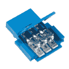
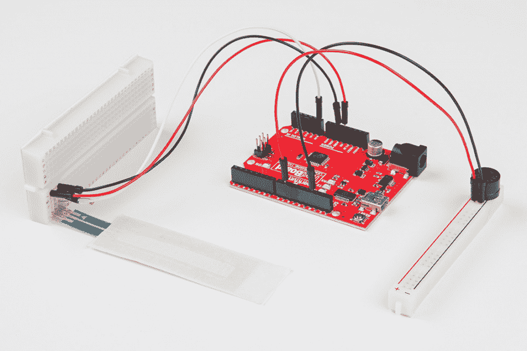
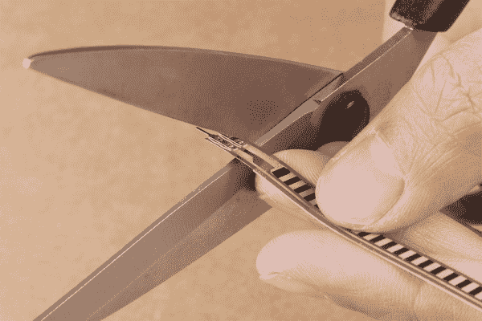
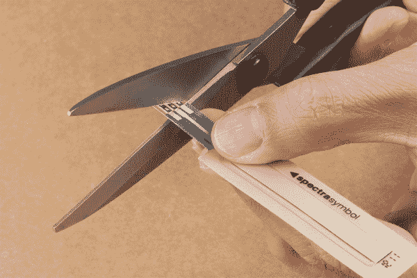
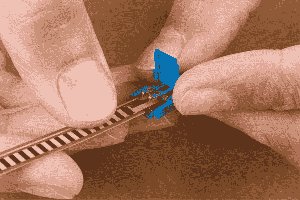
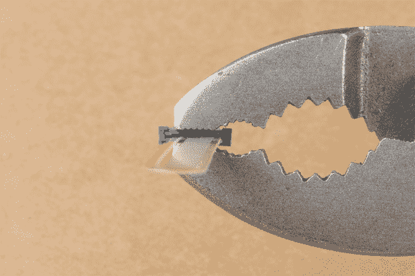
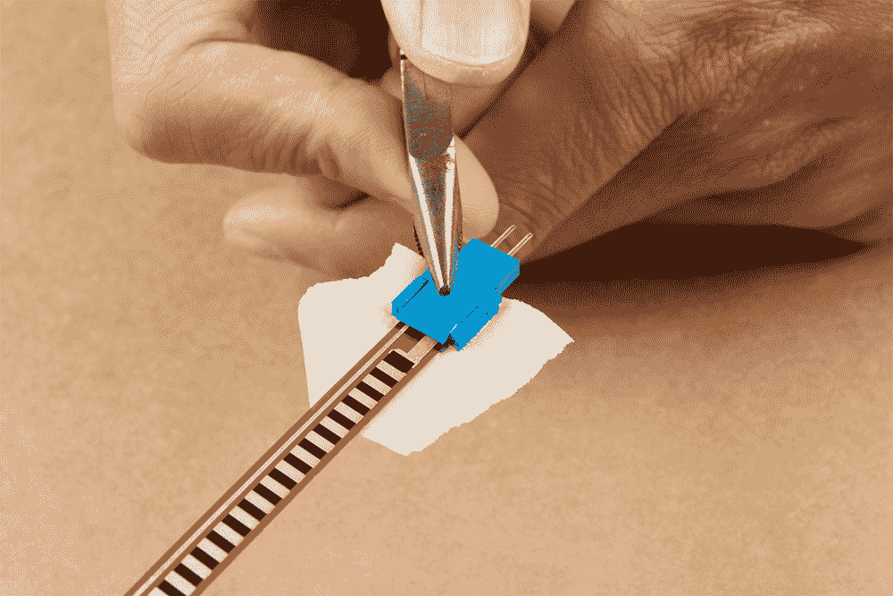
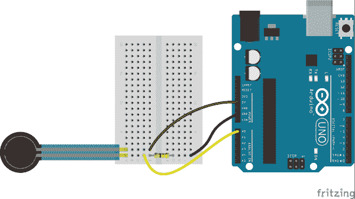

# 力敏电阻连接指南

> 原文：<https://learn.sparkfun.com/tutorials/force-sensitive-resistor-hookup-guide>

## 介绍

力敏电阻器(FSR)是易于使用的传感器，设计用于测量局部物理压力的存在和相对大小。

[](https://www.sparkfun.com/products/9375) 

将**添加到您的[购物车](https://www.sparkfun.com/cart)中！**

### [力敏电阻 0.5”](https://www.sparkfun.com/products/9375)

[In stock](https://learn.sparkfun.com/static/bubbles/ "in stock") SEN-09375

这是一个力敏电阻器，具有 0.5 英寸直径的圆形感应区域。

$7.5019[Favorited Favorite](# "Add to favorites") 86[Wish List](# "Add to wish list")****[](https://www.sparkfun.com/products/9376) 

将**添加到您的[购物车](https://www.sparkfun.com/cart)中！**

### [](https://www.sparkfun.com/products/9376)力敏电阻方块

[In stock](https://learn.sparkfun.com/static/bubbles/ "in stock") SEN-09376

这是一个具有 1.75x1.5 英寸方形感测区域的力敏电阻器。

$12.508[Favorited Favorite](# "Add to favorites") 41[Wish List](# "Add to wish list")****[](https://www.sparkfun.com/products/9674) 

将**添加到您的[购物车](https://www.sparkfun.com/cart)中！**

### [力敏电阻-龙](https://www.sparkfun.com/products/9674)

[In stock](https://learn.sparkfun.com/static/bubbles/ "in stock") SEN-09674

这种非常长的力敏电阻超过 2 英尺，感应面积为 0.25x24 英寸。

$22.505[Favorited Favorite](# "Add to favorites") 11[Wish List](# "Add to wish list")****[](https://www.sparkfun.com/products/9673) 

将**添加到您的[购物车](https://www.sparkfun.com/cart)中！**

### [力敏电阻-小](https://www.sparkfun.com/products/9673)

[In stock](https://learn.sparkfun.com/static/bubbles/ "in stock") SEN-09673

这是一个小型力敏电阻。它有一个直径为 0.16 英寸(4 毫米)的主动感应区域。

$7.505[Favorited Favorite](# "Add to favorites") 35[Wish List](# "Add to wish list")****************[](https://www.sparkfun.com/products/11207) 

将**添加到您的[购物车](https://www.sparkfun.com/cart)中！**

### [【flexi force 压力传感器-25 磅(1”面积)](https://www.sparkfun.com/products/11207)

[Out of stock](https://learn.sparkfun.com/static/bubbles/ "out of stock") SEN-11207

这是一个【压阻】(http://www.google.com/url？sa = t & CT = RES & CD = 1 & URL = http % 3A % 2F % 2 fen . Wikipedia . org % 2f wiki % 2f piezoresisto…

$26.95[Favorited Favorite](# "Add to favorites") 25[Wish List](# "Add to wish list")****[](https://www.sparkfun.com/products/8685) 

将**添加到您的[购物车](https://www.sparkfun.com/cart)中！**

### [FlexiForce 压力传感器——100 lbs。](https://www.sparkfun.com/products/8685)

[In stock](https://learn.sparkfun.com/static/bubbles/ "in stock") SEN-08685

这是一个【压阻】(http://www.google.com/url？sa = t & CT = RES & CD = 1 & URL = http % 3A % 2F % 2 fen . Wikipedia . org % 2f wiki % 2f piezoresisto…

$21.504[Favorited Favorite](# "Add to favorites") 15[Wish List](# "Add to wish list")****[](https://www.sparkfun.com/products/8712) 

将**添加到您的[购物车](https://www.sparkfun.com/cart)中！**

### [FlexiForce 压力传感器——25 磅。](https://www.sparkfun.com/products/8712)

[In stock](https://learn.sparkfun.com/static/bubbles/ "in stock") SEN-08712

这是一个【压阻】(http://www.google.com/url？sa = t & CT = RES & CD = 1 & URL = http % 3A % 2F % 2 fen . Wikipedia . org % 2f wiki % 2f piezoresisto…

$23.502[Favorited Favorite](# "Add to favorites") 13[Wish List](# "Add to wish list")****[](https://www.sparkfun.com/products/8713) 

将**添加到您的[购物车](https://www.sparkfun.com/cart)中！**

### [FlexiForce 压力传感器- 1lb。](https://www.sparkfun.com/products/8713)

[In stock](https://learn.sparkfun.com/static/bubbles/ "in stock") SEN-08713

这是一个【压阻】(http://www.google.com/url？sa = t & CT = RES & CD = 1 & URL = http % 3A % 2F % 2 fen . Wikipedia . org % 2f wiki % 2f piezoresisto…

$21.50[Favorited Favorite](# "Add to favorites") 9[Wish List](# "Add to wish list")******** ********[https://www.youtube.com/embed/k8amj_jV0ls/?autohide=1&border=0&wmode=opaque&enablejsapi=1](https://www.youtube.com/embed/k8amj_jV0ls/?autohide=1&border=0&wmode=opaque&enablejsapi=1)

FSR 的电阻随着传感器上的力的增加或减少而变化。当没有压力施加在 FSR 上时，其电阻将大于 1mω。你越用力按压传感器的头部，两个端子之间的电阻下降得越低。通过将 FSR 与一个静态电阻结合起来创建一个[分压器](https://learn.sparkfun.com/tutorials/voltage-dividers)，您可以产生一个可变电压，该电压可以被微控制器的模数转换器读取。

### 建议的材料

本教程作为 FSR 的快速入门，并演示了如何挂钩和使用它们。除了您选择的 FSR，我们还推荐以下材料:

**[Arduino Uno](https://www.sparkfun.com/products/11021)**——我们将使用 Arduino 的模数转换器读入 FSR 的可变电阻。任何兼容 Arduino 的开发平台——无论是 [RedBoard](https://www.sparkfun.com/products/12757) 、 [Pro](https://www.sparkfun.com/products/10914) 还是[Pro Mini](https://www.sparkfun.com/products/11113)——都可以替代。

**[电阻套件](https://www.sparkfun.com/products/10969)**——为了将 FSR 的可变电阻变成可读的电压，我们将它与静态电阻结合起来，创建一个分压器。这种电阻套件便于进行一些反复试验，以便尽可能地找出最敏感的电路。

**[试验板](https://www.sparkfun.com/products/12002)和[跳线](https://www.sparkfun.com/products/11026)**——FSR 的端子与试验板兼容。我们将插上那个和电阻，然后用跳线从试验板连接到 Arduino。

[](https://www.sparkfun.com/products/10969) 

将**添加到您的[购物车](https://www.sparkfun.com/cart)中！**

### [【电阻器套件- 1/4W(共 500)](https://www.sparkfun.com/products/10969)

[Out of stock](https://learn.sparkfun.com/static/bubbles/ "out of stock") COM-10969

电阻是个好东西，事实上，在许多电路设计中，电阻是至关重要的。唯一的问题似乎是…

$8.95180[Favorited Favorite](# "Add to favorites") 185[Wish List](# "Add to wish list")****[](https://www.sparkfun.com/products/13975) 

将**添加到您的[购物车](https://www.sparkfun.com/cart)中！**

### [spark fun red board——用 Arduino 编程 T3](https://www.sparkfun.com/products/13975)

[In stock](https://learn.sparkfun.com/static/bubbles/ "in stock") DEV-13975

SparkFun RedBoard 结合了 UNO 的 Optiboot 引导程序的简单性、FTDI 的稳定性和 shield com…

$21.5049[Favorited Favorite](# "Add to favorites") 89[Wish List](# "Add to wish list")****[](https://www.sparkfun.com/products/12002) 

将**添加到您的[购物车](https://www.sparkfun.com/cart)中！**

### [【试验板-不干胶(白色)](https://www.sparkfun.com/products/12002)

[In stock](https://learn.sparkfun.com/static/bubbles/ "in stock") PRT-12002

这是你的尝试和真正的白色无焊试验板。它有 2 条电源总线，10 列，30 行，总共 400 个连接…

$5.5048[Favorited Favorite](# "Add to favorites") 93[Wish List](# "Add to wish list")****[](https://www.sparkfun.com/products/11026) 

将**添加到您的[购物车](https://www.sparkfun.com/cart)中！**

### [跳线标准 7" M/M - 30 AWG (30 个装)](https://www.sparkfun.com/products/11026)

[In stock](https://learn.sparkfun.com/static/bubbles/ "in stock") PRT-11026

如果你需要快速完成一个原型，没有什么比一堆跳线更能加快速度的了，让我们来看看

$2.4520[Favorited Favorite](# "Add to favorites") 43[Wish List](# "Add to wish list")******** **********[力敏电阻适配器](https://www.sparkfun.com/categories/tags/amphenol-fci)** -虽然 FSR 端子与试验板兼容，但我们发现它可能会在试验板中松动。对于那些正在寻找一种不用焊接就能实现更安全连接的方法的人来说，试试看相关的 Amphenol 引脚适配器。你需要一把[尖嘴钳](https://www.sparkfun.com/products/8793)来夹住适配器。

[](https://www.sparkfun.com/products/14194) 

将**添加到您的[购物车](https://www.sparkfun.com/cart)中！**

### [【安费诺 FCI】紧钳连接器(2 位，母)](https://www.sparkfun.com/products/14194)

[In stock](https://learn.sparkfun.com/static/bubbles/ "in stock") COM-14194

安费诺 FCI 公司的这些铆钉连接器可用于将扁平柔性电缆(ffc)端接至易于使用的标准 h…

$2.10[Favorited Favorite](# "Add to favorites") 5[Wish List](# "Add to wish list")****[](https://www.sparkfun.com/products/14195) 

将**添加到您的[购物车](https://www.sparkfun.com/cart)中！**

### [【安费诺 FCI 钳连接器(2 位，公)](https://www.sparkfun.com/products/14195)

[In stock](https://learn.sparkfun.com/static/bubbles/ "in stock") COM-14195

安费诺 FCI 公司的这些铆钉连接器可用于将扁平柔性电缆(ffc)端接至易于使用的标准 h…

$2.10[Favorited Favorite](# "Add to favorites") 9[Wish List](# "Add to wish list")****[](https://www.sparkfun.com/products/14196) 

将**添加到您的[购物车](https://www.sparkfun.com/cart)中！**

### [【安费诺 FCI】紧钳连接器(3 位，母)](https://www.sparkfun.com/products/14196)

[In stock](https://learn.sparkfun.com/static/bubbles/ "in stock") COM-14196

安费诺 FCI 公司的这些铆钉连接器可用于将扁平柔性电缆(ffc)端接至易于使用的标准 h…

$1.051[Favorited Favorite](# "Add to favorites") 2[Wish List](# "Add to wish list")****[](https://www.sparkfun.com/products/14197) 

将**添加到您的[购物车](https://www.sparkfun.com/cart)中！**

### [【安费诺 FCI 钳连接器(3 位，公)](https://www.sparkfun.com/products/14197)

[In stock](https://learn.sparkfun.com/static/bubbles/ "in stock") COM-14197

安费诺 FCI 公司的这些铆钉连接器可用于将扁平柔性电缆(ffc)端接至易于使用的标准 h…

$1.052[Favorited Favorite](# "Add to favorites") 3[Wish List](# "Add to wish list")******** ********### 推荐阅读

模拟元件，如这些 fsr，对于初学者来说是一个很好的传感器读取切入点，但有几个电子概念你应该熟悉。如果这些教程的标题对你来说听起来很陌生，考虑先浏览一下这些内容。

[](https://learn.sparkfun.com/tutorials/analog-to-digital-conversion) [### 模数转换](https://learn.sparkfun.com/tutorials/analog-to-digital-conversion) The world is analog. Use analog to digital conversion to help digital devices interpret the world.[Favorited Favorite](# "Add to favorites") 58[](https://learn.sparkfun.com/tutorials/voltage-dividers) [### 分压器](https://learn.sparkfun.com/tutorials/voltage-dividers) Turn a large voltage into a smaller one with voltage dividers. This tutorial covers: what a voltage divider circuit looks like and how it is used in the real world.[Favorited Favorite](# "Add to favorites") 70[](https://learn.sparkfun.com/tutorials/what-is-an-arduino) [### 什么是 Arduino？](https://learn.sparkfun.com/tutorials/what-is-an-arduino) What is this 'Arduino' thing anyway? This tutorials dives into what an Arduino is and along with Arduino projects and widgets.[Favorited Favorite](# "Add to favorites") 50[](https://learn.sparkfun.com/tutorials/analog-vs-digital) [### 模拟与数字](https://learn.sparkfun.com/tutorials/analog-vs-digital) This tutorial covers the concept of analog and digital signals, as they relate to electronics.[Favorited Favorite](# "Add to favorites") 66

## FSR 概述

有各种各样的 FSR 可供选择，区分它们的几个关键特征是:**尺寸、形状和感应范围**。以下是我们目录中 Interlink 和 Tekscan 提供的传感器的简要概述。Tekscan 的传感器更加稳定，根据特定重量进行校准，并提供更大的量程。

| 名字 | 形状 | 传感区域 | 最小压力 | 最大压力 |
| [
**力敏电阻-小型
(SEN-09673)**](https://www.sparkfun.com/products/9673) | 圆形的；循环的 | 7.62 毫米直径
(0.3 英寸) | 0.1 千克
(0.22 磅) | 1 千克
(2.2 磅) |
| [
**力敏电阻 0.5”
(SEN-09375)**](https://www.sparkfun.com/products/9375) | 圆形的；循环的 | 12.7 毫米直径
(0.5 英寸) | 100 克
(0.22 磅) | 10 千克
(22.04 磅) |
| [
 **【森-09376】**](https://www.sparkfun.com/products/9376) | 平方 | 44.45 x 44.45 毫米
(1.75 x 1.75 英寸)
 | 100 克
(0.22 磅) | 10 千克
(22.04 磅) |
| [
**力敏电阻-龙
(SEN-09674)**](https://www.sparkfun.com/products/9674) | 矩形的 | 6.35 x 609.6 毫米
(0.25 x 24.0 英寸) | 100 克
(0.22 磅) | 10 千克
(22.04 磅) |
| [
**FlexiForce 压力传感器-25 磅(1 "面积)
(SEN-11207)**](https://www.sparkfun.com/products/11207) | 圆形的；循环的 | 2.54 毫米直径
(0.1 英寸) | 0 克
(0 磅) | 约 11.34 千克
(25 磅) |
| [
**FlexiForce 压力传感器- 1lb。
(SEN-08713)**](https://www.sparkfun.com/products/8713) | 圆形的；循环的 | 9.53 毫米直径
(0.375 英寸) | 0 克
(0 磅) | 约 0.45 千克
(1 磅) |
| [
**FlexiForce 压力传感器-25 磅。
(SEN-08712)**](https://www.sparkfun.com/products/8712) | 圆形的；循环的 | 9.53 毫米直径
(0.375 英寸) | 0 克
(0 磅) | 约 11.3398 千克
(25 磅) |
| [
**FlexiForce 压力传感器-100 磅。
(SEN-08685)**](https://www.sparkfun.com/products/8685) | 圆形的；循环的 | 9.53 毫米直径
(0.375 英寸) | 0 克
(0 磅) | 约 45.36 千克
(100 磅) |

### 形状和尺寸

大多数 FSR 的特点不是圆形就是矩形感应区。方形 FSR 适合于大面积传感，而较小的圆形传感器可以提供更精确的传感位置。

Interlink 的矩形 FSR 包括一个 1.75 x 1.75 英寸的小正方形传感器和一个 0.25 x 24 英寸长的 T2 条。其余的传感器具有圆形感应区域。

### 感应范围

FSR 的另一个关键特征是其额定感应范围，该范围定义了传感器可以区分的最小和最大压力量。

压力等级越低，你的 FSR 连接就可能越敏感。但是！任何超过传感器最大限值的压力都将无法测量(并可能损坏组件)。[1 公斤级的小型 FSR](https://www.sparkfun.com/products/9673) 将提供 0 至 1 公斤的更灵敏读数，但无法区分 2 公斤和 10 公斤的重量。

### 力与阻力

下图，即 [Interlink FSR 集成指南](https://www.sparkfun.com/datasheets/Sensors/Pressure/fsrguide.pdf)中的图 2，展示了典型的力-阻力关系:

[](https://cdn.sparkfun.com/assets/learn_tutorials/5/1/0/fsr-resistance-graph.png)

从 50 克以上，这种关系通常是线性的，但是注意 50 克以下，甚至 20 克以下的关系。这些传感器有一个**开启阈值** -在电阻下降到 10kΩ以下之前必须存在的力，此时关系变得更加线性。

**FSR vs Load Cells:** These sensors are simple to set up and great for sensing pressure, but they aren’t incredibly accurate. They’re useful for sensing the presence of something, and the relative magnitude of that force, but they’re not all that great at measuring weight (that’s what [load cell’s](https://www.sparkfun.com/products/10245) are for!).

[](https://learn.sparkfun.com/tutorials/getting-started-with-load-cells) [### 称重传感器入门

#### 2015 年 6 月 11 日](https://learn.sparkfun.com/tutorials/getting-started-with-load-cells) A tutorial defining what a load cell is and how to use one.[Favorited Favorite](# "Add to favorites") 27

## 硬件装配

传感器具有焊接接头，焊接接头穿过柔性基板与半导体材料接触。根据您的项目应用和技能，有几种连接到传感器的方法。可能需要一些组件来可靠地连接到引脚。

[](https://cdn.sparkfun.com/assets/learn_tutorials/5/1/0/Solder-Tab-Crimped-Force-Sensitive-Resistor.jpg)

### 试验板兼容标签

对于原型制作和测试，这些焊片可以插入试验板或母跳线。这里有两个关于 flex 和 soft 电位计传感器的例子。

| [](https://learn.sparkfun.com/tutorials/sik-experiment-guide-for-arduino---v32/experiment-9-using-a-flex-sensor) | [](https://learn.sparkfun.com/tutorials/sik-keyboard-instrument) |
| *弯曲传感器垂直插入试验板上，留有弯曲空间* | *软罐垂直插入试验板上，与桌子齐平* |

**Tip:** You can also use the **2.54mm pitch screw terminal** to connect the sensors on a breadboard. However, using two screw terminals side by side for sensors with three solder tabs can make it a tight fit due to the housing. Additionally, they were meant to be soldered into a PCB and the screw terminals may not sit securely in a breadboard socket like a square header pin. **IC hooks** are another option but are only meant as a temporary connection. Any small bumps can cause the IC hook to become loose and disconnect. Using the IC hooks with the sensor for long term projects may not be most secure. [**Alligator clips** can also be used to connect](https://learn.sparkfun.com/tutorials/using-the-sparkfun-picoboard-and-scratch#fsr) to the solder tabs. However, alligator clip's teeth can damage the flexible substrate or cause shorts due to the solder tabs being close to each other.

[](https://www.sparkfun.com/products/9741) 

将**添加到您的[购物车](https://www.sparkfun.com/cart)中！**

### [带猪尾的 IC 钩](https://www.sparkfun.com/products/9741)

[In stock](https://learn.sparkfun.com/static/bubbles/ "in stock") CAB-09741

这些是高质量的 IC 测试钩，带有一根公连接线。这些有两个挂钩，而不是一个挂钩…

$5.5010[Favorited Favorite](# "Add to favorites") 30[Wish List](# "Add to wish list")****[](https://www.sparkfun.com/products/13191) 

将**添加到您的[购物车](https://www.sparkfun.com/cart)中！**

### [【带辫子的鳄鱼夹(4 个装)](https://www.sparkfun.com/products/13191)

[In stock](https://learn.sparkfun.com/static/bubbles/ "in stock") CAB-13191

这是一个 4 包电线，预先终止于一端的鳄鱼夹和另一端的连接尾纤。阿利加…

$3.50[Favorited Favorite](# "Add to favorites") 21[Wish List](# "Add to wish list")****[](https://www.sparkfun.com/products/10571) 

将**添加到您的[购物车](https://www.sparkfun.com/cart)中！**

### [【螺丝端子 2.54mm 螺距(2 针)](https://www.sparkfun.com/products/10571)

[In stock](https://learn.sparkfun.com/static/bubbles/ "in stock") PRT-10571

这些是带有 2.54 毫米间距引脚的简单双位螺丝端子。额定高达 150 伏@ 6A，这个终端可以接受 30 至 18A…

$0.953[Favorited Favorite](# "Add to favorites") 18[Wish List](# "Add to wish list")****** ******### 焊接到标签上

**Warning!** The flexible substrate and semi-conductive material are sensitive to heat. The force sensitive resistors from Interlink are more sensitive compared to other flexible sensors. There is a risk of damaging the sensor when soldering to the solder tabs. We only recommend this for **advanced users** that have adjusted their soldering iron for lower temperatures.

当将其集成到长期项目和安装中时，可以选择将导线或 PCB 直接焊接到焊片上。然而，由于柔性衬底和半导体材料的限制，过多的热量会熔化材料并损坏传感器。下面是我们的生产组装技术人员将 flex 传感器焊接到 PCB 上的示例。

[](https://cdn.sparkfun.com/assets/learn_tutorials/5/1/0/14666-SparkFun_Qwiic_Flex_Glove_Controller-Solder-Tabs-Soldered.jpg)

虽然[数据表](https://www.sparkfun.com/datasheets/Sensors/Pressure/fsrguide.pdf)声明您可以焊接到力敏电阻的焊片上，但我们只推荐给有焊接经验的**高级用户**。对于那些焊接到力敏电阻的，你需要在一个较低的温度下焊接，并确保烙铁不会加热标签超过 1 秒钟。再久一点，你会损坏材料和半导体材料。与柔性传感器和软电位计相比，力敏电阻器尤其容易损坏。

**Tip:** For advanced users that are interested in the challenge, try checking out the following forum post and instructions from Digi-Key:

*   [Digi-Key 论坛:如何焊接互连电子 FSR 传感器](https://forum.digikey.com/t/how-to-solder-interlink-electronics-fsr-sensor/555)
*   [如何将电线焊接到 FSR 传感器上](https://media.digikey.com/pdf/Data%20Sheets/Interlink%20Electronics.PDF/FSR400_Soldering_Instr.pdf)

### 安费诺 CFI 铆钉连接器

作为替代，用户可以使用安费诺 FCI 紧钳连接器与传感器进行可靠连接，并在压接连接器上提供少量应变消除。这是推荐给那些以前没有焊接过并且在试验板或教室环境之外的长期项目中使用传感器的人。该连接器被设计成压接柔性印刷电路上的引脚，作为向热敏元件(如半导电材料或导电墨水)施加热量的替代方案。

[](https://cdn.sparkfun.com/assets/learn_tutorials/5/1/0/Flex_Force_Sensitive_SoftPot_Sensor_Clincher_Connector.jpg)

##### 压接敲弯连接器

我们将使用阳铆钉连接器来压接弯曲传感器。但是，下面列出的说明也适用于力敏电阻器。

要连接，您需要切断传感器上的焊片。确保尽可能靠近焊片切割。如果切掉太多传感器，连接半导体材料可能会有问题。软罐上的半导电焊盘的长度小于力敏电阻器和弯曲传感器。

| [](https://cdn.sparkfun.com/assets/learn_tutorials/5/1/0/Cut_Solder-Tabs_Flex_Sensor_Clincher_Connector.jpg) | [](https://cdn.sparkfun.com/assets/learn_tutorials/5/1/0/Cut_Solder-Tabs_Slide_Pot_Clincher_Connector.jpg) |
| *从弯曲传感器上切下焊片* | *从滑壶上切下焊片* |

切断订书钉后，将传感器插入相应的敲弯连接器。确保半导体材料与新订书钉对齐，否则可能会造成短路。根据传感器的不同，您可以使用较少的半导体材料。如右图所示，切除焊片后，软罐将有更小的焊盘。

| [](https://cdn.sparkfun.com/assets/learn_tutorials/5/1/0/Insert_Flex_Sensor_Clincher_Connector.jpg) | [](https://cdn.sparkfun.com/assets/learn_tutorials/5/1/0/Insert_Slide_Pot_Clincher_Connector.jpg) |
| *将弯曲传感器插入 2 针敲弯连接器* | *将软电位传感器插入 3 针敲弯连接器* |

一旦您对准了传感器，我们建议您用一条胶带压住传感器和紧钳连接器，以防止传感器在夹紧连接器时移动。

[](https://cdn.sparkfun.com/assets/learn_tutorials/5/1/0/Tape_Flex_Sensor_Clincher_Connector.jpg)

我们建议使用平齐的滑动接头钳来夹紧连接器。从图中可以看出，力施加在锁闩和卡钉的中心，而不是沿着连接器侧面的凹槽。与柔性传感器和 SoftPot 上的其他柔性基板相比，力敏电阻器将更容易被箝位。当压接针咬穿传感器时，您会听到一声微小但令人满意的爆裂声。

[](https://cdn.sparkfun.com/assets/learn_tutorials/5/1/0/Flush_Narrow_Slip_Joint_Plier_Flex_Sensor_Clincher_Connector.jpg)

否则，可以使用尖嘴钳将钉夹到传感器上。合上拉环，将压接引脚固定在半导体材料上。然后确保小心地从每个角向中心施力(同时避开侧面的凹槽)。

[](#carousel-63c18eea063a4)[](#carousel-63c18eea063a4)

如果使用尖嘴钳时用力不当，会有损坏塑料外壳的风险。右图显示，尽管压接引脚与软外壳接触，但紧钳连接器外壳已损坏。

| [](https://cdn.sparkfun.com/assets/learn_tutorials/5/1/0/Incorrect_Use_Pliers_Clincher_Connector_Housing.jpg) | [](https://cdn.sparkfun.com/assets/learn_tutorials/5/1/0/Damaged_Clincher_Connector_Housing.jpg) |
| *钳子未正确应用于敲弯连接器。* | *软罐的敲弯连接器外壳损坏。* |

**Tip:** If you have issues pushing down on the tab to crimp the pins simultaneously, you can individually crimp the pins with needle nose pliers. Just make sure to be careful so that the grooves are not damaged. Here's an example from Provancher.

[Flex-circuit Soldering & Assembly Tutorial and Notes](https://my.mech.utah.edu/~wil/tutorials/flexCirc_soldering_tutorial/Flex_circuit_Soldering_Tutorial.html)

完成后，从背面取下胶带。为了测试，你可以[使用万用表](https://learn.sparkfun.com/tutorials/how-to-use-a-multimeter/)来确定传感器是否短路或者电阻是否会改变。您也可以使用跳线将传感器连接到电路，以检查传感器是否按预期工作。

[](https://cdn.sparkfun.com/assets/learn_tutorials/5/1/0/Flex_Force_Sensitive_SoftPot_Sensor_Clincher_Connector.jpg)

## 硬件连接示例

通过用 FSR 和另一个电阻创建一个[分压器](https://learn.sparkfun.com/tutorials/voltage-dividers)，你可以创建一个可变电压输出，它可以被微控制器的 ADC 输入读取。

### 选择静态电阻

分压 FSR 的棘手之处在于选择一个静态电阻值与之配对。你不希望压倒 FSR 的最大阻力，但你也不希望 FSR 的最小阻力被完全掩盖。

这有助于了解你将读到的力的范围。如果您的项目的力感测覆盖 FSR 的宽范围(例如 0.1-10kg)，请尝试选择 FSR 阻性输出的中间范围内的静态电阻——大约在 200-6kω的中间。3kω，或者像**3.3kω**这样的普通电阻，是一个很好的起点。

**电阻器短路？**如果你只有 10kΩ电阻(看看你[传感器套件访客](https://www.sparkfun.com/products/13754)，你仍然可以做出接近 3k 的东西！尝试将**三个 10kΩ并联**来创建一个 3.33kΩ的巨型电阻器。或者在**系列**中放三个 330ω的电阻，形成一个 990ω的混合物，也能很好地工作。

### 示例电路

**Warning:** As stated on page 10 of the [Interlink FSR Integration Guide](https://www.sparkfun.com/datasheets/Sensors/Pressure/fsrguide.pdf), the FSR's flexible substrate is sensitive to heat. It is not recommended to solder directly to the exposed silver traces or apply high temperatures to the clamped pins for long periods of time. For users that do not have that much experience soldering, try using ZIF sockets or clamping the sensor with a [Force Sensitive Resistor Pin Adapter](https://www.sparkfun.com/categories/tags/amphenol-fci).

这是一个结合了互联 FSR、3.3kΩ电阻、三根跳线和 Arduino 的烧结图。TekScan 的电路也是如此。你只需要相应地调整电阻值。

[](https://cdn.sparkfun.com/assets/learn_tutorials/5/1/0/fritzing_example_bb_2.png)

示意图如下:

[](https://cdn.sparkfun.com/assets/learn_tutorials/5/1/0/fritzing_example_schem.png)

该分压器将导致 A0 处的电压随着 FSR 的电阻减小而增加。当 FSR 保持不动，测量为接近开路时，A0 处的电压应该为零。如果您尽可能用力按下 FSR，电压应该会增加近 5V。

## Arduino 草图示例

这是一个基于上述电路的简单 Arduino 示例。复制并粘贴到你的 Arduino IDE，然后上传！

**注意:**此示例假设您在桌面上使用的是最新版本的 Arduino IDE。如果这是你第一次使用 Arduino，请回顾我们关于[安装 Arduino IDE 的教程。](https://learn.sparkfun.com/tutorials/installing-arduino-ide)

If you have not previously installed an Arduino library, please check out our [installation guide.](https://learn.sparkfun.com/tutorials/installing-an-arduino-library)

```
language:c
/******************************************************************************
Force_Sensitive_Resistor_Example.ino
Example sketch for SparkFun's force sensitive resistors
  (https://www.sparkfun.com/products/9375)
Jim Lindblom @ SparkFun Electronics
April 28, 2016

Create a voltage divider circuit combining an FSR with a 3.3k resistor.
- The resistor should connect from A0 to GND.
- The FSR should connect from A0 to 3.3V
As the resistance of the FSR decreases (meaning an increase in pressure), the
voltage at A0 should increase.

Development environment specifics:
Arduino 1.6.7
******************************************************************************/
const int FSR_PIN = A0; // Pin connected to FSR/resistor divider

// Measure the voltage at 5V and resistance of your 3.3k resistor, and enter
// their value's below:
const float VCC = 4.98; // Measured voltage of Ardunio 5V line
const float R_DIV = 3230.0; // Measured resistance of 3.3k resistor

void setup() 
{
  Serial.begin(9600);
  pinMode(FSR_PIN, INPUT);
}

void loop() 
{
  int fsrADC = analogRead(FSR_PIN);
  // If the FSR has no pressure, the resistance will be
  // near infinite. So the voltage should be near 0.
  if (fsrADC != 0) // If the analog reading is non-zero
  {
    // Use ADC reading to calculate voltage:
    float fsrV = fsrADC * VCC / 1023.0;
    // Use voltage and static resistor value to 
    // calculate FSR resistance:
    float fsrR = R_DIV * (VCC / fsrV - 1.0);
    Serial.println("Resistance: " + String(fsrR) + " ohms");
    // Guesstimate force based on slopes in figure 3 of
    // FSR datasheet:
    float force;
    float fsrG = 1.0 / fsrR; // Calculate conductance
    // Break parabolic curve down into two linear slopes:
    if (fsrR <= 600) 
      force = (fsrG - 0.00075) / 0.00000032639;
    else
      force =  fsrG / 0.000000642857;
    Serial.println("Force: " + String(force) + " g");
    Serial.println();

    delay(500);
  }
  else
  {
    // No pressure detected
  }
} 
```

上传后，**打开你的[串口监视器](https://learn.sparkfun.com/tutorials/terminal-basics/arduino-serial-monitor-windows-mac-linux)** ，设置波特率为 9600 bps。

如果您对 FSR 施加压力，您应该会看到阻力和估计压力计算开始出现:

[](https://cdn.sparkfun.com/assets/learn_tutorials/5/1/0/serial_monitor_output.png)

摆弄电路，看看你能得到多高或多低的读数。如果你有更多的电阻，试着用更大或更小的值来代替 3.3kΩ，看看是否能让电路更灵敏。如果你这样做了，不要忘记将`R_DIV`的值改变到草图的顶部！

## 资源和更进一步

现在你已经有了一个力感 Arduino 电路，你打算创建什么项目？如果您需要更多与 FSR 相关的资源，请务必查看集成指南/用户手册，其中深入介绍了传感器的特性。该指南还介绍了一些更复杂的电路，您可以尝试连接起来，以获得更高的 FSR 灵敏度。尝试制作一个压力感应按钮或给机器人手爪添加一些反馈。

*   连环
    *   数据表(PDF)
        *   [0.3”(圆形)- 406 FSR](https://cdn.sparkfun.com/assets/c/4/6/8/b/2010-10-26-DataSheet-FSR406-Layout2.pdf)
        *   [0.5 英寸(圆形)- 400 FSR](https://cdn.sparkfun.com/datasheets/Sensors/ForceFlex/2010-10-26-DataSheet-FSR400-Layout2.pdf)
        *   [1.75 英寸 x1.75 英寸(方形)- 402 FSR](https://cdn.sparkfun.com/assets/8/a/1/2/0/2010-10-26-DataSheet-FSR402-Layout2.pdf)
        *   [0.25 英寸 x 24.0 英寸长(矩形)- 408 FSR](https://cdn.sparkfun.com/datasheets/Sensors/Pressure/FSR408-Layout2.pdf)
    *   [FSR 整合指南(PDF)](https://www.sparkfun.com/datasheets/Sensors/Pressure/fsrguide.pdf)
*   TekScan
    *   数据表(PDF)
        *   [FlexiForce 压力传感器-25 磅(1 英寸面积)](http://cdn.sparkfun.com/datasheets/Sensors/Pressure/A401-force-sensor.pdf) - ZFLEX A401-25
        *   [FlexiForce 压力传感器-1 磅、25 磅、100 磅(0.375 英寸面积)](https://cdn.sparkfun.com/datasheets/Sensors/ForceFlex/FLX-A201-A.pdf) - ZFLEX A201-1、ZFLEX A201-25、ZFLEX A201-100
    *   [用户手册(PDF)](https://cdn.sparkfun.com/datasheets/Sensors/ForceFlex/FLX-FlexiForce-Sensors-Manual.pdf)
    *   [如何校准我的 FlexiForce 传感器？](https://www.tekscan.com/support/faqs/how-do-i-calibrate-my-flexiforce-sensor)
*   [开放音乐实验室:力敏电阻(fsr)](http://www.openmusiclabs.com/learning/sensors/fsr/index.html)

需要一些项目灵感？想看看类似的模拟传感器吗？查看一些相关教程:

[](https://learn.sparkfun.com/tutorials/getting-started-with-load-cells) [### 称重传感器入门](https://learn.sparkfun.com/tutorials/getting-started-with-load-cells) A tutorial defining what a load cell is and how to use one.[Favorited Favorite](# "Add to favorites") 27[](https://learn.sparkfun.com/tutorials/sik-keyboard-instrument) [### SIK 键盘乐器](https://learn.sparkfun.com/tutorials/sik-keyboard-instrument) We can use the parts and concepts in the SparkFun Invetor's Kit to make a primitive keyboard instrument.[Favorited Favorite](# "Add to favorites") 5[](https://learn.sparkfun.com/tutorials/sensor-kit-resource-hub) [### 传感器套件资源中心](https://learn.sparkfun.com/tutorials/sensor-kit-resource-hub) An overview of each component in the SparkFun Sensor Kit, plus links to tutorials and other resources you'll need to hook them up.[Favorited Favorite](# "Add to favorites") 6[](https://learn.sparkfun.com/tutorials/flex-sensor-hookup-guide) [### 柔性传感器连接指南](https://learn.sparkfun.com/tutorials/flex-sensor-hookup-guide) An overview of the flex sensor - a bendable variable resistor. Plus, example circuits and Arduino code to get you started 10**************************************