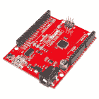
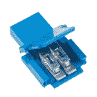
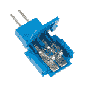

# 软罐连接指南

> 原文：<https://learn.sparkfun.com/tutorials/softpot-hookup-guide>

## 介绍

软电位器非常薄，非常独特[电位器](https://learn.sparkfun.com/tutorials/resistors/all#pot)。softpot 的擦拭器不是旋钮或物理滑块，而是任何可以滑过其传感器薄膜的物体——手指、笔帽、手写笔等。Softpots 可以用作 CNC 机器中的位置传感器、定制立体声系统中的音量控制滑块、无人机的节流阀，或者任何需要线性运动感测的项目。

[](https://www.sparkfun.com/products/8680) 

将**添加到您的[购物车](https://www.sparkfun.com/cart)中！**

 **### [软膜电位器- 50mm](https://www.sparkfun.com/products/8680)

[In stock](https://learn.sparkfun.com/static/bubbles/ "in stock") SEN-08680

这些是非常薄的可变电位计。按下金属条的不同部分，电阻线性变化…

$8.503[Favorited Favorite](# "Add to favorites") 26[Wish List](# "Add to wish list")** **像任何电位计一样，软电位计是一个三端器件。中间的引脚是游标，另外两个引脚是电阻元件的高端和低端。通过为外部端子提供电源和接地连接，中间端子可用于产生可变电压。

### 建议的材料

本教程作为软电位计的快速入门，并演示如何连接和使用它们。除软罐外，建议使用以下材料:

**[【Arduino Uno】](https://www.sparkfun.com/products/11021)**——我们将使用 Arduino 的模数转换器读入软罐的可变电压。任何兼容 Arduino 的开发平台——无论是 [RedBoard](https://www.sparkfun.com/products/12757) 、 [Pro](https://www.sparkfun.com/products/10914) 还是[Pro Mini](https://www.sparkfun.com/products/11113)——都可以替代。

**[试验板](https://www.sparkfun.com/products/12002)和[跳线](https://www.sparkfun.com/products/11026)** -软罐三端子与试验板兼容。试验板用作传感器和 Arduino 跳线之间的中间设备。

[](https://www.sparkfun.com/products/13975) 

将**添加到您的[购物车](https://www.sparkfun.com/cart)中！**

 **### [spark fun red board——用 Arduino 编程 T3](https://www.sparkfun.com/products/13975)

[In stock](https://learn.sparkfun.com/static/bubbles/ "in stock") DEV-13975

SparkFun RedBoard 结合了 UNO 的 Optiboot 引导程序的简单性、FTDI 的稳定性和 shield com…

$21.5049[Favorited Favorite](# "Add to favorites") 89[Wish List](# "Add to wish list")****[](https://www.sparkfun.com/products/12002) 

将**添加到您的[购物车](https://www.sparkfun.com/cart)中！**

 **### [【试验板-不干胶(白色)](https://www.sparkfun.com/products/12002)

[In stock](https://learn.sparkfun.com/static/bubbles/ "in stock") PRT-12002

这是你的尝试和真正的白色无焊试验板。它有 2 条电源总线，10 列，30 行，总共 400 个连接…

$5.5048[Favorited Favorite](# "Add to favorites") 93[Wish List](# "Add to wish list")****[](https://www.sparkfun.com/products/11026) 

将**添加到您的[购物车](https://www.sparkfun.com/cart)中！**

 **### [跳线标准 7" M/M - 30 AWG (30 个装)](https://www.sparkfun.com/products/11026)

[In stock](https://learn.sparkfun.com/static/bubbles/ "in stock") PRT-11026

如果你需要快速完成一个原型，没有什么比一堆跳线更能加快速度的了，让我们来看看

$2.4520[Favorited Favorite](# "Add to favorites") 43[Wish List](# "Add to wish list")****** ********[力敏电阻适配器](https://www.sparkfun.com/categories/tags/amphenol-fci)** -虽然 FSR 端子与试验板兼容，但我们发现它可能会在试验板中松动。对于那些正在寻找一种不用焊接就能实现更安全连接的方法的人来说，试试看相关的 Amphenol 引脚适配器。你需要一把[尖嘴钳](https://www.sparkfun.com/products/8793)来夹住适配器。

[](https://www.sparkfun.com/products/14194) 

将**添加到您的[购物车](https://www.sparkfun.com/cart)中！**

 **### [【安费诺 FCI】紧钳连接器(2 位，母)](https://www.sparkfun.com/products/14194)

[In stock](https://learn.sparkfun.com/static/bubbles/ "in stock") COM-14194

安费诺 FCI 公司的这些铆钉连接器可用于将扁平柔性电缆(ffc)端接至易于使用的标准 h…

$2.10[Favorited Favorite](# "Add to favorites") 5[Wish List](# "Add to wish list")****[](https://www.sparkfun.com/products/14195) 

将**添加到您的[购物车](https://www.sparkfun.com/cart)中！**

 **### [【安费诺 FCI 钳连接器(2 位，公)](https://www.sparkfun.com/products/14195)

[In stock](https://learn.sparkfun.com/static/bubbles/ "in stock") COM-14195

安费诺 FCI 公司的这些铆钉连接器可用于将扁平柔性电缆(ffc)端接至易于使用的标准 h…

$2.10[Favorited Favorite](# "Add to favorites") 9[Wish List](# "Add to wish list")****[](https://www.sparkfun.com/products/14196) 

将**添加到您的[购物车](https://www.sparkfun.com/cart)中！**

 **### [【安费诺 FCI】紧钳连接器(3 位，母)](https://www.sparkfun.com/products/14196)

[In stock](https://learn.sparkfun.com/static/bubbles/ "in stock") COM-14196

安费诺 FCI 公司的这些铆钉连接器可用于将扁平柔性电缆(ffc)端接至易于使用的标准 h…

$1.051[Favorited Favorite](# "Add to favorites") 2[Wish List](# "Add to wish list")****[](https://www.sparkfun.com/products/14197) 

将**添加到您的[购物车](https://www.sparkfun.com/cart)中！**

 **### [【安费诺 FCI 钳连接器(3 位，公)](https://www.sparkfun.com/products/14197)

[In stock](https://learn.sparkfun.com/static/bubbles/ "in stock") COM-14197

安费诺 FCI 公司的这些铆钉连接器可用于将扁平柔性电缆(ffc)端接至易于使用的标准 h…

$1.052[Favorited Favorite](# "Add to favorites") 3[Wish List](# "Add to wish list")******** ********### 推荐阅读

SoftPot 对于初学者来说是一个很好的入门级元件，但仍然有一些基本的电子概念你应该熟悉。如果这些教程的标题对你来说听起来很陌生，考虑先浏览一下这些内容。

[](https://learn.sparkfun.com/tutorials/analog-to-digital-conversion) [### 模数转换](https://learn.sparkfun.com/tutorials/analog-to-digital-conversion) The world is analog. Use analog to digital conversion to help digital devices interpret the world.[Favorited Favorite](# "Add to favorites") 58[](https://learn.sparkfun.com/tutorials/what-is-an-arduino) [### 什么是 Arduino？](https://learn.sparkfun.com/tutorials/what-is-an-arduino) What is this 'Arduino' thing anyway? This tutorials dives into what an Arduino is and along with Arduino projects and widgets.[Favorited Favorite](# "Add to favorites") 50[](https://learn.sparkfun.com/tutorials/resistors) [### 电阻](https://learn.sparkfun.com/tutorials/resistors) A tutorial on all things resistors. What is a resistor, how do they behave in parallel/series, decoding the resistor color codes, and resistor applications.[Favorited Favorite](# "Add to favorites") 57[](https://learn.sparkfun.com/tutorials/analog-vs-digital) [### 模拟与数字](https://learn.sparkfun.com/tutorials/analog-vs-digital) This tutorial covers the concept of analog and digital signals, as they relate to electronics.[Favorited Favorite](# "Add to favorites") 66

## SoftPot 概述

软罐有多种尺寸。SparkFun 目录运动[50 毫米](https://www.sparkfun.com/products/8680)、[200 毫米](https://www.sparkfun.com/products/8679)和[500 毫米](https://www.sparkfun.com/products/8681)长软条。你也可以在市场上找到圆形、弧形或其他独特形状的软盆。

[](https://www.sparkfun.com/products/8680) 

将**添加到您的[购物车](https://www.sparkfun.com/cart)中！**

 **### [软膜电位器- 50mm](https://www.sparkfun.com/products/8680)

[In stock](https://learn.sparkfun.com/static/bubbles/ "in stock") SEN-08680

这些是非常薄的可变电位计。按下金属条的不同部分，电阻线性变化…

$8.503[Favorited Favorite](# "Add to favorites") 26[Wish List](# "Add to wish list")****[](https://www.sparkfun.com/products/8681) 

将**添加到您的[购物车](https://www.sparkfun.com/cart)中！**

 **### [软膜电位器- 500mm](https://www.sparkfun.com/products/8681)

[In stock](https://learn.sparkfun.com/static/bubbles/ "in stock") SEN-08681

这些是非常薄的可变电位计。按下金属条的不同部分，电阻线性变化…

$25.955[Favorited Favorite](# "Add to favorites") 26[Wish List](# "Add to wish list")****[](https://www.sparkfun.com/products/8679) 

将**添加到您的[购物车](https://www.sparkfun.com/cart)中！**

 **### [软膜电位器- 200mm](https://www.sparkfun.com/products/8679)

[In stock](https://learn.sparkfun.com/static/bubbles/ "in stock") SEN-08679

这些是非常薄的可变电位计。按下金属条的不同部分，电阻线性变化…

$12.953[Favorited Favorite](# "Add to favorites") 14[Wish List](# "Add to wish list")****** ******50 毫米和 200 毫米软垫的特点是在外部两个端子之间有一个**10kω的总电阻**，而较大的 500mm 软垫的测量值为**20kω**。

将游标放在软电位计的底部会在中间引脚和引脚 1 之间产生一个接近 0ω的电阻(如箭头所示)。当游标到达软盆的远端时，电阻将接近 10kΩ。并且，如果游标在中间，电阻应该在 5kω左右。

[](https://cdn.sparkfun.com/assets/learn_tutorials/5/1/4/resistance-diagram-3.png)

软电位通常在整个传感器区域呈线性，因此确定游标位置的任何数学运算都应该相对简单！

## 硬件装配

传感器具有焊接接头，焊接接头穿过柔性基板与半导体材料接触。根据您的项目应用和技能，有几种连接到传感器的方法。可能需要一些组件来可靠地连接到引脚。

[](https://cdn.sparkfun.com/assets/learn_tutorials/5/1/0/Solder-Tab-Crimped-Force-Sensitive-Resistor.jpg)

### 试验板兼容标签

对于原型制作和测试，这些焊片可以插入试验板或母跳线。这里有两个关于 flex 和 soft 电位计传感器的例子。

| [](https://learn.sparkfun.com/tutorials/sik-experiment-guide-for-arduino---v32/experiment-9-using-a-flex-sensor) | [](https://learn.sparkfun.com/tutorials/sik-keyboard-instrument) |
| *弯曲传感器垂直插入试验板上，留有弯曲空间* | *软罐垂直插入试验板上，与桌子齐平* |

**Tip:** You can also use the **2.54mm pitch screw terminal** to connect the sensors on a breadboard. However, using two screw terminals side by side for sensors with three solder tabs can make it a tight fit due to the housing. Additionally, they were meant to be soldered into a PCB and the screw terminals may not sit securely in a breadboard socket like a square header pin. **IC hooks** are another option but are only meant as a temporary connection. Any small bumps can cause the IC hook to become loose and disconnect. Using the IC hooks with the sensor for long term projects may not be most secure. [**Alligator clips** can also be used to connect](https://learn.sparkfun.com/tutorials/using-the-sparkfun-picoboard-and-scratch#fsr) to the solder tabs. However, alligator clip's teeth can damage the flexible substrate or cause shorts due to the three solder tabs being close to each other.

[](https://www.sparkfun.com/products/9741) 

将**添加到您的[购物车](https://www.sparkfun.com/cart)中！**

 **### [带猪尾的 IC 钩](https://www.sparkfun.com/products/9741)

[In stock](https://learn.sparkfun.com/static/bubbles/ "in stock") CAB-09741

这些是高质量的 IC 测试钩，带有一根公连接线。这些有两个挂钩，而不是一个挂钩…

$5.5010[Favorited Favorite](# "Add to favorites") 30[Wish List](# "Add to wish list")****[](https://www.sparkfun.com/products/13191) 

将**添加到您的[购物车](https://www.sparkfun.com/cart)中！**

 **### [【带辫子的鳄鱼夹(4 个装)](https://www.sparkfun.com/products/13191)

[In stock](https://learn.sparkfun.com/static/bubbles/ "in stock") CAB-13191

这是一个 4 包电线，预先终止于一端的鳄鱼夹和另一端的连接尾纤。阿利加…

$3.50[Favorited Favorite](# "Add to favorites") 21[Wish List](# "Add to wish list")****[](https://www.sparkfun.com/products/10571) 

将**添加到您的[购物车](https://www.sparkfun.com/cart)中！**

 **### [【螺丝端子 2.54mm 螺距(2 针)](https://www.sparkfun.com/products/10571)

[In stock](https://learn.sparkfun.com/static/bubbles/ "in stock") PRT-10571

这些是带有 2.54 毫米间距引脚的简单双位螺丝端子。额定高达 150 伏@ 6A，这个终端可以接受 30 至 18A…

$0.953[Favorited Favorite](# "Add to favorites") 18[Wish List](# "Add to wish list")****** ******### 焊接到标签上

**Warning!** The flexible substrate and semi-conductive material are sensitive to heat. The force sensitive resistors from Interlink are more sensitive compared to other flexible sensors. There is a risk of damaging the sensor when soldering to the solder tabs. We only recommend this for **advanced users** that have adjusted their soldering iron for lower temperatures.

当将其集成到长期项目和安装中时，可以选择将导线或 PCB 直接焊接到焊片上。然而，由于柔性衬底和半导体材料的限制，过多的热量会熔化材料并损坏传感器。下面是我们的生产组装技术人员将 flex 传感器焊接到 PCB 上的示例。

[](https://cdn.sparkfun.com/assets/learn_tutorials/5/1/0/14666-SparkFun_Qwiic_Flex_Glove_Controller-Solder-Tabs-Soldered.jpg)

虽然您可以焊接到 SofPot 的焊片上，但我们只建议有焊接经验的**高级用户**使用。对于那些焊接到软罐上的，你需要在一个较低的温度下焊接，并确保烙铁加热焊片不超过 1 秒钟。再久一点，你会损坏材料和半导体材料。与柔性传感器和软电位计相比，力敏电阻器尤其容易损坏。

**Tip:** For advanced users that are interested in the challenge, try checking out the following forum post and instructions from Digi-Key. While they use a force sensitive resistor, the steps to solder to a flex sensor's solder tabs are the same.

*   [Digi-Key 论坛:如何焊接互连电子 FSR 传感器](https://forum.digikey.com/t/how-to-solder-interlink-electronics-fsr-sensor/555)
*   [如何将电线焊接到 FSR 传感器上](https://media.digikey.com/pdf/Data%20Sheets/Interlink%20Electronics.PDF/FSR400_Soldering_Instr.pdf)

### 安费诺 CFI 铆钉连接器

作为替代，用户可以使用安费诺 FCI 紧钳连接器与传感器进行可靠连接，并在压接连接器上提供少量应变消除。这是推荐给那些以前没有焊接过并且在试验板或教室环境之外的长期项目中使用传感器的人。该连接器被设计成压接柔性印刷电路上的引脚，作为向热敏元件(如半导电材料或导电墨水)施加热量的替代方案。

[](https://cdn.sparkfun.com/assets/learn_tutorials/5/1/0/Flex_Force_Sensitive_SoftPot_Sensor_Clincher_Connector.jpg)

##### 压接敲弯连接器

我们将使用阳铆钉连接器来压接弯曲传感器。然而，下面列出的说明也适用于任何两个或三个引脚的柔性传感器。

要连接，您需要切断传感器上的焊片。确保尽可能靠近焊片切割。如果切掉太多传感器，连接半导体材料可能会有问题。软罐上的半导电焊盘的长度小于力敏电阻器和弯曲传感器。

| [](https://cdn.sparkfun.com/assets/learn_tutorials/5/1/0/Cut_Solder-Tabs_Flex_Sensor_Clincher_Connector.jpg) | [](https://cdn.sparkfun.com/assets/learn_tutorials/5/1/0/Cut_Solder-Tabs_Slide_Pot_Clincher_Connector.jpg) |
| *从弯曲传感器上切下焊片* | *从滑壶上切下焊片* |

切断订书钉后，将传感器插入相应的敲弯连接器。确保半导体材料与新订书钉对齐，否则可能会造成短路。根据传感器的不同，您可以使用较少的半导体材料。如右图所示，切除焊片后，软罐将有更小的焊盘。

| [](https://cdn.sparkfun.com/assets/learn_tutorials/5/1/0/Insert_Flex_Sensor_Clincher_Connector.jpg) | [](https://cdn.sparkfun.com/assets/learn_tutorials/5/1/0/Insert_Slide_Pot_Clincher_Connector.jpg) |
| *将弯曲传感器插入 2 针敲弯连接器* | *将软电位传感器插入 3 针敲弯连接器* |

一旦您对准了传感器，我们建议您用一条胶带压住传感器和紧钳连接器，以防止传感器在夹紧连接器时移动。

[](https://cdn.sparkfun.com/assets/learn_tutorials/5/1/0/Tape_Flex_Sensor_Clincher_Connector.jpg)

我们建议使用平齐的滑动接头钳来夹紧连接器。从图中可以看出，力施加在锁闩和卡钉的中心，而不是沿着连接器侧面的凹槽。与柔性传感器和 SoftPot 上的其他柔性基板相比，力敏电阻器将更容易被箝位。当压接针咬穿传感器时，您会听到一声微小但令人满意的爆裂声。

[](https://cdn.sparkfun.com/assets/learn_tutorials/5/1/0/Flush_Narrow_Slip_Joint_Plier_Flex_Sensor_Clincher_Connector.jpg)

否则，可以使用尖嘴钳将钉夹到传感器上。合上拉环，将压接引脚固定在半导体材料上。然后确保小心地从每个角向中心施力(同时避开侧面的凹槽)。

[](#carousel-63c18eee5e84c)[](#carousel-63c18eee5e84c)

如果使用尖嘴钳时用力不当，会有损坏塑料外壳的风险。右图显示，尽管压接引脚与软外壳接触，但紧钳连接器外壳已损坏。

| [](https://cdn.sparkfun.com/assets/learn_tutorials/5/1/0/Incorrect_Use_Pliers_Clincher_Connector_Housing.jpg) | [](https://cdn.sparkfun.com/assets/learn_tutorials/5/1/0/Damaged_Clincher_Connector_Housing.jpg) |
| *钳子未正确应用于敲弯连接器。* | *软罐的敲弯连接器外壳损坏。* |

**Tip:** If you have issues pushing down on the tab to crimp the pins simultaneously, you can individually crimp the pins with needle nose pliers. Just make sure to be careful so that the grooves are not damaged. Here's an example from Provancher.

[Flex-circuit Soldering & Assembly Tutorial and Notes](https://my.mech.utah.edu/~wil/tutorials/flexCirc_soldering_tutorial/Flex_circuit_Soldering_Tutorial.html)

完成后，从背面取下胶带。为了测试，你可以[使用万用表](https://learn.sparkfun.com/tutorials/how-to-use-a-multimeter/)来确定传感器是否短路或者电阻是否会改变。您也可以使用跳线将传感器连接到电路，以检查传感器是否按预期工作。

[](https://cdn.sparkfun.com/assets/learn_tutorials/5/1/0/Flex_Force_Sensitive_SoftPot_Sensor_Clincher_Connector.jpg)

## 示例电路

通过向 SoftPot 的外部引脚提供电压，我们可以在中间的游标引脚上产生一个可变电压。下面是一个连接示例:

[](https://cdn.sparkfun.com/assets/learn_tutorials/5/1/4/example_circuit_bb-pulldown.png)

游标和地之间的 10kΩ电阻拉低软电位计的模拟输出信号。这可以确保传感器的输出值不会“浮动”，这是我们在信号电压没有真正确定性的情况下使用的术语。

通过将引脚 1 连接到地，将引脚 3 连接到 5V，我们可以使中间引脚上的电压随着游标从软罐底部(朝向端子)移动到顶部而从 0V 上升到 5V。颠倒电源可以改变这种关系。

## 示例代码

这是一个基于上述电路的简单 Arduino 示例。复制并粘贴到你的 Arduino IDE，然后上传！

**注意:**此示例假设您在桌面上使用的是最新版本的 Arduino IDE。如果这是你第一次使用 Arduino，请回顾我们关于[安装 Arduino IDE 的教程。](https://learn.sparkfun.com/tutorials/installing-arduino-ide)

If you have not previously installed an Arduino library, please check out our [installation guide.](https://learn.sparkfun.com/tutorials/installing-an-arduino-library)

```
language:c
/******************************************************************************
SoftPot_Example.ino
Example sketch for SparkFun's soft membrane potentiometer
  (https://www.sparkfun.com/products/8680)
Jim Lindblom @ SparkFun Electronics
April 28, 2016

- Connect the softpot's outside pins to 5V and GND (the outer pin with an arrow
indicator should be connected to GND). 
- Connect the middle pin to A0.

As the voltage output of the softpot changes, a line graph printed to the
serial monitor should match the wiper's position.

Development environment specifics:
Arduino 1.6.7
******************************************************************************/
const int SOFT_POT_PIN = A0; // Pin connected to softpot wiper

const int GRAPH_LENGTH = 40; // Length of line graph

void setup() 
{
  Serial.begin(9600);
  pinMode(SOFT_POT_PIN, INPUT);
}

void loop() 
{
  // Read in the soft pot's ADC value
  int softPotADC = analogRead(SOFT_POT_PIN);
  // Map the 0-1023 value to 0-40
  int softPotPosition = map(softPotADC, 0, 1023, 0, GRAPH_LENGTH);

  // Print a line graph:
  Serial.print("<"); // Starting end
  for (int i=0; i<GRAPH_LENGTH; i++)
  {
    if (i == softPotPosition) Serial.print("|");
    else Serial.print("-");
  }
  Serial.println("> (" + String(softPotADC) + ")");

  delay(500);
} 
```

上传后，**打开你的[串口监视器](https://learn.sparkfun.com/tutorials/terminal-basics/arduino-serial-monitor-windows-mac-linux)** ，设置波特率为 9600 bps。

然后，通过滑动手指、铅笔橡皮擦、工具把手或任何可滑动的物体穿过电位计的感应区域来启动软电位计。

[](https://cdn.sparkfun.com/assets/learn_tutorials/5/1/4/softpot-action.jpg)

一系列的线图应该开始在串行监视器中流动。

[](https://cdn.sparkfun.com/assets/learn_tutorials/5/1/4/softpot-serial-monitor.png)

每次读取后，原始 ADC 读数也会打印出来。拿着它，开始建造你自己的滑动控制系统！

## 资源和更进一步

如果您需要更多与 SoftPot 相关的文档，以下资源可能会有所帮助:

*   [SoftPot 数据表](http://www.sparkfun.com/datasheets/Sensors/Flex/SoftPot-Datasheet.pdf)
*   [软罐规格](https://www.sparkfun.com/datasheets/Sensors/Flex/SoftPot-Specs.pdf)

现在你已经为你的 Arduino 设置了滑动控制，你打算做什么呢？需要一些灵感吗？查看一些 SparkFun 教程:

[](https://learn.sparkfun.com/tutorials/touch-potentiometer-hookup-guide) [### 触摸电位计连接指南](https://learn.sparkfun.com/tutorials/touch-potentiometer-hookup-guide) Learn how to use the SparkFun Touch Potentiometer to control lighting, volume or other inputs in your daily life.[Favorited Favorite](# "Add to favorites") 7[](https://learn.sparkfun.com/tutorials/rotary-switch-potentiometer-hookup-guide) [### 旋转开关电位计连接指南](https://learn.sparkfun.com/tutorials/rotary-switch-potentiometer-hookup-guide) How to use the Rotary Switch Potentiometer breakout board, with some sample applications.[Favorited Favorite](# "Add to favorites") 16[](https://learn.sparkfun.com/tutorials/bare-conductive-musical-painting-) [### 裸露导电音乐画](https://learn.sparkfun.com/tutorials/bare-conductive-musical-painting-) Learn how to make a musical painting using the Bare Conductive Touch Board and Conductive Paint.[Favorited Favorite](# "Add to favorites") 6[](https://learn.sparkfun.com/tutorials/mp3-trigger-hookup-guide-v24) [### MP3 触发连接指南 V24](https://learn.sparkfun.com/tutorials/mp3-trigger-hookup-guide-v24) Incorporate sound into your next project easily with the MP3 Trigger.[Favorited Favorite](# "Add to favorites") 5****************************