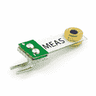
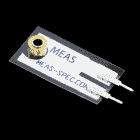
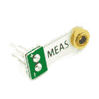
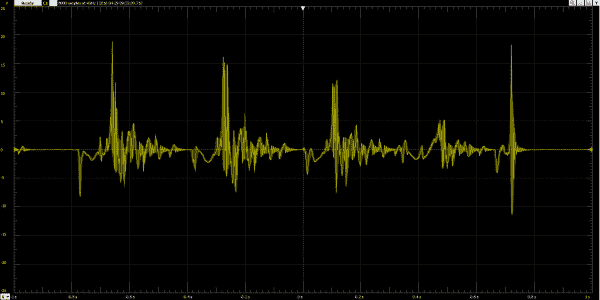
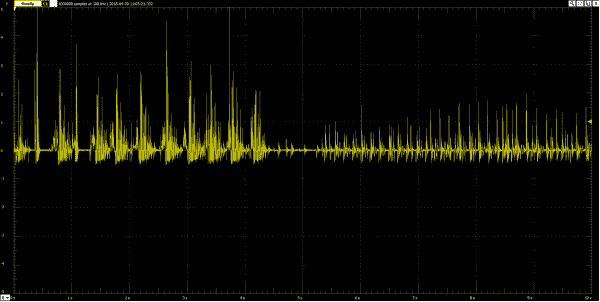
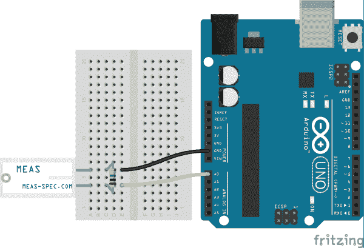
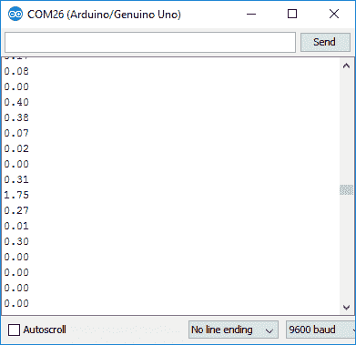
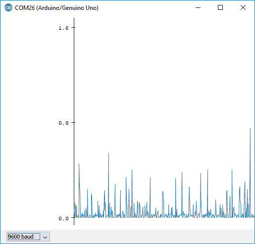

# 压电振动传感器连接指南

> 原文：<https://learn.sparkfun.com/tutorials/piezo-vibration-sensor-hookup-guide>

## 介绍

压电传感器是一种柔性设备，受到压力时会产生电荷。这一特性使得压电传感器成为低功耗弯曲、触摸和振动检测的理想解决方案。在更高级的应用中，压电可以作为能量收集的基础。压电传感器是完美的传感器，可以捕捉你的冰箱何时运转，或者作为[能量收集](https://www.sparkfun.com/products/9946)摇动灯的电源。

[](https://www.sparkfun.com/products/9196) 

将**添加到您的[购物车](https://www.sparkfun.com/cart)中！**

 **### [压电振动传感器——大型](https://www.sparkfun.com/products/9196)

[In stock](https://learn.sparkfun.com/static/bubbles/ "in stock") SEN-09196

Measurement Specialties 的这款基本压电传感器通常用于弯曲、触摸、振动和冲击测量。一个小…

$5.50[Favorited Favorite](# "Add to favorites") 24[Wish List](# "Add to wish list")****[](https://www.sparkfun.com/products/9199) 

将**添加到您的[购物车](https://www.sparkfun.com/cart)中！**

 **### [压电振动传感器-小型立式](https://www.sparkfun.com/products/9199)

[In stock](https://learn.sparkfun.com/static/bubbles/ "in stock") SEN-09199

来自 Measurement Specialties 的 Minisense 100 是一款低成本的悬臂式振动传感器，由质量块加载，可提供高精度的振动测量

$9.95[Favorited Favorite](# "Add to favorites") 16[Wish List](# "Add to wish list")****[](https://www.sparkfun.com/products/9197) 

将**添加到您的[购物车](https://www.sparkfun.com/cart)中！**

 **### [压电振动传感器——大质量](https://www.sparkfun.com/products/9197)

[In stock](https://learn.sparkfun.com/static/bubbles/ "in stock") SEN-09197

Measurement Specialties 的这款基本压电传感器通常用于弯曲、触摸、振动和冲击测量。一个小…

$6.50[Favorited Favorite](# "Add to favorites") 18[Wish List](# "Add to wish list")****[](https://www.sparkfun.com/products/9198) 

将**添加到您的[购物车](https://www.sparkfun.com/cart)中！**

 **### [压电振动传感器-小型卧式](https://www.sparkfun.com/products/9198)

[In stock](https://learn.sparkfun.com/static/bubbles/ "in stock") SEN-09198

来自 Measurement Specialties 的 Minisense 100 是一款低成本的悬臂式振动传感器，由质量块加载，可提供高精度的振动测量。

$9.952[Favorited Favorite](# "Add to favorites") 14[Wish List](# "Add to wish list")******** ********压电有可能产生非常大的交流电压尖峰-高达 50V。由于会产生如此高的电压，因此在振动检测应用中，通常使用大电阻来“加载”压电传感器。齐纳二极管也可用于将电压箝位至安全水平。

### 建议的材料

本教程作为压电振动传感器的快速入门，并演示如何连接和使用它们。除传感器外，建议使用以下材料:

**[Arduino Uno](https://www.sparkfun.com/products/11021)** -我们将使用 Arduino 的模数转换器读取压电传感器产生的电压。任何兼容 Arduino 的开发平台——无论是 [RedBoard](https://www.sparkfun.com/products/12757) 、 [Pro](https://www.sparkfun.com/products/10914) 还是[Pro Mini](https://www.sparkfun.com/products/11113)——都可以替代。

**[电阻套件](https://www.sparkfun.com/products/10969)** -为了抑制压电传感器的交流电压尖峰，使用了一个大约 1mω的大负载电阻。该电阻套件包括多个 1mω电阻，以防您想要将几个串联在一起。

**[试验板](https://www.sparkfun.com/products/12002)和[跳线](https://www.sparkfun.com/products/11026)** -压电传感器的引脚间距为 0.2 英寸，与试验板兼容。我们将把它们和电阻粘在一块试验板上，然后用跳线从试验板连接到 Arduino。

[](https://www.sparkfun.com/products/10969) 

将**添加到您的[购物车](https://www.sparkfun.com/cart)中！**

 **### [【电阻器套件- 1/4W(共 500)](https://www.sparkfun.com/products/10969)

[Out of stock](https://learn.sparkfun.com/static/bubbles/ "out of stock") COM-10969

电阻是个好东西，事实上，在许多电路设计中，电阻是至关重要的。唯一的问题似乎是…

$8.95180[Favorited Favorite](# "Add to favorites") 185[Wish List](# "Add to wish list")****[](https://www.sparkfun.com/products/13975) 

将**添加到您的[购物车](https://www.sparkfun.com/cart)中！**

 **### [spark fun red board——用 Arduino 编程 T3](https://www.sparkfun.com/products/13975)

[In stock](https://learn.sparkfun.com/static/bubbles/ "in stock") DEV-13975

SparkFun RedBoard 结合了 UNO 的 Optiboot 引导程序的简单性、FTDI 的稳定性和 shield com…

$21.5049[Favorited Favorite](# "Add to favorites") 89[Wish List](# "Add to wish list")****[](https://www.sparkfun.com/products/12002) 

将**添加到您的[购物车](https://www.sparkfun.com/cart)中！**

 **### [【试验板-不干胶(白色)](https://www.sparkfun.com/products/12002)

[In stock](https://learn.sparkfun.com/static/bubbles/ "in stock") PRT-12002

这是你的尝试和真正的白色无焊试验板。它有 2 条电源总线，10 列，30 行，总共 400 个连接…

$5.5048[Favorited Favorite](# "Add to favorites") 93[Wish List](# "Add to wish list")****[](https://www.sparkfun.com/products/11026) 

将**添加到您的[购物车](https://www.sparkfun.com/cart)中！**

 **### [跳线标准 7" M/M - 30 AWG (30 个装)](https://www.sparkfun.com/products/11026)

[In stock](https://learn.sparkfun.com/static/bubbles/ "in stock") PRT-11026

如果你需要快速完成一个原型，没有什么比一堆跳线更能加快速度的了，让我们来看看

$2.4520[Favorited Favorite](# "Add to favorites") 43[Wish List](# "Add to wish list")******** ********### 推荐阅读

压电元件对于初学者来说是一个很好的入门级元件，但仍然有一些基本的电子概念你应该熟悉。如果这些教程的标题对你来说听起来很陌生，考虑先浏览一下这些内容。

[](https://learn.sparkfun.com/tutorials/analog-to-digital-conversion) [### 模数转换](https://learn.sparkfun.com/tutorials/analog-to-digital-conversion) The world is analog. Use analog to digital conversion to help digital devices interpret the world.[Favorited Favorite](# "Add to favorites") 58[](https://learn.sparkfun.com/tutorials/what-is-an-arduino) [### 什么是 Arduino？](https://learn.sparkfun.com/tutorials/what-is-an-arduino) What is this 'Arduino' thing anyway? This tutorials dives into what an Arduino is and along with Arduino projects and widgets.[Favorited Favorite](# "Add to favorites") 50[](https://learn.sparkfun.com/tutorials/analog-vs-digital) [### 模拟与数字](https://learn.sparkfun.com/tutorials/analog-vs-digital) This tutorial covers the concept of analog and digital signals, as they relate to electronics.[Favorited Favorite](# "Add to favorites") 66[](https://learn.sparkfun.com/tutorials/alternating-current-ac-vs-direct-current-dc) [### 交流电与直流电(DC)](https://learn.sparkfun.com/tutorials/alternating-current-ac-vs-direct-current-dc) Learn the differences between AC and DC, the history, different ways to generate AC and DC, and examples of applications.[Favorited Favorite](# "Add to favorites") 53

## 振动传感器概述

压电振动传感器有多种形状和尺寸。以下是来自 SparkFun 目录的精选:

[](https://www.sparkfun.com/products/9196) 

将**添加到您的[购物车](https://www.sparkfun.com/cart)中！**

 **### [压电振动传感器——大型](https://www.sparkfun.com/products/9196)

[In stock](https://learn.sparkfun.com/static/bubbles/ "in stock") SEN-09196

Measurement Specialties 的这款基本压电传感器通常用于弯曲、触摸、振动和冲击测量。一个小…

$5.50[Favorited Favorite](# "Add to favorites") 24[Wish List](# "Add to wish list")****[](https://www.sparkfun.com/products/9199) 

将**添加到您的[购物车](https://www.sparkfun.com/cart)中！**

 **### [压电振动传感器-小型立式](https://www.sparkfun.com/products/9199)

[In stock](https://learn.sparkfun.com/static/bubbles/ "in stock") SEN-09199

来自 Measurement Specialties 的 Minisense 100 是一款低成本的悬臂式振动传感器，由质量块加载，可提供高精度的振动测量。

$9.95[Favorited Favorite](# "Add to favorites") 16[Wish List](# "Add to wish list")****[](https://www.sparkfun.com/products/9197) 

将**添加到您的[购物车](https://www.sparkfun.com/cart)中！**

 **### [压电振动传感器——大质量](https://www.sparkfun.com/products/9197)

[In stock](https://learn.sparkfun.com/static/bubbles/ "in stock") SEN-09197

Measurement Specialties 的这款基本压电传感器通常用于弯曲、触摸、振动和冲击测量。一个小…

$6.50[Favorited Favorite](# "Add to favorites") 18[Wish List](# "Add to wish list")****[](https://www.sparkfun.com/products/9198) 

将**添加到您的[购物车](https://www.sparkfun.com/cart)中！**

 **### [压电振动传感器-小型卧式](https://www.sparkfun.com/products/9198)

[In stock](https://learn.sparkfun.com/static/bubbles/ "in stock") SEN-09198

来自 Measurement Specialties 的 Minisense 100 是一款低成本的悬臂式振动传感器，由质量块加载，可提供高精度的振动测量。

$9.952[Favorited Favorite](# "Add to favorites") 14[Wish List](# "Add to wish list")******** ********一些压电传感器的末端包括重物，以帮助鼓励振动。

### 交流电压源

压电传感器是独一无二的，因为它们在受压时会产生[交流](https://learn.sparkfun.com/tutorials/alternating-current-ac-vs-direct-current-dc#alternating-current-ac) (AC)电压，将机械能转化为电能。如果你把一个[示波器](https://learn.sparkfun.com/tutorials/how-to-use-an-oscilloscope)接到一个压电传感器上，当传感器震动时，你可能会看到这样的波形:

[](https://cdn.sparkfun.com/assets/learn_tutorials/5/1/5/piezo-screen-2.png)

上面的信号是通过简单地将[大而重的压电](https://www.sparkfun.com/products/9197)插入试验板并轻弹几次而产生的。请注意，电压峰值几乎达到+20V 和-12V。该电平的信号有可能永久损坏微控制器的模数转换器(ADC)引脚。

为了抑制这些电压尖峰，我们有一些简单的技巧。最简单的解决办法是**用一个大电阻给压电**加载。例如，通过将一个 1mω电阻与传感器并联，我们可以将电压尖峰降至更安全的水平。

[](https://cdn.sparkfun.com/assets/learn_tutorials/5/1/5/piezo-screen-loaded-adc-1.png)

在上图中，传感器加载了一个 1mω电阻，并连接到 Arduino ADC。-0.5 至+5V 之间的电压尖峰在 ATmega328 的 I/O 引脚的容许范围内。

更复杂的压电阻尼电路可能包括[齐纳二极管](https://www.sparkfun.com/products/10301)来箝位电压或者[运算放大器](https://www.sparkfun.com/products/9456)来缓冲信号，但是这个简单的电阻负载电路是一个很好的起点。

## 示例电路

使用上述 1mω负载电阻阻尼方法，下面是一个简单的电路示例，演示如何连接振动传感器:

[](https://cdn.sparkfun.com/assets/learn_tutorials/5/1/5/example-circuit_bb.png)

压电一端接地，产生的电压路由至 Arduino 的 A0 ADC 引脚。读取该引脚上的电压应该可以让我们知道压电元件移动了多少。

## 示例代码

这是一个基于上述电路的非常简单的 Arduino 示例。复制并粘贴到你的 Arduino IDE，然后上传！

**注意:**此示例假设您在桌面上使用的是最新版本的 Arduino IDE。如果这是你第一次使用 Arduino，请回顾我们关于[安装 Arduino IDE 的教程。](https://learn.sparkfun.com/tutorials/installing-arduino-ide)

If you have not previously installed an Arduino library, please check out our [installation guide.](https://learn.sparkfun.com/tutorials/installing-an-arduino-library)

```
language:c
/******************************************************************************
Piezo_Vibration_Sensor.ino
Example sketch for SparkFun's Piezo Vibration Sensor
  (https://www.sparkfun.com/products/9197)
Jim Lindblom @ SparkFun Electronics
April 29, 2016

- Connect a 1Mohm resistor across the Piezo sensor's pins.
- Connect one leg of the Piezo to GND
- Connect the other leg of the piezo to A0

Vibrations on the Piezo sensor create voltags, which are sensed by the Arduino's
A0 pin. Check the serial monitor to view the voltage generated.

Development environment specifics:
Arduino 1.6.7
******************************************************************************/
const int PIEZO_PIN = A0; // Piezo output

void setup() 
{
  Serial.begin(9600);
}

void loop() 
{
  // Read Piezo ADC value in, and convert it to a voltage
  int piezoADC = analogRead(PIEZO_PIN);
  float piezoV = piezoADC / 1023.0 * 5.0;
  Serial.println(piezoV); // Print the voltage.
} 
```

一旦设置好电路并上传代码，**打开你的[串行监视器](https://learn.sparkfun.com/tutorials/terminal-basics/arduino-serial-monitor-windows-mac-linux)** ，并将波特率设置为 9600 bps。

你应该看到 0.00 的流无休止。试着摇动传感器，看看电压是否上升。

[](https://cdn.sparkfun.com/assets/learn_tutorials/5/1/5/piezo-arduino-serial.png)

你的眼睛可能不够快，无法捕捉到所有这些数字的变化。您可以在循环结束时引入一个延迟(例如`delay(250);`)，也可以在 Arduino IDE 的新版本中的**串行绘图仪**中查看输出。进入**工具** > **串行绘图仪**打开绘图仪。

[](https://cdn.sparkfun.com/assets/learn_tutorials/5/1/5/piezo-arduino-graph.png)

现在，您可以创建自己的示波器测量！该图有助于演示压电传感器的电压尖峰和振铃。尝试轻弹、摇晃或踩踏地面，看看这些运动如何影响压电传感器的测量。

一旦你掌握了这一点，你就可以找到一个“振动阈值”来满足你的项目需求，并让你的 Arduino 寻找任何高于该值的测量值来检测振动。

## 资源和更进一步

有关压电和压电传感器的更多信息，请查看以下资源:

*   [LDT0-028K 压电传感器数据表](http://cdn.sparkfun.com/datasheets/Sensors/ForceFlex/LDT_Series.pdf)
*   [压电传感器技术手册](https://www.sparkfun.com/datasheets/Sensors/Flex/MSI-techman.pdf)

现在你已经让你的 Arduino 感应到那些好的振动了，你打算开始什么样的震动感应项目呢？需要一些灵感吗？查看一些相关教程:

[](https://learn.sparkfun.com/tutorials/wake-on-shake-hookup-guide) [### 摇动唤醒连接指南](https://learn.sparkfun.com/tutorials/wake-on-shake-hookup-guide) A basic hookup guide for getting started with the SparkFun Wake-on-Shake. The board gives you the ability to put your project into hibernation until bumped or shaken awake using the ADXL362 accelerometer. This means you can design projects meant to stay inert for long periods of time, possibly even several years, depending on the battery type used to power the project.[Favorited Favorite](# "Add to favorites") 7[](https://learn.sparkfun.com/tutorials/mma8452q-accelerometer-breakout-hookup-guide) [### MMA8452Q 加速度计分线连接指南](https://learn.sparkfun.com/tutorials/mma8452q-accelerometer-breakout-hookup-guide) How to get started using the MMA8452Q 3-axis accelerometer -- a solid, digital, easy-to-use acceleration sensor.[Favorited Favorite](# "Add to favorites") 5[](https://learn.sparkfun.com/tutorials/lsm9ds1-breakout-hookup-guide) [### LSM9DS1 分线连接指南](https://learn.sparkfun.com/tutorials/lsm9ds1-breakout-hookup-guide) A hookup guide for the LSM9DS1, which features a 3-axis accelerometer, 3-axis gyroscope, and 3-axis magnetometer. It's an IMU-in-a-chip 9[](https://learn.sparkfun.com/tutorials/blynk-board-washerdryer-alarm) [### Blynk 板洗衣机/烘干机警报](https://learn.sparkfun.com/tutorials/blynk-board-washerdryer-alarm) How to configure the Blynk Board and app to notify you when your washer or dryer is done shaking.[Favorited Favorite](# "Add to favorites") 9************************