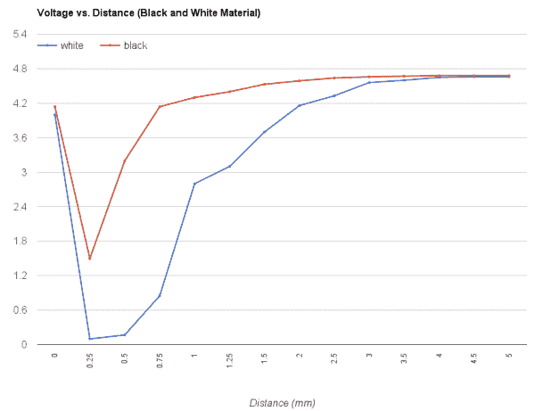

# QRD1114 光学探测器连接指南

> 原文：<https://learn.sparkfun.com/tutorials/qrd1114-optical-detector-hookup-guide>

## 介绍

[QRD1114](https://www.sparkfun.com/products/246) 是一款半 LED、半光电晶体管、全红外反射光学探测器。它可以用来感应附近的物体，甚至检测黑白表面之间的差异。像这样的光电探测器是从循线机器人到智能手机近距离探测等项目的关键部件。

[](https://www.sparkfun.com/products/246) 

将**添加到您的[购物车](https://www.sparkfun.com/cart)中！**

 **### [光探测器/光电晶体管- QRD1114](https://www.sparkfun.com/products/246)

[Out of stock](https://learn.sparkfun.com/static/bubbles/ "out of stock") SEN-00246

该传感器使用红外发射二极管结合红外光电晶体管来检测反射的红外信号。…

$1.054[Favorited Favorite](# "Add to favorites") 18[Wish List](# "Add to wish list")** **QRD1114 易于连接:您只需要一个 IR LED 限流电阻和一个光电晶体管集电极引脚上的上拉电阻。该组件可用于产生模拟信号，由微控制器的模数转换器读取，与附近物体的接近度成比例。

### 建议的材料

本教程作为反射式光电探测器的快速入门，演示了如何连接和使用它们。除了传感器本身，还推荐使用以下材料:

**[Arduino Uno](https://www.sparkfun.com/products/11021)**——我们将使用 Arduino 的模数转换器读入光电探测器的模拟输出电压。任何兼容 Arduino 的开发平台——无论是 [RedBoard](https://www.sparkfun.com/products/12757) 、 [Pro](https://www.sparkfun.com/products/10914) 还是[Pro Mini](https://www.sparkfun.com/products/11113)——都可以替代。

**[电阻套件](https://www.sparkfun.com/products/10969)**——光电探测器的 LED 部分需要一个限流电阻——在**330ω**范围内的某处。在传感器的另一半，我们需要一个**10kω**上拉电阻，以利用光电晶体管的光敏电流吞吐量。这种电阻套件便于进行一些反复试验，以便尽可能地找出最敏感的电路。

**[试验板](https://www.sparkfun.com/products/12002)** 和 **[跳线](https://www.sparkfun.com/products/11026)** -光电探测器的腿可以弯曲和成形，以适应标准的 0.1 英寸间距试验板。然后，我们将使用跳线从试验板连接到 Arduino。

[](https://www.sparkfun.com/products/10969) 

将**添加到您的[购物车](https://www.sparkfun.com/cart)中！**

 **### [【电阻器套件- 1/4W(共 500)](https://www.sparkfun.com/products/10969)

[Out of stock](https://learn.sparkfun.com/static/bubbles/ "out of stock") COM-10969

电阻是个好东西，事实上，在许多电路设计中，电阻是至关重要的。唯一的问题似乎是…

$8.95180[Favorited Favorite](# "Add to favorites") 185[Wish List](# "Add to wish list")****[](https://www.sparkfun.com/products/12002) 

将**添加到您的[购物车](https://www.sparkfun.com/cart)中！**

 **### [【试验板-不干胶(白色)](https://www.sparkfun.com/products/12002)

[In stock](https://learn.sparkfun.com/static/bubbles/ "in stock") PRT-12002

这是你的尝试和真正的白色无焊试验板。它有 2 条电源总线，10 列，30 行，总共 400 个连接…

$5.5048[Favorited Favorite](# "Add to favorites") 93[Wish List](# "Add to wish list")****[](https://www.sparkfun.com/products/11026) 

将**添加到您的[购物车](https://www.sparkfun.com/cart)中！**

 **### [跳线标准 7" M/M - 30 AWG (30 个装)](https://www.sparkfun.com/products/11026)

[In stock](https://learn.sparkfun.com/static/bubbles/ "in stock") PRT-11026

如果你需要快速完成一个原型，没有什么比一堆跳线更能加快速度的了，让我们来看看

$2.4520[Favorited Favorite](# "Add to favorites") 43[Wish List](# "Add to wish list")****[](https://www.sparkfun.com/products/retired/12757) 

### [spark fun red board——用 Arduino 编程 T3](https://www.sparkfun.com/products/retired/12757)

[Retired](https://learn.sparkfun.com/static/bubbles/ "Retired") DEV-12757

在 SparkFun，我们使用许多 Arduinos，我们一直在寻找最简单、最稳定的一款。每块板都有点不同…

127 **Retired**[Favorited Favorite](# "Add to favorites") 78[Wish List](# "Add to wish list")****** ******### 推荐阅读

对于初学者来说，反射式光电探测器是很好的入门级元件，但仍有一些基本的电子学概念你应该熟悉。如果这些教程的标题对你来说听起来很陌生，考虑先浏览一下这些内容。

[](https://learn.sparkfun.com/tutorials/light) [### 光](https://learn.sparkfun.com/tutorials/light) Light is a useful tool for the electrical engineer. Understanding how light relates to electronics is a fundamental skill for many projects.[Favorited Favorite](# "Add to favorites") 24[](https://learn.sparkfun.com/tutorials/analog-to-digital-conversion) [### 模数转换](https://learn.sparkfun.com/tutorials/analog-to-digital-conversion) The world is analog. Use analog to digital conversion to help digital devices interpret the world.[Favorited Favorite](# "Add to favorites") 58[](https://learn.sparkfun.com/tutorials/light-emitting-diodes-leds) [### 发光二极管](https://learn.sparkfun.com/tutorials/light-emitting-diodes-leds) Learn the basics about LEDs as well as some more advanced topics to help you calculate requirements for projects containing many LEDs.[Favorited Favorite](# "Add to favorites") 67[](https://learn.sparkfun.com/tutorials/transistors) [### 晶体管](https://learn.sparkfun.com/tutorials/transistors) A crash course in bi-polar junction transistors. Learn how transistors work and in which circuits we use them.[Favorited Favorite](# "Add to favorites") 84

## QRD1114 概述

QRD1114 是一款 4 引脚器件。两条腿断开红外 LED，另外两条腿断开光电晶体管的集电极和发射极引脚(光电晶体管的“基极”由返回的 IR 光控制)。下图来自数据手册，显示了哪个引脚是哪个引脚。

[](https://cdn.sparkfun.com/assets/learn_tutorials/5/1/6/internal-schematic.png)

通过定位组件顶部的**点**可以找到晶体管的集电极引脚 1。您还应该能够看到两个颜色明显不同的矩形——一个黑色，一个透明。黑色的长方形是光电晶体管(黑色的部分其实是一个滤镜盖)，透明的一半是 LED。

[](https://cdn.sparkfun.com/assets/learn_tutorials/5/1/6/sensor-dimensions.png)*Top-down diagram of the QRD1114\. Note the pin 1 indicator.*

从上往下看，引脚按逆时针顺序递增。管脚 2 -晶体管的发射极-沿着体的长边与管脚 1 相邻。引脚 3，LED 阳极从引脚 2 穿过光电探测器的短边。阴极引脚 4 与引脚 3 相邻，并从引脚 1 穿过主体。

腿的**长度也可以帮助确定哪个是哪个。引脚 1 和 3 比其他引脚长；(很可能)不是巧合，这些都是各自组件(集电极和阳极)的“正极”引脚。**

[](https://cdn.sparkfun.com/assets/learn_tutorials/5/1/6/qrd1114-legs.jpg)

### 传感器特性

QRD1114 的红外 LED 就像你过去可能用过的任何其他 [LED](https://learn.sparkfun.com/tutorials/light-emitting-diodes-leds) 一样。**正向电压**通常在 1.2V 和 1.7V 之间**，这意味着你的电源至少需要这么大的电势来给 LED 供电。只要你有一个限流电阻，3.3V 或 5V 电源就可以工作得很好。**

LED 的最大正向电流为 50mA 超过这个值就有可能永久损坏零件。最好的目标是向二极管提供大约 20mA 的电流。

在 [QRD1114 数据表](https://www.fairchildsemi.com/datasheets/QR/QRD1114.pdf)中，最有趣的图表之一是该距离与晶体管集电极电流的关系曲线:

[](https://cdn.sparkfun.com/assets/learn_tutorials/5/1/6/reflectance-distance-curve.png)

上图做出了假设(LED 强度、晶体管上的功率、反射材料)，但它仍然是基于输出信号估计距离的一个很好的标准。它至少展示了传感器的一些特性:

*   产量最高约为 30 密耳(0.03 英寸，0.76 毫米)。
*   从峰值开始，它呈指数下降。
    *   在大约 125 密耳(0.125 英寸，3.18 毫米)处，输出信号已经是峰值的 30%。
    *   在大约 300 密耳(0.3 英寸，7.62 毫米)处，信号的变化变得几乎无法辨别。
*   如果物体太靠近传感器，它将进入**死区**。任何小于 30 密耳(0.03 英寸，0.76 毫米)的物体都很难被探测器看到。

TLDR:这些传感器没有很大的范围。它们是为近距离感应设计的。它们可以可靠地检测 0.03 到大约 0.4 英寸(0.75-10.15 毫米)的距离。

## 示例电路

结合一个[330ω限流电阻](https://www.sparkfun.com/products/8377)和一个[10kω上拉电阻](https://www.sparkfun.com/products/8374)，这里是一个将 QRD1114 连接到 Arduino 的示例电路:

[](https://cdn.sparkfun.com/assets/learn_tutorials/5/1/6/example_circuit_schem.png)

LED 由 5V 电压供电，限流电阻为 330ω。该电阻值可降至 175ω左右，以将 LED 电流提高至接近 20mA。

晶体管的发射极接地，集电极连接到 Arduino 的 A0 引脚。10kΩ上拉电阻有助于将晶体管的光变电流转换为光变电压。

这是电路的试验板布线图示例:

[](https://cdn.sparkfun.com/assets/learn_tutorials/5/1/6/example_circuit_bb-02.png)

有许多方法可以在试验板上组装该电路。上面的例子跨越了 LED 和光电晶体管，跨越了试验板的中线。

## 示例代码

这是一个基于上述电路的简单 Arduino 示例。复制并粘贴到你的 Arduino IDE，然后上传！

**注意:**此示例假设您在桌面上使用的是最新版本的 Arduino IDE。如果这是你第一次使用 Arduino，请回顾我们关于[安装 Arduino IDE 的教程。](https://learn.sparkfun.com/tutorials/installing-arduino-ide)

If you have not previously installed an Arduino library, please check out our [installation guide.](https://learn.sparkfun.com/tutorials/installing-an-arduino-library)

```
language:c
/******************************************************************************
QRD1114_Proximity_Example.ino
Example sketch for SparkFun's QRD1114 Reflectance Proximity Sensor
  (https://www.sparkfun.com/products/246)
Jim Lindblom @ SparkFun Electronics
May 2, 2016

Connect a QRD1114, 330 resistor and 10k resistor as follows:

QRD1114 Pin ---- Arduino ---- Resistors
    1              A0      10k Pull-up to 5V
    2              GND
    3                      330 Resistor to 5V
    4              GND

As an object comes closer to the QRD1114, the voltage on A0 should go down.

Development environment specifics:
Arduino 1.6.7
******************************************************************************/
const int QRD1114_PIN = A0; // Sensor output voltage

void setup() 
{
  Serial.begin(9600);
  pinMode(QRD1114_PIN, INPUT);
}

void loop() 
{
  // Read in the ADC and convert it to a voltage:
  int proximityADC = analogRead(QRD1114_PIN);
  float proximityV = (float)proximityADC * 5.0 / 1023.0;
  Serial.println(proximityV);
  delay(100);
} 
```

上传后，**打开你的[串口监视器](https://learn.sparkfun.com/tutorials/terminal-basics/arduino-serial-monitor-windows-mac-linux)** ，设置波特率为 9600 bps。

当您在串行监视器中监视电压输出时，将手移向传感器的头部。您应该会看到电压从大约 4.8V 下降到小于 0.2V。继续进出，感受一下传感器的可视距离。

[](https://cdn.sparkfun.com/assets/learn_tutorials/5/1/6/serial-monitor-example.png)

用手指测试完之后，试着测试其他物体。除了距离，输出电压还取决于物体的颜色和反射率。举个例子，这是我们在白纸和白纸之间做的一个非常不科学的比较:

[](https://cdn.sparkfun.com/assets/learn_tutorials/5/1/6/measured-voltage.png)

传感器对白纸比对黑纸更敏感。黑色表面吸收更多来自 LED 的光，这意味着反射回光电晶体管的光较少。尝试做一些你自己的科学来测试你的传感器的行为！

## 资源和更进一步

有关 QRD1114 的更多信息，请务必查看[数据表](https://cdn.sparkfun.com/assets/6/5/2/2/2/QRD1114-D.PDF)。

现在你已经有了 Arduino 感应接近度，甚至颜色，你打算创建什么项目？需要一些灵感吗？查看一些相关教程:

[](https://learn.sparkfun.com/tutorials/vernier-photogate) [### 游标光电门](https://learn.sparkfun.com/tutorials/vernier-photogate) Vernier Photogate Timer -- using the Serial Enabled LCD Kit.[Favorited Favorite](# "Add to favorites") 2[](https://learn.sparkfun.com/tutorials/apds-9960-rgb-and-gesture-sensor-hookup-guide) [### APDS-9960 RGB 和手势传感器连接指南](https://learn.sparkfun.com/tutorials/apds-9960-rgb-and-gesture-sensor-hookup-guide) Getting started guide for the Avago APDS-9960 color, proximity, and gesture sensor.[Favorited Favorite](# "Add to favorites") 6[](https://learn.sparkfun.com/tutorials/pir-motion-sensor-hookup-guide) [### PIR 运动传感器连接指南](https://learn.sparkfun.com/tutorials/pir-motion-sensor-hookup-guide) An overview of passive infrared (PIR) motion detecting sensors, and how to hook them up to an Arduino.[Favorited Favorite](# "Add to favorites") 7********