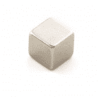
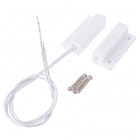
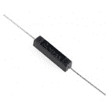
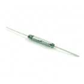
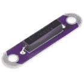
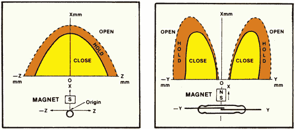
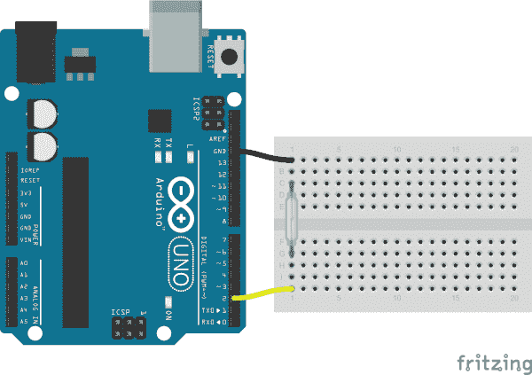

# 簧片开关连接指南

> 原文：<https://learn.sparkfun.com/tutorials/reed-switch-hookup-guide>

## 介绍

簧片开关是磁性驱动的电气开关(不是魔法驱动的，尽管有时看起来是这样)。当开关的主体暴露在磁场中时——就像磁铁或者甚至是强大的电流——内部的两种含铁材料被拉在一起，连接闭合，电流可以流动。在没有磁场的情况下，开关打开，它所在的电路也打开。

[](https://www.sparkfun.com/products/8642) 

将**添加到您的[购物车](https://www.sparkfun.com/cart)中！**

 **### [簧片开关](https://www.sparkfun.com/products/8642)

[In stock](https://learn.sparkfun.com/static/bubbles/ "in stock") COM-08642

这是一个叫做[簧片开关]的小装置(http://en . Wikipedia . org/wiki/Reed _ switch)。当设备暴露在磁场中时…

$2.102[Favorited Favorite](# "Add to favorites") 23[Wish List](# "Add to wish list")** **簧片开关有各种创造性的应用。它们非常适合任何需要**非接触**控制的项目。例如，[磁力门开关](https://www.sparkfun.com/products/13247)，只是一个修饰过的簧片开关和一个配套的磁铁——通过保持开关的两个部分分开，门可以自由地打开和关闭(并保持其作为门的正常功能)。我们的气象计中的[风速计结合了许多簧片开关，它们随着风的吹动依次打开和关闭；计算开关闭合之间的时间，以确定风速。](https://www.sparkfun.com/products/8942)

### 建议的材料

本教程作为簧片开关的快速入门，演示了如何连接和使用它们。除了开关本身，建议使用以下材料:

磁铁——你需要一些东西来启动簧片开关，这个小磁铁应该符合要求。

**[Arduino Uno](https://www.sparkfun.com/products/11021)** -我们将使用 Arduino 上的数字引脚来读取开关的状态。任何兼容 Arduino 的开发平台——无论是 [RedBoard](https://www.sparkfun.com/products/12757) 、 [Pro](https://www.sparkfun.com/products/10914) 还是[Pro Mini](https://www.sparkfun.com/products/11113)——都可以替代。

**[试验板](https://www.sparkfun.com/products/12002)** 和 **[跳线](https://www.sparkfun.com/products/11026)** -随着其腿适当弯曲，簧片开关是试验板兼容的。我们将使用试验板作为簧片开关和跳线之间的媒介，跳线将开关连接到 Arduino。

[](https://www.sparkfun.com/products/12002) 

将**添加到您的[购物车](https://www.sparkfun.com/cart)中！**

 **### [【试验板-不干胶(白色)](https://www.sparkfun.com/products/12002)

[In stock](https://learn.sparkfun.com/static/bubbles/ "in stock") PRT-12002

这是你的尝试和真正的白色无焊试验板。它有 2 条电源总线，10 列，30 行，总共 400 个连接…

$5.5048[Favorited Favorite](# "Add to favorites") 93[Wish List](# "Add to wish list")****[](https://www.sparkfun.com/products/11026) 

将**添加到您的[购物车](https://www.sparkfun.com/cart)中！**

 **### [跳线标准 7" M/M - 30 AWG (30 个装)](https://www.sparkfun.com/products/11026)

[In stock](https://learn.sparkfun.com/static/bubbles/ "in stock") PRT-11026

如果你需要快速完成一个原型，没有什么比一堆跳线更能加快速度的了，让我们来看看

$2.4520[Favorited Favorite](# "Add to favorites") 43[Wish List](# "Add to wish list")****[](https://www.sparkfun.com/products/8643) 

将**添加到您的[购物车](https://www.sparkfun.com/cart)中！**

 **### [【0.25”](https://www.sparkfun.com/products/8643)磁铁方形

[In stock](https://learn.sparkfun.com/static/bubbles/ "in stock") COM-08643

这些是小型稀土磁铁——0.25 立方。这些磁铁由钕/铁/硼(NdFeB)组成，异常坚固…

$1.602[Favorited Favorite](# "Add to favorites") 17[Wish List](# "Add to wish list")****[](https://www.sparkfun.com/products/retired/12757) 

### [spark fun red board——用 Arduino 编程 T3](https://www.sparkfun.com/products/retired/12757)

[Retired](https://learn.sparkfun.com/static/bubbles/ "Retired") DEV-12757

在 SparkFun，我们使用许多 Arduinos，我们一直在寻找最简单、最稳定的一款。每块板都有点不同…

127 **Retired**[Favorited Favorite](# "Add to favorites") 78[Wish List](# "Add to wish list")****** ******### 推荐阅读

对于初学者来说，读取开关是一个有趣且易于使用的组件，但仍有一些基本的电子概念您应该熟悉。如果这些教程的标题对你来说听起来很陌生，考虑先浏览一下这些内容。

[](https://learn.sparkfun.com/tutorials/pull-up-resistors) [### 上拉电阻](https://learn.sparkfun.com/tutorials/pull-up-resistors) A quick introduction to pull-up resistors - whey they're important, and how/when to use them.[Favorited Favorite](# "Add to favorites") 65[](https://learn.sparkfun.com/tutorials/how-to-use-a-breadboard) [### 如何使用试验板](https://learn.sparkfun.com/tutorials/how-to-use-a-breadboard) Welcome to the wonderful world of breadboards. Here we will learn what a breadboard is and how to use one to build your very first circuit.[Favorited Favorite](# "Add to favorites") 79[](https://learn.sparkfun.com/tutorials/what-is-an-arduino) [### 什么是 Arduino？](https://learn.sparkfun.com/tutorials/what-is-an-arduino) What is this 'Arduino' thing anyway? This tutorials dives into what an Arduino is and along with Arduino projects and widgets.[Favorited Favorite](# "Add to favorites") 50[](https://learn.sparkfun.com/tutorials/button-and-switch-basics) [### 按钮和开关基础知识](https://learn.sparkfun.com/tutorials/button-and-switch-basics) A tutorial on electronics' most overlooked and underappreciated component: the switch! Here we explain the difference between momentary and maintained switches and what all those acronyms (NO, NC, SPDT, SPST, ...) stand for.[Favorited Favorite](# "Add to favorites") 53

## 簧片开关概述

簧片开关有各种形状和尺寸。通孔、表面贴装、绝缘、预成型——有很多因素需要考虑。

[](https://www.sparkfun.com/products/13247) 

将**添加到您的[购物车](https://www.sparkfun.com/cart)中！**

 **### [磁力门开关组](https://www.sparkfun.com/products/13247)

[In stock](https://learn.sparkfun.com/static/bubbles/ "in stock") COM-13247

这是磁性门开关组，一个小的簧片开关组件，专门设计来提醒你当门，抽屉，或…

$3.95[Favorited Favorite](# "Add to favorites") 72[Wish List](# "Add to wish list")****[](https://www.sparkfun.com/products/10601) 

将**添加到您的[购物车](https://www.sparkfun.com/cart)中！**

 **### [](https://www.sparkfun.com/products/10601)干簧管绝缘

[In stock](https://learn.sparkfun.com/static/bubbles/ "in stock") COM-10601

这是一个叫做[簧片开关]的小装置(http://en . Wikipedia . org/wiki/Reed _ switch)。当设备暴露在磁场中时…

$2.10[Favorited Favorite](# "Add to favorites") 21[Wish List](# "Add to wish list")****[](https://www.sparkfun.com/products/8642) 

将**添加到您的[购物车](https://www.sparkfun.com/cart)中！**

 **### [簧片开关](https://www.sparkfun.com/products/8642)

[In stock](https://learn.sparkfun.com/static/bubbles/ "in stock") COM-08642

这是一个叫做[簧片开关]的小装置(http://en . Wikipedia . org/wiki/Reed _ switch)。当设备暴露在磁场中时…

$2.102[Favorited Favorite](# "Add to favorites") 23[Wish List](# "Add to wish list")****[](https://www.sparkfun.com/products/13343) 

将**添加到您的[购物车](https://www.sparkfun.com/cart)中！**

 **### [LilyPad 簧片开关](https://www.sparkfun.com/products/13343)

[18 available](https://learn.sparkfun.com/static/bubbles/ "18 available") DEV-13343

LilyPad 簧片开关是簧片开关的一个简单突破，它将使它在电子纺织品电路中的使用变得非常简单

$4.501[Favorited Favorite](# "Add to favorites") 22[Wish List](# "Add to wish list")******** ********基本的玻璃簧片开关相对脆弱。如果你的项目需要大型磁铁反复撞击开关主体，考虑升级到[包覆成型的变体](https://www.sparkfun.com/products/10601)。

你可能还需要考虑你的簧片开关的**电流和**电压能力——它们通常不被设计成承载高功率。我们在本教程中使用的玻璃开关的额定最大**为 1.2A 和 10W** 。更大功率的开关很难找到，而且可能很贵。

### 常开，常闭？

所有这些开关的一个共同点是双端接口。但是那些终端是常开还是常闭又是另一个问题。我们将在本例中使用的簧片开关是**常开**。这意味着“正常情况下”，当开关不受磁场影响时，开关断开，不导电。当磁铁足够靠近开关时，触点闭合，电流可以流动。

Looking for a **normally-closed** switch? You can make one by adding a second magnet. [Check it out](https://standexelectronics.com/resources/magnet-interaction/form-b-reed-switch-actuation-parallel-position-perpendicular-movement/)!

### 磁性传感器激活

正如你的磁铁可能有两极，簧片开关的一对铁触点也是极化的。磁铁的位置、距离和方向都在决定开关如何启动时发挥作用。

这些来自 [Hamlin 应用笔记 AN104](http://www.hamlin.com/specSheets/AN104.pdf) 的示例图很好地展示了磁铁的位置如何影响开关的激活。

[](https://cdn.sparkfun.com/assets/learn_tutorials/5/1/9/reed-activation-graph.png)

左图显示了当磁铁与簧片开关保持平行时的预期激活区域。正如所料，这个区域主要是一个抛物线区域。右图展示了磁铁垂直于开关时的情况。在这个方向，通常在开关的中心有一个死区。如果它在身体的中间，它可能不会激活，即使磁铁接触到簧片开关。

磁铁的极性和位置对簧片开关的启动起着重要的作用。如果你的开关没有你想要的那么灵敏，**试着把磁铁放在一边或另一边**。确保在将任一组件安装到位之前，对其进行测试。

## 示例电路

本例的电路设置非常简单。首先**弯曲开关的两条腿**,使其垂直指向远离开关主体的方向，从而形成一个“U”形。

**Fragile!** The body of the glass-tubed reed switch is very delicate. While you're bending the legs, try not to place any stress on the body of the switch.

将簧片开关插入试验板。然后使用跳线将开关的一端接地，另一端连接到 Arduino 的 D2 引脚。这是一个电路示例:

[](https://cdn.sparkfun.com/assets/learn_tutorials/5/1/9/example_circuit_bb-2.png)

这就够了！我们将使用 Arduino 引脚 2 上的**内部上拉电阻**将开关偏置为高电平。当开关闭合时，它会将引脚 2 直接接地，读数应该为低。

## 示例代码

这是一个基于上述电路的简单 Arduino 示例。复制并粘贴到你的 Arduino IDE，然后上传！

**注意:**此示例假设您在桌面上使用的是最新版本的 Arduino IDE。如果这是你第一次使用 Arduino，请回顾我们关于[安装 Arduino IDE 的教程。](https://learn.sparkfun.com/tutorials/installing-arduino-ide)

If you have not previously installed an Arduino library, please check out our [installation guide.](https://learn.sparkfun.com/tutorials/installing-an-arduino-library)

```
language:c
/******************************************************************************
Reed_Switch_Example.ino
Example sketch for SparkFun's Reed Switch
  (https://www.sparkfun.com/products/8642)
Jim Lindblom @ SparkFun Electronics
May 3, 2016

The reed switch is a two-terminal, magnetically-actuated, normally-open switch.
Connect one end of the switch to ground, and the other to Arduino's D2 pin.

The D2 pin's internal pull-up resistor is used to bias the pin high. When the
switch closes, the pin should go low.

Development environment specifics:
Arduino 1.6.7
******************************************************************************/
const int REED_PIN = 2; // Pin connected to reed switch
const int LED_PIN = 13; // LED pin - active-high

void setup() 
{
  Serial.begin(9600);
  // Since the other end of the reed switch is connected to ground, we need
  // to pull-up the reed switch pin internally.
  pinMode(REED_PIN, INPUT_PULLUP);
  pinMode(LED_PIN, OUTPUT);
}

void loop() 
{
  int proximity = digitalRead(REED_PIN); // Read the state of the switch
  if (proximity == LOW) // If the pin reads low, the switch is closed.
  {
    Serial.println("Switch closed");
    digitalWrite(LED_PIN, HIGH); // Turn the LED on
  }
  else
  {
    digitalWrite(LED_PIN, LOW); // Turn the LED off
  }
} 
```

该草图依赖于附在 Arduino 的引脚 13 上的 LED。市面上 99%的 Arduino 板都应该是这种情况，但是，如果你的不同，你可能需要检查[串行监视器](https://learn.sparkfun.com/tutorials/terminal-basics/arduino-serial-monitor-windows-mac-linux)来验证开关的操作。

上传草图后，拿起你的磁铁，靠近开关。当磁铁接近簧片开关本体 1 厘米时，它就会触发。试着画出簧片开关的整个激活区域。看你能把磁铁拿到多远！

## 资源和更进一步

簧片开关是非接触激活应用的完美技巧。我们使用簧片开关来检测这个以 TARDIS 为主题的音乐盒的门何时打开。或者你可以将一个大型的门专用簧片开关挂在 [Blynk 板](https://www.sparkfun.com/products/13794)上，让它在门的状态改变时向你的手机发送[推送通知](https://learn.sparkfun.com/tutorials/blynk-board-project-guide/project-13-push-door-push-phone)。

现在你已经把一个簧片开关连接到你的 Arduino 上了，你打算做什么呢？需要一些灵感，看看这些相关的 SparkFun 教程:

[](https://learn.sparkfun.com/tutorials/mp3-player-shield-music-box) [### MP3 播放器屏蔽音乐盒](https://learn.sparkfun.com/tutorials/mp3-player-shield-music-box) Music Box Project based on the Dr. Who TARDIS.[Favorited Favorite](# "Add to favorites") 8[](https://learn.sparkfun.com/tutorials/myst-linking-book) [### MYST 连接书](https://learn.sparkfun.com/tutorials/myst-linking-book) Create your own Linking Book from the classic computer game, MYST[Favorited Favorite](# "Add to favorites") 3[](https://learn.sparkfun.com/tutorials/lilypad-reed-switch-hookup-guide) [### LilyPad 簧片开关连接指南](https://learn.sparkfun.com/tutorials/lilypad-reed-switch-hookup-guide) A guide to using the LilyPad Reed Switch breakout in your projects.[Favorited Favorite](# "Add to favorites") 2[](https://learn.sparkfun.com/tutorials/blynk-board-project-guide) [### Blynk 板项目指南](https://learn.sparkfun.com/tutorials/blynk-board-project-guide) A series of Blynk projects you can set up on the Blynk Board without ever re-programming it.[Favorited Favorite](# "Add to favorites") 18****************