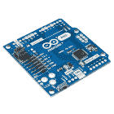
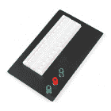
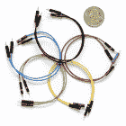
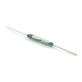
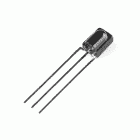
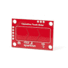
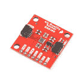

# 传感器套件资源中心

> 原文：<https://learn.sparkfun.com/tutorials/sensor-kit-resource-hub>

## 介绍

SparkFun 传感器套件是我们最喜欢的传感器的集合。这个工具包的内容让你能够感觉触摸，振动，弯曲，运动，天气模式，磁性...几乎所有人类已知的物理量。将它们组合在一起，创建一个三录仪，或者将它们分成许多独特的项目！

 

将**添加到您的[购物车](https://www.sparkfun.com/cart)中！**

 **### [SparkFun 传感器套件](https://www.sparkfun.com/products/21286)

[In stock](https://learn.sparkfun.com/static/bubbles/ "in stock") KIT-21286

有了这个传感器套件中包含的一切，您将能够感应手势，湿度，温度，运动，触摸，声音，所有…

$149.95[Favorited Favorite](# "Add to favorites") 1[Wish List](# "Add to wish list")** **本指南是所有传感器套件的中心。它介绍了使用传感器所需的基本技能和工具，并为您指出连接传感器的正确方向。它会让你立刻感受到所有的事情！

## 鼓励群众演员

传感器套件包括各种各样的传感器和这些设备的一些支持组件，但它不包括连接它们所需的一切。这里有一些额外的工具和组件，您可能需要开始使用。

### 原型钻头

该套件中大约一半的传感器立即与试验板兼容，随时可以插入并连接到开发板。以下是您开始使用这些组件所需的内容。

**[red board Qwiic](https://www.sparkfun.com/products/15123)**——套件中的每个传感器都由**连接教程**支持，其中包括一个 Arduino 电路示例，以及专门为流行的开发平台编写的代码。可靠的 RedBoard Qwiic 可以与该套件中的任何传感器接口。请确保为您的主板准备好相关的 USB 电缆。

 

将**添加到您的[购物车](https://www.sparkfun.com/cart)中！**

 **### [spark fun RedBoard Qwiic](https://www.sparkfun.com/products/15123)

[In stock](https://learn.sparkfun.com/static/bubbles/ "in stock") DEV-15123

SparkFun RedBoard Qwiic 是一款 Arduino 兼容开发板，内置 Qwiic 连接器，无需…

$21.5014[Favorited Favorite](# "Add to favorites") 49[Wish List](# "Add to wish list")**** 

将**添加到您的[购物车](https://www.sparkfun.com/cart)中！**

 **### [USB micro-B 线- 6 脚](https://www.sparkfun.com/products/10215)

[In stock](https://learn.sparkfun.com/static/bubbles/ "in stock") CAB-10215

USB 2.0 型到微型 USB 5 针。这是一种新的、更小的 USB 设备连接器。微型 USB 连接器大约是…

$5.5014[Favorited Favorite](# "Add to favorites") 21[Wish List](# "Add to wish list")**** ****或者，任何兼容 Arduino 的开发平台——无论是 Arduino Uno T1、T2 Pro T3 还是 T4 Pro Mini T5——都应该能够替代。如果您决定利用 Qwiic 连接器，您只需 [Qwiic 适配器](https://www.sparkfun.com/products/14425)或[屏蔽罩](https://www.sparkfun.com/products/14352)连接电路板，即可轻松将 Qwiic 传感器连接到 Arduino 电路板。同样，请确保为您的主板准备好相关的 USB 电缆。

 

将**添加到您的[购物车](https://www.sparkfun.com/cart)中！**

 **### [Arduino Pro Mini 328-5V/16 MHz](https://www.sparkfun.com/products/11113)

[In stock](https://learn.sparkfun.com/static/bubbles/ "in stock") DEV-11113

SparkFun 对 Arduino 的极简设计方法。这是一个 5V Arduino 运行 16MHz 引导加载程序。

$10.95137[Favorited Favorite](# "Add to favorites") 166[Wish List](# "Add to wish list")**** 

将**添加到您的[购物车](https://www.sparkfun.com/cart)中！**

 **### [Arduino Uno - R3](https://www.sparkfun.com/products/11021)

[In stock](https://learn.sparkfun.com/static/bubbles/ "in stock") DEV-11021

这是新的 Arduino Uno R3。除了以前主板的所有功能外，Uno 现在使用 ATmega16U2 代替…

$27.95138[Favorited Favorite](# "Add to favorites") 162[Wish List](# "Add to wish list")**** 

将**添加到您的[购物车](https://www.sparkfun.com/cart)中！**

 **### [Qwiic 电缆-试验板跳线(4 针)](https://www.sparkfun.com/products/14425)

[In stock](https://learn.sparkfun.com/static/bubbles/ "in stock") PRT-14425

这是一根跳线适配器电缆，一端带有一个 Qwiic JST 母接头，另一端带有一个试验板连接…

$1.50[Favorited Favorite](# "Add to favorites") 34[Wish List](# "Add to wish list")**** 

将**添加到您的[购物车](https://www.sparkfun.com/cart)中！**

 **### [Arduino Pro 328-3.3V/8 MHz](https://www.sparkfun.com/products/10914)

[In stock](https://learn.sparkfun.com/static/bubbles/ "in stock") DEV-10914

是蓝色的！太瘦了！是 Arduino Pro！SparkFun 对 Arduino 的极简设计方法。这是一个 3.3V Arduino 运行测试…

$18.501[Favorited Favorite](# "Add to favorites") 16[Wish List](# "Add to wish list")******** ********-这些是套件中每个传感器的每个示例电路中反复出现的播放器。试验板包含您的传感器、电阻和其他元件，甚至为您做一些布线工作。

 

将**添加到您的[购物车](https://www.sparkfun.com/cart)中！**

 **### [【试验板-不干胶(白色)](https://www.sparkfun.com/products/12002)

[In stock](https://learn.sparkfun.com/static/bubbles/ "in stock") PRT-12002

这是你的尝试和真正的白色无焊试验板。它有 2 条电源总线，10 列，30 行，总共 400 个连接…

$5.5048[Favorited Favorite](# "Add to favorites") 93[Wish List](# "Add to wish list")**** 

将**添加到您的[购物车](https://www.sparkfun.com/cart)中！**

 **### 

[In stock](https://learn.sparkfun.com/static/bubbles/ "in stock") PRT-12614

**描述* *:这是一块巨大的无焊试验板！它有 7 条电源总线，40 列，63 行，总共有 322 条…

$21.5026[Favorited Favorite](# "Add to favorites") 60[Wish List](# "Add to wish list")**** 

将**添加到您的[购物车](https://www.sparkfun.com/cart)中！**

 **### [试验板——经典](https://www.sparkfun.com/products/112)

[In stock](https://learn.sparkfun.com/static/bubbles/ "in stock") PRT-00112

你第一次接触电气工程-面包板。谁知道会带来这么大的挫败感？这是你的…

$10.9517[Favorited Favorite](# "Add to favorites") 28[Wish List](# "Add to wish list")**** 

将**添加到您的[购物车](https://www.sparkfun.com/cart)中！**

 **### [【试验板-迷你模块化(绿色)](https://www.sparkfun.com/products/12046)

[In stock](https://learn.sparkfun.com/static/bubbles/ "in stock") PRT-12046

这个绿色迷你试验板是你的小项目原型的好方法！有了 170 个并列点，就有足够的空间…

$4.502[Favorited Favorite](# "Add to favorites") 11[Wish List](# "Add to wish list")******** **********[跳线](https://www.sparkfun.com/products/11026)**——和试验板一样，跳线是每个示例电路的一部分。这些跳线充当试验板和 Arduino 之间的媒介。

 

将**添加到您的[购物车](https://www.sparkfun.com/cart)中！**

 **### [跳线套件- 140pcs](https://www.sparkfun.com/products/124)

[In stock](https://learn.sparkfun.com/static/bubbles/ "in stock") PRT-00124

这是一个节省时间的 140 跳线套件-切割，剥离，预弯曲为您的原型乐趣。

$6.509[Favorited Favorite](# "Add to favorites") 58[Wish List](# "Add to wish list")**** 

将**添加到您的[购物车](https://www.sparkfun.com/cart)中！**

 **### [大型跳线套件- 700pcs](https://www.sparkfun.com/products/14671)

[In stock](https://learn.sparkfun.com/static/bubbles/ "in stock") PRT-14671

这是一个节省时间的 700 跳线大套件-切割，剥离，并为您的原型乐趣预弯曲。

$26.952[Favorited Favorite](# "Add to favorites") 30[Wish List](# "Add to wish list")**** 

将**添加到您的[购物车](https://www.sparkfun.com/cart)中！**

 **### [跳线高级 6 "米/米装 10 根](https://www.sparkfun.com/products/8431)

[In stock](https://learn.sparkfun.com/static/bubbles/ "in stock") PRT-08431

这是一个 SparkFun 独家！这些是 155 毫米长、26 AWG 跳线，两端都有公接头。用这些来跳离…

$4.502[Favorited Favorite](# "Add to favorites") 11[Wish List](# "Add to wish list")**** 

将**添加到您的[购物车](https://www.sparkfun.com/cart)中！**

 **### [跳线标准 7" M/M - 30 AWG (30 个装)](https://www.sparkfun.com/products/11026)

[In stock](https://learn.sparkfun.com/static/bubbles/ "in stock") PRT-11026

如果你需要快速完成一个原型，没有什么比一堆跳线更能加快速度的了，让我们来看看

$2.4520[Favorited Favorite](# "Add to favorites") 43[Wish List](# "Add to wish list")******** ********### 焊接工具

一旦您超越了该套件中的一些简单组件，如光电池和柔性传感器，您将进入分线板。分线板，如[声音检测器](https://www.sparkfun.com/products/12642) ad [RGB 和手势传感器(APDS-9960)](https://www.sparkfun.com/products/12787) 在装运时没有接口连接器，这意味着在将它们连接到开发板之前，您需要拿出焊接工具。

烙铁显然是焊接工具的首选。即使是最基本的[烙铁](https://www.sparkfun.com/products/9507)也足以让你过得去，或者投资你的未来摆弄一个 [Hakko](https://www.sparkfun.com/products/11704) 。

 

将**添加到您的[购物车](https://www.sparkfun.com/cart)中！**

 **### [威勒 WE1010 焊台](https://www.sparkfun.com/products/14734)

[Only 1 left!](https://learn.sparkfun.com/static/bubbles/ "only 1 left!") TOL-14734

韦勒的 WE1010 是一个强大的 70 瓦焊接站，是热情的爱好者，DIY 者和任何人的完美选择。

$138.504[Favorited Favorite](# "Add to favorites") 26[Wish List](# "Add to wish list")**** 

将**添加到您的[购物车](https://www.sparkfun.com/cart)中！**

 **### [烙铁- 30W(美国，110V)](https://www.sparkfun.com/products/9507)

[33 available](https://learn.sparkfun.com/static/bubbles/ "33 available") TOL-09507

这是一个非常简单的固定温度，快速加热，30W 110/120 VAC 烙铁。我们真的很喜欢使用更贵的 iro…

$10.957[Favorited Favorite](# "Add to favorites") 21[Wish List](# "Add to wish list")**** 

### [【烙铁- 30W (EU，230VAC)](https://www.sparkfun.com/products/retired/11650)

[Retired](https://learn.sparkfun.com/static/bubbles/ "Retired") TOL-11650

这是一个非常简单的固定温度，快速加热，30W 230VAC 烙铁。我们真的很喜欢用更贵的熨斗，b…

1 **Retired**[Favorited Favorite](# "Add to favorites") 9[Wish List](# "Add to wish list") 

### [Hakko FX-901 无绳烙铁](https://www.sparkfun.com/products/retired/13151)

[Retired](https://learn.sparkfun.com/static/bubbles/ "Retired") TOL-13151

Hakko FX-901 是一款无线烙铁，既便携又实用，为您提供了一种方便的方法…

27 **Retired**[Favorited Favorite](# "Add to favorites") 53[Wish List](# "Add to wish list")**** ******焊料** -大型、小型、有铅、无铅...挑选焊料时，有几个选项需要考虑。含铅焊料更容易使用，并产生更亮的接头，但也有一定的污点。

 

将**添加到您的[购物车](https://www.sparkfun.com/cart)中！**

 **### [Solder-1/4 磅短管(0.020”)特殊混合](https://www.sparkfun.com/products/10242)

[In stock](https://learn.sparkfun.com/static/bubbles/ "in stock") TOL-10242

我们不想炒作这种焊料太多，但这可能是世界上最好的焊料。好了，我们已经说过了。这…

$32.5014[Favorited Favorite](# "Add to favorites") 17[Wish List](# "Add to wish list")**** 

将**添加到您的[购物车](https://www.sparkfun.com/cart)中！**

 **### [无铅焊料- 100 克线轴](https://www.sparkfun.com/products/9325)

[In stock](https://learn.sparkfun.com/static/bubbles/ "in stock") TOL-09325

这是带有水溶性树脂芯的无铅焊料的基本线轴。0.031 英寸规格，100 克。这是一个好主意…

$9.957[Favorited Favorite](# "Add to favorites") 33[Wish List](# "Add to wish list")**** 

将**添加到您的[购物车](https://www.sparkfun.com/cart)中！**

 **### [无铅焊料- 15 克管](https://www.sparkfun.com/products/9163)

[In stock](https://learn.sparkfun.com/static/bubbles/ "in stock") TOL-09163

这是你的无铅焊料的基本管，带有不干净的水溶性树脂芯。0.031 英寸规格，15 克

$3.954[Favorited Favorite](# "Add to favorites") 14[Wish List](# "Add to wish list")**** 

将**添加到您的[购物车](https://www.sparkfun.com/cart)中！**

 **### [焊锡含铅 100 克线轴](https://www.sparkfun.com/products/9161)

[In stock](https://learn.sparkfun.com/static/bubbles/ "in stock") TOL-09161

这是你的含铅焊料的基本线轴，带有 63/37 水溶性树脂芯。0.031 英寸规格，100 克。这是一个很好的例子…

$6.503[Favorited Favorite](# "Add to favorites") 25[Wish List](# "Add to wish list")******** **********接头**或**电线** -你需要将*之类的东西*焊接到分线板上。那个东西是[公接头](https://www.sparkfun.com/products/116)、[母接头](https://www.sparkfun.com/products/115)、[绞线](https://www.sparkfun.com/products/11375)、[实芯线](https://www.sparkfun.com/products/11367)还是[别的什么](https://www.sparkfun.com/categories/91)完全由你决定。

 

将**添加到您的[购物车](https://www.sparkfun.com/cart)中！**

 **### 

[In stock](https://learn.sparkfun.com/static/bubbles/ "in stock") PRT-11367

各种颜色的电线:你知道这是一个美丽的东西。六种不同颜色的硬纸板实芯焊丝…

$21.5037[Favorited Favorite](# "Add to favorites") 86[Wish List](# "Add to wish list")**** 

将**添加到您的[购物车](https://www.sparkfun.com/cart)中！**

 **### [破开头球——直击](https://www.sparkfun.com/products/116)

[In stock](https://learn.sparkfun.com/static/bubbles/ "in stock") PRT-00116

一排标题-打破适应。40 个引脚，可切割成任何尺寸。用于定制 PCB 或通用定制接头。

$1.7520[Favorited Favorite](# "Add to favorites") 133[Wish List](# "Add to wish list")**** 

将**添加到您的[购物车](https://www.sparkfun.com/cart)中！**

 **### 

[In stock](https://learn.sparkfun.com/static/bubbles/ "in stock") PRT-11375

各种颜色的电线:你知道这是一个美丽的东西。六种不同颜色的绞线装在一个纸板盒里…

$22.5019[Favorited Favorite](# "Add to favorites") 46[Wish List](# "Add to wish list")**** 

将**添加到您的[购物车](https://www.sparkfun.com/cart)中！**

 **### [女标题](https://www.sparkfun.com/products/115)

[In stock](https://learn.sparkfun.com/static/bubbles/ "in stock") PRT-00115

单排 40 孔，内螺纹接头。可以用一把钢丝钳切割成合适的尺寸。标准 0.1 英寸间距。我们广泛使用它们…

$1.758[Favorited Favorite](# "Add to favorites") 71[Wish List](# "Add to wish list")******** ********## 建议的技能

传感器套件的传感器对于电子初学者来说是一个很好的切入点，但它们确实建立在一些假设的知识上。这里有几个电气工程专用教程，您可能想在深入研究传感器之前先看看。

 [### 什么是电路？](https://learn.sparkfun.com/tutorials/what-is-a-circuit) Every electrical project starts with a circuit. Don't know what a circuit is? We're here to help.[Favorited Favorite](# "Add to favorites") 82 [### 电压、电流、电阻和欧姆定律](https://learn.sparkfun.com/tutorials/voltage-current-resistance-and-ohms-law) Learn about Ohm's Law, one of the most fundamental equations in all electrical engineering.[Favorited Favorite](# "Add to favorites") 132 [### 什么是电？](https://learn.sparkfun.com/tutorials/what-is-electricity) We can see electricity in action on our computers, lighting our houses, as lightning strikes in thunderstorms, but what is it? This is not an easy question, but this tutorial will shed some light on it 83 [### 串联和并联电路](https://learn.sparkfun.com/tutorials/series-and-parallel-circuits) An introduction into series and parallel circuits.[Favorited Favorite](# "Add to favorites") 58

在这些教程中，我们将非常依赖 Arduino。不熟悉 Arduino 场景？我们为你准备了很多阅读材料！

 [### 安装 Arduino 库](https://learn.sparkfun.com/tutorials/installing-an-arduino-library) How do I install a custom Arduino library? It's easy! This tutorial will go over how to install an Arduino library using the Arduino Library Manager. For libraries not linked with the Arduino IDE, we will also go over manually installing an Arduino library.[Favorited Favorite](# "Add to favorites") 22 [### 如何使用试验板](https://learn.sparkfun.com/tutorials/how-to-use-a-breadboard) Welcome to the wonderful world of breadboards. Here we will learn what a breadboard is and how to use one to build your very first circuit.[Favorited Favorite](# "Add to favorites") 79 [### 什么是 Arduino？](https://learn.sparkfun.com/tutorials/what-is-an-arduino) What is this 'Arduino' thing anyway? This tutorials dives into what an Arduino is and along with Arduino projects and widgets.[Favorited Favorite](# "Add to favorites") 50 [### 安装 Arduino IDE](https://learn.sparkfun.com/tutorials/installing-arduino-ide) A step-by-step guide to installing and testing the Arduino software on Windows, Mac, and Linux.[Favorited Favorite](# "Add to favorites") 16

如果你不熟悉 Qwiic 系统，我们推荐你在这里阅读[以获得一个概述](https://www.sparkfun.com/qwiic)。最新的套件提供了一些支持 Qwiic 的传感器。

|  |
| *[Qwiic 连接系统](https://www.sparkfun.com/qwiic)* |

最后一个大问题:如果你从来没有焊接过，不要担心-这是一个开始的好机会！查看我们的[如何焊接通孔焊接指南](https://learn.sparkfun.com/tutorials/how-to-solder-through-hole-soldering)以获得提示、技巧和教程。

 [### 如何焊接:通孔焊接

#### 2013 年 9 月 19 日](https://learn.sparkfun.com/tutorials/how-to-solder-through-hole-soldering) This tutorial covers everything you need to know about through-hole soldering.[Favorited Favorite](# "Add to favorites") 70

## 资源枯竭

本节简要概述传感器套件中包含的每个传感器——描述传感器感测的内容、如何传递数据以及需要哪种电源。还提供了到**单独教程**的链接。当你准备好连接一个传感器并做一些感测时，请查看该设备的教程。

所有这些传感器都可以分为两类[模拟或数字](https://learn.sparkfun.com/tutorials/analog-vs-digital)。模拟传感器通常更容易设置和使用，但数字传感器可能更强大、更精确。如果您刚刚开始接触电子学，可以考虑先探索一些模拟传感器。

## 模拟传感器

Most of these analog sensors are either variable resistors or potentiometers. The data they sense is usually translated to a variable voltage, which is read by a microcontroller’s [analog-to-digital converter (ADC)](https://learn.sparkfun.com/tutorials/analog-to-digital-conversion) and compared against other measurements.

### 力敏电阻器

 

将**添加到您的[购物车](https://www.sparkfun.com/cart)中！**

 **### [力敏电阻 0.5”](https://www.sparkfun.com/products/9375)

[In stock](https://learn.sparkfun.com/static/bubbles/ "in stock") SEN-09375

这是一个力敏电阻器，具有 0.5 英寸直径的圆形感应区域。

$7.5019[Favorited Favorite](# "Add to favorites") 86[Wish List](# "Add to wish list")****A force-sensitive resistor (FSR) is a variable resistor that increases or decreases depending on how hard something is pressing down on it. When no pressure is being applied to the FSR its resistance will be larger than 1MΩ.

你越用力按压传感器的圆形头部，两个端子之间的电阻下降得越低。这种 FSR 可以感知 0.1 千克到 10 千克范围内的任何地方施加的力。

通过用 FSR 和另一个电阻创建一个[分压器](https://learn.sparkfun.com/tutorials/voltage-dividers)，你可以创建一个可变电压输出，它可以被微控制器的 ADC 输入读取。

这些传感器设置简单，非常适合感测压力，但它们不是非常精确。它们对于感知某物的存在是有用的，但是在测量某物的重量时就不那么有用了。

(注意:力敏电阻无法检测到 [Midichlorians](https://www.youtube.com/watch?v=FoVpSPXGCvc) 的存在。)

[力敏电阻连接指南](https://learn.sparkfun.com/tutorials/force-sensitive-resistor-hookup-guide)检查了 FSR 的基本特性，并演示了如何将它们连接到 Arduino，以便您可以开始测量压力。

[Use the Force (on an FSR)!](https://learn.sparkfun.com/tutorials/force-sensitive-resistor-hookup-guide)

* * *

### 柔性传感器

 

将**添加到您的[购物车](https://www.sparkfun.com/cart)中！**

 **### [柔性传感器 2.2"](https://www.sparkfun.com/products/10264)

[Out of stock](https://learn.sparkfun.com/static/bubbles/ "out of stock") SEN-10264

长度为 2.2 英寸的简单柔性传感器。随着传感器弯曲，传感器两端的电阻增加。专利技术…

$11.9515[Favorited Favorite](# "Add to favorites") 70[Wish List](# "Add to wish list")****This flex sensor is a variable resistor like no other. The resistance of the flex sensor increases as the body of the component bends. Sensors like these were used in the [Nintendo Power Glove](http://en.wikipedia.org/wiki/Power_Glove).

如果保持平坦，传感器看起来会像一个 30kΩ电阻。当它弯曲时，电阻会增加到 90°角时的 70kΩ。

与另一个电阻结合形成一个[分压器](https://learn.sparkfun.com/tutorials/voltage-dividers)，flex 传感器可以产生一个可变的模拟电压，由微控制器的 ADC 引脚读取。

查阅[弯曲传感器连接指南](https://learn.sparkfun.com/tutorials/flex-sensor-hookup-guide)以获得将弯曲传感器连接到 Arduino 的帮助。

[Get Your Flex On!](https://learn.sparkfun.com/tutorials/flex-sensor-hookup-guide)

* * *

### 微型光电池

 

将**添加到您的[购物车](https://www.sparkfun.com/cart)中！**

 **### [微型光电池](https://www.sparkfun.com/products/9088)

[In stock](https://learn.sparkfun.com/static/bubbles/ "in stock") SEN-09088

这是一个非常小的光传感器。光电池会改变(也称为光电探测器)

$1.607[Favorited Favorite](# "Add to favorites") 67[Wish List](# "Add to wish list")****Photocell's are light-sensitive, variable resistors. As more light shines of the sensor's head, the resistance between the photocell's terminals decreases.

在漆黑的条件下，光电池的电阻为兆欧(1.0mω+)。让传感器上的 LED 发光可以将电阻降低到接近于零。在正常照明条件下，光电池的电阻通常在 8k-20kω之间。

与其他电阻式传感器一样，要将光电池与 ADC 配合使用，通常需要与一个静态电阻配对，形成一个分压器。

光敏电阻不会给你令人难以置信的精确勒克司读数(这就是像 [TSL2561](https://www.sparkfun.com/products/12055) 这样的传感器的作用)，但它们至少可以很好地识别环境光的大致状态。

[光电池连接指南](https://learn.sparkfun.com/tutorials/photocell-hookup-guide)提供了光电池电阻特性的快速概述，以及电路和代码示例。

[See the Light With a Photocell](https://learn.sparkfun.com/tutorials/photocell-hookup-guide)

* * *

### 软电位计

 

将**添加到您的[购物车](https://www.sparkfun.com/cart)中！**

 **### [软膜电位器- 50mm](https://www.sparkfun.com/products/8680)

[In stock](https://learn.sparkfun.com/static/bubbles/ "in stock") SEN-08680

这些是非常薄的可变电位计。按下金属条的不同部分，电阻线性变化…

$8.503[Favorited Favorite](# "Add to favorites") 26[Wish List](# "Add to wish list")****Soft potentiometers, or "softpots", are very thin potentiometers "wiped" by pressing down on various parts of the strip.

像任何电位计一样，软电位计是一个三端器件。中间的引脚是游标，另外两个引脚是电阻元件的高端和低端。

游标与其它两个端子之间的电阻在 0ω至 10kΩ之间变化。或者，如果没有东西压在软垫上，两个端子之间的连接看起来像(几乎)开路。通过在两个外部端子之间施加电压，中间的端子可以在所施加的范围内产生电压。

这些传感器可用于**位置检测**或需要线性用户输入的项目，如音量滑块。

浏览一下 [SoftPot 连接指南](https://learn.sparkfun.com/tutorials/softpot-hookup-guide)，了解这些传感器使用起来有多简单和有趣！

[Slide Along the Soft Pot!](https://learn.sparkfun.com/tutorials/softpot-hookup-guide)

* * *

### 压电振动传感器

 

将**添加到您的[购物车](https://www.sparkfun.com/cart)中！**

 **### [压电振动传感器——大质量](https://www.sparkfun.com/products/9197)

[In stock](https://learn.sparkfun.com/static/bubbles/ "in stock") SEN-09197

Measurement Specialties 的这款基本压电传感器通常用于弯曲、触摸、振动和冲击测量。一个小…

$6.50[Favorited Favorite](# "Add to favorites") 18[Wish List](# "Add to wish list")****Piezo sensors are flexible devices that generate electric charge when they're stressed. This characteristic makes piezo's an ideal solution for low-power flex, touch, and vibration sensing. This piezo sensor in particular has a heavy mass at the end to help accentuate its vibrations.

在更高级的应用中，压电可以成为[能量采集](https://www.sparkfun.com/products/9946)的基础。它们在振动时会产生很大的交流电压尖峰(高达 90V ),但它们产生的电流和总功率仍然很小。

由于会产生如此高的电压尖峰，因此在振动检测应用中，通常使用大电阻来“加载”压电传感器。传感器套件中包含的**1mω电阻器**旨在帮助抑制压电元件的电压输出。

[压电振动传感器连接指南](https://learn.sparkfun.com/tutorials/piezo-vibration-sensor-hookup-guide)检查压电传感器的交流电压供应能力，然后展示如何抑制该电压并将其连接到 Arduino。

[Sense Good Vibrations with a Piezo Sensor](https://learn.sparkfun.com/tutorials/piezo-vibration-sensor-hookup-guide)

* * *

### 土壤湿度传感器

 

将**添加到您的[购物车](https://www.sparkfun.com/cart)中！**

 **### [【spark fun 土壤湿度传感器(带螺丝端子)](https://www.sparkfun.com/products/13637)

[In stock](https://learn.sparkfun.com/static/bubbles/ "in stock") SEN-13637

用于测量土壤和类似材料中水分的简单装置。裸露焊盘共同充当一个阀门…

$7.504[Favorited Favorite](# "Add to favorites") 37[Wish List](# "Add to wish list")****The Soil Moisture Sensor is a simple breakout for measuring the moisture in soil and similar materials. By monitoring soil conditions you can create a [tweeting plant](https://learn.sparkfun.com/tutorials/blynk-board-project-guide/project-12-botanitweeting), that will alert you when it's thirsty.

该传感器由两个插入地面的导电“桩”组成。三条线——电源、地线和信号——是传感器启动和运行的全部条件。

这些探针测量土壤的导电性。浸湿的土壤比片状干燥的泥土对电流的阻力小得多，所以湿度传感器的读数越低，你的植物就越开心。

查看[土壤湿度传感器连接指南](https://learn.sparkfun.com/tutorials/soil-moisture-sensor-hookup-guide)了解组装和实施技巧。

[Monitor Your Plant's Moisture Levels and Keep it Thriving!](https://learn.sparkfun.com/tutorials/soil-moisture-sensor-hookup-guide)

* * *

### 测音器

 

将**添加到您的[购物车](https://www.sparkfun.com/cart)中！**

 **### [火花声探测器](https://www.sparkfun.com/products/12642)

[In stock](https://learn.sparkfun.com/static/bubbles/ "in stock") SEN-12642

SparkFun 声音检测器是一款小巧易用的音频检测板，有三种不同的输出。声音检测…

$11.9519[Favorited Favorite](# "Add to favorites") 70[Wish List](# "Add to wish list")****The Sound Detector is a small and very easy to use audio-sensing board. It has three different outputs: binary sound detection, audio envelope, and a true audio output. The 3 outputs are simultaneous and independent, so you can use as many or as few as you want at once.

**数字二进制输出**产生一个高或低信号，指示所感测的音频是否超过设定的阈值——这是一个非常方便的功能，它将复杂的固件编程转移到预先构建的硬件上！**模拟包络滤波器**同样有用，尤其是如果您真正想要监控的只是本地声音的一般幅度。

声音探测器有一个内置的驻极体麦克风和各种内置的放大设备。您可以添加外部电阻来定制检波器的增益和二进制阈值。

全面的[声音探测器连接指南](https://learn.sparkfun.com/tutorials/sound-detector-hookup-guide)将带您完成分线点的组装、连接和定制修改。

[Monitor for Aural Disturbances with Sound Detector](https://learn.sparkfun.com/tutorials/sound-detector-hookup-guide)

* * *

### 光学检测器/光电晶体管- QRD1114

 

将**添加到您的[购物车](https://www.sparkfun.com/cart)中！**

 **### [光探测器/光电晶体管- QRD1114](https://www.sparkfun.com/products/246)

[Out of stock](https://learn.sparkfun.com/static/bubbles/ "out of stock") SEN-00246

该传感器使用红外发射二极管结合红外光电晶体管来检测反射的红外信号。…

$1.054[Favorited Favorite](# "Add to favorites") 18[Wish List](# "Add to wish list")****Photodetectors like the QRD1114 are actually built out of two components: an LED to emit infrared light and a phototransistor to detect it. The sensor can measure proximity or even color by measuring the amount of IR light that gets reflected back into it.

这些传感器最常见的应用之一是黑白颜色检测——它们是**循线机器人**的流行传感器选择。一条黑色的、清晰的线会吸收更多的光，这意味着反射回传感器光电晶体管的光更少。当传感器在白色表面上转换时，更多的光被反射，传感器的输出增加。

这些传感器可以与微控制器的 ADC 输入配合使用，测量反射回来的红外光量。LED 没有内置限流电阻，因此通常会为此增加一个外部[330ω电阻](https://www.sparkfun.com/products/11507)。

前往 [QRD1114 光学检测器连接指南](https://learn.sparkfun.com/tutorials/qrd1114-optical-detector-hookup-guide)了解 QRD1114 如何通过测量 IR LED 的反射率来感应接近度。然后将它连接到 Arduino 上，自己进行一些近距离感应。

[Reflect on Proximity With the QRD1114](https://learn.sparkfun.com/tutorials/qrd1114-optical-detector-hookup-guide)

* * *

## 数字传感器

"Digital" here is a broad term. These sensors range from emitting simple HIGH/LOW signals, to communicating over more complex serial interfaces like [SPI](https://learn.sparkfun.com/tutorials/serial-peripheral-interface-spi) or [I²C](https://learn.sparkfun.com/tutorials/i2c). In most cases, the latter devices will require an Arduino library to help with communication between device and microcontroller.

### 簧片开关

 

将**添加到您的[购物车](https://www.sparkfun.com/cart)中！**

 **### [簧片开关](https://www.sparkfun.com/products/8642)

[In stock](https://learn.sparkfun.com/static/bubbles/ "in stock") COM-08642

这是一个叫做[簧片开关]的小装置(http://en . Wikipedia . org/wiki/Reed _ switch)。当设备暴露在磁场中时…

$2.102[Favorited Favorite](# "Add to favorites") 23[Wish List](# "Add to wish list")****A reed switch is a magnetically actuated [switch](https://learn.sparkfun.com/tutorials/button-and-switch-basics). When the switch is exposed to a magnetic field, two ferrous materials inside pull together and the switch closes. When there is not a strong enough magnetic field nearby, the switch acts as an open circuit.

磁铁，如本套件中包含的[小型方形磁铁](https://www.sparkfun.com/products/8644)，可用于启动簧片开关。只要把它拿在大约 1 厘米远的地方，让你的电流流动起来！

簧片开关非常适合需要**非接触**控制的应用。例如，[磁性门开关](https://www.sparkfun.com/products/13247)中有一个簧片开关——开关的两个部分是分开的，允许门打开和关闭(保持其作为门的功能)。

[簧片开关连接指南](https://learn.sparkfun.com/tutorials/reed-switch-hookup-guide)描述了簧片开关的一般特征，并展示了如何利用磁铁的魔力打开 LED。

[Flip a Reed Switch Without Ever Touching It](https://learn.sparkfun.com/tutorials/reed-switch-hookup-guide)

* * *

### PIR 运动传感器

 

将**添加到您的[购物车](https://www.sparkfun.com/cart)中！**

 **### 

[In stock](https://learn.sparkfun.com/static/bubbles/ "in stock") SEN-13285

这是一个简单易用的运动传感器。接通电源，等待 1-2 秒钟，让传感器获取静止房间的快照。我…

$10.9522[Favorited Favorite](# "Add to favorites") 56[Wish List](# "Add to wish list")****PIR (passive infrared) sensors are motion-detecting devices used in security systems across the world -- even though you may not see them, they probably see you!

PIR 传感器由一个红外“照相机”组成，它定期测量它看到的红外光的数量，并与过去的测量结果进行比较。当红外测量值的变化超过设定的阈值时，PIR 会发送一个数字信号，告知其视野范围内的物体发生了移动。

PIR 很容易连接——它们只需要电源(5-12V)和一个读取数字输出的管脚。当检测到运动时，报警输出线变低。

要帮助将 PIR 传感器连接到 Arduino，请查看我们的 [PIR 运动传感器连接指南](https://learn.sparkfun.com/tutorials/pir-motion-sensor-hookup-guide)。

[Monitor Your Hallways with the PIR Sensor](https://learn.sparkfun.com/tutorials/pir-motion-sensor-hookup-guide)

* * *

### 红外接收器和红外 LED

 

将**添加到您的[购物车](https://www.sparkfun.com/cart)中！**

 **### [红外接收二极管- TSOP38238](https://www.sparkfun.com/products/10266)

[In stock](https://learn.sparkfun.com/static/bubbles/ "in stock") SEN-10266

使用这个简单的红外接收器对你的下一个项目进行红外遥控。具有低功耗和易于使用的 p…

$2.10[Favorited Favorite](# "Add to favorites") 19[Wish List](# "Add to wish list")****The [TSOP38238 Infrared Receiver Diode](https://www.sparkfun.com/products/10266) -- or a part like it -- is embedded into every TV, cable receiver, and Blu-Ray player in your house. These IR receivers look for encoded infrared light, carrying messages like "channel up" or "volume down", and produce a signal that can be read by any microcontroller.

在发射信号之前，红外遥控器[以设定的频率调制](https://en.wikipedia.org/wiki/Modulation)它们的信号。这个二极管内置了大脑，可以自动解调标准的 38kHz 红外信号。芯片输出的是一系列特定时间的 1 和 0，它们可以被转换成普通的红外遥控命令。

红外接收器二极管可与任何家用遥控器配对。或者，您可以使用附带的[950 纳米红外 LED](https://www.sparkfun.com/products/9349) 来制作自己的遥控器！

[红外控制套件连接指南](https://learn.sparkfun.com/tutorials/ir-control-kit-hookup-guide)演示了如何连接红外接收器二极管，并将其设置为收听您家中的任何遥控器。它还展示了如何将 Arduino 与红外 LED 结合起来，打造您自己的红外遥控器。

[Control Your Arduino&comma; Control the World – with IR!](https://learn.sparkfun.com/tutorials/ir-control-kit-hookup-guide)

* * *

### RGB 和手势传感器- APDS-9960

 

将**添加到您的[购物车](https://www.sparkfun.com/cart)中！**

 **### [SparkFun RGB 和手势传感器- APDS-9960](https://www.sparkfun.com/products/12787)

[In stock](https://learn.sparkfun.com/static/bubbles/ "in stock") SEN-12787

这是 SparkFun RGB 和手势传感器，一个内置 APDS-9960 传感器的小分线板，提供环境光…

$16.508[Favorited Favorite](# "Add to favorites") 86[Wish List](# "Add to wish list")****The APDS-9960 is a multi-talented, powerful sensor that can measure light, color, proximity, and even hand gestures.

最基本的，APDS-9960 是一个环境光传感器(很像[光电池](https://www.sparkfun.com/products/9088))。它可以用来监控灯是开着还是关着，或者太阳什么时候升起。但是它也能告诉你它在那道光中探测到多少**红色、绿色和蓝色**，所以你可以用它来感知附近的颜色。

该传感器还具有**接近检测**功能。它可以确定传感器与附近物体的距离，从 4 到 8 英寸。

最后，APDS-9960 可以感应附近的**手势**(2-10 英寸(5-25 厘米)以外的任何地方)。它可以告诉你一只手是向上、向下、向左还是向右挥动。像这样的传感器是[免触摸马桶](http://www.us.kohler.com/us/Touchless-Toilets/content/TouchlessToilets.htm)背后的魔法！

APDS-9960 是另一个基于 I2C 的设备。如果你使用的是 Arduino，[线库](https://www.arduino.cc/en/reference/wire)帮助处理 I ² C

[APDS-9960 RGB 和手势传感器连接指南](https://learn.sparkfun.com/tutorials/apds-9960-rgb-and-gesture-sensor-hookup-guide)演示了如何组装分线板，将其连接到 Arduino，并通过 I ² C 接口与之连接。

[Start Using the APDS-9960 Color&comma; Light&comma; and Gesture Sensor!](https://learn.sparkfun.com/tutorials/apds-9960-rgb-and-gesture-sensor-hookup-guide)

* * *

### 电容式触摸滑块- CAP1203 (Qwiic)

 

将**添加到您的[购物车](https://www.sparkfun.com/cart)中！**

 **### [【spark fun 电容式触摸滑盖- CAP1203 (Qwiic)](https://www.sparkfun.com/products/15344)

[In stock](https://learn.sparkfun.com/static/bubbles/ "in stock") SEN-15344

使用 Qwiic 将电容式触摸添加到您的下一个项目中，这样您就可以开始将触摸功能作为三种独特的触摸方式来玩了

$6.50[Favorited Favorite](# "Add to favorites") 26[Wish List](# "Add to wish list")****Do you want to replace a slider or a button on your art project or science experiment with a more interesting interface? This Capacitive Touch Slider is a "Qwiic" and easy way to add capacitive touch to your next project. With the board's built in touch pads, you can immediately start playing with the touch capabilities as three unique touch inputs or as a slider. You can also enable a touch input to act as a power button, customize the sensitivity for your own touch pads, and play with the interrupt alert LED. Utilizing our Qwiic system, no soldering is required to connect it to the rest of your system. However, we have broken out 0.1"-spaced pins in case you prefer to use a breadboard or create your own touch pads.

在主板的正面，有一个箭头形状，其中包含三个独立的电容式触摸板。我们还将电容式触摸传感器线路分成电路板顶部的电镀通孔。您可以使用这些引脚连接到自己的电容式触摸板。CS1 引脚连接到左焊盘，CS2 引脚连接到中间焊盘，CS3 引脚连接到右焊盘。

查看 [CAP1203 电容式触摸滑块(Qwiic)连接指南](https://learn.sparkfun.com/tutorials/capacitive-touch-slider-cap1203-hookup-guide?_ga=2.105260363.938333530.1577116006-1836963011.1573678666)，满足您所有的电容式开关需求。本教程记录了装配、布线和代码。

[Slide some capacitive touch into your project](https://learn.sparkfun.com/tutorials/capacitive-touch-slider-cap1203-hookup-guide)

* * *

### 9 自由度 IMU 分线架- ISM330DHCX，MMC5983MA (Qwiic)

 

将**添加到您的[购物车](https://www.sparkfun.com/cart)中！**

 **### 

[In stock](https://learn.sparkfun.com/static/bubbles/ "in stock") SEN-19895

SparkFun 9DoF IMU 突破将高性能 6DoF IMU 与高灵敏度三轴磁力计结合在一起

$39.951[Favorited Favorite](# "Add to favorites") 6[Wish List](# "Add to wish list")** **SparkFun Qwiic 9DoF IMU 分线板将意法半导体的高性能 ISM330DHCX 3D 数字加速度计和陀螺仪与 MEMSIC 的高灵敏度 MMC5983MA 三轴磁力计相结合，为您提供一个功能超强且易于使用的 Qwiic 分线板。利用我们方便的 Qwiic 系统，无需焊接即可将其连接到系统的其他部分。然而，我们仍然有 0.1 英寸间距的引脚，以防您更喜欢使用试验板。

ISM330DHCX 具有 2/ 4/ 8/ 16g 的满量程加速度范围和 125/ 250/ 500/ 1000/ 2000/ 4000dps 的宽角速率范围，以及一组无与伦比的嵌入式功能(机器学习内核、可编程 FSM、FIFO、传感器集线器、事件解码和中断)，能够以极低的功耗提供高性能。添加 MMC5983MA，它可以在 8 高斯(G)的满量程范围内测量磁场，在 16 位/18 位工作模式下分辨率为 0.25mG/0.0625mG/LSB，总均方根噪声水平为 0.4 mG，在一块小小的电路板上有 9 个自由度。

查看 [9DoF IMU (ISM330DHCX，MMC5983MA)连接指南](https://learn.sparkfun.com/tutorials/qwiic-9dof---ism330dhcx-mmc5983ma-hookup-guide)，满足您所有的运动感应需求。

[Get started with motion sensing with the ICM-20948](https://learn.sparkfun.com/tutorials/sparkfun-9dof-imu-icm-20948-breakout-hookup-guide)

* * *

### 9 自由度 IMU 转接- ICM-20948 (Qwiic)

 

将**添加到您的[购物车](https://www.sparkfun.com/cart)中！**

 **### [【spark fun 9 DOF IMU Breakout-ICM-20948(Qwiic)](https://www.sparkfun.com/products/15335)

[In stock](https://learn.sparkfun.com/static/bubbles/ "in stock") SEN-15335

SparkFun 9DoF IMU 分线板将 ICM-20948 的所有令人惊叹的功能集成到一个支持 Qwiic 的分线板中。

$18.505[Favorited Favorite](# "Add to favorites") 32[Wish List](# "Add to wish list")****The SparkFun 9DoF IMU Breakout incorporates all the amazing features of Invensense's ICM-20948 into a Qwiic-enabled breakout board complete with a logic shifter and broken out GPIO pins for all your motion sensing needs. The ICM-20948 itself is an extremely low powered, I²C and SPI enabled 9-axis motion tracking device that is ideally suited for smartphones, tablets, wearable sensors, and IoT applications. Utilizing our handy Qwiic system, no soldering is required to connect it to the rest of your system. However, we still have broken out 0.1"-spaced pins in case you prefer to use a breadboard.

除了具有四个可选范围的三轴陀螺仪、同样具有四个可选范围的三轴加速度计和 FSR 高达 4900 T 的三轴磁力计之外，ICM-20948 还包括一个数字运动处理器，该处理器可以从检测器卸载运动检测算法的计算，从而实现传感器的最佳性能。我们还将所有 ICM-20948 引脚功能分解到 GPIO，并在正面标记为 I ² C，在背面标记为 SPI，以便于识别。

查看 [9DoF IMU (ICM-20948)连接指南](https://learn.sparkfun.com/tutorials/sparkfun-9dof-imu-icm-20948-breakout-hookup-guide?_ga=2.115024591.938333530.1577116006-1836963011.1573678666#hardware-overview)，满足您所有的运动感应需求。

[Get started with motion sensing with the ICM-20948](https://learn.sparkfun.com/tutorials/sparkfun-9dof-imu-icm-20948-breakout-hookup-guide)

* * *

### ENS160 室内空气质量传感器(Qwiic)

 

将**添加到您的[购物车](https://www.sparkfun.com/cart)中！**

 **### [spark fun 室内空气质量传感器-ENS160(Qwiic)](https://www.sparkfun.com/products/20844)

[In stock](https://learn.sparkfun.com/static/bubbles/ "in stock") SEN-20844

ENS160 是一种数字多气体传感器解决方案，有四个传感器元件，可用于各种空气质量和环境

$19.95[Favorited Favorite](# "Add to favorites") 8[Wish List](# "Add to wish list")****The SparkFun ENS160 Indoor Air Quality Sensor is a digital multi-gas sensor solution with four sensor elements that can be used in a wide range of applications including building automation, smart home, and HVAC. The independent hotplate control allows the detection of volatile organic compounds (VOCs) including ethanol, toluene, hydrogen, and oxidizing gases with superior sensitivity. The ENS160 supports intelligent algorithms to process raw sensor measurements on-chip. These algorithms calculate CO2-equivalents, TVOC, air quality indices (AQIs), and perform humidity and temperature compensation, as well as baseline management, all on-chip. Raw sensor measurements can be read for further customization.

ScioSense 的 ENS160 是一种数字多气体传感器，由四个独立的加热器和基于金属氧化物(MOX)技术的气体传感器元件以及一个控制器组成。TrueVOC 空气质量检测提供符合全球 IAQ 标准的 eCO2、TVOC 和 AQI 等输出。

除了即插即用的 Qwiic 连接器，I ² C 和 SPI 功能都被分解为 0.1 英寸间距的引脚，以防您更喜欢使用试验板。

查看 [Qwiic 室内空气质量传感器- ENS160 连接指南](https://learn.sparkfun.com/tutorials/sparkfun-indoor-air-quality-sensor---ens160-qwiic-hookup-guide)开始监测您的室内空气质量。

[Get Started with the SparkFun Qwiic ENS160 Indoor Air Quality Sensor Guide](https://learn.sparkfun.com/tutorials/sparkfun-indoor-air-quality-sensor---ens160-qwiic-hookup-guide)

* * *

### 大气传感器分线点- BME280 (Qwiic)

 

将**添加到您的[购物车](https://www.sparkfun.com/cart)中！**

 **### [【spark fun 大气传感器 Breakout - BME280 (Qwiic)](https://www.sparkfun.com/products/15440)

[In stock](https://learn.sparkfun.com/static/bubbles/ "in stock") SEN-15440

SparkFun BME280 大气传感器 Breakout 是一种测量大气压力、湿度和温度读数的简单方法…

$16.502[Favorited Favorite](# "Add to favorites") 26[Wish List](# "Add to wish list")** **SparkFun BME280 大气传感器 Breakout 是一种测量大气压力、湿度和温度读数的简单方法，无需占用太多空间。基本上，你可以从这个微小的突破中找到任何你需要知道的关于大气条件的信息。BME280 突破设计用于室内/室外导航、天气预报、家庭自动化，甚至个人健康和保健监控。利用我们方便的 Qwiic 系统，无需焊接即可将其连接到系统的其他部分。然而，我们仍然有 0.1 英寸间距的引脚，以防您更喜欢使用试验板。

板载 BME280 传感器测量 30 千帕至 110 千帕的大气压力以及相对湿度和温度。该分线点提供一个 3.3V SPI 接口，一个 5V 容差 I ² C 接口(上拉电阻达到 3.3V)，可以配置为以小于 1mA 的电流消耗进行测量。

查看 [Qwiic 大气传感器 BME280 连接指南](https://learn.sparkfun.com/tutorials/qwiic-atmospheric-sensor-bme280-hookup-guide)，开始测量大气压力、湿度和温度。

[Get Started measuring barmetric pressure, humidity, and temperature with the BME280](https://learn.sparkfun.com/tutorials/qwiic-atmospheric-sensor-bme280-hookup-guide)

* * *

### 环境组合突破- CCS811/BME280 (Qwiic)

 

### [【spark fun 环保组合 Breakout-CCS 811/BME 280(Qwiic)](https://www.sparkfun.com/products/14348)

[Out of stock](https://learn.sparkfun.com/static/bubbles/ "out of stock") SEN-14348

SparkFun CCS811/BME280 环境组合突破满足您所有的大气质量感测需求

20[Favorited Favorite](# "Add to favorites") 63[Wish List](# "Add to wish list")The SparkFun CCS811/BME280 Environmental Combo Breakout takes care of all your atmospheric-quality sensing needs with the popular CCS811 and BME280 ICs. This unique breakout provides a variety of environmental data, including barometric pressure, humidity, temperature, TVOCs and equivalent CO[2] (or eCO[2]) levels. To make it even easier to use this breakout, all communication is enacted exclusively via I²C, utilizing our handy Qwiic system. However, we still have broken out 0.1" spaced pins in case you prefer to use a breadboard.

CCS811 是一个非常受欢迎的传感器，提供以百万分率(PPM)计的等效 CO [2] (或 eCO [2] )和以十亿分率(PPB)计的总挥发性有机化合物的读数。CCS811 还具有一个功能，如果它可以访问当前的湿度和温度，它可以微调其读数。幸运的是，BME280 提供了湿度、温度和气压！这使得传感器能够协同工作，给我们提供比它们单独工作时更准确的读数。我们也让通过 I ² C 与他们接口变得容易

[CCS811/BME280 (Qwiic)环境组合分线连接指南](https://learn.sparkfun.com/tutorials/ccs811bme280-qwiic-environmental-combo-breakout-hookup-guide)展示了如何满足您所有的大气质量检测需求。

[Sense the atmosphere around you with the CCS811/BME280](https://learn.sparkfun.com/tutorials/ccs811bme280-qwiic-environmental-combo-breakout-hookup-guide#introduction)

* * *

**Note:** If you are using the previous version of the sensor kit [ [DEV-13754](13754) ], check out the resources below for the AT42QT1010, LSM9DS1, Si7021, and MPL3115A2\. These sensors were removed in the latest version of the sensor kit to take advantage of the latest sensors and Qwiic system.

 

### [SparkFun 传感器套件](https://www.sparkfun.com/products/retired/13754)

[Retired](https://learn.sparkfun.com/static/bubbles/ "Retired") DEV-13754

您是否对各种传感器有很好的了解，或者在一个项目中需要多种传感器？该套件包括一个用于 j…

1 **Retired**[Favorited Favorite](# "Add to favorites") 30[Wish List](# "Add to wish list")Click on the button below to view the resources for the sensors from the previous sensor kit.

 的资源

### 电容式触摸分线点- AT42QT1010

 

将**添加到您的[购物车](https://www.sparkfun.com/cart)中！**

 **### [SparkFun 电容式触摸分线点- AT42QT1010](https://www.sparkfun.com/products/12041)

[In stock](https://learn.sparkfun.com/static/bubbles/ "in stock") SEN-12041

如果你需要在不使用按钮的情况下添加用户输入，那么电容式触摸界面可能是答案。AT42QT1010 S…

$8.5010[Favorited Favorite](# "Add to favorites") 22[Wish List](# "Add to wish list")****The AT42QT1010 is a dedicated, single-button capacitive sensing chip. Our breakout board for this chip wires it up to a fingertip-sized, circular electrode -- perfect for creating non-contact user-input.

The problem with physical buttons is they wear out over time. Even the hardiest of mechanical switches may only be rated for millions of key presses. Capacitive buttons are less prone to degrading over time. Plus, tapping them feels like tapping the future!

The breakout produces a digital output, just as if you were reading the state of a switch. The output signal will be low if the button is inactive and high if the button is pressed.

The breakout also includes an LED indicator, which will illuminate whenever the board senses a "press."

Check out the [AT42QT1010 Capacitive Touch Breakout Hookup Guide](https://learn.sparkfun.com/tutorials/at42qt1010-capacitive-touch-breakout-hookup-guide) for all of your capacitive switch needs. This tutorial documents assembly, wiring, and code.

[Add Non-Contact User Input to your Project!](https://learn.sparkfun.com/tutorials/at42qt1010-capacitive-touch-breakout-hookup-guide)

* * *

### 9 自由度 IMU 分线架- LSM9DS1

 

### [spark fun 9 DOF IMU Breakout-LSM 9 ds 1](https://www.sparkfun.com/products/retired/13284)

[Retired](https://learn.sparkfun.com/static/bubbles/ "Retired") SEN-13284

SparkFun LSM9DS1 Breakout 是一款多功能的单芯片运动传感系统。它包含一个三轴加速度计，三轴陀螺仪…

11 **Retired**[Favorited Favorite](# "Add to favorites") 42[Wish List](# "Add to wish list")The LSM9DS1 is actually three sensors in one -- it houses an accelerometer, gyroscope, and magnetometer. Plus, each of these sensors are **three-dimensional**, meaning this sensor produces nine degrees of motion information.

The [accelerometer](https://learn.sparkfun.com/tutorials/accelerometer-basics) measures acceleration -- how fast an object is speeding up or slowing down. They're often used to monitor the direction of the force of gravity, which helps determine the orientation of a device. They can also be used to watch for an object in free-fall, or to count steps like a pedometer.

The [gyroscope](https://learn.sparkfun.com/tutorials/gyroscope) measures angular rotation -- how fast an object is spinning around an axis. Gyroscopes can be used by autonomous robots (drones, balancing bots, etc) to sense any sudden "rolling" movements and compensate for them. The magnetometer measures the strength of nearby magnetic fields. These sensors can measure any magnetic field, but they're primarily used to sense that of *Earth*. By sensing Earth's magnetic field, magnetometers can be used as a **compass**, to help determine the orientation of movement.

[I²C](https://learn.sparkfun.com/tutorials/i2c) -- a two-wire, serial interface -- is the primary communication interface, although it also supports [SPI](https://learn.sparkfun.com/tutorials/serial-peripheral-interface-spi). Don't worry, the SparkFun LSM9DS1 Arduino Library simplifies all of that for you.

For all-things-LSM9DS1, check out the [LSM9DS1 IMU Hookup Guide](https://learn.sparkfun.com/tutorials/lsm9ds1-breakout-hookup-guide). That tutorial will demonstrate how to assemble the sensor, connect it to an Arduino, and interface with it over an I²C interface.

[Start Using the LSM9DS1 9DOF IMU!](https://learn.sparkfun.com/tutorials/lsm9ds1-breakout-hookup-guide)

* * *

### 湿度和温度传感器分线点- Si7021

 

将**添加到您的[购物车](https://www.sparkfun.com/cart)中！**

 **### [斯帕克芬湿度和温度传感器分线点- Si7021](https://www.sparkfun.com/products/13763)

[Out of stock](https://learn.sparkfun.com/static/bubbles/ "out of stock") SEN-13763

Si7021 是一款低成本、易于使用、高精度的数字湿度和温度传感器。这种传感器是环境监测的理想选择

$10.9513[Favorited Favorite](# "Add to favorites") 40[Wish List](# "Add to wish list")****The Si7021 is an easy-to-use, highly accurate, humidity and temperature sensor. This sensor is perfect for a **weather stations** or humidor control systems. You can log the data to memory to be read later, or you can use an Internet-enabled microcontroller to log the data in real-time, to a [data stream](https://www.sparkfun.com/news/2413).

All you need is two lines for I²C communication and you’ll have relative humidity readings and very accurate temperature readings as a bonus!

The [Si7021 Breakout Hookup Guide](https://learn.sparkfun.com/tutorials/si7021-humidity-and-temperature-sensor-hookup-guide) demonstrates how to assemble the breakout board, connect it to an Arduino, and interface with it over an I²C interface.

[Sense Temperature and Humidity with the Si7021 Breakout!](https://learn.sparkfun.com/tutorials/si7021-humidity-and-temperature-sensor-hookup-guide)

* * *

### 高度和压力传感器分线点- MPL3115A2

 

将**添加到您的[购物车](https://www.sparkfun.com/cart)中！**

 **### [SparkFun 高度/压力传感器分接头- MPL3115A2](https://www.sparkfun.com/products/11084)

[In stock](https://learn.sparkfun.com/static/bubbles/ "in stock") SEN-11084

人生有起有落，为什么不去衡量它们呢？MPL3115A2 是一款 MEMS 压力传感器，可为 w…

$16.5015[Favorited Favorite](# "Add to favorites") 55[Wish List](# "Add to wish list")****The MPL3115A2 is a air pressure sensor. Air pressure is inversely proportional to **altitude**, which means the higher you go, the lower the pressure. The relationship between altitude and pressure makes these sensors a common component in altitude-dependent projects, like weather balloons and quadcopters.

Of course, the MPL3115A2 can also be used to monitor pressure as it relates to changing weather patterns. Higher-than-normal pressure may indicate a sunny day, while low pressure systems might indicate precipitation. Not coincidentally, the chip includes a **built-in temperature sensor**, putting you one step closer to creating a comprehensive **weather station**.

Like most of the other breakout boards, the MPL3115A2 features an I²C interface. That's actually a huge bonus. I²C interfaces are powerful because they support communication with multiple devices on a single, two-wire bus. For example, you could control both this sensor and the Si7021 humidity sensor -- creating the basis for a weather monitor -- with just a pair of I/O pins.

The MPL3115A2 is documented in our [MPL3115A2 Pressure Sensor Hookup Guide](https://learn.sparkfun.com/tutorials/mpl3115a2-pressure-sensor-hookup-guide). The hookup guide demonstrates how to assemble the breakout and use it with an Arduino.

[Measure Altutide or Monitor Weather Patterns with the MPL3115A2](https://learn.sparkfun.com/tutorials/mpl3115a2-pressure-sensor-hookup-guide)****** ******## 资源和更进一步

每个传感器有一个连接指南，你就已经有足够的阅读材料了。我们不想让你不知所措，但我们确实想给你灌输一些项目想法。使用该套件中的所有传感器，您可以为一个项目提供多种指导。

你可以带着压力、湿度和温度传感器[建造一个气象站](https://learn.sparkfun.com/tutorials/weather-station-wirelessly-connected-to-wunderground)——一个可以无线发布地下天气的气象站。

 [### 无线连接到地下的气象站

#### 2014 年 4 月 11 日](https://learn.sparkfun.com/tutorials/weather-station-wirelessly-connected-to-wunderground) Build your own open-source, official Wunderground weather station that connects over WiFi via an Electric Imp.[Favorited Favorite](# "Add to favorites") 32

您可以使用压电振动传感器或 9DOF 的加速度计来创建一个[洗衣监控器](https://learn.sparkfun.com/tutorials/blynk-board-washerdryer-alarm)。

 [### Blynk 板洗衣机/烘干机警报

#### 2016 年 3 月 31 日](https://learn.sparkfun.com/tutorials/blynk-board-washerdryer-alarm) How to configure the Blynk Board and app to notify you when your washer or dryer is done shaking.[Favorited Favorite](# "Add to favorites") 9

也许可以用簧片开关来控制一个以 TARDIS 为主题的音乐盒。

 [### MP3 播放器屏蔽音乐盒

#### 2013 年 1 月 21 日](https://learn.sparkfun.com/tutorials/mp3-player-shield-music-box) Music Box Project based on the Dr. Who TARDIS.[Favorited Favorite](# "Add to favorites") 8

或者只是将所有的传感器组合起来，创造出你自己的[三录仪](http://www.tricorderproject.org/)！接下来就看你的了。去感受吧！******************************************************************************************