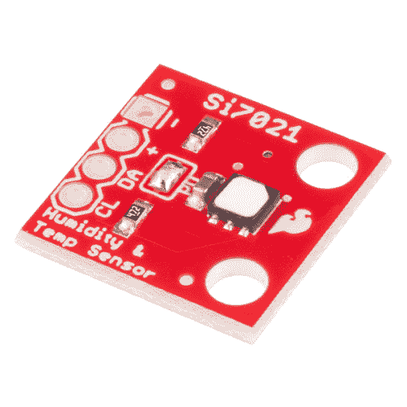

# Si7021 湿度和温度传感器连接指南

> 原文：<https://learn.sparkfun.com/tutorials/si7021-humidity-and-temperature-sensor-hookup-guide>

## 介绍

[Si7021](https://www.sparkfun.com/products/13763) 是一款低成本、易于使用、高精度的数字温度和湿度传感器。你所需要的只是两条用于 I ² C 通讯的线路，你还会得到相对湿度读数和准确的温度读数！这种传感器是环境传感和数据记录的理想选择，是气象站或保湿器控制系统的完美选择。

 

将**添加到您的[购物车](https://www.sparkfun.com/cart)中！**

 **### [斯帕克芬湿度和温度传感器分线点- Si7021](https://www.sparkfun.com/products/13763)

[Out of stock](https://learn.sparkfun.com/static/bubbles/ "out of stock") SEN-13763

Si7021 是一款低成本、易于使用、高精度的数字湿度和温度传感器。这种传感器是环境监测的理想选择

$10.9513[Favorited Favorite](# "Add to favorites") 40[Wish List](# "Add to wish list")** **Si7021 还配备了疏水性 PTFE 过滤器，覆盖传感器的入口。这种过滤器可以阻挡污染物，但允许水蒸气通过，使您的传感器免受水损害，同时仍能提供准确的传感器读数。

### 所需材料

要遵循本连接指南，您需要以下内容:**