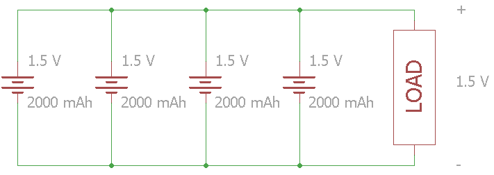

# 什么是电池？

> 原文：<https://learn.sparkfun.com/tutorials/what-is-a-battery>

## 介绍

[电池](https://www.sparkfun.com/categories/54)是一个或多个电池的集合，其化学反应在电路中产生电子流。所有的电池都由三种基本成分组成:阳极(“-”侧)、阴极(“+”侧)和某种电解质(与阳极和阴极发生化学反应的物质)。

[https://www.youtube.com/embed/-EB7NVA7rI4](https://www.youtube.com/embed/-EB7NVA7rI4)

当电池的阳极和阴极连接到电路时，阳极和电解液之间会发生化学反应。这个反应使电子流经电路，回到阴极，在那里发生另一个化学反应。当阴极或阳极中的材料被消耗或不再能用于反应时，电池就不能产生电能。这时，你的电池“没电了”

使用后必须扔掉的电池称为**原电池**。可以充电的电池称为**二次电池**。

*Lithium polymer batteries, for example, can be recharged*

如果没有电池，你的四轴飞行器将不得不拴在墙上，你将不得不用手摇曲柄发动你的汽车，你的 Xbox 控制器将不得不一直插着电源(就像过去的好时光一样)。电池提供了一种在便携式容器中储存势能的方式。

*Batteries come in a variety of shapes, sizes, and chemistries.*

现代电池的发明通常归功于亚历山德罗·伏打。它实际上始于一次令人惊讶的事故，涉及一只青蛙的解剖。

### 你将学到什么

本教程将详细介绍以下主题:

*   电池是如何发明的
*   电池由哪些部分组成
*   电池如何工作
*   描述电池的常用术语
*   在电路中使用电池的各种方法

### 推荐阅读

在开始阅读本指南之前，您可能需要熟悉一些概念:

*   [什么是电](https://learn.sparkfun.com/tutorials/what-is-electricity)
*   [电压、电流、电阻和欧姆定律](https://learn.sparkfun.com/tutorials/voltage-current-resistance-and-ohms-law)
*   [什么是电路](https://learn.sparkfun.com/tutorials/what-is-a-circuit)
*   [串联和并联电路](https://learn.sparkfun.com/tutorials/series-and-parallel-circuits)
*   [电力](https://learn.sparkfun.com/tutorials/electric-power)
*   [交流电与直流电(DC)](https://learn.sparkfun.com/tutorials/alternating-current-ac-vs-direct-current-dc)

* * *

## 想探索不同的电池吗？

我们掩护你！

 

将**添加到您的[购物车](https://www.sparkfun.com/cart)中！**

 **### [锂离子电池- 400mAh](https://www.sparkfun.com/products/13851)

[In stock](https://learn.sparkfun.com/static/bubbles/ "in stock") PRT-13851

这是一种基于锂离子化学的非常小、非常轻的电池，具有目前最高的能量密度…

$5.5010[Favorited Favorite](# "Add to favorites") 41[Wish List](# "Add to wish list")**** 

将**添加到您的[购物车](https://www.sparkfun.com/cart)中！**

 **### [纽扣电池- 20mm (CR2032)](https://www.sparkfun.com/products/338)

[In stock](https://learn.sparkfun.com/static/bubbles/ "in stock") PRT-00338

CR2032 锂金属 3V 250mAh 纽扣电池。非常适合为低功耗处理器供电或连续几周闪烁 LED 灯…

$2.10[Favorited Favorite](# "Add to favorites") 33[Wish List](# "Add to wish list")**** 

将**添加到您的[购物车](https://www.sparkfun.com/cart)中！**

 **### [锂离子电池- 18650 电芯(2600mAh)](https://www.sparkfun.com/products/12895)

[In stock](https://learn.sparkfun.com/static/bubbles/ "in stock") PRT-12895

不，这不是某种奇怪的 AA 电池，这实际上是一个 18650 锂离子电池。这些圆形的高容量电池…

$6.50[Favorited Favorite](# "Add to favorites") 20[Wish List](# "Add to wish list")**** 

将**添加到您的[购物车](https://www.sparkfun.com/cart)中！**

 **### [9V 碱性电池](https://www.sparkfun.com/products/10218)

[In stock](https://learn.sparkfun.com/static/bubbles/ "in stock") PRT-10218

这些是 Rayovac 的标准 9 伏碱性电池。想都别想给这些充电。与…一起使用它们

$2.251[Favorited Favorite](# "Add to favorites") 6[Wish List](# "Add to wish list")****************[See all batteries](https://www.sparkfun.com/categories/54)

* * *********  ********## 历史

### 术语电池

在历史上，“电池”一词被用来描述“一系列相似的物体组合在一起执行一项功能”，如在一个炮兵电池。1749 年，本杰明·富兰克林第一次用这个词来描述他在电学实验中连接在一起的一系列电容器。后来，这个术语被用于任何为了提供电能而连接在一起的电化学电池。

*Battery of Leyden Jar "capacitors" linked together*
*(Image courtesy of [Alvinrune of Wikimedia Commons](https://commons.wikimedia.org/wiki/File:Leidse_flessen_Museum_Boerhave_december_2003_2.jpg))*

### 电池的发明

1780 年决定性的一天，意大利物理学家、内科医生、生物学家和哲学家[路易吉·加尔瓦尼](https://en.wikipedia.org/wiki/Luigi_Galvani)正在解剖一只挂在铜钩上的青蛙。当他用铁制的舟皿触碰青蛙的腿时，腿抽搐了一下。加尔瓦尼认为能量来自腿本身，但他的科学家同事[亚历山德罗·伏打](https://en.wikipedia.org/wiki/Alessandro_Volta)不这么认为。

沃尔特假设青蛙的腿部冲动实际上是由浸泡在液体中的不同金属引起的。他用浸泡在盐水中的布代替青蛙尸体重复了这个实验，结果产生了相似的电压。伏打在 1791 年发表了他的发现，后来在 1800 年创造了第一个电池，伏打电池堆。

*The voltaic pile consisted of a stack of zinc and copper plates separated by cloth soaked in brine*

Volta 的电池堆受到两个主要问题的困扰:电池堆的重量导致电解液从布料中泄漏出来，组件的特殊化学性质导致寿命非常短(约一小时)。接下来的 200 年将用于完善伏打的设计和解决这些问题。

### 固定在电堆上

苏格兰的威廉·克鲁谢克(William Cruickshank)通过将伏打电池堆侧放形成“槽式电池”解决了漏电问题

*The trough battery solved the leakage problem of the voltaic pile*

第二个问题，寿命短，是由杂质引起的锌的降解和铜上氢气泡的积累引起的。1835 年，威廉·斯特金发现用水银处理锌可以防止降解。

英国化学家约翰·弗雷德里克·丹尼尔(John Frederic Daniell)使用了第二种电解质，这种电解质会与氢气发生反应，防止在铜阴极上积累。丹尼尔的双电解质电池，被称为“丹尼尔电池”，将成为一个非常受欢迎的解决方案，为新兴的电报网络提供电力。

*A collection of Daniell cells from 1836*

### 第一可充电电池

1859 年，法国物理学家加斯顿·普兰特用两片浸在硫酸中的铅制成了电池。通过逆转流经电池的电流，化学物质将回到其原始状态，从而制造出第一个可充电电池。

后来，在 1881 年，Camille Alphonse Faure 改进了 Planté的设计，将铅板做成金属板。这种新的设计使电池更容易制造，铅酸电池在汽车上得到广泛应用。

-> *常见的“汽车电池”的设计已经有 100 多年的历史了*
*(图片由[维基共享资源(Wikimedia Commons)的 Emilian Robert Vicol 提供](https://commons.wikimedia.org/wiki/File:VRLA_Valve-Regulated-Lead-Acid-Batteries_82645.jpg)*<—

### 干电池

直到 19 世纪晚期，电池中的电解液还是液态。这使得电池运输非常小心，大多数电池一旦连接到电路上就不打算移动。

1866 年， [Georges Leclanché](https://en.wikipedia.org/wiki/Georges_Leclanch%C3%A9) 制造了一种电池，使用锌阳极、[二氧化锰](https://en.wikipedia.org/wiki/Manganese_dioxide)阴极和[氯化铵](https://en.wikipedia.org/wiki/Ammonium_chloride)溶液作为电解质。尽管勒克瑙电池中的电解液仍然是液体，但电池的化学性质证明是发明干电池的重要一步。

卡尔·加斯纳(Carl Gassner)想出了如何用氯化铵和 T2 的熟石膏制造出一种电解质糊状物(T3)。1886 年，他在德国申请了新型“干电池”的专利。

这些新的干电池，通常被称为“锌碳电池”，被大量生产并证明非常受欢迎，直到 20 世纪 50 年代末。虽然碳不用于化学反应，但它在锌碳电池中作为电导体发挥着重要作用。

->*20 世纪 60 年代的 3V 锌碳电池*
*(图片由维基共享资源[PhFabre 提供)](https://commons.wikimedia.org/wiki/File:W_pil_001_Pile_Wonder_3V_ann%C3%A9es_60.jpg)* < -

20 世纪 50 年代，[联合碳化物](https://en.wikipedia.org/wiki/Eveready_Battery_Company)公司(后来被称为“Eveready”和“Energizer”)的 Lewis Urry、Paul Marsal 和 Karl Kordesch 根据 1899 年由 [Waldemar Jungner](https://en.wikipedia.org/wiki/Waldemar_Jungner) 制定的电池化学配方，用一种[碱性](https://en.wikipedia.org/wiki/Alkalinity)物质取代了氯化铵电解液。碱性干电池比同样大小的锌碳电池能储存更多的能量，并有更长的储存寿命。

碱性电池在 20 世纪 60 年代开始流行，取代了锌碳电池，并成为消费者使用的标准原电池。

-> *碱性电池有多种形状和大小*
*(图片由维基共享资源[Aney ~ Commons wiki 提供)](https://commons.wikimedia.org/wiki/File:Alkali_battery_5.jpg)* < -

### 20 世纪的充电电池

20 世纪 70 年代，COMSAT 公司开发了用于通信卫星的镍氢电池。这些电池以加压的气态形式储存氢。许多人造卫星，如[国际空间站](https://en.wikipedia.org/wiki/International_Space_Station)，仍然依靠镍氢电池。

自 20 世纪 60 年代末以来，几家公司的研究创造了[镍金属氢化物(NiMH)电池](https://www.sparkfun.com/products/335)。镍氢电池于 1989 年投放到消费市场，为可充电镍氢电池提供了更小、更便宜的替代品。

[日本朝日化学](https://en.wikipedia.org/wiki/Asahi_Kasei)在 1985 年制造出第一块锂离子电池，索尼在 1991 年制造出第一块商用锂离子电池。20 世纪 90 年代末，一种柔软、灵活的外壳被用于锂离子电池，并催生了“[锂聚合物](https://www.sparkfun.com/search/results?term=lithium+polymer)或“脂”电池。

*The chemical reactions in the lithium polymer battery are essentially the same as those in the lithium-ion battery*

显然，更多的电池化学物质被发明、制造出来，并被淘汰。如果你想了解更多现代流行的电池技术，请查看我们的[电池技术教程](https://learn.sparkfun.com/tutorials/battery-technologies)。

## 成分

电池由三个基本部件组成:阳极**、阴极**和电解质**。如果电解液不足，通常使用**隔板**来防止阳极和阴极接触。为了存放这些元件，电池通常会有某种**外壳**。******

*****OK, most batteries are not actually divided up in three equal sections, but you get the idea. A better cross-section of an alkaline cell can be found on [Wikipedia](https://en.wikipedia.org/wiki/Alkaline_battery).*

阳极和阴极都是**电极**的类型。电极是导体，电流通过它进入或离开电路中的元件。

### 阳极

电子流从与电路相连的装置的阳极流出。这意味着常规的“T2”电流“T3”流入阳极的“T4”。

*On batteries, the anode is marked as the negative (-) terminal*

在电池中，阳极和电解质之间的化学反应导致电子在阳极中积聚。这些电子想要移动到阴极，但是不能穿过电解质或隔板。

### 阴极

电子流*进入*与电路相连的装置的阴极。这意味着传统的“电流”从阴极流出*。*

*On batteries, the cathode is marked as the positive (+) terminal*

在电池中，阴极内部或周围的化学反应利用阳极产生的电子。电子到达阴极的唯一途径是通过电池外部的电路。

### 电解质

电解质是一种物质，通常是液体或凝胶，能够在阳极和阴极发生的化学反应之间传输离子。电解质还抑制阳极和阴极之间的电子流动，使得电子更容易流过外部电路，而不是流过电解质。

-> *碱性电池在高温或反向电压下会泄漏电解液氢氧化钾*
*(图片由维基共享资源[祝铭震·戴维斯提供)](https://commons.wikimedia.org/wiki/File:Leaking_Nopopo_battery_2nd_generation.JPG)* < -

电解液对电池的运行至关重要。因为电子不能通过它，它们被迫以电路的形式通过连接阳极和阴极的电导体。

### 分离器

隔板是多孔材料，可以防止阳极和阴极接触，这种接触会导致电池短路。隔板可以由各种材料制成，包括棉花、尼龙、聚酯、纸板和合成聚合物薄膜。隔板不会与阳极、阴极或电解质发生化学反应。

*The voltaic pile used cloth or cardboard (separator) soaked in brine (electrolyte) to keep the electrodes apart*

电解质中的离子可以带正电，带负电，并且可以有各种大小。可以制造特殊的隔板，允许一些离子通过，但不允许其他离子通过。

### 套

大多数电池需要一种方法来容纳它们的化学成分。外壳，也称为“外壳”或“壳”，是简单的机械结构，用于容纳电池的内部部件。

*This lead-acid battery has a plastic casing*

电池外壳几乎可以由任何材料制成:塑料、钢、软聚合物层压袋等等。一些电池使用导电钢壳，与其中一个电极电连接。在普通 AA 碱性电池的情况下，钢壳连接到阴极。

## 操作

电池通常需要几个化学反应才能工作。至少一个反应发生在阳极中或周围，一个或多个反应发生在阴极中或周围。在所有情况下，阳极的反应在一个叫做**氧化**的过程中产生额外的电子，阴极的反应在一个叫做**还原**的过程中使用额外的电子。

*When the switch is closed, the circuit is complete, and electrons can flow from the anode to the cathode. These electrons enable the chemical reations at the anode and cathode.*

本质上，我们将某种化学反应，即还原氧化反应或氧化还原反应分成两个独立的部分。当电子在化学物质之间转移时，就会发生氧化还原反应。我们可以利用这个反应中电子的运动流到电池外面，为我们的电路供电。

### 阳极氧化

氧化还原反应的第一部分，氧化，发生在阳极和电解质之间，它产生[电子](https://en.wikipedia.org/wiki/Electron)(标记为 e ^- )。

一些氧化反应产生[离子](https://en.wikipedia.org/wiki/Ion)，例如在[锂离子电池](https://en.wikipedia.org/wiki/Lithium-ion_battery#Electrochemistry)中。在其他化学反应中，反应会消耗离子，就像普通的 T4 碱性电池 T5 一样。在这两种情况下，离子都能够自由地流过电解质，而电子却不能。

### 阴极还原

氧化还原反应的另一半，即还原，发生在阴极或阴极附近。氧化反应产生的电子在还原过程中被消耗掉。

在某些情况下，如锂离子电池，氧化反应过程中产生的带正电荷的锂离子在还原过程中被消耗。在其他情况下，如碱性电池，在还原过程中会产生负电荷离子。

### 电子流动

在大多数电池中，即使电池没有连接到电路，一些或所有的化学反应也会发生。这些反应会影响电池的[保质期](https://en.wikipedia.org/wiki/Shelf_life)。

在大多数情况下，只有在阳极和阴极之间形成导电回路时，反应才会全力进行。阳极和阴极之间的电阻越小，允许流动的电子越多，化学反应发生得越快。

*Creating a short circuit in a battery (even accidental ones, in this case), can be dangerous. Lithium-ion batteries are known to overheat and even smoke or catch fire in the presence of a short circuit.*

我们可以让这些移动的电子通过各种电子元件，称为“[负载](https://en.wikipedia.org/wiki/Electrical_load)，以完成一些有用的事情。在本节开始的动画中，我们用移动的电子点亮了一个虚拟灯泡。

### 没电的电池

电池中的化学物质最终会达到平衡状态。在这种状态下，化学物质将不再有反应的趋势，因此，电池将不再产生任何电流。此时，电池被视为“没电”

当电池没电时，必须处理原电池。二次电池可以充电，这是通过在电池中施加反向电流来实现的。当化学物质进行另一系列反应，使它们回到原来的状态时，就会发生充电。

## 术语

当谈到电池的电压、容量、电流源能力等时，人们经常使用一组通用术语。

### 细胞

电池是指由电解质分开的单个阳极和阴极，用于产生电压和电流。一个电池可以由一个或多个单元组成。例如，一节 AA 电池就是一个电池。汽车电池包含 6 节 2.1 伏的电池。

*The common 9-volt battery contains six 1.5 V alkaline cells stacked on top of each other*

### 主要的

原代细胞含有不可逆的化学物质。结果就是电池没电了之后一定要扔掉。

### 副手

二次电池可以充电，并使其化学性质回复到原始状态。这些电池又被称为“可充电电池”，可以多次使用。

### 标称电压

电池的标称电压是制造商规定的电压。

例如，碱性 AA 电池被列为 1.5 V，[这篇来自 Mad Scientist Hut](http://madscientisthut.com/wordpress/daily-blog/aa-battery-discharge-curves/) 的文章显示，他们测试的碱性电池从大约 1.55 V 开始，然后随着放电慢慢失去电压。在本例中，“1.5 V”标称电压指的是电池的最大电压或启动电压。

[这款用于四轴飞行器的 Storm 电池组](http://www.helipal.com/storm-11-1v-2200mah-20c-lipo-battery-pack-xt60.html)显示了其 LiPo 电池的放电曲线，从大约 4.2 V 开始，随着放电下降到大约 2.8 V。列出的大多数锂离子和脂电池的标称电压为 3.7 V。在这种情况下，“3.7 V”标称电压是指电池在放电周期中的平均电压。

### 容量

电池的容量是衡量它在特定电压下所能提供的电荷量的指标。大多数电池都以安培小时(Ah)或毫安小时(mAh)为单位。

*This LiPo battery is rated for 1000 mAh, which means it can provide 1 amp for 1 hour before it is considered dead.*

大多数电池放电图显示电池的电压作为容量的函数，例如 PowerStream 的这些 AA 电池测试。要确定电池是否有足够的容量为您的电路供电，请找出可接受的最低电压，并找出相关的 mAh 或 Ah 额定值。

### c 级利率

很多电池，尤其是大功率的锂离子电池，为了更清晰地定义电池属性，将放电电流表示为“C-Rate”。C-Rate 是相对于电池最大容量的放电率。

1C 是电池放电 1 小时所需的电流量。例如，提供 1C 电流的 400 mAh 电池将提供 400 mA 电流。相同电池的 5C 将是 2 A。

大多数电池在较高的电流消耗下会失去容量。例如，[charge ry 的这张产品信息图](http://www.chargery.com/productImage/battery/PHE2600-discharge-curve.jpg)显示，他们的 LiPo cell 在较高的 C-速率下具有较少的 mAh。

**NOTE:** General advice holds that you should charge LiPo batteries at 1C or less.

* * *

麻省理工学院有一个神奇的[电池规格和术语指南](http://web.mit.edu/evt/summary_battery_specifications.pdf)，比这个概述更进一步。

## 使用

### 单细胞

一些电路可以由单个电池供电，但要确保电池能够提供足够的电压和电流。

*This [Photon Battery Shield](https://www.sparkfun.com/products/13626) is being powered from a single LiPo cell*

如果电压对你的电路来说太高或太低，你可能需要一个 [DC/DC 转换器](https://www.sparkfun.com/products/9370)。

### 系列

为了增加电池端子之间的电压，可以将电池串联起来。串联意味着将电池首尾相连，将一个电池的阳极连接到下一个电池的阴极。

通过串联电池，你增加了总电压。将所有电池的电压相加，确定工作电压。容量保持不变。

*In this example, four 1.5 V cells are connected in series. The voltage across the load is 6 V while the total set of batteries have a 2000 mAh capacity.*

在大多数使用碱性电池的消费电子产品中，电池是串联堆叠的。比如这个 [2x AA 电池座](https://www.sparkfun.com/products/9547)可以把一个项目的标称电压提升到 3 V。

**NOTE:** If you are charging lithium-ion or LiPo batteries in series, you need to make sure to use special circuitry known as a "balancer" to ensure the voltages among the cells stays even. Some chargers, like [this one](https://www.sparkfun.com/products/10473), have balancers to allow for safe charging.

### 平行的

如果单个电池的电压足够负载，您可以并联添加电池以增加容量。请注意，这也意味着增加可用电流(C-Rate)。

并联电池时要小心！所有电池应该具有相同的标称电压和相同的电荷水平。如果存在任何电压差，可能会发生短路，导致过热并可能引发火灾。

*In this example, four 1.5 V cells are connected in parallel. The voltage across the load stays at 1.5 V, but the total capacity increases to 8000 mAh.*

### 串并联

如果你想提高电压和容量，你可以将串联和并联电池结合起来。再次确保并联电池的电压水平相同，因为可能会发生短路。

*In this example, the total voltage across the load is 3V, and the batteries' combined capacity is 4000 mAh.*

在大型电池组，尤其是锂离子电池组中，您经常会看到使用“S”和“P”来表示串联和并联的配置。上面电路的配置是 2S2P。作为一个实际的例子，[现代电动汽车](https://en.wikipedia.org/wiki/Tesla_Model_S#Battery)使用大量串联和并联的电池阵列。

## 资源和更进一步

到现在为止，你应该已经了解了电池是如何发明的，以及它们是如何工作的。电池是为你的项目提供电能的一种方法，如果你需要一个便携式电源，它会非常有用。

如果你想更多地了解电池，这里有一些其他的教程:

*   [电池技术](https://learn.sparkfun.com/tutorials/battery-technologies)
*   [如何为项目提供动力](https://learn.sparkfun.com/tutorials/how-to-power-a-project)
*   [什么是电路？](https://learn.sparkfun.com/tutorials/what-is-a-circuit)

想看电池工作吗？看看这些在不同配置中使用不同电池的项目:

 [### 西蒙无线公司](https://learn.sparkfun.com/tutorials/simon-splosion-wireless) This is a tutorial demonstrating one of many techniques to "hack" the Simon Says. We will highlight the technique to take your Simon Says Wireless.[Favorited Favorite](# "Add to favorites") 3 [### 机器人基础差分平台](https://learn.sparkfun.com/tutorials/actobotics-basic-differential-platform) Get started with Actobotics with this simple vehicle. Then expand and customize it for your own evil robot empire.[Favorited Favorite](# "Add to favorites") 7 [### LED 蝴蝶弹出卡](https://learn.sparkfun.com/tutorials/led-butterfly-pop-up-card) Craft an illuminated butterfly pop up card with copper tape, two LEDs, and a battery.[Favorited Favorite](# "Add to favorites") 8 [### 光子远程温度传感器](https://learn.sparkfun.com/tutorials/photon-remote-temperature-sensor) Learn how to build your own Internet-connect, solar-powered temperature collection station using the Photon from Particle.[Favorited Favorite](# "Add to favorites") 11 [### ESP8266 动力丙烷储罐](https://learn.sparkfun.com/tutorials/esp8266-powered-propane-poofer) Learn how Nick Poole built a WiFi controlled fire-cannon using the ESP8266 Thing Dev Board 4 [### Blynk 板洗衣机/烘干机警报](https://learn.sparkfun.com/tutorials/blynk-board-washerdryer-alarm) How to configure the Blynk Board and app to notify you when your washer or dryer is done shaking.[Favorited Favorite](# "Add to favorites") 9************