# RFM69HCW 连接指南

> 原文：<https://learn.sparkfun.com/tutorials/rfm69hcw-hookup-guide>

## 介绍 RFM69

RFM69HCW 是一种廉价的多功能无线电模块。您可以使用它在两个或数百个模块之间发送文本或二进制数据。它非常适合为家庭自动化、公民科学等构建廉价的短程无线网络。RFM69HCW 有两种频率:一个 [915 MHz 版本](https://www.sparkfun.com/products/12775)和一个 [434 MHz 版本](https://www.sparkfun.com/products/12823)。参见下面的[硬件概述](https://learn.sparkfun.com/tutorials/rfm69hcw-hookup-guide#hardware-overview)，了解选择哪一个的提示。

[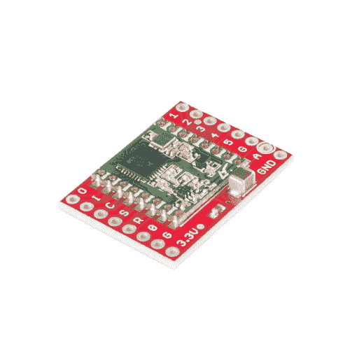](https://www.sparkfun.com/products/12775) 

将**添加到您的[购物车](https://www.sparkfun.com/cart)中！**

### [【spark fun RFM 69 突破(915MHz)](https://www.sparkfun.com/products/12775)

[In stock](https://learn.sparkfun.com/static/bubbles/ "in stock") WRL-12775

这是 SparkFun RFM69 分线点，这是一项小型技术，它将 RFM69HCW 模块上所有可用的引脚分线为…

$13.956[Favorited Favorite](# "Add to favorites") 30[Wish List](# "Add to wish list")****[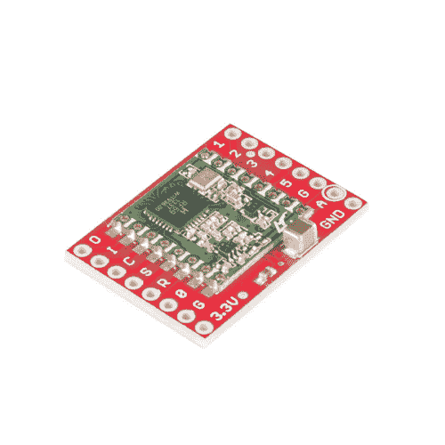](https://www.sparkfun.com/products/12823) 

将**添加到您的[购物车](https://www.sparkfun.com/cart)中！**

### [【spark fun RFM 69 突破(434MHz)](https://www.sparkfun.com/products/12823)

[34 available](https://learn.sparkfun.com/static/bubbles/ "34 available") WRL-12823

这是 SparkFun RFM69 分线点，这是一项小型技术，它将 RFM69HCW 模块上所有可用的引脚分线为…

$13.95[Favorited Favorite](# "Add to favorites") 18[Wish List](# "Add to wish list")**** ****[https://www.youtube.com/embed/ZIBbn3dTtm4/?autohide=1&border=0&wmode=opaque&enablejsapi=1](https://www.youtube.com/embed/ZIBbn3dTtm4/?autohide=1&border=0&wmode=opaque&enablejsapi=1)

### 接口和示例代码

RFM69HCW 自己什么都做不了；它需要连接到微控制器，如 Arduino。RFM69HCW 使用一个四线[同步外设接口(SPI)](https://learn.sparkfun.com/tutorials/serial-peripheral-interface-spi) 和一个中断线路。大多数微控制器，包括 Arduino，都提供 SPI 接口。

LowPowerLab 的菲利克斯·鲁苏为 RFM69 编写了一个优秀的 T2 Arduino 库，处理模块设置和数据收发的细节。**本指南将介绍使用该库实现 RFM69HCW 与 Arduino 微控制器的接口。**

如果你使用不同的微控制器，这里的信息加上[数据表](https://github.com/sparkfun/RFM69HCW_Breakout/blob/master/documentation/RFM69HCW-V1.1.pdf?raw=true)和[库源代码](https://github.com/LowPowerLab/RFM69)应该可以帮助你启动并运行。(如果您为另一个系统编写示例代码，我们很乐意将其添加到[代码库](https://github.com/sparkfun/RFM69HCW_Breakout)。

### 所需材料

在本教程中，我们将向您展示如何让两个模块相互通信，但是请记住，您可以在您的项目中使用两个以上的模块。

这是你需要的:

*   两个 RFM69HCW 模块(频率匹配):

    *   [915 兆赫【WRL-12775】](https://www.sparkfun.com/products/12775)
        或者
    *   [434 兆赫(WRL-12823)](https://www.sparkfun.com/products/12823)
*   你需要两个 Arduinos。您可以将 RFM69HCW 与任何 Arduino 配合使用，但 [3.3V Arduino Pro](https://www.sparkfun.com/products/10914) 是一个不错的选择，因为 RFM69HCW 也是 3.3V 器件。我们使用的是[“Beefy 3”FTDI 板](https://www.sparkfun.com/products/13746)，因为标准 FTDI 板无法提供足够的电流来运行 RFM69:

    *   2 个 [Arduino Pro 328 3.3V](https://www.sparkfun.com/products/10914)
    *   2 个[母头组件](https://www.sparkfun.com/products/11269)
    *   2 块[“结实的 3”FTDI 板](https://www.sparkfun.com/products/13746)
    *   2 根 [USB 微型 B 线](https://www.sparkfun.com/products/10215)
*   我们将使用接头和跳线将它们连接到 Arduinos:

    *   2 x [断开头部-直线](https://www.sparkfun.com/products/116)
    *   2 根[6 " M/F 跳线，10 根一组](https://www.sparkfun.com/products/9140)
*   如果你更愿意使用 5V Arduino，你可以，但你需要为每个 5V Arduino 配备一个逻辑电平转换器:

    *   2 x [双向逻辑电平转换器](https://www.sparkfun.com/products/12009)
*   你需要一些电线来制作天线，还需要几个发光二极管(可选),我们会让它们在发送或接收数据时闪烁:

    *   大约 1 英尺的通用电线(例如 [AWG22 连接电线](https://www.sparkfun.com/products/8022))，或者您可以在必要时使用跳线。
    *   2 个通用发光二极管(例如[基本红色发光二极管](https://www.sparkfun.com/products/9590)
*   如果你还没有，你还需要[焊接工具和](https://www.sparkfun.com/products/11807)焊料。

### 推荐阅读

我们建议您在使用 RFM69HCW 之前熟悉以下主题。如果你想重温这些东西，请点击链接，完成后再回来。

[](https://learn.sparkfun.com/tutorials/how-to-solder-through-hole-soldering) [### 如何焊接:通孔焊接](https://learn.sparkfun.com/tutorials/how-to-solder-through-hole-soldering) This tutorial covers everything you need to know about through-hole soldering.[Favorited Favorite](# "Add to favorites") 70[](https://learn.sparkfun.com/tutorials/using-github) [### 使用 GitHub](https://learn.sparkfun.com/tutorials/using-github) How to use repositories and GitHub for version control.[Favorited Favorite](# "Add to favorites") 26[](https://learn.sparkfun.com/tutorials/installing-an-arduino-library) [### 安装 Arduino 库](https://learn.sparkfun.com/tutorials/installing-an-arduino-library) How do I install a custom Arduino library? It's easy! This tutorial will go over how to install an Arduino library using the Arduino Library Manager. For libraries not linked with the Arduino IDE, we will also go over manually installing an Arduino library.[Favorited Favorite](# "Add to favorites") 22[](https://learn.sparkfun.com/tutorials/serial-peripheral-interface-spi) [### 串行外设接口(SPI)](https://learn.sparkfun.com/tutorials/serial-peripheral-interface-spi) SPI is commonly used to connect microcontrollers to peripherals such as sensors, shift registers, and SD cards.[Favorited Favorite](# "Add to favorites") 91[](https://learn.sparkfun.com/tutorials/what-is-an-arduino) [### 什么是 Arduino？](https://learn.sparkfun.com/tutorials/what-is-an-arduino) What is this 'Arduino' thing anyway? This tutorials dives into what an Arduino is and along with Arduino projects and widgets.[Favorited Favorite](# "Add to favorites") 50[](https://learn.sparkfun.com/tutorials/installing-arduino-ide) [### 安装 Arduino IDE](https://learn.sparkfun.com/tutorials/installing-arduino-ide) A step-by-step guide to installing and testing the Arduino software on Windows, Mac, and Linux.[Favorited Favorite](# "Add to favorites") 16[](https://learn.sparkfun.com/tutorials/how-to-solder-castellated-mounting-holes) [### 如何焊接:堞形安装孔](https://learn.sparkfun.com/tutorials/how-to-solder-castellated-mounting-holes) Tutorial showing how to solder castellated holes (or castellations). This might come in handy if you need to solder a module or PCB to another PCB. These castellations are becoming popular with integrated WiFi and Bluetooth modules.[Favorited Favorite](# "Add to favorites") 19

## 硬件概述

### 频率

RFM69HCW 在 [ISM(工业科学和医疗)频段](http://en.wikipedia.org/wiki/ISM_band)进行传输，这是一组为低功率、短程、免许可证无线电设备预留的频率。

SparkFun 出售 RFM69HCW 的两个版本，一个是 915 MHz 版本的 T1，另一个是 T2 434 MHz 版本的 T3。这些频率在不同地区是合法的:非常粗略地说，915 MHz 用于美洲和澳大利亚，434 MHz 版本用于欧洲、亚洲和非洲。实际的法规有点杂乱无章，所以请查看其他地区的当地法规。

**Note:** Because of the low power and short range, the limited use of either frequency isn't likely to be an issue. But if you're planning on creating a commercial product or deploying a large number of modules, be sure you're using the correct frequency for your location.

### 范围

信号能到达多远？在几乎没有障碍物的情况下，你应该可以获得数百米的可靠连接。在室内，我们已经看到它可以穿过多面墙工作 50 米以上。

RFM69HCW 的传输速率最高可达 100 mW 和 300 kb/s，但您可以根据自己的应用更改这两个值。例如，您可以通过增加发射功率和降低数据速率来最大化覆盖范围。或者，对于消耗电池电量的短程无线传感器网络，您可以同时降低这两种功耗。

### 电路板引脚排列

[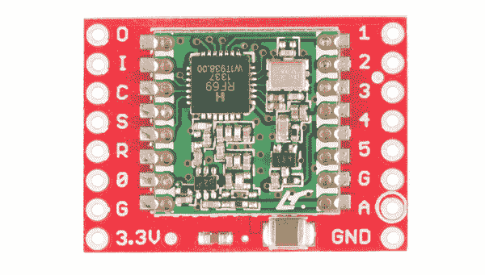](https://cdn.sparkfun.com/assets/learn_tutorials/2/1/9/12823-01Crop.jpg)

RFM69HCW 分线板使您能够接触到 RFM69HCW 上的所有引脚，但在大多数情况下，您只需要其中的七个引脚。下面是我们将使用的引脚的概述:

### 力量

| **板卡标签** | **名称** | **功能** |
| 3.3V | 力量 | 3.3V 电源(至少 130 mA，见下文) |
| G /全球导航卫星系统 | 地面 | 电源地线 |

### 数据

| **板卡标签** | **名称** | **功能** |
| O / MISO | 主机输入从机输出 | 从 RFM69HCW 到微控制器的数据 |
| 我/ MOSI | 主机输出从机输入 | 从微控制器到 RFM69HCW 的数据 |
| C / SCK(消歧义) | 串行时钟 | 从微控制器到 RFM69HCW 的时钟信号 |
| NSS 南部 | 从机选择 | 从微控制器到 RFM69HCW 的选择信号 |
| 0 / DIO0 | 数字输入/输出 0
接收中断 | 接收到从 RFM69HCW 到微控制器的数据就绪中断信号 |

### 天线

| **板卡标签** | **名称** | **功能** |
| A / ANT | 天线 | 线天线，详情见下页 |
| G /全球导航卫星系统 | 地面 | 天线接地(与电源接地相同)
(您可以使用天线引脚旁边的 G 引脚) |

标有 1 至 5 的未使用引脚具有我们不会使用的功能。更多信息参见 [RFM69HCW 数据表](https://github.com/sparkfun/RFM69HCW_Breakout/blob/master/documentation/RFM69HCW-V1.1.pdf?raw=true)。

### 电源要求

RFM69HCW 将在从 **1.8V 到 3.6V** 的电压下运行，并且在传输时可以汲取高达 130mA 的电流。

**IMPORTANT!** Do not power your RFM69 with 5V or connect the data lines directly to a 5V microprocessor. Doing so will damage the device.

使用该板最简单的方法是将其直接连接到 3.3V Arduino，如 [3.3V Arduino Pro](https://www.sparkfun.com/products/10914) 。然而，如果你使用[逻辑电平转换器](https://www.sparkfun.com/products/12009)，你可以将它连接到 5V Arduino。参见硬件连接部分的图表。

在本教程中，我们将使用两个由[“Beefy 3”FTDI 基础](https://www.sparkfun.com/products/13746)供电的 3.3V Arduino Pros。我们使用 Beefy 3 FTDI，因为它可以提供高达 500mA 的电流，而标准 FTDI 只能提供 50mA 的电流。

**TIP:** If you don't have Beefy 3 FTDI boards, you can ensure that you have enough current by connecting your Arduino Pros to an external power supply such as a Wall Wart or Lipo Battery.**PROTIP:** If your power supply can't provide 130mA, your Arduino may reset or lock up when you try to transmit. In these cases, a [large capacitor](https://www.sparkfun.com/products/96) placed between power and ground on the RFM69HCW board should help. This capacitor will store power while the board isn't transmitting and release it when it's needed.

顺便说一句，RFM69HCW 在接收模式下使用 16mA，并且它有几个睡眠选项使用的电流小于 16mA。

## 硬件连接

### 将 RFM69HCW 连接到 Arduino

有很多方法可以将电路板连接在一起。在本教程中，我们将把[公分离接头](https://www.sparkfun.com/products/116)焊接到 RFM69HCW 板上，把[母接头](https://www.sparkfun.com/products/11269)焊接到 Arduino Pro 上，并使用 [M/F 跳线](https://www.sparkfun.com/products/9140)将所有东西连接在一起。当然，您可以使用任何您希望的接线方法。

**步骤 1:将公接头焊接到 RFM69HCW:**

折断[公分离接头](https://www.sparkfun.com/products/116)的一个**8 针长度，并将其焊接到 RFM69HCW 板的“O I C S R 0 G 3.3V”侧。你可以把它焊在顶部或底部，由你选择。**

**Note:** The board is laid out so that all the interface connections you need are on one side of the board, so you should only solder headers or wires to the "O I C S R 0 G 3.3V" side of the board. Leave the opposite side empty for your antenna.

对第二个 RFM69HCW 重复上述步骤。

**步骤 2:将母接头焊接到 Arduino Pro 上:**

将四个[母接头](https://www.sparkfun.com/products/11269)焊接到 Arduino Pro 上。它们应该伸出板子的顶部。

对第二个 Arduino Pro 重复上述步骤。

**步骤 3:使用 M/F 跳线将 RFM69HCW 连接到 Arduino Pro:**

不同的 Arduino 型号对 SPI 端口使用不同的引脚。有关正确的连接，请参见下表:

| **RFM69HCW pin** | **328(Pro/Mini/red board/Uno)** | **兆** | **32U4(莱昂纳多/Due/Pro 微)** |
| O / MISO | 12 或 ICSP-1 | 50 或 ICSP-1 | 14 或 ICSP-1 |
| 我/ MOSI | 11 或 ICSP-4 | 51 或 ICSP-4 | 16 或 ICSP-4 |
| C / SCK(消歧义) | 13 或 ICSP-3 | 52 或 ICSP-3 | 15 或 ICSP-3 |
| NSS 南部 | Ten | Fifty-three | Ten |
| 0 / DIO0 | Two | Two | three |
| 3.3V | 3.3V(在 Pro/Mini 上标记为“VCC”) |
| G /全球导航卫星系统 | GND |
| A / ANT | 天线信息见下一节 |

如果您的 SPI 连接使用 ICSP 接头，请注意引脚编号:

| one | Two |
| three | four |
| five | six |

### 布线图

#### 3.3v arduino

正如我们提到的，最简单的方法是将 RFM69HCW 直接连接到 3.3V Arduino，如 Arduino Pro:

[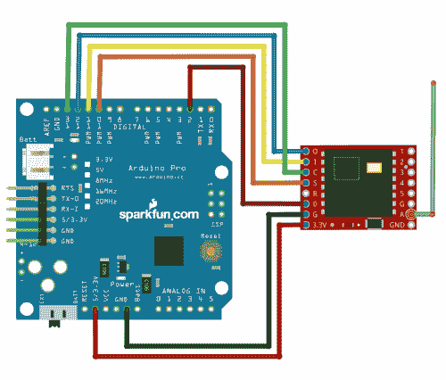](https://cdn.sparkfun.com/assets/7/9/4/c/7/fritzing-arduinopro.png)

请确保您使用的是“Beefy 3”FTDI 板、壁式电源或 Lipo 电池。普通的 FTDI Basic 无法提供足够的电流来运行 RFM69HCW。

3.3V Arduino Pro Mini 也是一个不错的选择，因为这两种主板都非常小:

[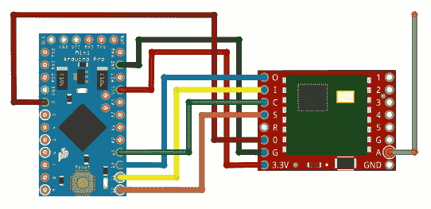](https://cdn.sparkfun.com/assets/e/1/9/1/1/fritzing-arduinopromini.png)

#### 5v arduino

您可以将 RFM69HCW 连接到 5V Arduino，如我们的 [RedBoard](https://www.sparkfun.com/products/12757) ，如果您在它们之间使用[逻辑电平转换器](https://www.sparkfun.com/products/12009)。转换器将 Arduino 的 5V 信号转换为 3.3V 信号，不会损坏 RFM69HCW:

[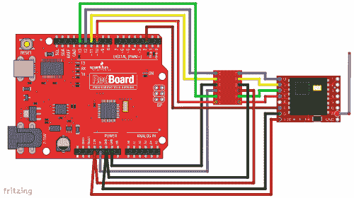](https://cdn.sparkfun.com/assets/f/1/0/e/9/fritzing-redboard.png)

5V Arduinos 有 5V 和 3.3V 两种电源。这里，我们使用 5V 电源(紫色线)为逻辑电平转换器的高压端供电，使用 3.3V 电源(红色线)为 RFM69HCW 和逻辑电平转换器的低压端供电。**切记不要将 5V 电压连接到 RFM69HCW。**

**PROTIP:** If you're using jumper wires to connect everything together, you can make handy "Y" jumper wires by cutting and splicing two regular jumper wires together.

### 外部状态 LED

还有一件事:我们将在几页中看到的示例代码会闪烁一个 LED 来指示数据何时被发送或接收。

不幸的是，我们不能为此使用 Arduino 的内置 LED，因为该端口(D13)也被 SPI 端口的 SCK 线使用。我们使用 SPI 端口与 RFM69HCW 进行通信，因此该 LED 会一直亮着。

为了弥补这一点，我们编写了示例代码，以便您可以将任何旧 LED 插入 Arduino，长(正极)引线在 D9，短(负极)引线在 D8。

该步骤是可选的，RFM69HCW 正常工作时不需要。

(通常我们会希望包含一个与 LED 串联的[限流电阻](https://learn.sparkfun.com/tutorials/resistors#current-limiting)，以防止 LED 被烧坏。但为了简单起见，我们将依赖 Arduino 的 I/O 端口内置的限流功能，同时我们将只在非常短的时间内打开它来指示发送或接收的数据包。)

## 天线

**IMPORTANT:** You MUST attach an antenna to the board. Aside from not working without an antenna, transmitters can be damaged if they transmit without an antenna present.

制造天线并不像听起来那么难。最简单的天线是一根切成适当长度的导线，并焊接到“A / ANT”引脚上。长度取决于主板的频率，为了方便起见，会在主板底部标出:

[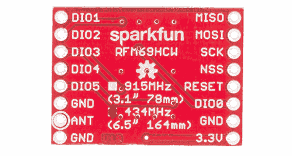](https://cdn.sparkfun.com/assets/learn_tutorials/2/1/9/12823-02.jpg)

| **频率** | **长度(英寸)** | **长度(毫米)** |
| 915 兆赫 | 3.07" (3 + 1/16") | 78 毫米 |
| 434 兆赫 | 6.47" (6 + 1/2") | 164 毫米 |

**参考消息:**这被称为[四分之一波长天线](http://en.wikipedia.org/wiki/Quarter-wave_antenna)，因为其长度是传输频率下全波长的四分之一。

**PROTIP:** Cut the antenna wire slightly longer to give yourself room to strip one end and solder it to your board. You can always trim it to the proper length after you solder it down.

### 天线放置

对于天线放置，您有几个选择:

#### 单天线

最简单的选择是将一根大小合适的天线导线焊接到“A”/“ANT”接头孔(周围有圆圈的那个)上，并将其垂直向上粘贴。就是这样！

[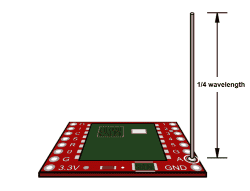](https://cdn.sparkfun.com/assets/b/e/0/d/9/board-oblique-monopole.png)**PROTIP:** If you can, keep all of the antennas in your network as vertical as possible. The radiation pattern from a vertical antenna is shaped like a donut laying on a table, with the strongest signal out to the sides and the weakest signal above and below (where the hole is). Keeping your antennas vertical will maximize the horizontal distance that your signal will reach.**IMPORTANT:** Radio waves will pass through plastic, but will be blocked by metal. Your radio module and antenna will work within a plastic box, but not a metal one.

如果您需要将天线缩短以适合塑料盒，您可以弯曲或盘绕天线(这将对范围和方向性产生不利影响)，但除非您知道自己在做什么，否则不要改变长度。

如果您使用的是金属盒，您应该将天线穿过一个孔，并将其伸出盒子(见下文)。此外，尽量让您的无线电模块和天线远离大型金属物体，因为金属会干扰传输。

您将从这种基本天线获得良好的效果，但如果您想要最大化您的范围，也请考虑以下选项:

#### 添加偶极子

天线喜欢下面有接地。RFM69HCW 板包含一个接地，但是接地越大越好。[偶极子](https://en.wikipedia.org/wiki/Dipole_antenna)是一种天线，它具有在电路板下方延伸的相同长度的接地线。这就产生了一个虚地，增加了天线的增益。

要制作偶极天线，剪下与天线长度相同的第二根电线，将其焊接到天线旁边的“G”/“GND”插头孔中，并使其指向天线的相反方向(垂直向下，而不是向上)。

[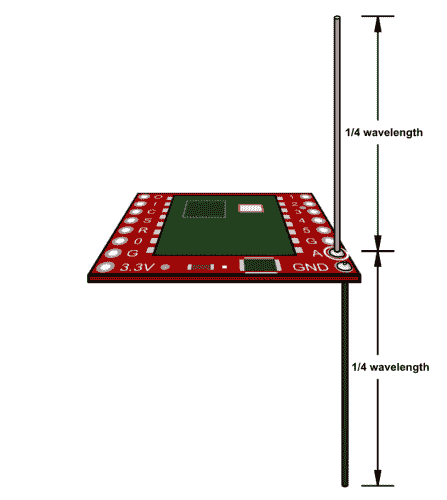](https://cdn.sparkfun.com/assets/4/7/6/b/e/board-oblique-dipole.png)

尽可能使两根电线保持笔直，处于自由空气中，并远离大型金属物体。

#### 远程安装

您可以将天线安装在离电路板很近的地方，方法是(理想情况下)使用 50 欧姆同轴电缆，或者(不太理想的情况下)在天线旁边敷设一根接地线。在天线的起点，简单地端接同轴屏蔽/地线，或者将其连接到接地层(见下文)或偶极子。(如上所述，天线的非屏蔽部分应为 1/4 波长)。

[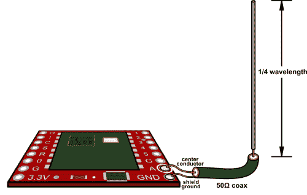](https://cdn.sparkfun.com/assets/3/1/2/2/3/board-oblique-coax-monopole.png)[](https://cdn.sparkfun.com/assets/5/e/6/1/0/board-oblique-coax-dipole.png)

#### 使用接地层

因为天线喜欢在下面有一个地面，最好的天线会高出一个良好接地的表面。如果您使用的是金属盒，或者将天线安装在车顶上，只要金属表面接地，您就可以将天线延伸到金属表面上方。(确保天线导线在穿过接地层时不会短路。)如果没有现成的金属表面，可以用铜带或铜箔网格、径向接地线等创建可行的接地层。

[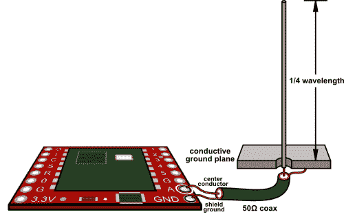](https://cdn.sparkfun.com/assets/c/0/d/1/a/board-oblique-coax.png)[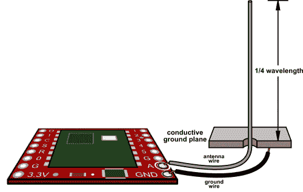](https://cdn.sparkfun.com/assets/3/f/3/8/b/board-oblique-remotewires.png)

### 连接商用天线

如果您想连接商用天线，您可以将一个 [SMA 连接器](https://www.sparkfun.com/products/593)焊接到 RFM69HCW 板上。将连接器放置在标有 G / A / G 的三个接头上，并在两侧进行焊接，以确保良好的连接。

**IMPORTANT:** Note that the above connector is SMA, not RP-SMA ("Reverse Polarity"). Ensure that your antenna has a true male SMA connector and was designed for the radio frequency of your RFM69HCW (915MHz or 430MHz).

### 其他天线类型

四分之一波长天线简单有效，但是，如果你需要额外的范围，还有其他天线设计，如[八木](http://en.wikipedia.org/wiki/Yagi_antenna)更具方向性，如果你可以将天线指向彼此，这将非常有用。

我们不是天线专家，所以这就是我们要离开你的地方。但是如果你对这个话题感兴趣，可以考虑参与业余无线电。这是了解天线设计和许多其他事情的好方法:[www.arrl.org](http://www.arrl.org)。

## 它是如何工作的

*“怎么会...它是如何工作的？”
“不知，吾王”
“查阅兵书！”
-巨蟒和圣杯*

以下信息将帮助您更好地理解 RFM69HCW 模块的工作方式，从而帮助您在项目中更有效地使用它。然而，如果你渴望马上开始使用它，你可以直接跳到[运行示例代码](https://learn.sparkfun.com/tutorials/rfm69hcw-hookup-guide/all#running-the-example-code)。

### 小包裹

为了节省功率并让多个模块共享同一频率，RFM69HCW 不连续发射。相反，它发送被称为**包**的短数据脉冲。您可以将这些视为从一个 RFM69 发送到另一个 RFM 69 的短消息。

数据包可以非常快速地重复发送，给人一种连续连接的错觉。此外，由于发射机只在传输每个数据包的几分之一秒内开启，因此许多模块可以共享相同的频率。

每个数据包最多可包含 61 个字节的数据。这是你从一个节点发送到另一个节点的实际信息。该数据可以是文本字符或二进制数；就 RFM69 而言，它只是一个数据块。如果需要发送 61 个字节以上，就多发送几个包。

消息的格式(包含的内容)完全由您决定。通常，您会为您的特定应用程序设计一种格式(例如，“三个由空格分隔的十进制数”)，并编写代码，以便发送方和接收方期望相同的格式。

### 演说

为了让消息从一个 RFM69 传到另一个 RFM 69，每个模块(通常称为**节点**)必须被赋予自己的**地址**。地址由两个数字组成:**网络号**，它就像所有节点居住的城镇，以及**节点号**，它就像一个单独的街道地址。这些数字的范围从 0 到 255。

你得到(而且必须得到！)选择这些数字。即使你只有两个节点，你也需要在你的代码中给它们地址号码。每次 RFM69HCW 通电时，该地址由您的代码设置；它不记得关机时的地址。

### 网络号

对于所有你想相互通话的 RFM69HCWs 来说，**网络号**应该是*相同的*。每个网络都将与所有其他网络隔离开来——网络 0 中的模块不会受到网络 1 中发生的任何事情的影响，等等。同一区域最多可以有 256 个网络运行，编号为 0 到 255。

### 节点号

对于您所有的 RFM69HCWs(在同一个网络上),**节点号**应该是*不同的*。这些是用于例如从节点 2 向节点 3 发送消息的单独地址。一个网络中最多可以有 255 个节点，编号从 0 到 254。

### 广播地址

眼尖的读者可能已经注意到，节点地址只到 254，而不是 255。那是因为 255 是一个特殊的“广播”地址；如果你发送一条消息到地址 255，*该网络上的所有*节点都会收到它。

### “混杂模式”

除了广播地址，节点之间发送的消息通常是“私有的”节点通常会忽略不是发给它们的消息。

然而，您可以打开一种叫做“混杂模式”的东西，它告诉节点接收它在网络上听到的每一条消息。这对于调试、将消息路由到无线电网络或从无线电网络路由消息等非常有用，但请注意，即使是混杂模式也不会让您听到在不同网络上发送的消息。

### 确认

当你发送一条消息时，你可以选择“在暗处”发送，希望接收者会收到它，或者你可以请求一个**确认**(通常简称为“ACK”)消息已被收到。事实上，RFM69 库可以自动重新发送消息，直到它收到来自接收方的确认(成功！)或者它已经重新发送了特定次数而没有响应(失败)。

是否使用确认取决于您的应用程序。如果您要发送的数据非常重要，或者如果您希望确保链路两端都正常工作，您可能需要使用确认。但是，有些应用在隐蔽环境中工作得更好，例如丢失消息不是大问题的高带宽数据、多个模块可能接收的信标、使用高方向性天线的单向链路等。这取决于你。

有一个问题:尽管在发送消息时请求确认很容易，但接收者不会自动发送确认。您的代码必须检查收到的确认请求消息，并手动发送确认消息。有关详细信息，请参见示例代码。

### 加密

如上所述，“混杂模式”将让你在一个给定的网络中悄悄地监听所有正在进行的对话。如果你在发送敏感信息，这对你来说可能不是好消息，因为其他人可能会听到你的谈话。幸运的是，RFM69 可以使用 AES(高级加密标准)加密来保护您的通信，这是非常安全的。

加密可以通过库命令打开或关闭(有关详细信息，请参见示例)。你还需要确保链接的两端使用的是*相同的* 16 字节密钥。只有使用完全相同的密钥的 RFM69s 才能解码消息。

**PROTIP:** Similarly, anyone who *has* the key will be able to decode your messages, so be sure to keep the key secret! In particular, remember that it will be saved along with your source code, so erase the key before saving it, or keep your source code secret as well.

## 运行示例代码

LowPowerLab 的菲利克斯·鲁苏为 RFM69 编写了一个优秀的 T2 Arduino 库，处理模块设置和数据收发的细节。本指南将介绍使用该库实现 RFM69HCW 与 Arduino 微控制器的接口。

如果您使用不同的微控制器，这里的信息加上[数据表](https://github.com/sparkfun/RFM69HCW_Breakout/blob/master/documentation/RFM69HCW-V1.1.pdf?raw=true)和 RFM69 库源代码应该有助于您启动和运行。(如果您为另一个系统编写示例代码，我们很乐意将它添加到我们的[代码库](https://github.com/sparkfun/RFM69HCW_Breakout)。

请注意，库的作者在[github.com/LowPowerLab/RFM69](https://github.com/LowPowerLab/RFM69)保存了最新版本。SparkFun 为 RFM69HCW 分线板创建了自己的存储库，其中包括该库的副本以及硬件原理图、示例代码等。在 github.com/sparkfun/RFM69HCW_Breakout 的。

### 安装 RFM69 库

希望你已经做过一些 Arduino 编程，并且知道如何安装一个库。如果没有，看看我们的教程:

*   [安装 Arduino IDE](https://learn.sparkfun.com/tutorials/installing-arduino-ide)
*   [使用 Github(检索示例代码和库)](https://learn.sparkfun.com/tutorials/using-github)
*   [安装 Arduino 库](https://learn.sparkfun.com/tutorials/installing-an-arduino-library)

**注意:**目前在 Arduino 库管理器中找不到这个库，所以你必须下载这个库并使用 **Add 添加它。ZIP 库...**在草图下找到选项>包含库菜单。

基本流程是:

1.  下载存储库的副本:

    [RFM69HCW GitHub Repository](https://github.com/sparkfun/RFM69HCW_Breakout/archive/master.zip)
2.  打开上述档案，进入“Libraries/Arduino”文件夹，复制“RFM69”文件夹，并通过库管理器添加该文件夹或将其粘贴到您的“Arduino/libraries”文件夹中。

3.  重启你的 Arduino IDE。

轻松点。

### 插上硬件

在本教程中，我们将设置两个 Arduino / RFM69 节点，并让它们相互通信。

如果你还没有，在本教程的[硬件连接](https://learn.sparkfun.com/tutorials/rfm69hcw-hookup-guide#hardware-connections)页做接线步骤。

此时，您应该有两个匹配的 Arduino plus RFM69HCW 节点。我们需要找出与这些节点相关的串行端口。将一根 USB 电缆插入电脑。一个新的 COM 端口号应该被添加到 Arduino IDE 的“工具/端口”列表中。写下来。现在，从第二个节点插入另一根 USB 电缆。应该会出现另一个 COM 端口号。把那个也写下来。

### 为每个节点定制代码

在将代码上传到 Arduino 之前，**您需要为每个节点定制代码。**使用下面的代码，对每个单独的节点进行如下更改。

#### 节点 1

让我们为您的第一个节点设置它:

1.  在代码顶部附近，查找`#define NETWORKID`，并将值更改为 0。这将是您的所有节点都属于的网络，因此它对您的所有节点应该是相同的。(当然，您可以将它设为 0 到 255 之间的任何数字，只要它对所有节点都相同。)

2.  现在查找`#define MYNODEID`行，并将值改为 1。那将是*这个*节点的地址。

3.  查找`#define TONODEID`行，并将值改为 2。那将是*其他*节点的地址；你要与之交谈的人。

4.  这些线下面是定义 RFM69HCW 板无线电频率的部分。取消注释与你的板的频率相对应的行，并确保其他行被注释(在它们前面有//。如果您忘记了，频率会标记在 RFM69HCW 板的底部)。

5.  如果您想使用加密，将`#define ENCRYPT`值更改为`true`，并将您选择的 16 个字符的字符串放入`ENCRYPTKEY`值中。该密钥对于网络上的所有节点都必须相同。保守秘密！

6.  最后，如果您希望使用确认，请将`USEACK`设置为`true`。如果没有，设置为`false`。对所有节点使用相同的设置。

**Note:** If you are using a Pro Micro, you will need to uncomment the following line:
**// radio.setCS(10); //uncomment this if using Pro Micro**

现在上传草图到你的第一个节点。请记住，您应该将“工具/端口”菜单设置为您之前为第一个节点记下的 COM 端口，如果您使用的是我们推荐的 3.3V Arduino Pro，您应该将“工具/板”菜单设置为“ **Arduino Pro 或 Pro Mini** ”并将“工具/处理器”设置为“ **ATmega328 (3.3V，8MHz)**

#### 附注 2

是时候修改第二个节点的草图了。

1.  回到`#define MYNODEID`行，将数字改为 2。那将是*这个*节点的地址。

2.  现在寻找`#define TONODEID`行，将数字改为 1。那将是*其他*节点的地址；你要与之交谈的人。

看到我们如何交换`MYNODEID`和`TONODEID`的数字了吗？这样，每个节点都会向另一个节点发送消息。

将草图上传到第二个节点。将“工具/端口”菜单更改为上面记下的第二个 COM 端口，然后上传。就这样，我们结束了！

### 加载并修改代码

将下面窗口中的代码复制到 Arduino IDE 中(首先确保编辑窗口完全空白)。在你安装了 RFM69 库之后，你也可以在 Arduino IDE 的“File/Examples/RFM 69/SFE _ RFM 69 hcw _ example . ino”下找到这段代码。不要忘记做上面提到的改变。

```
language:c
// RFM69HCW Example Sketch
// Send serial input characters from one RFM69 node to another
// Based on RFM69 library sample code by Felix Rusu
// http://LowPowerLab.com/contact
// Modified for RFM69HCW by Mike Grusin, 4/16

// This sketch will show you the basics of using an
// RFM69HCW radio module. SparkFun's part numbers are:
// 915MHz: https://www.sparkfun.com/products/12775
// 434MHz: https://www.sparkfun.com/products/12823

// See the hook-up guide for wiring instructions:
// https://learn.sparkfun.com/tutorials/rfm69hcw-hookup-guide

// Uses the RFM69 library by Felix Rusu, LowPowerLab.com
// Original library: https://www.github.com/lowpowerlab/rfm69
// SparkFun repository: https://github.com/sparkfun/RFM69HCW_Breakout

// Include the RFM69 and SPI libraries:

#include <RFM69.h>
#include <SPI.h>

// Addresses for this node. CHANGE THESE FOR EACH NODE!

#define NETWORKID     0   // Must be the same for all nodes
#define MYNODEID      1   // My node ID
#define TONODEID      2   // Destination node ID

// RFM69 frequency, uncomment the frequency of your module:

//#define FREQUENCY   RF69_433MHZ
#define FREQUENCY     RF69_915MHZ

// AES encryption (or not):

#define ENCRYPT       true // Set to "true" to use encryption
#define ENCRYPTKEY    "TOPSECRETPASSWRD" // Use the same 16-byte key on all nodes

// Use ACKnowledge when sending messages (or not):

#define USEACK        true // Request ACKs or not

// Packet sent/received indicator LED (optional):

#define LED           9 // LED positive pin
#define GND           8 // LED ground pin

// Create a library object for our RFM69HCW module:

RFM69 radio;

void setup()
{
  // Open a serial port so we can send keystrokes to the module:

  Serial.begin(9600);
  Serial.print("Node ");
  Serial.print(MYNODEID,DEC);
  Serial.println(" ready");  

  // Set up the indicator LED (optional):

  pinMode(LED,OUTPUT);
  digitalWrite(LED,LOW);
  pinMode(GND,OUTPUT);
  digitalWrite(GND,LOW);

  // Initialize the RFM69HCW:
  // radio.setCS(10);  //uncomment this if using Pro Micro
  radio.initialize(FREQUENCY, MYNODEID, NETWORKID);
  radio.setHighPower(); // Always use this for RFM69HCW

  // Turn on encryption if desired:

  if (ENCRYPT)
    radio.encrypt(ENCRYPTKEY);
}

void loop()
{
  // Set up a "buffer" for characters that we'll send:

  static char sendbuffer[62];
  static int sendlength = 0;

  // SENDING

  // In this section, we'll gather serial characters and
  // send them to the other node if we (1) get a carriage return,
  // or (2) the buffer is full (61 characters).

  // If there is any serial input, add it to the buffer:

  if (Serial.available() > 0)
  {
    char input = Serial.read();

    if (input != '\r') // not a carriage return
    {
      sendbuffer[sendlength] = input;
      sendlength++;
    }

    // If the input is a carriage return, or the buffer is full:

    if ((input == '\r') || (sendlength == 61)) // CR or buffer full
    {
      // Send the packet!

      Serial.print("sending to node ");
      Serial.print(TONODEID, DEC);
      Serial.print(", message [");
      for (byte i = 0; i < sendlength; i++)
        Serial.print(sendbuffer[i]);
      Serial.println("]");

      // There are two ways to send packets. If you want
      // acknowledgements, use sendWithRetry():

      if (USEACK)
      {
        if (radio.sendWithRetry(TONODEID, sendbuffer, sendlength))
          Serial.println("ACK received!");
        else
          Serial.println("no ACK received");
      }

      // If you don't need acknowledgements, just use send():

      else // don't use ACK
      {
        radio.send(TONODEID, sendbuffer, sendlength);
      }

      sendlength = 0; // reset the packet
      Blink(LED,10);
    }
  }

  // RECEIVING

  // In this section, we'll check with the RFM69HCW to see
  // if it has received any packets:

  if (radio.receiveDone()) // Got one!
  {
    // Print out the information:

    Serial.print("received from node ");
    Serial.print(radio.SENDERID, DEC);
    Serial.print(", message [");

    // The actual message is contained in the DATA array,
    // and is DATALEN bytes in size:

    for (byte i = 0; i < radio.DATALEN; i++)
      Serial.print((char)radio.DATA[i]);

    // RSSI is the "Receive Signal Strength Indicator",
    // smaller numbers mean higher power.

    Serial.print("], RSSI ");
    Serial.println(radio.RSSI);

    // Send an ACK if requested.
    // (You don't need this code if you're not using ACKs.)

    if (radio.ACKRequested())
    {
      radio.sendACK();
      Serial.println("ACK sent");
    }
    Blink(LED,10);
  }
}

void Blink(byte PIN, int DELAY_MS)
// Blink an LED for a given number of ms
{
  digitalWrite(PIN,HIGH);
  delay(DELAY_MS);
  digitalWrite(PIN,LOW);
} 
```

### 运行草图

现在有两个节点可以互相发送消息，但是，要使用它们，我们需要打开两个串行终端。

一种方法是运行两个*独立的*Arduino ide。你将不得不实际启动 Arduino 两次——你不能仅仅从第一个 IDE 中打开一个“新的”代码窗口。

将一个 IDE 设置为第一个节点的 COM 端口，将另一个 IDE 设置为第二个节点的 COM 端口。然后，从两个 ide 中打开串行监视器窗口。

在每个串行监视器窗口中，您需要将波特率设置为 9600，并确保“行尾”下拉菜单设置为“回车”(示例代码使用[回车](https://learn.sparkfun.com/tutorials/terminal-basics/basic-terminology-)作为发送数据包的信号。)

两个窗口都打开后，您应该能够在一个窗口顶部的文本输入框中键入消息，然后按 return 键将消息发送到另一个窗口。试试看！

[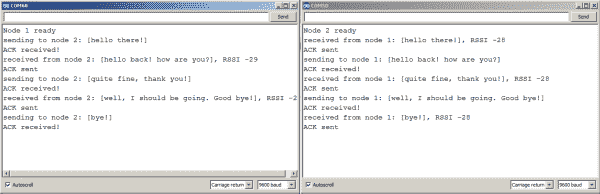](https://cdn.sparkfun.com/assets/learn_tutorials/2/1/9/chat.png)

您也可以尝试使用“广播地址”(255)等来打开或关闭确认和加密。

**PROTIP:** Having two Arduino IDEs open can lead to confusion when compiling and uploading code. If you load the example code into both IDEs, save one of them as a new name to keep the compilation and uploading separate.

你也可以试试这个[教程](https://learn.sparkfun.com/tutorials/terminal-basics)中提到的众多串行终端中的这一个。

### 信号强度

您可能已经注意到了示例代码输出的“RSSI”数字。“RSSI”代表“接收信号强度指示器”这是对接收到信息时传输强度的测量。

这个数字以分贝(dB)为单位，这意味着当节点彼此靠近时，这将是一个很低的数字，如-25，当它们远离时，它们将是更高的数字，如-50。通常您会忽略这个数字，但您可以用它来估计节点之间的距离，在链路变弱时发出警告，或者在复杂的应用中，改变发射强度以避免不必要的功耗。

**注:**在本节和示例代码中，*“数字”*的符号是指数值的大小，因为信号强度通常以小于 0 的值报告。准确地说，该值越低，信号强度的功率越低。*(即数值(-50)dB 小于(-25)dB；因此，(-50)dB 的信号强度较弱，可能更远。)*

## 资源和更进一步

在本教程中，我们将两个节点连接到同一台计算机，以便于从一个节点向另一个节点发送消息。但是，请记住，当您做自己的项目时，您的节点可能会连接到气象站、车库门、万圣节装饰品、无人机、机器人、您的猫...天空是无限的！

[示例代码](https://github.com/sparkfun/RFM69HCW_Breakout/blob/master/Libraries/Arduino/RFM69/examples/SFE_RFM69HCW_example/SFE_RFM69HCW_example.ino)有解释消息如何发送和接收的注释。请随意将它作为项目中代码的基础。

对于高级用法，您还可以查看库中的其他示例和源代码。 [RFM69.h](https://github.com/sparkfun/RFM69HCW_Breakout/blob/master/Libraries/Arduino/RFM69/RFM69.h) 和 [RFM69.cpp](https://github.com/sparkfun/RFM69HCW_Breakout/blob/master/Libraries/Arduino/RFM69/RFM69.cpp) 文件列出了所有的库函数，并告诉你一些它们的功能。

更多信息，请查看下面的链接。

*   [RFM69HCW GitHub 知识库](https://github.com/sparkfun/RFM69HCW_Breakout)
*   [RFM69HCW 原理图](https://cdn.sparkfun.com/datasheets/Wireless/General/RFM69HCW_BOB.pdf)
*   [RFM69HCW Eagle 文件](https://cdn.sparkfun.com/datasheets/Wireless/General/RFM69HCW_BOB.zip)
*   [RFM69HCW 数据表](https://cdn.sparkfun.com/datasheets/Wireless/General/RFM69HCW-V1.1.pdf)
*   SparkFun 产品展示:收发器！

这款收发器非常适合像建立一个远程切断开关这样的项目，当你的机器人离开时，它可以切断你项目的电源...有感觉。

[](https://learn.sparkfun.com/tutorials/how-to-build-a-remote-kill-switch) [### 如何建立一个远程断路开关

#### 2016 年 5 月 31 日](https://learn.sparkfun.com/tutorials/how-to-build-a-remote-kill-switch) Learn how to build a wireless controller to kill power when things go... sentient.[Favorited Favorite](# "Add to favorites") 18

要获得更多无线乐趣，请查看其他精彩的 SparkFun 教程:

[](https://learn.sparkfun.com/tutorials/ir-communication) [### 红外通信](https://learn.sparkfun.com/tutorials/ir-communication) This tutorial explains how common infrared (IR) communication works, as well as shows you how to set up a simple IR transmitter and receiver with an Arduino.[Favorited Favorite](# "Add to favorites") 42[](https://learn.sparkfun.com/tutorials/wireless-motor-driver-shield-hookup-guide) [### 无线电机驱动器屏蔽连接指南](https://learn.sparkfun.com/tutorials/wireless-motor-driver-shield-hookup-guide) Get started with the SparkFun Wireless Motor Driver Shield 2[](https://learn.sparkfun.com/tutorials/sparkfun-gps-breakout-zoe-m8q-and-sam-m8q-hookup-guide) [### SparkFun GPS 突破(ZOE-M8Q 和 SAM-M8Q)连接指南](https://learn.sparkfun.com/tutorials/sparkfun-gps-breakout-zoe-m8q-and-sam-m8q-hookup-guide) The SparkFun ZOE-M8Q and SAM-M8Q are two similarly powerful GPS units but with different project applications. We'll compare both chips before getting each up and running.[Favorited Favorite](# "Add to favorites") 1[](https://learn.sparkfun.com/tutorials/1w-lora-micromod-function-board-hookup-guide) [### 1W LoRa MicroMod 功能板连接指南](https://learn.sparkfun.com/tutorials/1w-lora-micromod-function-board-hookup-guide) Everything you need to get started with the 1W LoRa MicroMod function board; a MicroMod function board that provides LoRa capabilities for your MicroMod project. Must be used in conjunction with a MicroMod main board and processor.[Favorited Favorite](# "Add to favorites") 0

你想造一个由 RF69HCW 控制的机器人吗？试着看看这些博客帖子。

[](https://www.sparkfun.com/news/2186 "September 15, 2016: A new twist to the classic party game, Beer Pong!") [### Enginursday: SparkFun 乒乓

September 15, 2016](https://www.sparkfun.com/news/2186 "September 15, 2016: A new twist to the classic party game, Beer Pong!")[Favorited Favorite](# "Add to favorites") 1[](https://www.sparkfun.com/news/2700 "July 12, 2018: Here at SparkFun, we love our dogs. When we searched deep in our dog-loving hearts, we found one true question: What if they could talk? ") [### 今日英语:挖衣领

July 12, 2018](https://www.sparkfun.com/news/2700 "July 12, 2018: Here at SparkFun, we love our dogs. When we searched deep in our dog-loving hearts, we found one true question: What if they could talk? ")[Favorited Favorite](# "Add to favorites") 4****