# Shapeoko 装配指南

> 原文：<https://learn.sparkfun.com/tutorials/shapeoko-assembly-guide>

## 介绍

SparkFun 的豪华 Shapeoko 套件是一款 Carbide3D Shapoko 3，采用花哨的 SparkFun 红色，配有我们的开源 3 轴研磨机驱动程序 [Stepoko](https://www.sparkfun.com/products/13155) 。

[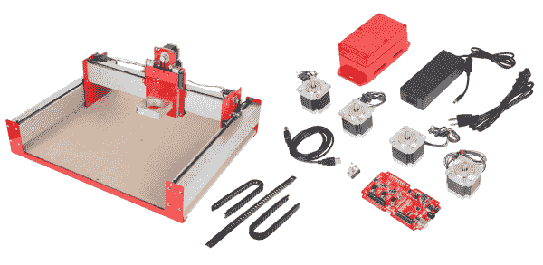](https://cdn.sparkfun.com/assets/learn_tutorials/5/0/6/overview.png)*The full kit. In this picture, the [Shapeoko parts](https://www.sparkfun.com/products/13713) have been assembled as per the Shapeoko guide, and the [SparkFun kit parts](https://www.sparkfun.com/products/13757) are shown beside it.*

### 指南内容

本指南指导您了解 Shapeoko 组装说明，然后通过最后的步骤将电子设备添加到研磨机中。

### 所需材料

*   [Shapeoko 汇编指令](https://drive.google.com/open?id=1qfTWocIAL8LGNLzAT395v2Oa9todR0w5) -拆箱前下载并阅读。每张纸上打印两页效果很好，以便手头有一份副本，并节省树木。
*   [Shapeoko 豪华套件内容 PDF](https://github.com/sparkfun/SparkFun_Stepoko/raw/master/Documentation/PartsList.pdf) -该列表准确反映了豪华套件中的内容，可用于在开始组装前验证装运。
*   一米左右的[备用线](https://www.sparkfun.com/products/11375)。
*   一把[烙铁](https://www.sparkfun.com/products/9507)和一些[焊料](https://www.sparkfun.com/products/9325)。
*   一个[万用表](https://www.sparkfun.com/products/12966)。
*   用于皮带夹的 2.5 毫米六角扳手。
*   钳子或小活动扳手。

### 推荐阅读

Stepoko 指南 -该指南讲述了 Stepoko 控制电子设备的工作原理。重要信息也在下面链接。

## 装配

1.  遵循 [Shapeoko 装配说明](https://drive.google.com/open?id=1qfTWocIAL8LGNLzAT395v2Oa9todR0w5)直到您到达添加控制器的部分。有一些差异，例如在这个工具包的电机有相同长度的电线，但没有太大的区别。使用从上述“所需材料”部分下载的[零件清单](https://github.com/sparkfun/SparkFun_Stepoko/raw/master/Documentation/PartsList.pdf)，而不是装配指南中的清单。

    **Set Aside Some Time** It may take about four hours to complete the initial assembly. Once you've got it, continue on.
2.  将 Shapeoko 安装到外壳中。为此，有 10 个 4-40 螺钉，但您只需要 8 个。使用 1 号十字螺丝刀。

    [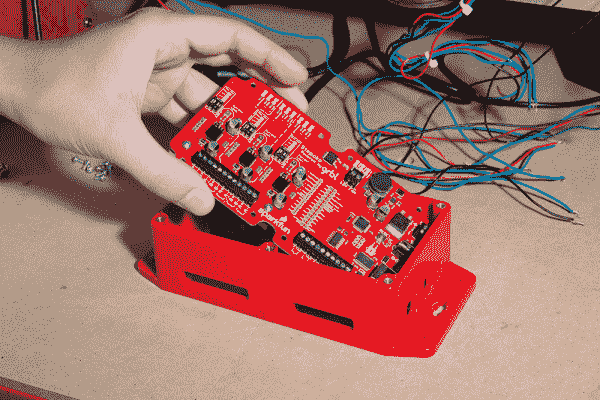](https://cdn.sparkfun.com/assets/learn_tutorials/4/5/6/Shapeoko_Tutorial-37.jpg)*To get the Stepoko into the enclosure, put the 'port end' in first.*[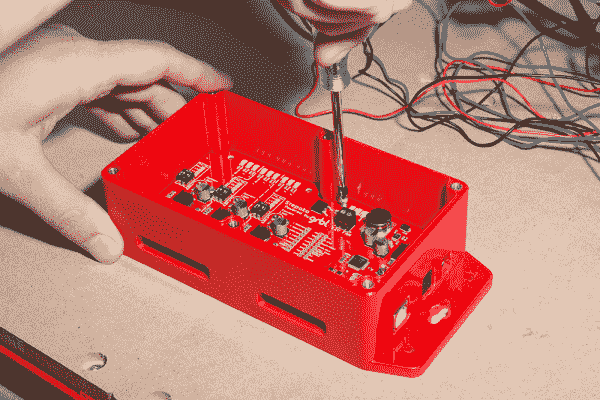](https://cdn.sparkfun.com/assets/learn_tutorials/4/5/6/Shapeoko_Tutorial-38.jpg)*Installing the 4-40 screws*
3.  准备安装控制器。首先进行试装，但不要马上安装，将其放下，以便可以添加衬垫，然后将其旋转到位。确保铝制散热器和挤压成型的导轨清洁无碎屑。

    [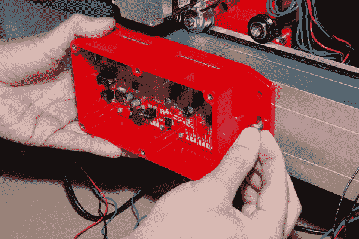](https://cdn.sparkfun.com/assets/learn_tutorials/4/5/6/Shapeoko_Tutorial-39.jpg)*Test fitting the enclosure -- the motor wires will go through the top*[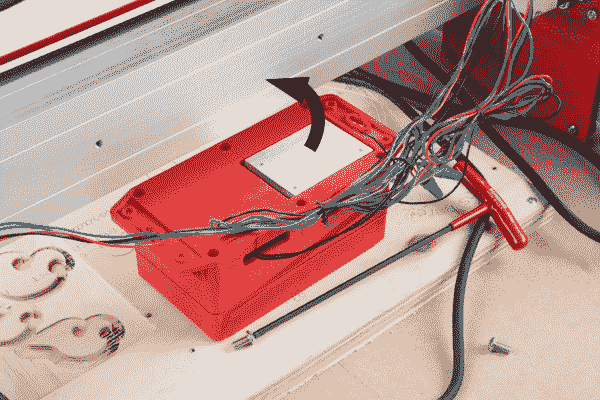](https://cdn.sparkfun.com/assets/learn_tutorials/5/0/6/Shapeoko_Thermal_Pad_Intstallation-02-ARROW.jpg)*Here the enclosure is ready to rotate up onto the mill into the correct orientation. This picture is shown with the wires installed. Don't worry if yours are not installed yet, that will be covered later.*
4.  剥去一侧的保护纸并丢弃。两边都要去掉，但现在只剥一个。

    [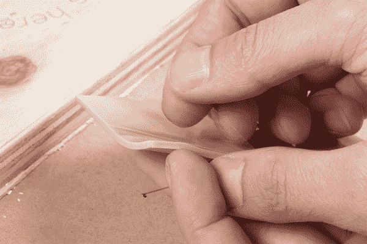](https://cdn.sparkfun.com/assets/learn_tutorials/5/0/6/Shapeoko_Thermal_Pad_Intstallation-03.jpg)*Peeling the protective sheet. Once removed, the rigidity of the material changes completely*
5.  抓住边角，将衬垫放在露出的散热器上，并轻轻按压到位。一般只需要居中并与散热片边缘重叠即可。它的大小是这样确定的，以下两点可以确保它处于正确的位置:

    *   长边与外壳边缘齐平，朝向电机电线。
    *   短边与锁眼安装孔齐平。[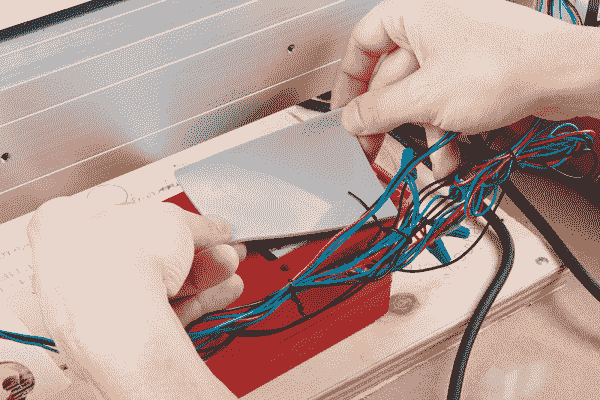](https://cdn.sparkfun.com/assets/learn_tutorials/5/0/6/Shapeoko_Thermal_Pad_Intstallation-04.jpg)*Lowering the pad*[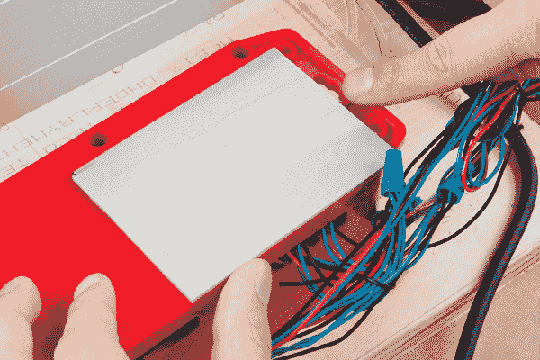](https://cdn.sparkfun.com/assets/learn_tutorials/3/8/7/Shapeoko_Thermal_Pad_Intstallation-05.jpg)*Checking for proper alignment. Here, my thumb checks flushness on one edge while I point out the proper alignment near the mounting hole.*
6.  剥去第二层保护层。

    [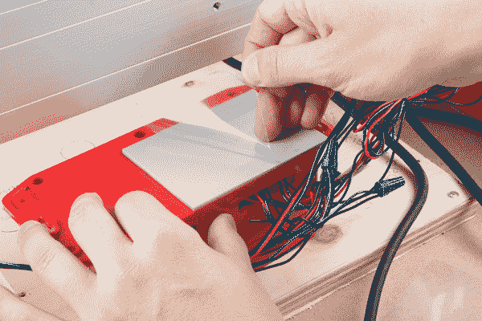](https://cdn.sparkfun.com/assets/learn_tutorials/5/0/6/Shapeoko_Thermal_Pad_Intstallation-06.jpg)*Removing the protective sheeting*
7.  安装 Stepoko 控制器。衬垫会增加厚度，导致外壳脱离研磨机，所以不要太用力拧紧安装螺栓。使用螺纹锁固剂防止螺钉因振动而退出。或者，这里可以使用比衬垫略薄的平垫圈。

    [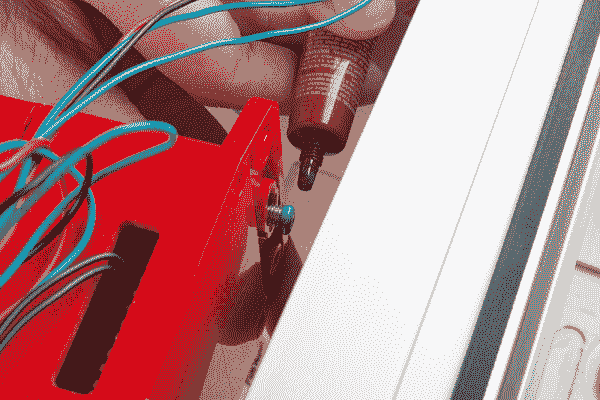](https://cdn.sparkfun.com/assets/learn_tutorials/5/0/6/Shapeoko_Thermal_Pad_Intstallation-07.jpg)*Applying threadlocker -- Here, a bit too much is used. It only needs to be filling in the treads. Excess may run.*[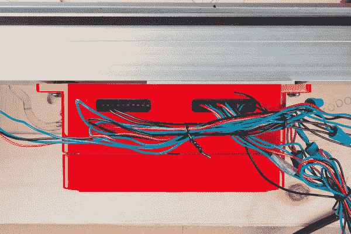](https://cdn.sparkfun.com/assets/learn_tutorials/5/0/6/Shapeoko_Thermal_Pad_Intstallation-08.jpg)*The finished installation. Notice that the enclosure is nice and even and not deformed along the mill.*
8.  将存储模块安装到导轨上，端子连接位于顶部。使用 Shapeoko 提供的额外 M6x12mm 螺栓。

9.  将 X 轴和 Z 轴连接到 Stepoko。有关更多信息，请查看 Stepoko 指南的[硬件:连接电机](https://learn.sparkfun.com/tutorials/stepoko-powered-by-grbl-hookup-guide#hardware-connecting-the-motors)部分。

    *   用一些焊料给电线末端上锡。
    *   [用你的仪表识别电机内部连接了哪对电线](https://learn.sparkfun.com/tutorials/how-to-use-a-multimeter#continuity)。
    *   将线圈与 Stepoko 上的绕组符号匹配。无论是极性或 A-B 位置将工作，但可能会使电机旋转的其他方式。这可以在软件中改变。[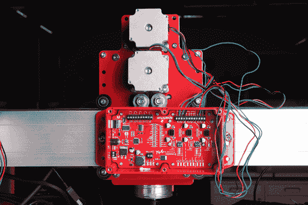](https://cdn.sparkfun.com/assets/learn_tutorials/4/5/6/Shapeoko_Tutorial-40.jpg)*The X and Z axis are connected.*
10.  连接 Y 轴。但是等等！它有两个并联的电机。

    如果两个步进电机并联，它们可能不会以相同的方向旋转，因为内部极性可能不同。解决这个问题的方法是调换一对线圈导线的颜色。这种极性/旋转方向问题由于电机在研磨机上是镜像的并且实际上需要旋转不同的方向而变得复杂。

    观看下面的视频，获得一个基本的想法，然后完成这些步骤。

    *   将短引线连接到 Y 轴端子。
    *   识别线圈。
    *   将每个电机的一个线圈按颜色分组，极性相反的除外。
    *   扭转两端进行测试。
    *   尝试在 Y 轴上移动铣刀。如果移动顺利，焊接电线并使用热缩/绝缘胶带，或使用线螺母。
    *   如果轴粗略移动，不像 X 轴和 Z 轴，过滤一对线圈中的一个,使其具有相同的颜色组合，但保留另一个反转。这是因为电机线圈的内部接线并不总是一样的。

    [https://www.youtube.com/embed/TuDtK8HvXIw/?autohide=1&border=0&wmode=opaque&enablejsapi=1](https://www.youtube.com/embed/TuDtK8HvXIw/?autohide=1&border=0&wmode=opaque&enablejsapi=1)

    *Take a quick look at this video to see, and hear, how the Y axis when wired incorrectly, and correctly.*
11.  设置电机驱动电流。确保 trimpots 在 1A 服务中心，直到你更有经验。或者，阅读 Stepoko 指南的[硬件:设置电流](https://learn.sparkfun.com/tutorials/stepoko-powered-by-grbl-hookup-guide/hardware-setting-the-current)部分，了解电流设置如何工作。

    [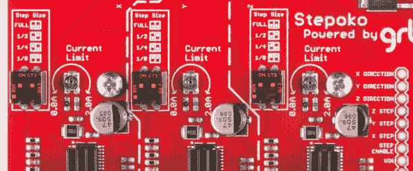](https://cdn.sparkfun.com/assets/learn_tutorials/4/5/6/potscentered.jpg)*The trimpots are centered for 1 A drive in this photograph.*
12.  将开关安装到机架端板上的自由孔中，并焊接引线。

    [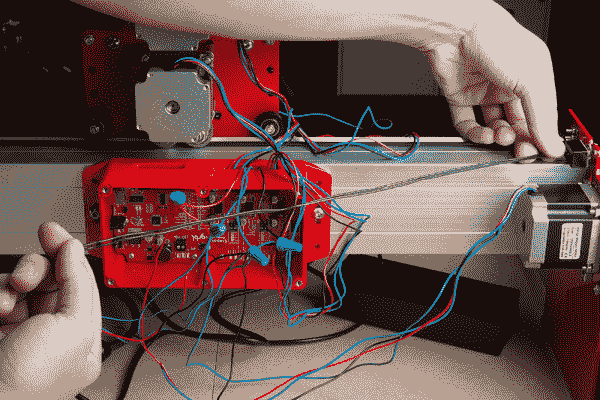](https://cdn.sparkfun.com/assets/learn_tutorials/4/5/6/Shapeoko_Tutorial-30.jpg)*Here the switch has been mounted and the switch wires are being measured. They go into the two terminals labled E-Stop.*[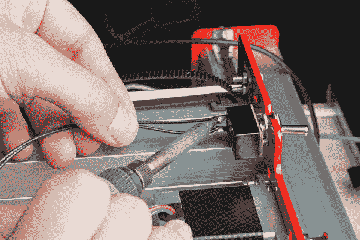](https://cdn.sparkfun.com/assets/learn_tutorials/4/5/6/Shapeoko_Tutorial-31.jpg)*Soldering on the leads.*[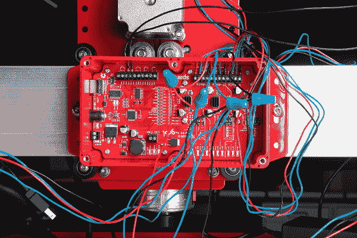](https://cdn.sparkfun.com/assets/learn_tutorials/4/5/6/Shapeoko_Tutorial-32.jpg)*All of the wires are added for this mill setup.*
13.  使用 1 号或 2 号十字螺钉将盖子拧入外壳。

    [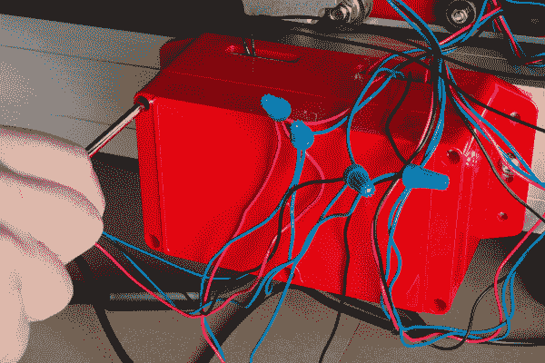](https://cdn.sparkfun.com/assets/learn_tutorials/4/5/6/Shapeoko_Tutorial-33.jpg)
14.  收集你的电线，用扭结或拉链扎紧。

    [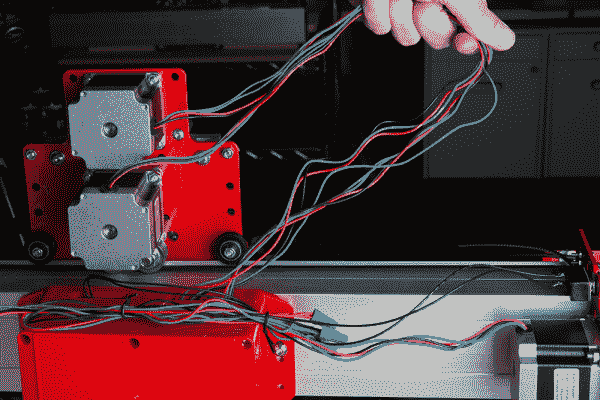](https://cdn.sparkfun.com/assets/learn_tutorials/4/5/6/Shapeoko_Tutorial-34.jpg)*The Y axis wires have been twist tied together here. The X and Z axes are gently pulled out to see how long they are.**With the X axis moved ofer to one end, I can see that my bound wires have enough slack so that they won't be pulled on when the carriage moves.***Caution:** If milling conductive materials, be sure to seal up the openings where the wires pass through. Conductive dust that enters the enclosure can short out the circuits.
15.  连接电脑和 Stepoko 之间的电源、电源线和 USB 线

16.  打开通用 Gcode 发送器，打开 Stepoko 的串行端口，并选择机器控制选项卡。将开关拨到“开”的位置，试着用计算机控制来移动机器。如果轴向您喜欢的错误方向移动(当然，up 应该是正 Z)，相应地切换方向位域。使用 Stepoko 指南的[软件:机器控制](https://learn.sparkfun.com/tutorials/stepoko-powered-by-grbl-hookup-guide/software-machine-control-universal-g-code-sender)部分获取更多关于 grbl 的信息，或者查看 grbl 的 Github [wiki](https://github.com/winder/Universal-G-Code-Sender/wiki) 获取更多关于更改设置的信息。

17.  测量已知运动并校准每个轴。更多信息参见 Stepoko 指南的[固件:配置 grbl 和校准](https://learn.sparkfun.com/tutorials/stepoko-powered-by-grbl-hookup-guide#firmware-configuring-grbl-and-calibrating)部分。

## 收尾

[线缆托架](https://www.sparkfun.com/products/13207)已包含在您的套件中，有助于线缆管理，但您可以自行决定携带何种线缆以及它们的摆放位置。它们可以在轴上向任何方向移动，不需要全长就能完成工作。

本节显示了在磨头和横梁之间安装电缆托架。对于任何轴，该过程都是相同的。

1.  首先找到电缆托架的位置和长度。将载体的固定端固定在您认为它应该移动的位置，并在整个范围内移动磨头，以确保电缆载体沿着移动轴自由移动。或者，模拟磨机的运动来近似检查运动。如果电线中没有足够的间隙，或者如果线圈离工厂太远，应该缩短电缆托架。

    | [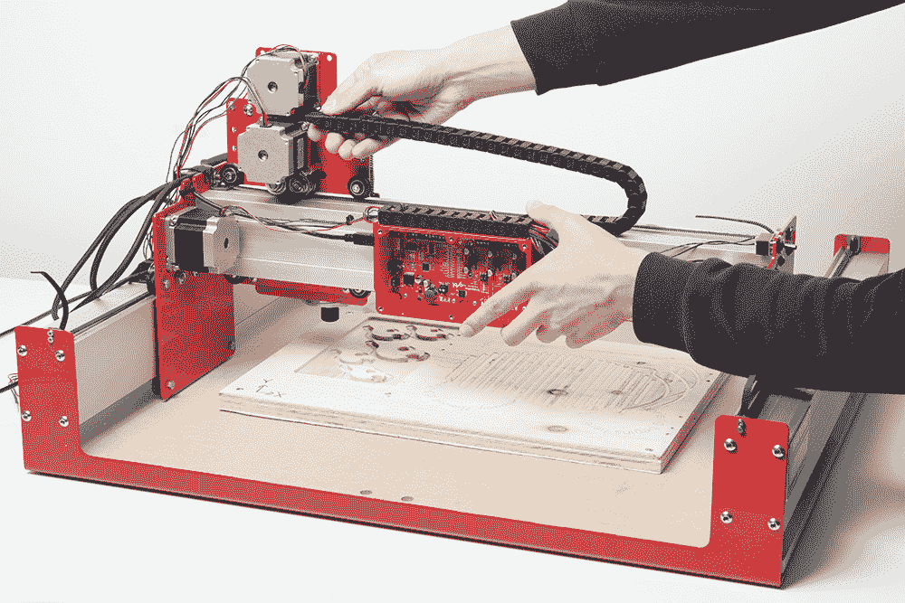](https://cdn.sparkfun.com/assets/learn_tutorials/5/0/6/Shapeoko_Update-09.jpg) | [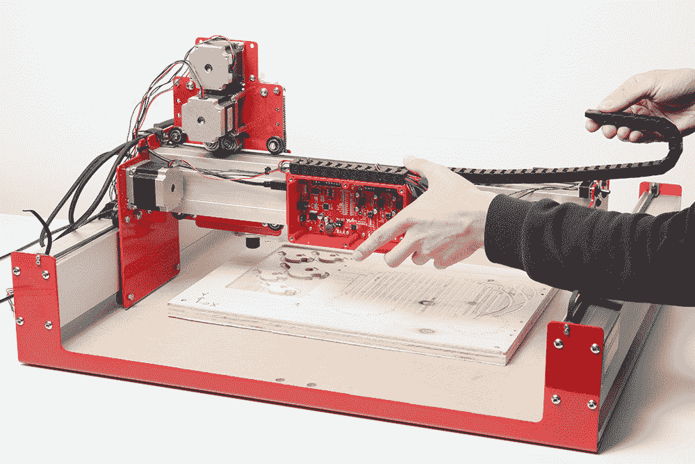](https://cdn.sparkfun.com/assets/learn_tutorials/5/0/6/Shapeoko_Update-08.jpg) |

    *Mimic the motion of the axis to get a good idea where to mount the fixed end and how long the carrier needs to be.*
2.  将电线穿过托架。在直的金属线上放一根钩线或带子会有帮助。当运行多组相似颜色时，用记号笔或胶带对每组做不同的标记。

    [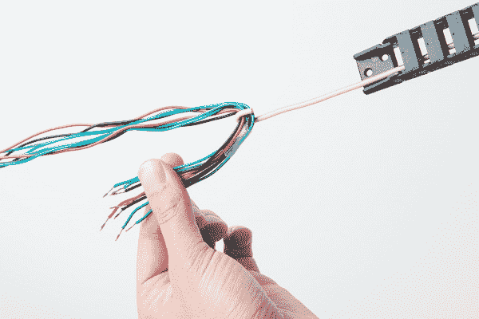](https://cdn.sparkfun.com/assets/learn_tutorials/5/0/6/Shapeoko_Update_Images-02.jpg)*Use a helper wire to thread the cable carriers. Here, four of the eight wires have a tape wrap to indicate that they belong to the same motor*[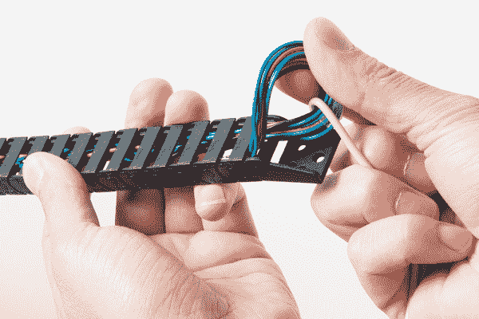](https://cdn.sparkfun.com/assets/learn_tutorials/5/0/6/Shapeoko_Update_Images-03.jpg)*The wires are probably not long enough to pull through with a bend, so carefully work the ends free.*
3.  确定固定端的位置后，剪下一小块双面胶带，牢牢压住托架。对于这些 Shapeoko 轧机，确保挤压时没有东西穿过中心线。

    [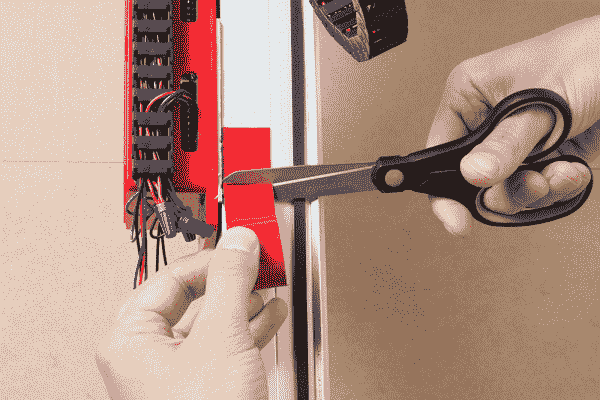](https://cdn.sparkfun.com/assets/learn_tutorials/5/0/6/Shapeoko_Update_Images-05.jpg)*Here, the tape is being dispensed directly onto the location and cut right in place. Notice that it does not cross the center line.*
4.  检查电线是否能到达端子，轴是否有全范围的运动，滚轮螺栓是否错过了电缆托架。然后最后一次连接电机电线。

    [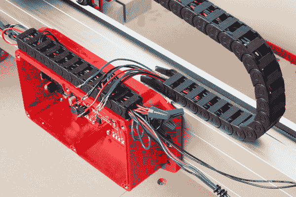](https://cdn.sparkfun.com/assets/learn_tutorials/5/0/6/Shapeoko_Update_Images-06.jpg)*A view of the installed cable carrier. Also shown, the strip of cable carrier on the enclosure is a convenient place to stuff fixed wires -- just pull them in with your wire hook. This is made from extra bits of the other carriers from when they were shortened.*[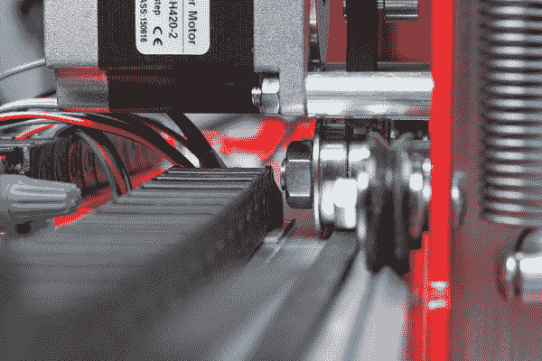](https://cdn.sparkfun.com/assets/learn_tutorials/5/0/6/Shapeoko_Update_Images-07.jpg)*The roller clears the cable carrier with no problems! If this is not the case, simply peel up the cable carrier, and try again.*

## 资源和更进一步

这里有一些你可能会觉得有用的链接和项目。

*   [Stepoko 连接指南](https://learn.sparkfun.com/tutorials/stepoko-powered-by-grbl-hookup-guide#hardware-the-system-and-power-supply) -深入了解 Stepoko。
*   [step oko GitHub 库](https://github.com/sparkfun/SparkFun_Stepoko) -原理图和 Gcode 示例。
*   [grbl GitHub 库](https://github.com/grbl/grbl) -链接到 grbl 源和 wiki，获取设置信息。
*   参见这个 [Shapeoko Coaster 项目](https://learn.sparkfun.com/tutorials/shapeoko-coaster-project)的一个完整项目的绘图和铣削示例。
*   我们的[电缆载波产品视频](https://youtu.be/4VnistB9LC8)展示了一些替代载波安装。

或者，返回到[step oko 和 Shapeoko 登录页面](https://www.sparkfun.com/stepoko)查看可用的附件和工具。

现在你已经建立了你的 Shapeoko 磨，看看这些其他的 SparkFun 教程，学习如何使用 SparkFun Stepoko 控制板。

 [### Stepoko:由 grbl 连接指南提供支持

#### 2015 年 11 月 20 日](https://learn.sparkfun.com/tutorials/stepoko-powered-by-grbl-hookup-guide) Hardware guide for the Stepoko[Favorited Favorite](# "Add to favorites") 3

一旦你熟悉了 Stepoko，跟随 Shapeoko SparkFun 过山车创建你的第一个项目。

 [### Shapeoko Coaster 项目

#### 2015 年 11 月 20 日](https://learn.sparkfun.com/tutorials/shapeoko-coaster-project) A step-by-step guide to cutting and engraving a coaster with the Shapeoko.[Favorited Favorite](# "Add to favorites") 3