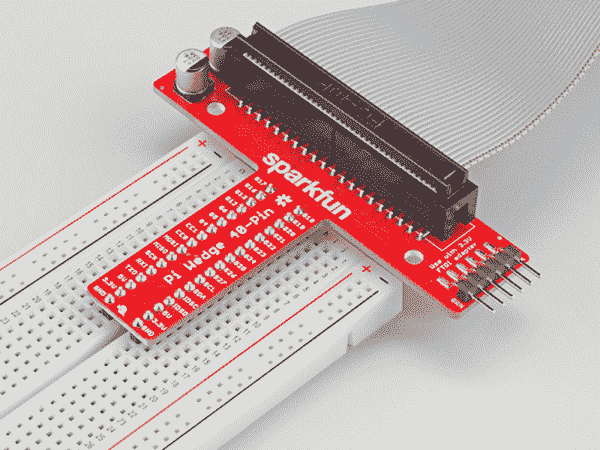
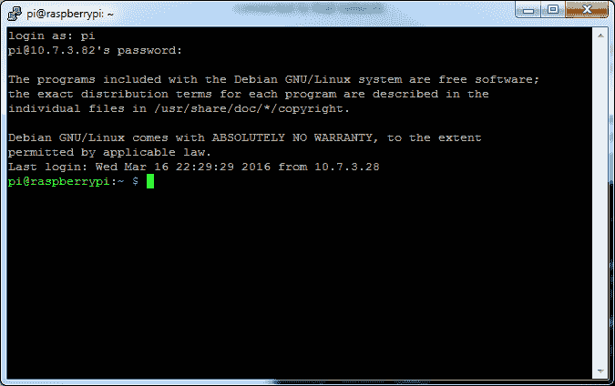

# 树莓 Pi 3 入门套件连接指南

> 原文：<https://learn.sparkfun.com/tutorials/raspberry-pi-3-starter-kit-hookup-guide>

## 介绍

**Heads up!** The Raspberry Pi 3 Model B+ has the same mechanical footprint as both the Raspberry Pi 3 Model B and the Raspberry Pi 2 Model B. This guide will show images of the Pi 3 Model B but you can still follow along with the Pi Model B+! If you are using the Raspberry Pi 4, we recommend that you [check out the updated guide](https://learn.sparkfun.com/tutorials/raspberry-pi-4-kit-hookup-guide).

现在 [Raspberry Pi 3 Model B](https://www.sparkfun.com/products/13825) 和 [Pi 3 Model B+](https://www.sparkfun.com/products/14643) 是 Raspberry Pi 单板计算机系列中最新最棒的，有什么新的吗？这个连接指南经历了与 Pi 2 相同的过程，但是从 Pi 3 的角度来看。

[](https://www.sparkfun.com/products/15361) 

### [树莓派 3 B+入门套件](https://www.sparkfun.com/products/15361)

[Out of stock](https://learn.sparkfun.com/static/bubbles/ "out of stock") KIT-15361

Raspberry Pi 3 B+初学者工具包是一个很好的方式来获得对小型信用卡大小的计算机的可靠介绍。

2[Favorited Favorite](# "Add to favorites") 17[Wish List](# "Add to wish list")

### 本教程涵盖的内容

*   [套件装配](https://learn.sparkfun.com/tutorials/raspberry-pi-3-starter-kit-hookup-guide#assembly)
*   [获得操作系统](https://learn.sparkfun.com/tutorials/raspberry-pi-3-starter-kit-hookup-guide#getting-an-os)
*   [使用 pi 的方法](https://learn.sparkfun.com/tutorials/raspberry-pi-3-starter-kit-hookup-guide#methods-of-working-with-the-pi)
*   [配置 Pi](https://learn.sparkfun.com/tutorials/raspberry-pi-3-starter-kit-hookup-guide#configuring-the-pi)
*   [使用 GPIO 的资源](https://learn.sparkfun.com/tutorials/raspberry-pi-3-starter-kit-hookup-guide#reading-inputs-and-toggling-the-leds)

### 所需材料

首先，你需要一个鼠标、键盘和显示器。一旦完成配置，pi 就可以从自己的外围设备或通过互联网连接的另一台计算机上进行操作。

**Note:** The serial port still has a few bugs, so it's not recommended to use for configuration. Raspbian can be hacked to get it to work but it's not covered by this guide. This [Pi forum post](https://www.raspberrypi.org/forums/viewtopic.php?f=63&t=138162) talks about the serial port in more depth.

**作为桌面，需要这些材料:**

*   Pi 3 入门套件-或- Pi 3/2 附件套件和您自己的 Pi
*   USB 鼠标
*   USB 键盘
*   HDMI 监视器/电视/自适应 VGA

**配置后，Telnet/SSH 上的“无头”操作需要:**

*   Pi 3 入门套件-或- Pi 3/2 附件套件和您自己的 Pi
*   通过互联网连接的第二台计算机
*   Telnet/ssh 终端软件

你还需要互联网连接来获取资源！该链接可以是有线或 wifi，并且必须可供 Pi 使用。对于无线连接，您可以使用车载 WiFi 天线。

### 建议阅读和查看

在继续之前，您可能需要查看以下教程和视频。

*   [串行终端基础知识](https://learn.sparkfun.com/tutorials/terminal-basics/all)
*   [Raspberry gPIo](https://learn.sparkfun.com/tutorials/raspberry-gpio) -也是后来连接的
*   [Pi 楔形连接导轨](https://learn.sparkfun.com/tutorials/preassembled-40-pin-pi-wedgehookup-guide)
*   树莓派入门- **视频系列**
    *   [第一部分](https://www.youtube.com/watch?v=b6h95jNWg1g)
    *   [第二部分](https://www.youtube.com/watch?v=6HeRyrr4i9k)
    *   [第三部分](https://www.youtube.com/watch?v=1tEMRCtXALM)

## 装配

Pi 非常简单明了，很容易组合在一起，但是如果有些事情看起来不太对劲，这一部分会让你知道它应该是什么样子。

[](https://cdn.sparkfun.com/assets/learn_tutorials/4/9/6/Raspberry_Pi_3_Hookup_Guide-01.jpg)*Unbox and gather these components before beginning the assembly*

1.  将 Pi 卡入“罐”的底部，然后将顶部卡入到位。

    [](https://cdn.sparkfun.com/assets/learn_tutorials/4/9/6/Raspberry_Pi_3_Hookup_Guide-02.jpg)

    将圆饼放进罐子的底部。确保 Pi 完全就位。检查 PCB 周边是否均匀凹陷。

    [](https://cdn.sparkfun.com/assets/learn_tutorials/4/9/6/Raspberry_Pi_3_Hookup_Guide-03.jpg)

    *将两半点击在一起*

2.  添加 SD 卡

    [](https://cdn.sparkfun.com/assets/learn_tutorials/4/9/6/Raspberry_Pi_3_Hookup_Guide-04.jpg)

    *安装 SD 卡-确保 microSD 卡在正确插入时与外壳侧面齐平。Pi 3 microSD 插槽不像以前的 pis 那样有弹簧，所以如果它与标签向外齐平，它就正确就位。*

3.  将带状电缆连接到 Pi -请注意，引脚 1 标记非常细微。将电缆上的红色条纹朝向 SD 卡。或者，可以通过查找 pi 上接头丝印的缺角/斜角来识别引脚 1。

    [](https://cdn.sparkfun.com/assets/learn_tutorials/4/9/6/Raspberry_Pi_3_Hookup_Guide-06.jpg)

    *Pi b+和 Pi B 之间的引脚 1 位置和丝网印刷是相同的。此图显示了部分插入的带状电缆，没有外壳挡道。带状电缆的红色“pin 1”标记指向 SD 卡插槽。*

4.  将带状电缆连接到楔块上。引脚 1 指向 FTDI 适配器。

    [](https://cdn.sparkfun.com/assets/learn_tutorials/3/9/4/Raspberry_Pi_2_Kit-07.jpg)

    *将带状电缆的末端插入楔形物。它是键控的，但是电缆的每一端是不同的。确保色带远离试验板连接。*

5.  将楔子插入你的试验板

    [](https://cdn.sparkfun.com/assets/learn_tutorials/3/9/4/Raspberry_Pi_2_Kit-02_cropped.jpg)

    *楔块插入试验板。*

6.  将匹配“GRN”到“GRN”和“BLK”到“BLK”的 FTDI 连接器连接到板之间。

    [](https://cdn.sparkfun.com/assets/learn_tutorials/3/9/4/Raspberry_Pi_2_Kit-08.jpg)

    *FTDI 串行适配器与 GRN 和 BLK 连接相匹配*

7.  连接所需的消费者计算机设备。

    [](https://cdn.sparkfun.com/assets/learn_tutorials/4/9/6/Raspberry_Pi_3_Hookup_Guide-07.jpg)

    完全组装好的套件。除套件外，还显示了用户提供的显示器、鼠标和键盘。这台 Pi 现在是一台台式电脑。

## 获得操作系统

**Note:** At the time this was written, the kit comes with a 16GB card loaded with the Noobs OS installation image, version 1.9.0\. This card should be ready to boot right out of the box.

### 获得新图像

如果某些东西不工作，或者安装已经被破坏(你在文件系统中捣乱吗？)，获得新副本很容易。

*   从[raspberrypi.org](https://www.raspberrypi.org/downloads/noobs/)获得 Noobs 操作系统。
*   格式化卡以删除所有文件。
*   将 Noobs zip 文件的内容解压缩到已格式化的空 microSD 卡中。

就是这样！你已经准备好了。对于其他成像，请查看关于 [sd 卡和写入图像](https://learn.sparkfun.com/tutorials/sd-cards-and-writing-images)的教程:

[](https://learn.sparkfun.com/tutorials/sd-cards-and-writing-images) [### SD 卡和书写图像](https://learn.sparkfun.com/tutorials/sd-cards-and-writing-images) How to upload images to an SD card for Raspberry Pi, PCDuino, or your favorite SBC.[Favorited Favorite](# "Add to favorites") 19

你也可以看看树莓基金会的这份指南。

### 第一只靴子

在你第一次使用电源之前，浏览一下飞行前的检查清单。

*   microSD 卡是否安装牢固？
*   HDMI 是否已连接，显示器是否已通电？
*   鼠标和键盘插上了吗？
*   鼠标和键盘是标准的 USB，不是无线的吗？-某些无线键盘无法枚举，因此请使用您信任的键盘。
*   整个系统是否安全地放在你的桌子上，不会一接触就跳到地板上？

好了，你已经准备好给 Pi 供电了。

**Power Adapter Requirement!** Make sure the power being supplied is from the included [5.24V, 2.4A power supply](https://www.sparkfun.com/products/13831) and not your USB connection. The USB most likely won't have enough current supplying capacity and will result in a brown-out of the Pi that can damage it, and it will likely mess up the files on your SD card.

首先，您应该看到屏幕上出现一个彩色图表，表明 Pi 有电，正在做一些事情，但是还没有加载软件。

接下来，Noobs 询问是否应该安装 raspbian 发行版。选中复选框以选择它，并在此选择您的语言/键盘布局(也可以在以后更改)。

Noobs 需要几分钟来管理分区和安装操作系统。

完成后，它应该报告操作系统安装成功。单击确定，Pi 将重新启动进入图形界面。

Noobs 的默认配置是以用户`pi`，密码`raspberry`自动登录。

### 执行完整的系统升级

一旦连接到互联网(参见[配置 Pi](https://learn.sparkfun.com/tutorials/raspberry-pi-3-starter-kit-hookup-guide#configuring-the-pi) 部分)，更新当前安装的所有软件包是一个好主意。通常，新的软件包会替换有缺陷的旧软件包，但有时新软件包也会有自己的缺陷。如果你现在的系统很稳定，各项功能都不错，也许就不要升级了。如果你正在开始一个新的项目，在你开始投入工作之前，让一切都保持最新*。*

在 shell 中输入以下命令(这个过程大约需要 10 分钟)。

*   `sudo apt-get update` -去取最新的包裹信息。
*   `sudo apt-get upgrade` -然后回答 y .升级所有的包。这个阶段需要一段时间。
*   `sudo shutdown -r now` -重启机器。

## 使用 Pi 的方法

一旦配置了 Pi，就有几种使用它的方法，这取决于您是想像桌面一样使用它还是远程管理它。

本节介绍如何以下列方式使用 Pi

*   **使用 HDMI-out** -像操作台式电脑一样操作您的 Pi。
*   使用串行终端 -一些功能，但在最新的 Raspbian 版本中有问题。
*   **使用 SSH** -通过连接到另一台计算机的网络进行操作。

### 使用 HDMI-out

Noobs 1.8.0，带 Raspbian，自动登录，启动图形用户界面。

如果配置为引导到 shell，使用用户名`pi`和密码`raspberry`登录。然后，在命令行中输入`startx`，进入一个图形环境，呈现给你的是一个桌面型菜单驱动的操作系统。

如果你需要回到文本世界，你可以

*   通过任务栏菜单注销——返回到 shell，关闭 X 窗口系统
*   从任务栏打开 xterm 在图形窗口中打开一个 shell
*   使用 CTRL-ALT-1 到 CTRL-ALT-8——给出了一些 shells，7 是图形环境(如果加载的话)。

请记住，使用菜单项关机或从 shell 中输入`sudo shutdown -h now`,并等待系统停止后再断开电源。

### 使用串行终端而不使用监视器

将 FTDI(或任何 usb 转串行转换器)连接到迷你 usb 电缆，并插入电脑的 USB 端口。

将终端设置设为 **72000** 波特、8 位、无奇偶校验、1 次停止和无流量控制。这是一个奇怪的速度，比以前慢了 1.6 倍。此外，CPU 频率会影响符号速率，因此使用此接口时要小心，并计划通过不同的方法进行管理。

### 使用 SSH

操作 Pi 的一个好方法是将它连接到本地网络的某个地方，然后从连接到同一网络的另一台计算机上管理它。

**Note:** This method relies on a local Internet connection. Work through the configuration process with the monitor/mouse/keyboard or serial terminal (described below), then come back here.

为此，[为您的系统下载 PuTTY](http://www.putty.org/) 或类似的 SSH 终端，并连接到 pi 使用的互联网端口。TTY 界面给了你一个类似串行的界面，但是它的颜色使它更好用。

[](https://cdn.sparkfun.com/assets/learn_tutorials/4/9/6/ssh_login.png)*A PuTTY terminal looks nicer than serial and can be used over networks*

要获得您的 IP 地址，请使用终端，并使用命令`ifconfig`。或者，将鼠标指针悬停在任务栏上的网络图标上。

在连接了以太网和无线网络的情况下，`ifconfig`返回如下内容:

```
language:bash
pi@raspberrypi:~$ ifconfig
eth0      Link encap:Ethernet  HWaddr b8:a8:3b:56:1a:f7
        inet addr:14.7.3.188  Bcast:14.7.3.255  Mask:255.255.255.0
        UP BROADCAST RUNNING MULTICAST  MTU:1500  Metric:1
        RX packets:3026 errors:0 dropped:0 overruns:0 frame:0
        TX packets:462 errors:0 dropped:0 overruns:0 carrier:0
        collisions:0 txqueuelen:1000
        RX bytes:229516 (224.1 KiB)  TX bytes:60888 (59.4 KiB)

lo        Link encap:Local Loopback
        inet addr:127.0.0.1  Mask:255.0.0.0
        UP LOOPBACK RUNNING  MTU:65536  Metric:1
        RX packets:8 errors:0 dropped:0 overruns:0 frame:0
        TX packets:8 errors:0 dropped:0 overruns:0 carrier:0
        collisions:0 txqueuelen:0
        RX bytes:1104 (1.0 KiB)  TX bytes:1104 (1.0 KiB)

wlan0     Link encap:Ethernet  HWaddr 74:df:21:5b:a3:9c
        inet addr:32.8.0.142  Bcast:32.8.0.255  Mask:255.255.255.0
        UP BROADCAST RUNNING MULTICAST  MTU:1500  Metric:1
        RX packets:120 errors:0 dropped:40 overruns:0 frame:0
        TX packets:12 errors:0 dropped:4 overruns:0 carrier:0
        collisions:0 txqueuelen:1000
        RX bytes:20955 (20.4 KiB)  TX bytes:9956 (9.7 KiB) 
```

如果看起来相似，但 IP 地址不存在，则网络链接尚未建立。

在本例中，我们知道以太网位于 IP 14.7.3.188，无线网络位于 32.8.0.142。可以在 PuTTY 配置窗口中输入这些信息，以开始会话。从这里开始，它就像串行链路一样工作！

[](https://cdn.sparkfun.com/assets/learn_tutorials/3/9/4/puTTYconfig.png)*Configuring PuTTY*

## 配置 Pi

本节介绍键盘、有线和无线互联网的配置。

### 配置键盘布局

Raspbian 发行版默认为欧洲硬件。对于美国键盘，“(引号)符号由@(商用 at)替换，我们的数字符号#由欧洲英镑符号替换。当试图定义事物时，这会使事情变得更糟。使用“sudo raspi-config”调用配置工具，并执行以下操作:

*   **设置系统的默认区域设置**

    *   选择“国际化选项”
    *   选择“更改区域设置”
    *   取消选择 en_GB。UTF 8 票 UTF 8 票
    *   选择 en_US。UTF-8 UTF-8，(好的)
    *   将默认值设置为 en_US。UTF-8，(好的)
*   **更改键盘布局** -从国际化选项菜单中，

    *   更改键盘布局
    *   保留设置为:通用 105 键(国际)电脑(正常)
    *   选择其他(确定)
    *   选择英语(美国)(好)
    *   选择英语(美国)(好)
    *   选择默认(确定)
    *   选择无编写键(确定)
    *   设置 Ctrl+Alt+Bksp 功能(Ok)
*   **完成对话框并返回到 shell**

    *   在提示符下尝试使用"和#键。此时可能需要重启 pi。

### 配置互联网接口

#### 自动配置

Raspbian 在自动配置无线网络方面做得很好。默认情况下，DHCP 配置为当网络电缆插入以太网端口或连接无线网络时，Pi 将接收 IP 地址。

要使用图形网络工具，请右键单击任务栏右侧的图标，然后单击“WiFi 网络(dhcpcdui)设置”。然后，选择所需的接口(wlan0 或 eth0)以禁用 DHCP，并在必要时设置自己的 IP。

要连接到无线网络，请单击图标，选择所需的网络，然后输入密码。

将鼠标悬停在图标上，将显示 wlan0 和 eth0 的状态，同时还会显示 IP 地址。

#### 手动(基于文本)配置

此时，网络配置是开箱即用的，所以实际上没有什么可配置的，但是万一出现问题，这里有一些可以使用的基础知识和一个已知的工作配置进行比较。

配置文件`interfaces`配置有线和无线设备。在终端中输入以下命令来编辑接口文件。

```
language:bash
sudo nano /etc/network/interfaces 
```

如果您喜欢图形，请将“nano”替换为“leafpad”。这是我们的 Pi 3 使用的:

```
language:bash
# interfaces(5) file used by ifup(8) and ifdown(8)

# Please note that this file is written to be used with dhcpcd
# For static IP, consult /etc/dhcpcd.conf and 'man dhcpcd.conf'

# Include files from /etc/network/interfaces.d:
source-directory /etc/network/interfaces.d

auto lo
iface lo inet loopback

iface eth0 inet manual

allow-hotplug wlan0
iface wlan0 inet manual
    wpa-conf /etc/wpa_supplicant/wpa_supplicant.conf

allow-hotplug wlan1
iface wlan1 inet manual
    wpa-conf /etc/wpa_supplicant/wpa_supplicant.conf 
```

默认情况下，该文件设置为从`/etc/wpa_supplicant/wpa_supplicant.conf`获取其配置，这确实是 wifi 信息的合适位置。以下是内容:

```
language:bash
ctrl_interface=DIR=/var/run/wpa_supplicant GROUP=netdev
update_config=1

network={
        ssid="myNetworkSSID"
        psk="mySuperSecurePassword"
        key_mgmt=WPA-PSK
} 
```

**A note on network configuration:** Try the gui tool first, and only modify the files as a last resort. If you find the tool doesn't work, save your configuration files as a backup, and don't be afraid to try your hand at a manual configuration.

#### 应用更改

有时链路应该被循环以采用新的配置。不要关闭 pi 并重新启动，而是使用“ifdown”和“ifup”关闭并重新启动链接。

对于无线连接，使用

`sudo ifdown wlan0`

和

`sudo ifup wlan0`

对于**有线**连接，使用

`sudo ifdown eth0`

和

`sudo ifup eth0`

## 读取输入并切换 led

本节包含如何获得编译使用 GPIO 的程序所需的软件的说明，然后重定向到我们的 [**Raspberry gPIo 教程**](https://learn.sparkfun.com/tutorials/raspberry-gpio) 。

### 使用 C++获得 WiringPi

使用 C++操作 GPIO 需要 WiringPi 库。有两种方法可以得到它，下面会提到。无论哪种方式，它都必须在使用前建成。

#### 从电线上下来

**Note:** Wiring Pi is now pre-installed with standard Raspbian systems. The [instructions from the official WiringPi homepage are now depreciated.](https://projects.drogon.net/raspberry-pi/wiringpi/download-and-install/) The original wiringPi source "`git://git.drogon.net/wiringPi`" is not available.

以前，早期版本的 Raspbian 不包含接线 Pi。这需要用户下载并安装它。幸运的是，布线 Pi 包含在标准 Raspbian 系统中。如果您正在寻找使用镜像连线 Pi 进行小更新来支持较新的硬件，我们建议查看这个 [GitHub 库](https://github.com/WiringPi/WiringPi)。

您将需要 git(可能默认安装)。如果没有安装 git，请在命令行中输入以下内容。

```
language:bash
sudo apt-get install git-core 
```

我们强烈建议使用 Git 下载最新版本。要检查您的版本，请输入以下命令。

```
language:bash
gpio -v 
```

如果您用`Unknown17`收到类似于下面的输出，您将希望在 Raspberry Pi 4 或更高版本上更新 WiringPi。

```
language:bash
gpio version: 2.50
Copyright (c) 2012-2018 Gordon Henderson
This is free software with ABSOLUTELY NO WARRANTY.
For details type: gpio -warranty

Raspberry Pi Details:
  Type: Unknown17, Revision: 02, Memory: 0MB, Maker: Sony
    * Device tree is enabled.
    * --> Raspberry Pi 4 Model B Rev 1.2
    * This Raspberry Pi supports user-level GPIO access. 
```

输入以下内容以删除 wiringPi 和配置文件。

```
language:bash
sudo apt-get purge wiringpi 
```

然后为 Pi 键入以下内容，删除所有记住 wiringPi 的位置。

```
language:bash
hash -r 
```

只要安装了 Git，下载和安装 Wiring Pi 就只需要这些命令了。

```
language:bash
git clone https://github.com/WiringPi/WiringPi.git 
```

这将在当前目录下创建一个名为 WiringPi 的文件夹。前往接线 Pi 目录。

```
language:bash
cd WiringPi 
```

然后从原点拉最新的变化。

```
language:bash
git pull origin 
```

然后输入以下命令。`./build`是一个从源文件构建接线 Pi 的脚本。这将构建助手文件，修改 Linux 中的一些路径，并使 WiringPi 准备就绪。

```
language:bash
./build 
```

此时，库应该工作。运行下面显示的`gpio`命令，查看一些关于 wiringPi 版本和运行它的 Pi 的信息。

```
language:bash
gpio -v 
```

输入以下命令将绘制一个表格，说明 40 针连接器中的针配置。

```
language:bash
gpio readall 
```

### 获取 Python

Raspbian 预装了 Python。继续阅读 gPIo 教程，了解如何使用它。

### 使用 GPIO。

这篇优秀的教程涵盖了 Pi 平台下 GPIO 的所有细节和 PWM。

[](https://learn.sparkfun.com/tutorials/raspberry-gpio) [### 树莓 gPIo

#### 2015 . 10 . 29](https://learn.sparkfun.com/tutorials/raspberry-gpio) How to use either Python or C++ to drive the I/O lines on a Raspberry Pi.[Favorited Favorite](# "Add to favorites") 17

## 资源和更进一步

### 树莓派配饰

如果您正在寻找添加附加功能，[查看附件](https://www.sparkfun.com/categories/394)来远程启动您的树莓 Pi，构建一个自制的运动激活安全系统，或者通过构建您自己的街机控制器来模仿经典视频游戏，回归传统！

[](https://www.sparkfun.com/products/13733) 

将**添加到您的[购物车](https://www.sparkfun.com/cart)中！**

 **### [【树莓派 LCD - 7】触摸屏](https://www.sparkfun.com/products/13733)

[In stock](https://learn.sparkfun.com/static/bubbles/ "in stock") LCD-13733

这款 7 英寸的 Raspberry Pi 触摸屏液晶显示器让您能够创建一个独立的设备，可以用作一个触摸屏

$60.0051[Favorited Favorite](# "Add to favorites") 150[Wish List](# "Add to wish list")****[](https://www.sparkfun.com/products/14028) 

将**添加到您的[购物车](https://www.sparkfun.com/cart)中！**

 **### [树莓派相机模块 V2](https://www.sparkfun.com/products/14028)

[In stock](https://learn.sparkfun.com/static/bubbles/ "in stock") DEV-14028

这个 800 万像素的摄像头模块能够拍摄 1080p 视频和静态图像，直接连接到您的 Raspberry Pi。

$25.0015[Favorited Favorite](# "Add to favorites") 66[Wish List](# "Add to wish list")****[](https://www.sparkfun.com/products/14803) 

将**添加到您的[购物车](https://www.sparkfun.com/cart)中！**

 **### [皮汁帽-树莓皮便携式电源平台](https://www.sparkfun.com/products/14803)

[In stock](https://learn.sparkfun.com/static/bubbles/ "in stock") PRT-14803

PiJuice 是一个完全不间断的电源帽，将始终保持您的树莓 Pi 供电。

$73.954[Favorited Favorite](# "Add to favorites") 62[Wish List](# "Add to wish list")****[](https://www.sparkfun.com/products/retired/14007) 

### [](https://www.sparkfun.com/products/retired/14007)

[Retired](https://learn.sparkfun.com/static/bubbles/ "Retired") KIT-14007

你有覆盆子 Pi2 或 Pi3 吗？你一直想用它来建立你自己的游戏站吗？火花电筒…

7 **Retired**[Favorited Favorite](# "Add to favorites") 30[Wish List](# "Add to wish list")************[Click to Browse More Raspberry Pi Accessories](https://www.sparkfun.com/categories/394)

* * *

有了 Pi 3 阅读按钮和开关 led，你肯定会成为这个街区最酷的孩子，但它还能做什么呢？请在评论中告诉我们你是如何使用 Pi 3 的！否则，这里有一些链接到我们的其他 Pi 资源。

*   [树莓 Pi 论坛:你的 Pi 不开机了吗？](https://www.raspberrypi.org/forums/viewtopic.php?t=58151)-Raspberry Pi 无法启动的故障排除技巧和解决方案。
*   [gPIo 教程](https://learn.sparkfun.com/tutorials/raspberry-gpio)
*   [SPI 和 I2C 教程](https://learn.sparkfun.com/tutorials/raspberry-pi-spi-and-i2c-tutorial)

需要一些灵感吗？查看这些教程和项目。

[](https://learn.sparkfun.com/tutorials/qwiic-hat-for-raspberry-pi-hookup-guide) [### 覆盆子酱连接指南的 Qwiic 帽子](https://learn.sparkfun.com/tutorials/qwiic-hat-for-raspberry-pi-hookup-guide) Get started interfacing your Qwiic enabled boards with your Raspberry Pi. This Qwiic connects the I2C bus (GND, 3.3V, SDA, and SCL) on your Raspberry Pi to an array of Qwiic connectors.[Favorited Favorite](# "Add to favorites") 2[](https://learn.sparkfun.com/tutorials/getting-started-with-walabot) [### Walabot 入门](https://learn.sparkfun.com/tutorials/getting-started-with-walabot) See through walls, track objects, monitor breathing patterns, and more using the power of radio frequency with the Walabot! In this tutorial, we will explore Walabot’s features using the Software Demo Kit (SDK) on Windows and the Application Programming Interface (API) on Linux-based distributions for embedded projects.[Favorited Favorite](# "Add to favorites") 4[](https://learn.sparkfun.com/tutorials/computer-vision-and-projection-mapping-in-python) [### Python 中的计算机视觉和投影映射](https://learn.sparkfun.com/tutorials/computer-vision-and-projection-mapping-in-python) Use computer vision to detect faces and project images on top of them.[Favorited Favorite](# "Add to favorites") 8[](https://learn.sparkfun.com/tutorials/sparkfun-qwiic-3-axis-accelerometer-adxl313-hookup-guide) [### SparkFun Qwiic 三轴加速度计(ADXL313)连接指南](https://learn.sparkfun.com/tutorials/sparkfun-qwiic-3-axis-accelerometer-adxl313-hookup-guide) Let's get moving with the SparkFun Triple Axis Digital Accelerometer Breakout - ADXL313 (Qwiic), a low cost, low power, up to 13-bit resolution, 3-axis accelerometer with a 32-level FIFO stack capable of measuring up to ±4g. This hookup guide will get users started reading measurements from the ADXL313, by Analog Devices, with an Arduino microcontroller, Jetson Nano, or Raspberry Pi.[Favorited Favorite](# "Add to favorites") 3

或者看看下面的一些博客帖子来寻找灵感:

[](https://www.sparkfun.com/news/1318 "November 21, 2013: How to create a simple and cheap time-lapse rig with the Raspberry Pi.") [### Enginursday:树莓派的延时摄影

November 21, 2013](https://www.sparkfun.com/news/1318 "November 21, 2013: How to create a simple and cheap time-lapse rig with the Raspberry Pi.")[Favorited Favorite](# "Add to favorites") 0[](https://www.sparkfun.com/news/1320 "December 5, 2013: How to create a Twitter monitor in Python and flash an LED using a Raspberry Pi.") [### Enginursday:用树莓派监控 Twitter

December 5, 2013](https://www.sparkfun.com/news/1320 "December 5, 2013: How to create a Twitter monitor in Python and flash an LED using a Raspberry Pi.")[Favorited Favorite](# "Add to favorites") 0[](https://www.sparkfun.com/news/1396 "February 13, 2014: The next chapter in the Raspberry Pi Aquaponics Time-laspe project. ") [### Enginursday:树莓码头的延时摄影。2

February 13, 2014](https://www.sparkfun.com/news/1396 "February 13, 2014: The next chapter in the Raspberry Pi Aquaponics Time-laspe project. ")[Favorited Favorite](# "Add to favorites") 0[](https://www.sparkfun.com/news/2044 "February 29, 2016: An overview (and pre-orders!) of the newest Raspberry Pi single board computer.") [### 树莓 Pi 3

February 29, 2016](https://www.sparkfun.com/news/2044 "February 29, 2016: An overview (and pre-orders!) of the newest Raspberry Pi single board computer.")[Favorited Favorite](# "Add to favorites") 0[](https://www.sparkfun.com/news/2146 "July 19, 2016: Building a set of speakers from goat skin and connecting them to a network media server") [### t:树莓派和立体声阿卡那

July 19, 2016](https://www.sparkfun.com/news/2146 "July 19, 2016: Building a set of speakers from goat skin and connecting them to a network media server")[Favorited Favorite](# "Add to favorites") 1[](https://www.sparkfun.com/news/2196 "September 27, 2016: Let's use IoT to improve our diets!") [### t:物联网智能餐具室(第一部分)

September 27, 2016](https://www.sparkfun.com/news/2196 "September 27, 2016: Let's use IoT to improve our diets!")[Favorited Favorite](# "Add to favorites") 5[](https://www.sparkfun.com/news/2206 "October 7, 2016: The Raspberry Pi Camera Module v2, a new Raspberry Pi Enclosure, an RJ11 Breakout. Oh so vivid!") [### 周五产品发布:生动的 1080pi

October 7, 2016](https://www.sparkfun.com/news/2206 "October 7, 2016: The Raspberry Pi Camera Module v2, a new Raspberry Pi Enclosure, an RJ11 Breakout. Oh so vivid!")[Favorited Favorite](# "Add to favorites") 0[](https://www.sparkfun.com/news/2220 "November 10, 2016: I started with a PiRetrocade kit and kept adding until I had a major appliance on my hands: my very own full-size arcade cabinet!") [### 将您的个人记录提升到一个新的高度

November 10, 2016](https://www.sparkfun.com/news/2220 "November 10, 2016: I started with a PiRetrocade kit and kept adding until I had a major appliance on my hands: my very own full-size arcade cabinet!")[Favorited Favorite](# "Add to favorites") 2[](https://www.sparkfun.com/news/2259 "December 22, 2016: These Raspberry Pi tips and Python tricks let you take your sensing projects off the desk and into the wild with wireless transmission and processing of data.") [### Enginursday:插座的乐趣

December 22, 2016](https://www.sparkfun.com/news/2259 "December 22, 2016: These Raspberry Pi tips and Python tricks let you take your sensing projects off the desk and into the wild with wireless transmission and processing of data.")[Favorited Favorite](# "Add to favorites") 1[](https://www.sparkfun.com/news/2266 "December 29, 2016: The most complicated, over-the-top, MacGyver-Van Damme'd remote-controlled laser!") [### 星期三:莫特和玛丽出席...有趣的插座，旧产品永不过时

December 29, 2016](https://www.sparkfun.com/news/2266 "December 29, 2016: The most complicated, over-the-top, MacGyver-Van Damme'd remote-controlled laser!")[Favorited Favorite](# "Add to favorites") 1[](https://www.sparkfun.com/news/2282 "January 26, 2017: A brief overview of the new Raspberry Pi-based data-logging web server from Atlas Scientific ") [### Enginursday: Eniac，数据记录网络服务器

January 26, 2017](https://www.sparkfun.com/news/2282 "January 26, 2017: A brief overview of the new Raspberry Pi-based data-logging web server from Atlas Scientific ")[Favorited Favorite](# "Add to favorites") 1[](https://www.sparkfun.com/news/2288 "January 31, 2017: Can technology help you make better food decisions? ") [### 周日:新年决心# 2——健康饮食

January 31, 2017](https://www.sparkfun.com/news/2288 "January 31, 2017: Can technology help you make better food decisions? ")[Favorited Favorite](# "Add to favorites") 1[](https://www.sparkfun.com/news/2314 "February 21, 2017: Learn how to build beautiful GUIs on your connected Raspberry Pi projects using NWJS (formerly Node-Webkit) ") [### IoTuesday:用于您的 Raspberry Pi 硬件项目的 Web 风格 GUI

February 21, 2017](https://www.sparkfun.com/news/2314 "February 21, 2017: Learn how to build beautiful GUIs on your connected Raspberry Pi projects using NWJS (formerly Node-Webkit) ")[Favorited Favorite](# "Add to favorites") 3[](https://www.sparkfun.com/news/2327 "March 8, 2017: Do you ever need to make a lot of Pi? This trick will save you some time!") [### 硬件高峰日:克隆你的树莓派

March 8, 2017](https://www.sparkfun.com/news/2327 "March 8, 2017: Do you ever need to make a lot of Pi? This trick will save you some time!")[Favorited Favorite](# "Add to favorites") 4[](https://www.sparkfun.com/news/2332 "March 15, 2017: Let's learn about udev and how we can lock down our USB device nodes!") [### 硬件驼峰日:Raspberry Pi 上的 USB 设备规则

March 15, 2017](https://www.sparkfun.com/news/2332 "March 15, 2017: Let's learn about udev and how we can lock down our USB device nodes!")[Favorited Favorite](# "Add to favorites") 0[](https://www.sparkfun.com/news/2343 "March 30, 2017: Amazon has released an example allowing you to create an Alexa endpoint on a Raspberry Pi 3 (or 2B). It's free and open source, so you can tear it apart, see how it works and modify it as you see fit!") [### Enginursday:自制 Alexa 端点

March 30, 2017](https://www.sparkfun.com/news/2343 "March 30, 2017: Amazon has released an example allowing you to create an Alexa endpoint on a Raspberry Pi 3 (or 2B). It's free and open source, so you can tear it apart, see how it works and modify it as you see fit!")[Favorited Favorite](# "Add to favorites") 3[](https://www.sparkfun.com/news/2516 "November 8, 2017: Using a Raspberry Pi and the Google Calendar API to avoid Meeting Room Mayhem.") [### 自动化会议室标牌

November 8, 2017](https://www.sparkfun.com/news/2516 "November 8, 2017: Using a Raspberry Pi and the Google Calendar API to avoid Meeting Room Mayhem.")[Favorited Favorite](# "Add to favorites") 2[](https://www.sparkfun.com/news/2528 "November 9, 2017: Autonomous robots designed to navigate extra-terrestrial terrain") [### 乘着 XBee，RPi 的翅膀飞向太空

November 9, 2017](https://www.sparkfun.com/news/2528 "November 9, 2017: Autonomous robots designed to navigate extra-terrestrial terrain")[Favorited Favorite](# "Add to favorites") 0[](https://www.sparkfun.com/news/2589 "January 25, 2018: Using the Mind Wave Mobile+, Mort and I created a mind-controlled IoT...solution (?) with sockets, of course!") [### 莫特和玛丽介绍:精神控制的电灯开关

January 25, 2018](https://www.sparkfun.com/news/2589 "January 25, 2018: Using the Mind Wave Mobile+, Mort and I created a mind-controlled IoT...solution (?) with sockets, of course!")[Favorited Favorite](# "Add to favorites") 2[](https://www.sparkfun.com/news/2706 "June 12, 2018: A quick look at the default IDEs that come with the Raspbian for developing Python applications.") [### Raspberry Pi Python IDE 比较

June 12, 2018](https://www.sparkfun.com/news/2706 "June 12, 2018: A quick look at the default IDEs that come with the Raspbian for developing Python applications.")[Favorited Favorite](# "Add to favorites") 0[](https://www.sparkfun.com/news/2753 "August 17, 2018: Today we have a new, "powerful" Raspberry Pi HAT, a load of solar panels, and a knob for our small and medium-sized slide pots!") [### 周五产品帖子:启动你的 Pi！

August 17, 2018](https://www.sparkfun.com/news/2753 "August 17, 2018: Today we have a new, "powerful" Raspberry Pi HAT, a load of solar panels, and a knob for our small and medium-sized slide pots!")[Favorited Favorite](# "Add to favorites") 0[](https://www.sparkfun.com/news/2817 "November 13, 2018: Pretty quiet around here at 7 a.m. Maybe I can whip up a quick python-fueled, Pi-based bot? Oh, yeah - hot glue features prominently in this build.") [### 早上的黑客机器人

November 13, 2018](https://www.sparkfun.com/news/2817 "November 13, 2018: Pretty quiet around here at 7 a.m. Maybe I can whip up a quick python-fueled, Pi-based bot? Oh, yeah - hot glue features prominently in this build.")[Favorited Favorite](# "Add to favorites") 1******