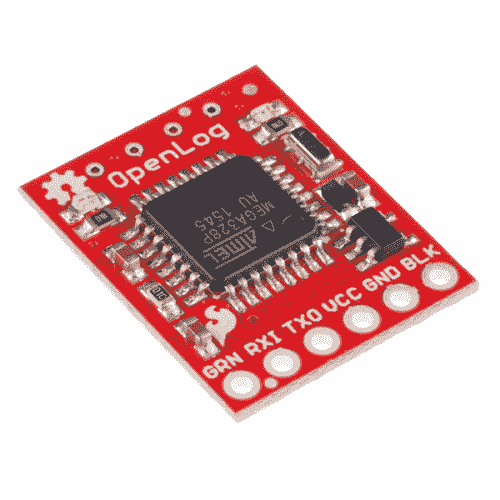
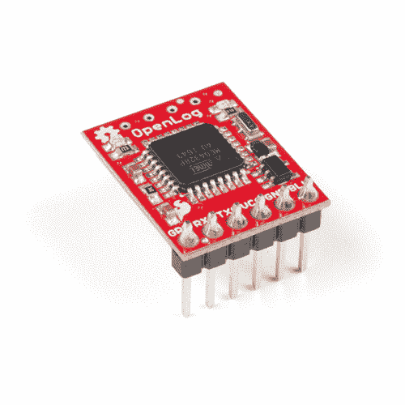

# OpenLog 连接指南

> 原文：<https://learn.sparkfun.com/tutorials/openlog-hookup-guide>

## 介绍

**Heads up!** This tutorial is for the Open Log for serial UART [ [DEV-13712](https://www.sparkfun.com/products/13712) ]. If you are using the Qwiic OpenLog for I²C [ [DEV-15164](https://www.sparkfun.com/products/15164) ], please refer to the [Qwiic OpenLog Hookup Guide](https://learn.sparkfun.com/tutorials/qwiic-openlog-hookup-guide).

OpenLog 数据记录器是一个简单易用的开源解决方案，用于记录项目中的串行数据。OpenLog 提供了一个简单的串行接口，用于将项目数据记录到 microSD 卡中。

 

将**添加到您的[购物车](https://www.sparkfun.com/cart)中！**

**[In stock](https://learn.sparkfun.com/static/bubbles/ "in stock") DEV-13712

SparkFun OpenLog 可以存储或“记录”大量的串行数据，并充当某种黑匣子。

$16.9522[Favorited Favorite](# "Add to favorites") 87[Wish List](# "Add to wish list")**** 

将**添加到您的[购物车](https://www.sparkfun.com/cart)中！**

### [带标题的 spark fun OpenLog](https://www.sparkfun.com/products/13955)

[In stock](https://learn.sparkfun.com/static/bubbles/ "in stock") DEV-13955

SparkFun OpenLog 带有标题，可以存储或“记录”大量的串行数据，并充当各种黑匣子。

$17.502[Favorited Favorite](# "Add to favorites") 7[Wish List](# "Add to wish list")********no product found

### 所需材料

为了全面完成本教程，您将需要以下部分。你可能不需要所有的东西，这取决于你拥有什么。将它添加到您的购物车，通读指南，并根据需要调整购物车。****