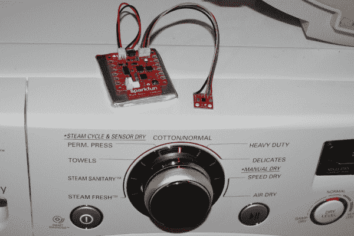
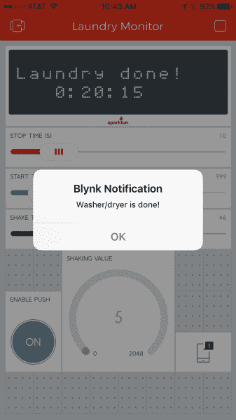

# Blynk 板洗衣机/烘干机警报

> 原文：<https://learn.sparkfun.com/tutorials/blynk-board-washerdryer-alarm>

## 介绍

我们创建了 [SparkFun Blynk 板](https://www.sparkfun.com/products/13794)来解决问题。大问题——比如[保持植物健康](https://learn.sparkfun.com/tutorials/blynk-board-project-guide/project-12-botanitweeting)——以及更接近“第一世界”的问题——比如电话报警洗衣监控器。

本教程演示如何将 Blynk 板与一个 [MMA8452Q 加速度计分线点](https://www.sparkfun.com/products/12756)配对，以创建一个振动感应洗衣监控器。一旦洗衣完成，电子设备将通过 Wi-Fi 与 [Blynk 应用](http://blynk.cc)通信，向你的手机发送**推送通知**。

Blynk 板和应用程序将让您尽可能快速高效地完成洗衣日！

### 所需材料

下面的愿望清单包括所有的电子和组件，你需要遵循本教程: