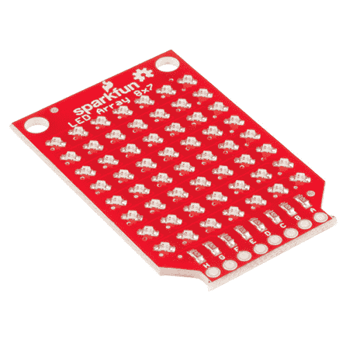

# SparkFun LED 阵列(8x7)连接指南

> 原文：<https://learn.sparkfun.com/tutorials/sparkfun-led-array-8x7-hookup-guide>

## 介绍

[LED 阵列(8x7)](https://www.sparkfun.com/products/13795) 是一组排列在一个漂亮的 8x7 网格中的 56 个 LED。它依靠 [Charlieplexing](https://en.wikipedia.org/wiki/Charlieplexing) 来控制单个 led，这意味着使用更少的 GPIO 引脚(与传统的[网格格式](http://www.appelsiini.net/2011/how-does-led-matrix-work)相反)。本指南将指导您连接 LED 阵列，并使用一些代码示例来点亮这些 LED。我们甚至编写了一个库来帮助你显示一些简单的图形和滚动文本！

**IMPORTANT:** For the time being, the library for this board only supports ATmega 168 and 328-based Arduinos (e.g. UNO, RedBoard, Pro, Pro Mini, etc.). You can still use the LED Array board with other platforms, just not the library. 

### [SparkFun LED 阵列- 8x7](https://www.sparkfun.com/products/retired/13795)

[Retired](https://learn.sparkfun.com/static/bubbles/ "Retired") COM-13795

SparkFun LED 阵列是一组 56 个红色 LED，排列在一个漂亮的 8x7 网格中。这个小板子需要八个针脚，而 l…

3 **Retired**[Favorited Favorite](# "Add to favorites") 23[Wish List](# "Add to wish list")

[https://www.youtube.com/embed/ohewJ9sTfwM/?autohide=1&border=0&wmode=opaque&enablejsapi=1](https://www.youtube.com/embed/ohewJ9sTfwM/?autohide=1&border=0&wmode=opaque&enablejsapi=1)

### 所需材料

要遵循本指南，您将需要以下附加部件: